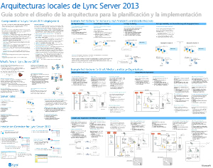
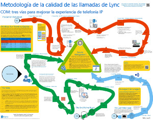
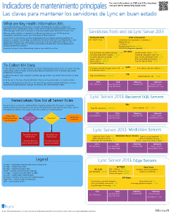
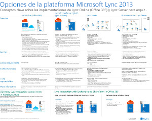

# Diagramas técnicos para Lync Server 2013Technical diagrams for Lync Server 2013

 

_**Última modificación del tema:** 2014-03-14__**Topic Last Modified:** 2014-03-14_

**Resumen:** estos diagramas proporcionan representaciones visuales de soluciones recomendadas para Lync 2013.**Summary:** These diagrams provide visual representations of recommended solutions for Lync 2013.

Estos recursos están disponibles en formato Visio (. VSD) (Visio 2010 o Visio 2013) y en formato PDF.These resources are available in Visio (.vsd) format (Visio 2010 or Visio 2013) and PDF format. Para obtener información sobre cómo imprimir documentos, vea sugerencias para imprimir pósteres.For information about how to print documents, see Tips for printing posters.

Es posible que necesite software adicionales para visualizar estos archivos. Consulte la tabla siguiente para obtener más información.You might need additional software to view these files. See the following table for more information.

<table>
<colgroup>
<col style="width: 50%" />
<col style="width: 50%" />
</colgroup>
<thead>
<tr class="header">
<th>Tipo de archivoFile type</th>
<th>SoftwareSoftware</th>
</tr>
</thead>
<tbody>
<tr class="odd">
<td>
. VSD.vsd
</td>
<td>
Visio 2010, Visio 2013 o el <a href="https://go.microsoft.com/fwlink/?linkid=393676">Visor gratuito de Visio</a>Visio 2010, Visio 2013, or the <a href="https://go.microsoft.com/fwlink/?linkid=393676">free Visio viewer</a>

Si usa el visor de Visio, haga clic con el botón derecho en el vínculo VSD, haga clic en <strong>Guardar destino como</strong>, guarde el archivo en su equipo y, después, ábralo desde allí.If you use the Visio viewer, right-click the VSD link, click <strong>Save Target As</strong>, save the file to your computer, and then open the file from your computer.
</td>
</tr>
<tr class="even">
<td>
.pdf.pdf
</td>
<td>
Cualquier visor de PDF, como <a href="https://go.microsoft.com/fwlink/?linkid=393675">Adobe Reader</a>Any PDF viewer, such as <a href="https://go.microsoft.com/fwlink/?linkid=393675">Adobe Reader</a>
</td>
</tr>
<tr class="odd">
<td>
.zip.zip
</td>
<td>
Cualquier utilidad de compresión de archivos.Any file compression utility. Windows 7 y 8 abren estos archivos de forma nativa.Windows 7 and 8 open these files natively.
</td>
</tr>
</tbody>
</table>

## CartelPosters

Estos pósteres detallan un área técnica específica y están pensados para usarlos con los artículos correspondientes de TechNet o contenido disponible en el centro de descarga.These posters detail a specific technical area, and are intended to be used with corresponding articles on TechNet or content available on the download center.

<table>
<colgroup>
<col style="width: 50%" />
<col style="width: 50%" />
</colgroup>
<thead>
<tr class="header">
<th>TítuloTitle</th>
<th>DescripciónDescription</th>
</tr>
</thead>
<tbody>
<tr class="odd">
<td>
<strong>Lync Server 2013 arquitecturas locales</strong><strong>Lync Server 2013 On-Premises Architectures</strong>

<a href="https://go.microsoft.com/fwlink/?linkid=392974">Acerque el póster en detalle con zoom.it de Microsoft</a>(recomendado en equipos de escritorio o portátiles)<a href="https://go.microsoft.com/fwlink/?linkid=392974">Zoom into the poster in full detail with Zoom.it from Microsoft</a>(best on desktop or laptop computers)

<a href="https://go.microsoft.com/fwlink/?linkid=392578">Versión en PDF</a> (recomendado en dispositivos móviles o tabletas)<a href="https://go.microsoft.com/fwlink/?linkid=392578">PDF version</a> (best for mobile devices or tablet computers)

<a href="https://go.microsoft.com/fwlink/?linkid=392579">Versión de Visio</a> (recomendado para usuarios con Visio)<a href="https://go.microsoft.com/fwlink/?linkid=392579">Visio version</a> (best for users with Visio)
</td>
<td>
Póster proporciona instrucciones arquitectónicas para la planeación y la implementación.Poster provides architectural guidance for planning and deployment. El póster contiene información sobre los componentes comunes de Lync Server, la terminología que se usa al planear una implementación, nuevas características, roles de servidor e información general de la instalación.The poster contains information about common components of Lync Server, terminology used when planning a deployment, new features, server roles, and an installation overview. Además, el póster contiene arquitecturas de ejemplo para aumentar la alta disponibilidad y la recuperación ante desastres, así como para topologías de ejemplo pequeñas, medianas y grandes.In addition the poster contains example architectures for increasing high availability and disaster recovery as well as small, medium, and large sample topologies.

Tamaño: 34 por 44 pulgadasSize: 34-by-44 inch

Este póster se creó con Visio 2013.This poster was created using Visio 2013. No se necesita ninguna modificación para un entorno específico.No modification should be needed for a specific environment.
</td>
</tr>
<tr class="even">
<td>
<strong>Metodología de calidad de llamadas de Lync</strong><strong>Lync Call Quality Methodology</strong>

<a href="https://go.microsoft.com/fwlink/?linkid=392972">Acerque el póster en detalle con zoom.it de Microsoft</a>(recomendado en equipos de escritorio o portátiles)<a href="https://go.microsoft.com/fwlink/?linkid=392972">Zoom into the poster in full detail with Zoom.it from Microsoft</a>(best on desktop or laptop computers)

<a href="https://go.microsoft.com/fwlink/?linkid=391841">Versiones de Visio y PDF juntas en un archivo. zip</a><a href="https://go.microsoft.com/fwlink/?linkid=391841">Visio and PDF versions together in a .zip file</a>
</td>
<td>
Póster que describe la solución de problemas del sistema Lync, especialmente para los problemas que afectan a la calidad de voz empresarial.Poster describing Lync system troubleshooting, especially for issues affecting enterprise voice quality. Use este póster con:Use this poster with:

<ul>
<li>
<a href="https://go.microsoft.com/fwlink/p/?linkid=390677">Guía de redes de Lync Server</a><a href="https://go.microsoft.com/fwlink/p/?linkid=390677">Lync Server Networking Guide</a>
</li>
<li>
<a href="lync-server-2013-poster-lync-call-quality-methodology.md">Metodología de calidad de llamadas de Lync en Lync Server 2013</a> (artículo de accesibilidad)<a href="lync-server-2013-poster-lync-call-quality-methodology.md">Lync Call Quality Methodology in Lync Server 2013</a> (accessibility article)
</li>
<li>
<a href="lync-server-2013-poster-key-health-indicators.md">Indicadores de estado clave en Lync Server 2013</a> (artículo de accesibilidad)<a href="lync-server-2013-poster-key-health-indicators.md">Key Health Indicators in Lync Server 2013</a> (accessibility article)
</li>
</ul>

Tamaño: 34 por 44 pulgadasSize: 34-by-44 inch

Este póster se creó con Visio 2010.This poster was created using Visio 2010. No se necesita ninguna modificación para un entorno específico.No modification should be needed for a specific environment.
</td>
</tr>
<tr class="odd">
<td>
<strong>Indicadores de estado clave</strong><strong>Key Health Indicators</strong>

<a href="https://go.microsoft.com/fwlink/?linkid=392971">Acerque el póster en detalle con zoom.it de Microsoft</a>(recomendado en equipos de escritorio o portátiles)<a href="https://go.microsoft.com/fwlink/?linkid=392971">Zoom into the poster in full detail with Zoom.it from Microsoft</a>(best on desktop or laptop computers)

<a href="https://go.microsoft.com/fwlink/?linkid=391838">Versiones de Visio y PDF juntas en un archivo. zip</a><a href="https://go.microsoft.com/fwlink/?linkid=391838">Visio and PDF versions together in a .zip file</a>
</td>
<td>
Póster que describe las métricas de solución de problemas del servidor para el estado básico del servidor y el rol de un servidor determinado en la implementación de Lync.Poster describing server troubleshooting metrics both for basic server health and for a given server’s role in the Lync implementation. Use este póster con:Use this poster with:

<ul>
<li>
<a href="https://go.microsoft.com/fwlink/p/?linkid=390677">Guía de redes de Lync Server</a><a href="https://go.microsoft.com/fwlink/p/?linkid=390677">Lync Server Networking Guide</a>
</li>
<li>
<a href="lync-server-2013-poster-lync-call-quality-methodology.md">Metodología de calidad de llamadas de Lync en Lync Server 2013</a> (artículo de accesibilidad)<a href="lync-server-2013-poster-lync-call-quality-methodology.md">Lync Call Quality Methodology in Lync Server 2013</a> (accessibility article)
</li>
<li>
<a href="lync-server-2013-poster-key-health-indicators.md">Indicadores de estado clave en Lync Server 2013</a> (artículo de accesibilidad)<a href="lync-server-2013-poster-key-health-indicators.md">Key Health Indicators in Lync Server 2013</a> (accessibility article)
</li>
</ul>

Tamaño: 17 por 22 pulgadasSize: 17-by-22 inch

Este póster se creó con Visio 2010.This poster was created using Visio 2010. No se necesita ninguna modificación para un entorno específico.No modification should be needed for a specific environment.
</td>
</tr>
<tr class="even">
<td>
<strong>Opciones de plataforma para Lync 2013</strong><strong>Lync 2013 Platform Options</strong>

<a href="https://go.microsoft.com/fwlink/p/?linkid=391840">Ampliar el póster en detalle con Zoom.it de Microsoft</a><a href="https://go.microsoft.com/fwlink/p/?linkid=391840">Zoom into the poster in full detail with Zoom.it from Microsoft</a>

<a href="https://go.microsoft.com/fwlink/p/?linkid=391837">Versión en PDF</a> (recomendado en dispositivos móviles o tabletas)<a href="https://go.microsoft.com/fwlink/p/?linkid=391837">PDF version</a> (best for mobile devices or tablet computers)

<a href="https://go.microsoft.com/fwlink/p/?linkid=391839">Versión de Visio</a> (recomendado para usuarios con Visio)<a href="https://go.microsoft.com/fwlink/p/?linkid=391839">Visio version</a> (best for users with Visio)
</td>
<td>
En este póster se describen las opciones de plataforma disponibles para Lync 2013 a los clientes y arquitectos que pueden elegir de Lync Online con Office 365, Hybrid Lync, Lync Server local y Lync hospedado.This poster describes the available platform options for Lync 2013 to BDMs and architects  Customers can choose from Lync Online with Office 365, Hybrid Lync, Lync Server on-premises and Hosted Lync. El póster incluye información detallada sobre cada opción de arquitectura, incluidos los escenarios más adecuados para cada una, los requisitos de licencia y las responsabilidades de los profesionales de TI.The poster includes details of each architectural option, including the most ideal scenarios for each, the license requirements and IT Pro responsibilities.

Tamaño: 34 por 44 pulgadasSize: 34-by-44 inch

Este póster se creó con Visio 2013.This poster was created using Visio 2013. No se necesita ninguna modificación para un entorno específico.No modification should be needed for a specific environment.
</td>
</tr>
<tr class="odd">
<td>
<strong>Cargas de trabajo del protocolo 2013 de Microsoft Lync Server</strong><strong>Microsoft Lync Server 2013 Protocol Workloads</strong>

<a href="https://go.microsoft.com/fwlink/?linkid=392970">Ampliar el póster en detalle con Zoom.it de Microsoft</a><a href="https://go.microsoft.com/fwlink/?linkid=392970">Zoom into the poster in full detail with Zoom.it from Microsoft</a>

<a href="https://go.microsoft.com/fwlink/?linkid=392512">Versión en PDF</a> (recomendado en dispositivos móviles o tabletas)<a href="https://go.microsoft.com/fwlink/?linkid=392512">PDF version</a> (best for mobile devices or tablet computers)

<a href="https://go.microsoft.com/fwlink/?linkid=392513">Versión de Visio</a> (recomendado para usuarios con Visio)<a href="https://go.microsoft.com/fwlink/?linkid=392513">Visio version</a> (best for users with Visio)
</td>
<td>
Descargue este póster para conocer las capacidades y los requisitos de Lync 2013, Lync Phone, Lync Web App, Lync para Mac y Lync Mobile w.Download this poster to understand the capabilities and requirements of Lync 2013, Lync Phone, Lync Web App, Lync for Mac, and Lync Mobile w. Vea cómo las cargas de trabajo de Lync Server facilitan la comunicación en una organización.See how Lync Server workloads facilitate communication across an organization.

Tamaño: 24 x 36 pulgadasSize: 24-by-36 inch

Este póster se creó con Visio 2013.This poster was created using Visio 2013. No se necesita ninguna modificación para un entorno específico.No modification should be needed for a specific environment.
</td>
</tr>
</tbody>
</table>

## Consejos para imprimir los pósteresTips for printing posters

Si tiene un trazador, puede imprimir estos pósteres a tamaño completo. Si no tiene un trazador, siga estos pasos para imprimir en un papel de tamaño más reducido.If you have a plotter, you can print these posters in their full size. If you don't have plotter, use the following steps to print on smaller paper.

**Impresión de pósteres en papel de tamaño reducido****Print posters on smaller paper**

1.  Abra el póster en Visio.Open the poster in Visio.

2.  En el menú **Archivo**, haga clic en **Configurar página**.On the **File** menu, click **Page Setup**.

3.  En la ficha **Configurar impresión**, en la sección **Papel de la impresora**, seleccione el tamaño del papel en el que desee imprimir.On the **Print Setup** tab, in the **Printer paper** section, select the size of paper you want to print on.

4.  En la ficha **Configurar impresión**, en la sección **Zoom para imprimir**, haga clic en **Ajustar a** y, a continuación, escriba **1 hoja a lo ancho por 1 hoja a lo largo**.On the **Print Setup** tab, in the **Print zoom** section, click **Fit to**, and then enter **1 sheet across by 1 sheet down**.

5.  En la ficha **Tamaño de página**, haga clic en **Ajustar al contenido del dibujo** y, a continuación, haga clic en **Aceptar**.On the **Page Size** tab, click **Size to fit drawing contents**, and then click **OK**.

6.  En el menú **Archivo**, haga clic en **Imprimir**.On the **File** menu, click **Print**.

 

