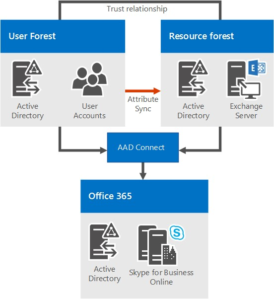

# <a name="system-requirements-for-skype-for-business-server-2019"></a>Requisitos del sistema para Skype empresarial Server 2019
 
**Resumen:** Prepárese para instalar Skype empresarial Server 2019 con este tema. El hardware, sistema operativo, software, bases de datos, certificados, Direto activo, DNS y fileshares se tratan en este artículo. Todos los requisitos y las recomendaciones del sistema están aquí para ayudar a garantizar una instalación y una implementación correctas de su granja de servidores.
  
Como cabría esperar, hay algunos preparativos que debe hacer antes de empezar a implementar Skype empresarial Server 2019. Este artículo lo guiará por el proceso de planificación de los siguientes elementos:
  
- [Hardware](system-requirements.md#Hardware)
  
- [Sistemas operativos](system-requirements.md#OS)
  
- [Software](system-requirements.md#Software)

- [Bases de datos SQL back end](system-requirements.md#DBs)
  
- [Active Directory](system-requirements.md#AD)
  
- [Sistema de nombre de dominio (DNS)](system-requirements.md#DNS)
  
- [Certificados](system-requirements.md#Certs)
  
- [Recurso compartido de archivos](system-requirements.md#Fileshare)

  
## <a name="hardware-for-skype-for-business-server-2019"></a>Hardware para Skype empresarial Server 2019
<a name="Hardware"> </a>

Una vez que haya desactivado su topología (y, si no es así, puede consultar el tema sobre los [conceptos básicos de la topología de Skype empresarial Server 2019](../../SfbServer/plan-your-deployment/topology-basics/topology-basics.md) ), es el momento de pensar en los servidores. Los servidores de Skype empresarial Server 2019 requieren hardware de 64 bits. Las recomendaciones de hardware se indican a continuación. No hay requisitos, pero reflejan los requisitos necesarios para un rendimiento óptimo. Existe documentación de planificación de la capacidad que le ayudará a determinar si necesita un equipo superior, dependiendo de sus circunstancias.
  
Hardware recomendado para servidores Standard Edition:

|**Componente de hardware**|**Recomendado**|
|:-----|:-----|
|CPU  <br/> |Intel Xeon E5-2673 V3 de doble procesador, 6 núcleo, 2,4 gigahercios (GHz) o superior.  <br/> Los procesadores Intel Itanium no son compatibles con los roles de 2019 de Skype empresarial Server.  <br/> |
|Memoria  <br/> |32 gigabytes (GB).  <br/> |
|Disco  <br/> |O  <br/> • 8 o más unidades de disco duro de 10000 RPM con un mínimo de 72 GB de espacio en disco (dos de los discos que usan RAID 1 y 6 con RAID 10).  <br/> O BIEN  <br/> • Unidades de estado sólido (SSDs) capaces de proporcionar el mismo espacio libre y un rendimiento similar a las unidades de disco mecánicas de 8 10000 RPM.  <br/> |
|Red  <br/> |1 adaptador de red de puerto doble, 1 Gbps o superior (pueden usarse dos adaptadores de red, pero es necesario formar con ellos un equipo con una sola dirección MAC y una sola dirección IP).  <br/> Las configuraciones dual o multitarjeta **no** son compatibles con los servidores front-end, los servidores back-end y los servidores Standard Edition. <br/> Siempre y cuando no se expongan al sistema operativo y se utilicen para supervisar y administrar el hardware del servidor, puede tener sistemas de administración fuera de banda, como DRAC o ILO. Este escenario no constituye un servidor de múltiples ubicaciones, y es un escenario compatible.  <br/> |


Hardware recomendado para servidores front-end y servidores back-end:
  
|**Componente de hardware**|**Recomendado**|
|:-----|:-----|
|CPU  <br/> |Intel Xeon E5-2673 V3 de doble procesador, 6 núcleo, 2,4 gigahercios (GHz) o superior. <br/> Los procesadores Intel Itanium no son compatibles con los roles de 2019 de Skype empresarial Server.  <br/> |
|Memoria  <br/> |64 gigabytes (GB).  <br/> |
|Disco  <br/> |O  <br/> • 8 o más unidades de disco duro de 10000 RPM con un mínimo de 72 GB de espacio en disco (dos de los discos que usan RAID 1 y 6 con RAID 10).  <br/> O BIEN  <br/> • Unidades de estado sólido (SSDs) capaces de proporcionar el mismo espacio libre y un rendimiento similar a las unidades de disco mecánicas de 8 10000 RPM.  <br/> |
|Red  <br/> |1 adaptador de red de puerto doble, 1 Gbps o superior (pueden usarse dos adaptadores de red, pero es necesario formar con ellos un equipo con una sola dirección MAC y una sola dirección IP).  <br/> Las configuraciones dual o multitarjeta **no** son compatibles con los servidores front-end, los servidores back-end y los servidores Standard Edition. <br/> Siempre y cuando no se expongan al sistema operativo y se utilicen para supervisar y administrar el hardware del servidor, puede tener sistemas de administración fuera de banda, como DRAC o ILO. Este escenario no constituye un servidor de múltiples ubicaciones, y es un escenario compatible.  <br/> |
   
Hardware recomendado para servidores perimetrales, servidores de mediación independientes y directores:
  
|**Componente de hardware**|**Recomendado**|
|:-----|:-----|
|CPU  <br/> |Intel Xeon E5-2673 V3 de doble procesador, 6 núcleo, 2,4 gigahercios (GHz) o superior.  <br/> Los procesadores Intel Itanium no son compatibles con los roles de 2019 de Skype empresarial Server.  <br/> |
|Memoria  <br/> |32 gigabytes.  <br/> |
|Disco  <br/> |O  <br/> • 4 unidades de disco duro de 10000 RPM con un mínimo de 72 GB de espacio libre en el disco (los discos deben tener una configuración RAID 1 2x).  <br/> O BIEN  <br/> • Unidades de estado sólido (SSDs) capaces de proporcionar el mismo espacio libre y un rendimiento similar a las unidades de disco mecánicas de 4 10000 RPM.  <br/> |
|Red  <br/> |1 adaptador de red de puerto doble, 1 Gbps o superior (pueden usarse dos adaptadores de red, pero es necesario formar con ellos un equipo con una sola dirección MAC y una sola dirección IP).  <br/> **No** se admiten las configuraciones dual o multitarjeta para los directores y servidores de interoperabilidad. <br/> Los servidores Edge necesitan dos interfaces de red que sean adaptadores de red de puerto doble, 1 Gbps o superior (o dos adaptadores de red emparejados para un total de cuatro; cada pareja debe formar un equipo con una sola dirección MAC y una sola dirección IP, para un total de dos parejas).  <br/> En los servidores de mediación independiente, se admite la instalación de tarjetas de interfaz de red (NICs) adicionales para permitir la configuración de una dirección IP de RTC específica.  <br/> |


> [!NOTE]
> Independientemente del rol de servidor, también recomendamos la siguiente configuración de hardware para Skype empresarial Server 2019 (esto puede variar según la marca de hardware que haya comprado, por lo que debe consultar la documentación del fabricante para obtener información específica):
> - Configuración de BIOS: debe establecerse en sin relieve desde NUMA.
> - Habilitar el hyperthreading.
> - La configuración de la cola RSS debe establecerse en 8 Queue.

   
## <a name="operating-systems-for-skype-for-business-server-2019"></a>Sistemas operativos para Skype empresarial Server 2019
<a name="OS"> </a>

Una vez que haya instalado el hardware, tendrá que instalar el sistema operativo (SO) que le permitirá instalar y usar correctamente Skype empresarial Server 2019.
  
|||
|:-----|:-----|
|Windows Server 2019 <br/> |
|Windows Server 2016 <br/> ||
||
   
Todo lo que no sean los sistemas operativos mencionados aquí no funcionará correctamente; no lo pruebe para instalar Skype empresarial Server 2019. Por ejemplo, la opción Server Core no aparece en la lista y, por lo tanto, no es compatible.  Nota: la actualización en contexto del sistema operativo no es compatible con Lync Server 2013.  Debe implementar un grupo independiente y migrar usuarios al nuevo grupo con un sistema operativo de diferencias.

> [!NOTE]
> 
> Si va a instalar el centro de administración de Windows 2019 en el equipo con Windows Server 2019, le pedirá un puerto para escucharlo. Hay un liklihood es posible que elija el puerto 443, pero si ese equipo tiene instalado Skype empresarial Server 2019 o va a tener instalado Skype empresarial Server 2019, entonces debe elegir un número de puerto diferente.
> 
>¿Por qué sucede esto? Si el centro de administración de Windows 2019 se está ejecutando en el puerto 443, no podrá conectarse al servidor mediante el panel de control de Skype para empresas ni podrá conectarse a ningún servicio Web interno que se esté ejecutando en el servidor (servicio Web de libreta de direcciones , Servicio Detección automática, servicio webvales, etc.).  De hecho, no podrá conectarse a ninguna dirección URL de servicio web interna. Elija un puerto diferente, en el caso de que necesite o quiera colocar el centro de administración de Windows 2019 en un servidor con Skype empresarial Server 2019.
> 

  
## <a name="software-that-should-be-installed-before-a-skype-for-business-server-2019-deployment"></a>Software que debe instalarse antes de una implementación de Skype empresarial Server 2019
<a name="Software"> </a>

Hay algunas cosas que tendrá que instalar o configurar para cualquier servidor que ejecute Skype empresarial Server 2019. Estos se enumeran a continuación, seguidos de los requisitos adicionales para roles de servidor específicos.

> [!IMPORTANT]
> Skype empresarial 2019 es compatible con .NET Framework 4,8. 
  
 **Todos los servidores:**
  
|**Software o rol**|**Detalles**|
|:-----|:-----|
|Windows PowerShell 3.0  <br/> |Todos los servidores de Skype empresarial Server necesitan Windows PowerShell 3,0 instalado.  <br/> • Debe instalarse de forma predeterminada con Windows Server 2016.<br/> |
|Microsoft .NET Framework  <br/> |Servicios WCF es una **característica** que se instala como una característica de Windows, en **Administrador del servidor**, inicialmente no se necesitan descargas. <br/> • Debe asegurarse de que, cuando instale esta característica, o si ya está instalada y que la está comprobando, que la opción de **activación de http** también está activada e instalada, así: <br/>  <br/> No te preocupes si recibes una ventana emergente adicional que te indica que es necesario instalar otras cosas para que se instale la activación de HTTP. Eso es normal; Haga clic en aceptar y siga adelante. Si no obtienes esta ventana emergente, puedes suponer que las cosas ya están instaladas y continuar.  <br/> Microsoft .NET Framework se instala normalmente cuando Windows Server 2016 está instalado. Sin embargo, Skype empresarial Server requiere Microsoft .NET Framework 4,7 o 4,8, por lo que es probable que tenga que actualizarlo. Puede encontrar la actualización [aquí](https://support.microsoft.com/help/3186497/the-net-framework-4-7-offline-installer-for-windows/)<br/> |
|Media Foundation  <br/> |Para Windows Server 2016, el tiempo de ejecución de Windows Media Format se instala con Microsoft Media Foundation.  <br/> Todos los servidores front-end y los servidores Standard Edition usados en las conferencias requieren que el Windows Media Format Runtime ejecute los archivos de audio de Windows Media (. WMA) que las aplicaciones de los grupos estacionamiento, anuncio y respuesta de llamadas se reproducen para anuncios y música.  <br/> |
|Windows Identity Foundation  <br/> |Necesitamos Windows Identity Foundation 3,5 para admitir escenarios de autenticación de servidor a servidor para Skype empresarial Server 2019.  <br/> • Para Windows Server 2016, no es necesario descargar nada. Abra el **Administrador de servidores** y vaya a **Asistente para agregar roles y características**. **Windows Identity Foundation 3.5** aparece en la sección **Características**. Si está seleccionado, eres bueno. De lo contrario, selecciónelo y haga clic en **siguiente** para ir al botón **instalar** . <br/> |
|Herramientas de administración remota del servidor  <br/> |Herramientas de administración de roles: herramientas AD DS y AD LDS  <br/> |
   
 **Los servidores front-end y el servidor Standard Edition también necesitan:**
  
|**Software o rol**|**Detalles**|
|:-----|:-----|
|Servicios de Internet Information Server (IIS)  <br/> |IIS es necesario en todos los servidores front-end, así como en todos los servidores Standard Edition, con los siguientes módulos seleccionados:  <br/> • Características HTTP comunes: documento predeterminado, errores HTTP, contenido estático  <br/> • Salud y diagnóstico: registro HTTP, herramientas de registro, seguimiento  <br/> • Rendimiento: compresión de contenido estático, compresión de contenido dinámico  <br/> • Seguridad: filtrado de solicitud, autenticación de asignación de certificado de cliente, autenticación de Windows  <br/> • Desarrollo de aplicaciones: extensibilidad de .NET 3,5, extensibilidad de .NET 4,5, ASP.NET 3,5, ASP.NET 4,5, extensiones ISAPI, Filtros ISAPI  <br/> • Herramientas de administración: consola de administración de IIS, scripts y herramientas de administración de IIS  <br/> Tenga en cuenta que también se necesita acceso anónimo, pero esto se obtiene al instalar IIS, de modo que no tiene un lugar para seleccionarlo en la lista.  <br/> |
|Motor en tiempo de ejecución de Windows Media Format  <br/> | Para Windows Server 2016, tendrá que instalar la característica **Media Foundation** en el **Administrador del servidor**. En realidad, puede iniciar la instalación de Skype empresarial Server 2019 sin ello, pero se le solicitará que lo instale y, a continuación, debe reiniciar el servidor, antes de que la instalación de Skype empresarial Server 2019 continúe. Es mejor hacerlo por adelantado. <br/> |
|Silverlight  <br/> |Puede instalar la última versión de Silverlight [aquí](https://www.microsoft.com/silverlight/).  <br/> |
   
A modo de ayuda, aquí ofrecemos un script de ejemplo de PowerShell que puede ejecutar para automatizar esto:
  
```PowerShell
Add-WindowsFeature RSAT-ADDS, Web-Server, Web-Static-Content, Web-Default-Doc, Web-Http-Errors, Web-Asp-Net, Web-Net-Ext, Web-ISAPI-Ext, Web-ISAPI-Filter, Web-Http-Logging, Web-Log-Libraries, Web-Request-Monitor, Web-Http-Tracing, Web-Basic-Auth, Web-Windows-Auth, Web-Client-Auth, Web-Filtering, Web-Stat-Compression, Web-Dyn-Compression, NET-WCF-HTTP-Activation45, Web-Asp-Net45, Web-Mgmt-Tools, Web-Scripting-Tools, Web-Mgmt-Compat, Windows-Identity-Foundation, Server-Media-Foundation, Telnet-Client, BITS, ManagementOData, Web-Mgmt-Console, Web-Metabase, Web-Lgcy-Mgmt-Console, Web-Lgcy-Scripting, Web-WMI, Web-Scripting-Tools, Web-Mgmt-Service
```

 **Los directores también necesitan:**
  
IIS, con los siguientes módulos seleccionados:
  
- Características HTTP comunes
    
  - Documento predeterminado
    
  - Errores HTTP
    
  - Contenido estático
    
- Estado y diagnóstico
    
  - Registro HTTP
    
  - Herramientas de registro
    
  - Seguimiento
    
- Rendimiento
    
  - Compresión de contenido estático
    
- Seguridad
    
  - Filtro de solicitudes
    
  - Autenticación por asignación de certificados de clientes
    
  - Autenticación de Windows
    
- Desarrollo de aplicaciones
    
  - Extensibilidad de .NET 3.5
    
  - Extensibilidad de .NET 4.5
    
  - ASP.NET 3.5
    
  - ASP.NET 4.5
    
  - Extensión ISAPI
    
  - Filtros ISAPI
    
(Si se lo está preguntando, el mismo módulo es el mismo que el de los servidores front-end y los servidores Standard Edition, con las herramientas de administración y compresión de contenido dinámico que han salido).
  
También contamos con el siguiente código de PowerShell para esto:
  
```PowerShell
Add-WindowsFeature RSAT-ADDS, Web-Server, Web-Static-Content, Web-Default-Doc, Web-Http-Errors, Web-Asp-Net, Web-Net-Ext, Web-ISAPI-Ext, Web-ISAPI-Filter, Web-Http-Logging, Web-Log-Libraries, Web-Request-Monitor, Web-Http-Tracing, Web-Basic-Auth, Web-Windows-Auth, Web-Client-Auth, Web-Filtering, Web-Stat-Compression, NET-WCF-HTTP-Activation45, Web-Asp-Net45, Web-Scripting-Tools, Web-Mgmt-Compat, Server-Media-Foundation, Telnet-Client
```

## <a name="back-end-databases-that-will-work-with-skype-for-business-server-2019"></a>Bases de datos back-end que funcionarán con Skype empresarial Server 2019
<a name="DBs"> </a>

Al instalar Skype empresarial Server 2019 Standard Edition, tendrá SQL Server 2016 Express (64-bit Edition).

Skype empresarial Server 2019 Enterprise Edition necesitará SQL Server completo, como se indica a continuación (solamente la edición de 64 bits; no use las ediciones de 32 bits):
  
||||
|:-----|:-----|:-----|
|Microsoft SQL Server 2019 (edición de 64 bits) y debe ejecutar las actualizaciones más recientes.  <br/> |Microsoft SQL Server 2017 (edición de 64 bits) y debe ejecutar las actualizaciones más recientes.  <br/> |
Microsoft SQL Server 2016 (edición de 64 bits) y debe ejecutar las actualizaciones más recientes.|
 |

Si no ve la edición de SQL Server que quiere usar en la lista, no puede usarla.
  
> [!NOTE]
> También necesita instalar SQL Server Reporting Services para la función de servidor de supervisión. 
  
### <a name="sql-clustering-and-sql-always-on"></a>Clúster SQL y SQL Always on

El clúster de SQL con Skype empresarial Server 2019 es compatible. Si desea configurar la organización en clústeres de SQL, eso se hace en SQL Server.
  
Asegúrese de tener una configuración de activo/pasivo para la organización en clústeres de SQL, que es compatible. No comparta el nodo pasivo con ninguna otra instancia de SQL.
  
Puede usar lo siguiente para el clúster de conmutación por error:
  
Dos nodos:
  
- Microsoft SQL Server 2019 Standard (edición de 64 bits) y le recomendamos que ejecute el Service Pack más reciente.
- Microsoft SQL Server 2017 Standard (edición de 64 bits) y le recomendamos que ejecute el Service Pack más reciente.
- Microsoft SQL Server 2016 Standard (edición de 64 bits) y le recomendamos que ejecute el Service Pack más reciente.

Dieciséis nodos:
  
- Microsoft SQL Server 2019 Enterprise (64-bit Edition) y le recomendamos que ejecute el Service Pack más reciente.
- Microsoft SQL Server 2017 Enterprise (64-bit Edition) y le recomendamos que ejecute el Service Pack más reciente.
- Microsoft SQL Server 2016 Enterprise (64-bit Edition) y le recomendamos que ejecute el Service Pack más reciente.

SQL Always on es compatible y puede obtener más información sobre él en la [alta disponibilidad del servidor back-end en Skype empresarial server 2019](../../SfbServer/plan-your-deployment/high-availability-and-disaster-recovery/back-end-server.md).
  

###  <a name="additional-server-installation-recommendations"></a>Recomendaciones para la instalación de servidores adicionales:
  
No instale ningún software de cliente de Microsoft Internet Security and Acceleration (ISA) Server u otro software de proveedores de servicios de niveles (LSP) Winsock (los firewalls de terceros o el software de inspección de redes antivirus se incluirán aquí). cualquiera de los servidores front-end o servidores de mediación independiente. Se ha visto un bajo rendimiento del tráfico de medios cuando se instala el software.
  

## <a name="active-directory"></a>Active Directory
<a name="AD"> </a>

Aunque muchos de los datos de configuración de los servidores y los servicios se almacenan en el almacén de administración central de Skype empresarial Server 2019, hay algunas cosas aún almacenadas en Active Directory:
  
|**Objetos de Active Directory**|**Tipos de objeto**|
|:-----|:-----|
|Extensiones de esquema  <br/> |Extensiones de objetos de usuario  <br/> |
||Extensiones de Skype empresarial Server 2015 y Lync Server 2013, para mantener la compatibilidad con las versiones anteriores compatibles  <br/> |
|Datos  <br/> |URI de SIP del usuario y otros parámetros de usuario  <br/> |
||Objetos de contacto para aplicaciones (como la aplicación de grupo de respuesta y la aplicación de operador de conferencia)  <br/> |
||Datos publicados para la compatibilidad con versiones anteriores  <br/> |
||Un punto de control de servicio (SCP) para el almacén de administración central  <br/> |
||Cuenta de autenticación Kerberos (un objeto de equipo opcional)  <br/> |
   
### <a name="os-for-domain-controllers"></a>SO para controladores de dominio

Se pueden usar los siguientes sistemas operativos de controlador de dominio:
  
- Windows Server 2019

- Windows Server 2016
    
- Windows Server 2012 R2
    
- Windows Server 2012
    
El nivel funcional de dominio de cualquier dominio en el que se implemente Skype empresarial Server 2019 y el nivel funcional de bosque de cualquier bosque en el que se implemente Skype empresarial Server 2019 debe ser uno de los siguientes:
  
- Windows Server 2019

- Windows Server 2016
    
- Windows Server 2012 R2
    
- Windows Server 2012
    
¿Puede haber controladores de dominio de solo lectura en estos entornos? Seguro, siempre y cuando también haya controladores de dominio grabables disponibles.
  
Es importante saber que Skype empresarial Server 2019 no es compatible con los dominios con etiqueta única. ¿Qué son? Si tiene un dominio raíz con la etiqueta contoso. local, eso será adecuado. Si tiene un dominio raíz que simplemente tiene el nombre local, eso no funcionará y no se admitirá como resultado. Un poco más sobre esto se ha escrito [en este artículo de Knowledge Base](https://support.microsoft.com/kb/300684/).
  
Skype empresarial Server 2019 tampoco permite cambiar el nombre de los dominios. Si realmente tiene que cambiar el nombre de su dominio, tendrá que desinstalar Skype empresarial Server 2019, realizar el cambio de nombre de dominio y, a continuación, volver a instalar Skype empresarial Server 2019.
  
Por último, es posible que esté tratando con un dominio con un entorno AD DS bloqueado y eso es muy bueno. Tenemos más información sobre cómo implementar Skype empresarial Server 2019 en un entorno de AD DS bloqueado en la documentación de la implementación.
  
### <a name="ad-topologies"></a>Topologías de AD

Las topologías compatibles con Skype empresarial Server 2019 son:
  
- Un solo bosque con un solo dominio
    
- Un solo bosque con un solo árbol y varios dominios
    
- Un solo bosque con varios árboles y espacios de nombres separados
    
- Varios bosques en una topología de bosque central
    
- Varios bosques en una topología de bosque de recursos
    
- Varios bosques en una topología de bosque de recursos de Skype Empresarial con Exchange Online
    
- Varios bosques en una topología de bosque de recursos con Skype Empresarial Online y Azure Active Directory Connect
    
Disponemos de diagramas y descripciones para ayudarle a determinar qué topología tiene en su entorno o lo que necesita configurar antes de instalar Skype empresarial Server 2019. Para que sea simple, también incluimos una clave:
  

  
#### <a name="single-forest-with-single-domain"></a>Un solo bosque con un solo dominio


  
No es más fácil que esto; es un bosque de dominio único, una topología común.
  
#### <a name="single-forest-with-a-single-tree-and-multiple-domains"></a>Un solo bosque con un solo árbol y varios dominios


  
Este diagrama incluye también un único bosque, pero tiene también uno o más dominios secundarios (tres, en este ejemplo concreto). Por lo tanto, el dominio en el que se crean los usuarios puede ser diferente del dominio en el que se implementa Skype empresarial Server 2019. ¿Por qué esto es importante? Es importante recordar que al implementar un grupo de servidores front-end de Skype empresarial Server, todos los servidores de ese grupo deben estar en un solo dominio. Puede tener administración de dominios interrelacionados con la compatibilidad de Skype empresarial Server con los grupos de administración universal de Windows.
  
En el diagrama anterior, puede ver que los usuarios de un dominio pueden acceder a grupos de servidores de Skype empresarial desde el mismo dominio o desde diferentes dominios, incluso si esos usuarios están en un dominio secundario.
  
#### <a name="single-forest-with-multiple-trees-and-disjoint-namespaces"></a>Un solo bosque con varios árboles y espacios de nombres separados


  
Es posible que tenga una topología similar a la de este diagrama, en la que tiene un bosque, pero dentro de ese bosque hay varios dominios, con espacios de nombres independientes de AD. En este caso, este diagrama es una buena ilustración, ya que incluye usuarios de tres dominios diferentes que tienen acceso a Skype empresarial Server 2019. Las líneas continuas indican que acceden a un grupo de servidores de Skype empresarial en su propio dominio, mientras que una línea discontinua indica que van a un grupo en un árbol diferente.
  
Como puede ver, los usuarios del mismo dominio, el mismo árbol o incluso un árbol diferente pueden obtener acceso a los grupos correctamente.
  
#### <a name="multiple-forests-in-a-central-forest-topology"></a>Varios bosques en una topología de bosque central


  
Skype empresarial Server 2019 admite varios bosques configurados en una topología de bosque central. Si no está seguro de lo que tiene, el bosque central de la topología usa objetos en él para representar a los usuarios de otros bosques y hospeda cuentas de usuario para cualquier usuario del bosque.
  
¿Cómo funciona? Un producto de sincronización de directorios (como Forefront Identity Manager o FIM) administra las cuentas de usuario de su organización en su existencia. Cuando una cuenta se crea o elimina en un bosque, este cambio se sincroniza con el contacto correspondiente en el bosque central.
  
Obviamente, si su infraestructura de AD está implementada, es posible que no sea fácil cambiar a esta topología, pero si ya está allí o si aún no está planeando su infraestructura de bosque, puede ser una buena opción. Puede centralizar la implementación de Skype empresarial Server 2019 dentro de un único bosque, mientras los usuarios pueden buscar, comunicar y ver la presencia de otros usuarios en cualquier bosque. Todas las actualizaciones de contactos de usuarios se gestionan automáticamente con el software de sincronización.
  
#### <a name="multiple-forests-in-a-skype-for-business-resource-forest-topology"></a>Varios bosques en una topología de bosque de recursos de Skype Empresarial
<a name="BKMK_multipleforestopology"> </a>


  
También se admite una topología de bosque de recursos; es donde un bosque está dedicado a ejecutar las aplicaciones de servidor, como Microsoft Exchange Server y Skype empresarial Server 2019. Estos bosques de recursos también hospedan una representación sincronizada de objetos de usuario activos, pero no tienen cuentas de usuario habilitadas para el inicio de sesión. Por lo tanto, el bosque de recursos es un entorno de servicios compartidos para otros bosques en el que residen los objetos de usuario y tienen una relación de confianza de nivel de bosque con el bosque de recursos.
  
Tenga en cuenta que Exchange Server puede implementarse en el mismo bosque de recursos que Skype empresarial Server o en un bosque diferente.
  
Para implementar Skype empresarial Server 2019 en este tipo de topología, debe crear un objeto de usuario deshabilitado en el bosque de recursos para cada cuenta de usuario en los bosques de usuario (si Microsoft Exchange Server ya está en el entorno, esto podría hacerse por usted). A continuación, necesita una herramienta de sincronización de directorios (como Forefront Identity Manager o FIM) para administrar las cuentas de usuario a través de su ciclo de vida.
  
#### <a name="multiple-forests-in-a-skype-for-business-resource-forest-topology-with-exchange-online"></a>Varios bosques en una topología de bosque de recursos de Skype Empresarial con Exchange Online
<a name="BKMK_multipleforestopology"> </a>

Esta topología es similar a la descrita en [Varios bosques en una topología de bosque de recursos de Skype Empresarial](system-requirements.md#BKMK_multipleforestopology).
  
En esta topología, hay uno o varios bosques de usuarios y Skype empresarial Server se implementa en un bosque de recursos dedicado. Exchange Server se puede implementar en el entorno local en el mismo bosque de recursos o en un bosque diferente y configurar para un híbrido con Exchange Online, o los servicios de correo electrónico solo los puede proporcionar Exchange Online para las cuentas locales. No existe ningún diagrama disponible para esta topología.
  
#### <a name="multiple-forests-in-a-resource-forest-topology-with-skype-for-business-online-and-azure-active-directory-connect"></a>Varios bosques en una topología de bosque de recursos con Skype Empresarial Online y Azure Active Directory Connect
<a name="BKMK_multipleforestopology"> </a>


  
Con este escenario, hay varios bosques locales, con una topología de bosque de recursos. Hay una relación de total confianza entre los bosques de Active Directory. La herramienta Azure Active Directory Connect se utiliza para sincronizar cuentas entre los bosques de usuarios locales y Office 365.
  
 La organización también tiene Office 365 y usa [Azure Active Directory Connect](https://docs.microsoft.com/azure/active-directory/connect/active-directory-aadconnect) para sincronizar sus cuentas locales con Office 365. Los usuarios habilitados para Skype empresarial se habilitan a través de Office 365 y Skype empresarial online. Skype empresarial Server no está implementado localmente.
  
La autenticación de inicio de sesión único la proporciona una granja de servicios de Federación de Active Directory que se encuentra en el bosque de usuario.
  
En este escenario, se admite la implementación de Exchange local, Exchange Online, una solución híbrida de Exchange o no implementar Exchange. (El diagrama muestra solo Exchange local, pero las otras soluciones para Exchange también son totalmente compatibles).
  
#### <a name="multiple-forests-in-a-resource-forest-topology-with-hybrid-skype-for-business"></a>Varios bosques en una topología de bosque de recursos con una implementación híbrida de Skype Empresarial 
<a name="BKMK_multipleforestopology"> </a>

En este escenario, hay uno o varios bosques de usuarios locales, y Skype empresarial se implementa en un bosque de recursos dedicado y está configurado para el modo híbrido con Skype empresarial online. Exchange Server se puede implementar en el entorno local en el mismo bosque de recursos o en un bosque diferente, y se puede configurar para una implementación híbrida con Exchange Online. Como alternativa, Exchange Online puede proporcionar exclusivamente los servicios de correo electrónico para las cuentas locales.
  
Para obtener más información, vea [configurar un entorno de varios bosques para una implementación híbrida de Skype empresarial](../../SfbServer/skype-for-business-hybrid-solutions/deploy-hybrid-connectivity/configure-a-multi-forest-environment-for-hybrid.md).
  
## <a name="domain-name-system-dns"></a>Sistema de nombre de dominio (DNS)
<a name="DNS"> </a>

Skype empresarial Server 2019 requiere DNS, por los siguientes motivos:
  
- DNS permite que Skype empresarial Server 2019 detecte servidores o grupos de servidores internos, lo que permite la comunicación entre servidores.
    
- DNS permite que los equipos cliente descubran el grupo de servidores front-end o el servidor Standard Edition que se usa para las transacciones SIP.
    
- Asocia las direcciones URL sencillas para conferencias con los servidores que hospedan dichas conferencias.
    
- DNS permite que los usuarios externos y los equipos cliente se conecten a los servidores perimetrales, o el proxy inverso HTTP, para mensajería instantánea (mi) o conferencias.
    
- Permite que los dispositivos de comunicaciones unificadas (UC) que no estén registrados en descubran el grupo de servidores front-end o el servidor Standard Edition que ejecuta el servicio Web de actualización de dispositivos para obtener actualizaciones y enviar registros.
    
- El uso de DNS permitir que los clientes móviles detecten automáticamente recursos de servicios web sin que los usuarios tengan que escribir manualmente las direcciones URL en la configuración del dispositivo.
    
- Se usa en el equilibrio de carga de DNS.
    
Es importante tener en cuenta que Skype empresarial Server 2019 no admite nombres de dominio internacionalizados (IDNs).
  
Además, es muy importante recordar que cualquier nombre en DNS es idéntico al nombre de equipo configurado en cualquier servidor usado por Skype empresarial Server 2019. En concreto, no podemos tener ningún nombre corto en el entorno y deben tener FQDN para el generador de topología.
  
Es como si fuera lógico para cualquier equipo ya unido a un dominio, pero si tienes un servidor perimetral que no está unido a tu dominio, puede tener un valor predeterminado con un nombre corto, sin un sufijo de dominio. Asegúrese de que no es así, ya sea en DNS o en el servidor perimetral, o en cualquier servidor o grupo de servidores de Skype empresarial Server 2019.
  
No uses definitivamente caracteres Unicode o de subrayado. Los caracteres estándar (que son a-Z, a-z, 0-9 y guiones) son admitidos por entidades de certificación públicas y DNS externas (necesitará asignar FQDN al SN en el certificado; es importante que recuerde hacerlo), por lo que tendrá problemas si le asigna un nombre a Teniendo esto en mente desde el principio.
  
Si quiere más información sobre los requisitos de DNS para redes, consulte la sección [Networking](../../SfbServer/plan-your-deployment/network-requirements/network-requirements.md) de la documentación de planificación.
  
## <a name="certificates"></a>Certificados
<a name="Certs"> </a>

Unas de las cosas más importantes que puede hacer antes de la implementación es asegurarse de que sus certificados están en orden. Skype empresarial Server 2019 necesita una infraestructura de clave pública (PKI) para las conexiones de seguridad de la capa de transporte (TLS) y de seguridad de la capa de transporte mutuo (MTLS). Básicamente, para comunicarse con seguridad de forma estandarizada, Skype empresarial Server usa certificados emitidos por entidades de certificación (CA).
  
Estas son algunas de las cosas que Skype empresarial Server 2019 usa certificados para:
  
- Conexiones TLS entre clientes y servidores
    
- Conexiones MTLS entre servidores
    
- Federación mediante la detección automática de asociados de DNS
    
- Acceso de usuarios remotos a la mensajería instantánea (MI)
    
- Acceso de usuarios externos a sesiones de audio/vídeo (A/V), a uso compartido de aplicaciones y a conferencias
    
- Hablar con aplicaciones web y Outlook Web Access (OWA)
    
Por lo tanto, la planificación de certificados es imprescindible. Ahora, echemos un vistazo a una lista de algunas de las cosas que debe tener en cuenta al solicitar certificados:
  
- Todos los certificados de servidor deben admitir la autorización de servidor (EKU de servidor).
    
- Todos los certificados de servidor deben contener un punto de distribución CRL (CDP).
    
- Todos los certificados deben estar firmados mediante un algoritmo de firma compatible con el sistema operativo. Skype empresarial Server 2019 admite el conjunto de tamaños de compendio SHA-1 y SHA-2 (224, 256, 384 y 512 bits), y cumple o supera los requisitos del sistema operativo.
    
- La inscripción automática es compatible con los servidores internos que ejecutan Skype empresarial Server 2019.
    
- La inscripción automática no es compatible con los servidores perimetrales de Skype empresarial Server 2019.
    
> [!NOTE]
> No está permitido usar el algoritmo de firma RSASSA-PSS, ya que podría dar lugar a errores en problemas relacionados con el inicio de sesión y el desvío de llamadas, entre otros.  
  
- Se admiten longitudes de clave de cifrado de 1024, 2048 y 4096. Se recomienda usar longitudes de clave de 2048 y superiores.
    
- El algoritmo de firma hash o implícito predeterminado es RSA. También se admiten los algoritmos ECDH_P256, ECDH_P384 y ECDH_P521.
    
Eso es mucho sobre lo que hay que pensar y hay una variedad de niveles de comodidad con la solicitud de certificados a una entidad de certificación. A continuación, le daremos algunas instrucciones adicionales para que su planificación sea tan fácil como sea posible.
  
### <a name="certificates-for-your-internal-servers"></a>Certificados para los servidores internos

Necesitará certificados para la mayoría de los servidores internos y lo más probable es que los obtenga de una entidad emisora de certificados interna (es decir, una entidad de certificación ubicada en su dominio). Si lo desea, puede solicitar estos certificados a una entidad emisora de certificados externa (que se encuentra en Internet). Si está preguntando qué entidad de certificación pública debe ir, puede consultar la lista de [socios de certificados de comunicaciones unificadas](/SkypeForBusiness/certification/services-ssl) .
  
También va a necesitar certificados cuando Skype empresarial Server 2019 se comunique con otras aplicaciones y servidores, como Microsoft Exchange Server. Obviamente, esto tendrá que ser un certificado que estas otras aplicaciones y servidores puedan usar de forma compatible. Skype empresarial Server 2019 y otros productos de Microsoft son compatibles con el protocolo de autorización abierta (OAuth) para la autenticación y la autorización de servidor a servidor. Si está interesado en ello, tenemos un artículo de planeación adicional para OAuth y Skype empresarial Server 2019.
  
Skype empresarial Server 2019 también incluye compatibilidad con certificados (sin requerir) firmados con la función de hash criptográfica SHA-256. Para permitir el acceso externo mediante SHA-256, una entidad de certificación pública que usa SHA-256 emite el certificado externo.
  
Para simplificar las cosas, hemos puesto los requisitos del certificado para servidores Standard Edition, grupos de aplicaciones para el usuario y otras funciones, en las siguientes tablas, con el contoso.com ficticio que se usa para ejemplos (probablemente usará otra cosa para su entorno). Estos son todos los certificados de servidor web estándar, con claves privadas que no se pueden exportar. Algunas consideraciones adicionales que se deben tener en cuenta:
  
- El uso mejorado de clave (EKU) del servidor se configura automáticamente al usar el asistente para certificados para solicitar certificados.
    
- El nombre descriptivo de cada certificado debe ser único en el almacén del equipo.
    
- Según los nombres de ejemplo siguientes, si ha configurado sipinternal.contoso.com o sipexternal.contoso.com en su DNS, deberán agregarse al nombre alternativo de asunto (SAN) del certificado.
    
Certificados para servidores Standard Edition:
  
|**Certificado**|**Nombre del asunto/nombre común**|**Nombre alternativo de sujeto**|**Ejemplo**|**Comentarios**|
|:-----|:-----|:-----|:-----|:-----|
|Predeterminado  <br/> |FQDN del grupo de servidores  <br/> |FQDN del grupo y FQDN del servidor  <br/> Si hay varios dominios SIP y está habilitada la configuración automática de los clientes, el Asistente para certificados detectará y agregará los FQDN de todos los dominios SIP admitidos.  <br/> Si este grupo de servidores es el servidor de inicio automático de sesión de los clientes y se requiere una correspondencia exacta del sistema de nombres de dominio (DNS) en la directiva del grupo, necesitará también entradas para sip.sipdomain (para cada uno de los dominios SIP que tenga).  <br/> |SN=se01.contoso.com; SAN=se01.contoso.com  <br/> Si este grupo de servidores es el servidor de inicio automático de sesión de los clientes y se requiere una correspondencia exacta de DNS en la directiva del grupo, necesitará también SAN=sip.contoso.com; SAN=sip.fabrikam.com  <br/> |En los servidores Standard Edition, el FQDN del servidor es el mismo que el FQDN del grupo.  <br/> El asistente detecta todos los dominios SIP especificados durante la instalación y los agrega automáticamente al nombre alternativo de sujeto.  <br/> También puede usar este certificado para la autenticación de servidor a servidor.  <br/> |
|Web interno  <br/> |FQDN del servidor  <br/> |Cada uno de los siguientes elementos:  <br/> • FQDN de la web interna (que es el mismo que el FQDN del servidor)  <br/> Y  <br/> • Cumplir con direcciones URL simples  <br/> • Dirección URL de acceso telefónico simple  <br/> • Dirección URL simple de administración  <br/> O BIEN  <br/> • Una entrada comodín para las direcciones URL simples  <br/> |SN=se01.contoso.com; SAN=se01.contoso.com; SAN=meet.contoso.com; SAN=meet.fabrikam.com; SAN=dialin.contoso.com; SAN=admin.contoso.com  <br/> Con un certificado de comodín:  <br/> SN = SE01. contoso. com; SAN = SE01. contoso. com; SAN =\*. contoso.com  <br/> |No puede invalidar el FQDN de la web interna en el generador de topología.  <br/> Si tiene varias direcciones URL simples, debe incluirlas todas como redes San.  <br/> Las entradas de comodín se admiten para las entradas de direcciones URL sencillas.  <br/> |
|Web externo  <br/> |FQDN del servidor  <br/> |Cada uno de los siguientes elementos:  <br/> • FQDN de la web externa  <br/> Y  <br/> • Dirección URL de acceso telefónico simple  <br/> • Cumplir con direcciones URL simples por dominio SIP  <br/> O BIEN  <br/> • Una entrada comodín para las direcciones URL simples  <br/> |SN=se01.contoso.com; SAN=webcon01.contoso.com; SAN=meet.contoso.com; SAN=meet.fabrikam.com; SAN=dialin.contoso.com  <br/> Con un certificado de comodín:  <br/> SN = SE01. contoso. com; SAN = webcon01. contoso. com; SAN =\*. contoso.com  <br/> |Si tiene varias direcciones URL simples, debe incluirlas como nombres alternativos de asunto.  <br/> Las entradas de comodín se admiten para las entradas de direcciones URL sencillas.  <br/> |
   
Certificados para servidores front-end en un grupo de servidores front-end:
  
|**Certificado**|**Nombre del asunto/nombre común**|**Nombre alternativo de sujeto**|**Ejemplo**|**Comentarios**|
|:-----|:-----|:-----|:-----|:-----|
|Valor predeterminado  <br/> |FQDN del grupo de servidores  <br/> |FQDN del grupo y FQDN del servidor  <br/> Si hay varios dominios SIP y está habilitada la configuración automática de los clientes, el Asistente para certificados detectará y agregará los FQDN de todos los dominios SIP admitidos.  <br/> Si este grupo de servidores es el servidor de inicio automático de sesión de los clientes y se requiere una correspondencia exacta del sistema de nombres de dominio (DNS) en la directiva del grupo, necesitará también entradas para sip.sipdomain (para cada uno de los dominios SIP que tenga).  <br/> |SN=eepool.contoso.com; SAN=eepool.contoso.com; SAN=ee01.contoso.com   <br/> Si este grupo de servidores es el servidor de inicio automático de sesión de los clientes y se requiere una correspondencia exacta de DNS en la directiva del grupo, necesitará también SAN=sip.contoso.com; SAN=sip.fabrikam.com  <br/> |El asistente detecta todos los dominios SIP especificados durante la instalación y los agrega automáticamente al nombre alternativo de sujeto.  <br/> También puede usar este certificado para la autenticación de servidor a servidor.  <br/> |
|Web interno  <br/> |FQDN del grupo de servidores  <br/> |Cada uno de los siguientes elementos:  <br/> • FQDN de la web interna (que no es el mismo que el FQDN del servidor)  <br/> • FQDN del servidor  <br/> • FQDN del grupo de Skype empresarial  <br/> Y  <br/> • Cumplir con direcciones URL simples  <br/> • Dirección URL de acceso telefónico simple  <br/> • Dirección URL simple de administración  <br/> O BIEN  <br/> • Una entrada comodín para las direcciones URL simples  <br/> |SN=ee01.contoso.com; SAN=ee01.contoso.com; SAN=meet.contoso.com; SAN=meet.fabrikam.com; SAN=dialin.contoso.com; SAN=admin.contoso.com  <br/> Con un certificado de comodín:  <br/> SN = ee01. contoso. com; SAN = ee01. contoso. com; SAN =\*. contoso.com  <br/> |Si tiene varias direcciones URL simples, debe incluirlas como nombres alternativos de asunto.  <br/> Las entradas de comodín se admiten para las entradas de direcciones URL sencillas.  <br/> |
|Web externo  <br/> |FQDN del grupo de servidores  <br/> |Cada uno de los siguientes elementos:  <br/> • FQDN de la web externa  <br/> Y  <br/> • Dirección URL de acceso telefónico simple  <br/> • Dirección URL simple de administración  <br/> O BIEN  <br/> • Una entrada comodín para las direcciones URL simples  <br/> |SN=ee01.contoso.com; SAN=webcon01.contoso.com; SAN=meet.contoso.com; SAN=meet.fabrikam.com; SAN=dialin.contoso.com  <br/> Con un certificado de comodín:  <br/> SN = ee01. contoso. com; SAN = webcon01. contoso. com; SAN =\*. contoso.com  <br/> |Si tiene varias direcciones URL simples, debe incluirlas como nombres alternativos de asunto.  <br/> Las entradas de comodín se admiten para las entradas de direcciones URL sencillas.  <br/> |
   
Certificados para el Director:
  
|**Certificado**|**Nombre del asunto/nombre común**|**Nombre alternativo de sujeto**|**Ejemplo**|
|:-----|:-----|:-----|:-----|
|Valor predeterminado  <br/> |Grupo de directores  <br/> |FQDN del Director, FQDN del grupo de directores.  <br/> Si este grupo es el servidor de inicio de sesión automático para clientes y se requiere la coincidencia de DNS estricta en la Directiva de grupo, también necesitarás entradas para SIP. sipdomain (para cada dominio SIP que tengas).  <br/> |pool.contoso.com; SAN=dir01.contoso.com   <br/> Si este grupo de directores es el servidor de inicio de sesión automático para clientes y se requiere una coincidencia de DNS estricta en la Directiva de grupo, también necesita SAN = SIP. contoso. com; SAN = SIP. fabrikam. com  <br/> |
|Web interno  <br/> |FQDN del servidor  <br/> |Cada uno de los siguientes elementos:  <br/> • FQDN de la web interna (que es el mismo que el FQDN del servidor)  <br/> • FQDN del servidor  <br/> • FQDN del grupo de Skype empresarial  <br/> Y  <br/> • Cumplir con direcciones URL simples  <br/> • Dirección URL de acceso telefónico simple  <br/> • Dirección URL simple de administración  <br/> O BIEN  <br/> • Una entrada comodín para las direcciones URL simples  <br/> |SN=dir01.contoso.com; SAN=dir01.contoso.com; SAN=meet.contoso.com; SAN=meet.fabrikam.com; SAN=dialin.contoso.com; SAN=admin.contoso.com  <br/> Con un certificado de comodín:  <br/> SN = dir01. contoso. com; SAN = dir01. contoso. com SAN =\*. contoso.com  <br/> |
|Web externo  <br/> |FQDN del servidor  <br/> |Cada uno de los siguientes elementos:  <br/> • FQDN de la web externa  <br/> Y  <br/> • Cumplir con direcciones URL simples por dominio SIP  <br/> • Dirección URL de acceso telefónico simple  <br/> O BIEN  <br/> • Una entrada comodín para las direcciones URL simples  <br/> |El FQDN de la web externa del Director debe ser diferente del de la aplicación front end o del servidor front-end.  <br/> SN=dir01.contoso.com; SAN=directorwebcon01.contoso.com SAN=meet.contoso.com; SAN=meet.fabrikam.com; SAN=dialin.contoso.com  <br/> Con un certificado de comodín:  <br/> SN = dir01. contoso. com; SAN = directorwebcon01. contoso. com SAN =\*. contoso.com  <br/> |
   
Certificados para el servidor de mediación independiente:
  
|**Certificado**|**Nombre del asunto/nombre común**|**Nombre alternativo de sujeto**|**Ejemplo**|
|:-----|:-----|:-----|:-----|
|Valor predeterminado  <br/> |FQDN del grupo de servidores  <br/> |FQDN del grupo de servidores  <br/> FQDN del miembro del grupo de servidores  <br/> |SN=medsvr-pool.contoso.net; SAN=medsvr-pool.contoso.net; SAN=medsvr01.contoso.net  <br/> |
   
Certificados para la aplicación de rama reviviente (específicamente, el equipo de rama superviviente 2015 para Skype empresarial Server 2019):
  
|**Certificado**|**Nombre del asunto/nombre común**|**Nombre alternativo de sujeto**|**Ejemplo**|
|:-----|:-----|:-----|:-----|
|Predeterminado  <br/> |FQDN de la aplicación  <br/> |SIP. \<sipdomain\> (solo necesita una entrada por dominio SIP)  <br/> |SN=sba01.contoso.net; SAN=sip.contoso.com; SAN=sip.fabrikam.com  <br/> |
   
### <a name="certificates-for-external-user-access-edge"></a>Certificados para el acceso de usuarios externos (Edge)

Skype empresarial Server 2019 admite el uso de un **único certificado público** para las interfaces externas de acceso y de conferencia Web, además del servicio de autenticación a/V, que se proporciona a través de los servidores perimetrales. Normalmente, tu interfaz interna de Edge usará un certificado privado emitido por tu entidad de certificación interna, pero si lo prefieres, también puedes usar un certificado público para esto, si procede de una entidad de certificación de confianza.
  
Su proxy inverso (RP) también usa un certificado público y cifra sus propias comunicaciones con los clientes y los servidores internos mediante HTTP (o, para ser más precisos, TLS por HTTP).
  
### <a name="certificates-for-mobility"></a>Certificados para movilidad

Si va a implementar la movilidad y está admitido el descubrimiento automático para clientes móviles, tendrá que incluir entradas de nombre alternativo de asunto adicionales en sus certificados para admitir las conexiones seguras de los clientes móviles.
  
Necesitará nombres SAN para el descubrimiento automático en los siguientes certificados:
  
- Grupo de directores
    
- Grupo de servidores front-end
    
- Proxy inverso
    
Las características específicas se muestran en las tablas siguientes.
  
Aquí es donde un poco de preplanificación es bueno, pero a veces ha implementado Skype empresarial Server 2019 sin tener que implementar movilidad, y esto se enciende más tarde cuando ya tiene certificados en su entorno. Volver a emitir los certificados desde una CA interna suele ser sencillo, pero en el caso de una CA pública puede resultar un poco más caro.
  
Si eso es lo que busca y tiene una gran cantidad de dominios SIP (lo que dificultaría la adición de las San), puede configurar su proxy inverso para usar HTTP en la solicitud de servicio de detección automática inicial, en lugar de usar HTTPS (que es el valor predeterminado configuración). En el artículo [Plan for Mobility](../../SfbServer/plan-your-deployment/mobility.md) se ofrece más información.
  
Requisitos del certificado de grupo de directores y grupo de servidores front-end:
  
|**Descripción**|**Entrada SAN**|
|:-----|:-----|
|URL del servicio Detección automática interna  <br/> |SAN = lyncdiscoverinternal. \<sipdomain\>  <br/> |
|URL del servicio Detección automática externa  <br/> |SAN = lyncdiscover. \<sipdomain\>  <br/> |
   
También puede usar SAN =\*. \<sipdomain\>
  
Requisitos de certificado (CA pública) de proxy inverso
  
|**Descripción**|**Entrada SAN**|
|:-----|:-----|
|URL del servicio Detección automática externa  <br/> |SAN = lyncdiscover. \<sipdomain\>  <br/> |
   
Este SAN debe asignarse al certificado asignado al agente de escucha SSL de su proxy inverso.
  
> [!NOTE]
> Su escucha de proxy inverso va a tener redes SAN para las URL de los servicios web externos. Algunos ejemplos serían SAN = skypewebextpool01. contoso. com y dirwebexternal.contoso.com, si ha implementado el director, (que es opcional). 
  
## <a name="file-share"></a>Recurso compartido de archivos
<a name="Fileshare"> </a>

Skype empresarial Server 2019 puede usar el mismo recurso compartido de archivos para todo el almacenamiento de archivos. Deberá tener en cuenta lo siguiente:
  
- Un recurso compartido de archivos debe estar en un almacenamiento conectado directo (DAS) o en un almacenamiento en red (SAN), y esto incluye el sistema de archivos distribuidos (DFS) y las matrices redundantes de discos independientes (RAID). Para obtener más información sobre DFS para Windows Server 2012, consulte [esta página de DFS](https://technet.microsoft.com/library/jj127250.aspx).
    
- Recomendamos un clúster compartido para el recurso compartido de archivos. Si ya está usando una, debería agrupar Windows Server 2012 o versiones posteriores.

> [!Note]
> **¿Por qué es la última versión de Windows?** Es posible que las versiones anteriores no tengan los permisos adecuados para habilitar todas las características. Puede usar el administrador de clústeres para crear los archivos compartidos. Consulte este artículo de soporte [sobre cómo crear recursos compartidos de archivos en un clúster](https://support.microsoft.com/help/224967) para obtener más información.
    
> [!CAUTION]
> Es preciso que recuerde que no se admite el uso del almacenamiento conectado a la red (NAS) como recurso compartido de archivo, de modo que utilice una de las opciones que se han descrito anteriormente. Esta limitación de compatibilidad es causada por el diseño variable de dispositivos NAS que tienen que proporcionar capacidad de adaptación al sistema de archivos para el equipo basado en Windows Server que tiene acceso al sistema de archivos compartido de los dispositivos.
  


