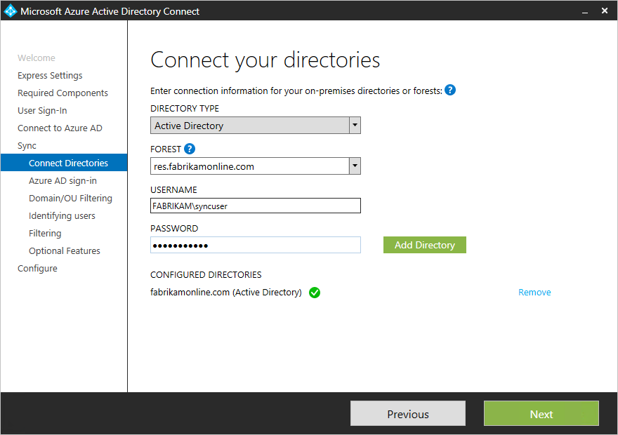

# Actualizar AAD Connect para incluir más de un bosqueUpdate AAD Connect to include more than one forest

Azure AD Connect admite la [sincronización desde varios bosques](https://docs.microsoft.com/en-us/azure/active-directory/connect/active-directory-aadconnect-topologies).Azure AD Connect supports [syncing from multiple forests](https://docs.microsoft.com/en-us/azure/active-directory/connect/active-directory-aadconnect-topologies). Sin embargo, solo admite una instancia de Azure AD Connect que se sincronice con AAD.However, it supports only one instance of Azure AD Connect syncing to AAD. Por lo tanto, en los casos donde Azure AD ya está instalado en un bosque, la instancia existente de AAD Connect debe actualizarse para sincronizarse desde el bosque adicional.Therefore, in cases where Azure AD is already installed in one forest, the existing instance of AAD Connect must be updated to sync from the additional forest.

 - Si todas las identidades se representan solo una vez en ambos bosques (es decir, no ha realizado ningún contacto habilitado para correo), simplemente puede volver a ejecutar el Asistente para la conexión de AAD, elegir "personalizar las opciones de sincronización" y, a continuación, en la página **conectar los directorios** , escriba el nombre del bosque y las credenciales adicionales.If all identities are represented only once across both forests (that is, you haven’t made any mail-enabled contacts), then you can simply re-run the AAD Connect wizard, choose “Customize synchronization options,” and then on the **Connect Your Directories** page, enter the name of the additional forest and creds.  
 
 - Sin embargo, si los usuarios pueden existir en más de un directorio y va a combinar los datos (por ejemplo, si existen objetos de contacto en un bosque correspondiente a los usuarios de otro bosque), tendrá que desinstalar Azure AD Connect y volver a instalarlo.However, if users can exist in more than one directory and you’ll be merging the data (for example, if contact objects exist in a forest corresponding to users in another forest), you will need to uninstall Azure AD Connect and re-install it.  Esto se debe a que la condición reglas de combinación entre bosques solo se puede configurar durante la primera instalación.This is because the cross-forest join rules condition can only be configured during the first install. Esto se realiza en la página siguiente:This is done on the following page:  
 

## Vea tambiénSee also

[Consolidación en la nube para Teams y Skype empresarialCloud Consolidation for Teams and Skype for Business](cloud-consolidation.md)