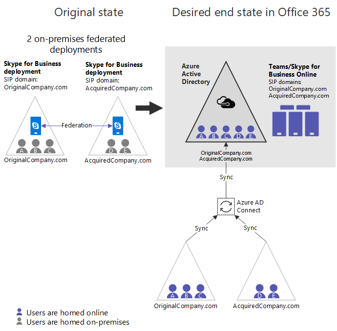

# Consolidación en la nube para Teams y Skype empresarialCloud consolidation for Teams and Skype for Business

Muchas grandes empresas tienen más de un bosque de AD local y, en algunos casos, los clientes tienen más de una implementación de Exchange o Skype empresarial Server (o Lync Server).Many large enterprises have more than one on-premises AD forest, and in some cases, customers have more than one Exchange and/or Skype for Business Server (or Lync Server) deployment. Además, incluso las organizaciones con un solo bosque local podrían encontrarse en una situación similar a través de una fusión o adquisición empresarial.In addition, even organizations with only one on-premises forest could find themselves in a similar situation via a business merger or acquisition. Como estos clientes se mueven a la nube, quieren consolidar las múltiples instancias de una carga de trabajo local determinada en la nube en un solo inquilino de Office 365.As these customers move to the cloud, they want to consolidate the multiple instances of a given on-premises workload into the cloud into a single Office 365 tenant. En este artículo se describe cómo lograr esa consolidación para organizaciones con varias implementaciones locales de Skype empresarial (o Lync) que deseen mover su carga de trabajo de comunicaciones unificadas a la nube de Microsoft, por ejemplo, Microsoft Teams o Skype empresarial online.This article describes how to achieve that consolidation for organizations with multiple on-premises deployments of Skype for Business (or Lync) who want to move their UC workload to the Microsoft cloud, e.g., Microsoft Teams and/or Skype for Business Online.

Históricamente, las instrucciones han sido dirigidas a los clientes en esta situación para consolidar primero las implementaciones locales y, a continuación, mover a la nube.Historically, the guidance has been for customers in this situation to consolidate deployments on-premises first and then move to the cloud. Aunque todavía es una opción, este artículo describe una solución basada en una nueva funcionalidad que permite a las organizaciones con varias implementaciones de Skype empresarial migrar una implementación cada vez en un solo inquilino de Office 365, sin realizarla localmente. consolidación.While this is still an option, this article describes a solution based on new functionality that enables organizations with multiple Skype for Business deployments to migrate one deployment at a time into a single Office 365 tenant, without doing on-premises consolidation. Tenga en cuenta que, incluso con esta nueva funcionalidad, Skype empresarial online y Microsoft Teams no admiten varios bosques de Skype empresarial/Lync en modo híbrido con un solo inquilino de Office 365.Note that even with this new functionality, Skype for Business Online and Microsoft Teams do not support multiple Skype for Business/Lync forests in hybrid mode with a single Office 365 tenant. 

> [!Important]
> Antes de usar esta guía para la configuración, asegúrese de revisar y comprender las [limitaciones](#limitations), ya que pueden afectar a su organización.Before using this guide for configuration, be sure to review and understand the [Limitations](#limitations), as they may affect your organization.

## Información general sobre la consolidación en la nubeOverview of cloud consolidation

Se puede consolidar la consolidación de todos los usuarios de forma local en la nube en un solo inquilino de Office 365 para cualquier organización con varias implementaciones de Skype empresarial, siempre que se cumplan los siguientes requisitos clave:Consolidation of all users from on-premises into the cloud in a single Office 365 tenant can be achieved for any organization with multiple Skype for Business deployments, provided that the following key requirements are met:

- Debe haber como máximo un espacio empresarial de Office 365 implicado.There must be at most one Office 365 tenant involved. No se admite la consolidación en escenarios con más de un inquilino de Office 365.Consolidation in scenarios with more than one Office 365 tenant is not supported.
- En cualquier momento dado, solo un bosque de Skype empresarial local puede estar en modo híbrido (espacio de direcciones SIP compartido).At any given time, only one on-premises Skype for Business forest can be in hybrid mode (Shared SIP Address Space). Todos los demás bosques locales de Skype empresarial deben permanecer local (y supuestamente federado entre sí).All other on-premises Skype for Business forests must remain on-premises (and presumably federated with each other). Tenga en cuenta que estas organizaciones locales *pueden* sincronizarse con AAD si lo desea, con [nuevas funciones para deshabilitar los dominios SIP en línea](https://docs.microsoft.com/en-us/powershell/module/skype/disable-csonlinesipdomain?view=skype-ps) disponibles a partir de diciembre de 2018.Note that these other on-premises organizations *can* sync to AAD if desired with [new functionality to disable online SIP domains](https://docs.microsoft.com/en-us/powershell/module/skype/disable-csonlinesipdomain?view=skype-ps) available as of December 2018.

Los clientes con implementaciones de Skype empresarial en varios bosques deben migrar completamente todos los usuarios de un único bosque híbrido de Skype empresarial al inquilino de Office 365 mediante la funcionalidad de espacio de direcciones SIP compartido y, a continuación, deshabilitar la implementación híbrida con esa implementación local, antes de continuar para migrar la siguiente implementación local de Skype empresarial.Customers with deployments of Skype for Business in multiple forests must fully migrate all users of a single hybrid Skype for Business forest individually into the Office 365 tenant using Shared SIP Address Space functionality, and then disable hybrid with that on-premises deployment, before moving on to migrate the next on-premises Skype for Business deployment. Antes de migrar a la nube, los usuarios locales permanecen en un estado federado con los usuarios que no están representados en el directorio local del mismo usuario.Prior to being migrated to the cloud, on-premises users remain in a federated state with any users that are not represented in the same user’s on-premises directory.  

## Ejemplo canónico de consolidación en la nubeCanonical example of cloud consolidation

Considere una organización con dos implementaciones locales federadas independientes de Skype empresarial que quiera consolidarlas en línea en Microsoft Teams o Skype empresarial online.Consider an organization with two separate federated on-premises deployments of Skype for Business that wants to consolidate them online in Microsoft Teams or Skype for Business Online.

|Detalles de estado originalesOriginal state details |Detalles de estado deseadoDesired state details |
|---------|---------|
|<ul><li>2 implementaciones locales independientes de Skype empresarial en bosques de AD independientes2 independent Skype for Business on-premises deployments in separate AD forests<li>Como máximo, el bosque está en un híbrido con Skype empresarial onlineAt most 1 forest is in hybrid with Skype for Business Online <li> Organizaciones están federados entre síOrgs are federated with each other <li>Los usuarios no se sincronizan entre estos bosquesUsers are not synced across these forests<li> La organización puede tener un inquilino de Office 365 y puede sincronizar su directorio con Azure ADThe org may have an Office 365 tenant and may be syncing their directory into Azure AD</ul>|<ul> <li>1 inquilino de Office 3651 Office 365 tenant<li>No hay más implementaciones locales, por lo que no queda ningún híbridoNo more on-premises deployments, so no hybrid remaining<li>Todos los usuarios de local están hospedados en Skype empresarial online y, opcionalmente, solo pueden ser usuarios de Microsoft Teams.All users from on premises are homed in Skype for Business Online and optionally may be Teams-only users <li>Sin espacio local de Skype empresarial en cualquier lugarNo on-premises footprint of Skype for Business anywhere <li>Los usuarios aún tienen autenticación localUsers still have on-premises authentication</ul> |

  

A continuación se indican los pasos básicos para obtener desde el estado original hasta el estado final deseado.The basic steps to get from the original state to the desired end state are below.  Tenga en cuenta que algunas organizaciones pueden encontrar que su punto de partida está en algún lugar en la mitad de estos pasos.Note that some organizations may find that their starting point is somewhere in the middle of these steps. Consulte [otros puntos de inicio](#other-starting-points), más adelante en este artículo.See [Other starting points](#other-starting-points), later in this article. Por último, en algunos casos, el orden puede ajustarse, según la necesidad.Finally, in some cases the order can be adjusted, depending on need. Las [restricciones y limitaciones clave](#limitations) se describen más adelante.[Key constraints and limitations](#limitations) are described later.

1.  Obtenga un inquilino de Office 365 si todavía no existe uno.Get an Office 365 tenant if one does not yet exist.
2.  Asegúrese de que todos los dominios SIP relevantes en todas las implementaciones locales sean dominios de Office 365.Make sure all relevant SIP domains across both on-premises deployments are verified Office 365 domains.
3.  Elija una implementación de Skype empresarial que será híbrida con Office 365.Pick one Skype for Business deployment that will be hybrid with Office 365. En este ejemplo, usaremos OriginalCompany. com.In this example, we’ll use OriginalCompany.com.
4.  [Habilite AAD Connect para el bosque](configure-azure-ad-connect.md) que se convertirá primero en híbrido ( OriginalCompany. com).[Enable AAD Connect for the forest](configure-azure-ad-connect.md) that will first become hybrid (OriginalCompany.com). 
5.  Si va a presentar Teams en su organización, establezca la Directiva de todo el inquilino para [TeamsUpgradePolicy](https://docs.microsoft.com/en-us/powershell/module/skype/grant-csteamsupgradepolicy) en SfBWithTeamsCollab o en uno de los otros modos de SfB (SfBOnly o SfBWithTeamsCollabAndMeetings).If you will be introducing Teams into your organization, set the tenant-wide policy for [TeamsUpgradePolicy](https://docs.microsoft.com/en-us/powershell/module/skype/grant-csteamsupgradepolicy) to SfBWithTeamsCollab or one of the other SfB modes (SfBOnly or SfBWithTeamsCollabAndMeetings). Esto es esencial para garantizar el enrutamiento de llamadas y chats de usuarios que se mueven a Microsoft Teams solo para los usuarios que permanecen en el entorno local.This is critical to ensure routing of calls and chats from users who move to Teams Only to users who remain on premises.
6.  En este punto se recomienda (pero todavía no es necesario hasta el paso 11) para [Habilitar AAD Connect para el otro bosque](cloud-consolidation-aad-connect.md) (AcquiredCompany . com).It is recommended at this point (but not yet required until step 11) to [enable AAD Connect for the other forest](cloud-consolidation-aad-connect.md) (AcquiredCompany.com). Si se habilita AAD Connect en ambos bosques, la organización es similar a la **[de la figura a](#figure-a)**, que puede ser un punto de partida común para algunos organizaciones.Assuming AAD Connect is enabled in both forests, the org looks like **[Figure A](#figure-a)**, which may be a common starting point for some orgs. 
7.  Para cualquier dominio SIP hospedado por otras implementaciones locales (en este caso, AcquiredCompany. com), [deshabilite estos dominios SIP en Skype empresarial online](https://docs.microsoft.com/en-us/powershell/module/skype/disable-csonlinesipdomain) con `Disable-CsOnlineSipDomain` en PowerShell.For any SIP domains hosted by other on-premises deployments (in this case, AcquiredCompany.com), [disable these SIP domains in Skype for Business Online](https://docs.microsoft.com/en-us/powershell/module/skype/disable-csonlinesipdomain) using `Disable-CsOnlineSipDomain` in PowerShell. (Esta es una nueva funcionalidad a partir del 2018 de diciembre).(This is new functionality as of December 2018.)
8.  [Configurar Skype empresarial híbrido](configure-federation-with-skype-for-business-online.md) para OriginalCompany. com (la única implementación que todavía tiene habilitados dominios SIP en línea).[Configure Skype for Business hybrid](configure-federation-with-skype-for-business-online.md) for OriginalCompany.com (the one deployment that still has enabled online SIP domains).
9.  En la implementación híbrida (OriginalCompany. com), empiece [a mover a los usuarios de Skype empresarial local a la nube](move-users-between-on-premises-and-cloud.md) (ya sea Teams o no) para que la cuenta se encuentre hospedada en Skype empresarial online.In the hybrid deployment (OriginalCompany.com), start [moving users from Skype for Business on premises to the cloud](move-users-between-on-premises-and-cloud.md) (whether Teams Only or not) so that account is homed in Skype for Business Online. Ahora la organización tiene el aspecto de la **[figura B](#figure-b)**. Los cambios clave de la figura A son:Now the organization looks like **[Figure B](#figure-b)**. The key changes from Figure A are:
    - Los usuarios de ambos directorios locales están ahora en AAD.Users from both on-premises directories are now in AAD.
    - AcquiredCompany. com es un dominio SIP en línea deshabilitado.AcquiredCompany.com is a disabled online SIP domain.
    - Algunos usuarios se han movido en línea a Skype empresarial online o Teams.Some users have been moved online to either Skype for Business Online or Teams. (Consulte el usuario púrpura A.)(See purple user A.)
10. Una vez que todos los usuarios se muevan a la nube, [deshabilite el entorno híbrido con la implementación local de Skype empresarial](cloud-consolidation-disabling-hybrid.md) para OriginalCompany. com desde Office 365:Once all users are moved to the cloud, [disable hybrid with the Skype for Business on-premises deployment](cloud-consolidation-disabling-hybrid.md) for OriginalCompany.com from Office 365:  
    - Deshabilite el dominio dividido en el inquilino de Office 365.Disable split domain in the Office 365 tenant.
    - Deshabilite la capacidad de comunicarse con Office 365 en OriginalCompany. com local.Disable the ability to communicate with Office 365 in OriginalCompany.com on-premises.
    - Actualizar registros DNS para OriginalCompany. com para que apunte a Office 365.Update DNS records for OriginalCompany.com to point to Office 365.
11. Si no lo ha hecho, [habilite AAD Connect para el siguiente bosque](cloud-consolidation-aad-connect.md) que se va a iniciar como híbrido (AcquiredCompany. com).If not done already, [enable AAD Connect for the next forest](cloud-consolidation-aad-connect.md) that will go hybrid (AcquiredCompany.com). En este momento, la organización tiene el aspecto de la **[figura C](#figure-c)**. Este puede ser otro punto de partida común para algunas organizaciones.At this point, the organization looks like **[Figure C](#figure-c)**. This may be another common starting point for some organizations. 
12. En PowerShell, [habilite los dominios SIP para la siguiente implementación local](https://docs.microsoft.com/en-us/powershell/module/skype/enable-csonlinesipdomain?view=skype-ps) que se va a implementar de forma híbrida, AcquiredCompany. com.In PowerShell, [enable the SIP domains for the next on-premises deployment](https://docs.microsoft.com/en-us/powershell/module/skype/enable-csonlinesipdomain?view=skype-ps) that will go hybrid, AcquiredCompany.com. Esto se realiza con `Enable-CsOnlineSipDomain`, que es una nueva funcionalidad disponible a partir del 2018 de diciembre.This is done using `Enable-CsOnlineSipDomain`, which is new functionality available as of December 2018.
13. Si usa Federación cerrada, debe agregar dominios SIP (excepto \*. microsoftonline.com) del inquilino en línea puro como dominios permitidos en la **misma** oficina 365.If you are using closed federation, you must add any SIP domains (excluding \*.microsoftonline.com)  of the pure online tenant as Allowed Domains in **same** Office 365. Tenga en cuenta que puede tardar algún tiempo antes de que el cambio surta efecto y que no haya ningún perjuicio en cuanto a esto en principio, por lo que se recomienda hacerlo antes de avanzar al paso 14.Note that it can take some time before the change takes effect and there is no harm in doing this early, so we suggest doing this well in advance of moving to step 14.
14. Actualice el entorno local para aceptar todos los dominios SIP del inquilino en línea, por lo que coinciden.Update the on-premises environment to accept any SIP domains from the online tenant, so they match.
    - [Actualice el San de todos los certificados perimetrales](cloud-consolidation-edge-certificates.md) para que tengan el mismo valor que antes, además de los valores de los dominios SIP en línea existentes (excepto \*. microsoftonline.com), en este caso, SIP. OriginalCompany. com.[Update the SAN in all edge certificates](cloud-consolidation-edge-certificates.md) to be the same value as before, plus values for any existing online SIP domains (except \*.microsoftonline.com), in this case, Sip.OriginalCompany.com.
    - Asegúrese de que OriginalCompany. com es un [dominio permitido](https://docs.microsoft.com/en-us/powershell/module/skype/new-csalloweddomain) en la implementación local, AcquiredCompany.Make sure OriginalCompany.com is an [allowed domain](https://docs.microsoft.com/en-us/powershell/module/skype/new-csalloweddomain) in the on-premises deployment, AcquiredCompany. Agregar dominios permitidos.Add allowed domains.
15. [Habilitar Skype empresarial híbrido](configure-federation-with-skype-for-business-online.md) entre AcquiredCompany local. com y la nube.[Enable Skype for Business hybrid](configure-federation-with-skype-for-business-online.md) between on-premises AcquiredCompany.com and the cloud.
16. Si lo desea, [migre los usuarios de forma local a la nube](move-users-between-on-premises-and-cloud.md).As desired, [migrate users from on-premises to the cloud](move-users-between-on-premises-and-cloud.md). Puede migrar los usuarios directamente al modo [TeamsOnly](/microsoftteams/teams-and-skypeforbusiness-coexistence-and-interoperability) o puede migrarlos primero a Skype empresarial online.You can migrate users either directly to [TeamsOnly](/microsoftteams/teams-and-skypeforbusiness-coexistence-and-interoperability) mode or you can migrate them first to Skype for Business Online. Durante este estado, la organización tiene el aspecto de la **[figura D](#figure-d)**.During this state, the organization looks like **[Figure D](#figure-d)**.
17. Una vez que se hayan migrado todos los usuarios, [deshabilite el entorno híbrido con el entorno local](cloud-consolidation-disabling-hybrid.md) para *convertir la nube en la organización pura*.Once all users are migrated, [disable hybrid with the on-premises environment](cloud-consolidation-disabling-hybrid.md) to *make the organization pure cloud*!

Los diagramas siguientes muestran la configuración en varios puntos clave durante este proceso.The diagrams below show the configuration at various key points during this process.

##### Figura A:Figure A:

- Ambas organizaciones se sincronizan mediante AAD Connect, por lo que AAD ahora tiene a todos los usuarios de implementaciones locales.Both organizations sync via AAD Connect, so AAD now has all users from both on-premises deployments.
- Todos los usuarios hospedados en local.All users homed on-premises.  
- Skype empresarial híbrido todavía *no* está configurado.Skype for Business Hybrid is *not* yet configured.
- Si los usuarios de cualquier implementación utilizan Teams, no podrán federar entre ellos (o cualquier otra organización), ni tendrán interoperabilidad con los usuarios de Skype empresarial.If users in either deployment use Teams, they won’t be able to federate with each other (or any organization), nor will they have interoperability with any Skype for Business users. En esta fase, Microsoft recomienda usar Teams solo para los canales.While in this stage, Microsoft recommends using Teams for Channels only.  
    

##### Figura B:Figure B:

- AcquiredCompany. com es un dominio SIP en línea [deshabilitado](https://docs.microsoft.com/en-us/powershell/module/skype/disable-csonlinesipdomain) .AcquiredCompany.com is a [disabled](https://docs.microsoft.com/en-us/powershell/module/skype/disable-csonlinesipdomain) online SIP domain. Todos los usuarios son locales.All users are on-premises. Si utilizan Teams, no tienen Federación ni interoperabilidad.If they use Teams they do not have federation or interoperability. En esta fase, Microsoft recomienda usar Teams solo para los canales.While in this stage, Microsoft recommends using Teams for Channels only.
- Skype empresarial híbrido se ha habilitado para una de las organizaciones locales.Skype for Business Hybrid has been enabled for one of the on-premises organizations.
- Algunos usuarios de la organización híbrida se han movido a la nube (el usuario A tal como lo indica el sombreado púrpura).Some users in the hybrid organization have been moved to the cloud (user A as indicated by purple shading). Estos usuarios pueden ser usuarios de Skype empresarial online o solo usuarios de Microsoft Teams con una interoperabilidad completa y compatibilidad con la Federación.These users can be either Skype for Business Online users or Teams Only users with full interoperability and federation support.  
    

##### Figura C:Figure C:

- Todos los usuarios de OriginalCompany. com ahora están en la nube (hospedada en Skype empresarial online).All users from OriginalCompany.com are now in the cloud (homed in Skype for Business Online). Se recomienda que también sean equipos.It’s recommended that they also be Teams Only.
- Configuración híbrida de Skype empresarial con el OriginalCompany. se ha deshabilitado la implementación com.Skype for Business hybrid configuration with the OriginalCompany.com deployment has been disabled. La implementación local ha desaparecido.The on-premises deployment is gone.
- Si AcquiredCompany. com no se sincronizó previamente con AAD; para continuar a partir de aquí, es necesario sincronizar ahora.If AcquiredCompany.com wasn’t previously syncing to AAD, to continue from here it needs to be synced now. Pero todavía no es híbrido (espacio de direcciones SIP compartido) y, hasta que la organización esté preparada para pasar a híbrido, el dominio SIP en línea de la organización local pura (AcquiredCompany.com) debe permanecer deshabilitado para que los usuarios de Teams en línea puedan comunicarse con usuarios locales.But it is not yet hybrid (shared SIP address space), and until the organization is ready to move to hybrid, the online SIP domain for the pure on-premises organization (AcquiredCompany.com) should remain disabled, so that online Teams users can communicate with on-premises users.  
    

##### Figura D:Figure D:

- AcquiredCompany. com está ahora habilitado como un dominio SIP en línea.AcquiredCompany.com is now enabled as an online SIP domain.
- La implementación local se actualiza para aceptar OriginalCompany. com.On-premises is updated to accept OriginalCompany.com. (Dominio permitido y los certificados de servidor perimetral actualizados).(Both allowed domain, and edge certificates are updated).
- El espacio de direcciones SIP compartido está habilitado entre AcquiredCompany. inquilino com y Office 365.Shared SIP Address Space is enabled between AcquiredCompany.com and Office 365 tenant.
- Es posible que algunos usuarios de la organización híbrida se hayan movido a la nube, como el usuario D a continuación (indicado por el sombreado púrpura).Some users in the hybrid organization may have been moved to the cloud, such as User D below (indicated by purple shading).  
    

## Otros puntos de partidaOther starting points

Los pasos del ejemplo canónico anterior suponen que la organización comienza con dos implementaciones locales federadas sin presencia de Office 365.The steps in the canonical example above assume that the organization starts with two federated on-premises deployments with no Office 365 presence. Sin embargo, algunas organizaciones pueden tener un espacio de Office 365 existente y puede haber distintos puntos de entrada en la secuencia anterior.However, some organizations may have an existing Office 365 footprint, and there can be different entry points into the sequence above. Hay cuatro configuraciones típicas:There are four typical configurations:

- Varias organizaciones federadas locales sin inquilino de Office 365.Multiple federated on-premises organizations with no Office 365 tenant. En este caso, comience en el paso 1.In this case, start at step 1.
- Varias organizaciones locales federadas que ya están sincronizando un bosque de Skype empresarial en un solo inquilino de Azure AD.Multiple federated on-premises organizations that are already syncing multiple Skype for Business forest into a single Azure AD tenant. Esta organización es similar a la organización hipotética de la figura A, que ha completado los pasos 1-6 y debe empezar en el paso 7.Such an organization resembles the hypothetical organization in Figure A, which has completed steps 1-6 and should start at step 7.
- Una organización híbrida que federa con 1 o más organizaciones locales puras, ninguna de las cuales se sincronizan con AAD.A hybrid organization that federates with 1 or more other pure on-premises organizations, none of which sync to AAD. Esta organización sería similar a la organización hipotética de la **figura E**, que se muestra a continuación.Such an organization would resemble the hypothetical organization in **Figure E**, shown below.
    - Esta organización es similar a la figura B, que ha completado los pasos 1-9, excepto:This organization is similar to Figure B, which has completed steps 1-9, except:
        - Las implementaciones no híbridas de Skype empresarial todavía *no* se sincronizan con Azure ad.Its non-hybrid Skype for Business deployments are *NOT* yet syncing to Azure AD.
        -  Los dominios SIP en línea todavía no están deshabilitados.Online SIP domains are not yet disabled. 
    - Estas organizaciones deben:These organizations should either:
        - Complete la migración de la organización híbrida existente y escriba la secuencia anterior en el paso 10.Complete migration of the existing hybrid organization and enter the above sequence at step 10.  OOR,
        - Si se desea sincronizar otros bosques de Skype empresarial con AAD antes de completar la migración de la organización híbrida, la organización debe realizar el paso 7 (deshabilitar todos los dominios SIP en línea en cualquier otra implementación local de Skype empresarial que se Sincronice en AAD) y, a continuación, habilite AAD Connect y solo luego continúe con el paso 10 (retirar la implementación híbrida original).If it is desired to sync any other Skype for Business forests into AAD prior to completing migration of the hybrid organization, then the organization must perform step 7 (disable all online SIP domains in any other on-premises Skype for Business deployment that will sync into AAD) and then enable AAD Connect, and only then continue with step 10 (decommission the original hybrid deployment).       
                **Figura E****Figure E** 
                
- Una organización de Skype empresarial online pura (que puede o no use Teams) que federa con una organización de Skype empresarial local independiente.A pure Skype for Business Online organization (which may or may not be using Teams) that federates with a separate on-premises Skype for Business organization. Una vez que esta organización deshabilita el dominio SIP en línea para la organización local y habilita AAD Connect para la organización de Skype empresarial local, es similar a la organización hipotética que se muestra en la **[figura C](#figure-c)** y que ha completado los pasos 1-11.Once this organization disables the online SIP domain for the on-premises organization and enables AAD Connect for the on-premises Skype for Business organization, it resembles the hypothetical organization shown in **[Figure C](#figure-c)** that has completed steps 1-11.

## LimitacionesLimitations

- Debe haber como máximo un espacio empresarial de Office 365 implicado.There must be at most one Office 365 tenant involved. No se admite la consolidación en escenarios con más de un inquilino de Office 365.Consolidation in scenarios with more than one Office 365 tenant is not supported.
- Solo un bosque de Skype empresarial local puede estar en modo híbrido (espacio de direcciones SIP compartido) a la vez.Only one on-premises Skype for Business forest can be in hybrid mode (shared SIP address space) at a time. Todos los demás bosques locales de Skype empresarial deben permanecer exclusivamente en local y deben estar federados entre sí y con el inquilino de Office 365.All other on-premises Skype for Business forests must remain purely on-premises and should be federated with each other and the Office 365 tenant.
- Antes de migrar a la nube, hay una experiencia asimétrica para los usuarios en esta implementación, porque no todos los usuarios en línea se representan de forma local:Prior to being migrated to the cloud, there is an asymmetric experience for users in this deployment, because not all users in online are represented on-premises:
    - La experiencia se puede sumar de la siguiente manera:The experience can be summed up as follows:
        - Cualquier usuario hospedado en línea interactuará con los usuarios locales en el entorno híbrido como si el usuario es híbrido.Any user homed online will interact with on-premises users in the hybrid environment as if the user is hybrid.
        - Los usuarios locales de la implementación híbrida interactuarán con los usuarios en línea que se representan en su directorio local como si fueran híbridos.On-premises users in the hybrid deployment will interact with online users who are represented in their on-premises directory as if they were hybrid. 
        - Los usuarios locales de la implementación híbrida interactuarán con los usuarios en línea que no están representados en AD local como federados.On-premises users in the hybrid deployment will interact with online users who are not represented in on-premises AD as federated.
    - En la **[figura D](#figure-d)** anterior, el usuario E es local en AcquiredCompany. com.In **[Figure D](#figure-d)** above, user E is on-premises in AcquiredCompany.com.  El usuario E interactuará con el usuario D (hospedado en línea) mediante la experiencia híbrida estándar, pero el usuario E tendrá una experiencia federada con los usuarios A, B y C porque no están representados en el directorio local.User E will interact with User D (homed online) using the standard hybrid experience,  but user E will have a federated experience with users A, B, and C because they are not represented in the on-premises directory. Sin embargo, los usuarios A, B y C interactuarán con el usuario E como si el usuario estuviera en un entorno híbrido.However, users A, B, and C will interact with user E as if the user were in hybrid.
    - Implicaciones de interacción híbrida frente a Federación:Implications of interaction being hybrid vs. federation:
        - La presencia no se suscribe automáticamente a los usuarios federados a menos que el usuario esté marcado como contacto.Presence is not automatically subscribed to for federated users unless the user is marked as a contact.
        - El desvío de llamadas no funciona entre dominios federados.Call forwarding does not work between federated domains.
        - Los escenarios de transferencia de llamadas son más limitados.Call transfer scenarios are more limited.
        - La limitación de peticiones puede aplicarse al tráfico federado.Throttling may be applied to federated traffic.
- Dada esta experiencia asimétrica, la compatibilidad oficial para llamar a la funcionalidad en escenarios entre locales entre un usuario local y un usuario de la nube que no se encuentra en el directorio local se limita a peer to peer solamente.Given this asymmetric experience, official support for calling functionality in cross-premises scenarios between an on-premises user and a cloud user that is not in the on-premises directory is limited to peer to peer only. 
    - No se admite desvío de llamadas, transferencia, colas de llamadas, etc. entre estos usuarios.Call forwarding, transfer, call queues, etc. between these users is not supported.
    - Estos escenarios de llamada no admitidos seguirán apareciendo habilitados, pero en muchos casos se producirán de manera impredecible.These non-supported calling scenarios will still appear enabled, but in many cases they will fail in unpredictable ways. 
    - En la **[figura D](#figure-d)** anterior, el usuario E es local y las llamadas con los usuarios a, B o C solo se admitirán como de par a par.In **[Figure D](#figure-d)** above, user E is on-premises, and calls with users A, B, or C will be supported only as peer to peer. (Las llamadas con el usuario D no podrían tener limitaciones de soporte técnico).  Sin embargo, después de que el usuario local E se mueva a la nube, esta restricción ya no se aplica.(Calls with user D would not have support limitations.)  However, after the on-premises user E is moved to the cloud, this restriction no longer applies.
- Si tiene más de una implementación de Skype empresarial Server 2019 en su entorno, solo 1 de esas implementaciones se puede configurar para que use el operador automático de la organización, ya que esta característica requiere la configuración híbrida de Skype empresarial Server.If you have more than one deployment of Skype for Business Server 2019 in your environment, only 1 of those deployment can be configured to use Organizational Auto Attendant, since that feature requires Skype for Business Server hybrid configuration. 
- Se puede ajustar el orden de algunos de los pasos anteriores.The order of some of the previous steps can be adjusted. El requisito clave que debe cumplirse es que si todos estos elementos son verdaderos:The key requirement that must be met is that if all of these are true:
    - Más de un bosque de Skype empresarial local que se sincroniza con un solo espacio empresarial de AADMore than one on-premises Skype for Business forest syncing to a single AAD tenant
    - El dominio dividido está habilitado con un bosque localSplit domain is enabled with one on-premises forest
    - Se ha migrado al menos un usuario de la organización híbrida a la nubeAt least one user in the hybrid organization has been migrated to the cloud    A continuación, *debe* deshabilitar todos los demás dominios SIP en línea de cualquier otro bosque local de Skype empresarial.Then, you *must* disable all other online SIP domains from any other on-premises Skype for Business forest. De lo contrario, la Federación entre los usuarios en línea en la organización híbrida y los usuarios locales de otras organizaciones se romperá en una dirección.Otherwise, federation between online users in the hybrid organization and on-premises users in other organizations will break in one direction.

## PercusiónImplications

- Debido a que existen limitaciones en la compatibilidad con la funcionalidad de llamadas avanzadas descritas anteriormente, **las organizaciones deben tratar estos Estados asimétricos como transitorios como parte de la migración y no seguirlos como un estado estable**.Because there are limitations in support for advanced calling functionality as described above, **organizations should treat these asymmetric states as transitory as part of migration, and not pursue them as steady state**.  
- Por lo general, las organizaciones con varias implementaciones de Skype empresarial local deben empezar con una implementación que se puede migrar completamente a la nube para que la consolidación pueda continuar.Organizations with multiple on-premises Skype for Business deployments should generally start with a deployment that can be fully migrated to the cloud, so that consolidation can continue. Se entiende que, en algunos casos, habrá holdouts de determinados grupos de usuarios para quienes todavía no es viable pasar a Microsoft Teams.It is understood that in some cases there will be holdouts of certain user groups for whom it’s not yet viable to move to Teams. Si se trata de una consideración en escenarios en los que intervienen varios bosques de Skype empresarial, empiece a migrar con otro bosque que no tenga estas limitaciones, si es posible.When this is a consideration in scenarios involving multiple Skype for Business forests, start migrating with another forest that does not have these limitations, if at all possible.
- Al pasar de local a la nube, los usuarios con relaciones de delegación o que suelen participar en escenarios de desvío de llamadas se deben mover juntos como una unidad.When moving from on-premises to the cloud, users that have delegation relationships and/or are typically are involved in call forwarding scenarios should be moved together as a unit.

## Consideraciones para cambiar al modo TeamsOnlyConsiderations for moving to TeamsOnly mode

Al mover usuarios de local a la nube en un entorno híbrido, puede moverlos a Skype empresarial solo o al modo TeamsOnly.When you move users from on premises to the cloud in a hybrid environment, you can move them to either Skype for Business Only or TeamsOnly mode. *Si tiene previsto mover usuarios al modo TeamsOnly, asegúrese de leer esta sección primero.**If you plan to move users to TeamsOnly mode, be sure to read this section first.*

- Cuando asigna el modo TeamsOnly a un usuario, todos los chats y las llamadas de cualquier otro usuario estarán en el cliente de Microsoft Teams del usuario.When you assign TeamsOnly mode to a user, all chats and calls from any other user will land in that user’s Teams client. 
- Si los usuarios de Skype empresarial local usan principalmente el cliente de Skype empresarial y no los equipos, considere la posibilidad de establecer TeamsUpgradePolicy de modo que el enrutamiento a esos usuarios locales siempre aterriza en Skype empresarial en lugar de en Microsoft Teams.If users with Skype for Business on-premises primarily use Skype for Business client and not Teams, consider setting TeamsUpgradePolicy so that routing to those on-premises users always lands in Skype for Business instead of Teams. Para garantizar el enrutamiento correcto de los chats y las llamadas entre usuarios que son TeamsOnly y usuarios que todavía usan Skype empresarial local, los usuarios locales deben tener un valor efectivo de TeamsUpgradePolicy con uno de los modos de SfB, en lugar de islas (que es el valor predeterminado).To ensure proper routing of chats and calls between users who are TeamsOnly and users who are still using Skype for Business on premises, on-premises users must have an effective value of TeamsUpgradePolicy with one of the SfB modes, rather than Islands (which is the default). 
    - Para ello, *primero debe configurar la instancia global del inquilino de TeamsUpgradePolicy en uno de estos valores*:To do this, *you must first set your tenant’s global instance of TeamsUpgradePolicy to one of these values*:
        - SfBWithTeamsCollab (recomendado)SfBWithTeamsCollab (recommended)
        - SfBWithTeamsCollabAndMeetingsSfBWithTeamsCollabAndMeetings
        - SfBOnlySfBOnly
    - Puede conceder directivas de todo el inquilino con este comando:You can grant tenant-wide policy by using this command: `Grant-CsTeamsUpgradePolicy -PolicyName SfBWithTeamsCollab -Global`
    - Nota: debe hacerlo en un nivel de inquilino, ya que la Directiva no se puede asignar a usuarios individuales que no tengan una dirección SIP en el directorio en línea.Note: You must do this at a tenant-wide level because policy cannot be assigned to individual users who do not have a SIP address in the online directory. Mientras haya deshabilitado los dominios SIP en línea para las implementaciones locales puras, los usuarios de esos dominios no tendrán direcciones SIP en el directorio en línea por diseño.While you have disabled online SIP domains for your pure on-premises deployment(s), users in those domains won’t have SIP addresses in the online directory by design. Por lo tanto, la única forma de aplicar la Directiva a los usuarios locales es asignar en el nivel de espacio empresarial.Hence, the only way to apply policy to those on-premises users is by assigning at the tenant level. Por el contrario, en los usuarios de la implementación híbrida tendrán una dirección SIP en el directorio en línea, por lo que se les puede asignar de forma explícita una Directiva si desea que tengan un valor distinto al de la directiva global de inquilino.In contrast, in the hybrid deployment users will have a SIP address in the online directory so they can be explicitly assigned a policy if it’s desired that they have a different value than the tenant global policy.
- La experiencia de usuario del cliente de Microsoft Teams todavía no respeta los modos de SfB de TeamsUpgradePolicy.The Teams client UX does not yet honor the SfB modes of TeamsUpgradePolicy. Por ejemplo, en estos modos, el inicio de llamadas y chats en Microsoft Teams es posible en la actualidad, aunque en el futuro no será el caso.For example, when in these modes, call and chat initiation in Teams is currently possible, although in the future that won’t be the case. Esto puede causar confusión entre los usuarios porque las respuestas a veces pueden estar en Microsoft Teams y, a continuación, en Skype empresarial, en función de las circunstancias.This can cause confusion among users because replies may sometimes land in Teams and sometimes Skype for Business, depending on the circumstances. Se recomienda deshabilitar por separado las llamadas y el chat a través de TeamsMessagingPolicy y TeamsCallingPolicy para los usuarios que todavía están en local.It is recommended that you separately disable calling and chat via TeamsMessagingPolicy and TeamsCallingPolicy for users who are still on premises.

## Vea tambiénSee also

[Actualizar el certificado perimetralUpdate the edge certificate](cloud-consolidation-edge-certificates.md)

[Actualizar AAD Connect para incluir más de un bosqueUpdate AAD Connect to include more than one forest](cloud-consolidation-aad-connect.md)

[Deshabilitar la migración híbrida para completar la nubeDisable hybrid to complete migration to the cloud](cloud-consolidation-disabling-hybrid.md)
