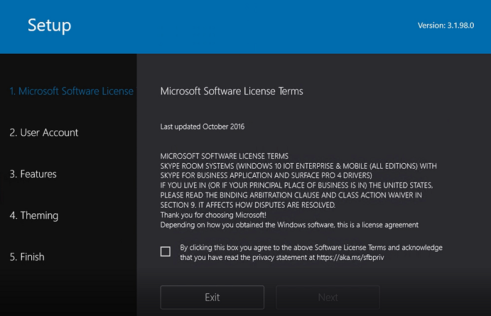

# <a name="deploy-skype-room-systems-v2-by-using-system-center-configuration-manager"></a>Implementación de sistemas de salón de Skype v2 mediante System Center Configuration Manager

En este artículo se proporciona toda la información necesaria para crear las implementaciones de sistemas de salón de Skype v2 mediante System Center Configuration Manager.

Con la fáciles de usar los métodos proporcionados por System Center Configuration Manager, puede implementar el sistema operativo y otras aplicaciones en varios dispositivos de destino.

Use el enfoque se ilustra a continuación le guiarán a través de la configuración del Administrador de configuración y personalizar los paquetes de ejemplo y secuencias de comandos proporcionadas a lo largo de esta guía, según sea necesario para la organización.


> [!IMPORTANT]
> Esta solución sólo se ha probado con implementaciones basado en Surface Pro. Siga las instrucciones del fabricante para las configuraciones que no están basadas en Surface Pro.

## <a name="validate-prerequisites"></a>Validar los requisitos previos

Para implementar sistemas de salón de Skype v2 con el Administrador de configuración, asegúrese de que cumple los siguientes requisitos previos y requisitos.

### <a name="system-center-configuration-manager-requirements"></a>Requisitos de System Center Configuration Manager

-   System Center Configuration Manager versión debe ser al menos 1706 o anterior. Se recomienda usar 1710 o posterior. Desproteger el [soporte técnico para Windows 10 en System Center Configuration Manager](https://docs.microsoft.com/sccm/core/plan-design/configs/support-for-windows-10#windows-10-as-a-client) para obtener más información acerca de las versiones de Windows 10 que admite el Administrador de configuración.

-   Debe estar instalada una versión compatible de evaluación de Windows y el Kit de implementación (ADK) para Windows 10. Vea las versiones de [Windows 10 ADK](https://docs.microsoft.com/sccm/core/plan-design/configs/support-for-windows-10#windows-10-adk) que puede usar con distintas versiones de Configuration Manager y asegúrese de que la implementación incluye la versión correcta.

-   Los servidores del sistema de sitio deben tener el rol de punto de distribución, y las imágenes de arranque deberían estar habilitadas para que [previo al arranque de soporte técnico de entorno (PXE) de ejecución](https://docs.microsoft.com/sccm/osd/deploy-use/use-pxe-to-deploy-windows-over-the-network) habilitar las implementaciones iniciadas por la red. Si no está habilitada la compatibilidad PXE, puede usar el [medio de arranque](https://docs.microsoft.com/sccm/osd/deploy-use/use-bootable-media-to-deploy-windows-over-the-network) para las implementaciones de.

-   Una cuenta de acceso de red debe configurarse para admitir escenarios de implementación de nuevo equipo (más bajos del hardware). Para obtener más información acerca de la configuración de una cuenta de acceso de red, consulte [Administrar cuentas para tener acceso al contenido en System Center Configuration Manager](https://docs.microsoft.com/sccm/core/plan-design/hierarchy/manage-accounts-to-access-content#bkmk_NAA).

-   Se recomienda que habilite [la compatibilidad con multidifusión](https://docs.microsoft.com/sccm/osd/deploy-use/use-multicast-to-deploy-windows-over-the-network), si es probable que implementar la misma imagen v2 de sistemas de salón de Skype en varias unidades al mismo tiempo.

### <a name="networking-requirements"></a>Requisitos de red

-   La red debe tener un servidor de protocolo de configuración dinámica de Host (DHCP), configurado para la distribución automática de direcciones IP a las subredes donde se implementará unidades de sistemas de salón de Skype v2.

    > [!NOTE]
    > Duración de concesión DHCP debe establecerse en un valor mayor que la duración de la implementación de imagen. De lo contrario, puede producirse un error en la implementación.

-   La red, incluidos los modificadores y LAN virtuales (VLAN), debe configurarse para que admita PXE. Consulte a su proveedor de red para obtener más información acerca de la configuración de IP auxiliares y PXE. Como alternativa, puede usar [un medio de arranque](https://docs.microsoft.com/sccm/osd/deploy-use/use-bootable-media-to-deploy-windows-over-the-network) para las implementaciones, si no está habilitado el soporte de PXE.

    > [!NOTE]
    > Para Surface Pro dispositivos, arranque desde la red (inicio PXE) sólo se admiten cuando se usa un adaptador Ethernet o estación de acoplamiento de Microsoft. Adaptadores de Ethernet de terceros no admiten el arranque PXE con Surface Pro. Para obtener más información, vea [adaptadores Ethernet e implementación de superficie](https://docs.microsoft.com/surface/ethernet-adapters-and-surface-device-deployment) .

## <a name="configure-system-center-configuration-manager-for-operating-system-deployment"></a>Configuración de System Center Configuration Manager para la implementación de sistema operativo

En este artículo se da por supuesto que ya tiene una buen implementación de System Center Configuration Manager y no todos los detalles de todos los pasos necesarios para implementar y configurar el Administrador de configuración desde el principio. La [documentación y las instrucciones de configuración](https://docs.microsoft.com/sccm/) de System Center Configuration Manager es un gran recurso; se recomienda que empezar con estos recursos si aún no ha implementado el Administrador de configuración.

Use las siguientes instrucciones para comprobar que se han configurado correctamente las características de implementación (OSD) del sistema operativo.

### <a name="validate-and-upgrade-configuration-manager"></a>Validar y actualizar el Administrador de configuración

1.  En la consola de Configuration Manager, vaya a **administración** \> **actualizaciones y modelo de servicio**.

2.  Compruebe la compilación instalada y actualizaciones aplicables que aún no se han instalado todavía.

3.  Revisión de [compatibilidad con Windows 10 en System Center Configuration Manager](https://docs.microsoft.com/sccm/core/plan-design/configs/support-for-windows-10#windows-10-as-a-client); Si necesita actualizar su implementación, seleccione la actualización que desea instalar y, a continuación, seleccione **Descargar**.

4.  Una vez finalizada la descarga, seleccione la actualización y, a continuación, seleccione **Instalar el paquete de actualización**.

### <a name="configure-distribution-points-to-support-pxe-and-multicast"></a>Configuración de los puntos de distribución para admitir PXE y multidifusión

1.  En la consola de Configuration Manager, vaya a **administración** \> **Puntos de distribución**.

2.  Seleccione el servidor de punto de distribución que va a servir la implementación de sistemas de salón de Skype v2 y, a continuación, seleccione **Propiedades**.

3.  Seleccione la ficha **PXE** y asegúrese de que estén habilitadas las siguientes opciones: 
    -   Habilitar la compatibilidad con PXE para los clientes
    -   Permitir que este punto de distribución responder a las solicitudes de PXE entrantes
    -   Habilitar la compatibilidad con equipo desconocido

4.  *Opcional:* Para habilitar la compatibilidad con multidifusión, seleccione la ficha **multidifusión** y asegúrese de que estén habilitadas las siguientes opciones:
    -   Habilitar la multidifusión enviar datos simultáneamente a varios clientes
    -   Configurar el intervalo de puertos UDP según la recomendación del equipo de su red

### <a name="configure-the-network-access-account"></a>Configuración de la cuenta de acceso de red

1.  En la consola de Configuration Manager, vaya a **administración** \> **Configuración de sitio** \> **sitios**y, a continuación, seleccione el sitio.

2.  En el grupo **configuración** , seleccione **Configurar componentes de sitio** \> **La distribución de Software**.

3.  Seleccione la ficha de la **Cuenta de acceso de red** conjunto de copia de seguridad una o más cuentas y, a continuación, seleccione **Aceptar**.

> [!NOTE]
> Las cuentas no necesitan ningún derecho en particular, excepto el derecho de **tener acceso a este equipo desde la red** en el servidor de punto de distribución. Una cuenta de usuario de dominio genérico será adecuada. Para obtener más información, consulte [Administrar cuentas para tener acceso al contenido en System Center Configuration Manager](https://docs.microsoft.com/sccm/core/plan-design/hierarchy/manage-accounts-to-access-content#bkmk_NAA).

### <a name="configure-a-boot-image"></a>Configurar una imagen de arranque

1.  En la consola de Configuration Manager, vaya a la **Biblioteca de Software** \> **del sistema operativo** \> **Imágenes de arranque**.

2.  Seleccione la **imagen de arranque (x64)** y, a continuación, seleccione **Propiedades**.

3.  Seleccione la ficha **Origen de datos** y permiten **implementar esta imagen de arranque desde el punto de distribución habilitado para PXE**.

4.  Seleccione la ficha **Componentes opcionales** para instalar los componentes requeridos:

    1.  Seleccione el icono de estrella y buscar **HTML (WinPE-HTA)**

    2.  Seleccione **Aceptar** para agregar compatibilidad con la aplicación de HTML en la imagen de arranque.

5.  *Opcional:* Para personalizar la experiencia de implementación, seleccione la ficha **personalización** .
    -   Habilitar **comando admitir (sólo para pruebas)** si desea que tengan acceso a un símbolo del sistema durante la implementación. Cuando está habilitado, puede iniciar un símbolo del sistema mediante la selección F8 en cualquier momento durante la implementación.
    -   También puede especificar una imagen de fondo personalizada que se mostrará durante la implementación. Para establecer una imagen, habilite **especificar el archivo de imagen de fondo personalizado (ruta de acceso UNC** y seleccione el fondo.

6.  Cuando se le pida, seleccione **Sí** y distribuir la imagen de arranque actualizada a los puntos de distribución.

Para obtener más información, vea [Administrar imágenes de arranque con System Center Configuration Manager](https://docs.microsoft.com/sccm/osd/get-started/manage-boot-images).

> [!NOTE]
> Puede crear un medio de arranque USB para iniciar implementaciones de basado en secuencia de tareas de Configuration Manager para entornos que tienen el soporte PXE. El medio de arranque contiene sólo la imagen de arranque, opcionales prestart comandos y sus archivos necesarios y los archivos binarios de Configuration Manager para admitir el arranque en Windows PE y la conexión para el Administrador de configuración para el resto del proceso de implementación. Para obtener más información, vea [cómo crear un medio de arranque](https://docs.microsoft.com/sccm/osd/deploy-use/create-bootable-media#BKMK_CreateBootableMedia).

## <a name="create-configuration-manager-packages"></a>Crear paquetes de Configuration Manager

Administrador de configuración requiere un número de paquetes para implementar y configurar las unidades de sistema de salas de Skype v2.

Necesario crear y configurar los siguientes paquetes y, a continuación, distribuirlas a los sistemas de sitio de Configuration Manager que se han asignado el rol de servidor del punto de distribución.

| **Nombre del paquete**                     | **Tipo**               | **Descripción**                                                                        |
|--------------------------------------|------------------------|----------------------------------------------------------------------------------------|
| SRS v2 - SRS paquete de la aplicación     | Paquete de software       | Paquete para el kit de implementación de sistemas de salón de Skype v2                                   |
| SRS v2 - paquete de Sysprep             | Paquete de software       | Paquete para el Unattended.xml personalizado configurar unidades de v2 de sistemas de salón de Skype         |
| SRS v2 - Set-SRSComputerName paquete | Paquete de software       | Paquete de la aplicación HTML (HTA) asignar un nombre de equipo durante la implementación |
| Las actualizaciones de SO SRS v2 - paquete          | Paquete de software       | Paquete de implementación de actualizaciones de sistema operativo obligatorio                                   |
| SRS v2 - paquete de certificado raíz    | Paquete de software       | Paquete para implementar el certificado raíz (no es necesario para las unidades unido a un dominio)          |
| SRS v2 - paquete de agente de OMS de Microsoft | Paquete de software       | Paquete para implementar y configurar al agente de conjunto de aplicaciones de administración de operaciones de Microsoft        |
| SRS v2 - WinPE fondo paquete    | Paquete de software       | Paquete de la imagen de fondo personalizado usar con imágenes de arranque                        |
| Windows 10 Enterprise                | Imagen de sistema operativo | Paquete para el archivo de instalación del sistema operativo (install.wim)                       |
| Surface Pro                          | Paquete de controladores         | Paquete para los controladores de dispositivos y el firmware para Microsoft Surface Pro                  |
| Surface Pro 4                        | Paquete de controladores         | Paquete para los controladores de dispositivos y el firmware de Microsoft Surface Pro 4                |

Para obtener más información, vea [paquetes y programas en System Center Configuration Manager](https://docs.microsoft.com/sccm/apps/deploy-use/packages-and-programs).

### <a name="create-folders-for-the-package-source-files"></a>Crear carpetas para el paquete de archivos de origen

Administrador de configuración requiere que los archivos de origen del paquete a se organizan en una estructura de carpetas específicas cuando se crean en primer lugar y cuando se actualicen.

Cree la siguiente estructura de carpetas en el sitio de administración central de System Center Configuration Manager o el sitio primario, o en un recurso compartido del servidor que está utilizando para los archivos de origen del paquete de host:

-   SRS v2 - paquete de agente de OMS de Microsoft
-   Las actualizaciones de SO SRS v2 - paquete
-   SRS v2 - paquete de certificado raíz
-   SRS v2 - Set-SRSComputerName paquete
-   SRS v2 - SRS paquete de la aplicación
-   SRS v2 - paquete de Sysprep
-   Controladores
    -   Surface Pro
    -   Surface Pro 4
-   Sistemas operativos
    -   Windows 10 Enterprise

> [!TIP]
> También puede [Descargar](https://github.com/MicrosoftDocs/OfficeDocs-SkypeForBusiness/blob/live/Skype/SfbOnline/downloads/Skype-Room-Systems-v2/SRS-v2-Configuration-Manager-Files.zip?raw=true) y usar el archivo zip que incluye la estructura de carpetas para los paquetes, las secuencias de comandos que se debe usar y la plantilla de secuencia de tareas, que necesita para importar.

### <a name="create-the-microsoft-operations-management-suite-agent-package"></a>Crear el paquete de agente de conjunto de aplicaciones de administración de operaciones de Microsoft

1.  Descargue el agente de X-64 del conjunto de aplicaciones de administración de operaciones de <https://go.microsoft.com/fwlink/?LinkId=828603>.

2.  Extraer el paquete en la carpeta **SRS v2 - paquete del agente Microsoft OMS** abrir una ventana del símbolo del sistema y **escribir/C: MMASetup-AMD64.exe** en el símbolo del sistema.

3.  En la consola de Configuration Manager, vaya a la **Biblioteca de Software** \> **Administración de aplicaciones** \> **paquetes**y, a continuación, seleccione **Crear paquete**.

4.  Escriba la información siguiente para crear el paquete:

    -   Nombre de **: SRS v2 - paquete del agente de Microsoft OMS**

    -   Fabricante **: Microsoft Corporation**

    -   Versión **: 8.1.11081.0** (especifique la versión del archivo de instalación descargado)

    -   Active la casilla de verificación **este paquete contiene archivos de origen** , escriba la ruta de acceso a la carpeta **SRS v2 - paquete de agente de OMS de Microsoft** y, a continuación, seleccione **siguiente**.

5.  Seleccione **no crear un programa**y, a continuación, seleccione **siguiente**.

6.  Revise la página **Confirmar la configuración** y, a continuación, seleccione **siguiente**.

7.  Seleccione **Cerrar**.

### <a name="create-the-operating-system-updates-package"></a>Crear el paquete de actualizaciones del sistema operativo

1.  En la carpeta **SRS v2 - paquete de actualizaciones del sistema operativo** , cree una nueva secuencia de comandos de PowerShell denominado **Install-SRSv2-OS-Updates.ps1**.

2.  Copie la siguiente secuencia de comandos en la secuencia de comandos **Install-SRSv2-OS-Updates.ps1** . Como alternativa, puede descargar la secuencia de comandos Install-SRSv2-OS-Updates.ps1 desde [aquí](https://github.com/MicrosoftDocs/OfficeDocs-SkypeForBusiness/blob/live/Skype/SfbOnline/downloads/Skype-Room-Systems-v2/SRS-v2-Configuration-Manager-Files.zip?raw=true).
```
   # Install-SRSv2-OS-Updates.ps1
   $strPath = split-path -parent $MyInvocation.MyCommand.Definition
   $total = gci $strPath *.msu | measure | Select-Object -expand Count
   $i = 0
   gci $strPath *.msu | ForEach-Object {
      $i++
      WUSA ""$_.FullName /quiet /norestart""
      Write-Progress -activity "Applying Mandatory Updates" -status "Installing
      $_ .. $i of $total" -percentComplete (($i / $total) * 100)
      Wait-Process -name wusa
   }
```
3.  Descargue los paquetes de actualización de Windows obligatorio en la misma carpeta.  
    > [!NOTE]
    > En el momento en que se publicó este artículo, sólo [KB4056892](http://download.windowsupdate.com/c/msdownload/update/software/secu/2018/01/windows10.0-kb4056892-x64_a41a378cf9ae609152b505c40e691ca1228e28ea.msu) era necesaria. Comprobar [Configure una consola de v2 de Skype salón de sistemas](console.md), para ver si se requiere cualquier otra actualización.

4.  En la consola de Configuration Manager, vaya a la **Biblioteca de Software** \> **Administración de aplicaciones** \> **paquetes**y, a continuación, seleccione **Crear paquete**.

5.  Escriba la información siguiente para crear el paquete:
    -   Nombre: **SRS v2 – OS actualiza paquete**
    -   Fabricante: **Microsoft Corporation**
    -   Versión: **versión 1.0.0**
    -   Active la casilla de verificación **este paquete contiene archivos de origen** , escriba la ruta de acceso a la carpeta **SRS v2 - paquete de actualizaciones del sistema operativo** y, a continuación, seleccione **siguiente**.

6.  Seleccione **no crear un programa**y, a continuación, seleccione **siguiente**.

7.  Revise la página **Confirmar la configuración** y, a continuación, seleccione **siguiente**.

8.  Seleccione **Cerrar**.

### <a name="create-the-root-certificate-package-optional"></a>Crear el paquete de certificado raíz (opcional)

Crear este paquete para distribuir el certificado raíz para dispositivos que no se ha unido a un dominio de Active Directory. Crear este paquete sólo si se aplican las siguientes condiciones:
-   La implementación incluye local Lync o Skype para Business Server.
-   Unidades de sistemas de salón de Skype v2 se configuran para que funcione en un grupo de trabajo en lugar de un miembro de dominio.

1.  Copie el certificado raíz en la carpeta **SRS v2: paquete de certificado raíz** .

2.  En la consola de Configuration Manager, vaya a la **Biblioteca de Software** \> **Administración de aplicaciones** \> **paquetes**y, a continuación, seleccione **Crear paquete**.

3.  Escriba la información siguiente para crear el paquete:
    -   Nombre: **SRS v2: paquete de certificado raíz**
    -   Fabricante: *nombre de la organización*
    -   Versión: **versión 1.0.0**
    -   Active la casilla de verificación **este paquete contiene archivos de origen** , escriba la ruta de acceso a la carpeta **SRS v2: paquete de certificado raíz** y, a continuación, seleccione **siguiente**.

4.  Seleccione **no crear un programa**y, a continuación, seleccione **siguiente**.

5.  Revise la página **Confirmar la configuración** y, a continuación, seleccione **siguiente**.

6.  Seleccione **Cerrar**.

### <a name="create-the-skype-room-systems-v2-deployment-kit-package"></a>Crear el paquete de kit de implementación de sistemas de salón de Skype v2

1.  Descargar la versión más reciente del **kit de implementación de sistemas de salón de Skype v2** de <https://go.microsoft.com/fwlink/?linkid=851168>e instalar una estación de trabajo.

2.  Copie el contenido de **C:\\archivos de programa (x86)\\Kit de implementación de sistema de sala de Skype** a la carpeta **SRS v2 - SRS paquete de la aplicación** .

3.  En la consola de Configuration Manager, vaya a la **Biblioteca de Software** \> **Administración de aplicaciones** \> **paquetes**y, a continuación, seleccione **Crear paquete**.

4.  Escriba la información siguiente para crear el paquete:
    -   Nombre: **SRS v2 – paquete de aplicación de SRS**
    -   Fabricante: **Microsoft Corporation**
    -   Versión: **3.1.104.0** (especifique la versión del archivo de instalación descargado)
    -   Active la casilla de verificación **este paquete contiene archivos de origen** , escriba la ruta de acceso a la carpeta **SRS v2 – SRS paquete de la aplicación** y, a continuación, seleccione **siguiente**.
5.  Seleccione **no crear un programa**y, a continuación, seleccione **siguiente**.

6.  Revise la página **Confirmar la configuración** y, a continuación, seleccione **siguiente**.

7.  Seleccione **Cerrar**.

### <a name="create-the-computer-name-assignment-package"></a>Crear el paquete de asignación de nombre de equipo

1.  En la carpeta **SRS v2 - Set-SRSComputerName paquete** , cree una nueva aplicación de HTML denominada **Set-SRSComputerName.hta** .

2.  Copie la siguiente secuencia de comandos en el archivo **SRSComputerName.hta del conjunto** . Como alternativa, puede descargar el archivo de conjunto de SRSComputerName.hta desde [aquí](https://github.com/MicrosoftDocs/OfficeDocs-SkypeForBusiness/blob/live/Skype/SfbOnline/downloads/Skype-Room-Systems-v2/SRS-v2-Configuration-Manager-Files.zip?raw=true).
    ```
    <!DOCTYPE HTML>
    <html>
    <head>
    <title>Set SRS Computer Name</title>
    <HTA:APPLICATION
      APPLICATIONNAME="Set SRS Computer Name"
      ID="SetSRSComputerName"
      VERSION="1.0"
      SCROLL="no"
      SINGLEINSTANCE="yes"
      WINDOWSTATE="maximize"
      MaximizeButton="no"
      MinimizeButton="no"
      SysMenu="no"
      ShowInTaskbar="no"
      Caption="no"
      />
    <style type="text/css">
    body {
        background-color: #fdfeff;
        color: darkblue;
        font-family: Calibri;
        font-size: 12pt;
        margin: 4em 3em;
    }
    </style>
    </head>
    <script language="VBScript">
    Public strNewComputerName
    Sub GenerateComputerName()
        strComputer = "."
        Set objWMIService = GetObject("winmgmts:\\" & strComputer & "\root\cimv2")
        Set colItems = objWMIService.ExecQuery("Select * from Win32_BIOS",,48)
        For Each objItem in colItems
            strSerialNumber = objItem.SerialNumber
        Next
        strNewComputerName = "SRS-"  & right(replace(strSerialNumber, "-","") ,10)
        TextArea1.innerHTML = "The serial number of the device: " & strSerialNumber
        strHTMLText = strHTMLText & "<br> Computer name to be assigned: <font color = red>" & strNewComputerName & "</font>"
        strHTMLText = strHTMLText & "<br><br> Click Accept to use this as the computer name and continue deployment, or Change to set a new name."
        strHTMLText = strHTMLText & "<p><input type=""button"" value=""Accept"" name = ""Accept_Button"" onclick=""SetComputerName"" />"
        strHTMLText = strHTMLText & " <input type=""button"" value=""Change"" name = ""Change_Button"" onclick=""ChangeComputerName"" />"
        TextArea2.innerHTML = strHTMLText   
    End Sub
    
    Sub SetComputerName()
        dim result
        result = MsgBox("Computer Name to be assigned: " & strNewComputerName &vbcrlf & "Are you sure you want to continue?", 36)
        If (result = vbYes) then 
            SET env = CreateObject("Microsoft.SMS.TSEnvironment") 
            env("OSDComputerName") = strNewComputerName
            self.close  
        elseif (result = vbNo) then
            Window_OnLoad
        End If
    End Sub
    
    Sub UpdateComputerName()
        strNewComputerName = newcomputername.value
        if len(trim(strNewComputerName)) = 0 then
            MsgBox "Computer name cannot be empty." &vbcrlf & "Update and try again.",16
            exit sub
        end if
        SetComputerName
    End Sub
    
    Sub ChangeComputerName()
        TextArea2.innerHTML = "<p>Type the new computer name and click Accept:  <input type=""text"" name=""newcomputername"" value =" & strNewComputerName & " />"
        TextArea2.innerHTML = TextArea2.innerHTML & "<br><input type=""button"" value=""Update"" name = ""Update_Button"" onclick=""UpdateComputerName"" />"
    End Sub
    
    Sub Window_OnLoad
        Set oTSProgressUI = CreateObject("Microsoft.SMS.TsProgressUI")
        oTSProgressUI.CloseProgressDialog
        GenerateComputerName
    End Sub
    </script>
    
    <body>
    <span id = "TextArea1"></span>
    <span id = "TextArea2">
    </span>
    </body>
    </html>
    
    ```
3.  En la consola de Configuration Manager, vaya a la **Biblioteca de Software** \> **Administración de aplicaciones** \> **paquetes**y, a continuación, seleccione **Crear paquete**.

4.  Escriba la información siguiente para crear el paquete:

    -   Nombre: **SRS v2 - Set-SRSComputerName paquete**

    -   Fabricante: **Microsoft Corporation**

    -   Versión: **versión 1.0.0**

    -   Active la casilla de verificación **este paquete contiene archivos de origen** , escriba la ruta de acceso a la carpeta **SRS v2 - Set-SRSComputerName paquete** y, a continuación, seleccione **siguiente**.

5.  Seleccione **no crear un programa**y, a continuación, seleccione **siguiente**.

6.  Revise la página **Confirmar la configuración** y, a continuación, seleccione **siguiente**.

7.  Seleccione **Cerrar**.

### <a name="create-the-sysprep-package"></a>Crear el paquete de Sysprep

1.  En la carpeta **SRS v2 – paquete de Sysprep** , cree un nuevo archivo XML denominado **Unattend.xml** .

2.  Copie el texto siguiente en el archivo **Unattend.xml** . Como alternativa, puede descargar el archivo Unattend.xml desde [aquí](https://github.com/MicrosoftDocs/OfficeDocs-SkypeForBusiness/blob/live/Skype/SfbOnline/downloads/Skype-Room-Systems-v2/SRS-v2-Configuration-Manager-Files.zip?raw=true).
```
<?xml version="1.0" encoding="utf-8"?>
<unattend xmlns="urn:schemas-microsoft-com:unattend">
    <servicing>
        <package action="configure">
            <assemblyIdentity name="Microsoft-Windows-Foundation-Package" version="10.0.15063.0" processorArchitecture="amd64" publicKeyToken="31bf3856ad364e35" language="" />
            <selection name="Client-DeviceLockdown" state="true" />
            <selection name="Client-EmbeddedLogon" state="true" />
            <selection name="Client-EmbeddedBootExp" state="true" />
            <selection name="Client-EmbeddedShellLauncher" state="true" />
            <selection name="Client-KeyboardFilter" state="true" />
            <selection name="Internet-Explorer-Optional-amd64" state="false" />
            <selection name="MediaPlayback" state="false" />
            <selection name="WindowsMediaPlayer" state="false" />
            <selection name="Xps-Foundation-Xps-Viewer" state="false" />
            <selection name="WorkFolders-Client" state="false" />
            <selection name="SMB1Protocol" state="false" />
            <selection name="SearchEngine-Client-Package" state="false" />
            <selection name="Printing-Foundation-Features" state="false" />
            <selection name="FaxServicesClientPackage" state="false" />
            <selection name="Printing-Foundation-InternetPrinting-Client" state="false" />
            <selection name="Printing-XPSServices-Features" state="false" />
            <selection name="Printing-PrintToPDFServices-Features" state="false" />
            <selection name="Microsoft-Hyper-V-Hypervisor" state="true" />
            <selection name="Microsoft-Hyper-V-All" state="true" />
            <selection name="Microsoft-Hyper-V" state="true" />
        </package>
    </servicing>
    <settings pass="auditSystem">
        <component name="Microsoft-Windows-Shell-Setup" processorArchitecture="amd64" publicKeyToken="31bf3856ad364e35" language="neutral" versionScope="nonSxS" xmlns:wcm="http://schemas.microsoft.com/WMIConfig/2002/State" xmlns:xsi="http://www.w3.org/2001/XMLSchema-instance">
            <AutoLogon>
                <Enabled>true</Enabled>
                <Username>Admin</Username>
                <Password>
                    <Value>cwBmAGIAUABhAHMAcwB3AG8AcgBkAA==</Value>
                    <PlainText>false</PlainText>
                </Password>
            </AutoLogon>
            <UserAccounts>
                <LocalAccounts>
                    <LocalAccount wcm:action="add">
                        <Password>
                            <Value>cwBmAGIAUABhAHMAcwB3AG8AcgBkAA==</Value>
                            <PlainText>false</PlainText>
                        </Password>
                        <Name>Admin</Name>
                        <Group>Administrators</Group>
                        <DisplayName>Administrator</DisplayName>
                        <Description>Administrator</Description>
                    </LocalAccount>
                </LocalAccounts>
            </UserAccounts>
        </component>
    </settings>
    <settings pass="oobeSystem">
        <component name="Microsoft-Windows-Shell-Setup" processorArchitecture="amd64" publicKeyToken="31bf3856ad364e35" language="neutral" versionScope="nonSxS" xmlns:wcm="http://schemas.microsoft.com/WMIConfig/2002/State" xmlns:xsi="http://www.w3.org/2001/XMLSchema-instance">
            <OOBE>
                <HideEULAPage>true</HideEULAPage>
                <HideLocalAccountScreen>true</HideLocalAccountScreen>
                <HideOEMRegistrationScreen>true</HideOEMRegistrationScreen>
                <HideOnlineAccountScreens>true</HideOnlineAccountScreens>
                <HideWirelessSetupInOOBE>true</HideWirelessSetupInOOBE>
                <SkipMachineOOBE>true</SkipMachineOOBE>
                <SkipUserOOBE>true</SkipUserOOBE>
                <ProtectYourPC>1</ProtectYourPC>
            </OOBE>
            <AutoLogon>
                <Enabled>true</Enabled>
                <Username>Skype</Username>
                <Password>
                    <Value>UABhAHMAcwB3AG8AcgBkAA==</Value>
                    <PlainText>false</PlainText>
                </Password>
            </AutoLogon>
        </component>
    </settings>
    <cpi:offlineImage cpi:source="wim://com-sccm01/_sources/capture/srscaptured.wim#SRSImage" xmlns:cpi="urn:schemas-microsoft-com:cpi" />
</unattend>
```
3.  En la consola de Configuration Manager, vaya a la **Biblioteca de Software** \> **Administración de aplicaciones** \> **paquetes**y, a continuación, seleccione **Crear paquete**.

4.  Escriba la información siguiente para crear el paquete:
    -   Nombre: **SRS v2 - paquete de Sysprep**
    -   Fabricante: **Microsoft Corporation**
    -   Versión: **versión 1.0.0**
    -   Active la casilla de verificación **este paquete contiene archivos de origen** , escriba la ruta de acceso a la carpeta **SRS v2 – paquete de Sysprep** y, a continuación, seleccione **siguiente**.
5.  Seleccione **no crear un programa**y, a continuación, seleccione **siguiente**.

6.  Revise la página **Confirmar la configuración** y, a continuación, seleccione **siguiente**.

7.  Seleccione **Cerrar**.

### <a name="create-the-windows-10-enterprise-package"></a>Crear el paquete de Windows 10 Enterprise

1.  Obtener una media de Windows 10 Enterprise x64 y copie el archivo **install.wim** para el **sistemas operativos\\Windows 10 Enterprise** carpeta.

2.  En la consola de Configuration Manager, vaya a la **Biblioteca de Software** \> **sistemas operativos** \> **Imágenes del sistema operativo**y, a continuación, seleccione **Agregar imagen de sistema operativo**.

3.  Especifique la ruta de acceso al archivo **install.wim** que acaba de copiar y, a continuación, seleccione **siguiente**.

4.  Actualice el campo de **versión** para que coincida con el número de compilación de la imagen de Windows 10 Enterprise y, a continuación, seleccione **siguiente**.

5.  Revise la página de **Detalles** y, a continuación, seleccione **siguiente**.

6.  Seleccione **Cerrar**.

Para obtener más información, vea [Administrar imágenes del sistema operativo con System Center Configuration Manager](https://docs.microsoft.com/sccm/osd/get-started/manage-operating-system-images).

### <a name="create-surface-pro-device-driver-packages"></a>Crear paquetes de controladores de dispositivo Surface Pro

Es compatible con sistemas de salas de Skype v2 Surface Pro y Surface Pro 4. Debe crear un paquete de controlador para cada modelo Surface Pro que tiene en su entorno.

1.  Descargue los controladores y el firmware más reciente.
    -   Para Surface Pro:<https://www.microsoft.com/download/details.aspx?id=55484>
    -   Para Surface Pro 4:<https://www.microsoft.com/download/details.aspx?id=49498>
> [!IMPORTANT]
> Los controladores deben ser compatibles con la compilación de Windows 10 Enterprise y la versión de kit de implementación de sistemas de salón de Skype v2. Para obtener más información, vea [descargar el firmware más reciente y los controladores para dispositivos superficiales](https://docs.microsoft.com/surface/deploy-the-latest-firmware-and-drivers-for-surface-devices).
2.  Extraiga el controlador descargado y firmware. Abra una ventana del símbolo del sistema y en el símbolo del sistema, escriba uno de los siguientes comandos:
    -   `msiexec /a C:\SurfacePro_Win10.msi /passive TARGETDIR="C:\_Sources\\Drivers\Surface Pro"`
    -   `msiexec /a C:\SurfacePro4_Win10.msi /passive TARGETDIR="C:\_Sources\\Drivers\Surface Pro 4"`

3.  En la consola de Configuration Manager, vaya a la **Biblioteca de Software** \> **sistemas operativos** \> **controladores**y, a continuación, seleccione **El controlador de importación**.

4.  Seleccione **importar todos los controladores en la siguiente ruta de acceso de red (UNC)**, seleccione la carpeta de origen (por ejemplo, C:\\_Sources\\controladores\\Surface Pro) y, a continuación, seleccione **siguiente**.

5.  En la página **especificar los detalles de los controladores importados** , seleccione todos los controladores enumerados y, a continuación, seleccione **Habilitar a estos controladores y permitir que los equipos de instalarlas**.

6.  Seleccionar **las categorías**, crear una nueva categoría que coincide con el modelo de superficie, haga **clic en Aceptar**y, a continuación, seleccione **siguiente**.

7.  Seleccione **nuevo paquete**.

8.  Especificar el nombre del paquete que coincide con el modelo Surface Pro, escriba una ruta de acceso de carpeta para almacenar los archivos de paquete del controlador en, seleccione **Aceptar**y, a continuación, seleccione **siguiente**.

9.  En la página de **imágenes de arranque** , asegúrese de que ninguna imagen de arranque está seleccionada y, a continuación, seleccione **siguiente**.

10. Seleccione **Cerrar**.

11. Vaya a la **Biblioteca de Software** \> **sistemas operativos** \> **controladores**, seleccione **carpeta \> crear carpeta**y especifique un nombre de carpeta que coincide con el modelo Surface Pro que acaba de importar los controladores para.

12. Mover todos los controladores importados a la carpeta recién creada para que sea más fácil navegación y operación.

> [!NOTE]
> Repita los mismos pasos para otros modelos Surface Pro, es posible que deba. Para obtener más información, vea [Administrar controladores en System Center Configuration Manager](https://docs.microsoft.com/sccm/osd/get-started/manage-drivers).

## <a name="distribute-configuration-manager-packages"></a>Distribuir los paquetes de Configuration Manager

Todos los paquetes se deben distribuir a los servidores que se han asignado la función de punto de distribución en la jerarquía de Configuration Manager. Siga las instrucciones siguientes para iniciar la distribución de paquetes.

1.  Distribuir paquetes de software.

    1.  En la consola de Configuration Manager, vaya a la **Biblioteca de Software** \> **Administración de aplicaciones** \> **paquetes**. Seleccione todos los paquetes de software que desea distribuir y, a continuación, seleccione **Distribuir contenido**.

    2.  Revise la lista de paquetes y, a continuación, seleccione **siguiente**.

    3.  Agregar todos los servidores de punto de distribución (o grupos de puntos de distribución, dependiendo de la jerarquía de Configuration Manager) a la lista y, a continuación, seleccione **siguiente**.

    4.  Seleccione **siguiente**y, a continuación, seleccione **Cerrar**.

2.  Distribuir paquetes de controladores.

    1.  En la consola de Configuration Manager, vaya a la **Biblioteca de Software** \> **sistemas operativos** \> **Paquetes de controladores**. Seleccione todos los paquetes de controlador que desea distribuir y, a continuación, seleccione **Distribuir contenido**.

    2.  Revise la lista de paquetes y, a continuación, seleccione **siguiente**.

    3.  Agregar todos los servidores de punto de distribución (o grupos de puntos de distribución, dependiendo de la jerarquía de Configuration Manager) a la lista y, a continuación, seleccione **siguiente**.

    4.  Seleccione **siguiente**y, a continuación, seleccione **Cerrar**.

3.  Distribuir los paquetes de sistema operativo.

    1.  En la consola de Configuration Manager, vaya a la **Biblioteca de Software** \> **sistemas operativos** \> **Imágenes del sistema operativo**. Seleccione todas las imágenes de sistema operativo que desea distribuir y, a continuación, seleccione **Distribuir contenido**.

    2.  Revise la lista de paquetes y, a continuación, seleccione **siguiente**.

    3.  Agregar todos los servidores de punto de distribución (o grupos de puntos de distribución, dependiendo de la jerarquía de Configuration Manager) a la lista y, a continuación, seleccione **siguiente**.

    4.  Seleccione **siguiente**y, a continuación, seleccione **Cerrar**.

> [!NOTE]
> Paquete de distribución puede tardar algún tiempo, según el tamaño del paquete, jerarquía de Configuration Manager, número de servidores de punto de distribución y el ancho de banda disponible en la red.

> Todos los paquetes deben distribuirse antes de empezar a implementar una unidad de v2 de sistemas de salón de Skype.

> Puede revisar el estado de la distribución de paquetes en la consola de Configuration Manager, vaya a **supervisión** \> **Estado de distribución** \> **Estado del contenido**.

## <a name="configuration-manager-task-sequences"></a>Secuencias de tareas de Configuration Manager

Utilice las secuencias de tareas con System Center Configuration Manager para automatizar los pasos para implementar una imagen de sistema operativo en un equipo de destino. Para implementar una unidad de v2 de sistemas de salón de Skype en forma automática, se crea una secuencia de tareas que hace referencia a la imagen de arranque se usa para iniciar el equipo de destino v2 de sistemas de salón de Skype, la imagen del sistema operativo Windows 10 Enterprise que desea instalar y cualquiera otro contenido adicional, como otras aplicaciones o actualizaciones de software.

### <a name="import-the-sample-task-sequence"></a>Importación de la secuencia de tareas de ejemplo

Puede descargar y fácilmente importar una secuencia de tareas de ejemplo y personalícelo para satisfacer sus necesidades.

1.  [**Descargue**](https://github.com/MicrosoftDocs/OfficeDocs-SkypeForBusiness/blob/live/Skype/SfbOnline/downloads/Skype-Room-Systems-v2/SRS-v2-Configuration-Manager-Files.zip?raw=true) el ejemplo de secuencia de tareas y copie el archivo zip descargado en una ubicación compartida.
2.  En la consola de Configuration Manager, vaya a la **Biblioteca de Software** \> **sistemas operativos** \> **Secuencias de tareas**y, a continuación, seleccione **Importar secuencia de tareas**.

3.  Seleccione **Examinar**, vaya a la ubicación de la carpeta compartida que utilizó en el paso 1, seleccione el archivo **.zip de implementación (EN-US) v2 de Skype salón de sistemas** y, a continuación, seleccione **siguiente**.

4.  Establecer la **acción** para **Crear nuevo**y, a continuación, seleccione **siguiente**.

5.  Confirmar la configuración y, a continuación, seleccione **siguiente**.

6.  Seleccione **Cerrar**.

### <a name="validate-that-the-reference-packages-are-correctly-linked-to-each-task-sequence-step"></a>Validar que los paquetes de referencia correctamente están vinculados a cada paso de la secuencia de tareas.

1.  Seleccione la secuencia de tareas importadas y, a continuación, seleccione **Editar**.

     El Editor de secuencia de tareas se abre y muestra cada paso secuencial que necesita para implementar y configurar una unidad de v2 de sistemas de salón de Skype.

1.  Recorra cada paso y completar las actualizaciones recomendadas:

    1.  **Reiniciar en Windows PE**: en este paso se reinicia y, a continuación, se inicia el equipo en PXE de Windows. No hay cambios son necesarios para este paso.

    2.  **Partición disco 0 – UEFI**: este paso elimina la configuración de disco y crea particiones en función de la configuración establecida. Se recomienda que no realice ningún cambio para este paso.

    3.  **Establecer el nombre de equipo de SRS**: este paso incluye una aplicación HTML para proporcionar una interfaz de usuario para establecer un nombre de equipo para la unidad de v2 de sistemas de salón de Skype durante la implementación.
        -  Éste es un paso opcional, pero solo puede deshabilitarse si desea administrar a través de un proceso alternativo de nombre del equipo.
        -  Compruebe que esté seleccionado el paquete **SRS v2 - Set-SRSComputerName** . Si no es así, vaya al paquete y selecciónelo.

    4.  **Aplicar sistema operativo**: este paso especifica la imagen de sistema operativo que se va a implementar y el archivo de respuesta Sysprep desatendido para usar.
        -  Compruebe que el archivo de imagen de sistema operativo Windows 10 Enterprise correcto está seleccionado.
        -  Compruebe que está habilitado el **archivo de respuesta de Sysprep para una instalación personalizada o utilice una instalación desatendida** y se selecciona el **SRS v2 - paquete de Sysprep** . Asegúrese también de que el **Nombre de archivo** está establecido en **unattend.xml**.

    5.  **Aplicar la configuración de Windows**: este paso recopila información acerca de la instalación de Windows.
        -  Proporcionar información de licencias y el registro incluida la clave de producto, contraseña de la cuenta de administrador local y la zona horaria (según sus necesidades).

    6.  **Aplicar la configuración de red**: este paso permite especificar un grupo de trabajo o el nombre de dominio de Active Directory y la unidad organizativa.
    > [!NOTE]
    > Vea [Consideraciones unirse de dominio del sistema de sala de Skype](domain-joining-considerations.md) para acciones recomendadas que debe tener en la implementación de unidades de v2 de Skype salón sistemas como miembros de un dominio de Active Directory.
    7.  **Aplicar controladores:** Este paso y sus subpasos se usan para implementar controladores de dispositivo aplicables y firmware basada en el modelo Surface Pro que tiene. Actualizar cada paso para especificar el paquete de controladores relevantes asociado con esta implementación.
        -   Cada paquete de controlador está configurado para sacar provecho de los filtros de Instrumental de administración de Windows (WMI) para implementar los controladores relevantes y marca y modelo de firmware según la Surface Pro.
        -   Se recomienda encarecidamente que no se modifique la configuración de estos controladores, en caso contrario, puede producirse un error de implementación.

    8.  **Configurar Windows y el Administrador de configuración**: este paso se implementa y se configura el cliente del Administrador de configuración. Actualizar este paso para especificar el paquete de cliente de Configuration Manager integradas.

    9.  **Instalar el certificado de raíz**: en este paso se distribuye el certificado raíz para dispositivos que no pertenecen a un dominio y, por lo tanto, es opcional.
        -   Quitar o deshabilitar este paso si no es necesario implementar un certificado raíz para las unidades de v2 de sistemas de salón de Skype.
        -   Si es necesario realizar este paso, compruebe que esté seleccionado el **SRS v2: paquete de certificado raíz** .

    10. **Instalar y configurar el agente de OMS**: este paso instala la versión de 64 bits del agente de conjunto de aplicaciones de administración de operaciones de Microsoft y configura el agente para conectarse a su área de trabajo de análisis de registro.
        -   Deshabilitar este paso únicamente si va a utilizar algunas otras plataformas para supervisar el estado de las unidades de sistemas de salón de Skype v2.
        -   Editar este paso y actualizar los parámetros de línea de comandos para especificar el **Identificador del área de trabajo** y la **Clave de área de trabajo**.
        -   Para obtener más información acerca de cómo obtener el identificador de las operaciones de administración de conjunto de aplicaciones de área de trabajo y la clave principal, vea [equipos Windows conectarse al servicio de registro de análisis de Azure](with-oms.md#configure-test-devices-for-operations-management-suite-setup) .
        -   Compruebe que esté seleccionado el **SRS v2 – paquete de agente de OMS de Microsoft** .
        -   Para obtener más información acerca de cómo supervisar el estado de la implementación de sistemas de salón de Skype v2, vea [administración de sistemas de planeación de las salas Skype v2 con OMS](../../plan-your-deployment/clients-and-devices/oms-management.md) y [administración de v2 de implementar sistemas de salón de Skype con OMS](with-oms.md#configure-test-devices-for-operations-management-suite-setup).

    11. **Los archivos de configuración de copia SRS v2**: este paso copia los archivos del programa de instalación y configuración necesarios desde el kit de implementación de sistemas de salón de Skype v2 a la unidad de disco duro local. Personalización no es necesaria para este paso.

    12. **Install-SRSv2--actualizaciones del sistema operativo**: este paso implementa las actualizaciones de sistema operativo obligatorio necesarias con la implementación de sistemas de salón de Skype v2. Siga este procedimiento:
        -   Compruebe la [consola de configurar un v2 de sistemas de salón de Skype](console.md) para ver qué actualizaciones son necesarias.
        -   Compruebe que su **SRS v2 – paquete de actualizaciones del sistema operativo** incluye todas las actualizaciones necesarias.
        -   Compruebe que esté seleccionado el **SRS v2 – paquete de actualizaciones del sistema operativo** .
        -   Compruebe que la directiva de ejecución de PowerShell esté establecida en **el desvío**.

    13. **Reiniciar el equipo**: en este paso se reinicia el equipo después de instalaron las actualizaciones del sistema operativo obligatorio. Personalización no es necesaria para este paso.

    14. **Agregar usuario de Skype Local**: este paso crea la cuenta de Skype local se usa para iniciar sesión en Windows y para iniciar la aplicación de sistemas de salón de Skype v2 de automáticamente. Este paso no tiene ningún paquete de software asociado con él y, personalización no se requiere para él.

    15. **Establecer de seguridad y configuración de aplicación de SRS**: este paso instala y configura la aplicación de sistemas de salón de Skype v2. Este paso utiliza los bits copiados localmente para instalar la aplicación y, por tanto, no tienen los paquetes de software asociados con él. Personalización no es necesaria para este paso.

### <a name="create-deployment-for-the-task-sequence"></a>Creación de implementación para la secuencia de tareas

1.  Seleccione la secuencia de tareas y, a continuación, seleccione **implementar**.

2.  Seleccione **Examinar** para seleccionar la colección de destino para la implementación.

3.  Seleccione **Todos los equipos desconocidos** y, a continuación, seleccione **Aceptar**.

4.  Seleccione **siguiente**.

5.  Seleccione **disponible** en la lista desplegable **propósito** .

6.  Seleccione **sólo medios y PXE** en la lista **que esté disponible para los siguientes** y, a continuación, seleccione **siguiente**.
> [!WARNING]
> Es muy importante que **propósito** se establece en **disponible**. Asegúrese de que el **propósito** es **no** **requerido**. También asegúrese de que seleccione **sólo medios y PXE** en la **que esté disponible al siguiente**. Configuración de estos valores a otra cosa puede causar todos los equipos obtener la imagen de implementación de sistemas de salón de Skype al arrancar.
7.  No especifique cualquier programación y seleccione **siguiente**.

8.  No cambiar nada dentro de la sección de la **Experiencia del usuario** y seleccione **siguiente**.

9.  No cambiar nada dentro de la sección de **alertas** y seleccione **siguiente**.

10.  No cambiar nada dentro de la sección de **Puntos de distribución** y seleccione **siguiente**.

11.  Confirmar la configuración y, a continuación, seleccione **siguiente**.

12.  Seleccione **Cerrar**.

<a name="validate-and-troubleshoot-the-solution"></a>Validar y solucionar problemas de la solución
--------------------------------------

Una vez completada la secuencias de tareas de System Center Configuration Manager, debe realizar una ejecución de prueba para validar que la secuencia de tareas puede implementar y configurar unidades de sistemas de salón de Skype v2.

1.  Conecte el dispositivo de prueba a la red por cable mediante uno de los adaptadores admitidos de Ethernet o utilizando el muelle de superficie. Si no se ha configurado la funcionalidad de arranque PXE para su entorno, puede usar la imagen de arranque en el USB unidad flash [creó anteriormente](https://docs.microsoft.com/sccm/osd/deploy-use/create-bootable-media) para iniciar desde USB y conectar con el Administrador de configuración.

2.  Obtener acceso el firmware e iniciar inicio PXE:

    1.  Asegúrese de que el dispositivo de superficie está apagado.

    2.  Presione y mantenga presionado el botón **Subir volumen** .

    3.  Presione y suelte el botón de **encendido** .

    4.  Tras el dispositivo comienza a arrancar, suelte el botón **Subir volumen** .

    5.  Seleccione **configuración de inicio**.

    6.  Realice una de las acciones siguientes:

        -   Seleccione **inicio PXE**y arrástrelo a la parte superior de la lista. Como alternativa, puede pasar izquierda en el adaptador de red para iniciar inmediatamente el dispositivo. Esto no afecta al orden de arranque.
        -   Seleccione la unidad flash USB que contiene el medio de arranque.

3.  Seleccione **Salir**y, a continuación, seleccione **Reiniciar ahora**.

4.  Cuando se le solicite, seleccione **ENTRAR** para el servicio de inicio de red.

5.  Windows PE se cargará en la memoria y se iniciará el Asistente para la secuencia de tareas. Seleccione **siguiente** para continuar.

6.  Seleccione la secuencia de tareas que importó anteriormente y, a continuación, seleccione **siguiente**.

7.  Después de aplica la configuración del disco, se le pedirá que especifique un nombre de equipo para el dispositivo. Un nombre de equipo recomendada en función del número de serie del dispositivo Surface Pro, mostrará la interfaz de usuario. Puede aceptar el nombre propuesto o especifique uno nuevo. Siga las instrucciones que aparecen en la pantalla de asignación de nombre de equipo. Cuando se selecciona **Aceptar**, comienza la implementación.

8.  El resto del proceso de implementación es automático y no solicitar ninguna entrada del usuario más.

9.  Después de la secuencia de tareas de implementación termina de configurar el dispositivo, verá la siguiente pantalla de configuración que le pide que configure la configuración de la aplicación de sistemas de salón de Skype v2.

    

10.  Conecte el Surface Pro en la consola de v2 de sistemas de salón de Skype y configurar la configuración de la aplicación.

11.  Validar que las funciones que aparecen en la [Ayuda de sistemas de salón de Skype v2](https://support.office.com/article/Skype-Room-Systems-version-2-help-e667f40e-5aab-40c1-bd68-611fe0002ba2) están trabajando en el dispositivo implementado.


Para solucionar problemas de una instalación con errores, compruebe el archivo **SMSTS.log** , que registra todos los pasos que se ejecutan en una secuencia de tareas de administrador de configuración.

El archivo SMSTS.log se almacena en uno de un número de rutas de acceso, según la fase del proceso de generación. Compruebe la tabla siguiente para identificar la ruta de acceso al archivo SMSTS.log.


| **Fase de implementación**                                                            | **Ruta de acceso del registro de secuencia de tareas**                         |
|---------------------------------------------------------------------------------|----------------------------------------------------|
| WinPE, antes de formato de la unidad de disco duro                                                        | X:\\Windows\\Temp\\smstslog\\smsts.log             |
| WinPE, después de formato de la unidad de disco duro                                                         | C:\\_SMSTaskSequence\\registros\\Smstslog\\smsts.log    |
| Sistema operativo implementado, antes de que se ha instalado el agente de Configuration Manager | c:\\_SMSTaskSequence\\registros\\Smstslog\\smsts.log    |
| Sistema operativo y el agente de Configuration Manager implementado                   | % windir %\\System32\\MCC\\registros\\Smstslog\\smsts.log |
| Ejecución de secuencia de tareas completa                                                | % windir %\\System32\\MCC\\registros\\smsts.log           |

> [!TIP]
> Puede seleccionar F8 en cualquier momento durante la secuencia de tareas para abrir una consola de comandos y obtener acceso al archivo SMSTS.log.

Para resolver problemas de inicio PXE, compruebe los dos archivos de registro en el servidor del Administrador de configuración que son específicos de acciones de PXE:

-   **Pxecontrol.log**, que se encuentra en el directorio de los registros de instalación de administrador de configuración

-   **Smspxe.log**, que se encuentra en el directorio de registros del punto de administración de administrador de configuración (MP)

Para obtener una lista completa de los archivos de registro que se pueden utilizar para solucionar aún más la instalación de administrador de configuración, vea [archivos de registro en System Center Configuration Manager](https://docs.microsoft.com/sccm/core/plan-design/hierarchy/log-files).
