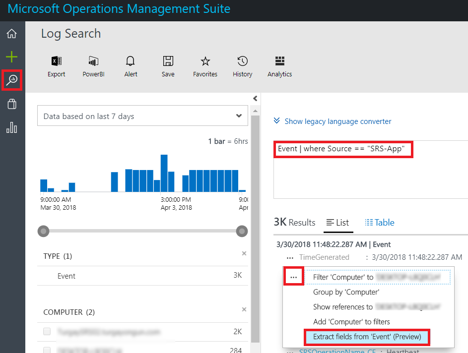

# <a name="deploy-skype-room-systems-v2-management-with-oms"></a><span data-ttu-id="fc7aa-103">Implementar la administración de Sistemas de salas de Skype v2 con OMS</span><span class="sxs-lookup"><span data-stu-id="fc7aa-103">Deploy Skype Room Systems v2 management with OMS</span></span>
 
<span data-ttu-id="fc7aa-104">En este artículo se describe cómo configurar e implementar administración integrada, end-to-end de dispositivos de sistemas de salón de Skype v2 mediante el uso conjunto de aplicaciones de administración de operaciones de Microsoft.</span><span class="sxs-lookup"><span data-stu-id="fc7aa-104">This article discusses how to set up and deploy integrated, end-to-end management of Skype Room Systems v2 devices by using Microsoft Operations Management Suite.</span></span>
  
<span data-ttu-id="fc7aa-105">Puede configurar Microsoft Operations Management Suite para proporcionar básico telemetry y alertas que le ayudarán a administración Skype dispositivos de sala de la reunión.</span><span class="sxs-lookup"><span data-stu-id="fc7aa-105">You can configure Microsoft Operations Management Suite to provide basic telemetry and alerts that will help you manage Skype meeting room devices.</span></span> <span data-ttu-id="fc7aa-106">A medida que crezca la solución de administración, decide implementar datos adicionales y capacidades de administración para crear una vista más detallada de la disponibilidad de dispositivos y el rendimiento.</span><span class="sxs-lookup"><span data-stu-id="fc7aa-106">As your management solution matures, you might decide to deploy additional data and management capabilities to create a more detailed view of device availability and performance.</span></span>

<span data-ttu-id="fc7aa-107">Siguiendo esta guía, puede usar un panel similar al ejemplo siguiente para obtener el estado detallado de informes de disponibilidad de dispositivo, aplicación y mantenimiento de hardware y distribución de la versión de aplicación de sistemas de salón de Skype v2.</span><span class="sxs-lookup"><span data-stu-id="fc7aa-107">By following this guide, you can use a dashboard like the following example to get detailed status reporting for device availability, application and hardware health, and Skype Room Systems v2 application version distribution.</span></span>

<span data-ttu-id="fc7aa-108">![Vista de OMS de ejemplo para SRS v2] (../../media/Deploy_OMS_1.png "Vista de OMS de ejemplo para SRS v2")</span><span class="sxs-lookup"><span data-stu-id="fc7aa-108"></span></span>
  
<span data-ttu-id="fc7aa-109">A un mayor nivel, debe realizar las siguientes tareas:</span><span class="sxs-lookup"><span data-stu-id="fc7aa-109">At a high level, you need to perform the following tasks:</span></span>


1.  [<span data-ttu-id="fc7aa-110">Validar la configuración del conjunto de aplicaciones de administración de operaciones</span><span class="sxs-lookup"><span data-stu-id="fc7aa-110">Validate Operations Management Suite configuration</span></span>](with-oms.md#validate_OMS)
2.  [<span data-ttu-id="fc7aa-111">Configurar dispositivos de prueba para la instalación de administración del conjunto de aplicaciones de administración de operaciones</span><span class="sxs-lookup"><span data-stu-id="fc7aa-111">Configure test devices for Operations Management Suite management setup</span></span>](with-oms.md#configure_test_devices)
3.  [<span data-ttu-id="fc7aa-112">Asignar campos personalizados</span><span class="sxs-lookup"><span data-stu-id="fc7aa-112">Map custom fields</span></span>](with-oms.md#Custom_fields)
4.  [<span data-ttu-id="fc7aa-113">Definir las vistas de v2 de sistemas de salón de Skype en conjunto de aplicaciones de administración de operaciones</span><span class="sxs-lookup"><span data-stu-id="fc7aa-113">Define the Skype Room Systems v2 views in Operations Management Suite</span></span>](with-oms.md#Define_Views)
5.  [<span data-ttu-id="fc7aa-114">Definir alertas</span><span class="sxs-lookup"><span data-stu-id="fc7aa-114">Define alerts</span></span>](with-oms.md#Alerts)
6.  [<span data-ttu-id="fc7aa-115">Configurar todos los dispositivos para el conjunto de aplicaciones de administración de operaciones</span><span class="sxs-lookup"><span data-stu-id="fc7aa-115">Configure all devices for Operations Management Suite</span></span>](with-oms.md#configure_all_devices)
7.  [<span data-ttu-id="fc7aa-116">Configurar más soluciones del conjunto de aplicaciones de administración de operaciones</span><span class="sxs-lookup"><span data-stu-id="fc7aa-116">Configure additional Operations Management Suite solutions</span></span>](with-oms.md#Solutions)

> [!IMPORTANT]
> <span data-ttu-id="fc7aa-117">Aunque con la configuración mínima, el conjunto de aplicaciones de administración de operaciones puede supervisar un equipo que ejecute un sistema operativo Windows, aún hay algunos pasos de sistemas específicas de la sala de Skype que debe tomar antes de iniciar la implementación de agentes a todos los sistemas de salón de Skype dispositivos.</span><span class="sxs-lookup"><span data-stu-id="fc7aa-117">Although with minimal configuration, the Operations Management Suite can monitor a computer running a Windows operating system, there are still some Skype Room Systems–specific steps that you need to take before you start deploying agents to all Skype Room Systems devices.</span></span>
> <span data-ttu-id="fc7aa-118">Por lo tanto, se recomienda encarecidamente que realizar todos los pasos de configuración en el orden correcto para un controlado el programa de instalación y configuración.</span><span class="sxs-lookup"><span data-stu-id="fc7aa-118">Therefore, we highly recommend you perform all configuration steps in the right order for a controlled setup and configuration.</span></span> <span data-ttu-id="fc7aa-119">La calidad del resultado final depende mucho de la calidad de la configuración inicial.</span><span class="sxs-lookup"><span data-stu-id="fc7aa-119">The quality of the end result very much depends on the quality of the initial configuration.</span></span>

## <a name="validate-operations-management-suite-configuration"></a><span data-ttu-id="fc7aa-120">Validar la configuración del conjunto de aplicaciones de administración de operaciones</span><span class="sxs-lookup"><span data-stu-id="fc7aa-120">Validate Operations Management Suite configuration</span></span>
<span data-ttu-id="fc7aa-121"><a name="validate_OMS"> </a></span><span class="sxs-lookup"><span data-stu-id="fc7aa-121"></span></span>

<span data-ttu-id="fc7aa-122">Debe tener un área de trabajo del conjunto de aplicaciones de administración de operaciones para iniciar la recopilación de registros de dispositivos de sistemas de salón de Skype.</span><span class="sxs-lookup"><span data-stu-id="fc7aa-122">You need to have an Operations Management Suite workspace to start collecting logs from Skype Room Systems devices.</span></span> <span data-ttu-id="fc7aa-123">Un área de trabajo es un entorno de análisis de registro único con su propio repositorio de datos, orígenes de datos y soluciones.</span><span class="sxs-lookup"><span data-stu-id="fc7aa-123">A workspace is a unique Log Analytics environment with its own data repository, data sources, and solutions.</span></span> <span data-ttu-id="fc7aa-124">Si ya dispone de un área de trabajo de análisis de registro existente, puede utilizarlo para supervisar la implementación de sistemas de salón de Skype o puede crear un área de trabajo de análisis de registro dedicado específico de la supervisión de los sistemas de la sala de Skype necesita.</span><span class="sxs-lookup"><span data-stu-id="fc7aa-124">If you already have an existing Log Analytics workspace, you might use it to monitor your Skype Room Systems deployment or you can create a dedicated Log Analytics workspace specific to your Skype Room Systems monitoring needs.</span></span>

<span data-ttu-id="fc7aa-125">Si necesita crear una nueva área de trabajo de análisis de registro, siga las instrucciones que aparecen en el artículo [crear un área de trabajo de análisis de registro en el portal de Azure](https://docs.microsoft.com/azure/log-analytics/log-analytics-quick-create-workspace)</span><span class="sxs-lookup"><span data-stu-id="fc7aa-125">If you need to create a new Log Analytics workspace, follow the instructions in the article [Create a Log Analytics workspace in the Azure portal](https://docs.microsoft.com/azure/log-analytics/log-analytics-quick-create-workspace)</span></span>

> [!NOTE]
> <span data-ttu-id="fc7aa-126">Para usar el análisis de registro con el conjunto de aplicaciones de administración de operaciones, debe tener una suscripción de Azure activa.</span><span class="sxs-lookup"><span data-stu-id="fc7aa-126">To use Log Analytics with Operations Management Suite, you need to have an active Azure subscription.</span></span> <span data-ttu-id="fc7aa-127">Si no dispone de una suscripción de Azure, puede crear [una suscripción de prueba gratuita](https://azure.microsoft.com/free) como punto de partida.</span><span class="sxs-lookup"><span data-stu-id="fc7aa-127">If you don’t have an Azure subscription, you can create [a free trial subscription](https://azure.microsoft.com/free) as a starting point.</span></span>


### <a name="configure-operations-management-suite-to-collect-skype-room-systems-event-logs"></a><span data-ttu-id="fc7aa-128">Configurar el conjunto de aplicaciones de administración de operaciones para recopilar los registros de eventos de sistemas de salón de Skype</span><span class="sxs-lookup"><span data-stu-id="fc7aa-128">Configure Operations Management Suite to collect Skype Room Systems event logs</span></span>

<span data-ttu-id="fc7aa-129">Análisis de registro sólo recopila eventos de los registros de eventos de Windows que se especifican en la configuración.</span><span class="sxs-lookup"><span data-stu-id="fc7aa-129">Log Analytics only collects events from the Windows event logs that are specified in the settings.</span></span> <span data-ttu-id="fc7aa-130">Para cada registro, se recopilan sólo los eventos con los niveles de gravedad seleccionados.</span><span class="sxs-lookup"><span data-stu-id="fc7aa-130">For each log, only the events with the selected severities are collected.</span></span>

<span data-ttu-id="fc7aa-131">Debe configurar el conjunto de aplicaciones de administración de operaciones para recopilar los registros necesarios para supervisar el estado de dispositivo y aplicación de sistemas de salón de Skype.</span><span class="sxs-lookup"><span data-stu-id="fc7aa-131">You need to configure Operations Management Suite to collect the logs required to monitor Skype Room Systems device and application status.</span></span> <span data-ttu-id="fc7aa-132">Los dispositivos de v2 de Skype salón sistemas usan el registro de eventos de sistemas de salón de Skype.</span><span class="sxs-lookup"><span data-stu-id="fc7aa-132">Skype Room Systems v2 devices use the Skype Room Systems event log.</span></span>

<span data-ttu-id="fc7aa-133">Para configurar el conjunto de aplicaciones de administración de operaciones para recopilar los eventos de sistemas de salón de Skype, vea [orígenes de datos de registro de eventos de Windows en el registro de análisis](https://docs.microsoft.com/azure/log-analytics/log-analytics-data-sources-windows-events)</span><span class="sxs-lookup"><span data-stu-id="fc7aa-133">To configure Operations Management Suite to collect the Skype Room Systems events, see [Windows event log data sources in Log Analytics](https://docs.microsoft.com/azure/log-analytics/log-analytics-data-sources-windows-events)</span></span>

<span data-ttu-id="fc7aa-134">![Configuración del registro de eventos] (../../media/Deploy_OMS_2.png "Configuración del registro de eventos")</span><span class="sxs-lookup"><span data-stu-id="fc7aa-134"></span></span>


> [!IMPORTANT]
> <span data-ttu-id="fc7aa-135">Seleccione el registro de eventos del sistema de salas de Skype y, a continuación, seleccione las casillas de verificación **Error**, **Advertencia**e **información** .</span><span class="sxs-lookup"><span data-stu-id="fc7aa-135">Select the Skype Room System event log, and then select the **Error**, **Warning**, and **Information** check boxes.</span></span>

## <a name="configure-test-devices-for-operations-management-suite-setup"></a><span data-ttu-id="fc7aa-136">Configurar dispositivos de prueba para el programa de instalación del conjunto de aplicaciones de administración de operaciones</span><span class="sxs-lookup"><span data-stu-id="fc7aa-136">Configure test devices for Operations Management Suite setup</span></span>
<span data-ttu-id="fc7aa-137"><a name="configure_test_devices"> </a></span><span class="sxs-lookup"><span data-stu-id="fc7aa-137"></span></span>

<span data-ttu-id="fc7aa-138">Debe preparar el conjunto de aplicaciones de las operaciones de administración para poder supervisar los eventos relacionados con sistemas de salón de Skype.</span><span class="sxs-lookup"><span data-stu-id="fc7aa-138">You need to prepare Operations Management Suite to be able to monitor Skype Room Systems–related events.</span></span> <span data-ttu-id="fc7aa-139">Para empezar con, necesita implementar los agentes del conjunto de aplicaciones de administración de operaciones en sólo uno o dos sistemas de salón de Skype los dispositivos que tienen acceso físico a y los dispositivos de prueba generar algunos datos e inserción al área de trabajo de análisis de registro.</span><span class="sxs-lookup"><span data-stu-id="fc7aa-139">To start with, you need to deploy Operations Management Suite agents to just one or two Skype Room Systems devices that you have physical access to and have those test devices generate some data and push it to the Log Analytics workspace.</span></span>

### <a name="install-operations-management-suite-agents-to-test-devices"></a><span data-ttu-id="fc7aa-140">Instalar los agentes de conjunto de aplicaciones de administración de operaciones para los dispositivos de prueba</span><span class="sxs-lookup"><span data-stu-id="fc7aa-140">Install Operations Management Suite agents to test devices</span></span>

<span data-ttu-id="fc7aa-141">Implementar al agente de conjunto de aplicaciones de administración de operaciones en los dispositivos de prueba mediante el uso de las instrucciones proporcionadas en [equipos Windows conectarse al servicio de registro de análisis de Azure](https://docs.microsoft.com/azure/log-analytics/log-analytics-agent-windows).</span><span class="sxs-lookup"><span data-stu-id="fc7aa-141">Deploy the Operations Management Suite agent to the test devices by using the instructions provided in [Connect Windows computers to the Log Analytics service in Azure](https://docs.microsoft.com/azure/log-analytics/log-analytics-agent-windows).</span></span> <span data-ttu-id="fc7aa-142">En este artículo se proporciona información detallada sobre los pasos para la implementación de Microsoft de supervisión agente para Windows, instrucciones para obtener el identificador de área de trabajo de las operaciones de administración de conjunto de aplicaciones de y la clave principal para obtener los dispositivos de sistemas de salón de Skype conectado a su Implementación de conjunto de aplicaciones de administración de operaciones y los pasos para comprobar la conectividad del agente para el análisis de registro.</span><span class="sxs-lookup"><span data-stu-id="fc7aa-142">This article gives detailed information about the steps for deploying Microsoft Monitoring Agent for Windows, instructions for obtaining the Operations Management Suite Workspace ID and the primary key to get Skype Room Systems devices connected to your Operations Management Suite deployment, and steps to verify agent connectivity to Log Analytics.</span></span>

### <a name="generate-sample-skype-room-systems-events"></a><span data-ttu-id="fc7aa-143">Generar eventos de sistemas de salón de Skype de ejemplo</span><span class="sxs-lookup"><span data-stu-id="fc7aa-143">Generate sample Skype Room Systems events</span></span>

<span data-ttu-id="fc7aa-144">Después de que el agente de conjunto de aplicaciones de administración de operaciones se implementa en los dispositivos de prueba, compruebe que se recopilan los datos de registro de eventos necesarios por el análisis de registro.</span><span class="sxs-lookup"><span data-stu-id="fc7aa-144">After the Operations Management Suite agent is deployed onto the test devices, verify that the required event log data is collected by Log Analytics.</span></span>

1.  <span data-ttu-id="fc7aa-145">Inicie sesión el [portal del conjunto de aplicaciones de administración de operaciones de Microsoft](http://aka.ms/omsportal).</span><span class="sxs-lookup"><span data-stu-id="fc7aa-145">Sign in to the [Microsoft Operations Management Suite portal](http://aka.ms/omsportal).</span></span>

2.  <span data-ttu-id="fc7aa-146">Se enumeran los eventos generados por un dispositivo de sistemas de salón de Skype:</span><span class="sxs-lookup"><span data-stu-id="fc7aa-146">List the events generated by a Skype Room Systems device:</span></span>
    1.  <span data-ttu-id="fc7aa-147">Vaya a la **Búsqueda de registro** y usar una consulta para recuperar los registros que va a tener el campo personalizado.</span><span class="sxs-lookup"><span data-stu-id="fc7aa-147">Go to **Log Search** and use a query to retrieve the records that will have the custom field.</span></span>
    2.  <span data-ttu-id="fc7aa-148">Consulta de ejemplo:`Event | where Source == "SRS-App"`</span><span class="sxs-lookup"><span data-stu-id="fc7aa-148">Sample query: `Event | where Source == "SRS-App"`</span></span>

3.  <span data-ttu-id="fc7aa-149">Asegúrese de que la consulta devuelve los registros de registro que incluyen eventos de latido correcta.</span><span class="sxs-lookup"><span data-stu-id="fc7aa-149">Make sure that the query returns log records that include successful heartbeat events.</span></span>

4.  <span data-ttu-id="fc7aa-150">Generar un problema de hardware y validar que se registran los eventos necesarios en el conjunto de aplicaciones de administración de operaciones.</span><span class="sxs-lookup"><span data-stu-id="fc7aa-150">Generate a hardware issue, and validate that the required events are logged in Operations Management Suite.</span></span>
    1.  <span data-ttu-id="fc7aa-151">Desconecte uno de los dispositivos periféricos en la prueba del sistema de sistemas de salón de Skype.</span><span class="sxs-lookup"><span data-stu-id="fc7aa-151">Unplug one of the peripheral devices on the test Skype Room Systems system.</span></span> <span data-ttu-id="fc7aa-152">Podría tratarse de la cámara, altavoz, micrófono o para mostrar de la sala de frente</span><span class="sxs-lookup"><span data-stu-id="fc7aa-152">This could be the camera, speakerphone, microphone, or Front Room Display</span></span>
    2.  <span data-ttu-id="fc7aa-153">Espere 10 minutos para el registro de eventos se rellene el conjunto de aplicaciones de administración de operaciones.</span><span class="sxs-lookup"><span data-stu-id="fc7aa-153">Wait 10 minutes for the event log to be populated in Operations Management Suite.</span></span>
    3.  <span data-ttu-id="fc7aa-154">Utilizar una consulta para los eventos de error de hardware de lista:`Event | where EventID == 3001`</span><span class="sxs-lookup"><span data-stu-id="fc7aa-154">Use a query to list hardware error events: `Event | where EventID == 3001`</span></span>

5.  <span data-ttu-id="fc7aa-155">Generar un problema de la aplicación y validar que se registran los eventos necesarios.</span><span class="sxs-lookup"><span data-stu-id="fc7aa-155">Generate an application issue, and validate that the required events are logged.</span></span>
    1.  <span data-ttu-id="fc7aa-156">Modificar la configuración de la aplicación de sistemas de salón de Skype y escriba un par de dirección y contraseña de protocolo de inicio de sesión (SIP) incorrecta.</span><span class="sxs-lookup"><span data-stu-id="fc7aa-156">Modify Skype Room Systems application configuration, and type an incorrect Session Initiation Protocol (SIP) address/password pair.</span></span>
    2.  <span data-ttu-id="fc7aa-157">Espere 10 minutos para el registro de eventos se rellene el conjunto de aplicaciones de administración de operaciones.</span><span class="sxs-lookup"><span data-stu-id="fc7aa-157">Wait 10 minutes for the event log to be populated in Operations Management Suite.</span></span>
    3.  <span data-ttu-id="fc7aa-158">Utilizar una consulta para los eventos de error de aplicación de lista:`Event | where EventID == 2001`</span><span class="sxs-lookup"><span data-stu-id="fc7aa-158">Use a query to list application error events: `Event | where EventID == 2001`</span></span>

> [!IMPORTANT]
> <span data-ttu-id="fc7aa-159">Estos registros de eventos de ejemplo se requieren antes de que se pueden configurar los campos personalizados.</span><span class="sxs-lookup"><span data-stu-id="fc7aa-159">These sample event logs are required before custom fields can be configured.</span></span> <span data-ttu-id="fc7aa-160">No continúe con el siguiente paso hasta que haya recopilado los registros de eventos necesarios.</span><span class="sxs-lookup"><span data-stu-id="fc7aa-160">Don’t proceed to the next step until you have collected the required event logs.</span></span>

## <a name="map-custom-fields"></a><span data-ttu-id="fc7aa-161">Asignar campos personalizados</span><span class="sxs-lookup"><span data-stu-id="fc7aa-161">Map custom fields</span></span>
<span data-ttu-id="fc7aa-162"><a name="Custom_fields"> </a></span><span class="sxs-lookup"><span data-stu-id="fc7aa-162"></span></span>

<span data-ttu-id="fc7aa-163">Usar campos personalizados para extraer datos específicos de los registros de eventos.</span><span class="sxs-lookup"><span data-stu-id="fc7aa-163">You use custom fields to extract specific data from the event logs.</span></span> <span data-ttu-id="fc7aa-164">Debe definir los campos personalizados que se usará más adelante con los mosaicos, vistas de panel y alertas.</span><span class="sxs-lookup"><span data-stu-id="fc7aa-164">You need to define custom fields that will be used later with your tiles, dashboard views, and alerts.</span></span> <span data-ttu-id="fc7aa-165">Vea [campos personalizados de análisis de registro de](https://docs.microsoft.com/azure/log-analytics/log-analytics-custom-fields) y a familiarizarse con los conceptos antes de empezar a crear los campos personalizados.</span><span class="sxs-lookup"><span data-stu-id="fc7aa-165">See [Custom fields in Log Analytics](https://docs.microsoft.com/azure/log-analytics/log-analytics-custom-fields) and become familiar with the concepts before you start creating your custom fields.</span></span>

<span data-ttu-id="fc7aa-166">Para extraer los campos personalizados fuera de los registros de eventos capturados, siga estos pasos:</span><span class="sxs-lookup"><span data-stu-id="fc7aa-166">To extract your custom fields out of the captured event logs, follow these steps:</span></span>

1.  <span data-ttu-id="fc7aa-167">Inicie sesión el [portal del conjunto de aplicaciones de administración de operaciones de Microsoft](http://aka.ms/omsportal).</span><span class="sxs-lookup"><span data-stu-id="fc7aa-167">Sign in to the [Microsoft Operations Management Suite portal](http://aka.ms/omsportal).</span></span>

2.  <span data-ttu-id="fc7aa-168">Se enumeran los eventos generados por un dispositivo de sistemas de salón de Skype:</span><span class="sxs-lookup"><span data-stu-id="fc7aa-168">List the events generated by a Skype Room Systems device:</span></span>
    1.  <span data-ttu-id="fc7aa-169">Vaya a la **Búsqueda de registro** y usar una consulta para recuperar los registros que va a tener el campo personalizado.</span><span class="sxs-lookup"><span data-stu-id="fc7aa-169">Go to **Log Search** and use a query to retrieve the records that will have the custom field.</span></span>
    2.  <span data-ttu-id="fc7aa-170">Consulta de ejemplo:`Event | where Source == "SRS-App"`</span><span class="sxs-lookup"><span data-stu-id="fc7aa-170">Sample query: `Event | where Source == "SRS-App"`</span></span>

3.  <span data-ttu-id="fc7aa-171">Seleccione uno de los registros, seleccione el botón situado a la izquierda e iniciar al Asistente para la extracción de campo.</span><span class="sxs-lookup"><span data-stu-id="fc7aa-171">Select one of the records, select the button to the left, and start the field extraction wizard.</span></span>

<span data-ttu-id="fc7aa-172">![Asistente para la extracción de campo] (../../media/Deploy_OMS_3.png "Asistente para la extracción de campo")</span><span class="sxs-lookup"><span data-stu-id="fc7aa-172"></span></span>

4.  <span data-ttu-id="fc7aa-173">Resalte los datos que le gustaría extraer el RenderedDescription y proporcione un título de campo.</span><span class="sxs-lookup"><span data-stu-id="fc7aa-173">Highlight the data you’d like to extract from the RenderedDescription and provide a Field Title.</span></span> <span data-ttu-id="fc7aa-174">Se proporcionan los nombres de campo que se deben usar en la tabla 1.</span><span class="sxs-lookup"><span data-stu-id="fc7aa-174">The field names that you should use are provided in Table 1.</span></span>

<span data-ttu-id="fc7aa-175">![Definición de campos personalizados] (../../media/Deploy_OMS_4.png "Definición de campos personalizados")</span><span class="sxs-lookup"><span data-stu-id="fc7aa-175"></span></span>

5.  <span data-ttu-id="fc7aa-176">Use las asignaciones que se muestra en la tabla 1.</span><span class="sxs-lookup"><span data-stu-id="fc7aa-176">Use the mappings shown in Table 1.</span></span> <span data-ttu-id="fc7aa-177">Conjunto de aplicaciones de administración de operaciones agregará automáticamente la ** \_CF** al definir el nuevo campo de cadena.</span><span class="sxs-lookup"><span data-stu-id="fc7aa-177">Operations Management Suite will automatically add the **\_CF** string when you define the new field.</span></span>

> [!IMPORTANT]
> <span data-ttu-id="fc7aa-178">Recuerde que todos los campos JSON y conjunto de aplicaciones de administración de operaciones distinguen mayúsculas de minúsculas.</span><span class="sxs-lookup"><span data-stu-id="fc7aa-178">Remember that all JSON and Operations Management Suite fields are case-sensitive.</span></span>

> <span data-ttu-id="fc7aa-179">Preste atención al estado de la casilla de verificación de suceso en la tabla siguiente.</span><span class="sxs-lookup"><span data-stu-id="fc7aa-179">Pay attention to the state of the EventID check box in the table below.</span></span> <span data-ttu-id="fc7aa-180">Asegúrese de que confirmar el estado de esta casilla de verificación para el conjunto de aplicaciones de administración de operaciones extraer correctamente los valores de campo personalizado.</span><span class="sxs-lookup"><span data-stu-id="fc7aa-180">Be sure you confirm the state of this check box for Operations Management Suite to successfully extract custom field values.</span></span>
> <span data-ttu-id="fc7aa-181">![Definición de campos personalizados] (../../media/Deploy_OMS_5.png "Definición de campos personalizados")</span><span class="sxs-lookup"><span data-stu-id="fc7aa-181"></span></span> 

<span data-ttu-id="fc7aa-182">**Tabla 1**</span><span class="sxs-lookup"><span data-stu-id="fc7aa-182">**Table 1**</span></span>

| <span data-ttu-id="fc7aa-183">**Campo JSON**</span><span class="sxs-lookup"><span data-stu-id="fc7aa-183">**JSON field**</span></span>               | <span data-ttu-id="fc7aa-184">**Campo personalizado de OMS**</span><span class="sxs-lookup"><span data-stu-id="fc7aa-184">**OMS custom field**</span></span>       | <span data-ttu-id="fc7aa-185">**Identificador de evento**</span><span class="sxs-lookup"><span data-stu-id="fc7aa-185">**Event ID**</span></span> |
|------------------------------|----------------------------|-----------------|
| <span data-ttu-id="fc7aa-186">Descripción</span><span class="sxs-lookup"><span data-stu-id="fc7aa-186">Description</span></span>                  | <span data-ttu-id="fc7aa-187">SRSEventDescription_CF</span><span class="sxs-lookup"><span data-stu-id="fc7aa-187">SRSEventDescription_CF</span></span>     | <span data-ttu-id="fc7aa-188">No seleccionado</span><span class="sxs-lookup"><span data-stu-id="fc7aa-188">Not selected</span></span>    |
| <span data-ttu-id="fc7aa-189">ResourceState</span><span class="sxs-lookup"><span data-stu-id="fc7aa-189">ResourceState</span></span>                | <span data-ttu-id="fc7aa-190">SRSResourceState_CF</span><span class="sxs-lookup"><span data-stu-id="fc7aa-190">SRSResourceState_CF</span></span>        | <span data-ttu-id="fc7aa-191">No seleccionado</span><span class="sxs-lookup"><span data-stu-id="fc7aa-191">Not selected</span></span>    |
| <span data-ttu-id="fc7aa-192">NombreDeOperación</span><span class="sxs-lookup"><span data-stu-id="fc7aa-192">OperationName</span></span>                | <span data-ttu-id="fc7aa-193">SRSOperationName_CF</span><span class="sxs-lookup"><span data-stu-id="fc7aa-193">SRSOperationName_CF</span></span>        | <span data-ttu-id="fc7aa-194">No seleccionado</span><span class="sxs-lookup"><span data-stu-id="fc7aa-194">Not selected</span></span>    |
| <span data-ttu-id="fc7aa-195">OperationResult</span><span class="sxs-lookup"><span data-stu-id="fc7aa-195">OperationResult</span></span>              | <span data-ttu-id="fc7aa-196">SRSOperationResult_CF</span><span class="sxs-lookup"><span data-stu-id="fc7aa-196">SRSOperationResult_CF</span></span>      | <span data-ttu-id="fc7aa-197">No seleccionado</span><span class="sxs-lookup"><span data-stu-id="fc7aa-197">Not selected</span></span>    |
| <span data-ttu-id="fc7aa-198">OS</span><span class="sxs-lookup"><span data-stu-id="fc7aa-198">OS</span></span>                           | <span data-ttu-id="fc7aa-199">SRSOSVersion_CF</span><span class="sxs-lookup"><span data-stu-id="fc7aa-199">SRSOSVersion_CF</span></span>            | <span data-ttu-id="fc7aa-200">No seleccionado</span><span class="sxs-lookup"><span data-stu-id="fc7aa-200">Not selected</span></span>    |
| <span data-ttu-id="fc7aa-201">OSVersion</span><span class="sxs-lookup"><span data-stu-id="fc7aa-201">OSVersion</span></span>                    | <span data-ttu-id="fc7aa-202">SRSOSLongVersion_CF</span><span class="sxs-lookup"><span data-stu-id="fc7aa-202">SRSOSLongVersion_CF</span></span>        | <span data-ttu-id="fc7aa-203">No seleccionado</span><span class="sxs-lookup"><span data-stu-id="fc7aa-203">Not selected</span></span>    |
| <span data-ttu-id="fc7aa-204">Alias</span><span class="sxs-lookup"><span data-stu-id="fc7aa-204">Alias</span></span>                        | <span data-ttu-id="fc7aa-205">SRSAlias_CF</span><span class="sxs-lookup"><span data-stu-id="fc7aa-205">SRSAlias_CF</span></span>                | <span data-ttu-id="fc7aa-206">No seleccionado</span><span class="sxs-lookup"><span data-stu-id="fc7aa-206">Not selected</span></span>    |
| <span data-ttu-id="fc7aa-207">DisplayName</span><span class="sxs-lookup"><span data-stu-id="fc7aa-207">DisplayName</span></span>                  | <span data-ttu-id="fc7aa-208">SRSDisplayName_CF</span><span class="sxs-lookup"><span data-stu-id="fc7aa-208">SRSDisplayName_CF</span></span>          | <span data-ttu-id="fc7aa-209">No seleccionado</span><span class="sxs-lookup"><span data-stu-id="fc7aa-209">Not selected</span></span>    |
| <span data-ttu-id="fc7aa-210">AppVersion</span><span class="sxs-lookup"><span data-stu-id="fc7aa-210">AppVersion</span></span>                   | <span data-ttu-id="fc7aa-211">SRSAppVersion_CF</span><span class="sxs-lookup"><span data-stu-id="fc7aa-211">SRSAppVersion_CF</span></span>           | <span data-ttu-id="fc7aa-212">No seleccionado</span><span class="sxs-lookup"><span data-stu-id="fc7aa-212">Not selected</span></span>    |
| <span data-ttu-id="fc7aa-213">IPv4Address</span><span class="sxs-lookup"><span data-stu-id="fc7aa-213">IPv4Address</span></span>                  | <span data-ttu-id="fc7aa-214">SRSIPv4Address_CF</span><span class="sxs-lookup"><span data-stu-id="fc7aa-214">SRSIPv4Address_CF</span></span>          | <span data-ttu-id="fc7aa-215">No seleccionado</span><span class="sxs-lookup"><span data-stu-id="fc7aa-215">Not selected</span></span>    |
| <span data-ttu-id="fc7aa-216">IPv6Address</span><span class="sxs-lookup"><span data-stu-id="fc7aa-216">IPv6Address</span></span>                  | <span data-ttu-id="fc7aa-217">SRSIPv6Address_CF</span><span class="sxs-lookup"><span data-stu-id="fc7aa-217">SRSIPv6Address_CF</span></span>          | <span data-ttu-id="fc7aa-218">No seleccionado</span><span class="sxs-lookup"><span data-stu-id="fc7aa-218">Not selected</span></span>    |
| <span data-ttu-id="fc7aa-219">Parte delantera del estado de visualización de salón</span><span class="sxs-lookup"><span data-stu-id="fc7aa-219">Front of Room Display status</span></span> | <span data-ttu-id="fc7aa-220">SRSFORDStatus_CF</span><span class="sxs-lookup"><span data-stu-id="fc7aa-220">SRSFORDStatus_CF</span></span>           | <span data-ttu-id="fc7aa-221">3001</span><span class="sxs-lookup"><span data-stu-id="fc7aa-221">3001</span></span>            |
| <span data-ttu-id="fc7aa-222">Estado de la cámara</span><span class="sxs-lookup"><span data-stu-id="fc7aa-222">Camera status</span></span>                | <span data-ttu-id="fc7aa-223">SRSCameraStatus_CF</span><span class="sxs-lookup"><span data-stu-id="fc7aa-223">SRSCameraStatus_CF</span></span>         | <span data-ttu-id="fc7aa-224">3001</span><span class="sxs-lookup"><span data-stu-id="fc7aa-224">3001</span></span>            |
| <span data-ttu-id="fc7aa-225">Estado de micrófono de conferencia</span><span class="sxs-lookup"><span data-stu-id="fc7aa-225">Conference Microphone status</span></span> | <span data-ttu-id="fc7aa-226">SRSConfMicrophoneStatus_CF</span><span class="sxs-lookup"><span data-stu-id="fc7aa-226">SRSConfMicrophoneStatus_CF</span></span> | <span data-ttu-id="fc7aa-227">3001</span><span class="sxs-lookup"><span data-stu-id="fc7aa-227">3001</span></span>            |
| <span data-ttu-id="fc7aa-228">Estado de altavoz de conferencia</span><span class="sxs-lookup"><span data-stu-id="fc7aa-228">Conference Speaker status</span></span>    | <span data-ttu-id="fc7aa-229">SRSConfSpeakerStatus_CF</span><span class="sxs-lookup"><span data-stu-id="fc7aa-229">SRSConfSpeakerStatus_CF</span></span>    | <span data-ttu-id="fc7aa-230">3001</span><span class="sxs-lookup"><span data-stu-id="fc7aa-230">3001</span></span>            |
| <span data-ttu-id="fc7aa-231">Estado del altavoz predeterminado</span><span class="sxs-lookup"><span data-stu-id="fc7aa-231">Default Speaker status</span></span>       | <span data-ttu-id="fc7aa-232">SRSDefaultSpeakerStatus_CF</span><span class="sxs-lookup"><span data-stu-id="fc7aa-232">SRSDefaultSpeakerStatus_CF</span></span> | <span data-ttu-id="fc7aa-233">3001</span><span class="sxs-lookup"><span data-stu-id="fc7aa-233">3001</span></span>            |
| <span data-ttu-id="fc7aa-234">Estado del Sensor de movimiento</span><span class="sxs-lookup"><span data-stu-id="fc7aa-234">Motion Sensor status</span></span>         | <span data-ttu-id="fc7aa-235">SRSMotionSensorStatus_CF</span><span class="sxs-lookup"><span data-stu-id="fc7aa-235">SRSMotionSensorStatus_CF</span></span>   | <span data-ttu-id="fc7aa-236">3001</span><span class="sxs-lookup"><span data-stu-id="fc7aa-236">3001</span></span>            |
| <span data-ttu-id="fc7aa-237">Estado de ingesta HDMI</span><span class="sxs-lookup"><span data-stu-id="fc7aa-237">HDMI Ingest status</span></span>           | <span data-ttu-id="fc7aa-238">SRSHDMIIngestStatus_CF</span><span class="sxs-lookup"><span data-stu-id="fc7aa-238">SRSHDMIIngestStatus_CF</span></span>     | <span data-ttu-id="fc7aa-239">3001</span><span class="sxs-lookup"><span data-stu-id="fc7aa-239">3001</span></span>            |


## <a name="define-the-skype-room-systems-v2-views-in-operations-management-suite"></a><span data-ttu-id="fc7aa-240">Definir las vistas de v2 de sistemas de salón de Skype en conjunto de aplicaciones de administración de operaciones</span><span class="sxs-lookup"><span data-stu-id="fc7aa-240">Define the Skype Room Systems v2 views in Operations Management Suite</span></span>
<span data-ttu-id="fc7aa-241"><a name="Define_Views"> </a></span><span class="sxs-lookup"><span data-stu-id="fc7aa-241"></span></span>

<span data-ttu-id="fc7aa-242">Una vez que se recopilan los datos y se asignan los campos personalizados, puede usar el Diseñador de vistas de conjunto de aplicaciones de administración de operaciones para desarrollar un panel que contiene varios mosaicos para supervisar los eventos de sistemas de salón de Skype v2.</span><span class="sxs-lookup"><span data-stu-id="fc7aa-242">After data is collected and custom fields are mapped, you can use Operations Management Suite View Designer to develop a dashboard containing various tiles to monitor Skype Room Systems v2 events.</span></span> <span data-ttu-id="fc7aa-243">Use Diseñador de vistas para crear los siguientes iconos.</span><span class="sxs-lookup"><span data-stu-id="fc7aa-243">Use View Designer to create the following tiles.</span></span> <span data-ttu-id="fc7aa-244">Para obtener más información, vea [Usar el Diseñador de vistas para crear vistas personalizadas en el registro de análisis](https://docs.microsoft.com/azure/log-analytics/log-analytics-view-designer)</span><span class="sxs-lookup"><span data-stu-id="fc7aa-244">For more information, see [Use View Designer to create custom views in Log Analytics](https://docs.microsoft.com/azure/log-analytics/log-analytics-view-designer)</span></span>

> [!NOTE]
> <span data-ttu-id="fc7aa-245">Deben haber completado los pasos anteriores en esta guía para que los mosaicos del panel funcionen correctamente.</span><span class="sxs-lookup"><span data-stu-id="fc7aa-245">Earlier steps in this guide should have been completed for the dashboard tiles to work properly.</span></span>


### <a name="create-a-skype-room-systems-v2-dashboard-by-using-the-import-method"></a><span data-ttu-id="fc7aa-246">Crear un panel de v2 de Skype salón sistemas mediante el método de importación</span><span class="sxs-lookup"><span data-stu-id="fc7aa-246">Create a Skype Room Systems v2 dashboard by using the import method</span></span>

<span data-ttu-id="fc7aa-247">Puede importar un panel de conjunto de aplicaciones de administración de operaciones e iniciar la supervisión de los dispositivos inmediatamente.</span><span class="sxs-lookup"><span data-stu-id="fc7aa-247">You can import an Operations Management Suite dashboard and start monitoring your devices immediately.</span></span> <span data-ttu-id="fc7aa-248">Lleve a cabo los siguientes pasos para importar el panel:</span><span class="sxs-lookup"><span data-stu-id="fc7aa-248">Take the following steps to import the dashboard:</span></span>

1.  <span data-ttu-id="fc7aa-249">Descargue el [panel](http://download.microsoft.com/download/9/0/D/90D4826A-9FD2-47D2-B911-97BF1737F4F7/SkypeRoomSystems_v2.omsview).</span><span class="sxs-lookup"><span data-stu-id="fc7aa-249">Download the [dashboard](http://download.microsoft.com/download/9/0/D/90D4826A-9FD2-47D2-B911-97BF1737F4F7/SkypeRoomSystems_v2.omsview).</span></span>
2.  <span data-ttu-id="fc7aa-250">Inicie sesión el [portal del conjunto de aplicaciones de administración de operaciones de Microsoft](http://aka.ms/omsportal).</span><span class="sxs-lookup"><span data-stu-id="fc7aa-250">Sign in to the [Microsoft Operations Management Suite portal](http://aka.ms/omsportal).</span></span>
3.  <span data-ttu-id="fc7aa-251">Abra el **Diseñador de vistas**.</span><span class="sxs-lookup"><span data-stu-id="fc7aa-251">Open **View Designer**.</span></span>
4.  <span data-ttu-id="fc7aa-252">Seleccione **Importar**y, a continuación, seleccione el archivo **SkypeRoomSystems_v2.omsview** .</span><span class="sxs-lookup"><span data-stu-id="fc7aa-252">Select **Import**, and then select the **SkypeRoomSystems_v2.omsview** file.</span></span>
5.  <span data-ttu-id="fc7aa-253">Seleccione **Guardar**.</span><span class="sxs-lookup"><span data-stu-id="fc7aa-253">Select **Save**.</span></span>

### <a name="create-a-skype-room-systems-v2-dashboard-manually"></a><span data-ttu-id="fc7aa-254">Crear un panel de sistemas de salón de Skype v2 de forma manual</span><span class="sxs-lookup"><span data-stu-id="fc7aa-254">Create a Skype Room Systems v2 dashboard manually</span></span>

<span data-ttu-id="fc7aa-255">Como alternativa, puede crear su propio escritorio y agregar sólo los mosaicos que desea supervisar.</span><span class="sxs-lookup"><span data-stu-id="fc7aa-255">Alternatively, you can create your own dashboard and add only the tiles that you wish to monitor.</span></span>

#### <a name="configure-the-overview-tile"></a><span data-ttu-id="fc7aa-256">Configurar el icono de información general</span><span class="sxs-lookup"><span data-stu-id="fc7aa-256">Configure the Overview Tile</span></span>
1.  <span data-ttu-id="fc7aa-257">Abra el **Diseñador de vistas**.</span><span class="sxs-lookup"><span data-stu-id="fc7aa-257">Open **View Designer**.</span></span>
2.  <span data-ttu-id="fc7aa-258">Seleccione el **Icono de información general sobre**y, a continuación, seleccione **dos números** de la galería.</span><span class="sxs-lookup"><span data-stu-id="fc7aa-258">Select **Overview Tile**, and then select **Two numbers** from the gallery.</span></span>
3.  <span data-ttu-id="fc7aa-259">Nombre el mosaico **Skype salón de sistemas**.</span><span class="sxs-lookup"><span data-stu-id="fc7aa-259">Name the tile **Skype Room Systems**.</span></span>
4.  <span data-ttu-id="fc7aa-260">Definir el **primer mosaico**:</span><span class="sxs-lookup"><span data-stu-id="fc7aa-260">Define the **First Tile**:</span></span><br>
    <span data-ttu-id="fc7aa-261">**Leyenda:** Dispositivos que se ha enviado un latido al menos una vez dentro del último mes</span><span class="sxs-lookup"><span data-stu-id="fc7aa-261">**Legend:** Devices that sent a heartbeat at least once within the last month</span></span><br>
    <span data-ttu-id="fc7aa-262">**Consulta:**```Event | where EventLog == "Skype Room System" and TimeGenerated > ago(30d) | summarize TotalSRSDevices = dcount(Computer)```</span><span class="sxs-lookup"><span data-stu-id="fc7aa-262">**Query:** ```Event | where EventLog == "Skype Room System" and TimeGenerated > ago(30d) | summarize TotalSRSDevices = dcount(Computer)```</span></span>
5.  <span data-ttu-id="fc7aa-263">Defina el **segundo icono**:</span><span class="sxs-lookup"><span data-stu-id="fc7aa-263">Define the **Second Tile**:</span></span><br>
    <span data-ttu-id="fc7aa-264">**Leyenda:** Dispositivos activos que envían un latido dentro de la última hora</span><span class="sxs-lookup"><span data-stu-id="fc7aa-264">**Legend:** Active devices that sent a heartbeat within the last hour</span></span><br>
    <span data-ttu-id="fc7aa-265">**Consulta:**```Event | where EventLog == "Skype Room System" and SRSOperationName_CF == "Heartbeat" and TimeGenerated > ago(1h) | summarize TotalSRSDevices = dcount(Computer)```</span><span class="sxs-lookup"><span data-stu-id="fc7aa-265">**Query:** ```Event | where EventLog == "Skype Room System" and SRSOperationName_CF == "Heartbeat" and TimeGenerated > ago(1h) | summarize TotalSRSDevices = dcount(Computer)```</span></span>
6.  <span data-ttu-id="fc7aa-266">Seleccione **Aplicar**.</span><span class="sxs-lookup"><span data-stu-id="fc7aa-266">Select **Apply**.</span></span>

### <a name="create-a-tile-that-displays-active-devices"></a><span data-ttu-id="fc7aa-267">Crear un icono que muestra los dispositivos de activos</span><span class="sxs-lookup"><span data-stu-id="fc7aa-267">Create a tile that displays active devices</span></span>
1.  <span data-ttu-id="fc7aa-268">Seleccione el **Panel de vista** para empezar a agregar los mosaicos.</span><span class="sxs-lookup"><span data-stu-id="fc7aa-268">Select **View Dashboard** to start adding your tiles.</span></span>
2.  <span data-ttu-id="fc7aa-269">Seleccione el **número y la lista** de la Galería de</span><span class="sxs-lookup"><span data-stu-id="fc7aa-269">Select **Number & list** from the gallery</span></span>
3.  <span data-ttu-id="fc7aa-270">Definir las propiedades **generales** :</span><span class="sxs-lookup"><span data-stu-id="fc7aa-270">Define the **General** properties:</span></span><br>
    <span data-ttu-id="fc7aa-271">**Título de grupo:** Estado del latido</span><span class="sxs-lookup"><span data-stu-id="fc7aa-271">**Group Title:** Heartbeat Status</span></span><br>
    <span data-ttu-id="fc7aa-272">**Nuevo grupo:** Seleccionado</span><span class="sxs-lookup"><span data-stu-id="fc7aa-272">**New Group:** Selected</span></span>
4.  <span data-ttu-id="fc7aa-273">Definir las propiedades de **icono** :</span><span class="sxs-lookup"><span data-stu-id="fc7aa-273">Define the **Tile** properties:</span></span><br>
    <span data-ttu-id="fc7aa-274">**Leyenda:** Dispositivos activos (latido enviado en los últimos 20 minutos)</span><span class="sxs-lookup"><span data-stu-id="fc7aa-274">**Legend:** Active devices (heartbeat sent in the last 20 minutes)</span></span><br>
    <span data-ttu-id="fc7aa-275">**Consulta en mosaico:**```Event | where EventLog == "Skype Room System" and SRSOperationName_CF == "Heartbeat" and TimeGenerated > ago(20m) | summarize AggregatedValue = count() by Computer | count```</span><span class="sxs-lookup"><span data-stu-id="fc7aa-275">**Tile Query:** ```Event | where EventLog == "Skype Room System" and SRSOperationName_CF == "Heartbeat" and TimeGenerated > ago(20m) | summarize AggregatedValue = count() by Computer | count```</span></span>
5.  <span data-ttu-id="fc7aa-276">Definir las propiedades de **lista** :</span><span class="sxs-lookup"><span data-stu-id="fc7aa-276">Define the **List** properties:</span></span><br>
    <span data-ttu-id="fc7aa-277">**Consulta de lista:**```Event | where EventLog == "Skype Room System" and SRSOperationName_CF == "Heartbeat" and TimeGenerated > ago(20m) | summarize TimeGenerated = max(TimeGenerated) by Computer | order by TimeGenerated```</span><span class="sxs-lookup"><span data-stu-id="fc7aa-277">**List Query:** ```Event | where EventLog == "Skype Room System" and SRSOperationName_CF == "Heartbeat" and TimeGenerated > ago(20m) | summarize TimeGenerated = max(TimeGenerated) by Computer | order by TimeGenerated```</span></span>
6.  <span data-ttu-id="fc7aa-278">Definir **los títulos de columna**:</span><span class="sxs-lookup"><span data-stu-id="fc7aa-278">Define **Column Titles**:</span></span><br>
    <span data-ttu-id="fc7aa-279">**Nombre:** Nombre para mostrar</span><span class="sxs-lookup"><span data-stu-id="fc7aa-279">**Name:** Display Name</span></span><br>
    <span data-ttu-id="fc7aa-280">**Valor:** Último latido</span><span class="sxs-lookup"><span data-stu-id="fc7aa-280">**Value:** Last Heartbeat</span></span>
7.  <span data-ttu-id="fc7aa-281">Definir **consultas de navegación**.</span><span class="sxs-lookup"><span data-stu-id="fc7aa-281">Define **Navigation Query**.</span></span><br>
    ```search {selected item} | where EventLog == "Skype Room System" and SRSOperationName_CF == "Heartbeat" | summarize arg_max(TimeGenerated, *) by Computer | project TimeGenerated, Computer, SRSAlias_CF, SRSAppVersion_CF, SRSOSVersion_CF, SRSOSLongVersion_CF, SRSIPv4Address_CF, SRSIPv6Address_CF, SRSOperationName_CF, SRSOperationResult_CF, SRSResourceState_CF, SRSEventDescription_CF```
8.  <span data-ttu-id="fc7aa-282">Seleccione **Aplicar**y, a continuación, en **Cerrar**.</span><span class="sxs-lookup"><span data-stu-id="fc7aa-282">Select **Apply**, and then **Close**.</span></span>

### <a name="create-a-tile-that-displays-devices-that-have-connectivity-issues"></a><span data-ttu-id="fc7aa-283">Crear un icono que muestra los dispositivos que tienen problemas de conectividad</span><span class="sxs-lookup"><span data-stu-id="fc7aa-283">Create a tile that displays devices that have connectivity issues</span></span>
1.  <span data-ttu-id="fc7aa-284">Seleccione el **número y la lista** de la Galería de y, a continuación, agregue un nuevo mosaico.</span><span class="sxs-lookup"><span data-stu-id="fc7aa-284">Select **Number & list** from the gallery, and then add a new tile.</span></span>
2.  <span data-ttu-id="fc7aa-285">Definir las propiedades **generales** :</span><span class="sxs-lookup"><span data-stu-id="fc7aa-285">Define the **General** properties:</span></span><br>
    <span data-ttu-id="fc7aa-286">**Título de grupo:** Deje en blanco</span><span class="sxs-lookup"><span data-stu-id="fc7aa-286">**Group Title:** Leave empty</span></span><br>
    <span data-ttu-id="fc7aa-287">**Nuevo grupo:** No seleccionado</span><span class="sxs-lookup"><span data-stu-id="fc7aa-287">**New Group:** Not Selected</span></span>
3.  <span data-ttu-id="fc7aa-288">Definir las propiedades de **icono** :</span><span class="sxs-lookup"><span data-stu-id="fc7aa-288">Define the **Tile** properties:</span></span><br>
    <span data-ttu-id="fc7aa-289">**Leyenda:** Dispositivos inactivos (ningún mensaje de latido enviado en los últimos 20 minutos)</span><span class="sxs-lookup"><span data-stu-id="fc7aa-289">**Legend:** Inactive Devices (no heartbeat message sent in the last 20 minutes)</span></span><br>
    <span data-ttu-id="fc7aa-290">**Consulta en mosaico:**```Event | where EventLog == "Skype Room System" and SRSOperationName_CF == "Heartbeat" | summarize LastHB = max(TimeGenerated) by Computer | where LastHB < ago(20m) | count```</span><span class="sxs-lookup"><span data-stu-id="fc7aa-290">**Tile Query:** ```Event | where EventLog == "Skype Room System" and SRSOperationName_CF == "Heartbeat" | summarize LastHB = max(TimeGenerated) by Computer | where LastHB < ago(20m) | count```</span></span>
4.  <span data-ttu-id="fc7aa-291">Definir las propiedades de **lista** :</span><span class="sxs-lookup"><span data-stu-id="fc7aa-291">Define the **List** properties:</span></span><br>
    <span data-ttu-id="fc7aa-292">**Consulta de lista:**```Event | where EventLog == "Skype Room System" and SRSOperationName_CF == "Heartbeat" | summarize TimeGenerated = max(TimeGenerated) by Computer | where TimeGenerated < ago(20m) | order by TimeGenerated```</span><span class="sxs-lookup"><span data-stu-id="fc7aa-292">**List Query:** ```Event | where EventLog == "Skype Room System" and SRSOperationName_CF == "Heartbeat" | summarize TimeGenerated = max(TimeGenerated) by Computer | where TimeGenerated < ago(20m) | order by TimeGenerated```</span></span>
5.  <span data-ttu-id="fc7aa-293">Definir **los títulos de columna**:</span><span class="sxs-lookup"><span data-stu-id="fc7aa-293">Define **Column Titles**:</span></span><br>
    <span data-ttu-id="fc7aa-294">**Nombre:** Nombre para mostrar</span><span class="sxs-lookup"><span data-stu-id="fc7aa-294">**Name:** Display Name</span></span><br>
    <span data-ttu-id="fc7aa-295">**Valor:** Último latido</span><span class="sxs-lookup"><span data-stu-id="fc7aa-295">**Value:** Last Heartbeat</span></span>
6.  <span data-ttu-id="fc7aa-296">Definir **consultas de navegación**:</span><span class="sxs-lookup"><span data-stu-id="fc7aa-296">Define **Navigation Query**:</span></span><br>
    ```search {selected item} | where EventLog == "Skype Room System" and SRSOperationName_CF == "Heartbeat" | summarize arg_max(TimeGenerated, *) by Computer | project TimeGenerated, Computer, SRSAlias_CF, SRSAppVersion_CF, SRSOSVersion_CF, SRSOSLongVersion_CF, SRSIPv4Address_CF, SRSIPv6Address_CF, SRSOperationName_CF, SRSOperationResult_CF, SRSResourceState_CF, SRSEventDescription_CF```
7.  <span data-ttu-id="fc7aa-297">Seleccione **Aplicar**y, a continuación, en **Cerrar**.</span><span class="sxs-lookup"><span data-stu-id="fc7aa-297">Select **Apply**, and then **Close**.</span></span>

### <a name="create-a-tile-that-displays-devices-that-have-a-hardware-error"></a><span data-ttu-id="fc7aa-298">Crear un icono que muestra los dispositivos que tienen un error de hardware</span><span class="sxs-lookup"><span data-stu-id="fc7aa-298">Create a tile that displays devices that have a hardware error</span></span>

1.  <span data-ttu-id="fc7aa-299">Seleccione el **número y la lista** de la Galería de y, a continuación, agregue un nuevo mosaico.</span><span class="sxs-lookup"><span data-stu-id="fc7aa-299">Select **Number & list** from the gallery, and then add a new tile.</span></span>
2.  <span data-ttu-id="fc7aa-300">Definir las propiedades **generales** :</span><span class="sxs-lookup"><span data-stu-id="fc7aa-300">Define the **General** properties:</span></span><br>
    <span data-ttu-id="fc7aa-301">**Título de grupo:** Hardware</span><span class="sxs-lookup"><span data-stu-id="fc7aa-301">**Group Title:** Hardware</span></span><br>
    <span data-ttu-id="fc7aa-302">**Nuevo grupo:** Seleccionado</span><span class="sxs-lookup"><span data-stu-id="fc7aa-302">**New Group:** Selected</span></span>
3.  <span data-ttu-id="fc7aa-303">Definir las propiedades de **icono** :</span><span class="sxs-lookup"><span data-stu-id="fc7aa-303">Define the **Tile** properties:</span></span><br>
    <span data-ttu-id="fc7aa-304">**Leyenda:** Dispositivos que ha experimentado un error de hardware en la última hora</span><span class="sxs-lookup"><span data-stu-id="fc7aa-304">**Legend:** Devices that experienced a hardware error in the last hour</span></span> <br>
    <span data-ttu-id="fc7aa-305">**Consulta en mosaico:**```Event | where EventLog == "Skype Room System" and EventLevelName == "Error" and EventID == "3001" and TimeGenerated > ago(1h) | summarize AggregatedValue = count() by Computer | count```</span><span class="sxs-lookup"><span data-stu-id="fc7aa-305">**Tile Query:** ```Event | where EventLog == "Skype Room System" and EventLevelName == "Error" and EventID == "3001" and TimeGenerated > ago(1h) | summarize AggregatedValue = count() by Computer | count```</span></span>
4.  <span data-ttu-id="fc7aa-306">Definir las propiedades de **lista** :</span><span class="sxs-lookup"><span data-stu-id="fc7aa-306">Define the **List** properties:</span></span><br>
    <span data-ttu-id="fc7aa-307">**Consulta de lista:**```Event | where EventLog == "Skype Room System" and EventLevelName == "Error" and EventID == "3001" and TimeGenerated > ago(1h) | summarize TimeGenerated = max(TimeGenerated) by Computer```</span><span class="sxs-lookup"><span data-stu-id="fc7aa-307">**List Query:** ```Event | where EventLog == "Skype Room System" and EventLevelName == "Error" and EventID == "3001" and TimeGenerated > ago(1h) | summarize TimeGenerated = max(TimeGenerated) by Computer```</span></span>
5.  <span data-ttu-id="fc7aa-308">Definir **los títulos de columna**:</span><span class="sxs-lookup"><span data-stu-id="fc7aa-308">Define **Column Titles**:</span></span><br>
    <span data-ttu-id="fc7aa-309">**Nombre:** Nombre para mostrar</span><span class="sxs-lookup"><span data-stu-id="fc7aa-309">**Name:** Display Name</span></span><br>
    <span data-ttu-id="fc7aa-310">**Valor:** Último Error</span><span class="sxs-lookup"><span data-stu-id="fc7aa-310">**Value:** Last Error</span></span>
6.  <span data-ttu-id="fc7aa-311">Definir **consultas de navegación**:</span><span class="sxs-lookup"><span data-stu-id="fc7aa-311">Define **Navigation Query**:</span></span><br>
    ```search {selected item} | where EventLog == "Skype Room System" and EventID == 3001 and EventLevelName == "Error" | summarize arg_max(TimeGenerated, *) by Computer | project TimeGenerated, Computer, SRSAlias_CF, SRSAppVersion_CF, SRSOSVersion_CF, SRSOSLongVersion_CF, SRSIPv4Address_CF, SRSIPv6Address_CF, SRSOperationName_CF, SRSOperationResult_CF, SRSResourceState_CF, SRSConfMicrophoneStatus_CF, SRSConfSpeakerStatus_CF, SRSDefaultSpeakerStatus_CF, SRSCameraStatus_CF, SRSFORDStatus_CF, SRSMotionSensorStatus_CF, SRSHDMIIngestStatus_CF, SRSEventDescription_CF | sort by TimeGenerated desc```
7.  <span data-ttu-id="fc7aa-312">Seleccione **Aplicar**y, a continuación, en **Cerrar**.</span><span class="sxs-lookup"><span data-stu-id="fc7aa-312">Select **Apply**, and then **Close**.</span></span>

### <a name="create-a-tile-that-displays-skype-room-systems-application-versions"></a><span data-ttu-id="fc7aa-313">Crear un icono que muestra las versiones de la aplicación de sistemas de salón de Skype</span><span class="sxs-lookup"><span data-stu-id="fc7aa-313">Create a tile that displays Skype Room Systems application versions</span></span>

1.  <span data-ttu-id="fc7aa-314">Seleccione **rosquilla & lista** de la galería y, a continuación, agregue un nuevo mosaico.</span><span class="sxs-lookup"><span data-stu-id="fc7aa-314">Select **Donut & list** from the gallery, and then add a new tile.</span></span>
2.  <span data-ttu-id="fc7aa-315">Definir las propiedades **generales** :</span><span class="sxs-lookup"><span data-stu-id="fc7aa-315">Define the **General** properties:</span></span><br>
    <span data-ttu-id="fc7aa-316">**Título de grupo:** Detalles de la aplicación de sistemas de salón de Skype v2</span><span class="sxs-lookup"><span data-stu-id="fc7aa-316">**Group Title:** Skype Room Systems v2 application details</span></span> <br>
    <span data-ttu-id="fc7aa-317">**Nuevo grupo:** Seleccionado</span><span class="sxs-lookup"><span data-stu-id="fc7aa-317">**New Group:** Selected</span></span>
3.  <span data-ttu-id="fc7aa-318">Definir las propiedades de **encabezado** :</span><span class="sxs-lookup"><span data-stu-id="fc7aa-318">Define the **Header** properties:</span></span><br>
    <span data-ttu-id="fc7aa-319">**Título:** Versiones de la aplicación</span><span class="sxs-lookup"><span data-stu-id="fc7aa-319">**Title:** Application versions</span></span><br>
    <span data-ttu-id="fc7aa-320">**Subtítulo:** Dispositivos que ejecutan versiones de la aplicación específica</span><span class="sxs-lookup"><span data-stu-id="fc7aa-320">**Subtitle:** Devices running specific application versions</span></span>
4.  <span data-ttu-id="fc7aa-321">Definir las propiedades de **anillo** :</span><span class="sxs-lookup"><span data-stu-id="fc7aa-321">Define the **Donut** properties:</span></span><br>
    <span data-ttu-id="fc7aa-322">**Consulta:**```Event | where EventLog == "Skype Room System" and SRSOperationName_CF == "Heartbeat" | summarize App_Version = max(SRSAppVersion_CF) by Computer | summarize AggregatedValue = count() by App_Version | sort by App_Version asc```</span><span class="sxs-lookup"><span data-stu-id="fc7aa-322">**Query:** ```Event | where EventLog == "Skype Room System" and SRSOperationName_CF == "Heartbeat" | summarize App_Version = max(SRSAppVersion_CF) by Computer | summarize AggregatedValue = count() by App_Version | sort by App_Version asc```</span></span><br>
    <span data-ttu-id="fc7aa-323">**Del centro de texto:** Dispositivos</span><span class="sxs-lookup"><span data-stu-id="fc7aa-323">**Center Text:** Devices</span></span><br>
    <span data-ttu-id="fc7aa-324">**Operación:** Suma</span><span class="sxs-lookup"><span data-stu-id="fc7aa-324">**Operation:** Sum</span></span>
5.  <span data-ttu-id="fc7aa-325">Definir las propiedades de la **lista** .</span><span class="sxs-lookup"><span data-stu-id="fc7aa-325">Define the **List** properties.</span></span><br>
    <span data-ttu-id="fc7aa-326">**Consulta de lista:**```Event | where EventLog == "Skype Room System" and SRSOperationName_CF == "Heartbeat" | summarize SRSAppVersion_CF = max(SRSAppVersion_CF) by Computer | sort by Computer asc```</span><span class="sxs-lookup"><span data-stu-id="fc7aa-326">**List Query:** ```Event | where EventLog == "Skype Room System" and SRSOperationName_CF == "Heartbeat" | summarize SRSAppVersion_CF = max(SRSAppVersion_CF) by Computer | sort by Computer asc```</span></span><br>
    <span data-ttu-id="fc7aa-327">**Ocultar gráfico:** Seleccionado</span><span class="sxs-lookup"><span data-stu-id="fc7aa-327">**Hide Graph:** Selected</span></span><br>
    <span data-ttu-id="fc7aa-328">**Habilitar minigráficos:** No seleccionado</span><span class="sxs-lookup"><span data-stu-id="fc7aa-328">**Enable Sparklines:** Not selected</span></span>
6.  <span data-ttu-id="fc7aa-329">Definir **los títulos de columna**.</span><span class="sxs-lookup"><span data-stu-id="fc7aa-329">Define **Column Titles**.</span></span><br>
    <span data-ttu-id="fc7aa-330">**Nombre:** Nombre para mostrar</span><span class="sxs-lookup"><span data-stu-id="fc7aa-330">**Name:** Display Name</span></span><br>
    <span data-ttu-id="fc7aa-331">**Valor:** Deje en blanco</span><span class="sxs-lookup"><span data-stu-id="fc7aa-331">**Value:** Leave Empty</span></span>
7.  <span data-ttu-id="fc7aa-332">Definir **consultas de navegación**.</span><span class="sxs-lookup"><span data-stu-id="fc7aa-332">Define **Navigation Query**.</span></span><br>
    ```search {selected item} | where EventLog == "Skype Room System" and SRSOperationName_CF == "Heartbeat" | summarize arg_max(TimeGenerated, *) by Computer | project TimeGenerated, Computer, SRSAlias_CF, SRSAppVersion_CF, SRSOSVersion_CF, SRSOSLongVersion_CF, SRSIPv4Address_CF, SRSIPv6Address_CF, SRSOperationName_CF, SRSOperationResult_CF, SRSResourceState_CF, SRSEventDescription_CF```
8.  <span data-ttu-id="fc7aa-333">Seleccione **Aplicar** y, a continuación, en **Cerrar**.</span><span class="sxs-lookup"><span data-stu-id="fc7aa-333">Select **Apply** and then **Close**.</span></span>

### <a name="create-a-tile-that-displays-devices-that-have-an-application-error"></a><span data-ttu-id="fc7aa-334">Crear un icono que muestra los dispositivos que tienen un error de aplicación</span><span class="sxs-lookup"><span data-stu-id="fc7aa-334">Create a tile that displays devices that have an application error</span></span>

1.  <span data-ttu-id="fc7aa-335">Seleccione el **número y la lista** de la Galería de y, a continuación, agregue un nuevo mosaico.</span><span class="sxs-lookup"><span data-stu-id="fc7aa-335">Select **Number & list** from the gallery, and then add a new tile.</span></span>
2.  <span data-ttu-id="fc7aa-336">Definir las propiedades **generales** .</span><span class="sxs-lookup"><span data-stu-id="fc7aa-336">Define the **General** properties.</span></span><br>
    <span data-ttu-id="fc7aa-337">**Título de grupo:** Deje en blanco</span><span class="sxs-lookup"><span data-stu-id="fc7aa-337">**Group Title:** Leave empty</span></span><br>
    <span data-ttu-id="fc7aa-338">**Nuevo grupo:** No seleccionado</span><span class="sxs-lookup"><span data-stu-id="fc7aa-338">**New Group:** Not Selected</span></span>
3.  <span data-ttu-id="fc7aa-339">Definir las propiedades de **mosaico** .</span><span class="sxs-lookup"><span data-stu-id="fc7aa-339">Define the **Tile** properties.</span></span><br>
    <span data-ttu-id="fc7aa-340">**Leyenda:** Dispositivos que se produjo un error de aplicación en la última hora</span><span class="sxs-lookup"><span data-stu-id="fc7aa-340">**Legend:** Devices that experienced an application error in the last hour</span></span><br>
    <span data-ttu-id="fc7aa-341">**Consulta en mosaico:**```Event | where EventLog == "Skype Room System" and EventLevelName == "Error" and EventID == "2001" and TimeGenerated > ago(1h) | summarize AggregatedValue = count() by Computer | count```</span><span class="sxs-lookup"><span data-stu-id="fc7aa-341">**Tile Query:** ```Event | where EventLog == "Skype Room System" and EventLevelName == "Error" and EventID == "2001" and TimeGenerated > ago(1h) | summarize AggregatedValue = count() by Computer | count```</span></span>
4.  <span data-ttu-id="fc7aa-342">Definir las propiedades de la **lista** .</span><span class="sxs-lookup"><span data-stu-id="fc7aa-342">Define the **List** properties.</span></span><br>
    <span data-ttu-id="fc7aa-343">**Consulta de lista:**```Event | where EventLog == "Skype Room System" and EventLevelName == "Error" and EventID == "2001" and TimeGenerated > ago(1h) | summarize TimeGenerated = max(TimeGenerated) by Computer | order by TimeGenerated```</span><span class="sxs-lookup"><span data-stu-id="fc7aa-343">**List Query:** ```Event | where EventLog == "Skype Room System" and EventLevelName == "Error" and EventID == "2001" and TimeGenerated > ago(1h) | summarize TimeGenerated = max(TimeGenerated) by Computer | order by TimeGenerated```</span></span>
5.  <span data-ttu-id="fc7aa-344">Definir **los títulos de columna**.</span><span class="sxs-lookup"><span data-stu-id="fc7aa-344">Define **Column Titles**.</span></span><br>
    <span data-ttu-id="fc7aa-345">**Nombre:** Nombre para mostrar</span><span class="sxs-lookup"><span data-stu-id="fc7aa-345">**Name:** Display Name</span></span><br>
    <span data-ttu-id="fc7aa-346">**Valor:** Último Error</span><span class="sxs-lookup"><span data-stu-id="fc7aa-346">**Value:** Last Error</span></span>
6.  <span data-ttu-id="fc7aa-347">Definir **consultas de navegación**.</span><span class="sxs-lookup"><span data-stu-id="fc7aa-347">Define **Navigation Query**.</span></span><br>
    ```search {selected item} | where EventLog == "Skype Room System" and EventID == 2001 and EventLevelName == "Error" | summarize arg_max(TimeGenerated, *) by Computer | project TimeGenerated, Computer, SRSAlias_CF, SRSAppVersion_CF, SRSOSVersion_CF, SRSOSLongVersion_CF, SRSIPv4Address_CF, SRSIPv6Address_CF, SRSOperationName_CF, SRSOperationResult_CF, SRSResourceState_CF, SRSEventDescription_CF | sort by TimeGenerated desc```
7.  <span data-ttu-id="fc7aa-348">Seleccione **Aplicar** y, a continuación, en **Cerrar**.</span><span class="sxs-lookup"><span data-stu-id="fc7aa-348">Select **Apply** and then **Close**.</span></span>

### <a name="create-a-tile-that-displays-devices-that-have-been-restarted"></a><span data-ttu-id="fc7aa-349">Crear un icono que muestra los dispositivos que se haya reiniciado</span><span class="sxs-lookup"><span data-stu-id="fc7aa-349">Create a tile that displays devices that have been restarted</span></span>

1.  <span data-ttu-id="fc7aa-350">Seleccione el **número y la lista** de la Galería de y, a continuación, agregue un nuevo mosaico.</span><span class="sxs-lookup"><span data-stu-id="fc7aa-350">Select **Number & list** from the gallery, and then add a new tile.</span></span>
2.  <span data-ttu-id="fc7aa-351">Definir las propiedades **generales** .</span><span class="sxs-lookup"><span data-stu-id="fc7aa-351">Define the **General** properties.</span></span><br>
    <span data-ttu-id="fc7aa-352">**Título de grupo:** Deje en blanco</span><span class="sxs-lookup"><span data-stu-id="fc7aa-352">**Group Title:** Leave empty</span></span><br>
    <span data-ttu-id="fc7aa-353">**Nuevo grupo:** No seleccionado</span><span class="sxs-lookup"><span data-stu-id="fc7aa-353">**New Group:** Not Selected</span></span>
3.  <span data-ttu-id="fc7aa-354">Definir las propiedades de **mosaico** .</span><span class="sxs-lookup"><span data-stu-id="fc7aa-354">Define the **Tile** properties.</span></span><br>
    <span data-ttu-id="fc7aa-355">**Leyenda:** Dispositivos donde se ha reiniciado la aplicación en el último 24 horas y el número de reinicios</span><span class="sxs-lookup"><span data-stu-id="fc7aa-355">**Legend:** Devices where the application was restarted in the last 24 hours, and number of restarts</span></span><br>
    <span data-ttu-id="fc7aa-356">**Consulta en mosaico:**```Event | where EventLog == "Skype Room System" and EventID == "4000" and TimeGenerated > ago(24h) | summarize AggregatedValue = count() by Computer | count```</span><span class="sxs-lookup"><span data-stu-id="fc7aa-356">**Tile Query:** ```Event | where EventLog == "Skype Room System" and EventID == "4000" and TimeGenerated > ago(24h) | summarize AggregatedValue = count() by Computer | count```</span></span>
4.  <span data-ttu-id="fc7aa-357">Definir las propiedades de la **lista** .</span><span class="sxs-lookup"><span data-stu-id="fc7aa-357">Define the **List** properties.</span></span><br>
    <span data-ttu-id="fc7aa-358">**Consulta de lista:**```Event | where EventLog == "Skype Room System" and EventID == "4000" and TimeGenerated > ago(24h) | order by TimeGenerated | summarize AggregatedValue = count(EventID) by Computer```</span><span class="sxs-lookup"><span data-stu-id="fc7aa-358">**List Query:** ```Event | where EventLog == "Skype Room System" and EventID == "4000" and TimeGenerated > ago(24h) | order by TimeGenerated | summarize AggregatedValue = count(EventID) by Computer```</span></span>
5.  <span data-ttu-id="fc7aa-359">Definir **los títulos de columna**.</span><span class="sxs-lookup"><span data-stu-id="fc7aa-359">Define **Column Titles**.</span></span><br>
    <span data-ttu-id="fc7aa-360">**Nombre:** Nombre para mostrar</span><span class="sxs-lookup"><span data-stu-id="fc7aa-360">**Name:** Display Name</span></span><br>
    <span data-ttu-id="fc7aa-361">**Valor:** Número de reinicios</span><span class="sxs-lookup"><span data-stu-id="fc7aa-361">**Value:** Number of Restarts</span></span>
6.  <span data-ttu-id="fc7aa-362">Definir **consultas de navegación**.</span><span class="sxs-lookup"><span data-stu-id="fc7aa-362">Define **Navigation Query**.</span></span><br>
    ```search {selected item} | where EventLog == "Skype Room System" and EventID == "4000" and TimeGenerated > ago(24h) | project TimeGenerated, Computer, SRSAlias_CF, SRSAppVersion_CF, SRSOSVersion_CF, SRSOSLongVersion_CF, SRSIPv4Address_CF, SRSIPv6Address_CF, SRSOperationName_CF, SRSOperationResult_CF, SRSResourceState_CF, SRSEventDescription_CF```
7.  <span data-ttu-id="fc7aa-363">Seleccione **Aplicar** y, a continuación, en **Cerrar**.</span><span class="sxs-lookup"><span data-stu-id="fc7aa-363">Select **Apply** and then **Close**.</span></span>
8.  <span data-ttu-id="fc7aa-364">Seleccione **Guardar** para guardar el panel.</span><span class="sxs-lookup"><span data-stu-id="fc7aa-364">Select **Save** to save your dashboard.</span></span>

<span data-ttu-id="fc7aa-365">Ahora ha completado la creación de las vistas.</span><span class="sxs-lookup"><span data-stu-id="fc7aa-365">Now you’ve completed creating your views.</span></span>

<span data-ttu-id="fc7aa-366">Puede usar el portal del conjunto de aplicaciones de administración de operaciones de Microsoft o los clientes móviles de conjunto de aplicaciones de administración de operaciones para [Windows Phone](https://www.microsoft.com/en-us/store/p/microsoft-operations-management-suite/9wzdncrfjz2r), [iOS](https://itunes.apple.com/us/app/microsoft-operations-management-suite/id1042424859)o [Android](https://play.google.com/store/apps/details?id=com.microsoft.operations.AndroidPhone) para tener acceso a las vistas.</span><span class="sxs-lookup"><span data-stu-id="fc7aa-366">You can use the Microsoft Operations Management Suite portal or Operations Management Suite mobile clients for [Windows Phone](https://www.microsoft.com/en-us/store/p/microsoft-operations-management-suite/9wzdncrfjz2r), [iOS](https://itunes.apple.com/us/app/microsoft-operations-management-suite/id1042424859), or [Android](https://play.google.com/store/apps/details?id=com.microsoft.operations.AndroidPhone) to access your views.</span></span>

## <a name="configure-alerts-in-operations-management-suite"></a><span data-ttu-id="fc7aa-367">Configurar las alertas en el conjunto de aplicaciones de administración de operaciones</span><span class="sxs-lookup"><span data-stu-id="fc7aa-367">Configure Alerts in Operations Management Suite</span></span>
<span data-ttu-id="fc7aa-368"><a name="Alerts"></a> Dispositivo de sistemas de salón de Skype un cuando detecta un problema, conjunto de aplicaciones de administración de operaciones de Microsoft pueden generar alertas para notificar a los administradores con los detalles del problema.</span><span class="sxs-lookup"><span data-stu-id="fc7aa-368"><a name="Alerts"> </a> When a Skype Room Systems device encounters an issue, Microsoft Operations Management Suite can raise alerts to notify the administrators with the details of the issue.</span></span>

<span data-ttu-id="fc7aa-369">Conjunto de aplicaciones de administración de operaciones incluye un mecanismo de alerta integrado que se ejecuta a través de las búsquedas de registro programadas a intervalos regulares.</span><span class="sxs-lookup"><span data-stu-id="fc7aa-369">Operations Management Suite includes a built-in alerting mechanism that runs through scheduled log searches at regular intervals.</span></span> <span data-ttu-id="fc7aa-370">Si los resultados de la búsqueda de registro coinciden con algunos criterios determinados, se crea un registro de alerta.</span><span class="sxs-lookup"><span data-stu-id="fc7aa-370">If the results of the log search match some particular criteria, an alert record is created.</span></span>

<span data-ttu-id="fc7aa-371">![Mecanismo de alerta de OMS] (../../media/Deploy_OMS_6.png "Mecanismo de alerta de OMS")</span><span class="sxs-lookup"><span data-stu-id="fc7aa-371"></span></span>

<span data-ttu-id="fc7aa-372">La regla, a continuación, puede ejecutar automáticamente una o más acciones para informarle de la alerta de manera proactiva o invocar otro proceso.</span><span class="sxs-lookup"><span data-stu-id="fc7aa-372">The rule can then automatically run one or more actions to proactively notify you of the alert or invoke another process.</span></span> <span data-ttu-id="fc7aa-373">Las opciones posibles con las alertas del conjunto de aplicaciones de administración de operaciones son:</span><span class="sxs-lookup"><span data-stu-id="fc7aa-373">The possible options with Operations Management Suite alerts are:</span></span>
-   <span data-ttu-id="fc7aa-374">Enviar un correo electrónico</span><span class="sxs-lookup"><span data-stu-id="fc7aa-374">Sending an email</span></span>
-   <span data-ttu-id="fc7aa-375">Invocación de un proceso externo a través de una solicitud HTTP POST</span><span class="sxs-lookup"><span data-stu-id="fc7aa-375">Invoking an external process through an HTTP POST request</span></span>
-   <span data-ttu-id="fc7aa-376">Iniciar un runbook en servicios de automatización de Azure</span><span class="sxs-lookup"><span data-stu-id="fc7aa-376">Starting a runbook in Azure Automation service</span></span>

<span data-ttu-id="fc7aa-377">Vea [las alertas de descripción en el análisis de registro](https://docs.microsoft.com/azure/log-analytics/log-analytics-alerts) para obtener más información acerca de las alertas en el conjunto de aplicaciones de administración de operaciones.</span><span class="sxs-lookup"><span data-stu-id="fc7aa-377">See [Understanding alerts in Log Analytics](https://docs.microsoft.com/azure/log-analytics/log-analytics-alerts) to learn more about the alerts in Operations Management Suite.</span></span>

> [!NOTE]
> <span data-ttu-id="fc7aa-378">Los siguientes ejemplos envían alertas de correo electrónico cuando un dispositivo de Skype salón sistemas genera un hardware o un error de aplicación.</span><span class="sxs-lookup"><span data-stu-id="fc7aa-378">The following examples send email alerts when a Skype Room Systems device generates a hardware or an application error.</span></span> 


### <a name="configure-an-email-alert-for-skype-room-systems-hardware-issues"></a><span data-ttu-id="fc7aa-379">Configurar una alerta de correo electrónico para problemas de hardware de sistemas de salón de Skype</span><span class="sxs-lookup"><span data-stu-id="fc7aa-379">Configure an email alert for Skype Room Systems hardware issues</span></span>

<span data-ttu-id="fc7aa-380">Configurar una regla de alerta que comprueba para dispositivos de sistemas de salón de Skype que han tenido problemas de hardware dentro de la última hora.</span><span class="sxs-lookup"><span data-stu-id="fc7aa-380">Configure an alert rule that checks for Skype Room Systems devices that have had hardware issues within the last hour.</span></span>
1.  <span data-ttu-id="fc7aa-381">Inicie sesión el [portal del conjunto de aplicaciones de administración de operaciones de Microsoft](http://aka.ms/omsportal).</span><span class="sxs-lookup"><span data-stu-id="fc7aa-381">Sign in to the [Microsoft Operations Management Suite portal](http://aka.ms/omsportal).</span></span>

2.  <span data-ttu-id="fc7aa-382">Seleccione la **búsqueda de registro**.</span><span class="sxs-lookup"><span data-stu-id="fc7aa-382">Select **Log Search**.</span></span>

3.  <span data-ttu-id="fc7aa-383">Escriba la siguiente consulta y, a continuación, seleccione **Ejecutar**.</span><span class="sxs-lookup"><span data-stu-id="fc7aa-383">Enter the following query, and then select **Run**.</span></span><br>
    ```
    Event
    | where EventLog == "Skype Room System" and EventLevelName == "Error" and EventID == "3001" and TimeGenerated > ago(1h)
    | summarize arg_max(TimeGenerated, *) by Computer
    | project TimeGenerated, Computer, SRSAlias_CF, SRSAppVersion_CF, SRSOSVersion_CF, SRSOSLongVersion_CF, SRSIPv4Address_CF, SRSIPv6Address_CF, SRSOperationName_CF, SRSOperationResult_CF, SRSResourceState_CF, SRSConfMicrophoneStatus_CF, SRSConfSpeakerStatus_CF, SRSDefaultSpeakerStatus_CF, SRSCameraStatus_CF, SRSFORDStatus_CF, SRSMotionSensorStatus_CF, SRSHDMIIngestStatus_CF, SRSEventDescription_CF 
    |sort by TimeGenerated desc
    ```

4.  <span data-ttu-id="fc7aa-384">Después de ejecuta la consulta, seleccione **alerta**.</span><span class="sxs-lookup"><span data-stu-id="fc7aa-384">After the query is executed, select **Alert**.</span></span> <span data-ttu-id="fc7aa-385">Se abrirá la página **Agregar regla de alerta** .</span><span class="sxs-lookup"><span data-stu-id="fc7aa-385">This will open the **Add Alert Rule** page.</span></span>

5.  <span data-ttu-id="fc7aa-386">Configuración de las alertas mediante el uso de la información siguiente:</span><span class="sxs-lookup"><span data-stu-id="fc7aa-386">Configure alert settings by using the information below:</span></span><br>
    <span data-ttu-id="fc7aa-387">**Nombre de la regla:** Alerta de error de Hardware de sistemas de salón de Skype</span><span class="sxs-lookup"><span data-stu-id="fc7aa-387">**Rule Name:** Skype Room Systems Hardware Failure Alert</span></span><br>
    <span data-ttu-id="fc7aa-388">**Descripción:** Lista de los dispositivos que se encuentra un problema de hardware dentro de la última hora</span><span class="sxs-lookup"><span data-stu-id="fc7aa-388">**Description:** List of devices that encountered a hardware issue within the last hour</span></span><br>
    <span data-ttu-id="fc7aa-389">**Gravedad:** Crítica</span><span class="sxs-lookup"><span data-stu-id="fc7aa-389">**Severity:** Critical</span></span><br>
    <span data-ttu-id="fc7aa-390">**Consulta:** Utilice la consulta de búsqueda rellenados previamente</span><span class="sxs-lookup"><span data-stu-id="fc7aa-390">**Query:** Use the prepopulated search query</span></span><br>
    <span data-ttu-id="fc7aa-391">**Ventana de tiempo:** 1 hora</span><span class="sxs-lookup"><span data-stu-id="fc7aa-391">**Time Window:** 1 hour</span></span><br>
    <span data-ttu-id="fc7aa-392">**Frecuencia de alerta:** 1 hora</span><span class="sxs-lookup"><span data-stu-id="fc7aa-392">**Alert Frequency:** 1 hour</span></span><br>
    <span data-ttu-id="fc7aa-393">**Número de resultados:** Mayor que 0</span><span class="sxs-lookup"><span data-stu-id="fc7aa-393">**Number of results:** Greater than 0</span></span><br>
    <span data-ttu-id="fc7aa-394">**Asunto de correo electrónico:** Alerta de error de Hardware de sistemas de salón de Skype</span><span class="sxs-lookup"><span data-stu-id="fc7aa-394">**Email Subject:** Skype Room Systems Hardware Failure Alert</span></span><br>
    <span data-ttu-id="fc7aa-395">**Destinatarios:** Incluir las direcciones de correo electrónico, con punto y coma como separadores</span><span class="sxs-lookup"><span data-stu-id="fc7aa-395">**Recipients:** Include the email addresses, using semicolons as separators</span></span><br>

6.  <span data-ttu-id="fc7aa-396">Seleccione **Guardar**.</span><span class="sxs-lookup"><span data-stu-id="fc7aa-396">Select **Save**.</span></span>

### <a name="configure-an-email-alert-for-skype-room-systems-application-issues"></a><span data-ttu-id="fc7aa-397">Configurar una alerta de correo electrónico para problemas de aplicaciones de sistemas de salón de Skype</span><span class="sxs-lookup"><span data-stu-id="fc7aa-397">Configure an email alert for Skype Room Systems application issues</span></span>

<span data-ttu-id="fc7aa-398">Configurar una regla de alerta, que comprueba para dispositivos de sistemas de salón de Skype que han tenido problemas de aplicaciones dentro de la última hora.</span><span class="sxs-lookup"><span data-stu-id="fc7aa-398">Configure an alert rule, that checks for Skype Room Systems devices that have had application issues within the last hour.</span></span>
1.  <span data-ttu-id="fc7aa-399">Seleccione la **búsqueda de registro**.</span><span class="sxs-lookup"><span data-stu-id="fc7aa-399">Select **Log Search**.</span></span>

2.  <span data-ttu-id="fc7aa-400">Escriba la siguiente consulta y, a continuación, seleccione **Ejecutar**.</span><span class="sxs-lookup"><span data-stu-id="fc7aa-400">Enter the following query, and then select **Run**.</span></span><br>
    ```
    Event
    | where EventLog == "Skype Room System" and EventLevelName == "Error" and EventID == "2001" and TimeGenerated > ago(10h)
    | summarize arg_max(TimeGenerated, *) by Computer
    | project TimeGenerated, Computer, SRSAlias_CF, SRSAppVersion_CF, SRSOSVersion_CF, SRSOSLongVersion_CF, SRSIPv4Address_CF, SRSIPv6Address_CF, SRSOperationName_CF, SRSOperationResult_CF, SRSResourceState_CF, SRSEventDescription_CF
    | sort by TimeGenerated desc
    ```

3.  <span data-ttu-id="fc7aa-401">Después de ejecuta la consulta, seleccione **alerta**.</span><span class="sxs-lookup"><span data-stu-id="fc7aa-401">After the query is executed, select **Alert**.</span></span> <span data-ttu-id="fc7aa-402">Se abrirá la página **Agregar regla de alerta** .</span><span class="sxs-lookup"><span data-stu-id="fc7aa-402">This will open the **Add Alert Rule** page.</span></span>

4.  <span data-ttu-id="fc7aa-403">Configuración de las alertas mediante el uso de la información siguiente:</span><span class="sxs-lookup"><span data-stu-id="fc7aa-403">Configure alert settings by using the information below:</span></span><br>
    <span data-ttu-id="fc7aa-404">**Nombre de la regla:** Alerta de error de aplicación de sistemas de salón de Skype</span><span class="sxs-lookup"><span data-stu-id="fc7aa-404">**Rule Name:** Skype Room Systems Application Failure Alert</span></span><br>
    <span data-ttu-id="fc7aa-405">**Descripción:** Lista de los dispositivos que se encuentra un problema de la aplicación dentro de la última hora</span><span class="sxs-lookup"><span data-stu-id="fc7aa-405">**Description:** List of devices that encountered an application issue within the last hour</span></span><br>
    <span data-ttu-id="fc7aa-406">**Gravedad:** Crítica</span><span class="sxs-lookup"><span data-stu-id="fc7aa-406">**Severity:** Critical</span></span><br>
    <span data-ttu-id="fc7aa-407">**Consulta:** Utilice la consulta de búsqueda rellenados previamente</span><span class="sxs-lookup"><span data-stu-id="fc7aa-407">**Query:** Use the prepopulated search query</span></span><br>
    <span data-ttu-id="fc7aa-408">**Ventana de tiempo:** 1 hora</span><span class="sxs-lookup"><span data-stu-id="fc7aa-408">**Time Window:** 1 hour</span></span><br>
    <span data-ttu-id="fc7aa-409">**Frecuencia de alerta:** 1 hora</span><span class="sxs-lookup"><span data-stu-id="fc7aa-409">**Alert Frequency:** 1 hour</span></span><br>
    <span data-ttu-id="fc7aa-410">**Número de resultados:** Mayor que 0</span><span class="sxs-lookup"><span data-stu-id="fc7aa-410">**Number of results:** Greater than 0</span></span><br>
    <span data-ttu-id="fc7aa-411">**Asunto de correo electrónico:** Alerta de error de aplicación de sistemas de salón de Skype</span><span class="sxs-lookup"><span data-stu-id="fc7aa-411">**Email Subject:** Skype Room Systems Application Failure Alert</span></span><br>
    <span data-ttu-id="fc7aa-412">**Destinatarios:** Incluir las direcciones de correo electrónico, con punto y coma como separadores</span><span class="sxs-lookup"><span data-stu-id="fc7aa-412">**Recipients:** Include the email addresses, using semicolons as separators</span></span>

5.  <span data-ttu-id="fc7aa-413">Seleccione **Guardar**.</span><span class="sxs-lookup"><span data-stu-id="fc7aa-413">Select **Save**.</span></span>

<span data-ttu-id="fc7aa-414">Ahora ha completado las alertas de definición.</span><span class="sxs-lookup"><span data-stu-id="fc7aa-414">Now you’ve completed defining alerts.</span></span> <span data-ttu-id="fc7aa-415">Puede definir alertas adicionales mediante el uso de los ejemplos anteriores.</span><span class="sxs-lookup"><span data-stu-id="fc7aa-415">You can define additional alerts by using the examples above.</span></span>

<span data-ttu-id="fc7aa-416">Cuando se genera una alerta, obtendrá un correo electrónico que se enumera los dispositivos que encontraron un problema durante la última hora.</span><span class="sxs-lookup"><span data-stu-id="fc7aa-416">When an alert is generated, you’ll get an email that lists the devices that encountered an issue within the last hour.</span></span>

<span data-ttu-id="fc7aa-417">![Correo electrónico de alerta de OMS de ejemplo] (../../media/Deploy_OMS_7.png "Correo electrónico de alerta de OMS de ejemplo")</span><span class="sxs-lookup"><span data-stu-id="fc7aa-417"></span></span>

<span data-ttu-id="fc7aa-418">Usar una página de configuración de alertas para modificar una configuración de alerta existente, o para deshabilitar o quitar una alerta.</span><span class="sxs-lookup"><span data-stu-id="fc7aa-418">You use an alert settings page to modify an existing alert configuration, or to disable or remove an alert.</span></span>

<span data-ttu-id="fc7aa-419">![Configuración de alertas de OMS] (../../media/Deploy_OMS_8.png "Configuración de alertas de OMS")</span><span class="sxs-lookup"><span data-stu-id="fc7aa-419"></span></span>

> [!NOTE]
> <span data-ttu-id="fc7aa-420">Es posible que necesite utilizar el portal de Azure para agregar o modificar las alertas del conjunto de aplicaciones de administración de operaciones si el área de trabajo del conjunto de aplicaciones de administración de operaciones está configurado para extender las alertas del conjunto de aplicaciones de administración de operaciones en Azure.</span><span class="sxs-lookup"><span data-stu-id="fc7aa-420">You might need to use the Azure portal to add or modify Operations Management Suite alerts if your Operations Management Suite workspace is configured to extend the Operations Management Suite alerts into Azure.</span></span> <span data-ttu-id="fc7aa-421">Para obtener más detalles, vea [Extend alertas desde portal de OMS en Azure](https://docs.microsoft.com/azure/monitoring-and-diagnostics/monitoring-alerts-extend).</span><span class="sxs-lookup"><span data-stu-id="fc7aa-421">For more details, see [Extend alerts from OMS portal into Azure](https://docs.microsoft.com/azure/monitoring-and-diagnostics/monitoring-alerts-extend).</span></span>

## <a name="configure-all-devices-for-operations-management-suite"></a><span data-ttu-id="fc7aa-422">Configurar todos los dispositivos para el conjunto de aplicaciones de administración de operaciones</span><span class="sxs-lookup"><span data-stu-id="fc7aa-422">Configure all devices for Operations Management Suite</span></span>
<span data-ttu-id="fc7aa-423"><a name="configure_all_devices"></a> Una vez configuradas los paneles y las alertas, puede instalar y configurar los agentes del conjunto de aplicaciones de administración de las operaciones en todos los dispositivos de sistemas de salón de Skype para completar la implementación de supervisión.</span><span class="sxs-lookup"><span data-stu-id="fc7aa-423"><a name="configure_all_devices"> </a> After the dashboards and alerts are configured, you can set up and configure Operations Management Suite agents on all Skype Room Systems devices to complete your monitoring deployment.</span></span>

<span data-ttu-id="fc7aa-424">Aunque se puede instalar y configurar a los agentes de conjunto de aplicaciones de administración de operaciones de forma manual en cada dispositivo, se recomienda encarecidamente que aprovechar los métodos y herramientas de implementación de software existente.</span><span class="sxs-lookup"><span data-stu-id="fc7aa-424">Although you can install and configure the Operations Management Suite agents manually on each device, we highly recommend you leverage existing software deployment tools and methods.</span></span>

<span data-ttu-id="fc7aa-425">Si va a crear los dispositivos de sistemas de salón de Skype por primera vez, es posible que desee incluir los pasos del programa de instalación y configuración del agente de conjunto de aplicaciones de administración de operaciones como parte del proceso de compilación.</span><span class="sxs-lookup"><span data-stu-id="fc7aa-425">If you’re building your Skype Room Systems devices for the first time, you might want to include the Operations Management Suite agent setup and configuration steps as part of your build process.</span></span> <span data-ttu-id="fc7aa-426">Para obtener más información, vea [instalar al agente mediante la línea de comandos](https://docs.microsoft.com/azure/log-analytics/log-analytics-agent-windows#install-the-agent-using-the-command-line).</span><span class="sxs-lookup"><span data-stu-id="fc7aa-426">For more information, see [Install the agent using the command line](https://docs.microsoft.com/azure/log-analytics/log-analytics-agent-windows#install-the-agent-using-the-command-line).</span></span>

### <a name="deploying-operations-management-suite-agents-by-using-a-group-policy-object"></a><span data-ttu-id="fc7aa-427">Implementación de agentes del conjunto de aplicaciones de administración de operaciones mediante el uso de un objeto de directiva de grupo</span><span class="sxs-lookup"><span data-stu-id="fc7aa-427">Deploying Operations Management Suite agents by using a Group Policy Object</span></span>

<span data-ttu-id="fc7aa-428">Si ya ha implementado los dispositivos de sistemas de salón de Skype antes de implementar el conjunto de aplicaciones de administración de operaciones, puede utilizar la secuencia de comandos para instalar y configurar a los agentes mediante el uso de directivas de grupo de Active Directory.</span><span class="sxs-lookup"><span data-stu-id="fc7aa-428">If you already deployed your Skype Room Systems devices before you implement Operations Management Suite, you can use the provided script to set up and configure the agents by using Active Directory group policies.</span></span>

1.  <span data-ttu-id="fc7aa-429">Crear una ruta de acceso de red compartida y conceder acceso de lectura al grupo de **Equipos del dominio** .</span><span class="sxs-lookup"><span data-stu-id="fc7aa-429">Create a shared network path and grant read access to **Domain Computers** group.</span></span>

2.  <span data-ttu-id="fc7aa-430">Descargue la versión de 64 bits de la operaciones de administración de conjunto de aplicaciones de agente para Windows desde<http://go.microsoft.com/fwlink/?LinkID=517476></span><span class="sxs-lookup"><span data-stu-id="fc7aa-430">Download the 64-bit version of the Operations Management Suite Agent for Windows from <http://go.microsoft.com/fwlink/?LinkID=517476></span></span>

3.  <span data-ttu-id="fc7aa-431">Extraiga el contenido del paquete del programa de instalación en el recurso compartido de red.</span><span class="sxs-lookup"><span data-stu-id="fc7aa-431">Extract the contents of the setup package into the network share.</span></span>
    1.  <span data-ttu-id="fc7aa-432">Abra una ventana del símbolo del sistema y, a continuación, ejecutar **MMASetup-AMD64.exe /c**</span><span class="sxs-lookup"><span data-stu-id="fc7aa-432">Open a Command Prompt window, and then execute **MMASetup-AMD64.exe /c**</span></span>
    2.  <span data-ttu-id="fc7aa-433">Especifique el recurso compartido que acaba de crear y extraiga el contenido.</span><span class="sxs-lookup"><span data-stu-id="fc7aa-433">Specify the share you just created, and extract the content.</span></span>

4.  <span data-ttu-id="fc7aa-434">Crear un nuevo objeto de directiva de grupo y asignar a la unidad organizativa donde se encuentran las cuentas de máquina de sistemas de salón de Skype.</span><span class="sxs-lookup"><span data-stu-id="fc7aa-434">Create a new Group Policy Object and assign it to the organizational unit where Skype Room Systems machine accounts are located.</span></span>

5.  <span data-ttu-id="fc7aa-435">Configurar la directiva de ejecución de PowerShell:</span><span class="sxs-lookup"><span data-stu-id="fc7aa-435">Configure PowerShell execution policy:</span></span>
    1.  <span data-ttu-id="fc7aa-436">Editar el objeto de directiva de grupo recién creada y vaya a configuración del equipo \\ directivas \\ plantillas administrativas \\ componentes de Windows \\ Windows PowerShell</span><span class="sxs-lookup"><span data-stu-id="fc7aa-436">Edit the newly created Group Policy Object and navigate to Computer Configuration \\ Policies \\ Administrative Templates \\ Windows Components \\ Windows PowerShell</span></span>
    2.  <span data-ttu-id="fc7aa-437">Habilite la **activar la ejecución del Script** y establecer la **Directiva de ejecución** para **Permitir que los Scripts de Local**.</span><span class="sxs-lookup"><span data-stu-id="fc7aa-437">Enable the **Turn on Script Execution** and set **Execution Policy** to **Allow Local Scripts**.</span></span>

6.  <span data-ttu-id="fc7aa-438">Configurar el script de inicio:</span><span class="sxs-lookup"><span data-stu-id="fc7aa-438">Configure the startup script:</span></span>
    1.  <span data-ttu-id="fc7aa-439">Copie la siguiente secuencia de comandos y guárdelo como Install-OMSAgent.ps1.</span><span class="sxs-lookup"><span data-stu-id="fc7aa-439">Copy the following script and save it as Install-OMSAgent.ps1.</span></span>
    2.  <span data-ttu-id="fc7aa-440">Modificar parámetros WorkspaceId, WorkspaceKey y SetupPath para que coincida con la configuración.</span><span class="sxs-lookup"><span data-stu-id="fc7aa-440">Modify WorkspaceId, WorkspaceKey, and SetupPath parameters to match your configuration.</span></span>
    3.  <span data-ttu-id="fc7aa-441">Editar el mismo objeto de directiva de grupo y vaya a configuración del equipo \\ directivas \\ configuración de Windows \\ secuencias de comandos (inicio/apagado)</span><span class="sxs-lookup"><span data-stu-id="fc7aa-441">Edit the same Group Policy Object and navigate to Computer Configuration \\ Policies \\ Windows Settings \\ Scripts (Startup/Shutdown)</span></span>
    4.  <span data-ttu-id="fc7aa-442">Haga doble clic para seleccionar el **Inicio**y, a continuación, seleccione **Las secuencias de comandos de PowerShell**.</span><span class="sxs-lookup"><span data-stu-id="fc7aa-442">Double-click to select **Startup**, and then select **PowerShell Scripts**.</span></span>
    5.  <span data-ttu-id="fc7aa-443">Seleccione **Mostrar archivos**y, a continuación, copie el archivo de **Instalación OMSAgent.ps1** a esa carpeta.</span><span class="sxs-lookup"><span data-stu-id="fc7aa-443">Select **Show Files**, and then copy the **Install-OMSAgent.ps1** file to that folder.</span></span>
    6.  <span data-ttu-id="fc7aa-444">Seleccione **Agregar**y, a continuación, **busque**.</span><span class="sxs-lookup"><span data-stu-id="fc7aa-444">Select **Add**, and then **Browse**.</span></span>
    7.  <span data-ttu-id="fc7aa-445">Seleccione la secuencia de comandos ps1 que acaba de copiar.</span><span class="sxs-lookup"><span data-stu-id="fc7aa-445">Select the ps1 script you just copied.</span></span>

7.  <span data-ttu-id="fc7aa-446">Dispositivos de sistemas de salón de Skype deben instalar y configurar al agente de Microsoft Monitoring con el segundo reinicio.</span><span class="sxs-lookup"><span data-stu-id="fc7aa-446">Skype Room Systems devices should install and configure the Microsoft Monitoring agent with the second reboot.</span></span>


    ```
    # Install-OMSAgent.ps1
    <# 
    Date:        04/20/2018 
    Script:      Install-OMSAgent.ps1 
    Version:     1.0
    #> 
    
    # Set the parameters
    $WorkspaceId = "<your workspace id>"
    $WorkspaceKey = "<your workspace key>"
    $SetupPath = "\\Server\Share"
    
    $SetupParameters = "/qn NOAPM=1 ADD_OPINSIGHTS_WORKSPACE=1 OPINSIGHTS_WORKSPACE_AZURE_CLOUD_TYPE=0 OPINSIGHTS_WORKSPACE_ID=$WorkspaceId OPINSIGHTS_WORKSPACE_KEY=$WorkspaceKey AcceptEndUserLicenseAgreement=1"
    
    # $SetupParameters = $SetupParameters + " OPINSIGHTS_PROXY_URL=<Proxy server URL> OPINSIGHTS_PROXY_USERNAME=<Proxy server username> OPINSIGHTS_PROXY_PASSWORD=<Proxy server password>"
    
    # Start PowerShell logging
    Start-Transcript -Path C:\OMSAgentInstall.Log  
    
    # Check if the Microsoft Monitoring Agent is installed
    $mma = New-Object -ComObject 'AgentConfigManager.MgmtSvcCfg'
    
    # Check if the Microsoft Monitoring agent is installed 
    if (!$mma)
    {
        #Install agent
        Start-Process -FilePath "$SetupPath\Setup.exe" -ArgumentList $SetupParameters -ErrorAction Stop -Wait
    }
    
    # Check if the agent has a valid configuration
    $CheckOMS = $mma.GetCloudWorkspace($WorkspaceId).AgentId
    if (!$CheckOMS)
    {
        # Apply new configuration
        $mma.AddCloudWorkspace($WorkspaceId, $WorkspaceKey)
        $mma.ReloadConfiguration()
    } 
    
    Stop-Transcript 
    
    ```
    
> [!NOTE]
> <span data-ttu-id="fc7aa-447">Puede consultar el artículo de [administrar y mantener al agente de análisis de registro](https://docs.microsoft.com/azure/log-analytics/log-analytics-agent-manage) cuando es necesario volver a configurar a un agente, moverlo a un área de trabajo diferente, o modificar la configuración de proxy después de la instalación inicial.</span><span class="sxs-lookup"><span data-stu-id="fc7aa-447">You can refer to the article [Managing and maintaining the Log Analytics agent](https://docs.microsoft.com/azure/log-analytics/log-analytics-agent-manage) when you need to reconfigure an agent, move it to a different workspace, or modify proxy settings after the initial installation.</span></span>

## <a name="additional-solutions"></a><span data-ttu-id="fc7aa-448">Soluciones adicionales</span><span class="sxs-lookup"><span data-stu-id="fc7aa-448">Additional Solutions</span></span>
<span data-ttu-id="fc7aa-449"><a name="Solutions"> </a></span><span class="sxs-lookup"><span data-stu-id="fc7aa-449"></span></span>

<span data-ttu-id="fc7aa-450">Conjunto de aplicaciones de administración de operaciones proporciona soluciones integradas a través de su [Galería de soluciones](https://docs.microsoft.com/azure/log-analytics/log-analytics-add-solutions) que aún más, le ayudarán a supervisar el entorno.</span><span class="sxs-lookup"><span data-stu-id="fc7aa-450">Operations Management Suite provides built-in solutions through its [solution gallery](https://docs.microsoft.com/azure/log-analytics/log-analytics-add-solutions) to further help you monitor your environment.</span></span> <span data-ttu-id="fc7aa-451">Se recomienda que agregue las soluciones de [Administración de alertas](https://docs.microsoft.com/azure/log-analytics/log-analytics-solution-alert-management) y [Mantenimiento de agente](https://docs.microsoft.com/azure/operations-management-suite/oms-solution-agenthealth) a así como su área de trabajo de conjunto de aplicaciones de administración de operaciones.</span><span class="sxs-lookup"><span data-stu-id="fc7aa-451">We highly recommend that you add [Alert Management](https://docs.microsoft.com/azure/log-analytics/log-analytics-solution-alert-management) and [Agent Health](https://docs.microsoft.com/azure/operations-management-suite/oms-solution-agenthealth) solutions to your Operations Management Suite workspace as well.</span></span>

<span data-ttu-id="fc7aa-452">![Vistas OMS] (../../media/Deploy_OMS_9.png "Vistas OMS")</span><span class="sxs-lookup"><span data-stu-id="fc7aa-452"></span></span>

> [!NOTE]
> <span data-ttu-id="fc7aa-453">La solución de mantenimiento de agente puede ayudar a identificar a obsoletos o rotos agentes de conjunto de aplicaciones de administración de las operaciones dentro de su entorno y la solución de administración de alertas proporciona información detallada acerca de las alertas que se han desencadenado dentro de un período determinado.</span><span class="sxs-lookup"><span data-stu-id="fc7aa-453">The Agent Health solution can help you identify outdated or broken Operations Management Suite agents within your environment, and the Alert Management solution provides details about the alerts that have been raised within a given period.</span></span>

## <a name="see-also"></a><span data-ttu-id="fc7aa-454">Vea también</span><span class="sxs-lookup"><span data-stu-id="fc7aa-454">See also</span></span>

#### 
[<span data-ttu-id="fc7aa-455">Planeación de la administración de sistemas de salón de Skype v2 con OMS</span><span class="sxs-lookup"><span data-stu-id="fc7aa-455">Plan Skype Room Systems v2 management with OMS</span></span>](../../plan-your-deployment/clients-and-devices/oms-management.md)
  
[<span data-ttu-id="fc7aa-456">Administrar dispositivos de sistemas de salón de Skype v2 con OMS</span><span class="sxs-lookup"><span data-stu-id="fc7aa-456">Manage Skype Room Systems v2 devices with OMS</span></span>](../../manage/skype-room-systems-v2/oms.md)