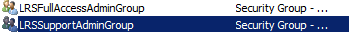
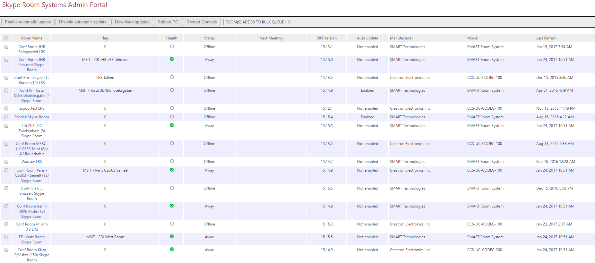
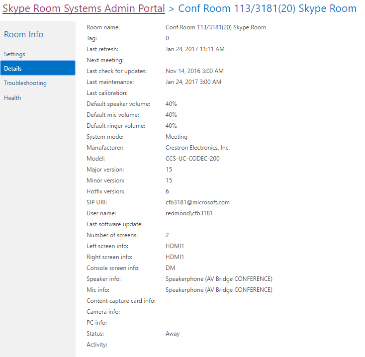

# <a name="deploy-srs-v1-administrative-web-portal-in-skype-for-business-server"></a>Implementar SRS v1 administrativas Web Portal en Skype para Business Server

El Skype para sistemas de negocio Server Skype salón v1 (v1 SRS, anteriormente conocido como sistema de sala de Lync) administrativas Portal Web es un portal web que las organizaciones pueden usar para mantener las salas de conferencias de sistemas de salón de Skype. Los administradores pueden usar el Portal Web del SRS v1 administrativas para supervisar el estado del dispositivo, por ejemplo mediante la supervisión de dispositivos de audio y vídeo. Con este portal, los administradores también pueden recopilar información de diagnóstico de forma remota para supervisar el estado de las salas de conferencias.

Para usar esta característica, el Portal Web del SRS v1 administrativas debe estar implementado en cada Skype para Business Server Front-End Server. Esta guía proporciona instrucciones para administradores sobre cómo instalar y configurar el portal web administrativo de SRS. Está destinado a los administradores que tienen conocimiento de Skype para la administración de Business Server y que tienen derechos de usuario de administrador para modificar la Skype de topología de servidores de negocio.

Después de la v1 SRS que administrativas Portal Web se implementa en el servidor, los administradores pueden comprobar el estado SRS v1 para los dispositivos, inicie sesión el sitio desde sus propios equipos o equipos portátiles.

> [!IMPORTANT]
> Descargue el [Portal de sistemas v1 Web administrativo para Skype para Business Server 2015 de sala de Microsoft Skype](https://www.microsoft.com/en-us/download/details.aspx?id=46906).

En este tema:

- [Configurar el entorno para el portal web administrativo de SRS v1](room-system-v1-administrative-web-portal.md#Config_Env)

- [Instalar el portal web administrativo de SRS v1](room-system-v1-administrative-web-portal.md#Install_SRS)

- [Usar el portal web administrativo de SRS](room-system-v1-administrative-web-portal.md#Use_Portal)

## <a name="configure-your-environment-for-the-srs-v1-administrative-web-portal"></a>Configurar el entorno para el portal web administrativo de SRS v1
<a name="Config_Env"> </a>

Para usar el portal web administrativo de SRS v1, tendrá que instalar o configurar los siguientes requisitos previos.

> [!IMPORTANT]
> Si el servidor está configurado con la autenticación Kerberos y NTLM, y se está ejecutando SRS en un equipo que no está unido al dominio, la autenticación Kerberos generará un error y el usuario no verá el estado de SRS en el portal administrativo. Para resolver este problema, configure el servidor con autenticación NTLM o autenticación NTLM y TLS-DSK (sin Kerberos), o una el equipo SRS al dominio.

1. Instalar Skype para actualizaciones acumulativas de servidor empresarial en el Skype de topología de servidores de negocio.

    Para obtener la actualización o ver qué se incluye con él, vea [actualizaciones para Skype para Business Server 2015](https://support.microsoft.com/en-us/help/3061064/updates-for-skype-for-business-server-2015).

2. Cree un usuario de Active Directory habilitado para usar SIP.

    El Portal Web del SRS v1 administrativas usa estas credenciales para consultar la información de Skype para Business Server. El nombre de usuario de los ejemplos es LRSApp.

3. Cree un grupo de seguridad de Active Directory con el nombre LRSSupportAdminGroup.

    Cree el grupo con el ámbito de grupo Global y el tipo de grupo Seguridad. Los usuarios habilitados para usar SIP que se agreguen a este grupo estarán autorizados para ver la lista de salones y ejecutar algunos comandos, como la recopilación de registros.

4. Cree un grupo de seguridad de Active Directory con el nombre LRSFullAccessAdminGroup. 

    Cree el grupo con el ámbito de grupo Global y el tipo de grupo Seguridad. Los usuarios habilitados para usar SIP que se agreguen a este grupo estarán autorizados para usar toda la funcionalidad del portal administrativo en una sala de Skype. Para incluir compatibilidad con la administración en masa de salas de Skype, consulte el paso 5. 

     

5. Cree un grupo de seguridad de Active Directory con el nombre LRSPowerUserAdminsGroup.

    Cree el grupo con el ámbito de grupo Global y el tipo de grupo Seguridad. Los usuarios habilitados para SIP agregados a este grupo están autorizados a utilizar todas las funciones de portal de administración, incluida la administración masiva de Skype para salas de negocio.

6. Agregar LRSFullAccessAdminGroup como un miembro de LRSSupportAdminGroup.

     

7. Cree un usuario de Active Directory habilitado para usar SIP con el nombre LRSSupport. Agregue este usuario a LRSSupportAdminGroup.

     

8. Instalar [ASP.NET MVC 4 para Visual Studio 2010 SP1 y Visual Web Developer 2010 SP1](https://go.microsoft.com/fwlink/p/?LinkId=323967).

## <a name="install-the-srs-v1-administrative-web-portal"></a>Instalar el portal web administrativo de SRS v1
<a name="Install_SRS"> </a>

Descargue el [Portal de sistemas v1 Web administrativo para Skype para Business Server 2015 de sala de Microsoft Skype](https://www.microsoft.com/en-us/download/details.aspx?id=46906).

Para instalar el portal web administrativo de SRS v1, use los pasos siguientes.

1. Configure el puerto de la aplicación de confianza ejecutando el siguiente cmdlet en Skype para Shell de administración de servidor empresarial:

   ```
   Set-CsWebServer -Identity POOLFQDN -MeetingRoomAdminPortalInternalListeningPort 4456 -MeetingRoomAdminPortalExternalListeningPort 4457
   ```

2. Para instalar el portal de salas de reuniones, descargue **MeetingRoomPortalInstaller.msi** y ejecútelo como administrador.

3. Abra el archivo Web.config, que se encuentra en la siguiente ubicación:

    %Archivos de programa%\Skype Empresarial Server 2015\Web Components\Meeting Room Portal\Int\Handler\

4. En el archivo Web.Config, cambie la PortalUserName para el nombre de usuario creado en el paso 2 en la sección "[Configurar el entorno para el Portal Web del SRS v1 administrativas](room-system-v1-administrative-web-portal.md#Config_Env)" (el nombre recomendado en el paso es LRSApp):

    ```
    <add key="PortalUserName" value="sip:LRSApp@domain.com" />
    ```

5. Dado que el portal administrativo de SRS v1 es una aplicación de confianza, no es necesario que proporcione la contraseña en la configuración del portal. Si este usuario utiliza un registrador diferente del local, deberá especificar el registrador que utilizará agregando la siguiente línea en el archivo Web.Config: 

   ```
   <add key="PortalUserRegistrarFQDN" value="pool-xxxx.domain.com" />
   ```

6. Si utiliza un puerto diferente de 5061, agregue la siguiente línea en el archivo Web.Config: 

   ```
   <add key="PortalUserRegistrarPort" value="5061" />
   ```

### <a name="verify-installation-of-the-srs-administrative-web-portal"></a>Verificar la instalación del portal web administrativo de SRS

Para verificar la instalación del portal web administrativo de SRS v1 haga lo siguiente:

1. En un servidor front-end, vaya a la siguiente URL:

    https://\<fe-server\>/lrs

    No debería ver ningún error, como se muestra en la imagen siguiente:

     

2. Si no ve ningún error, intente acceder a la siguiente URL desde cualquier otro equipo de la topología:

    https://\<fe-server\>/lrs

    Para obtener acceso a la página, necesita agregar los registros DNS, tal como se describe en "[necesario registros DNS para automático inicio de sesión de los clientes](https://go.microsoft.com/fwlink/p/?LinkId=318056)".

## <a name="use-the-srs-administrative-web-portal"></a>Usar el portal web administrativo de SRS
<a name="Use_Portal"> </a>

Después de implementar SRS en el servidor, puede comprobar el estado de todas las salas de SRS iniciando sesión en el portal web administrativo de SRS v1 desde un explorador.

### <a name="sign-in"></a>Iniciar sesión

1. Vaya a la siguiente dirección URL:

    https://\<fe-server\>/lrs

2. Escriba las credenciales de la cuenta LRSSupport o de una cuenta que se haya agregado a su grupo de seguridad LRSSupportAdminGroup.


### <a name="srs-administrative-web-portal-summary-page"></a>Página de resumen del portal web administrativo de SRS

La página de resumen ofrece la siguiente información sobre todas las salas de SRS implementadas en el servidor:

- **Etiqueta** El nombre personalizado que proporciona el administrador a la sala. La etiqueta se puede establecer en el portal de haciendo clic en el nombre del salón.

- **Mantenimiento** El estado de mantenimiento de la sala, que se deriva el estado de mantenimiento de agregado de la sala, que se muestra en la sección estado de la página de configuración de la sala.

- **Próxima reunión** La fecha y hora de la próxima reunión está programada.

- **SRS versión, fabricante, modelo** Estos valores están predefinidos en SRS. Según el fabricante, estos campos pueden dejarse en blanco.

- **Última actualización** Muestra la última vez que se actualiza la página web.



> [!NOTE]
> Sólo se verá el menú de administración de forma masiva si forma parte del grupo de seguridad LRSPowerUserAdminsGroup.

### <a name="srs-room-information"></a>Información sobre salas de SRS

La sección de información sobre salas del portal le permite ver y configurar salas de SRS individuales. Contiene cuatro secciones: Configuración, Detalles, Registro y Mantenimiento.

#### <a name="settings"></a>Configuración

En la sección de configuración, puede establecer la contraseña, la etiqueta de la sala y los valores de volumen predeterminados de la sala. Si configura estas opciones, los cambios solo se replican al reiniciar la consola de SRS. Solo verá los ajustes Actualizaciones del sistema para dispositivos de SRS que utilicen la versión 15.12 y posteriores.


#### <a name="details"></a>Detalles

La sección detalles de proporciona un resumen de solo lectura de configuraciones de la sala SRS, incluido: la hora de última actualización; próxima reunión; última actualizaciones, mantenimiento y calibración; configuración del timbre; micrófono y altavoz de forma predeterminada versión; URI DE SIP; número de pantallas y obtener información detallada sobre cada pantalla; estado y la actividad.



#### <a name="troubleshooting"></a>Solución de problemas

La sección de solución de problemas se puede usar para recopilar remotamente registros y guardarlos en una ubicación especificada. También puede reiniciar la consola de SRS (interfaz de usuario de SRS) o el sistema completo. Para recopilar registros, proporcione la ruta a una carpeta en el formato especificado y asegúrese de que la cuenta del equipo de SRS tiene permisos de escritura en esta carpeta. Si el tamaño de los registros es muy grande, la recopilación de registros puede tardar hasta 5 minutos. Actualice la página para ver el estado actualizado.

#### <a name="health"></a>Mantenimiento

La sección Mantenimiento proporciona una indicación visual del estado de la Skype para Business Server connection, dispositivo de audio, dispositivo de vídeo, estado de resistencia y el dispositivo de pantalla.


### <a name="additional-notes-about-the-administrative-web-portal"></a>Notas adicionales sobre el portal web administrativo

> [!NOTE]
>  Cambios en la configuración se aplican sólo después de que el sistema SRS es reiniciado .> si caduca la contraseña de la cuenta LRSApp, no podrá ver el estado de las salas. Configurar la contraseña de la cuenta LRSAppuser para que nunca caduca o asegúrese de actualizar la contraseña cuando está cerca de expiration.> el SRS administrativas portal web es compatible con las implementaciones locales únicamente.

### <a name="bulk-management"></a>Administración en masa 

La administración en masa de salas de SRS es una característica diseñada para los administradores de TI avanzados, con la finalidad de simplificar su flujo de trabajo y ofrecerles una herramienta práctica y rápida para administrar remotamente varias salas de forma masiva.

Para ver esta característica, el usuario debe ser miembro del grupo de seguridad especial, **LRSPowerUserAdminsGroup**.  

No hay límite en el número de salas de SRS que se puede seleccionar para la administración en masa. Sin embargo, no se puede realizar más de una operación en masa a la vez.

Para realizar una operación de administración en masa, seleccione las salas que quiera supervisar y haga clic en el menú Administración de masa. 

### <a name="frequently-asked-questions"></a>Preguntas más frecuentes

#### <a name="why-cant-i-sign-in-to-the-administrative-web-portal"></a>¿Por qué no puedo iniciar sesión en el portal web administrativas?

Cuando se abre https://localhost/lrs, podrá ver la página de inicio de sesión, pero cuando se escribe en sus credenciales, no puede iniciar sesión. En este caso, debe abrir el https://FQDNofFEserver/SRS para iniciar sesión en el portal web administrativo.

#### <a name="why-cant-i-see-srs-v1-in-the-administrative-web-portal"></a>¿Por qué no puedo ver v1 SRS en el portal web administrativa?

- Asegúrese de que su implementación tiene cuentas de SRS y de que estas se han creado según las recomendaciones de implementación del portal web administrativo de SRS. Asegúrese de que las cuentas SRS se aprovisionan con Enable-CsMeetingRoom, no habilitar-CsUser, en la Skype para Business Server.

- Si ha creado las cuentas SRS y no se puede ver las cuentas en el portal web administrativa, recopilar los registros del servidor mediante el Skype para la herramienta de registro de servidor empresarial con el componente de **MeetingPortal** seleccionado y, a continuación, enviarlos a su contacto de soporte técnico SRS.

- Si ha creado cuentas de SRS y no las ve en el portal web administrativo, recopile los registros de cliente usando Fiddler, copie el registro de la consola de las herramientas de desarrollo del explorador y luego envíe esta información a su contacto de soporte técnico de SRS. También puede modificar el valor del nivel de seguimiento en el archivo Web.Config para obtener un registro más detallado.

  ```
  <system.diagnostics>
    <switches>
      <!--
      This switch controls logging message levels. 0 implies
      logging is turned off. 1 implies only errors are logged,
      2 implies errors &amp; warnings. 4 is the most detailed.
      -->
      <add name="TraceLevelSwitch" value="3" />
    </switches>
  </system.diagnostics>
  ```

#### <a name="why-cant-i-see-the-status-of-srs-in-the-administrative-web-portal"></a>¿Por qué no puedo ver el estado de SRS en el portal web administrativa?

- Asegúrese de que la cuenta de usuario LRSApp esté habilitada para SIP.

- Si sigue teniendo problemas, recopilar el archivo **Trace.log** en el sistema SRS de D:\Tracing\LRSAdminLogs\, y, a continuación, envíelo a su contacto de soporte técnico SRS.

#### <a name="why-cant-i-see-the-bulk-management-menus-for-srs-in-the-administrative-web-portal"></a>¿¿Por qué no puedo ver los menús de administración de forma masiva para SRS en el portal web administrativa?

Asegúrese de que la cuenta de usuario LRSApp está habilitado para SIP y que forma parte del grupo de seguridad LRSPowerUserAdminsGroup.

#### <a name="does-the-srs-v1-administrative-web-portal-work-with-skype-room-systems-v2"></a>¿El portal web administrativo de SRS v1 funciona con Sistemas de salas de Skype v2?

No.


