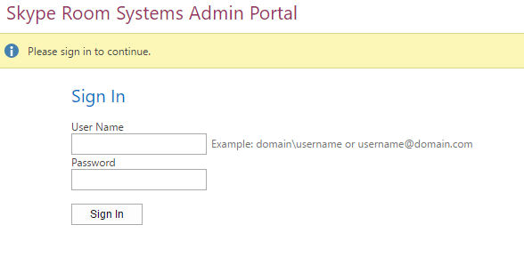

# <a name="deploy-srs-v1-administrative-web-portal-in-skype-for-business-server"></a><span data-ttu-id="daf82-105">Implementar el portal web administrativo de SRS v1 en Skype Empresarial Server</span><span class="sxs-lookup"><span data-stu-id="daf82-105">Deploy SRS v1 Administrative Web Portal in Skype for Business Server</span></span>

<span data-ttu-id="daf82-106">El portal web administrativo de Sistemas de salas de Skype Empresarial Server v1 (SRS v1, anteriormente conocido como Sistema de salas de Lync) es un portal web que las organizaciones pueden usar para mantener sus salas de conferencias de Sistemas de salas de Skype.</span><span class="sxs-lookup"><span data-stu-id="daf82-106">The Skype for Business Server Skype Room Systems v1 (SRS v1, formerly known as Lync Room System) Administrative Web Portal is a web portal that organizations can use to maintain their Skype Room Systems conference rooms.</span></span> <span data-ttu-id="daf82-107">Los administradores pueden usar el portal web administrativo de SRS v1 para supervisar el estado del dispositivo, por ejemplo mediante la supervisión de dispositivos de audio y vídeo.</span><span class="sxs-lookup"><span data-stu-id="daf82-107">Administrators can use the SRS v1 Administrative Web Portal to monitor device health, for example by monitoring audio/video devices.</span></span> <span data-ttu-id="daf82-108">Con este portal, los administradores pueden recopilar de forma remota información de diagnóstico para supervisar el estado de la sala de conferencias.</span><span class="sxs-lookup"><span data-stu-id="daf82-108">With this portal, administrators can remotely collect diagnostic information to monitor conference room health.</span></span>

<span data-ttu-id="daf82-109">Para usar esta característica, el portal web administrativo de SRS v1 debe implementarse en cada servidor front-end de Skype Empresarial Server.</span><span class="sxs-lookup"><span data-stu-id="daf82-109">To use this feature, the SRS v1 Administrative Web Portal needs to be deployed on every Skype for Business Server Front End Server.</span></span> <span data-ttu-id="daf82-110">En esta guía se proporcionan instrucciones para los administradores sobre cómo instalar y configurar el Portal web administrativo de SRS.</span><span class="sxs-lookup"><span data-stu-id="daf82-110">This guide provides instructions for administrators on how to install and configure the SRS Administrative Web Portal.</span></span> <span data-ttu-id="daf82-111">Está pensado para administradores que tienen conocimientos de administración de Skype Empresarial Server y que tienen derechos de usuario de administrador para modificar la topología de Skype Empresarial Server.</span><span class="sxs-lookup"><span data-stu-id="daf82-111">It is intended for administrators who have knowledge of Skype for Business Server administration, and who have administrator user rights to modify the Skype for Business Server topology.</span></span>

<span data-ttu-id="daf82-112">Después de implementar el portal web administrativo de SRS v1 en el servidor, los administradores pueden comprobar el estado de los dispositivos SRS v1 iniciando sesión en el sitio desde sus propios equipos o portátiles.</span><span class="sxs-lookup"><span data-stu-id="daf82-112">After the SRS v1 Administrative Web Portal is deployed on the server, administrators can check the status SRS v1 devices by logging on to the site from their own computers or laptops.</span></span>

> [!IMPORTANT]
> <span data-ttu-id="daf82-113">Descargue el portal web administrativo de [Microsoft Skype Room Systems v1 para Skype Empresarial Server 2015.](https://www.microsoft.com/download/details.aspx?id=46906)</span><span class="sxs-lookup"><span data-stu-id="daf82-113">Download the [Microsoft Skype Room Systems v1 Administrative Web Portal for Skype for Business Server 2015](https://www.microsoft.com/download/details.aspx?id=46906).</span></span>

<span data-ttu-id="daf82-114">En este tema:</span><span class="sxs-lookup"><span data-stu-id="daf82-114">In this topic:</span></span>

- [<span data-ttu-id="daf82-115">Configurar el entorno para el portal web administrativo de SRS v1</span><span class="sxs-lookup"><span data-stu-id="daf82-115">Configure your environment for the SRS v1 Administrative Web Portal</span></span>](room-system-v1-administrative-web-portal.md#Config_Env)

- [<span data-ttu-id="daf82-116">Instalar el portal web administrativo de SRS v1</span><span class="sxs-lookup"><span data-stu-id="daf82-116">Install the SRS v1 Administrative Web Portal</span></span>](room-system-v1-administrative-web-portal.md#Install_SRS)

- [<span data-ttu-id="daf82-117">Usar el portal web administrativo de SRS</span><span class="sxs-lookup"><span data-stu-id="daf82-117">Use the SRS Administrative Web Portal</span></span>](room-system-v1-administrative-web-portal.md#Use_Portal)

## <a name="configure-your-environment-for-the-srs-v1-administrative-web-portal"></a><span data-ttu-id="daf82-118">Configurar el entorno para el portal web administrativo de SRS v1</span><span class="sxs-lookup"><span data-stu-id="daf82-118">Configure your environment for the SRS v1 Administrative Web Portal</span></span>
<span data-ttu-id="daf82-119"><a name="Config_Env"> </a></span><span class="sxs-lookup"><span data-stu-id="daf82-119"><a name="Config_Env"> </a></span></span>

<span data-ttu-id="daf82-120">Para usar el portal web administrativo de SRS v1, deberá instalar o configurar los siguientes requisitos previos.</span><span class="sxs-lookup"><span data-stu-id="daf82-120">To use the SRS v1 Administrative Web Portal, you will need to install or configure the following prerequisites.</span></span>

> [!IMPORTANT]
> <span data-ttu-id="daf82-121">Si el servidor está configurado con la autenticación Kerberos y NTLM, y SRS se ejecuta en un equipo que no está unido al dominio, se producirá un error en la autenticación Kerberos y el usuario no verá el estado de SRS en el portal administrativo.</span><span class="sxs-lookup"><span data-stu-id="daf82-121">If the server is configured with both Kerberos and NTLM authentication, and SRS is running on a computer that is not joined to the domain, Kerberos authentication will fail and the user will not see the status of SRS in the administrative portal.</span></span> <span data-ttu-id="daf82-122">Para resolver este problema, configure el servidor con autenticación NTLM o autenticación NTLM y TLS-DSK (sin Kerberos) o una el equipo SRS al dominio.</span><span class="sxs-lookup"><span data-stu-id="daf82-122">To resolve this issue, configure the server with NTLM authentication or both NTLM and TLS-DSK authentication (without Kerberos), or join the SRS computer to the domain.</span></span>

1. <span data-ttu-id="daf82-123">Instale las actualizaciones acumulativas de Skype Empresarial Server en la topología de Skype Empresarial Server.</span><span class="sxs-lookup"><span data-stu-id="daf82-123">Install Skype for Business Server Cumulative Updates in the Skype for Business Server topology.</span></span>

    <span data-ttu-id="daf82-124">Para obtener la actualización o ver lo que incluye, consulte Actualizaciones [de Skype Empresarial Server 2015.](https://support.microsoft.com/help/3061064/updates-for-skype-for-business-server-2015)</span><span class="sxs-lookup"><span data-stu-id="daf82-124">To get the update or see what's included with it, see [Updates for Skype for Business Server 2015](https://support.microsoft.com/help/3061064/updates-for-skype-for-business-server-2015).</span></span>

2. <span data-ttu-id="daf82-125">Cree un usuario de Active Directory habilitado para SIP.</span><span class="sxs-lookup"><span data-stu-id="daf82-125">Create a SIP-enabled Active Directory user.</span></span>

    <span data-ttu-id="daf82-126">El portal web administrativo de SRS v1 usa estas credenciales para consultar información de Skype Empresarial Server.</span><span class="sxs-lookup"><span data-stu-id="daf82-126">The SRS v1 Administrative Web Portal uses these credentials to query information from Skype for Business Server.</span></span> <span data-ttu-id="daf82-127">El nombre de usuario de los ejemplos especificados es LRSApp.</span><span class="sxs-lookup"><span data-stu-id="daf82-127">The username in the examples given is LRSApp.</span></span>

3. <span data-ttu-id="daf82-128">Cree un grupo de seguridad de Active Directory con el nombre LRSSupportAdminGroup.</span><span class="sxs-lookup"><span data-stu-id="daf82-128">Create an Active Directory security group with name LRSSupportAdminGroup.</span></span>

    <span data-ttu-id="daf82-129">Cree el grupo con el ámbito de grupo global y el tipo de grupo como seguridad.</span><span class="sxs-lookup"><span data-stu-id="daf82-129">Create the group with Group Scope as Global and Group Type as Security.</span></span> <span data-ttu-id="daf82-130">Los usuarios habilitados para SIP que se agregan a este grupo estarán autorizados a ver la lista de salas y ejecutar determinados comandos, como la recopilación de registros.</span><span class="sxs-lookup"><span data-stu-id="daf82-130">SIP enabled users who are added to this group will be authorized to see the list of rooms and execute certain commands, such as collecting logs.</span></span>

4. <span data-ttu-id="daf82-131">Cree un grupo de seguridad de Active Directory con el nombre LRSFullAccessAdminGroup.</span><span class="sxs-lookup"><span data-stu-id="daf82-131">Create an Active Directory security group with name LRSFullAccessAdminGroup.</span></span>

    <span data-ttu-id="daf82-132">Cree el grupo con ámbito de grupo global y tipo de grupo como usuarios habilitados para Security.SIP que se agregan a este grupo están autorizados a usar todas las funciones del portal de administración en una sola sala de Skype.</span><span class="sxs-lookup"><span data-stu-id="daf82-132">Create the group with Group Scope as Global and Group Type as Security.SIP enabled users who are added to this group are authorized to use all admin portal functionality on a single Skype room.</span></span> <span data-ttu-id="daf82-133">Para incluir compatibilidad para la administración masiva de salas de Skype, consulte el paso 5.</span><span class="sxs-lookup"><span data-stu-id="daf82-133">To include support for bulk management of Skype rooms, refer to step 5.</span></span>

     

5. <span data-ttu-id="daf82-135">Cree un grupo de seguridad de Active Directory con el nombre LRSPowerUserAdminsGroup.</span><span class="sxs-lookup"><span data-stu-id="daf82-135">Create an Active Directory security group with name LRSPowerUserAdminsGroup.</span></span>

    <span data-ttu-id="daf82-136">Cree el grupo con el ámbito de grupo global y el tipo de grupo como seguridad.</span><span class="sxs-lookup"><span data-stu-id="daf82-136">Create the group with Group Scope as Global and Group Type as Security.</span></span> <span data-ttu-id="daf82-137">Los usuarios habilitados para SIP que se agregan a este grupo están autorizados a usar todas las funciones del portal de administración, incluida la administración masiva de salas de Skype Empresarial.</span><span class="sxs-lookup"><span data-stu-id="daf82-137">SIP enabled users who are added to this group are authorized to use all admin portal functionality including bulk management of Skype for Business rooms.</span></span>

6. <span data-ttu-id="daf82-138">Agregue LRSFullAccessAdminGroup como miembro de LRSSupportAdminGroup.</span><span class="sxs-lookup"><span data-stu-id="daf82-138">Add LRSFullAccessAdminGroup as a member of LRSSupportAdminGroup.</span></span>

     

7. <span data-ttu-id="daf82-140">Cree un usuario de Active Directory habilitado para SIP con el nombre LRSSupport.</span><span class="sxs-lookup"><span data-stu-id="daf82-140">Create a SIP enabled Active Directory user with name LRSSupport.</span></span> <span data-ttu-id="daf82-141">Agregue este usuario a LRSSupportAdminGroup.</span><span class="sxs-lookup"><span data-stu-id="daf82-141">Add this user to LRSSupportAdminGroup.</span></span>

     

8. <span data-ttu-id="daf82-143">Instale [ASP.NET MVC 4 para Visual Studio 2010 SP1 y Visual Web Developer 2010 SP1](https://go.microsoft.com/fwlink/p/?LinkId=323967).</span><span class="sxs-lookup"><span data-stu-id="daf82-143">Install [ASP.NET MVC 4 for Visual Studio 2010 SP1 and Visual Web Developer 2010 SP1](https://go.microsoft.com/fwlink/p/?LinkId=323967).</span></span>

## <a name="install-the-srs-v1-administrative-web-portal"></a><span data-ttu-id="daf82-144">Instalar el portal web administrativo de SRS v1</span><span class="sxs-lookup"><span data-stu-id="daf82-144">Install the SRS v1 Administrative Web Portal</span></span>
<span data-ttu-id="daf82-145"><a name="Install_SRS"> </a></span><span class="sxs-lookup"><span data-stu-id="daf82-145"><a name="Install_SRS"> </a></span></span>

<span data-ttu-id="daf82-146">Descargue el portal web administrativo de [Microsoft Skype Room Systems v1 para Skype Empresarial Server 2015.](https://www.microsoft.com/download/details.aspx?id=46906)</span><span class="sxs-lookup"><span data-stu-id="daf82-146">Download the [Microsoft Skype Room Systems v1 Administrative Web Portal for Skype for Business Server 2015](https://www.microsoft.com/download/details.aspx?id=46906).</span></span>

<span data-ttu-id="daf82-147">Para instalar el portal web administrativo de SRS v1, siga estos pasos.</span><span class="sxs-lookup"><span data-stu-id="daf82-147">To install the SRS v1 Administrative Web Portal, use the following steps.</span></span>

1. <span data-ttu-id="daf82-148">Configure el puerto de aplicación de confianza ejecutando el siguiente cmdlet en el Shell de administración de Skype Empresarial Server:</span><span class="sxs-lookup"><span data-stu-id="daf82-148">Configure the Trusted Application Port by running the following cmdlet in Skype for Business Server Management Shell:</span></span>

   ```powershell
   Set-CsWebServer -Identity POOLFQDN -MeetingRoomAdminPortalInternalListeningPort 4456 -MeetingRoomAdminPortalExternalListeningPort 4457
   ```

2. <span data-ttu-id="daf82-149">Para instalar el Portal de salas de reuniones, **MeetingRoomPortalInstaller.msi** y, a continuación, ejecutarlo como administrador.</span><span class="sxs-lookup"><span data-stu-id="daf82-149">To install the Meeting Room Portal, download **MeetingRoomPortalInstaller.msi** and then run it as an administrator.</span></span>

3. <span data-ttu-id="daf82-150">Abra el Web.config archivo desde la siguiente ubicación:</span><span class="sxs-lookup"><span data-stu-id="daf82-150">Open the Web.config file from the following location:</span></span>

    <span data-ttu-id="daf82-151">%Program Files%\Skype for Business Server 2015\Web Components\Meeting Room Portal\Int\Handler</span><span class="sxs-lookup"><span data-stu-id="daf82-151">%Program Files%\Skype for Business Server 2015\Web Components\Meeting Room Portal\Int\Handler</span></span>\

4. <span data-ttu-id="daf82-152">En el archivo Web.Config, cambie portalUserName por el nombre de usuario creado en el paso 2 en la sección " Configurar el entorno para el portal web administrativo de[SRS v1](room-system-v1-administrative-web-portal.md#Config_Env)" (el nombre recomendado en el paso es LRSApp):</span><span class="sxs-lookup"><span data-stu-id="daf82-152">In the Web.Config file, change the PortalUserName to the username created in Step 2 under the section "[Configure your environment for the SRS v1 Administrative Web Portal](room-system-v1-administrative-web-portal.md#Config_Env)" (the recommended name in the step is LRSApp):</span></span>

    ```xml
    <add key="PortalUserName" value="sip:LRSApp@domain.com" />
    ```

5. <span data-ttu-id="daf82-153">Dado que el Portal de administración de SRS v1 es una aplicación de confianza, no es necesario proporcionar la contraseña en la configuración del portal.</span><span class="sxs-lookup"><span data-stu-id="daf82-153">Because the SRS v1 Admin Portal is a trusted application, you do not need to provide the password in the portal configuration.</span></span> <span data-ttu-id="daf82-154">Si este usuario usa un registrador diferente al registrador local, debe especificar el registrador para él agregando la siguiente línea en el archivo Web.Config local:</span><span class="sxs-lookup"><span data-stu-id="daf82-154">If this user is using a different registrar than local registrar, you need to specify the registrar for it by adding the following line in the Web.Config file:</span></span>

   ```xml
   <add key="PortalUserRegistrarFQDN" value="pool-xxxx.domain.com" />
   ```

6. <span data-ttu-id="daf82-155">Si el puerto usado es distinto de 5061, agregue la siguiente línea en el Web.Config archivo:</span><span class="sxs-lookup"><span data-stu-id="daf82-155">If the port used is other than 5061, add the following line in the Web.Config file:</span></span>

   ```xml
   <add key="PortalUserRegistrarPort" value="5061" />
   ```

### <a name="verify-installation-of-the-srs-administrative-web-portal"></a><span data-ttu-id="daf82-156">Comprobar la instalación del portal web administrativo de SRS</span><span class="sxs-lookup"><span data-stu-id="daf82-156">Verify Installation of the SRS Administrative Web Portal</span></span>

<span data-ttu-id="daf82-157">Para comprobar la instalación del portal web administrativo de SRS v1, haga lo siguiente:</span><span class="sxs-lookup"><span data-stu-id="daf82-157">To verify installation of the SRS v1 Administrative Web Portal, do the following:</span></span>

1. <span data-ttu-id="daf82-158">En un servidor front-end, vaya a la siguiente dirección URL:</span><span class="sxs-lookup"><span data-stu-id="daf82-158">On a Front End server, browse to the following URL:</span></span>

    <span data-ttu-id="daf82-159">https:// \<fe-server\> /lrs</span><span class="sxs-lookup"><span data-stu-id="daf82-159">https://\<fe-server\>/lrs</span></span>

    <span data-ttu-id="daf82-160">No debería ver ningún error, como se muestra en la siguiente imagen:</span><span class="sxs-lookup"><span data-stu-id="daf82-160">You should not see any errors, as shown in the following image:</span></span>

     

2. <span data-ttu-id="daf82-162">Si no ve ningún error, intente obtener acceso a la siguiente dirección URL desde cualquier otro equipo de la topología:</span><span class="sxs-lookup"><span data-stu-id="daf82-162">If you do not see any errors, try accessing the following URL from any other computer in the topology:</span></span>

    <span data-ttu-id="daf82-163">https:// \<fe-server\> /lrs</span><span class="sxs-lookup"><span data-stu-id="daf82-163">https://\<fe-server\>/lrs</span></span>

    <span data-ttu-id="daf82-164">Para obtener acceso a la página, deberá agregar los registros DNS tal como se describe en "Registros DNS necesarios para el inicio de sesión automático[del cliente".](https://go.microsoft.com/fwlink/p/?LinkId=318056)</span><span class="sxs-lookup"><span data-stu-id="daf82-164">To access the page, you will need to add the DNS records as described in "[Required DNS Records for Automatic Client Sign-In](https://go.microsoft.com/fwlink/p/?LinkId=318056)."</span></span>

## <a name="use-the-srs-administrative-web-portal"></a><span data-ttu-id="daf82-165">Usar el portal web administrativo de SRS</span><span class="sxs-lookup"><span data-stu-id="daf82-165">Use the SRS Administrative Web Portal</span></span>
<span data-ttu-id="daf82-166"><a name="Use_Portal"> </a></span><span class="sxs-lookup"><span data-stu-id="daf82-166"><a name="Use_Portal"> </a></span></span>

<span data-ttu-id="daf82-167">Después de implementar SRS en el servidor, puede comprobar el estado de todas las salas de SRS iniciando sesión en el portal web administrativo de SRS v1 desde un explorador.</span><span class="sxs-lookup"><span data-stu-id="daf82-167">After you deploy SRS on the server, you can check the status of all SRS rooms by signing into the SRS v1 Administrative Web Portal from a browser.</span></span>

### <a name="sign-in"></a><span data-ttu-id="daf82-168">Iniciar sesión</span><span class="sxs-lookup"><span data-stu-id="daf82-168">Sign in</span></span>

1. <span data-ttu-id="daf82-169">Vaya a la siguiente dirección URL:</span><span class="sxs-lookup"><span data-stu-id="daf82-169">Browse to the following URL:</span></span>

    <span data-ttu-id="daf82-170">https:// \<fe-server\> /lrs</span><span class="sxs-lookup"><span data-stu-id="daf82-170">https://\<fe-server\>/lrs</span></span>

2. <span data-ttu-id="daf82-171">Escriba las credenciales de la cuenta LRSSupport o una cuenta que se agregó al grupo de seguridad LRSSupportAdminGroup.</span><span class="sxs-lookup"><span data-stu-id="daf82-171">Enter the credentials for the LRSSupport account or an account that was added to the LRSSupportAdminGroup security group.</span></span>


### <a name="srs-administrative-web-portal-summary-page"></a><span data-ttu-id="daf82-173">Página de resumen del portal web administrativo de SRS</span><span class="sxs-lookup"><span data-stu-id="daf82-173">SRS Administrative Web Portal Summary Page</span></span>

<span data-ttu-id="daf82-174">La página de resumen proporciona la siguiente información para todas las salas de SRS implementadas en el servidor:</span><span class="sxs-lookup"><span data-stu-id="daf82-174">The summary page provides the following information for all of the SRS rooms deployed on the server:</span></span>

- <span data-ttu-id="daf82-175">**Tag** El nombre personalizado que el administrador da a la sala.</span><span class="sxs-lookup"><span data-stu-id="daf82-175">**Tag** The custom name that the administrator gives to the room.</span></span> <span data-ttu-id="daf82-176">La etiqueta se puede establecer en el portal haciendo clic en el nombre de la sala.</span><span class="sxs-lookup"><span data-stu-id="daf82-176">The Tag can be set in the portal by clicking on the room name.</span></span>

- <span data-ttu-id="daf82-177">**Estado** El estado de mantenimiento de la sala, que se deriva del estado de mantenimiento agregado de la sala, que se muestra en la sección Estado de la página Configuración de la sala.</span><span class="sxs-lookup"><span data-stu-id="daf82-177">**Health** The health status of the room, which is derived from the Aggregate Health status of the room, which is shown under the Health section of the Room Settings page.</span></span>

- <span data-ttu-id="daf82-178">**Próxima reunión** Fecha y hora en que se programa la siguiente reunión.</span><span class="sxs-lookup"><span data-stu-id="daf82-178">**Next Meeting** The date and time the next meeting is scheduled.</span></span>

- <span data-ttu-id="daf82-179">**Versión de SRS, fabricante, modelo** Estos valores están preestablecidos en SRS.</span><span class="sxs-lookup"><span data-stu-id="daf82-179">**SRS Version, Manufacturer, Model** These values are preset in SRS.</span></span> <span data-ttu-id="daf82-180">Según el fabricante, es posible que estos campos se dejaron en blanco.</span><span class="sxs-lookup"><span data-stu-id="daf82-180">Depending on the manufacturer, these fields might be left blank.</span></span>

- <span data-ttu-id="daf82-181">**Última actualización** Muestra la última vez que se actualizó la página web.</span><span class="sxs-lookup"><span data-stu-id="daf82-181">**Last Refresh** Displays the last time the web page was refreshed.</span></span>


> [!NOTE]
> <span data-ttu-id="daf82-183">Solo verá el menú Administración masiva si forma parte del grupo de seguridad LRSPowerUserAdminsGroup.</span><span class="sxs-lookup"><span data-stu-id="daf82-183">You will only see the Bulk Management menu if you are part of the LRSPowerUserAdminsGroup security group.</span></span>

### <a name="srs-room-information"></a><span data-ttu-id="daf82-184">Información de la sala de SRS</span><span class="sxs-lookup"><span data-stu-id="daf82-184">SRS Room Information</span></span>

<span data-ttu-id="daf82-185">La sección Información de la sala del portal le permite ver y configurar salas SRS individuales.</span><span class="sxs-lookup"><span data-stu-id="daf82-185">The Room Info section of the portal allows you to view and configure individual SRS rooms.</span></span> <span data-ttu-id="daf82-186">Contiene cuatro secciones: Configuración, Detalles, Registro y Estado.</span><span class="sxs-lookup"><span data-stu-id="daf82-186">It contains four sections: Settings, Details, Logging, and Health.</span></span>

#### <a name="settings"></a><span data-ttu-id="daf82-187">Configuración</span><span class="sxs-lookup"><span data-stu-id="daf82-187">Settings</span></span>

<span data-ttu-id="daf82-188">En la sección Configuración, puedes establecer la contraseña, la etiqueta de la sala y los niveles de volumen predeterminados para la sala.</span><span class="sxs-lookup"><span data-stu-id="daf82-188">In the Settings section, you can set the password, room tag, and default volume levels for the room.</span></span> <span data-ttu-id="daf82-189">Si configura estas opciones, los cambios solo se replicarán después de reiniciar la consola de SRS.</span><span class="sxs-lookup"><span data-stu-id="daf82-189">If you configure these settings, the changes are replicated only after you restart the SRS console.</span></span> <span data-ttu-id="daf82-190">Solo verá la configuración de actualizaciones del sistema para dispositivos SRS con la versión 15.12 y posteriores.</span><span class="sxs-lookup"><span data-stu-id="daf82-190">You will only see System Updates settings for SRS devices using release 15.12 and later.</span></span>


#### <a name="details"></a><span data-ttu-id="daf82-192">Detalles</span><span class="sxs-lookup"><span data-stu-id="daf82-192">Details</span></span>

<span data-ttu-id="daf82-193">La sección Detalles proporciona un resumen de solo lectura de la configuración de la sala de SRS, incluido: la hora de la última actualización; siguiente reunión; últimas actualizaciones, mantenimiento y calibración; configuración predeterminada del altavoz, micrófono y sonido; versión; URI de SIP; número de pantallas y detalles sobre cada pantalla; estado y actividad.</span><span class="sxs-lookup"><span data-stu-id="daf82-193">The Details section provides a read-only summary of the SRS room's settings, including: the time of last refresh; next meeting; last updates, maintenance and calibration; default speaker, mic, and ringer settings; version; SIP URI; number of screens and details about each screen; status, and activity.</span></span>


#### <a name="troubleshooting"></a><span data-ttu-id="daf82-195">Solución de problemas</span><span class="sxs-lookup"><span data-stu-id="daf82-195">Troubleshooting</span></span>

<span data-ttu-id="daf82-196">La sección de solución de problemas se puede usar para recopilar registros de forma remota y guardarlos en una ubicación especificada.</span><span class="sxs-lookup"><span data-stu-id="daf82-196">The Troubleshooting section can be used to remotely collect logs and save them to a specified location.</span></span> <span data-ttu-id="daf82-197">También puede reiniciar la consola de SRS (interfaz de usuario de SRS) o reiniciar todo el sistema.</span><span class="sxs-lookup"><span data-stu-id="daf82-197">You can also restart the SRS console (SRS user interface) or restart the entire system.</span></span> <span data-ttu-id="daf82-198">Para recopilar registros, proporcione una ruta de acceso de carpeta en el formato especificado y asegúrese de que la carpeta tenga permisos de escritura concedidos a la cuenta del equipo SRS.</span><span class="sxs-lookup"><span data-stu-id="daf82-198">To collect logs, provide a folder path in the specified format and make sure that the folder has write permissions given to the SRS machine account.</span></span> <span data-ttu-id="daf82-199">Si el tamaño del registro es demasiado grande, puede tardar hasta 5 minutos en finalizar la recopilación de registros.</span><span class="sxs-lookup"><span data-stu-id="daf82-199">If the log size is too big, it can take up to 5 minutes to finish collecting logs.</span></span> <span data-ttu-id="daf82-200">La actualización de la página le dará el estado más reciente.</span><span class="sxs-lookup"><span data-stu-id="daf82-200">Refreshing the page will give you the latest status.</span></span>

#### <a name="health"></a><span data-ttu-id="daf82-201">Salud</span><span class="sxs-lookup"><span data-stu-id="daf82-201">Health</span></span>

<span data-ttu-id="daf82-202">La sección Estado proporciona una indicación visual del estado de la conexión de Skype Empresarial Server, el dispositivo de audio, el dispositivo de vídeo, el estado de resistencia y el dispositivo de pantalla.</span><span class="sxs-lookup"><span data-stu-id="daf82-202">The Health section gives a visual indication of the health of the Skype for Business Server connection, audio device, video device, resiliency state, and screen device.</span></span>


### <a name="additional-notes-about-the-administrative-web-portal"></a><span data-ttu-id="daf82-204">Notas adicionales sobre el portal web administrativo</span><span class="sxs-lookup"><span data-stu-id="daf82-204">Additional Notes about the Administrative Web Portal</span></span>

> [!NOTE]
>  <span data-ttu-id="daf82-205">Los cambios de configuración solo se aplican después de reiniciar el sistema SRS.> Si la contraseña de la cuenta LRSApp expira, no podrá ver el estado de las salas.</span><span class="sxs-lookup"><span data-stu-id="daf82-205">Setting changes are applied only after the SRS system is restarted.>  If the LRSApp account password expires, you will not be able to see the status of the rooms.</span></span> <span data-ttu-id="daf82-206">Configure la contraseña de la cuenta LRSAppuser para que nunca expire o asegúrese de actualizar la contraseña cuando esté a punto de expirar.> El portal web administrativo de SRS solo es compatible con implementaciones locales.</span><span class="sxs-lookup"><span data-stu-id="daf82-206">Configure the LRSAppuser account password so that it never expires, or be sure to update the password when it is near expiration.>  The SRS administrative web portal is supported for on-premises deployments only.</span></span>

### <a name="bulk-management"></a><span data-ttu-id="daf82-207">Administración masiva</span><span class="sxs-lookup"><span data-stu-id="daf82-207">Bulk management</span></span>

<span data-ttu-id="daf82-208">La administración masiva de salas de SRS es una característica diseñada para administradores avanzados de TI, para simplificar su flujo de trabajo y habilitarlas con una cómoda herramienta de ahorro de tiempo para administrar de forma remota varias salas de forma masiva.</span><span class="sxs-lookup"><span data-stu-id="daf82-208">Bulk management of SRS rooms is a feature designed for advanced IT administrators, to simplify their workflow, and enable them with a time-saving convenient tool to remotely manage multiple rooms in a bulk fashion.</span></span>

<span data-ttu-id="daf82-209">Para poder ver esta funcionalidad, es necesario aprovisionar al usuario como miembro del grupo de seguridad especial **LRSPowerUserAdminsGroup**.</span><span class="sxs-lookup"><span data-stu-id="daf82-209">In order to see this functionality, the user need to be provisioned as a member of the special security group, **LRSPowerUserAdminsGroup**.</span></span>

<span data-ttu-id="daf82-210">No hay ningún límite en el número de salas de SRS que puede seleccionar para la administración masiva.</span><span class="sxs-lookup"><span data-stu-id="daf82-210">There is no limit to the number of SRS rooms you can select for bulk management.</span></span> <span data-ttu-id="daf82-211">Sin embargo, solo puede realizar una operación de administración masiva a la vez.</span><span class="sxs-lookup"><span data-stu-id="daf82-211">However, you can perform only one bulk management operation at a time.</span></span>

<span data-ttu-id="daf82-212">Para realizar una operación de administración masiva, seleccione las salas que desea supervisar y haga clic en el menú Administración masiva.</span><span class="sxs-lookup"><span data-stu-id="daf82-212">To perform a bulk management operation, select the rooms you want to monitor, and click on the Bulk management menu.</span></span>

### <a name="frequently-asked-questions"></a><span data-ttu-id="daf82-213">Preguntas más frecuentes</span><span class="sxs-lookup"><span data-stu-id="daf82-213">Frequently asked questions</span></span>

#### <a name="why-cant-i-sign-in-to-the-administrative-web-portal"></a><span data-ttu-id="daf82-214">¿Por qué no puedo iniciar sesión en el portal web administrativo?</span><span class="sxs-lookup"><span data-stu-id="daf82-214">Why can't I sign in to the administrative web portal?</span></span>

<span data-ttu-id="daf82-215">Al abrir, podrá ver la página de inicio de sesión, pero cuando escriba sus credenciales, no https://localhost/lrs podrá iniciar sesión.</span><span class="sxs-lookup"><span data-stu-id="daf82-215">When you open https://localhost/lrs, you will be able to see the sign in page, but when you type in your credentials, you cannot sign in.</span></span> <span data-ttu-id="daf82-216">En este caso, debe abrir para https://FQDNofFEserver/SRS iniciar sesión en el portal web administrativo.</span><span class="sxs-lookup"><span data-stu-id="daf82-216">In this case, you must open https://FQDNofFEserver/SRS to sign in to the administrative web portal.</span></span>

#### <a name="why-cant-i-see-srs-v1-in-the-administrative-web-portal"></a><span data-ttu-id="daf82-217">¿Por qué no puedo ver SRS v1 en el portal web administrativo?</span><span class="sxs-lookup"><span data-stu-id="daf82-217">Why can't I see SRS v1 in the administrative web portal?</span></span>

- <span data-ttu-id="daf82-218">Asegúrese de que tiene cuentas srs en la implementación y de que se crean de acuerdo con las recomendaciones de implementación del Portal web administrativo de SRS.</span><span class="sxs-lookup"><span data-stu-id="daf82-218">Make sure you have SRS accounts in your deployment and that they are created according to the SRS Administrative Web Portal deployment recommendations.</span></span> <span data-ttu-id="daf82-219">Asegúrese de que las cuentas de SRS se aprovisionan mediante Enable-CsMeetingRoom, no Enable-CsUser, en Skype Empresarial Server.</span><span class="sxs-lookup"><span data-stu-id="daf82-219">Make sure the SRS accounts are provisioned using Enable-CsMeetingRoom, not Enable-CsUser, on the Skype for Business Server.</span></span>

- <span data-ttu-id="daf82-220">Si ha creado cuentas de SRS y no puede ver las cuentas en el portal web administrativo, recopile los registros del servidor mediante la herramienta de registro de Skype Empresarial Server con el componente **MeetingPortal** seleccionado y envíelas al contacto de soporte técnico de SRS.</span><span class="sxs-lookup"><span data-stu-id="daf82-220">If you have created SRS accounts and cannot see the accounts in administrative web portal, collect the server logs by using the Skype for Business Server Logging tool with the **MeetingPortal** component selected, and then send them to your SRS support contact.</span></span>

- <span data-ttu-id="daf82-221">Si ha creado cuentas srs y no puede ver las cuentas en el portal web administrativo, recopile los registros de cliente con Fiddler, copie también el registro de consola desde las herramientas de desarrollo del explorador y, a continuación, envíelas al contacto de soporte técnico de SRS.</span><span class="sxs-lookup"><span data-stu-id="daf82-221">If you have created SRS accounts and cannot see the accounts in administrative web portal, collect the client logs using Fiddler, and also copy the console log from the browser development tools, and then send them to your SRS support contact.</span></span> <span data-ttu-id="daf82-222">También puede modificar el valor del nivel de seguimiento en el Web.config para obtener un registro más detallado.</span><span class="sxs-lookup"><span data-stu-id="daf82-222">You can also modify the trace level value in the Web.config to get a more detailed log.</span></span>

  ```xml
  <system.diagnostics>
    <switches>
      <!--
      This switch controls logging message levels. 0 implies
      logging is turned off. 1 implies only errors are logged,
      2 implies errors &amp; warnings. 4 is the most detailed.
      -->
      <add name="TraceLevelSwitch" value="3" />
    </switches>
  </system.diagnostics>
  ```

#### <a name="why-cant-i-see-the-status-of-srs-in-the-administrative-web-portal"></a><span data-ttu-id="daf82-223">¿Por qué no puedo ver el estado de SRS en el portal web administrativo?</span><span class="sxs-lookup"><span data-stu-id="daf82-223">Why can't I see the status of SRS in the administrative web portal?</span></span>

- <span data-ttu-id="daf82-224">Asegúrese de que la cuenta de usuario LRSApp está habilitada para SIP.</span><span class="sxs-lookup"><span data-stu-id="daf82-224">Make sure that the LRSApp user account is SIP-enabled.</span></span>

- <span data-ttu-id="daf82-225">Si sigue teniendo problemas, recopile el archivo **Trace.log** en el sistema SRS de D:\Tracing\LRSAdminLogs y envíelo al contacto de soporte técnico \, de SRS.</span><span class="sxs-lookup"><span data-stu-id="daf82-225">If you are still having issues, collect the **Trace.log** file in the SRS system from D:\Tracing\LRSAdminLogs\, and then send it to your SRS support contact.</span></span>

#### <a name="why-cant-i-see-the-bulk-management-menus-for-srs-in-the-administrative-web-portal"></a><span data-ttu-id="daf82-226">¿Por qué no puedo ver los menús de administración masiva de SRS en el portal web administrativo?</span><span class="sxs-lookup"><span data-stu-id="daf82-226">Why can't I see the bulk management menus for SRS in the administrative web portal?</span></span>

<span data-ttu-id="daf82-227">Asegúrese de que la cuenta de usuario LRSApp está habilitada para SIP y forma parte del grupo de seguridad LRSPowerUserAdminsGroup.</span><span class="sxs-lookup"><span data-stu-id="daf82-227">Make sure that the LRSApp user account is SIP-enabled, and is part of the LRSPowerUserAdminsGroup security group.</span></span>

#### <a name="does-the-srs-v1-administrative-web-portal-work-with-microsoft-teams-rooms"></a><span data-ttu-id="daf82-228">¿El portal web administrativo de SRS v1 funciona con salas de Microsoft Teams?</span><span class="sxs-lookup"><span data-stu-id="daf82-228">Does the SRS v1 administrative web portal work with Microsoft Teams Rooms?</span></span>

<span data-ttu-id="daf82-229">No.</span><span class="sxs-lookup"><span data-stu-id="daf82-229">No.</span></span>


