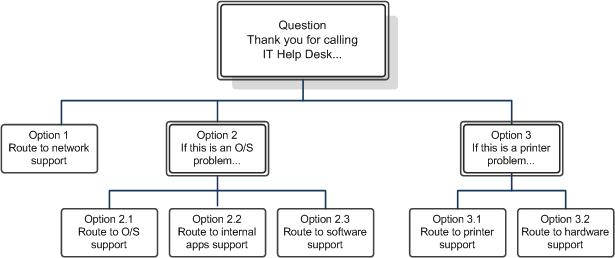

# <a name="designing-and-creating-response-group-workflows-in-skype-for-business"></a>Diseño y creación de flujos de trabajo de grupo de respuesta en Skype Empresarial

Diseñe y cree flujos de trabajo de grupo de respuesta en Skype Empresarial Server Telefonía IP empresarial. Se tratan los flujos de trabajo de grupo de extensiones y los flujos de trabajo interactivos.

Un flujo de trabajo define el comportamiento de una llamada desde el momento en que suena el teléfono hasta que alguien la atiende. El flujo de trabajo especifica la cola que se usará para mantener la llamada y especifica el método de enrutamiento que se usará para flujos de trabajo de grupo de extensiones o las preguntas y respuestas que se deben usar para flujos de trabajo de grupos de respuesta interactivos.

Un flujo de trabajo también define configuraciones como el mensaje de bienvenida, la música en espera, horario laboral y los días festivos.

> [!NOTE]
> Debe crear grupos de agentes y colas antes de crear un flujo de trabajo que use dichos elementos.

## <a name="creating-or-modifying-a-hunt-group-workflow"></a>Creación o modificación de un flujo de trabajo de grupo de extensiones

### <a name="to-use-response-group-configuration-tool-to-create-or-modify-a-hunt-group-workflow"></a>Para usar la Herramienta de configuración de grupo de respuesta para crear o modificar un flujo de trabajo de grupo de extensiones

1. Inicie sesión como miembro del grupo RTCUniversalServerAdmins, o como miembro de un rol administrativo predefinido que admita el grupo de respuesta.

2. Abra una ventana del explorador y, a continuación, escriba la dirección URL de administración para abrir el Panel de control de Skype Empresarial Server.

3. En la barra de navegación izquierda, haga clic en **Grupos de respuesta** y, a continuación, en **Flujo de trabajo**.

4. En la página **Flujo de trabajo**, haga clic en **Crear o editar flujo de trabajo**.

5. En el campo de búsqueda **Seleccionar un servicio**, escriba la totalidad o parte del nombre del servicio **ApplicationServer** que hospeda el flujo de trabajo que desea crear o cambiar. En la lista de resultados que aparece, haga clic en el servicio que desea y en **Aceptar**.

    > [!NOTE]
    > Se abre la Herramienta de configuración de grupo de respuesta. También puede abrir la Herramienta de configuración de grupo de respuesta directamente desde un explorador web escribiendo la siguiente dirección URL: https:// \<webPoolFqdn\> /RgsConfig.

6. Realiza una de las siguientes acciones:

   - En **Crear nuevo flujo de trabajo**, junto a **Grupo de búsqueda**, haga clic en **Crear**.

   - En **Administrar un flujo de trabajo existente**, localice el flujo de trabajo que desea cambiar y después, en **Acción**, haga clic en **Editar**.

7. Si está listo para que los usuarios empiecen a llamar al flujo de trabajo, active **Activar el flujo de trabajo**.

    > [!NOTE]
    >  Si va a crear un flujo de trabajo administrado, debe seleccionar **Activar el flujo de trabajo**. Cuando guarde el flujo de trabajo administrado activo, puede modificarlo o desactivarlo.

8. Para permitir que los usuarios federados puedan llamar al grupo, active la casilla **Habilitar para federación**. También debe tener una directiva de acceso externo que se aplique a la aplicación grupo de respuesta configurada para la federación.

    > [!NOTE]
    > La directiva de acceso externo global se aplica a la aplicación grupo de respuesta. Puede configurar la directiva global para la federación de grupos de respuesta mediante el Panel de control de Skype Empresarial Server o mediante el cmdlet **Set-CsExternalAccessPolicy** para establecer el parámetro EnableOutsideAccess en True. Tenga en cuenta que la configuración de directiva global se aplicará a todos los usuarios a menos que estén asignados a un sitio o a una directiva de usuario. Por lo tanto, antes de modificar este parámetro de los grupos de respuesta, asegurese de que la configuración de federación cumple con los requisitos de su organización. Para más información sobre cómo se aplican las directivas a los usuarios, vea [Manage External Access Policy for Your Organization](/previous-versions/office/lync-server-2013/lync-server-2013-manage-external-access-policy-for-your-organization). Para obtener más información acerca de la configuración de federación, [vea Set-CsExternalAccessPolicy](/powershell/module/skype/set-csexternalaccesspolicy?view=skype-ps).

    > [!NOTE]
    > Los usuarios hospedados en Skype Empresarial Online no pueden realizar llamadas a grupos de respuesta hospedados en una implementación local. Esto ocurre tanto en implementaciones híbridas como en los casos en que una implementación local está federada con una implementación de Skype Empresarial Online.

9. Para ocultar la identidad de los agentes durante las llamadas, active la casilla **Habilitar anonimato de agente**.

    > [!NOTE]
    > Las llamadas anónimas no se pueden iniciar con mensajería instantánea o vídeo, pese a que el agente o el autor de la llamada pueden agregar mensajería instantánea y vídeo después de establecer la llamada. Asimismo, un agente anónimo puede poner llamadas en espera, transferir llamadas (tanto transferencias a otras líneas como consultas), además de estacionar y recuperar llamadas. Las llamadas anónimas no admiten conferencias, uso compartido de aplicaciones ni de escritorio, transferencia de archivos, función de pizarra, colaboración de datos y grabación de llamadas. Los agentes que usan el complemento VDI de Lync pueden recibir llamadas entrantes de forma anónima, pero no pueden realizar llamadas salientes de forma anónima.

10. En **Especifique la dirección del grupo que recibirá las llamadas**, escriba la dirección del identificador uniforme de recursos (URI) del SIP primario del grupo que responderá las llamadas al flujo de trabajo.

    > [!NOTE]
    > El URI primario para un flujo de trabajo es el modo en que este se identifica y se da a conocer. El URI de SIP que escriba se crea como un objeto de contacto en servicios de dominio de Active Directory. Para crear el URI, el objeto debe ser único en Active Directory.

11. En **Nombre para mostrar**, escriba el nombre que quiera mostrar para el flujo de trabajo (por ejemplo, Grupo de respuesta de ventas).

    > [!NOTE]
    > No incluya los caracteres "<" o ">" en el nombre para mostrar. No use los siguientes nombres para mostrar porque están reservados: **Observador de presencia de RGS** o **Servicio de anuncio**.

12. En **Número de teléfono**, especifique el URI de línea para el grupo de respuesta (por ejemplo, +14255550165).

13. En **Número para mostrar**, escriba el número tal como desea que aparezca para el grupo de respuesta (por ejemplo, +1 (425) 555-0165).

14. (Opcional) En **Descripción**, escriba una descripción para el flujo de trabajo como desee que aparezca en la tarjeta de contacto en Skype Empresarial.

15. En **Tipo de flujo de trabajo**, seleccione **Administrado** si un administrador de grupos de respuesta va a administrar este flujo de trabajo. Haga lo siguiente para asignar administradores de grupo de respuesta al flujo de trabajo:

    a. Escriba el URI del SIP de un administrador para este flujo de trabajo y haga clic en **Agregar**.

    b. Escriba el URI del SIP de otros administradores que desee agregar al flujo de trabajo y haga clic en **Agregar**.

    > [!IMPORTANT]
    > A todos los usuarios designados administradores de un grupo de respuestas se les asigna el rol CsResponseGroupManager. Los usuarios a los que no se haya asignado este rol no pueden administrar grupos de respuesta.

16. En **Paso 2 Seleccionar un idioma**, haga clic en el idioma que desea utilizar para reconocimiento de voz y conversión de texto a voz.

17. Si desea definir un mensaje de bienvenida, en el **Paso 3 Configurar un mensaje de bienvenida**, active la casilla **Reproducir un mensaje de bienvenida** y, a continuación, lleve a cabo uno de estos procedimientos:

    - Para escribir el mensaje de bienvenida como texto que se convertirá en voz para los autores de llamadas, haga clic en **Usar texto a voz** y, a continuación, escriba el mensaje de bienvenida en el cuadro de texto.

    > [!NOTE]
    > No incluya etiquetas HTML en el texto que especifique. Si incluye etiquetas HTML, recibirá un mensaje de error.

    - Para usar una grabación en archivo de audio de wave o Windows Media para el mensaje de bienvenida, haga clic en **Seleccionar una grabación**. Si desea cargar un archivo de audio nuevo, haga clic en el vínculo **una grabación**. En la nueva ventana del explorador, haga clic en **Examinar**, seleccione el archivo de audio que desea utilizar y, a continuación, haga clic en **Abrir**. Haga clic en **Cargar** para cargar el archivo de audio.

    > [!NOTE]
    > Todos los archivos de audio suministrados por el usuario deben cumplir determinados requisitos. Para más información sobre los formatos admitidos, vea [Technical Requirements for Response Groups](/previous-versions/office/lync-server-2013/lync-server-2013-technical-requirements-for-response-group).

18. En **Paso 4 Especificar horario de oficina**, en el cuadro **Su zona horaria**, haga clic en la zona horaria para el flujo de trabajo.

    > [!NOTE]
    > La zona horaria es aquella donde residen los autores de las llamadas y los agentes del flujo de trabajo. Se usa para calcular las horas de apertura y de cierre. Por ejemplo, si el flujo de trabajo se configura para usar la zona horaria Hora oriental de América del Norte y el flujo de trabajo se programa para abrirse a las 7:00 horas y cerrarse a las 23:00 horas, se supone que las horas de apertura y de cierre son, respectivamente, 7:00 horas en horario oriental y 23:00 horas en horario oriental. (Debe escribir las horas en el formato de 24 horas).

19. Para seleccionar el tipo de programación de horario de oficina que quiere usar, siga uno de los procedimientos siguientes:

    - Para utilizar una programación predefinida de horario de oficina, haga clic en **Utilizar una programación preestablecida** y, a continuación, seleccione el horario que desea utilizar en la lista desplegable.

      > [!NOTE]
      > Debe definir al menos una programación preestablecida previamente para poder seleccionar esta opción. Puede definir programaciones preestablecidas con el cmdlet **New-CSRgsHoursOfBusiness**. Para obtener más información, [vea (Opcional) Define Response Group business hours in Skype for Business](optional-define-response-group-business-hours.md).

      > [!NOTE]
      > Cuando selecciona una programación preestablecida, **Día**, **Abrir** y **Cerrar** se rellenan automáticamente con los días y las horas en los que el grupo de respuesta se encuentra disponible.

    - Para utilizar una programación personalizada que se aplique únicamente a este flujo de trabajo, haga clic en **Usar programación personalizada**.

20. Si está creando una programación personalizada para este flujo de trabajo, haga clic en las casillas correspondientes a los días de la semana durante los que se encuentra disponible el grupo de respuesta.

21. Si va a crear una  programación  personalizada, escriba las horas de apertura y cierre para cada día de la semana en que el grupo de respuesta está disponible.

    > [!NOTE]
    > Las horas en **Abrir** y **Cerrar** deben mostrarse en formato de 24 horas. Por ejemplo, si en su oficina se trabaja de 9 a 5 y se cierra al mediodía para el almuerzo, el horario de oficina queda representado como **Abrir** 9:00, **Cerrar** 12:00, **Abrir** 13:00 y **Cerrar** 17:00.

22. Si desea reproducir un mensaje cuando la oficina no esté abierta, active la casilla **Reproducir un mensaje cuando el grupo de respuesta no está en horario de oficina** y, a continuación, especifique el mensaje que se va a reproducir mediante uno de los procedimientos siguientes:

    - Para escribir el mensaje como texto que se convertirá en voz para el autor de la llamada, haga clic en **Usar texto a voz** y, a continuación, escriba el mensaje de bienvenida en el cuadro de texto.

      > [!NOTE]
      > No incluya etiquetas HTML en el texto que especifique. Si incluye etiquetas HTML, recibirá un mensaje de error.

    - Para utilizar una grabación en un archivo de audio para el mensaje, haga clic en **Seleccionar una grabación**. Si desea cargar un archivo de audio nuevo, haga clic en el vínculo **una grabación**. En la nueva ventana del explorador, haga clic en **Examinar**, seleccione el archivo que desea utilizar y, a continuación, haga clic en **Abrir**. Haga clic en **Cargar** para cargar el archivo de audio.

      > [!NOTE]
      > Todos los archivos de audio suministrados por el usuario deben cumplir determinados requisitos. Para más información sobre de los formatos de archivo de audio compatibles, consulte [Technical Requirements for Response Groups](/previous-versions/office/lync-server-2013/lync-server-2013-technical-requirements-for-response-group).

23. Especifique cómo abordar las llamadas tras la reproducción del mensaje (si se ha configurado uno):

    - Para desconectar la llamada, haga clic en **Desconectar llamada**.

    - Para desviar la llamada al correo de voz, haga clic en **Desviar a correo de voz** y, a continuación, escriba la dirección del correo de voz. El formato de la dirección de correo de voz *\<username\>* @ *\<domainName\>* es (por ejemplo, bob@contoso.com).

    - Para desviar la llamada a otro usuario, haga clic en **Desviar a URI de SIP** y, a continuación, escriba la dirección de un usuario. El formato de la dirección de usuario es _\<username\>_ @ _\<domainName\>_ .

    - Para desviar la llamada a otro número de teléfono, haga clic en **Desviar a número de teléfono** y, a continuación, escriba el número de teléfono. El formato del número de teléfono *\<number\>* @ *\<domainName\>* es (por ejemplo, +14255550121@contoso.com). El nombre de dominio se usa para enrutar al autor de la llamada al destino correcto.

24. En **Paso 5 Especificar días festivos**, haga clic en las casillas para uno o más conjuntos de días festivos que definan los días en los que el grupo de respuesta no esté laboralmente disponible.

    > [!NOTE]
    > Debe definir las vacaciones y los conjuntos de vacaciones antes de configurar el flujo de trabajo. Use los cmdlets **New-CsRgsHoliday** y **New-CsRgsHolidaySet** para definir las vacaciones y los conjuntos de vacaciones. Para obtener más información, [vea (Opcional) Definir](optional-define-response-group-holiday-sets.md)conjuntos de días festivos de grupo de respuesta en Skype Empresarial .

25. Si desea reproducir un mensaje durante los días festivos, active la casilla **Reproducir un mensaje durante los días festivos** y, a continuación, especifique el mensaje que se va a reproducir mediante uno de los siguientes procedimientos:

    - Para escribir el mensaje como texto que se convertirá en voz para el autor de la llamada, haga clic en **Usar texto a voz** y, a continuación, escriba el mensaje de bienvenida en el cuadro de texto.

    > [!NOTE]
    > No incluya etiquetas HTML en el texto que especifique. Si incluye etiquetas HTML, recibirá un mensaje de error.

    - Para utilizar una grabación en un archivo de audio para el mensaje, haga clic en **Seleccionar una grabación**. Si desea cargar un archivo de audio nuevo, haga clic en el vínculo **una grabación**. En la nueva ventana del explorador, haga clic en **Examinar**, seleccione el archivo que desea utilizar y, a continuación, haga clic en **Abrir**. Haga clic en **Cargar** para cargar el archivo de audio.

      > [!NOTE]
      > Todos los archivos de audio suministrados por el usuario deben cumplir determinados requisitos. Para más información sobre de los formatos de archivo de audio compatibles, consulte [Technical Requirements for Response Groups](/previous-versions/office/lync-server-2013/lync-server-2013-technical-requirements-for-response-group).

26. Especifique cómo abordar las llamadas tras la reproducción del mensaje (si se ha configurado uno):

    - Para desconectar la llamada, haga clic en **Desconectar llamada**.

    - Para desviar la llamada al correo de voz, haga clic en **Desviar a correo de voz** y, a continuación, escriba la dirección del correo de voz. El formato de la dirección de correo de voz *\<username\>* @ *\<domainName\>* es (por ejemplo, bob@contoso.com).

    - Para desviar la llamada a otro usuario, haga clic en **Desviar a URI de SIP** y, a continuación, escriba la dirección de un usuario. El formato de la dirección de usuario es _\<username\>_ @ _\<domainName\>_ .

    - Para desviar la llamada a otro número de teléfono, haga clic en **Desviar a número de teléfono** y, a continuación, escriba el número de teléfono. El formato del número de teléfono *\<number\>* @ *\<domainName\>* es (por ejemplo, +14255550121@contoso.com). El nombre de dominio se usa para enrutar al autor de la llamada al destino correcto.

27. En **Paso 6 Configurar una cola**, en **Seleccionar la cola que recibirá las llamadas**, seleccione la cola donde desea que los autores de las llamadas se mantengan en espera hasta que un agente esté disponible.

28. En el **Paso 7 Configurar música en espera**, elija la música que desea que escuchen los autores de las llamadas mientras esperan a un agente; para ello lleve a cabo uno de procedimientos siguientes:

    - Para usar la grabación predeterminada de música en espera, haga clic en **Usar predeterminado**.

    - Para usar una grabación en un archivo de audio para la música en espera, haga clic en **Seleccionar una música**. Si desea cargar un archivo de audio nuevo, haga clic en el vínculo **un archivo de música**. En la nueva ventana del explorador, haga clic en **Examinar**, seleccione el archivo que desea utilizar y, a continuación, haga clic en **Abrir**. Haga clic en **Cargar** para cargar el archivo de audio.

      > [!NOTE]
      > Todos los archivos de audio suministrados por el usuario deben cumplir determinados requisitos. Para más información sobre los formatos de audio admitidos, vea [Technical Requirements for Response Groups](/previous-versions/office/lync-server-2013/lync-server-2013-technical-requirements-for-response-group).

29. Haga clic en **Implementar**.

### <a name="to-use-skype-for-business-server-management-shell-to-create-or-modify-a-hunt-group-workflow"></a>Para usar el Shell de administración de Skype Empresarial Server para crear o modificar un flujo de trabajo de grupo de extensiones

1. Inicie sesión como miembro del grupo RTCUniversalServerAdmins, o como miembro de un rol administrativo predefinido que admita el grupo de respuesta.

2. Inicie el Shell de administración de Skype Empresarial Server: haga clic en Inicio **,** en Todos los programas **,** **en Skype Empresarial 2015** y, a continuación, en Shell de administración **de Skype Empresarial Server**.

3. Cree el mensaje de bienvenida que se reproducirá y guárdelo en una variable. En la línea de comandos, ejecute:

   ```powershell
   $promptWM = New-CsRgsPrompt -TextToSpeechPrompt "<text for TTS prompt>"
   ```

    Por ejemplo:

   ```powershell
   $promptWM = New-CsRgsPrompt -TextToSpeechPrompt "Welcome to Contoso. Please wait for an available agent."
   ```

     > [!NOTE]
     > Para usar un archivo de audio para el mensaje, ejecute el cmdlet **Import-CsRgsAudioFile**. Para obtener más información, [vea Import-CsRgsAudioFile](/powershell/module/skype/import-csrgsaudiofile?view=skype-ps).

4. Obtenga la identidad de la cola o la pregunta a la que se dirigirán las llamadas. En la línea de comandos, ejecute:

   ```powershell
   $qid = (Get-CsRgsQueue -Name "Help Desk").Identity
   ```

    Para obtener más información sobre cómo crear la cola, [vea New-CsRgsQueue](/powershell/module/skype/new-csrgsqueue?view=skype-ps).

5. Defina la acción que se ejecutará cuando un flujo de trabajo se abra en horas de trabajo y guárdela en una variable. En la línea de comandos, ejecute:

   ```powershell
   $actionWM = New-CsRgsCallAction -Prompt <saved prompt from previous step> -Action <action to be taken> -QueueID $qid
   ```

    > [!NOTE]
    > Para los flujos de trabajo de grupo de búsqueda, la acción habitual será dirigir la llamada a una cola. Este parámetro es necesario para flujos de trabajo activos. No se necesita para los flujos de trabajo inactivos.

    Por ejemplo:

   ```powershell
   $actionWM = New-CsRgsCallAction -Prompt $promptWM -Action TransferToQueue -QueueID $qid.Identity
   ```

6. Para definir horas laborables y vacaciones, créelas antes de crear o modificar el flujo de trabajo. Para obtener más información, [vea (Opcional) Define Response Group business hours in Skype for Business](optional-define-response-group-business-hours.md) y [(Optional) Define Response Group holiday sets in Skype for Business](optional-define-response-group-holiday-sets.md).

7. Si desea tener mensajes para las llamadas que se reciben en un horario no laborable o en época de vacaciones, use el cmdlet **New-CsRgsPrompt** para definir el mensaje y el cmdlet **New-CsRgsCallAction** para definir la acción que se ejecutará después del mensaje. Para obtener más información, [vea New-CsRgsPrompt](/powershell/module/skype/new-csrgsprompt?view=skype-ps) y [New-CsRgsCallAction](/powershell/module/skype/new-csrgscallaction?view=skype-ps).

8. Recupere el nombre del servicio para el servicio grupo de respuesta de Lync Server y asígnelo a una variable. En la línea de comandos, ejecute:

   ```powershell
   $serviceId = "service:" + (Get-CsService | ?{$_.Applications -like "*RGS*"}).ServiceId;
   ```

9. Cree o modifique el flujo de trabajo. Para crear un flujo de trabajo, use **New-CsRgsWorkflow**. Para modificar un flujo de trabajo, use **Set-CsRgsWorkflow**. En la línea de comandos, escriba lo siguiente:

   ```powershell
   $workflowHG = New-CsRgsWorkflow -Parent <service ID for the Response Group service> -Name "<hunt group name>" [-Description "<hunt group description>"] -PrimaryUri "<SIP address for the workflow>" [-LineUri "<Phone number for the workflow>"] [-DisplayNumber "<Phone number displayed in Lync>"] [-Active <$true | $false>] [-Anonymous <$true | $false>] [-DefaultAction <variable from preceding step>] [-EnabledForFederation <$true | $false>] [-Managed <$true | $false>] [-ManagersByUri <SIP addresses for Response Group Managers who can manage the workflow>]
   ```

    Por ejemplo:

   ```powershell
   $workflowHG = New-CsRgsWorkflow -Parent $serviceID -Name "Human Resources" -Description "Human Resources workflow" -PrimaryUri "sip:humanresources@contoso.com" -LineUri "TEL:+14255551219" -DisplayNumber "555-1219" -Active $true -Anonymous $true -DefaultAction $actionWM -EnabledForFederation $false -Managed $true -ManagersByUri "sip:bob@contoso.com", "mindy@contoso.com"
   ```

     > [!IMPORTANT]
     > Todos los usuarios que hayan sido designados administradores de flujos de trabajo deben tener asignado el rol CsResponseGroupManager.

     > [!NOTE]
     > Para obtener más información sobre los parámetros opcionales adicionales, vea [New-CsRgsWorkflow](/powershell/module/skype/new-csrgsworkflow?view=skype-ps) o [Set-CsRgsWorkflow](/powershell/module/skype/set-csrgsworkflow?view=skype-ps)

## <a name="designing-an-interactive-workflow"></a>Diseño de un flujo de trabajo interactivo

Puede usar la respuesta de voz interactiva (IVR) para obtener información de los autores de llamadas y dirigir la llamada a la cola adecuada. Los pares de preguntas y respuestas determinan qué cola usar. Según la respuesta del autor de la llamada, el autor de la llamada oirá una pregunta de seguimiento o se enruta a la cola adecuada. Las preguntas IVR y las respuestas del autor de la llamada se proporcionan al agente que responde que acepta la llamada, proporcionando información valiosa al agente.

### <a name="overview-of-ivr-features"></a>Información general de las características de IVR

La aplicación Grupo de respuesta ofrece reconocimiento de voz y capacidades de texto a voz en 26 idiomas. Puede formular preguntas al IVR mediante texto a voz o un archivo wave (.wave) o Windows Media Audio (.wma). Los autores de las llamadas pueden responder mediante voz o tono de marcado de frecuencia múltiple (DTMF).

Los flujos de trabajo interactivos admiten hasta dos niveles de preguntas; cada una de las preguntas tiene dos respuestas posibles. El IVR hace una pregunta al autor de la llamada y, según la respuesta del autor de la llamada, enruta al autor de la llamada a una cola o hace una segunda pregunta. La segunda pregunta también puede tener cuatro respuestas posibles. Según la respuesta a la pregunta de segundo nivel, el autor de la llamada se enruta a la cola adecuada.

> [!NOTE]
> Al diseñar flujos de llamadas mediante el Shell de administración de Skype Empresarial Server, puede definir cualquier número de niveles de preguntas de IVR y cualquier número de respuestas. Sin embargo, para mejorar la usabilidad, le recomendamos que no use más de tres niveles de preguntas, con no más de cinco respuestas por pregunta. Además, si diseña un flujo de llamadas que tiene más de dos niveles de preguntas con más de cuatro respuestas cada una, no podrá editar el flujo de llamadas mediante el Panel de control de Skype Empresarial Server.

Las preguntas IVR y las respuestas del autor de la llamada se proporcionan al agente que responde que acepta la llamada.

### <a name="working-with-speech-technologies"></a>Trabajar con tecnologías de voz

Las tecnologías de voz, como el reconocimiento de voz y el texto a voz, pueden mejorar la experiencia del cliente y permitir que las personas tengan acceso a la información con mayor naturalidad y eficacia. Sin embargo, puede haber casos en que el motor de síntesis de voz no reconozca correctamente el texto especificado o la respuesta de voz del usuario. Por ejemplo, el motor de síntesis de texto a voz traduce el símbolo "#" como la palabra "número". Este problema se puede mitigar de la siguiente manera:

- El motor de síntesis de voz proporciona el autor de la llamada cinco intentos para responder a la pregunta. Si el autor de la llamada aporta una respuesta incorrecta (es decir, la respuesta no es ninguna de las especificadas), o si no responde, tendrá otra oportunidad para responder. El autor de la llamada tendrá cinco intentos para responder a la pregunta antes de ser desconectado. Puede configurar el IVR para que reproduzca un mensaje personalizado después de cada error del autor de la llamada. La pregunta se repite cada vez.

- Para reducir al máximo la posibilidad de que el motor de voz interprete el ruido ambiental como una respuesta, use respuestas más largas. Por ejemplo, cada respuesta debe tener más de una sílaba y debe sonar de forma significativamente distinta a las demás.

- Si sus preguntas tienen respuestas de voz y de DTMF, configure las respuestas de voz con palabras que representen el concepto, en lugar de la respuesta de DTMF. Por ejemplo, en lugar de "Pulse o diga uno", use "Pulse 1 o diga facturación".

- Después de diseñar IVR, llame al flujo de trabajo, escuche las indicaciones, responda a cada una de ellas mediante voz y compruebe que IVR suena y se comporta como se espera. A continuación, puede modificar el IVR para corregir los posibles problemas de interpretación. Siguiendo el ejemplo anterior, si necesita hacer referencia a la tecla #, puede volver a escribir la indicación del IVR para usar el nombre de la tecla, en lugar del símbolo #. Por ejemplo, "Para hablar con el departamento de ventas, presione la tecla almohadilla".

### <a name="ivr-design-examples"></a>Ejemplos de diseño de IVR

Los siguientes apartados contienen ejemplos de escenarios de IVR y pares de preguntas y respuestas.

#### <a name="ivr-with-one-level-of-questions"></a>IVR con preguntas de un nivel

En el ejemplo siguiente se muestra un IVR con un nivel de preguntas. Usa el reconocimiento de voz para detectar la respuesta del autor de la llamada.

 **Pregunta:** "Gracias por llamar a Recursos Humanos. Si desea hablar con Nóminas, diga nóminas. Si no, diga recursos humanos".

- **Se ha seleccionado la opción 1:** el autor de la llamada se enruta al equipo de nóminas.

- **Se ha seleccionado la opción 2:** el autor de la llamada se enruta al equipo de recursos humanos.

En la figura siguiente se muestra el flujo de la llamada.

 **Flujo de llamada interactiva de un nivel**


#### <a name="ivr-with-two-levels-of-questions"></a>IVR con dos niveles de preguntas

En el ejemplo siguiente, se muestra un IVR con dos niveles de preguntas. Permite a los autores de las llamadas responder mediante voz o el teclado numérico DTMF.

 **Pregunta:** "Gracias por llamar al Centro de Asistencia Técnica. Si tiene un problema de acceso a la red, pulse o diga 1. Si tiene un problema de software, pulse o diga 2. Si tiene un problema de hardware, pulse o diga 3".

- **Se ha seleccionado la opción 1:** el autor de la llamada se enruta al equipo de asistencia de red.

- **Se ha seleccionado la opción 2:** Se hace una pregunta de seguimiento al autor de la llamada:

    **Pregunta:** "Si se trata de un problema con el sistema operativo, pulse o diga 1. Si se trata de un problema con una aplicación interna, pulse o diga 2. Si no se trata de ninguna de estas opciones, pulse o diga 3".

  - **Se ha seleccionado la opción 1:** el autor de la llamada se enruta al equipo de asistencia de sistemas operativos.

  - **Se ha seleccionado la opción 2:** el autor de la llamada se enruta al equipo de asistencia de aplicaciones internas.

  - **Se ha seleccionado la opción 3:** el autor de la llamada se enruta al equipo de asistencia de software.

- **Se ha seleccionado la opción 3:** Se hace una pregunta de seguimiento al autor de la llamada:

    **Pregunta:** "Si se trata de un problema con la impresora, pulse 1. En caso contrario, pulse 2".

  - **Se ha seleccionado la opción 1:** el autor de la llamada se enruta al equipo de asistencia de impresoras.

  - **Se ha seleccionado la opción 2:** el autor de la llamada se enruta al equipo de asistencia de hardware.

En la figura siguiente se muestra el flujo de la llamada.

 **Flujo de llamada interactiva de dos niveles**



### <a name="best-practices"></a>Recomendaciones

En la lista siguiente se describen algunas técnicas recomendadas para diseñar IVR:

- Permita el autor de la llamada llegar rápidamente a la tarea. Evite el exceso de información o mensajes de marketing largos en el IVR.

- Si desea incluir un mensaje largo, puede añadirlo a la primera pregunta, en lugar del mensaje de bienvenida. Los autores de las llamadas pueden omitir el mensaje si forma parte de la primera pregunta, respondiéndola, pero no pueden omitir el mensaje de bienvenida.

- Habla en el idioma del autor de la llamada. Evite usar un lenguaje rebuscado. Hable con naturalidad.

- Escriba indicaciones efectivas. Quite todas las opciones innecesarias. Estructura la información para que la respuesta esperada del autor de la llamada esté al final de la oración. Por ejemplo, "Para hablar con el equipo de ventas, presione 1".

- Haga que las respuestas de voz sean fáciles para el usuario. Por ejemplo, si incluye respuestas de DTMF y de voz, use algo así: "Para hablar con el equipo de ventas, pulse 1 o diga ventas".

- Pruebe el IVR con un grupo de usuarios antes de implementarlo en toda la organización.

## <a name="creating-or-modifying-an-interactive-workflow"></a>Creación o modificación de un flujo de trabajo interactivo

### <a name="to-use-response-group-configuration-tool-to-create-or-modify-an-interactive-workflow"></a>Para usar la Herramienta de configuración de grupo de respuesta para crear o modificar un flujo de trabajo interactivo

1. Inicie sesión como miembro del grupo RTCUniversalServerAdmins, o como miembro de un rol administrativo predefinido que admita el grupo de respuesta.

2. Abra una ventana del explorador y, a continuación, escriba la dirección URL de administración para abrir el Panel de control de Skype Empresarial Server.

3. En la barra de navegación izquierda, haga clic en **Grupos de respuesta** y, a continuación, en **Flujo de trabajo**.

4. En la página **Flujo de trabajo**, haga clic en **Crear o editar flujo de trabajo**.

5. En el campo de búsqueda **Seleccionar un servicio** escriba total o parcialmente el nombre del servicio de **ApplicationServer** que hospeda el flujo de trabajo que desea crear o modificar. En la lista de resultados que aparece, haga clic en el servicio que desea y en **Aceptar**.

    > [!NOTE]
    > Se abre la Herramienta de configuración de grupo de respuesta. También puede abrir la Herramienta de configuración de grupo de respuesta directamente desde un explorador web escribiendo la siguiente dirección URL: https:// \<webPoolFqdn\> /RgsConfig.

6. Haga una de las acciones siguientes:

   - En **Crear un nuevo flujo de trabajo**, junto a **Interactivo**, haga clic en **Crear**.

   - En **Administrar un flujo de trabajo existente**, busque el flujo de trabajo que desea cambiar y, en **Acción**, haga clic en **Editar**.

7. Si todavía no está listo para que los usuarios comiencen a llamar al flujo de trabajo, desactive la casilla **Activar el flujo de trabajo**.

    > [!NOTE]
    >  Si va a crear un flujo de trabajo administrado, debe seleccionar **Activar el flujo de trabajo**. Cuando guarde el flujo de trabajo administrado activo, puede modificarlo o desactivarlo.

8. Para permitir que los usuarios federados puedan llamar al grupo, active la casilla **Habilitar para federación**. También debe tener una directiva de acceso externo que se aplique a la aplicación grupo de respuesta configurada para la federación.

    > [!NOTE]
    > La directiva de acceso externo global se aplica a la aplicación grupo de respuesta. Puede configurar la directiva global para la federación de grupos de respuesta mediante el Panel de control de Skype Empresarial Server o mediante el cmdlet **Set-CsExternalAccessPolicy** para establecer el parámetro EnableOutsideAccess en True. Tenga en cuenta que la configuración de directiva global se aplicará a todos los usuarios a menos que estén asignados a un sitio o a una directiva de usuario. Por lo tanto, antes de modificar este parámetro de los grupos de respuesta, asegurese de que la configuración de federación cumple con los requisitos de su organización. Para más información sobre cómo se aplican las directivas a los usuarios, vea [Manage External Access Policy for Your Organization](/previous-versions/office/lync-server-2013/lync-server-2013-manage-external-access-policy-for-your-organization). Para obtener más información sobre la configuración de federación, **consulte Set-CsExternalAccessPolicy** en la documentación.

    > [!NOTE]
    > Los usuarios hospedados en Skype Empresarial Online no pueden realizar llamadas a grupos de respuesta hospedados en una implementación local. Esto ocurre tanto en implementaciones híbridas como en los casos en que una implementación local está federada con una implementación de Skype Empresarial Online.

9. Para ocultar la identidad de los agentes durante las llamadas, active la casilla **Habilitar anonimato de agente**.

    > [!NOTE]
    > Las llamadas anónimas no se pueden iniciar con mensajería instantánea o vídeo, pese a que el agente o el autor de la llamada pueden agregar mensajería instantánea y vídeo después de establecer la llamada. Asimismo, un agente anónimo puede poner llamadas en espera, transferir llamadas (tanto transferencias a otras líneas como consultas), además de estacionar y recuperar llamadas. Las llamadas anónimas no admiten conferencias, uso compartido de aplicaciones ni de escritorio, transferencia de archivos, función de pizarra, colaboración de datos y grabación de llamadas. Los agentes que usan el complemento VDI de Lync pueden recibir llamadas entrantes de forma anónima, pero no pueden realizar llamadas salientes de forma anónima.

10. En **Especifique la dirección del grupo que recibirá las llamadas**, escriba la dirección del identificador uniforme de recursos (URI) del SIP primario del grupo que responderá a las llamadas del flujo de trabajo.

11. En **Nombre para mostrar**, escriba el nombre que desea mostrar para el flujo de trabajo (por ejemplo, Grupo de respuesta IVR de ventas).

    > [!NOTE]
    > No incluya los caracteres \<" or "\> " " en el nombre para mostrar. No use los siguientes nombres para mostrar porque están reservados: **Observador de presencia de RGS** o **Servicio de anuncio**.

12. En **Número de teléfono**, especifique el URI de línea para el grupo de respuesta (por ejemplo, +14255550165).

13. En **Número para mostrar**, escriba el número tal como desea que aparezca para el grupo de respuesta (por ejemplo, +1 (425) 555-0165).

14. (Opcional) En **Descripción**, escriba una descripción del flujo de trabajo que desea que aparezca en la tarjeta de contacto en Skype Empresarial.

15. En **Tipo de flujo de trabajo**, seleccione **Administrado** si un administrador de grupos de respuesta va a administrar este flujo de trabajo. Haga lo siguiente para asignar administradores de grupo de respuesta al flujo de trabajo:

    a. Escriba el URI del SIP de un administrador para este flujo de trabajo y haga clic en **Agregar**.

    b. Escriba el URI del SIP de otros administradores que desee agregar al flujo de trabajo y haga clic en **Agregar**.

    > [!IMPORTANT]
    > El rol CsResponseGroupManager debe asignarse a todos los usuarios que se designen como administradores de un grupo de respuesta. De lo contrario, no podrán administrar los grupos de respuesta.

16. En **Paso 2 Seleccionar un idioma**, haga clic en el idioma que se usará para el reconocimiento de voz y texto a voz.

17. Si desea definir un mensaje de bienvenida, en el **Paso 3 Configurar un mensaje de bienvenida**, active la casilla **Reproducir un mensaje de bienvenida** y, a continuación, lleve a cabo uno de estos procedimientos:

    - Para escribir el mensaje de bienvenida como texto que se convertirá en voz para los autores de llamadas, haga clic en **Usar texto a voz** y, a continuación, escriba el mensaje de bienvenida en el cuadro de texto.

    > [!NOTE]
    > No incluya etiquetas HTML en el texto que especifique. Si incluye etiquetas HTML, recibirá un mensaje de error.

    - Para utilizar una grabación en archivo de Wave o Windows Media para el mensaje de bienvenida, haga clic en **Seleccionar una grabación**. Si desea cargar un archivo de audio nuevo, haga clic en el vínculo **una grabación**. En la nueva ventana del explorador, haga clic en **Examinar**, seleccione el archivo de audio que desea utilizar y, a continuación, haga clic en **Abrir**. Haga clic en **Cargar** para cargar el archivo de audio.

    > [!NOTE]
    > Todos los archivos de audio proporcionados por el usuario deben cumplir ciertos requisitos. Para más información sobre los formatos de archivo compatibles, consulte [Technical Requirements for Response Groups](/previous-versions/office/lync-server-2013/lync-server-2013-technical-requirements-for-response-group).

18. En **Paso 4 Especificar horario de oficina**, en el cuadro **Su zona horaria**, haga clic en la zona horaria del flujo de trabajo.

    > [!NOTE]
    > La zona horaria se refiere a la zona donde residen los autores de llamadas y los agentes del flujo de trabajo. Se usa para calcular las horas de apertura y cierre. Por ejemplo, si el flujo de trabajo está configurado para usar la zona horaria Hora oriental de América del Norte y el flujo de trabajo está programado para abrir a las 7:00 y cerrar a 23:00, se supone que las horas de apertura y cierre son las 7:00 (Hora del este) y las 23:00 (Hora del este) respectivamente. Escriba las horas en la notación de 24 horas.

19. Para seleccionar el tipo de programación de horario de oficina que quiere usar, siga uno de los procedimientos siguientes:

    - Para utilizar una programación predefinida de horario de oficina, haga clic en **Utilizar una programación preestablecida** y, a continuación, seleccione el horario que desea utilizar en la lista desplegable.

      > [!NOTE]
      > Debe haber definido al menos una programación preestablecida con anterioridad para poder seleccionar esta opción. Las programaciones preestablecidas se definen mediante el cmdlet **New-CsRgsHoursOfBusiness.** Para obtener más información, [vea (Opcional) Define Response Group business hours in Skype for Business](optional-define-response-group-business-hours.md). Cuando selecciona una programación preestablecida, **Día**, **Abrir** y **Cerrar** se rellenan automáticamente con los días y las horas en los que el grupo de respuesta se encuentra disponible.

    - Para utilizar una programación personalizada que se aplique únicamente a este flujo de trabajo, haga clic en **Usar programación personalizada**.

20. Si está creando una programación personalizada para este flujo de trabajo, haga clic en las casillas correspondientes a los días de la semana durante los que se encuentra disponible el grupo de respuesta.

21. Si va a crear una programación personalizada, escriba las **horas** **de** apertura y cierre cuando el grupo de respuesta estará disponible.

     > [!NOTE]
     > Las horas en **Abrir** y **Cerrar** deben mostrarse en formato de 24 horas. Por ejemplo, si en su oficina se trabaja de 9 a 5 y se cierra al mediodía para el almuerzo, el horario de oficina queda representado como **Abrir** 9:00, **Cerrar** 12:00, **Abrir** 13:00 y **Cerrar** 17:00.

22. Si desea reproducir un mensaje cuando la oficina no esté abierta, active la casilla **Reproducir un mensaje cuando el grupo de respuesta no está en horario de oficina** y, a continuación, especifique el mensaje que se va a reproducir mediante uno de los procedimientos siguientes:

    - Para escribir el mensaje como texto que se convertirá en voz para el autor de la llamada, haga clic en **Usar texto a voz** y, a continuación, escriba el mensaje de bienvenida en el cuadro de texto.

      > [!NOTE]
      > No incluya etiquetas HTML en el texto que especifique. Si incluye etiquetas HTML, recibirá un mensaje de error.

    - Para utilizar una grabación en un archivo de audio para el mensaje, haga clic en **Seleccionar una grabación**. Si desea cargar un archivo de audio nuevo, haga clic en el vínculo **una grabación**. En la nueva ventana del explorador, haga clic en **Examinar**, seleccione el archivo que desea utilizar y, a continuación, haga clic en **Abrir**. Haga clic en **Cargar** para cargar el archivo de audio.

    > [!NOTE]
    > Todos los archivos de audio suministrados por el usuario deben cumplir determinados requisitos. Para más información sobre los formatos de archivo compatibles, consulte [Technical Requirements for Response Groups](/previous-versions/office/lync-server-2013/lync-server-2013-technical-requirements-for-response-group).

23. Especifique cómo abordar las llamadas tras la reproducción del mensaje (si se ha configurado uno):

    - Para desconectar la llamada, haga clic en **Desconectar llamada**.

    - Para desviar la llamada al correo de voz, haga clic en **Desviar a correo de voz** y, a continuación, escriba la dirección del correo de voz. El formato de la dirección de correo de voz *\<username\>* @ *\<domainname\>* es (por ejemplo, bob@contoso.com).

    - Para desviar la llamada a otro usuario, haga clic en **Desviar a URI de SIP** y, a continuación, escriba la dirección de un usuario. El formato de la dirección de usuario es _\<username\>_ @ _\<domainname\>_ .

    - Para desviar la llamada a otro número de teléfono, haga clic en **Desviar a número de teléfono** y, a continuación, escriba el número de teléfono. El formato del número de teléfono *\<number\>* @ *\<domainname\>* es (por ejemplo, +14255550121@contoso.com). El nombre de dominio se usa para enrutar al autor de la llamada al destino correcto.

24. En **Paso 5 Especificar días festivos**, haga clic en las casillas para uno o más conjuntos de días festivos que definan los días en los que el grupo de respuesta no esté laboralmente disponible.

    > [!NOTE]
    > Debe definir las vacaciones y los conjuntos de vacaciones antes de configurar el flujo de trabajo. Use los cmdlets **New-CsRgsHoliday** y **New-CsRgsHolidaySet** para definir las vacaciones y los conjuntos de vacaciones. Para obtener más información, [vea (Opcional) Definir](optional-define-response-group-holiday-sets.md)conjuntos de días festivos de grupo de respuesta en Skype Empresarial .

25. Si desea reproducir un mensaje durante los días festivos, active la casilla **Reproducir un mensaje durante los días festivos** y, a continuación, especifique el mensaje que se va a reproducir mediante uno de los siguientes procedimientos:

    - Para escribir el mensaje como texto que se convertirá en voz para el autor de la llamada, haga clic en **Usar texto a voz** y, a continuación, escriba el mensaje de bienvenida en el cuadro de texto.

      > [!NOTE]
      > No incluya etiquetas HTML en el texto que especifique. Si incluye etiquetas HTML, recibirá un mensaje de error.

    - Para utilizar una grabación en un archivo de audio para el mensaje, haga clic en **Seleccionar una grabación**. Si desea cargar un archivo de audio nuevo, haga clic en el vínculo **una grabación**. En la nueva ventana del explorador, haga clic en **Examinar**, seleccione el archivo que desea utilizar y, a continuación, haga clic en **Abrir**. Haga clic en **Cargar** para cargar el archivo de audio.

      > [!NOTE]
      > Todos los archivos de audio suministrados por el usuario deben cumplir determinados requisitos. Para más información sobre de los formatos de archivo de audio compatibles, consulte [Technical Requirements for Response Groups](/previous-versions/office/lync-server-2013/lync-server-2013-technical-requirements-for-response-group).

26. Especifique cómo abordar las llamadas tras la reproducción del mensaje (si se ha configurado uno):

    - Para desconectar la llamada, haga clic en **Desconectar llamada**.

    - Para desviar la llamada al correo de voz, haga clic en **Desviar a correo de voz** y, a continuación, escriba la dirección del correo de voz. El formato de la dirección de correo de voz *\<username\>* @ *\<domainname\>* es (por ejemplo, bob@contoso.com).

    - Para desviar la llamada a otro usuario, haga clic en **Desviar a URI de SIP** y, a continuación, escriba la dirección de un usuario. El formato de la dirección de usuario es _\<username\>_ @ _\<domainname\>_ .

    - Para desviar la llamada a otro número de teléfono, haga clic en **Desviar a número de teléfono** y, a continuación, escriba el número de teléfono. El formato del número de teléfono *\<number\>* @ *\<domainname\>* es (por ejemplo, +14255550121@contoso.com). El nombre de dominio se usa para enrutar al autor de la llamada al destino correcto.

27. En el **Paso 6 Configurar música en espera**, elija lo que desea que escuchen los autores de las llamadas mientras esperan a un agente siguiendo uno de estos procedimientos:

    - Para usar la grabación predeterminada de música en espera, haga clic en **Usar predeterminado**.

    - Para utilizar una grabación en un archivo de audio para la música en espera, haga clic en **Seleccionar una música**. Si desea cargar un archivo de audio nuevo, haga clic en el vínculo **un archivo de música**. En la nueva ventana del explorador, haga clic en **Examinar**, seleccione el archivo que desea utilizar y, a continuación, haga clic en **Abrir**. Haga clic en **Cargar** para cargar el archivo de audio.

    > [!NOTE]
    > Todos los archivos de audio proporcionados por el usuario deben cumplir ciertos requisitos. Para más información sobre los formatos de archivo compatibles, consulte [Technical Requirements for Response Groups](/previous-versions/office/lync-server-2013/lync-server-2013-technical-requirements-for-response-group).

28. En **Paso 7 Configurar respuesta de voz interactiva**, bajo el encabezado **El usuario oirá el siguiente texto o mensaje grabado**, especifique la pregunta que se va a formular a los autores de las llamadas de la siguiente forma:

    - Para escribir la pregunta en formato de texto, haga clic en **Usar texto a voz** y, a continuación, escriba la pregunta en el cuadro de texto.

    > [!NOTE]
    > No incluya etiquetas HTML en el texto que especifique. Si incluye etiquetas HTML, recibirá un mensaje de error.

    > [!NOTE]
    > El motor de síntesis de texto a voz traduce el símbolo "#" como la palabra "número". Si necesita hacer referencia a la tecla # en el mensaje, debe usar el nombre de la tecla, en lugar del símbolo. Por ejemplo, "Para hablar con el departamento de ventas, presione la tecla almohadilla".

    - Para utilizar un archivo de audio pregrabado que contenga la pregunta, haga clic en **Seleccionar una grabación** y, a continuación, en el vínculo **una grabación** para cargar el archivo. En la nueva ventana del explorador, haga clic en **Examinar**, seleccione el archivo de audio y, a continuación, haga clic en **Abrir**. Haga **clic** en Cargar para cargar el archivo y, opcionalmente, puede escribir la pregunta en el cuadro de texto (esto permite que la pregunta y la respuesta del autor de la llamada se reenvían al agente que responde).

      > [!NOTE]
      > Todos los archivos de audio proporcionados por el usuario deben cumplir ciertos requisitos. Para más información sobre los formatos de archivo compatibles, consulte [Technical Requirements for Response Groups](/previous-versions/office/lync-server-2013/lync-server-2013-technical-requirements-for-response-group).

29. En **Respuesta 1**, especifique la primera respuesta posible a la pregunta de la siguiente manera:

    > [!IMPORTANT]
    > No utilice comillas (") en las respuestas de voz. Las comillas producen un error en la respuesta interactiva de voz (IVR).

    > [!NOTE]
    > Puede permitir que los autores de las llamadas respondan mediante voz, el teclado alfanumérico o ambas cosas.

    - Si desea permitir al autor de la llamada que responda mediante voz, escriba la respuesta en **Escribir una respuesta de voz**.

    - Si desea permitir al autor de la llamada que responda presionando una tecla del teclado numérico, haga clic en **Dígito** y en el dígito del teclado numérico.

30. Especifique si desea enrutar al autor de la llamada a una cola o hacer otra pregunta, de la manera siguiente:

    - Para enrutar al autor de la llamada hacia una cola, haga clic en **Enviar a una cola** y, en **Seleccionar una cola**, haga clic en la cola que desee utilizar.

    - Para hacer otra pregunta, haga clic en **Formular otra pregunta** y en **Usar texto a voz**, escriba la pregunta o haga clic en **Seleccionar una grabación**. Use los grupos de respuesta de esta sección para especificar hasta cuatro respuestas posibles para la pregunta adicional y la cola que se desea usar para cada respuesta. Para especificar una tercera o cuarta respuesta posible, haga clic en las casillas **Respuesta 3** o **Respuesta 4** respectivamente.

31. Especifique hasta otras tres respuestas posibles para la pregunta original. Para ello, repita los pasos 28 y 29 para especificar las posibles respuestas y la acción que se debe seguir con cada respuesta. Para especificar una tercera o cuarta respuesta posible, haga clic en las casillas **Respuesta 3** o **Respuesta 4** respectivamente.

32. Haga clic en **Implementar**.

### <a name="to-use-skype-for-business-server-management-shell-to-create-or-modify-an-interactive-workflow"></a>Para usar el Shell de administración de Skype Empresarial Server para crear o modificar un flujo de trabajo interactivo

1.  Inicie sesión como miembro del grupo RTCUniversalServerAdmins, o como miembro de un rol administrativo predefinido que admita el grupo de respuesta.

2. Inicie el Shell de administración de Skype Empresarial Server: haga clic en Inicio **,** en Todos los programas **,** **en Skype Empresarial 2015** y, a continuación, en Shell de administración **de Skype Empresarial Server**.

3. Recupere el nombre del servicio para el servicio del grupo de respuesta y asígnelo a una variable. En la línea de comandos, ejecute:

   ```powershell
   $serviceId = "service:" + (Get-CsService | ?{$_.Applications -like "*RGS*"}).ServiceId;
   ```

4. Un flujo de trabajo interactivo requiere dos o más colas y dos o más grupos de agentes. En primer lugar, cree los grupos de agentes. Ejecute:

   ```powershell
   $AGSupport = New-CsRgsAgentGroup -Parent $serviceId -Name "Technical Support" [-AgentAlertTime "20"] [-ParticipationPolicy "Informal"] [-RoutingMethod LongestIdle] [-AgentsByUri("sip:agent1@contoso.com", "sip:agent2@contoso.com")]
   $AGSales = New-CsRgsAgentGroup -Parent $serviceId -Name "Sales Team" [-AgentAlertTime "20"] [-ParticipationPolicy "Informal"] [-RoutingMethod LongestIdle] [-AgentsByUri("sip:bob@contoso.com", "sip:alice@contoso.com")]
   ```

5. Cree las colas. Ejecute:

   ```powershell
   $QSupport = New-CsRgsQueue -Parent $ServiceId -Name "Contoso Support" -AgentGroupIDList($AG-Support.Identity)
   $QSales = New-CsRgsQueue -Parent $ServiceId -Name "Contoso Sales" -AgentGroupIDList($AG-Sales.Identity)
   ```

6. Cree el primer aviso de grupo de respuesta. Ejecute:

   ```powershell
   $SupportPrompt = New-CsRgsPrompt -TextToSpeechPrompt "Please be patient while we connect you with Contoso Technical Support."
   ```

7. A continuación, cree la acción que debe realizarse tras el aviso. Ejecute:

   ```powershell
   $SupportAction = New-CsRgsCallAction -Prompt $SupportPrompt -Action TransferToQueue -QueueID $QSupport.Identity
   ```

8. Cree la primera respuesta de grupo de respuesta. Ejecute:

   ```powershell
   $SupportAnswer = New-CsRgsAnswer -Action $SupportAction [-DtmfResponse 1]
   ```

9. Ahora cree el segundo aviso, y la acción de llamada y la respuesta correspondientes. En primer lugar, cree el aviso. Ejecute:

   ```powershell
   $SalesPrompt = New-CsRgsPrompt -TextToSpeechPrompt "Please hold while we connect you with Contoso Sales."
   ```

10. Cree la segunda acción de llamada. Ejecute:

    ```powershell
    $SalesAction = New-CsRgsCallAction -Prompt $SalesPrompt -Action TransferToQueue -QueueID $QSales.Identity
    ```

11. Cree la segunda respuesta de grupo de respuesta. Ejecute:

    ```powershell
    $SalesAnswer = New-CsRgsAnswer -Action $SalesAction [-DtmfResponse 2]
    ```

12. Cree el aviso de nivel superior. Ejecute:

    ```powershell
    $TopLevelPrompt = New-CsRgsPrompt -TextToSpeechPrompt "Thank you for calling Contoso. For Technical Support, press 1. For a Sales Representative, press 2."
    ```

13. Cree la pregunta de nivel superior. Ejecute:

    ```powershell
    $TopLevelQuestion = New-CsRgsQuestion -Prompt $TopLevelPrompt [-AnswerList ($SupportAnswer, $SalesAnswer)]
    ```

14. Ahora cree el flujo de trabajo. Ejecute:

    ```powershell
    $IVRAction = New-CsRgsCallAction -Action TransferToQuestion [-Question $Question]
    $IVRWorkflow = New-CsRgsWorkflow -Parent $ServiceId -Name "Contoso Helpdesk" [-Description "The Contoso Helpdesk line."] -PrimaryUri "sip:helpdesk@contoso.com" [-LineUri tel:+14255554321] [-DisplayNumber "+1 (425) 555-4321"] [-Active $true] [-Anonymous $true] [-DefaultAction $IVRAction] [-Managed $true] [-ManagersByURI ("sip:mindy@contoso.com", "sip:bob@contoso.com")]
    ```

     > [!NOTE]
     > Todos los usuarios designados como administradores de un grupo de respuesta deben tener asignado el rol CsResponseGroupManager. De lo contrario, no podrán administrar los grupos de respuesta.

## <a name="see-also"></a>Ver también

[(Opcional) Definir conjuntos de días festivos de grupo de respuesta en Skype Empresarial](optional-define-response-group-holiday-sets.md)

[(Opcional) Definir horario comercial del grupo de respuesta en Skype Empresarial](optional-define-response-group-business-hours.md)

[New-CsRgsWorkflow](/powershell/module/skype/new-csrgsworkflow?view=skype-ps)

[Set-CsRgsWorkflow](/powershell/module/skype/set-csrgsworkflow?view=skype-ps)

[New-CsRgsPrompt](/powershell/module/skype/new-csrgsprompt?view=skype-ps)

[New-CsRgsCallAction](/powershell/module/skype/new-csrgscallaction?view=skype-ps)