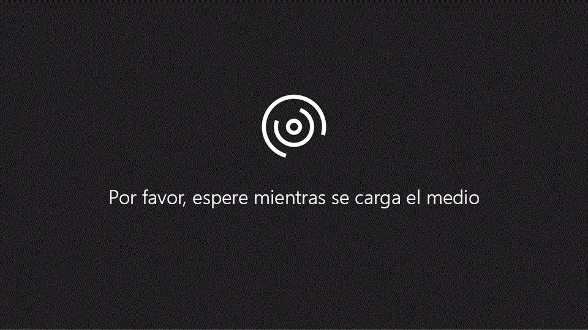

# Crear un recurso compartido de archivos en Skype Empresarial Server 2015Create a file share in Skype for Business Server 2015
 
**Resumen:** Aprenda a crear un recurso compartido de archivos de Windows Server como parte de la instalación de Skype para Business Server 2015.**Summary:** Learn how to create a Windows Server file share as part of the installation of Skype for Business Server 2015. Descargue una prueba gratuita de Skype para Business Server 2015 desde el centro de Evaluation de Microsoft en:[https://www.microsoft.com/evalcenter/evaluate-skype-for-business-server](https://www.microsoft.com/evalcenter/evaluate-skype-for-business-server).Download a free trial of Skype for Business Server 2015 from the Microsoft Evaluation center at:[https://www.microsoft.com/evalcenter/evaluate-skype-for-business-server](https://www.microsoft.com/evalcenter/evaluate-skype-for-business-server).
  
Skype para Business Server requiere un recurso compartido de archivos para que los equipos de toda la topología pueden intercambiar archivos.Skype for Business Server requires a file share so that computers throughout the topology can exchange files. Crear un recurso compartido de archivo es el paso 2 de 8 en el proceso de instalación de Skype para Business Server 2015.Creating a file share is step 2 of 8 in the installation process for Skype for Business Server 2015. Puede realizar los pasos 1 a 5 en cualquier orden.You can do steps 1 through 5 in any order. Sin embargo, debe realizar los pasos 6, 7 y 8 en orden y después los pasos del 1 al 5 como se indica en el diagrama.However, you must do steps 6, 7, and 8 in order, and after steps 1 through 5 as outlined in the diagram. Para planear los detalles sobre el recurso compartido de archivos, consulte [los requisitos ambientales para Skype para Business Server 2015](../../plan-your-deployment/requirements-for-your-environment/environmental-requirements.md).For planning details about file share, see [Environmental requirements for Skype for Business Server 2015](../../plan-your-deployment/requirements-for-your-environment/environmental-requirements.md).
  

  
## Crear un recurso compartido de archivos básicoCreate a basic file share

Esta sección le guiará a través de la creación de un archivo compartido básico de Windows Server.This section walks you through creating a basic Windows Server file share. Un archivo compartido básico de Windows Server es compatible con Skype para Business Server.A basic Windows Server file share is supported with Skype for Business Server. Sin embargo, no explícitamente proporciona alta disponibilidad.However, it does not explicitly provide high availability. Para un entorno de alta disponibilidad, se recomienda un recurso compartido de archivos de sistema de archivos distribuido (DFS).For a high availability environment, a Distributed File System (DFS) file share is recommended. Para obtener más información acerca de un recurso compartido de archivos de alta disponibilidad y DFS, vea [Planear la alta disponibilidad y recuperación ante desastres en Skype para Business Server 2015](../../plan-your-deployment/high-availability-and-disaster-recovery/high-availability-and-disaster-recovery.md).For more information about a high availability file share and DFS, see [Plan for high availability and disaster recovery in Skype for Business Server 2015](../../plan-your-deployment/high-availability-and-disaster-recovery/high-availability-and-disaster-recovery.md).
  
> [!NOTE]
> Se han realizado importantes avances en Windows Server 2012 R2 a fin de proporcionar soluciones de recursos compartidos de archivos similares a la red de área de almacenamiento (SAN) con la plataforma de Windows Server.Windows Server 2012 R2 has made major leaps in providing Storage Area Network (SAN)-like file share solutions using the Windows Server platform. Cuando se la compara con un dispositivo basado en SAN tradicional, una solución de almacenamiento de Windows Server 2012 R2 puede reducir los costes a la mitad con un impacto muy mínimo en el rendimiento.When compared to a traditional SAN-based appliance, a Windows Server 2012 R2 storage solution can cut costs in half with very minimal impact to performance. Para obtener más información acerca de las opciones de recurso compartido de archivo en Windows Server 2012 R2, consulte el documento descargable [Almacenamiento de R2 de Windows Server 2012](https://download.microsoft.com/download/9/4/A/94A15682-02D6-47AD-B209-79D6E2758A24/Windows_Server_2012_R2_Storage_White_Paper.pdf).For more information about file share options in Windows Server 2012 R2, see the downloadable white paper [Windows Server 2012 R2 Storage](https://download.microsoft.com/download/9/4/A/94A15682-02D6-47AD-B209-79D6E2758A24/Windows_Server_2012_R2_Storage_White_Paper.pdf). 
  
Vea los pasos del vídeo para **crear un recurso compartido de archivos**:Watch the video steps for **create a file share**:
  

  
### Crear un recurso compartido de archivos básicoCreate a basic file share

1. Inicie sesión en el equipo que hospedará el recurso compartido de archivos.Log on to the computer that will host the file share.
    
2. Haga clic con el botón secundario en la carpeta que desea compartir y seleccione **Propiedades**.Right-click the folder you plan to share, and select **Properties**.
    
3. Seleccione la pestaña **Uso compartido** y haga clic en **Uso compartido avanzado**.Select the **Sharing** tab, and click **Advanced Sharing**.
    
4. Haga clic en **Compartir esta carpeta**.Click **Share this folder**.
    
5. Haga clic en **Permisos**.Click **Permissions**.
    
6. Agregue el grupo **Administradores** local del servidor que aloja el recurso compartido de archivos, conceda derechos **Permitir: Control total, Cambiar y Leer** y, a continuación, haga clic en **Aceptar**.Add the local **Administrators** group of the server hosting the file share, grant **Allow: Full Control, Change, and Read** rights, and then click **OK**.
    
7. Haga clic en **Aceptar** nuevamente y tome nota de la ruta de acceso a la red.Click **OK** again and take note of the network path.
    
8. Haga clic en **Listo** para cerrar el asistente.Click **Done** to close the wizard.
    
     
  

