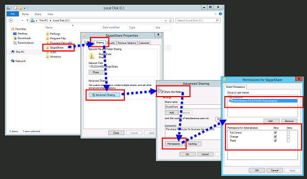

# Crear un recurso compartido de archivos en Skype empresarial Server
 
**Resumen:** Aprenda a crear un recurso compartido de archivos de Windows Server como parte de la instalación de Skype empresarial Server. Descargue una prueba gratuita de Skype empresarial Server en el centro de evaluación de Microsoft en[https://www.microsoft.com/evalcenter/evaluate-skype-for-business-server](https://www.microsoft.com/evalcenter/evaluate-skype-for-business-server):.
  
Skype empresarial Server requiere un recurso compartido de archivos para que los equipos de toda la topología puedan intercambiar archivos. La creación de un recurso compartido de archivos es el paso 2 de 8 en el proceso de instalación de Skype empresarial Server. Puede realizar los pasos 1 a 5 en cualquier orden. Sin embargo, debe realizar los pasos 6, 7 y 8 en orden, y después de los pasos 1 a 5, tal como se indica en el diagrama. Para obtener información sobre cómo planear el uso compartido de archivos, consulte [requisitos ambientales para Skype empresarial Server](../../plan-your-deployment/requirements-for-your-environment/environmental-requirements.md) o [requisitos del servidor para skype empresarial Server 2019](../../../SfBServer2019/plan/system-requirements.md).
  

  
## Crear un recurso compartido de archivos básico

En esta sección se explica cómo crear un recurso compartido de archivos de Windows Server básico. Un recurso compartido de archivos de Windows Server básico es compatible con Skype empresarial Server. Sin embargo, no proporciona de forma explícita alta la disponibilidad. Para un entorno de alta disponibilidad, se recomienda un recurso compartido de archivos del sistema de archivos distribuido (DFS). Para obtener más información sobre un recurso compartido de archivos y DFS de alta disponibilidad, consulte [planear la alta disponibilidad y la recuperación ante desastres en Skype empresarial Server](../../plan-your-deployment/high-availability-and-disaster-recovery/high-availability-and-disaster-recovery.md).
  
> [!NOTE]
> Se han realizado importantes avances en Windows Server 2012 R2 a fin de proporcionar soluciones de recursos compartidos de archivos similares a la red de área de almacenamiento (SAN) con la plataforma de Windows Server. Cuando se la compara con un dispositivo basado en SAN tradicional, una solución de almacenamiento de Windows Server 2012 R2 puede reducir los costes a la mitad con un impacto muy mínimo en el rendimiento. Para obtener más información sobre las opciones de uso compartido de archivos en Windows Server 2012 R2, consulte el documento en el que se puede descargar el [almacenamiento de Windows server 2012 R2](https://download.microsoft.com/download/9/4/A/94A15682-02D6-47AD-B209-79D6E2758A24/Windows_Server_2012_R2_Storage_White_Paper.pdf). 
  
Vea los pasos del vídeo para **crear un recurso compartido de archivos**:
  
> [!video https://www.microsoft.com/en-us/videoplayer/embed/dbef31be-e899-4a32-a1ca-370053284f56?autoplay=false]
  
### Crear un recurso compartido de archivos básico

1. Inicie sesión en el equipo que hospedará el recurso compartido de archivos.
    
2. Haga clic con el botón secundario en la carpeta que desea compartir y seleccione **Propiedades**.
    
3. Seleccione la pestaña **Uso compartido** y haga clic en **Uso compartido avanzado**.
    
4. Haga clic en **Compartir esta carpeta**.
    
5. Haga clic en **Permisos**.
    
6. Agregue el grupo **Administradores** local del servidor que aloja el recurso compartido de archivos, conceda derechos **Permitir: Control total, Cambiar y Leer** y, a continuación, haga clic en **Aceptar**.
    
7. Haga clic en **Aceptar** nuevamente y tome nota de la ruta de acceso a la red.
    
8. Haga clic en **Listo** para cerrar el asistente.
    
     
  
> [!NOTE]
>Si el almacén de archivos está hospedado en un recurso compartido DFS, se recibirá la siguiente ADVERTENCIA:

ADVERTENCIA: no se puede acceder a los permisos\\<domain>\<de uso compartido para "compartir>".

>Esto es lo que se espera si no es un administrador en el servidor de archivos o si se trata de un recurso compartido de sistema de archivos distribuido (DFS). Si los permisos de uso compartido ya se han configurado, esta advertencia se puede ignorar. Si se trata de un nuevo recurso compartido, consulte la documentación para obtener más información sobre cómo configurar manualmente los permisos de uso compartido.

>Debido a la incapacidad de acceder a los permisos de uso compartido en un recurso compartido DFS, Skype empresarial Server no podrá establecer grupos de forma explícita en el recurso compartido de archivos. Para asegurarse de que los componentes de Skype empresarial Server pueden acceder al recurso compartido de archivos con los permisos adecuados, asegúrese de que los siguientes grupos de RTC se agregan con permisos de uso compartido de nivel de lectura y lectura, además de los administradores locales con el uso compartido de control total permisos.
* RTCHSUniversalServices
* RTCComponentUniversalServices
* RTCUniversalServerAdmins
