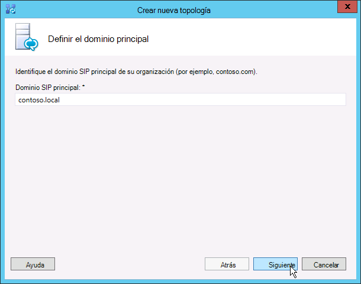
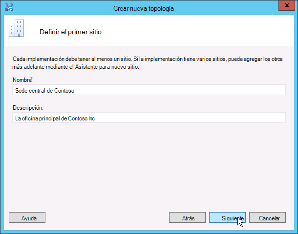
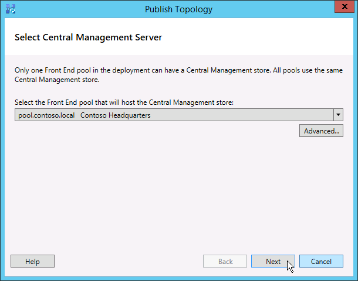

# Crear y publicar la nueva topología de Skype para Business Server
 
**Resumen:** Obtenga información sobre cómo crear, publicar y comprobar una nueva topología de antes de instalar Skype para Business Server. Descargue una versión de prueba gratuita de Skype para Business Server desde el Evaluation de Microsoft center en: [https://www.microsoft.com/evalcenter/evaluate-skype-for-business-server](https://www.microsoft.com/evalcenter/evaluate-skype-for-business-server).
  
Antes de instalar el Skype para sistema Business Server en cada uno de los servidores de la topología, debe crear una topología y publicarlo. Cuando se publica una topología, se carga información relativa a ella en la base de datos del Almacén de administración central. Si se trata de un grupo de servidores Enterprise Edition, la base de datos del Almacén de administración central se creará la primera vez que se publique una topología nueva. Si se trata de Standard Edition, debe ejecutar el proceso de preparación de primera un servidor Standard Edition desde el Asistente para la implementación antes de publicar una topología. Esto prepara a Standard Edition con la instalación de una instancia de SQL Server Express Edition y con la creación del Almacén de administración central. Se pueden realizar los pasos del 1 al 5 en cualquier orden. Sin embargo, debe realizar los pasos 6, 7 y 8 en orden y después de los pasos del 1 al 5, tal como se indica en el diagrama. Se describe cómo crear y publicar una topología nueva en el paso 6 de 8.
  

  
## Create and publish new topology

Puede usar Skype para Business Server Topology Builder para diseñar, definir, configurar y publicar las topologías. Anteriormente en este artículo, se instaló esta herramienta al instalar las herramientas administrativas. Al crear una topología, puede seleccionar varias opciones diferentes. En este procedimiento, creará una topología básica con conferencias.
  
> [!IMPORTANT]
> Skype para Business Server requiere SQL Server para que funcione. Las bases de datos principales se conocen como Almacén de administración central. Si implementa Enterprise Edition, estas bases de datos se crean cuando publique una topología con los pasos descritos a continuación. En este caso, el Generador de topologías le pedirá que suministre la información de conexión a una instalación de SQL Server. Si tiene previsto implementar Standard Edition, necesitará instalar SQL Server Express Edition antes de definir y publicar la nueva topología. Para instalar SQL Server Express Edition, necesita abrir el Asistente para la implementación en el servidor que será el servidor front-end y, luego, ejecutar Preparar el primer servidor Standard Edition. Cuando haga clic en Preparar el primer servidor Standard Edition, el Asistente para la implementación instalará automáticamente SQL Server Express Edition y creará las bases de datos del Almacén de administración central. 
  
### Crear una topología

1. Inicie sesión como usuario estándar con acceso al Generador de topologías.
    
2. Abra Skype para Business Server Topology Builder.
    
3. Seleccione **Nueva topología** y haga clic en **Aceptar**.
    
4. Seleccione una ubicación y un nombre de archivo para el archivo de configuración de la topología.
    
    > [!NOTE]
    > La configuración de la topología se guarda como un archivo XML (.tbxml) del Generador de topologías. Cuando una topología se publica, la información de configuración se envía desde el archivo a la base de datos de SQL Server. Cuando se vuelva a abrir el Generador de topologías en el futuro, se puede descargar la configuración existente desde SQL Server directamente en el Generador de topologías para, luego, publicarla de nuevo en SQL Server o guardarla como un archivo de configuración del Generador de topologías. 
  
5. En la pantalla **Definir el dominio principal**, escriba el **dominio SIP principal** y haga clic en **Siguiente**. En este ejemplo, utilizamos **contoso.local**, como se muestra en la figura.
    
     
  
6. Agregue todos los dominios SIP compatibles adicionales y, luego, haga clic en **Siguiente**.
    
7. Escriba un **Nombre** y una **Descripción** para el primer sitio (ubicación) y, luego, haga clic en **Siguiente**, como se muestra en la figura.
    
     
  
8. Escriba los datos para el sitio en **Ciudad**, **Estado o provincia** y **Código de país o región** y, luego, haga clic en **Siguiente**.
    
9. Haga clic en **Finalizar** para completar la definición de la nueva topología. El Asistente para el nuevo servidor front-end se inicia de forma automática.
    
### Definir un grupo de servidores front-end o un servidor Standard Edition

1. Revise los requisitos previos del asistente y, luego, haga clic en **Siguiente**.
    
2. Escriba el nombre de dominio completo (FQDN) del grupo de servidores, seleccione **Grupo de servidores front-end Enterprise Edition** o **Servidor Standard Edition** y, luego, haga clic en **Siguiente**, como se indica en la figura.
    
    > [!TIP]
    > Skype para Business Server Enterprise Edition puede incluir varios servidores funcionan conjuntamente para proporcionar el rol de Front-End. Cuando se utilizan varios servidores para cumplir con la función, se denomina un grupo de servidores. Por lo tanto, es también hace referencia a varios servidores que funcionan conjuntamente para proporcionar el rol de Front-End como el grupo de servidores Front-End. Skype para Business Server Standard Edition puede incluir un solo servidor para proporcionar el rol de Front-End. Es común para hacer referencia al grupo de servidores Front-End, incluso si un solo servidor ofrece la función. 
  
     
  
3. Escriba los nombres de dominio completos (FQDN) de todos los equipos en el grupo y, luego, haga clic en **Siguiente**, como se muestra en la figura.
    
     
  
4. Seleccione las características que se incluirán en esta topología y, luego, haga clic en **Siguiente**, como se muestra en la figura.
    
    > [!NOTE]
    > Skype para Business Server incluye muchas características avanzadas. Revise la documentación sobre la implementación y la planeación para cada característica específica que desea usar. 
  
     
  
5. En la página **roles de servidor combinados Select** , puede elegir instalar el servidor de mediación en el servidor Front-End o se pueden implementar como un servidor independiente.
    
    Si va a combinar el servidor de mediación en el grupo de servidores front-end Enterprise Edition, asegúrese de que la casilla está activada. El rol de servidor se implementará en los servidores del grupo. Si lo que hará es implementar el servidor de mediación de manera independiente, desactive la casilla correspondiente. Va a implementar el servidor de mediación en un paso de implementación independiente después de implementar completamente el servidor Front-End. Para la planeación de obtener información detallada acerca de una combinación, vea [Conceptos básicos de la topología de Skype para Business Server](../../plan-your-deployment/topology-basics/topology-basics.md).
    
6. La página **Asociar roles de servidor a este grupo de servidores front-end** le permite definir y asociar roles de servidor al grupo de servidores front-end. Se encuentra disponible el siguiente rol:
    
    **Habilitar un grupo de servidores perimetrales** Define y asocia un solo servidor perimetral o un grupo de servidores perimetrales. Un servidor perimetral facilita la comunicación y la colaboración entre usuarios de la organización y las personas ajenas a esta, incluidos usuarios federados.
    
    Existen dos escenarios posibles que pueden usarse para implementar y asociar roles de servidor.
    
    Para el escenario uno, se define una nueva topología para una nueva instalación. Puede acometer la instalación de las dos formas siguientes:
    
   - Dejar todas las casillas sin activar y definir la topología. Una vez que hayan publicado, configurado y comprobado los roles de los servidores front-end y back-end, puede volver a ejecutar el Generador de topologías para agregar los servidores de roles a la topología. Esta estrategia le permitirá comprobar el servidor front-end y el servidor que ejecuta SQL Server sin las complicaciones añadidas de los roles adicionales. Una vez completada la prueba inicial, puede volver a ejecutar el Generador de topologías para seleccionar los roles que necesite implementar.
    
   - Seleccione los roles que necesita instalar y, luego, configure el hardware para hospedar los roles seleccionados.
    
     Para el escenario dos, tiene una implementación existente y la infraestructura está preparada para nuevos roles, o bien necesita asociar roles existentes con un nuevo servidor front-end.
    
   - En este caso, seleccionará los roles que pretenda implementar o asociar con el nuevo servidor front-end. En cualquier caso, continuará con la definición de los roles, la configuración de cualquier hardware necesario y procederá con la instalación.
    
7. Luego, definirá el almacén de SQL Server que se usará con la topología. En este ejemplo, usaremos la instancia predeterminada. Para obtener más información acerca de las características de SQL Server, como una alta disponibilidad, consulte [Plan de alta disponibilidad y recuperación ante desastres en Skype para Business Server](../../plan-your-deployment/high-availability-and-disaster-recovery/high-availability-and-disaster-recovery.md).
    
   - Para usar el almacén de SQL Server existente que ya se ha definido en la topología, seleccione una instancia del **Almacén de SQL**.
    
   - Para definir una nueva instancia de SQL Server para almacenar la información de grupo de servidores, haga clic en **nuevo**y, a continuación, especifique el **FQDN de SQL Server** en el cuadro de diálogo **Definir nuevo almacén SQL** .
    
   - Para especificar el nombre de una instancia de SQL Server, seleccione **Instancia con nombre** y, luego, especifique el nombre de la instancia.
    
   - Para usar la instancia predeterminada, haga clic en **Instancia predeterminada**.
    
   - Para utilizar la creación de reflejo de SQL, seleccione **Habilitar creación de reflejo del almacén de SQL Server** y seleccione una instancia existente (o bien cree una).

     > [!NOTE]
     > La creación de reflejos de SQL está disponible en Skype para Business Server 2015, pero ya no se admite en Skype para Business Server 2019. Los métodos de agrupación en clústeres de conmutación por error de grupos de disponibilidad AlwaysOn, instancias de clúster de conmutación por error (FCI) AlwaysOn y SQL son preferidos con Skype para Business Server 2019.
    
     En este ejemplo, escribimos el **FQDN de SQL Server**, configuramos las opciones de alta disponibilidad pertinentes y hacemos clic en **Aceptar**, como se indica en la figura.
    
     
  
8. Decida si prefiere habilitar la creación de reflejo del almacén de SQL Server o el testigo de creación de reflejo de SQL Server y, luego, haga clic en **Siguiente**.
    
9. Defina el recurso compartido de archivos que desea usar.
    
   - Para usar un recurso compartido de archivos ya definido en la topología, seleccione **Usar un recurso compartido de archivos ya definido**.
    
   - Para definir un nuevo recurso compartido de archivos, seleccione **Definir un nuevo recurso compartido de archivos** en el cuadro **FQDN del servidor de archivos**, escriba el FQDN del servidor de archivos existente donde se ubicará el recurso compartido de archivos y, luego, escriba un nombre para el recurso compartido de archivos en el cuadro **Recurso compartido de archivos**.
    
     En este ejemplo, haremos clic en **Definir un nuevo almacén de archivos**, escribimos el **FQDN del servidor de archivos**, el **recurso compartido de archivos** y, luego, hacemos clic en **Siguiente**.
    
     > [!NOTE]
     > Se puede instalar el recurso compartido de archivos de Skype para Business Server pero no se recomienda por motivos de rendimiento. Tenga en cuenta en este ejemplo, se ha encontrado el recurso compartido de archivos en un único servidor dedicado que van a actuar como recurso compartido de archivos. Sin embargo, se recomiendan los otros sistemas de recurso compartido de archivo más sólidas, como DFS con Windows Server 2012 R2. Para obtener información detallada acerca de los sistemas de recurso compartido de archivo compatibles, vea [requisitos para su Skype para el entorno empresarial](../../plan-your-deployment/requirements-for-your-environment/requirements-for-your-environment.md). Para obtener más información acerca de cómo crear el recurso compartido de archivos, vea [crear un recurso compartido de archivos en Skype para Business Server](create-a-file-share.md). Puede definir el recurso compartido de archivos sin tener se ha creado el recurso compartido de archivos. Debe crear el recurso compartido de archivos en la ubicación que defina antes de publicar la topología. 
  
10. En la página Especificar la dirección URL de los servicios web, necesita decidir si es preciso reemplazar la dirección URL base del grupo de servidores de servicios web internos. El motivo de este reemplazo está relacionado con el equilibrio de carga. En el tráfico SIP básico se puede usar un equilibrio de carga de DNS sencillo. Pero, el tráfico de red HTTP/S de los servicios web necesita el uso de una solución de equilibrio de carga de hardware o software compatible. Para equilibradores de carga compatibles, vea [infraestructura de Skype para la empresa](https://docs.microsoft.com/SkypeForBusiness/certification/infra-gateways). En este ejemplo, usamos el equilibrio de carga de DNS para el tráfico SIP y una solución de equilibrio de carga de software compatible. Como vamos a dividir el tráfico de este modo, tendremos que reemplazar el FQDN del grupo de servicios web internos. Opcionalmente, si tuviéramos un equilibrador de carga de primer nivel y enviáramos todo el tráfico a través de él en vez de usar el equilibrio de carga de DNS para el tráfico SIP, no sería necesario reemplazar la dirección URL de los servicios web. 
    
    En la sección de DNS de este tema creamos un registro A para webint.contoso.local. Esta es la dirección URL que estamos usando para el tráfico HTTP/S de los servicios web y, como tal, necesita pasar por el equilibrador de carga de software compatible que hemos configurado. Por lo tanto, en este ejemplo, se reemplace la dirección URL para decirles Skype para Business Server que todo el tráfico HTTP/S debe ir al webint.contoso.local en lugar de pool.contoso.local, tal como se muestra en la ilustración. Para obtener más información acerca de equilibrio de carga, vea [requisitos de Skype para la empresa del equilibrio de carga](../../plan-your-deployment/network-requirements/load-balancing.md).
    
    > [!IMPORTANT]
    > La dirección URL base es la identidad de los servicios web para la dirección URL, sin la porción https://. Por ejemplo, si la dirección URL completa para los servicios Web del grupo de servidores es https://webint.contoso.local, la dirección URL base es webint.contoso.local. 
  
    - Si va a configurar el equilibrio de carga de DNS, como es el caso de este ejemplo, active la casilla **Reemplazar el FQDN del grupo de servicios web internos** y escriba la dirección URL base interna (que necesita ser distinta del FQDN del grupo de servidores) en **URL base interna**. 
    
    > [!CAUTION]
    > Si decide reemplazar los servicios web externos por un FQDN de definición propia, todos los FQDN necesitan ser diferentes de cualquier otro grupo de servidores front-end, director o grupo de directores. **Use solo caracteres estándar** (incluidos A-z, a-z, 0-9 y guiones) al definir las direcciones URL o nombres de dominio completos. No use caracteres Unicode ni guiones bajos. Por lo general, los DNS externos y las entidades de certificación (CA) públicas no admiten caracteres que no sean estándares en un FQDN o en una dirección URL (es decir, cuando el FQDN o la dirección URL se necesitan asignar al nombre de sujeto o al nombre de sujeto alternativo en el certificado).
  
    - También puede escribir la dirección URL base externa en **URL base externa**. En tal caso, escribiríamos una dirección URL base externa de forma que se distinguiera de los nombres de dominio internos. Por ejemplo, el dominio interno es contoso.local, pero el nombre de dominio externo es contoso.com. La dirección URL se definiría con el nombre de dominio contoso.com porque necesita resolverse desde el DNS público. También es importante en el caso de un proxy inverso. El nombre de dominio de la dirección URL base externa sería el mismo que el nombre de dominio del FQDN del servidor proxy inverso. El acceso HTTP al grupo de servidores front-end es necesario para la presencia y la mensajería instantánea en los clientes móviles.
    
      
  
11. Si seleccionó **Conferencias** en la página **Seleccionar características**, tendrá que seleccionar un servidor de Office Web Apps. Haga clic en **Nuevo** para iniciar el cuadro de diálogo.
    
12. En el cuadro de diálogo **Definir nuevo servidor de Office Web Apps**, escriba el FQDN del servidor de Office Web Apps en el cuadro **FQDN del servidor Office Web Apps**; al hacerlo, la dirección URL de detección del servidor de Office Web Apps tendrá que aparecer automáticamente en el cuadro **Dirección URL de detección del servidor de Office Web Apps**.
    
    Si el servidor de Office Web Apps está instalada localmente y en la misma zona de red como Skype para Business Server, no seleccione la opción **Office Web Apps Server se implementa en una red externa (es decir, perimetral/Internet)**.
    
    Si Office Web Apps Server está implementado fuera del firewall interno, seleccione la opción **Office Web Apps Server se implementa en una red externa (es decir, en el perímetro/Internet)**.
    
13. Haga clic en **Finalizar** para completar la configuración. Si ha definido otros servidores de roles en la página **Asociar roles de servidor con este grupo de servidores front-end**, se abrirán páginas del Asistente para la configuración de roles independientes para que pueda configurar los roles de servidor. En este ejemplo solo seleccionamos las conferencias.
    
### Configurar direcciones URL sencillas

1. En el generador, haga clic en el nodo superior de **Skype para Business Server** y, a continuación, haga clic en **Editar propiedades**, tal como se muestra en la ilustración.
    
     
  
2. En el panel **Direcciones URL sencillas**, seleccione **Direcciones URL de acceso telefónico:** (marcado) o **Direcciones URL de reunión:** (reunión) para editarlas. Luego, haga clic en **Editar dirección URL**.
    
3. Actualice la dirección URL con el valor que quiera y haga clic en **Aceptar** para guardar la dirección URL modificada. Conviene configurar la dirección URL sencilla usando el dominio SIP externo para que los usuarios externos puedan unirse a reuniones (por ejemplo, contoso.com, que es un dominio externo, y no contoso.local, que es interno). Por lo tanto, el dominio SIP necesita poder resolverse por medio del DNS externo.
    
4. Edite la dirección URL de reunión realizando los mismos pasos, si es necesario.
    
### Para definir la dirección URL sencilla de administración opcional

1. En el generador, haga clic en el nodo de **Skype para Business Server** y, a continuación, haga clic en **Editar propiedades**.
    
2. En el cuadro **dirección URL de acceso administrativo** , escriba la dirección URL sencilla que desee para el acceso administrativo a Skype para el Panel de Control de servidor empresarial y, a continuación, haga clic en **Aceptar**.
    
    > [!TIP]
    > Recomendamos usar la dirección URL más simple posible como dirección URL sencilla de administración. La opción más sencilla es https://admin. _ \<dominio\>_. La dirección URL de administración puede ser un dominio tanto interno como externo (por ejemplo, contoso.local o contoso.com) siempre y cuando cada registro se pueda resolver en el DNS interno. 
  
    > [!IMPORTANT]
    > Si modifica una dirección URL sencilla después de la implementación inicial, necesita saber qué cambios influyen en los certificados y registros del Sistema de nombres de dominio (DNS) relativos a las direcciones URL sencillas. Si el cambio afecta a la base de una dirección URL sencilla, debe cambiar los registros DNS y certificados, demasiado. Por ejemplo, si cambia de https://sfb.contoso.com/Meet a https://meet.contoso.com cambia la dirección URL base de sfb.contoso.com a meet.contoso.com, por lo que necesita cambiar los registros DNS y certificados para hacer referencia a meet.contoso.com. Si cambia la dirección URL sencilla de https://sfb.contoso.com/Meet a https://sfb.contoso.com/Meetings, la dirección URL base de sfb.contoso.com sigue siendo el mismo, por lo que no DNS o es necesario realizar cambios de certificado. Cada vez que cambie un nombre de dirección URL simple, sin embargo, debe ejecutar el cmdlet **Enable-CsComputer** en cada Director y Front-End server para registrar el cambio.
  
### Publicar y comprobar la topología

1. Compruebe que todas las URL sencillas están configuradas correctamente.
    
2. Confirme que el servidor basado en SQL Server está en línea y disponible para el equipo donde el Generador de topologías está instalado, incluidas todas las reglas de firewall necesarias.
    
3. Confirme que el recurso compartido de archivos esté disponible y que los permisos correctos estén definidos.
    
4. Confirme que se han definido en la topología los roles de servidor correctos que cumplen los requisitos de la implementación.
    
5. Compruebe que los servidores existen en los Servicios de dominio de Active Directory (AD DS). Esto sucede automáticamente cuando los servidores se unen al dominio.
    
    Tras comprobar la topología y constatar que no hay errores de validación, estará listo para publicar la topología. Si hay errores de validación, necesitará corregirlos para poder publicarla.
    
6. Haga clic con el botón derecho en el nodo **Skype Empresarial Server** y, luego, haga clic en **Publicar topología**.
    
7. En la página **Publicar la topología**, haga clic en **Siguiente**.
    
8. En la página **Seleccionar servidor de administración central**, seleccione un grupo de servidores front-end, como se muestra en la figura.
    
    > [!NOTE]
    > Puede hacer clic en **Opciones avanzadas** para configurar las ubicaciones de los archivos de la base de datos.
  
     
  
9. En la página **Crear bases de datos**, seleccione las bases de datos que desea publicar.
    
    > [!NOTE]
    > Si no tiene los derechos adecuados para crear las bases de datos, puede desactivar las casillas de verificación junto a las bases de datos y, más adelante, alguien con los derechos adecuados puede crear las bases de datos. Para obtener información detallada acerca de los requisitos, vea [requisitos de servidor para Skype para Business Server](../../plan-your-deployment/requirements-for-your-environment/server-requirements.md). 
  
10. Opcionalmente, haga clic en **Opciones avanzadas**. Las opciones avanzadas de colocación de archivos de datos de SQL Server permiten seleccionar las siguientes opciones: 
    
    - **Determinar automáticamente la ubicación del archivo de base de datos** - esta opción determina el mejor rendimiento operativo en función de la configuración del disco en el servidor de SQL Server mediante la distribución de los archivos de registro y datos para la mejor ubicación.
    
    - **Valores predeterminados de instancia de SQL Server de uso** - esta opción coloca los archivos de registro y datos en el servidor basado en SQL Server mediante el uso de la configuración de instancia. No usa la función operativa del servidor basado en SQL Server para saber cuáles son las mejores ubicaciones para los archivos de datos y de registro. El administrador de SQL Server suele mover los archivos de datos y de registro a ubicaciones que son adecuadas para los procedimientos de administración de la organización y del servidor basado en SQL Server.
    
    Haga clic en **Aceptar** y, luego, en **Siguiente**. 
    
11. Opcionalmente, haga clic en **Opciones avanzadas**. Las opciones avanzadas de colocación de archivos de datos de SQL Server permiten seleccionar las siguientes opciones: 
    
    - **Determinar automáticamente la ubicación del archivo de base de datos** - esta opción determina el mejor rendimiento operativo en función de la configuración del disco en el servidor de SQL Server mediante la distribución de los archivos de registro y datos para la mejor ubicación.
    
    - **Valores predeterminados de instancia de SQL Server de uso** - esta opción coloca los archivos de registro y datos en el servidor basado en SQL Server mediante el uso de la configuración de instancia. No usa la función operativa del servidor basado en SQL Server para saber cuáles son las mejores ubicaciones para los archivos de datos y de registro. El administrador de SQL Server suele mover los archivos de datos y de registro a ubicaciones que son adecuadas para los procedimientos de administración de la organización y del servidor basado en SQL Server.
    
    Haga clic en **Aceptar**.
    
12. Haga clic en **Siguiente** para completar el proceso de publicación.
    
    > [!NOTE]
    > Un error muy habitual en este paso es que las bases de datos de SQL Server no se pueden crear. Cuando el proceso no se puede completar, se muestra un error, como se indica en la figura. Lo más probable es que esto se deba a que el usuario está tratando de crear la base de datos, pero carece de los permisos adecuados para ello, o bien a que no se puede establecer contacto con el sistema SQL Server por un problema de firewall o de red. 
  
     
  
13. Cuando se completa el proceso de publicación, se presenta un vínculo para abrir una lista de los pasos siguientes. Haga clic en **Hacer clic aquí para abrir la lista de tareas pendientes** para ver los próximos pasos y, luego, haga clic en **Finalizar**. 
    
    El mensaje "Se completó con advertencias" durante la creación de la base de datos no significa que se hayan producido errores. El proceso de instalación tiene que cambiar la configuración de SQL Server para Skype para Business Server para que funcione correctamente. Cuando una configuración se modifica en SQL Server, se registra como una advertencia, ya que así los administradores de SQL Server pueden saber exactamente si el proceso de instalación ha finalizado. Si recibe una advertencia, puede seleccionar el registro y, a continuación, haga clic en **Ver registros** para ver los detalles de la advertencia.
    
    Cuando se ha publicado correctamente la topología, puede empezar a instalar una réplica local del almacén de Administración Central en cada servidor que ejecuta Skype para Business Server en la topología. Recomendamos empezar por el primer grupo de servidores front-end. 
    

