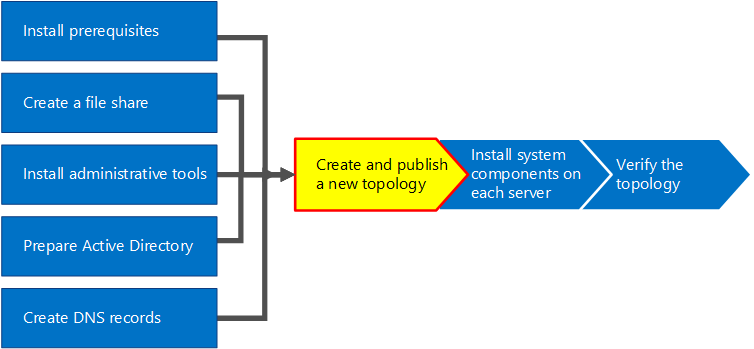

# Crear y publicar una topología nueva en Skype Empresarial Server
 
**Resumen:** Obtenga información sobre cómo crear, publicar y comprobar una topología nueva antes de instalar Skype Empresarial Server. Descargue una prueba gratuita de Skype Empresarial Server desde el Centro de evaluación de Microsoft en: [https://www.microsoft.com/evalcenter/evaluate-skype-for-business-server](https://www.microsoft.com/evalcenter/evaluate-skype-for-business-server) .
  
Para poder instalar el sistema de Skype Empresarial Server en cada uno de los servidores de la topología, debe crear una topología y publicarla. Cuando publique una topología, cargará la información de la topología en la base de datos del Almacén de administración central. Si se trata de un grupo de servidores Enterprise Edition, va a crear la base de datos del Almacén de administración central la primera vez que publique una topología nueva. Si se trata de Standard Edition, deberá ejecutar el proceso Preparar el primer servidor Standard Edition desde el Asistente para la implementación antes de publicar una topología. Esto se prepara para Standard Edition instalando una instancia de SQL Server Express Edition y creando el Almacén de administración central. Puede realizar los pasos del 1 al 5 en cualquier orden. Sin embargo, debe realizar los pasos 6, 7 y 8 en orden y después de los pasos 1 a 5, tal como se indica en el diagrama. En el paso 6 de 8 se describe cómo crear y publicar una topología nueva.
  

  
## Crear y publicar nueva topología

Puede usar el Generador de topologías de Skype Empresarial Server para diseñar, definir, configurar y publicar topologías. Esta herramienta se instaló al instalar herramientas administrativas anteriormente en el artículo. Hay muchas opciones diferentes que puede tomar al crear una topología. En este procedimiento, creará una topología básica con conferencias.
  
> [!IMPORTANT]
> Skype Empresarial Server requiere SQL Server para poder funcionar. Las bases de datos principales se conocen como almacén de administración central. Si va a implementar Enterprise Edition, estas bases de datos se crean al publicar la topología mediante los pasos siguientes. En este caso, el Generador de topologías le pedirá la información de conexión a una SQL Server instalación. Si tiene previsto implementar Standard Edition, deberá instalar SQL Server Express Edition antes de definir y publicar la nueva topología. Para instalar SQL Server Express Edition, debe abrir el Asistente para la implementación en el servidor que actuará como front-end y, a continuación, ejecutar Preparar el primer servidor Standard Edition. Al hacer clic en Preparar el primer servidor Standard Edition, el Asistente para la implementación instala automáticamente SQL Server Express Edition y crea las bases de datos del Almacén de administración central. 
  
### Crear una topología

1. Inicie sesión como usuario estándar con acceso al Generador de topologías.
    
2. Abra el Generador de topologías de Skype Empresarial Server.
    
3. Seleccione **Nueva topología y** haga clic en **Aceptar.**
    
4. Seleccione una ubicación y un nombre de archivo para el archivo de configuración de topología.
    
    > [!NOTE]
    > La configuración de la topología se guarda como un archivo XML (.tbxml) del Generador de topologías. Al publicar una topología, se va a insertar la información de configuración del archivo en la base SQL Server datos. Cuando abra topology Builder en el futuro, puede descargar la configuración existente de SQL Server directamente en Topology Builder y publicarla en SQL Server o guardarla como un archivo de configuración del Generador de topologías. 
  
5. En la **pantalla Definir el dominio principal,** escriba el dominio SIP **principal** y haga clic en **Siguiente.** En este ejemplo, estamos usando **contoso.local,** como se muestra en la ilustración.
    
     
  
6. Agregue los dominios SIP admitidos adicionales y, a continuación, haga clic en **Siguiente.**
    
7. Escriba un **nombre** y una **descripción** para el primer sitio (ubicación) y, a continuación, haga clic en **Siguiente**, como se muestra en la ilustración.
    
     
  
8. Escriba la **ciudad,** **el estado o la provincia** y el código de país o **región** para el sitio y, a continuación, haga clic en **Siguiente**.
    
9. Haga **clic en** Finalizar para completar el proceso de definición de una nueva topología. El Asistente para nuevo front-end se inicia automáticamente.
    
### Definir un grupo de servidores front-end o un servidor Standard Edition

1. Revise los requisitos previos del asistente y, a continuación, haga clic en **Siguiente.**
    
2. Escriba el nombre de dominio completo (FQDN) del grupo de servidores, seleccione Grupo de servidores **front-end Enterprise Edition** o Servidor Standard **Edition** y, a continuación, haga clic en **Siguiente,** como se muestra en la ilustración.
    
    > [!TIP]
    > Skype Empresarial Server Enterprise Edition puede incluir varios servidores que trabajan juntos para proporcionar el rol front-end. Cuando se usan varios servidores para cumplir el rol, se denomina grupo de servidores. Por lo tanto, varios servidores que trabajan juntos para proporcionar el rol front-end también se denomina grupo de servidores front-end. Skype Empresarial Server Standard Edition solo puede incluir un único servidor para proporcionar el rol front-end. Es habitual hacer referencia al grupo de servidores front-end aunque solo un servidor proporcione el rol. 
  
     
  
3. Escriba los nombres de dominio completos (FQDN) de todos los equipos del grupo y, a continuación, haga clic en **Siguiente,** como se muestra en la figura.
    
     
  
4. Seleccione las características que se incluirán en esta topología y, a continuación, haga clic en **Siguiente,** como se muestra en la ilustración.
    
    > [!NOTE]
    > Skype Empresarial Server incluye muchas características avanzadas. Revise la documentación de planeación e implementación de cada característica específica que desee usar. 
  
     
  
5. En la página Seleccionar **roles** de servidor colocados, puede elegir instalar el servidor de mediación en el servidor front-end o puede elegir implementarlo como un servidor independiente.
    
    Si desea colocar el servidor de mediación en el grupo de servidores front-end Enterprise Edition, asegúrese de que la casilla esté activada. Los roles de servidor se implementarán en los servidores del grupo. Si desea implementar el servidor de mediación como servidor independiente, desactive la casilla correspondiente. Implementará el servidor de mediación en un paso de implementación independiente después de implementar completamente el servidor front-end. Para obtener más información sobre la planeación de una instalación, consulte [Topology Basics for Skype for Business Server](../../plan-your-deployment/topology-basics/topology-basics.md).
    
6. Mediante el uso de **las funciones de servidor Asociar con** esta página de grupo de servidores front-end, puede definir y asociar roles de servidor con el grupo de servidores front-end. Los tres roles disponibles son:
    
    **Habilitar un grupo de servidores perimetrales** Define y asocia un único servidor perimetral o un grupo de servidores perimetrales. Un servidor perimetral facilita la comunicación y la colaboración entre los usuarios dentro de la organización y las personas de fuera de la organización, incluidos los usuarios federados.
    
    Existen dos escenarios posibles que puede usar para implementar y asociar los roles de servidor.
    
    Para el escenario uno, se define una nueva topología para una nueva instalación. Puede abordar la instalación de una de las dos maneras siguientes:
    
   - Deje la casilla de verificación sin marcar y defina la topología. Una vez publicados, configurados y probados los roles de servidor front-end y back-end, puede volver a ejecutar topology Builder para agregar los servidores de roles a la topología. Con esta estrategia, puede probar el grupo de servidores front-end y el servidor que SQL Server sin complicaciones adicionales de roles adicionales. Una vez completadas las pruebas iniciales, puede volver a ejecutar el Generador de topologías para seleccionar los roles que necesita implementar.
    
   - Seleccione los roles que necesita instalar y, a continuación, configure le hardware para hospedar los roles seleccionados.
    
     Para el escenario dos, tiene una implementación existente y su infraestructura está lista para nuevos roles, o bien necesita asociar roles existentes con un nuevo servidor front-end.
    
   - En este caso, seleccionará los roles que desea implementar o asociar con el nuevo servidor front-end. En cualquier caso, continuará con la definición de los roles, la configuración de cualquier hardware necesario y procederá con la instalación.
    
7. A continuación, definirá el SQL Server que se usará con la topología. En este ejemplo, usamos la instancia Default. Para obtener más información acerca SQL Server características, como la alta disponibilidad, vea El plan de alta disponibilidad y recuperación ante desastres [en Skype Empresarial Server.](../../plan-your-deployment/high-availability-and-disaster-recovery/high-availability-and-disaster-recovery.md)
    
   - Para usar el almacén de SQL Server existente que ya se ha definido en la topología, seleccione **Usar un almacén de SQL definido previamente**.
    
   - Para definir una nueva instancia SQL Server para almacenar la información del grupo de servidores, haga clic en Nuevo y, a continuación, especifique el **FQDN** SQL Server en el cuadro de diálogo Definir nuevo almacén de **SQL.**
    
   - Para especificar el nombre de una instancia de SQL Server, seleccione **Instancia con nombre** y, a continuación, especifique el nombre de la instancia.
    
   - Para usar la instancia predeterminada, haga clic en **Instancia predeterminada**.
    
   - Para usar SQL creación de reflejos, seleccione Habilitar **SQL** creación de reflejos, seleccione una instancia existente o cree una nueva instancia.

     > [!NOTE]
     > SQL mirroring está disponible en Skype Empresarial Server 2015, pero ya no se admite en Skype Empresarial Server 2019. Los grupos de disponibilidad AlwaysOn, las instancias de clúster de conmutación por error (FCI) AlwaysOn y SQL de clústeres de conmutación por error son preferidos con Skype Empresarial Server 2019.
    
     Para este ejemplo, especificamos el **FQDN** SQL Server y configuramos las opciones de alta disponibilidad pertinentes y, a continuación, hacemos clic en **Aceptar,** como se muestra en la figura.
    
     
  
8. Decida si desea habilitar la creación SQL Server reflejo del almacén o SQL Server reflejo y, a continuación, haga clic en **Siguiente**.
    
9. Defina el recurso compartido de archivos que desea usar.
    
   - Para usar un uso compartido de archivos ya definido en la topología, seleccione **Usar un uso compartido de archivos ya definido**.
    
   - Para definir un nuevo recurso compartido de archivos, seleccione **Definir un nuevo recurso compartido de archivos**, en el cuadro **FQDN de servidor de archivos**, escriba el FQDN del servidor de archivos existente donde se ubicará el recurso compartido de archivos y, a continuación, escriba un nombre para el recurso compartido de archivos en el cuadro **Recurso compartido de archivos**.
    
     Para este ejemplo, vamos a hacer clic en Definir un nuevo almacén de archivos, escribir el **FQDN** del servidor de archivos y el recurso compartido de archivos **y,** **a** continuación, hacer clic en **Siguiente**.
    
     > [!NOTE]
     > El recurso compartido de archivos de Skype Empresarial Server se puede instalar, pero no se recomienda por motivos de rendimiento. Tenga en cuenta que en este ejemplo, el recurso compartido de archivos se ha ubicado en un único servidor dedicado que actuará como recurso compartido de archivos. Sin embargo, se recomiendan otros sistemas de uso compartido de archivos más robustos, como DFS con Windows Server 2012 R2. Para obtener más información sobre los sistemas de recursos compartidos de archivos compatibles, consulte [Requisitos para su entorno de Skype Empresarial.](../../plan-your-deployment/requirements-for-your-environment/requirements-for-your-environment.md) Para obtener más información acerca de la creación del recurso compartido de archivos, vea Crear un recurso compartido de [archivos en Skype Empresarial Server.](create-a-file-share.md) Puede definir el uso compartido de archivos sin que este se haya creado. Tendrá que crear el uso compartido de archivos en la ubicación que defina antes de publicar la topología. 
  
10. En la página Especificar la dirección URL de servicios web, debe decidir si necesita reemplazar la dirección URL base del grupo de servidores de servicios web internos. El motivo de este reemplazo tiene que ver con el equilibrio de carga. El tráfico SIP básico se puede equilibrar con la carga a través del equilibrio de carga de DNS simple. Sin embargo, el tráfico de red de los servicios web HTTP/S debe usar una solución de equilibrio de carga de hardware o software compatible. Para los equilibradores de carga admitidos, consulte [Infraestructura para Skype Empresarial.](https://docs.microsoft.com/SkypeForBusiness/certification/infra-gateways) En este ejemplo, se usó el equilibrio de carga de DNS para el tráfico SIP y una solución de equilibrio de carga de software compatible. Dado que dividimos el tráfico de esta forma, debemos invalidar el FQDN del grupo de servidores de servicios web internos. Como alternativa, si hubo un equilibrador de carga de línea superior y enviamos todo el tráfico a través de él en lugar de usar el equilibrio de carga dns para el tráfico SIP, no sería necesario invalidar la dirección URL de servicios web. 
    
    En la sección DNS de este tema, creamos un registro A para webint.contoso.local. Esta es la dirección URL que estamos usando para el tráfico HTTP/S de los servicios web y debe pasar por el equilibrador de carga de software compatible que configuramos. Por lo tanto, en este ejemplo, reemplazamos la dirección URL para que Skype Empresarial Server sepa que todo el tráfico HTTP/S debe ir a webint.contoso.local en lugar de pool.contoso.local, como se muestra en la figura. Para obtener más información sobre el equilibrio de carga, vea [los requisitos de equilibrio de carga para Skype Empresarial.](../../plan-your-deployment/network-requirements/load-balancing.md)
    
    > [!IMPORTANT]
    > La dirección URL base es la identidad de servicios web de la dirección URL, menos https://. Por ejemplo, si la dirección URL completa de los servicios web del grupo de servidores es , la https://webint.contoso.local dirección URL base es webint.contoso.local. 
  
    - Si va a configurar el equilibrio de carga de DNS, como se muestra en este ejemplo, active la casilla invalidar **el FQDN** del grupo de servidores de servicios web internos y escriba la dirección URL base interna (que debe ser diferente del FQDN del grupo) en la dirección **URL base** interna. 
    
    > [!CAUTION]
    > Si decide invalidar los servicios web internos con un FQDN autodefinido, cada FQDN debe ser único de cualquier otro grupo de servidores front-end, director o grupo de directores. **Use solo caracteres** estándar (incluidos A-Z, a-z, 0-9 y guiones) al definir direcciones URL o nombres de dominio completos. No use caracteres Unicode ni de subrayado. A menudo, los DNS externos y las entidades de certificación públicas (CA) no admiten caracteres no estándar en una dirección URL o FQDN (es decir, cuando la dirección URL o el FQDN deben asignarse al nombre de sujeto o al nombre alternativo del sujeto en el certificado).
  
    - Opcionalmente, escriba la dirección URL base externa en **la dirección URL base externa.** Escribiría la dirección URL base externa para diferenciarla del nombre de dominio interno. Por ejemplo, el dominio interno es contoso.local, pero el nombre de dominio externo es contoso.com. Definiría la dirección URL con el nombre contoso.com dominio, ya que debe poder resolverse desde un DNS público. También es importante en el caso de un proxy inverso. El nombre de dominio de la dirección URL base externa será el mismo que el nombre de dominio del FQDN del servidor proxy inverso. Se requiere acceso HTTP al grupo de servidores front-end para la mensajería instantánea y la presencia en clientes móviles.
    
      
  
11. Si seleccionó **conferencias**  en la página Seleccionar características, se le pedirá que seleccione un servidor de Office Web Apps. Haga **clic en** Nuevo para iniciar el cuadro de diálogo.
    
12. En el cuadro de diálogo Definir nuevo servidor de **Office Web Apps,** escriba el FQDN del servidor de Office Web Apps en el cuadro FQDN de **Office Web Apps Server;** Al hacerlo, la dirección URL de detección del servidor de Office Web Apps debe especificarse automáticamente en el cuadro dirección URL de detección de **Office Web Apps Server.**
    
    Si el servidor de Office Web Apps está instalado localmente y en la misma zona de red que Skype Empresarial Server, no seleccione la opción Office Web Apps Server se implementa en una red externa **(es decir, perimetral/Internet).**
    
    Si el servidor de Office Web Apps se implementa fuera del firewall interno, seleccione la opción Office Web Apps Server se implementa en una red externa **(es decir, perimetral/Internet).**
    
13. Haga **clic en Finalizar** para completar la configuración. Si definió otros servidores de roles en la página Asociar **roles** de servidor con esta página del grupo de servidores front-end, se abrirán páginas del Asistente para la configuración de roles independientes donde puede configurar los roles de servidor. En este ejemplo, solo elegimos conferencias.
    
### Configurar direcciones URL sencillas

1. En el Generador de topologías, haga clic con el botón secundario en el nodo superior de **Skype Empresarial Server** y, a continuación, haga clic en **Editar** propiedades, como se muestra en la figura.
    
     
  
2. En el **panel Direcciones** URL sencillas, seleccione Direcciones URL de acceso **telefónico:** (Acceso telefónico) o Direcciones URL de **reunión:** (Reunión) para editar y, a continuación, haga clic en **Editar dirección URL.**
    
3. Actualice la dirección URL al valor deseado y haga clic en **Aceptar** para guardar la dirección URL modificada. Debe configurar la dirección URL sencilla mediante el dominio SIP externo para que los usuarios externos puedan unirse a reuniones, por ejemplo, contoso.com, que es externo, en lugar de contoso.local, que es un dominio interno. Por lo tanto, el dominio SIP debe ser capaz de resolverse mediante DNS externo.
    
4. Edite la dirección URL de reunión realizando los mismos pasos, si es necesario.
    
### Para definir la dirección URL sencilla de administración opcional

1. En el Generador de topologías, haga clic con el botón secundario en el **nodo de Skype Empresarial Server** y, a continuación, haga clic en Editar **propiedades.**
    
2. En el **cuadro Dirección URL** de acceso administrativo, escriba la dirección URL sencilla que desea para el acceso administrativo al Panel de control de Skype Empresarial Server y, a continuación, haga clic en **Aceptar.**
    
    > [!TIP]
    > Recomendamos usar la dirección URL más simple posible para la dirección URL de administración. La opción más sencilla es https://admin ... _\<domain\>_ La dirección URL de administración puede ser un dominio interno o externo, por ejemplo, contoso.local o contoso.com, siempre que cualquiera de los registros se pueda resolver en DNS interno. 
  
    > [!IMPORTANT]
    > Si cambia una dirección URL sencilla tras la implementación inicial, deberá conocer qué cambios afectan a los certificados y los registros de su sistema de nombres de dominio (DNS) para direcciones de URL sencillas. Si el cambio afecta a la base de una dirección URL sencilla, también debe cambiar los certificados y registros DNS. Por ejemplo, cambiar de la dirección URL base de sfb.contoso.com a meet.contoso.com, por lo que tendría que cambiar los certificados y registros DNS para hacer referencia a https://sfb.contoso.com/Meet https://meet.contoso.com meet.contoso.com. Si cambió la dirección URL sencilla de a , la dirección URL base de sfb.contoso.com sigue igual, por lo que no se necesitan cambios de https://sfb.contoso.com/Meet https://sfb.contoso.com/Meetings DNS ni de certificado. Sin embargo, siempre que cambie un nombre de dirección URL simple, debe ejecutar el cmdlet **Enable-CsComputer** en cada director y servidor front-end para registrar el cambio.
  
### Publicar y comprobar la topología

1. Compruebe que todas las URL sencillas están configuradas correctamente.
    
2. Confirme que el SQL Server basado en topologías está en línea y disponible para el equipo donde está instalado topology Builder, incluidas las reglas de firewall necesarias.
    
3. Confirme que el recurso compartido de archivos está disponible y que se han definido los permisos adecuados.
    
4. Confirme que se han definido en la topología los roles de servidor correctos que cumplen los requisitos de la implementación.
    
5. Compruebe que los servidores existen en Servicios de dominio de Active Directory (AD DS). Esto sucede automáticamente cuando se unen los servidores al dominio.
    
    Una vez que haya verificado la topología y comprobado que no existen errores de validación, estará listo para publicar la topología. Si hay errores de validación, debe corregirlos para poder publicar la topología.
    
6. Haga clic con el botón secundario **en el nodo de Skype Empresarial Server** y, a continuación, haga clic en Publicar **topología.**
    
7. En la página **Publicar topología**, haga clic en **Siguiente**.
    
8. En la **página Seleccionar servidor de administración central,** seleccione un grupo de servidores front-end, como se muestra en la ilustración.
    
    > [!NOTE]
    > Puede hacer clic en **Opciones avanzadas para** configurar las ubicaciones de los archivos de base de datos.
  
     
  
9. En la **página Seleccionar bases de** datos, seleccione las bases de datos que desea publicar.
    
    > [!NOTE]
    > Si no tiene los derechos adecuados para crear las bases de datos, puede borrar las casillas situadas junto a dichas bases de datos y, posteriormente, alguien con los derechos adecuados podrá crear las bases de datos. Para obtener más información sobre los [requisitos, consulte Requisitos del servidor para Skype Empresarial Server.](../../plan-your-deployment/requirements-for-your-environment/server-requirements.md) 
  
10. Opcionalmente, haga clic en **Avanzadas**. Mediante el uso de SQL Server opciones avanzadas de colocación de archivos de datos de datos, puede seleccionar entre las siguientes opciones: 
    
    - **Determinar** automáticamente la ubicación del archivo de base de datos: esta opción determina el mejor rendimiento operativo en función de la configuración de disco del servidor basado en SQL Server mediante la distribución de los archivos de datos y de registro a la mejor ubicación.
    
    - **Use SQL Server de** instancia predeterminada: esta opción coloca los archivos de datos y de registro en el servidor basado en SQL Server mediante la configuración de la instancia. No usa la funcionalidad operativa del servidor basado en SQL Server para determinar las ubicaciones óptimas de registros y datos. El administrador de SQL Server suele mover los archivos de datos y de registro a ubicaciones que sean adecuadas para los procedimientos de administración de la organización y del servidor basado en SQL Server.
    
    Haga clic en **Aceptar** y después en **Siguiente**. 
    
11. Opcionalmente, haga clic en **Avanzadas.** Mediante el uso de SQL Server opciones avanzadas de colocación de archivos de datos de datos, puede seleccionar entre las siguientes opciones: 
    
    - **Determinar** automáticamente la ubicación del archivo de base de datos: esta opción determina el mejor rendimiento operativo en función de la configuración de disco del servidor basado en SQL Server mediante la distribución de los archivos de datos y de registro a la mejor ubicación.
    
    - **Use SQL Server de** instancia predeterminada: esta opción coloca los archivos de datos y de registro en el servidor basado en SQL Server mediante la configuración de la instancia. No usa la funcionalidad operativa del servidor basado en SQL Server para determinar las ubicaciones óptimas de registros y datos. El administrador de SQL Server suele mover los archivos de datos y de registro a ubicaciones que sean adecuadas para los procedimientos de administración de la organización y del servidor basado en SQL Server.
    
    Haga clic en **Aceptar**.
    
12. Haga clic en **Siguiente** para completar el proceso de publicación.
    
    > [!NOTE]
    > Un error común en este paso es que no se pueden crear SQL Server bases de datos de datos. Cuando el proceso no se puede completar, se proporciona un error, como se muestra en la figura. La causa más probable es que el usuario que intenta crear la base de datos no tiene los permisos adecuados o no se puede contactar con el sistema SQL Server debido a un firewall u otro problema de red. 
  
     
  
13. Cuando se complete el proceso de publicación, se le presentará un vínculo para abrir una lista de los pasos siguientes. Haga **clic aquí para abrir la** lista de tareas para ver los pasos siguientes y, a continuación, haga clic en **Finalizar**. 
    
    El mensaje "Completado con advertencias" para la creación de la base de datos no significa que se haya producido un error. El proceso de instalación debe cambiar la configuración de SQL Server para que Skype Empresarial Server funcione correctamente. Cuando se cambia una configuración en SQL Server, se registra como una advertencia para que SQL Server administradores puedan comprender exactamente qué ha completado el proceso de instalación. Si recibe una advertencia, puede seleccionar el registro y, a continuación, hacer clic en Ver registros **para** ver los detalles de la advertencia.
    
    Cuando la topología se haya publicado correctamente, puede empezar a instalar una réplica local del almacén de administración central en cada servidor que ejecute Skype Empresarial Server en su topología. Se recomienda empezar con el primer grupo de servidores front-end. 
    

