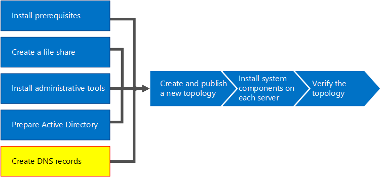

# Crear registros DNS para Skype para Business ServerCreate DNS records for Skype for Business Server
 
**Resumen:** Obtenga información sobre cómo configurar DNS y crear registros DNS para una instalación de Skype para Business Server.**Summary:** Learn how to configure DNS and create DNS records for an installation of Skype for Business Server. Descargue una versión de prueba gratuita de Skype para Business Server desde el Evaluation de Microsoft center en: [https://www.microsoft.com/evalcenter/evaluate-skype-for-business-server](https://www.microsoft.com/evalcenter/evaluate-skype-for-business-server).Download a free trial of Skype for Business Server from the Microsoft Evaluation center at: [https://www.microsoft.com/evalcenter/evaluate-skype-for-business-server](https://www.microsoft.com/evalcenter/evaluate-skype-for-business-server).
  
Para Skype para Business Server funcione correctamente, debe ser un número de configuración del sistema de nombres de dominio (DNS) en su lugar.For Skype for Business Server to work properly, a number of Domain Name System (DNS) settings must be in place. Esto es para que los clientes saben cómo tener acceso a los servicios y los servidores se conocen entre sí.This is so that clients know how to access the services and that the servers know about each other. Estas opciones de configuración deben realizarse solo una vez por cada implementación debido a que una vez asigne una entrada DNS, que está disponible en todo el dominio.These settings need to be completed only once per deployment because once you assign a DNS entry, it is available throughout the domain. Se pueden realizar los pasos del 1 al 5 en cualquier orden.You can do steps 1 through 5 in any order. Sin embargo, debe realizar los pasos 6, 7 y 8 en orden y después de los pasos del 1 al 5, tal como se indica en el diagrama.However, you must do steps 6, 7, and 8 in order, and after steps 1 through 5, as outlined in the diagram. Creación de registros DNS comprende las tareas paso 5 de 8.Creating DNS records comprises step 5 of 8. Para obtener más información acerca de la planeación de DNS, vea [requisitos de entorno para Skype para Business Server](../../plan-your-deployment/requirements-for-your-environment/environmental-requirements.md) o [requisitos de servidor para Skype para Business Server 2019](../../../SfBServer2019/plan/system-requirements.md).For more information about planning DNS, see [Environmental requirements for Skype for Business Server](../../plan-your-deployment/requirements-for-your-environment/environmental-requirements.md) or [Server requirements for Skype for Business Server 2019](../../../SfBServer2019/plan/system-requirements.md).
  
> [!IMPORTANT]
> Conviene aclarar que lo recogido aquí es un ejemplo de cómo crear registros de DNS en un entorno DNS de Windows Server.It is important to note that this is just an example of how to create DNS records in a Windows Server DNS environment. Hay muchas otras entradas DNS que se requieren para Skype para Business Server y el procedimiento para la creación de registros DNS depende el sistema que se usa para administrar DNS en la organización.There are many other DNS entries that are required for Skype for Business Server, and the procedure for creating DNS records depends on the system you are using to manage DNS in your organization. Para obtener una lista completa de requisitos de DNS, vea [requisitos de DNS para Skype para Business Server](../../plan-your-deployment/network-requirements/dns.md).For a complete list of requirements for DNS, see [DNS requirements for Skype for Business Server](../../plan-your-deployment/network-requirements/dns.md). 
  

  
## Configurar el DNSConfigure DNS

Registros DNS son necesarios para Skype para Business Server funcionen correctamente y ser accesible para los usuarios.DNS records are required for Skype for Business Server to work properly and be accessible by users.
  
En este ejemplo usamos un FQDN con equilibrio de carga de DNS llamado pool.contoso.local.This example is using a DNS load balanced FQDN named pool.contoso.local. Este grupo de servidores consta de tres servidores que ejecutan Skype para Business Server Enterprise Edition.This pool consists of three servers running Skype for Business Server Enterprise Edition. Un servidor front-end Standard Edition puede contener solamente un servidor.A Standard Edition front-end server can only contain a single server. Si usáramos Standard Edition, solo podríamos usar el nombre de dominio completo (FQDN) del único servidor Standard Edition al hacer referencia al rol front-end, en vez de crear un grupo de servidores con equilibrio de carga de DNS, como refleja este ejemplo.By using Standard Edition, you would only use the fully qualified domain name (FQDN) of the single Standard Edition server when referencing the front-end role instead of creating a DNS load balanced pool of servers, as this example shows. Este ejemplo sencillo, en el que usamos el rol front-end, incluye las entradas de DNS recogidas en la siguiente tabla.This simple example that uses only the front-end role includes the DNS entries in the following table. Para planear los requisitos de DNS específicos, vea [requisitos de DNS para Skype para Business Server](../../plan-your-deployment/network-requirements/dns.md).To plan your specific DNS requirements, see [DNS requirements for Skype for Business Server](../../plan-your-deployment/network-requirements/dns.md). 
  
 
|**Descripción****Description**|**Tipo de registro****Record type**|**Nombre.****Name**|**Se resuelve en****Resolves to**|**Tipo de equilibrio de carga****Load balancing type**|
|:-----|:-----|:-----|:-----|:-----|
|FQDN de servicios web internosInternal Web Services FQDN    |AA    |webint.contoso.localwebint.contoso.local    |VIP para los servicios web internosVIP for Internal Web Services    |Software y hardware compatiblesSupported software and hardware    |
|FQDN del grupo de servidoresPool FQDN    |AA    |pool.contoso.localpool.contoso.local    |Dirección IP del servidor SFB01IP address of server SFB01    |DNSDNS    |
|FQDN de SFB01SFB01 FQDN    |AA    |SFB01.contoso.localSFB01.contoso.local    |Dirección IP del servidor SFB01IP address of server SFB01    |DNSDNS    |
|FQDN del grupo de servidoresPool FQDN    |AA    |pool.contoso.localpool.contoso.local    |Dirección IP del servidor SFB02IP address of server SFB02    |DNSDNS    |
|FQDN de SFB02SFB02 FQDN    |AA    |SFB02.contoso.localSFB02.contoso.local    |Dirección IP del servidor SFB02IP address of server SFB02    |DNSDNS    |
|FQDN del grupo de servidoresPool FQDN    |AA    |pool.contoso.localpool.contoso.local    |Dirección IP del servidor SFB03IP address of server SFB03    |DNSDNS    |
|FQDN de SFB03SFB03 FQDN    |AA    |SFB03.contoso.localSFB03.contoso.local    |Dirección IP del servidor SFB03IP address of server SFB03    |DNSDNS    |
|Detección automática de Skype EmpresarialSkype for Business Auto Discover    |AA    |lyncdiscoverinternal.contoso.locallyncdiscoverinternal.contoso.local    |VIP para los servicios web internosVIP for Internal Web Services    |Software y hardware compatiblesSupported software and hardware    |
|URL sencilla de reuniónMeeting Simple URL    |AA    |Meet.contoso.localmeet.contoso.local    |VIP para los servicios web internosVIP for Internal Web Services    |Software y hardware compatiblesSupported software and hardware    |
|URL sencilla de marcadoDial-in Simple URL    |AA    |dialin.contoso.localdialin.contoso.local    |VIP para los servicios web internosVIP for Internal Web Services    |Software y hardware compatiblesSupported software and hardware    |
|Dirección URL del Programador webWeb Scheduler Simple URL    |AA    |Scheduler.contoso.localscheduler.contoso.local    |VIP para los servicios web internosVIP for Internal Web Services    |Software y hardware compatiblesSupported software and hardware    |
|URL sencilla de administraciónAdministration Simple URL    |AA    |Admin.contoso.localadmin.contoso.local    |VIP para los servicios web internosVIP for Internal Web Services    |Software y hardware compatiblesSupported software and hardware    |
|Detección heredadaLegacy Discovery    |SRVSRV    |_sipinternaltls._tcp.contoso.local_sipinternaltls._tcp.contoso.local    |FQDN del grupo de servidores (puerto 5061)Pool FQDN (port 5061)    |N/DN/A    |
   
### Crear registros de DNSCreate DNS records

1. Inicie sesión en el servidor DNS y abra el **Administrador de servidores**.Log on to the DNS server, and open **Server Manager**.
    
2. Haga clic en el menú desplegable **Herramientas** y en **DNS**.Click the **Tools** drop-down menu, and click **DNS**.
    
3. En el árbol de consola de su dominio SIP, expanda **Zonas de búsqueda directa**y, a continuación, expanda el dominio SIP en el que se va a instalar Skype para Business Server.In the console tree for your SIP domain, expand **Forward Lookup Zones**, and then expand the SIP domain in which Skype for Business Server will be installed.
    
4. Haga clic con el botón secundario en el dominio SIP y seleccione **Host nuevo (A o AAAA)**, como se muestra en la figura.Right-click the SIP domain, and select **New Host (A or AAAA)**, as shown in the figure.
    
     
  
5. En el cuadro **Nombre**, escriba el nombre del registro de host (el nombre de dominio se anexará automáticamente).In the **Name** box, type the name of the host record (the domain name will be automatically appended).
    
6. En el **cuadro Dirección IP**, escriba la dirección IP del servidor front-end individual y, luego, seleccione **Crear registro del puntero (PTR) asociado** o **Permitir a cualquier usuario autenticado actualizar registros de DNS con el mismo nombre de propietario**, si corresponde. Tenga en cuenta que esto presupone que se utiliza DNS para equilibrar la carga de todo el tráfico con excepción de los servicios web. En este ejemplo, se dispone de tres servidores front-end como se muestra en la tabla.In the **IP Address box**, type the IP address of the individual front-end server, and then select **Create associated pointer (PTR) record** or **Allow any authenticated user to update DNS records with the same owner name**, if applicable. Note that this assumes that DNS is used to load balance all traffic with the exception of web services. In this example, we have three front-end servers as shown in the table.
    
   |**Nombre del servidor****Server Name**|**Tipo****Type**|**Datos****Data**|
   |:-----|:-----|:-----|
   |SFB01SFB01    |Host (A)Host (A)    |10.0.0.510.0.0.5    |
   |SFB02SFB02    |Host (A)Host (A)    |10.0.0.610.0.0.6    |
   |SFB03SFB03    |Host (A)Host (A)    |10.0.0.710.0.0.7    |
   
7. Tras esto, cree las entradas de equilibrio de carga de DNS del grupo de servidores.Next, create the DNS load balancing entries for the pool. El equilibrio de carga de DNS permite a DNS enviar solicitudes a servidores individuales del grupo y usar el mismo nombre de grupo de DNS.DNS load balancing allows DNS to send requests to the individual servers in the pool while using the same DNS pool name. Para obtener más información acerca de DNS y el equilibrio de carga, vea [requisitos de DNS para Skype para Business Server](../../plan-your-deployment/network-requirements/dns.md).For more information about DNS and load balancing, see [DNS requirements for Skype for Business Server](../../plan-your-deployment/network-requirements/dns.md). 
    
    > [!NOTE]
    > La opción de agrupar varios servidores solo se encuentra disponible en las implementaciones Enterprise Edition. Si está implementando un único servidor Enterprise o Standard Edition, necesita crear solo un registro A para el único servidor.Pooling multiple servers together is available only in Enterprise Edition deployments. If you are deploying a single Enterprise Server or Standard Edition server, you need to create only an A record for the single server. 
  
    Por ejemplo, si tiene un grupo denominado pool.contoso.local y tres servidores front-end, será necesario crear las siguientes entradas de DNS:For example, if you had a pool named pool.contoso.local and three front-end servers, you would create the following DNS entries:
    
   |**FQDN****FQDN**|**Tipo****Type**|**Datos****Data**|
   |:-----|:-----|:-----|
   |pool.contoso.localpool.contoso.local    |Host (A)Host (A)    |10.0.0.510.0.0.5    |
   |pool.contoso.localpool.contoso.local    |Host (A)Host (A)    |10.0.0.610.0.0.6    |
   |pool.contoso.localpool.contoso.local    |Host (A)Host (A)    |10.0.0.710.0.0.7    |
   
8. Continúe con la creación de los registros A para todos los servidores en la implementación planificada.Continue creating A records for all servers in the planned deployment. 
    
9. Para crear el registro del registro de servicios (SRV) para la detección heredada, haga clic con el botón secundario en el dominio SIP y seleccione **Otros registros nuevos**.To create the service record (SRV) record for legacy discovery, right-click the SIP domain, and select **Other New Records**.
    
10. En **Seleccione el tipo de registro del recurso**, haga clic en **Ubicación de servicio (SRV)** y, luego, haga clic en **Crear registro**.In **Select a resource record type**, click **Service Location (SRV)**, and then click **Create Record**.
    
11. Haga clic en **Servicio** y escriba **_sipinternaltls**.Click **Service**, and then type **_sipinternaltls**.
    
12. Haga clic en **Protocolo** y, luego, escriba **_tcp**.Click **Protocol**, and then type **_tcp**.
    
13. Haga clic en **Número de puerto** y, luego, escriba **5061**.Click **Port Number**, and then type **5061**.
    
14. Haga clic en **Host que ofrece este servicio** y, luego, escriba el FQDN del grupo de servidores o del servidor Standard Edition.Click **Host offering this service**, and then type the FQDN of the pool or Standard Edition server.
    
     
  
15. Haga clic en **Aceptar** y, luego, haga clic en **Listo**.Click **OK**, and then click **Done**.
    
### Comprobar los registros de DNSVerify DNS records

1. Inicie sesión en un equipo cliente del dominio con una cuenta que sea miembro del grupo Usuarios autenticados o que tenga permisos equivalentes.Log on to a client computer in the domain with an account that is a member of the Authenticated Users group or has equivalent permissions.
    
2. Haga clic en **Iniciar**, escriba **cmd** y presione Entrar.Click **Start**, and then type **cmd**, and press Enter.
    
3. Tipo de **nslookup \<FQDN del grupo de servidores Front-End\> ** o ** \<FQDN del servidor Standard Edition o servidor Enterprise Edition único\>**, y presione ENTRAR.Type **nslookup \<FQDN of the Front End pool\>** or **\<FQDN of the Standard Edition server or single Enterprise Edition server\>**, and press Enter.
    
4. Continúe con la comprobación del resto de los registros A para la implementación.Continue to verify the rest of the A records for your deployment.
    
5. Si admite clientes heredados y creó el registro SRV, compruébelo al escribir **set type=srv** en el símbolo del sistema **nslookup** y, luego, presione Entrar.If you are supporting legacy clients and created the SRV record, verify it by typing **set type=srv** at the **nslookup** prompt, and then press Enter.
    
6. Escriba **_sipinternaltls._tcp. *dominio* ** (por ejemplo, _sipinternaltls._tcp.contoso.local), y, a continuación, presione ENTRAR.Type **_sipinternaltls._tcp. *domain*** (for example, _sipinternaltls._tcp.contoso.local), and then press Enter.
    
7. El resultado que obtenga necesita parecerse al de la figura. Recuerde que el resultado de ejemplo no recoge todos los registros de DNS, pero todos ellos necesitan comprobarse.The expected output should be similar to that shown in the figure. Note that not all DNS records are shown in the sample output, but all records should be verified. 
    
     
  

