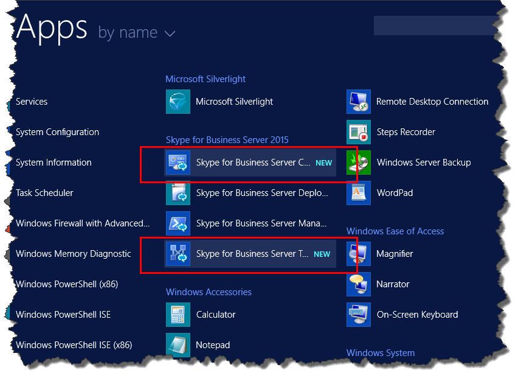

# Instalar las herramientas administrativas en Skype para Business ServerInstall administrative tools in Skype for Business Server
 
**Resumen:** Obtenga información sobre cómo instalar las herramientas administrativas necesarias para una instalación de Skype para el servidor empresarial.**Summary:** Learn how to install the administrative tools required for an installation of Skype for Business Server. Descargue una versión de prueba gratuita de Skype para Business Server desde el Evaluation de Microsoft center en: [https://www.microsoft.com/evalcenter/evaluate-skype-for-business-server](https://www.microsoft.com/evalcenter/evaluate-skype-for-business-server).Download a free trial of Skype for Business Server from the Microsoft Evaluation center at: [https://www.microsoft.com/evalcenter/evaluate-skype-for-business-server](https://www.microsoft.com/evalcenter/evaluate-skype-for-business-server).
  
Las herramientas administrativas de incluyen el generador de topología y en el Panel de Control.The administrative tools include Topology Builder and the Control Panel. Las herramientas administrativas de deben instalarse en al menos un servidor en la topología o en una estación de trabajo de administración de 64 bits que ejecuta una versión de sistema operativo de Windows que es compatible con Skype para Business Server.The administrative tools must be installed on at least one server in the topology or a 64-bit management workstation running a Windows OS version that is supported for Skype for Business Server. Se pueden realizar los pasos del 1 al 5 en cualquier orden.You can do steps 1 through 5 in any order. Sin embargo, debe realizar los pasos 6, 7 y 8 en orden y después de los pasos del 1 al 5, tal como se indica en el diagrama.However, you must do steps 6, 7, and 8 in order, and after steps 1 through 5, as outlined in the diagram. Instalar las herramientas administrativas es el paso 3 de 8.Installing the administrative tools is step 3 of 8.
  

  
## Instalar Skype para herramientas administrativas de Business ServerInstall Skype for Business Server administrative tools

Los medios de instalación de Skype para Business Server proporcionan una experiencia flexible.The installation media for Skype for Business Server provides a flexible experience. Cuando ejecuta Setup.exe por primera vez, instaladas las herramientas de sólo son el Skype para el Asistente para la implementación de servidor de negocio y la Skype para Shell de administración de servidor empresarial.When you first run Setup.exe, the only tools installed are the Skype for Business Server Deployment Wizard and the Skype for Business Server Management Shell. Mediante el uso de estas dos herramientas, conocidas como los componentes principales, puede continuar con el proceso de instalación, pero no proporcionan la funcionalidad principal para el Skype general para el entorno de servidor empresarial.By using these two tools, known as Core Components, you can continue with the installation process, but they do not provide primary functionality for the overall Skype for Business Server environment. El Asistente para la implementación se inicia automáticamente después de instalar los componentes principales.The Deployment Wizard launches automatically after you install the Core Components. La sección del Asistente para la implementación titulada **Instalar las herramientas administrativas** instala Skype para Business Server Topology Builder y Skype para el Panel de Control de servidor empresarial.The section of the Deployment Wizard titled **Install Administrative Tools** installs Skype for Business Server Topology Builder and Skype for Business Server Control Panel.
  
> [!IMPORTANT]
> Cada Skype para entorno Business Server debe tener al menos un servidor con las herramientas administrativas instaladas.Every Skype for Business Server environment must have at least one server with the administrative tools installed. 
  
Vea los pasos del vídeo para **Instalar herramientas administrativas**:Watch the video steps for **Install administrative tools**:
  
> [!video https://www.microsoft.com/en-us/videoplayer/embed/99a5c436-963b-4eed-b423-651568c87cb1?autoplay=false]
  
### Instalar Skype para herramientas administrativas de Business Server desde el Asistente para la implementaciónInstall Skype for Business Server administrative tools from the Deployment Wizard

1. Inserte el Skype para los medios de instalación de Business Server.Insert the Skype for Business Server installation media. Si la configuración no empieza automáticamente, haga doble clic en **Configuración**.If the setup does not automatically begin, double-click **Setup**.
    
2. La ejecución del disco de instalación necesita Microsoft Visual C++. Aparecerá un cuadro de diálogo preguntándole si quiere instalarlo. Haga clic en **Sí**.The installation media requires Microsoft Visual C++ to run. A dialog box will pop up asking if you want to install it. Click **Yes**.
    
3. Mediante el uso del programa de instalación inteligente, una nueva característica de Skype para Business Server, puede conectarse a Internet para comprobar las actualizaciones durante el proceso de instalación.By using Smart Setup, a new feature in Skype for Business Server, you can connect to the Internet to check for updates during the installation process. Esto proporciona una mejor experiencia, ya que se asegura de que dispone de las actualizaciones más recientes del producto en el momento de la instalación.This provides a better experience by making sure you have the most recent updates to the product at installation. Haga clic en **Instalar** para empezar la instalación.Click **Install** to begin the installation.
    
4. Revise cuidadosamente el contrato de licencia y, si está de acuerdo, elija **Acepto los términos del Contrato de licencia** y haga clic en **Aceptar**.Carefully review the License Agreement, and if you agree, select **I accept the terms in the license agreement**, and click **OK**.
    
5. El Skype para los componentes principales de Business Server se instalará en el servidor.The Skype for Business Server Core Components will be installed on the server. 
    
    Estos componentes incluyen lo siguiente, como se muestra en la figura.The Core Components consist of the following, as shown in the figure.
    
    
  
  - **Skype para el Asistente para la implementación de servidor de negocio** Un programa de implementación que proporciona un panel de inicio para la instalación de los diversos componentes de Skype para Business Server.**Skype for Business Server Deployment Wizard** A deployment program that provides a launch pad for installing the various components of Skype for Business Server.
    
  - **Skype para Shell de administración de servidor empresarial** Un programa de PowerShell preconfigurado que permite la administración de Skype para Business Server.**Skype for Business Server Management Shell** A preconfigured PowerShell program that allows for administration of Skype for Business Server.
    
    Una vez finalizada la instalación de los componentes principales, se iniciará automáticamente la Skype para el Asistente para la implementación de servidor de negocio, tal como se muestra en la figura.Once the installation of the Core Components is complete, the Skype for Business Server Deployment Wizard will automatically launch, as shown in the figure. 
    
    
  
6. Además de los componentes principales, también tendrá que instalar Skype para Business Server Topology Builder y Skype para Panel de Control de servidor empresarial en al menos un servidor en el entorno.In addition to the Core Components, you will also need to install Skype for Business Server Topology Builder and Skype for Business Server Control Panel on at least one server in the environment. Haga clic en **Instalar herramientas administrativas** en el Asistente para la implementación.Click **Install Administrative Tools** on the Deployment Wizard.
    
7. Haga clic en **Siguiente** para empezar la instalación.Click **Next** to begin the installation.
    
8. Una vez que se completa la instalación, haga clic en **Finalizar**. Ahora, como se ve en la figura, se agregan las herramientas administrativas en el servidor.Once the installation has completed, click **Finish**. The administrative tools are now added to the server, as shown in the figure.
    
    
  
   - **Skype para Business Server Topology Builder** Un programa que se utiliza para crear, implementar y administrar las topologías.**Skype for Business Server Topology Builder** A program used to build, deploy, and manage topologies.
    
   - **Skype para el Panel de Control de servidor empresarial** Un programa que se utiliza para la instalación.**Skype for Business Server Control Panel** A program used to administer the installation.
    

