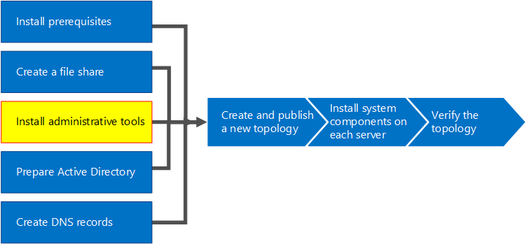

# Instalar herramientas administrativas en Skype Empresarial Server 2015Install administrative tools in Skype for Business Server 2015
 
**Summary:** Learn how to install the administrative tools required for an installation of Skype for Business Server 2015.**Summary:** Learn how to install the administrative tools required for an installation of Skype for Business Server 2015. Download a free trial of Skype for Business Server 2015 from the Microsoft Evaluation center at: [https://www.microsoft.com/evalcenter/evaluate-skype-for-business-server](https://www.microsoft.com/evalcenter/evaluate-skype-for-business-server).Download a free trial of Skype for Business Server 2015 from the Microsoft Evaluation center at: [https://www.microsoft.com/evalcenter/evaluate-skype-for-business-server](https://www.microsoft.com/evalcenter/evaluate-skype-for-business-server).
  
The administrative tools include Topology Builder and the Control Panel.The administrative tools include Topology Builder and the Control Panel. The administrative tools must be installed on at least one server in the topology or a 64-bit management workstation running a Windows OS version that is supported for Skype for Business Server.The administrative tools must be installed on at least one server in the topology or a 64-bit management workstation running a Windows OS version that is supported for Skype for Business Server. You can do steps 1 through 5 in any order.You can do steps 1 through 5 in any order. However, you must do steps 6, 7, and 8 in order, and after steps 1 through 5, as outlined in the diagram.However, you must do steps 6, 7, and 8 in order, and after steps 1 through 5, as outlined in the diagram. Installing the administrative tools is step 3 of 8.Installing the administrative tools is step 3 of 8.
  

  
## Install Skype for Business Server 2015 administrative toolsInstall Skype for Business Server 2015 administrative tools

The installation media for Skype for Business Server 2015 provides a flexible experience.The installation media for Skype for Business Server 2015 provides a flexible experience. When you first run Setup.exe, the only tools installed are the Skype for Business Server Deployment Wizard and the Skype for Business Server Management Shell.When you first run Setup.exe, the only tools installed are the Skype for Business Server Deployment Wizard and the Skype for Business Server Management Shell. By using these two tools, known as Core Components, you can continue with the installation process, but they do not provide primary functionality for the overall Skype for Business Server environment.By using these two tools, known as Core Components, you can continue with the installation process, but they do not provide primary functionality for the overall Skype for Business Server environment. El Asistente para la implementación se inicia automáticamente después de instalar los componentes principales.The Deployment Wizard launches automatically after you install the Core Components. The section of the Deployment Wizard titled **Install Administrative Tools** installs Skype for Business Server Topology Builder and Skype for Business Server Control Panel.The section of the Deployment Wizard titled **Install Administrative Tools** installs Skype for Business Server Topology Builder and Skype for Business Server Control Panel.
  
> [!IMPORTANT]
> Every Skype for Business Server environment must have at least one server with the administrative tools installed.Every Skype for Business Server environment must have at least one server with the administrative tools installed. 
  
Vea los pasos del vídeo para **Instalar herramientas administrativas**:Watch the video steps for **Install administrative tools**:
  
> [!video https://www.microsoft.com/en-us/videoplayer/embed/99a5c436-963b-4eed-b423-651568c87cb1?autoplay=false]
  
### Install Skype for Business Server 2015 administrative tools from the Deployment WizardInstall Skype for Business Server 2015 administrative tools from the Deployment Wizard

1. Insert the Skype for Business Server 2015 installation media.Insert the Skype for Business Server 2015 installation media. Si la configuración no empieza automáticamente, haga doble clic en **Configuración**.If the setup does not automatically begin, double-click **Setup**.
    
2. La ejecución del disco de instalación necesita Microsoft Visual C++. Aparecerá un cuadro de diálogo preguntándole si quiere instalarlo. Haga clic en **Sí**.The installation media requires Microsoft Visual C++ to run. A dialog box will pop up asking if you want to install it. Click **Yes**.
    
3. By using Smart Setup, a new feature in Skype for Business Server 2015, you can connect to the Internet to check for updates during the installation process.By using Smart Setup, a new feature in Skype for Business Server 2015, you can connect to the Internet to check for updates during the installation process. Esto proporciona una mejor experiencia, ya que se asegura de que dispone de las actualizaciones más recientes del producto en el momento de la instalación.This provides a better experience by making sure you have the most recent updates to the product at installation. Haga clic en **Instalar** para empezar la instalación.Click **Install** to begin the installation.
    
4. Revise cuidadosamente el contrato de licencia y, si está de acuerdo, elija **Acepto los términos del Contrato de licencia** y haga clic en **Aceptar**.Carefully review the License Agreement, and if you agree, select **I accept the terms in the license agreement**, and click **OK**.
    
5. The Skype for Business Server 2015 Core Components will be installed on the server.The Skype for Business Server 2015 Core Components will be installed on the server. 
    
    Estos componentes incluyen lo siguiente, como se muestra en la figura.The Core Components consist of the following, as shown in the figure.
    
    
  
  - **Skype for Business Server 2015 Deployment Wizard** A deployment program that provides a launch pad for installing the various components of Skype for Business Server 2015.**Skype for Business Server 2015 Deployment Wizard** A deployment program that provides a launch pad for installing the various components of Skype for Business Server 2015.
    
  - **Skype for Business Server 2015 Management Shell** A preconfigured PowerShell program that allows for administration of Skype for Business Server 2015.**Skype for Business Server 2015 Management Shell** A preconfigured PowerShell program that allows for administration of Skype for Business Server 2015.
    
    Once the installation of the Core Components is complete, the Skype for Business Server 2015 Deployment Wizard will automatically launch, as shown in the figure.Once the installation of the Core Components is complete, the Skype for Business Server 2015 Deployment Wizard will automatically launch, as shown in the figure. 
    
    
  
6. In addition to the Core Components, you will also need to install Skype for Business Server 2015 Topology Builder and Skype for Business Server 2015 Control Panel on at least one server in the environment.In addition to the Core Components, you will also need to install Skype for Business Server 2015 Topology Builder and Skype for Business Server 2015 Control Panel on at least one server in the environment. Haga clic en **Instalar herramientas administrativas** en el Asistente para la implementación.Click **Install Administrative Tools** on the Deployment Wizard.
    
7. Haga clic en **Siguiente** para empezar la instalación.Click **Next** to begin the installation.
    
8. Una vez que se completa la instalación, haga clic en **Finalizar**. Ahora, como se ve en la figura, se agregan las herramientas administrativas en el servidor.Once the installation has completed, click **Finish**. The administrative tools are now added to the server, as shown in the figure.
    
    
  
   - **Skype for Business Server 2015 Topology Builder** A program used to build, deploy, and manage topologies.**Skype for Business Server 2015 Topology Builder** A program used to build, deploy, and manage topologies.
    
   - **Skype for Business Server 2015 Control Panel** A program used to administer the installation.**Skype for Business Server 2015 Control Panel** A program used to administer the installation.
    

