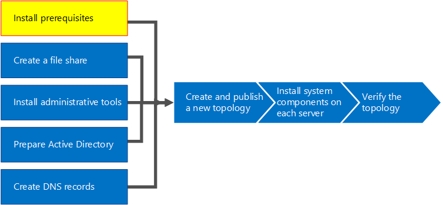

# Instalar requisitos previos para Skype Empresarial ServerInstall prerequisites for Skype for Business Server
 
**Resumen:** Obtenga información sobre los servidores y los roles de servidor que debe configurar antes de instalar Skype Empresarial Server.**Summary:** Learn about the servers and server roles you must configure before you install Skype for Business Server. Descargue una versión de prueba gratuita de Skype Empresarial Server desde el Centro [de evaluación de Microsoft.](https://www.microsoft.com/evalcenter/evaluate-skype-for-business-server)Download a free trial of Skype for Business Server from the [Microsoft Evaluation center](https://www.microsoft.com/evalcenter/evaluate-skype-for-business-server).
  
La instalación de requisitos previos consiste en configurar Windows Server instalando los roles y características necesarios en cada uno de los servidores de la topología.Installing prerequisites consists of setting up Windows Server by installing the required roles and features on each of the servers in the topology. Los requisitos se basan en el rol que el servidor cumplirá en la topología.The requirements are based on the role the server will fulfill in the topology. Puede realizar los pasos del 1 al 5 en cualquier orden.You can do steps 1 through 5 in any order. Sin embargo, debe realizar los pasos 6, 7 y 8 en orden y después de los pasos 1 a 5, tal como se indica en el diagrama.However, you must do steps 6, 7, and 8 in order, and after steps 1 through 5, as outlined in the diagram. La instalación de requisitos previos es el paso 1 de 8.Installing prerequisites is step 1 of 8.
  

  
## Configurar Windows ServerSetup Windows Server

Skype Empresarial Server requiere el sistema operativo Windows Server y una serie de requisitos previos para poder instalarse.Skype for Business Server requires the Windows Server operating system and a number of prerequisites before it can be installed. Para obtener más información sobre la planeación de requisitos previos, consulte [Requisitos del servidor para Skype Empresarial Server.](../../../SfBServer2019/plan/system-requirements.md)For details on planning for prerequisites, see [Server requirements for Skype for Business Server](../../../SfBServer2019/plan/system-requirements.md). 
  
> [!TIP]
> Este procedimiento usa Windows Server 2012 R2.This procedure uses Windows Server 2012 R2. Si usa una versión diferente de Windows Server, el procedimiento puede ser ligeramente diferente.If you are using a different version of Windows Server, the procedure might be slightly different. 
  
> [!IMPORTANT]
> Antes de empezar, asegúrate de que Windows Server esté actualizado mediante Windows Update.Before you begin, make sure that Windows Server is up-to-date by using Windows Update. 
  

  
Vea los pasos de vídeo para **los requisitos previos de instalación:**Watch the video steps for **install prerequisites**:
  
> [!video https://www.microsoft.com/videoplayer/embed/02447c2a-5b26-432f-aad6-b9b05cc93478?autoplay=false]
  
### Instalar las funciones y características necesarias para los servidores front-endInstall required roles and features for front-end servers

Puede instalar los roles y características necesarios con el Administrador del servidor.You can install the required roles and features using Server Manager. 
    
1. Instale las características de software de requisitos previos que se enumeran [en Los requisitos del servidor para Skype Empresarial Server.](../../../SfBServer2019/plan/system-requirements.md)Install the prerequisite software features listed in [Server requirements for Skype for Business Server](../../../SfBServer2019/plan/system-requirements.md). El software necesario debe estar en el servidor que ejecutará Skype Empresarial Server.The required software must be on the server that will run Skype for Business Server.
    
    > [!CAUTION]
    > Windows Server 2012 R2 no instala todos los archivos de origen para las características necesarias de forma predeterminada.Windows Server 2012 R2 does not install all of the source files for the required features by default. Si el servidor no está conectado a Internet, deberá insertar los medios de Windows  Server 2012 R2 y seleccionar Especificar una ruta de origen alternativa para instalar las características necesarias.If the server is not connected to the Internet, you will need to insert the Windows Server 2012 R2 media and select **Specify an alternate source path** in order to install the required features. Los archivos de origen se encuentran en el directorio sources\sxs.The source files are located in the sources\sxs directory. Por ejemplo, si los medios de Windows Server 2012 R2 están en la unidad D, se establecería la ruta de acceso en `d:\sources\sxs` .For example, if the Windows Server 2012 R2 media is in drive D, you would set the path to `d:\sources\sxs`. Es importante que tenga las actualizaciones más recientes de Windows Update.It is important that you have the latest updates from Windows Update. Si no está conectado a Internet, deberá instalar manualmente todas las actualizaciones relevantes, así como los requisitos previos de las actualizaciones necesarias.If you are not connected to the Internet, you will need to manually install all relevant updates as well as any prerequisites to the required updates. 
  
1. Cuando el cuadro de diálogo indique que la instalación se ha completado, deberá reiniciar el servidor para completar el proceso.When the dialog box indicates that the installation has completed, you will need to reboot the server to complete the process.
    
1. Ejecute **Windows Update de** nuevo para comprobar si hay actualizaciones de los roles y servicios que se instalaron.Run **Windows Update** again to check if there are any updates to the roles and services that were installed.
    
1. Si va a usar el Panel de control de Skype Empresarial Server en este servidor, también debe instalar Silverlight.If you will be using Skype for Business Server Control Panel on this server then you must also install Silverlight. Para instalar Silverlight, vea [Microsoft Silverlight](https://www.microsoft.com/silverlight/).To install Silverlight, see [Microsoft Silverlight](https://www.microsoft.com/silverlight/).

> [!IMPORTANT]
> Los requisitos previos para los servidores que realizan funciones que no son el servidor front-end, como el rol de director, chat persistente o servidor perimetral, tienen sus propios requisitos previos.The prerequisites for servers performing roles other than front-end server, such as the role of Director, Persistent Chat, or Edge, have their own prerequisites. Para obtener más información sobre los requisitos previos exactos requeridos por cada tipo de servidor, consulte Requisitos del [servidor para Skype Empresarial Server.](../../../SfBServer2019/plan/system-requirements.md)For details on the exact prerequisites required by each server type, see [Server requirements for Skype for Business Server](../../../SfBServer2019/plan/system-requirements.md). 
  

