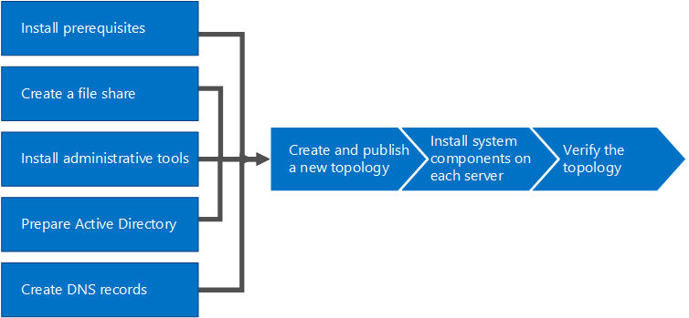

# Instalar Skype Empresarial ServerInstall Skype for Business Server
 
**Resumen:** Obtenga información sobre cómo preparar el entorno para una instalación de Skype empresarial Server.**Summary:** Learn how to prepare your environment for an installation of Skype for Business Server. Descargue una prueba gratuita de Skype empresarial Server en el centro de evaluación de Microsoft en[https://www.microsoft.com/evalcenter/evaluate-skype-for-business-server](https://www.microsoft.com/evalcenter/evaluate-skype-for-business-server):.Download a free trial of Skype for Business Server from the Microsoft Evaluation center at:[https://www.microsoft.com/evalcenter/evaluate-skype-for-business-server](https://www.microsoft.com/evalcenter/evaluate-skype-for-business-server).
  
Este artículo le guiará a través de una instalación de ejemplo de Skype empresarial Server.This article walks you through an example installation of Skype for Business Server. En este artículo no se trata de tratar todos los procedimientos que necesita para realizar una instalación completa de Skype empresarial Server.This article does not attempt to cover all of the procedures you need to perform a full Skype for Business Server installation. El objetivo es proporcionar procedimientos de ejemplo en una topología estrechamente definida que incluya funcionalidad básica para reunirse y compartir.The goal is to provide example procedures in a narrowly defined topology that includes basic meet-and-share functionality.
  
## Información general del proceso de instalación de Skype empresarial ServerOverview of the install process for Skype for Business Server

Una instalación de Skype empresarial Server incluye muchos procedimientos diferentes.An installation of Skype for Business Server includes many different procedures. Los procedimientos que necesita para obtener Skype empresarial Server en su entorno dependen de las características específicas de su entorno.The procedures you need to get Skype for Business Server running in your environment depend on the specifics of your environment. Por ejemplo, si usa Windows Server para el DNS, le interesará conocer el procedimiento de ejemplo para agregar una entrada de DNS.For example, if you are using Windows Server for DNS, you will benefit from the example procedure for adding a DNS entry. Si usa otro sistema para DNS, será necesario seguir los procedimientos para ese sistema de DNS en concreto.If you use another system for DNS, you need to follow procedures for your particular DNS system. Lo mismo sucede para los demás procedimientos de esta sección.This is true for many of the procedures in this section.
  
Skype empresarial Server está disponible en Standard Edition y Enterprise Edition.Skype for Business Server is available in Standard Edition and Enterprise Edition. La principal diferencia es que Standard Edition no es compatible con las características de alta disponibilidad que se incluyen con Enterprise Edition.The main difference is that Standard Edition does not support the high availability features that are included with Enterprise Edition. 
  
Skype empresarial Server es un producto avanzado, y el proceso de instalación exacto depende de una gran cantidad de circunstancias específicas.Skype for Business Server is an advanced product, and the exact installation process depends a great deal on your specific circumstances. Esta sección le guiará a través de los pasos generales para instalar el producto.This section walks you through the general steps to install the product. Sin embargo, cada procedimiento puede ser diferente según el entorno y las decisiones de planeamiento.However, each procedure might be different depending on your environment and planning decisions. Por ejemplo, para las pequeñas organizaciones, un único servidor que ejecute Skype empresarial Server Standard Edition puede ser adecuado, mientras que una organización multinacional de gran tamaño puede tener 50 servidores en ubicaciones distintas del mundo dedicado al producto.For example, for small organizations a single server, running Skype for Business Server Standard Edition might be appropriate, whereas a large multinational organization might have 50 servers at locations around the world dedicated to the product.
  
> [!NOTE]
> Para obtener más información sobre las actualizaciones acumulativas más recientes, consulte [actualizaciones para Skype empresarial Server](https://support.microsoft.com/en-us/kb/3061064).To learn about the latest Cumulative Updates, see [Updates for Skype for Business Server](https://support.microsoft.com/en-us/kb/3061064). Después de instalar la revisión CU1, un administrador debe ejecutar `Update-CsAdminRole` el cmdlet.After installing the CU1 patch an administrator needs to execute the  `Update-CsAdminRole` cmdlet. Este cmdlet es necesario para acceder a los cmdlets de GCP nuevos en el PowerShell remoto.This cmdlet is required to access the new GCP cmdlets over Remote PowerShell.
  
> [!IMPORTANT]
> Los procedimientos en esta sección son un ejemplo en el que se asume que ya se han tomado decisiones específicas y que hay un conjunto de requisitos muy definidos.The procedures in this section serve as an example using a narrowly defined set of requirements and assume specific decisions have already been made. Los procedimientos reales que necesita para instalar Skype empresarial Server probablemente sean muy diferentes.The actual procedures you need to install Skype for Business Server will likely be very different. Use los procedimientos de esta sección solo como un ejemplo y no como una guía paso a paso para instalar Skype empresarial Server en cada entorno.Use the procedures in this section as an example only and not as a step-by-step guide for installing Skype for Business Server in every environment. 
  
Para que Skype empresarial Server se ejecute por primera vez, se necesitan ocho pasos principales.Getting Skype for Business Server up and running for the first time involves eight primary steps. Debe comprender que los procedimientos de ejemplo de esta sección no son los únicos procedimientos necesarios para instalar Skype empresarial Server.You should understand that the example procedures in this section are not the only procedures required for installing Skype for Business Server. Los ocho pasos siguientes son simplemente ejemplos que le ayudarán a comprender mejor el proceso general y a poner en marcha un entorno de trabajo básico.The following eight steps are simply examples to help you better understand the overall process and get a basic working environment up and running. Puede realizar los pasos 1 a 5 en cualquier orden.You can do steps 1 through 5 in any order. Sin embargo, debe realizar los pasos 6, 7 y 8 en orden, y después de los pasos 1 a 5, según se indica en el diagrama.However, you must do steps 6, 7, and 8 in order, and after steps 1 through 5, as outlined in the diagram. Los ocho pasos son:The eight steps are:
  

  
- [Instalar los requisitos previos de Skype empresarial Server](install-prerequisites.md) : Instale los requisitos previos en todos los servidores que componen la topología de servidor de Skype empresarial.[Install prerequisites for Skype for Business Server](install-prerequisites.md) : Install prerequisites on all servers that make up the Skype for Business Server topology. Tenga en cuenta que estos requisitos previos no son los mismos para todos los roles.Note that prerequisites are not the same for all roles. Por ejemplo, los servidores que suministran el rol front-end tienen un conjunto de requisitos previos distinto del de los servidores que proporcionan el rol de director.For example, servers that provide the front-end role have a set of prerequisites, and servers that provide a director role have a different set of prerequisites. Consulte la documentación de planeación de requisitos previos para más detalles.See prerequisite planning documentation for more details.
    
- [Crear un recurso compartido de archivos en Skype empresarial Server](create-a-file-share.md) : cree un recurso compartido de archivos que usarán los servidores en toda la topología de Skype empresarial Server.[Create a file share in Skype for Business Server](create-a-file-share.md) : Create a file share that will be used by servers throughout the Skype for Business Server topology.
    
- [Instalar herramientas administrativas en Skype empresarial Server](install-administrative-tools.md) : las herramientas administrativas incluyen el generador de topología y el panel de control.[Install administrative tools in Skype for Business Server](install-administrative-tools.md) : The administrative tools include Topology Builder and Control Panel. Debe instalar las herramientas administrativas en al menos un servidor de la topología o una estación de trabajo de administración de 64 bits que ejecute una versión de Windows del sistema operativo compatible con Skype empresarial Server.You must install the administrative tools on at least one server in the topology or a 64-bit management workstation running a Windows OS version that is supported for Skype for Business Server.
    
- [Preparar Active Directory para Skype empresarial Server](prepare-active-directory.md) : Skype empresarial Server funciona estrechamente con Active Directory.[Prepare Active Directory for Skype for Business Server](prepare-active-directory.md) : Skype for Business Server works closely with Active Directory. Debe preparar el dominio de Active Directory para que funcione con Skype empresarial Server.You must prepare the Active Directory domain to work with Skype for Business Server. Puede hacerlo mediante el Asistente para la implementación y solo se realiza una vez para el dominio.You can do this through the Deployment Wizard, and it is only done once for the domain. Esto se debe a que el proceso crea grupos y modifica el dominio, y solo necesita hacerlo una vez.This is because the process creates groups and modifies the domain, and you need to do that only once.
    
- [Crear registros DNS para Skype empresarial Server](create-dns-records.md) : para que Skype empresarial Server funcione correctamente, debe disponer de una serie de opciones de configuración de DNS.[Create DNS records for Skype for Business Server](create-dns-records.md) : In order for Skype for Business Server to work properly, a number of DNS settings must be in place. De este modo, los clientes sabrán cómo tener acceso a los servicios, mientras que los servidores podrán tener información de los demás servidores.This is so that clients know how to access the services and the servers know about each other. Esta configuración hay que realizarla una sola vez en cada implementación porque, una vez asignada una entrada de DNS, esta estará disponible en todo el dominio.These settings only need to be completed once per deployment because once you assign a DNS entry, it is available throughout the domain.
    
- [Crear y publicar una nueva topología en Skype empresarial Server](create-and-publish-new-topology.md) : antes de poder instalar el sistema de Skype empresarial Server en cada uno de los servidores de la topología, debe crear una topología y publicarla.[Create and publish new topology in Skype for Business Server](create-and-publish-new-topology.md) : Before you can install the Skype for Business Server system on each of the servers in the topology, you must create a topology and publish it. Cuando se publica una topología, se carga información relativa a ella en la base de datos del Almacén de administración central.When you publish a topology, you are loading the topology information into the Central Management Store database. Si se trata de un grupo de servidores Enterprise Edition, la base de datos del Almacén de administración central se creará la primera vez que se publique una topología nueva.If this is an Enterprise Edition pool, you are creating the Central Management Store database the first time you publish a new topology. Si es Standard Edition, será necesario ejecutar el proceso Preparar el primer servidor Standard Edition del Asistente para la implementación para poder publicar una topología.If this is Standard Edition, you need to run the Prepare First Standard Edition Server process from the Deployment Wizard before you publish a topology. Esto prepara a Standard Edition con la instalación de una instancia de SQL Server Express Edition y con la creación del Almacén de administración central.This prepares for Standard Edition by installing a SQL Server Express Edition instance and creating the Central Management Store.
    
- [Instalar Skype empresarial Server en servidores de la topología](install-skype-for-business-server.md) : una vez que se carga la topología en el almacén de administración central y Active Directory sabe qué servidores realizarán qué roles, debe instalar el sistema de Skype empresarial Server en cada uno de los servidores de la topología.[Install Skype for Business Server on servers in the topology](install-skype-for-business-server.md) : Once the topology is loaded into the Central Management Store and Active Directory knows which servers will perform which roles, you need to install the Skype for Business Server system on each of the servers in the topology.
    
- [Comprobar la topología en Skype empresarial Server](verify-the-topology.md) : después de haber publicado la topología y los componentes del sistema de Skype empresarial Server instalados en cada uno de los servidores de la topología, estará listo para comprobar que la topología funciona de la forma esperada.[Verify the topology in Skype for Business Server](verify-the-topology.md) : After you have the topology published and the Skype for Business Server system components installed on each of the servers in the topology, you are ready to verify that the topology is working as expected. Esto incluye comprobar que la configuración se propagó a todos los servidores de Active Directory para que todo el dominio sepa que Skype empresarial está disponible en el dominio.This includes verifying that the configuration has propagated out to all of the Active Directory servers so that the entire domain knows that Skype for Business is available in the domain.
    

