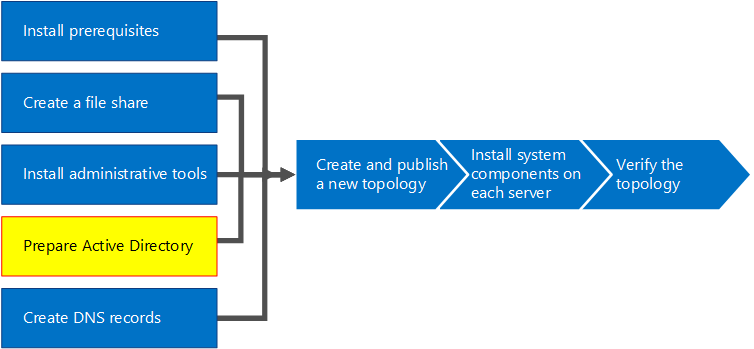
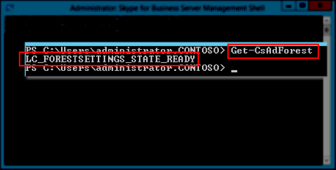

# <a name="prepare-active-directory-for-skype-for-business-server"></a>Preparar Active Directory para Skype empresarial Server
 
**Resumen:** Obtenga información sobre cómo preparar el dominio de Active Directory para una instalación de Skype empresarial Server. Descargue una prueba gratuita de Skype empresarial Server en el [centro de evaluación de Microsoft](https://www.microsoft.com/evalcenter/evaluate-skype-for-business-server).
  
Skype empresarial Server funciona estrechamente con Active Directory. Debe preparar el dominio de Active Directory para que funcione con Skype empresarial Server. Este proceso se realiza en el Asistente para la implementación y solo se realiza una vez para el dominio. Esto se debe a que el proceso crea grupos y modifica el dominio, y solo necesita hacerlo una vez. Puede realizar los pasos 1 a 5 en cualquier orden. Sin embargo, debe realizar los pasos 6, 7 y 8 en orden, y después de los pasos 1 a 5, según se indica en el diagrama. La preparación de Active Directory es el paso 4 de 8. Para obtener más información sobre la planeación de Active Directory, consulte [requisitos ambientales para Skype empresarial Server](../../plan-your-deployment/requirements-for-your-environment/environmental-requirements.md) o [requisitos del servidor para skype empresarial Server 2019](../../../SfBServer2019/plan/system-requirements.md).
  

  
## <a name="prepare-active-directory"></a>Preparar Active Directory

Skype empresarial Server está estrechamente integrado con los servicios de dominio de Active Directory (AD DS). Para que Skype empresarial Server pueda instalarse por primera vez, Active Directory debe estar preparado. La sección del asistente de implementación titulada **preparar Active** Directory prepara el entorno de Active Directory para su uso con Skype empresarial Server.
  
> [!NOTE]
> Skype empresarial Server usa (AD DS) para realizar un seguimiento de los servidores de una topología y comunicarse con ellos. La mayoría de estos servidores se deben unir al dominio para que Skype empresarial Server pueda funcionar correctamente. Tenga en cuenta que los servidores como Edge y proxy inverso no deben unirse a un dominio.
  
> [!IMPORTANT]
> Es necesario ejecutar el procedimiento de preparación de Active Directory solo una vez por cada dominio en la implementación. 
  
Vea los pasos del vídeo **Preparar Active Directory**:
  
> [!video https://www.microsoft.com/en-us/videoplayer/embed/RE1Ybuk]
  
### <a name="prepare-active-directory-from-the-deployment-wizard"></a>Preparar Active Directory desde el Asistente para la implementación

1. Inicie sesión como usuario con credenciales de administrador de esquema para el dominio de Active Directory.
    
2. Abra el Asistente para la implementación de Skype empresarial Server.
    
    > [!TIP]
    > Si desea revisar los archivos de registro creados por el Asistente para la implementación de Skype empresarial Server, puede encontrarlos en el equipo en el que se ejecutó el Asistente para la implementación, en el directorio usuarios del usuario de AD DS que ejecutó el paso. Por ejemplo, si el usuario ha iniciado sesión como administrador de dominio en el dominio, contoso. local, los archivos de registro se encuentran en: C:\Users\Administrator.Contoso\AppData\Local\Temp. 
  
3. Haga clic en el vínculo **Preparar Active Directory**.
    
4. **Paso 1: Preparar el esquema**
    
    a. Haga clic en el menú desplegable debajo del título del paso 1 y revise la información sobre los requisitos previos para este paso.
    
    b. Haga clic en **Ejecutar** en el paso 1 a fin de iniciar el asistente para preparar el esquema.
    
    c. Recuerde que el procedimiento solo tiene que ejecutarse una vez por cada implementación; luego, haga clic en **Siguiente**.
    
    d. Una vez que haya preparado el esquema, puede ver el registro al hacer clic en **Ver registro**. 
    
    &. Haga clic en **Finalizar** y así cerrar el asistente para la preparación del esquema y regresar a los pasos para preparar Active Directory.
    
5. **Paso 2: Comprobar la replicación de la partición del esquema**
    
    a. Inicie sesión en el controlador de dominio para el dominio.
    
    b. Abra **Editar ADSI** desde el menú desplegable **Herramientas** en **Administrador de servidores**.
    
    c. En el menú **Acción**, haga clic en **Conectar con**.
    
    d. En el cuadro de diálogo **Configuración de conexión**, en **Seleccione un contexto de nomenclatura conocido**, seleccione **Esquema** y, luego, haga clic en **Aceptar**.
    
    &. En el contenedor de esquema, busque **CN=ms-RTC-SIP-SchemaVersion**. Si este objeto existe y el valor del atributo **rangeUpper** es 1150 y el valor del atributo **rangeLower** es 3, el esquema se ha actualizado y replicado correctamente. Si este objeto no existe o si el valor de los atributos **rangeUpper** y **rangeLower** es distinto de lo que se ha especificado, el esquema no se ha modificado o no se ha replicado.
    
6. **Paso 3: Preparar el bosque actual**
    
    a. Haga clic en el menú desplegable debajo del título del paso 3 y revise la información sobre los requisitos previos para este paso.
    
    b. Haga clic en **Ejecutar** en el paso 3 a fin de iniciar el asistente para preparar el bosque actual.
    
    c. Recuerde que el procedimiento solo tiene que ejecutarse una vez por cada implementación; luego, haga clic en **Siguiente**.
    
    d. Especifique el dominio donde se crearán los grupos universales. Si el servidor es parte del dominio, puede seleccionar **Dominio local** y hacer clic en **Siguiente**.
    
    &. Una vez que haya preparado el bosque, puede ver el registro al hacer clic en **Ver registro**. 
    
    f. Haga clic en **Finalizar** y así cerrar el asistente para la preparación del bosque actual y regresar a los pasos para preparar Active Directory.
    
    cuentas. Haga clic en **consola de administración de Skype empresarial** en la página **aplicaciones** para iniciar PowerShell.
    
    Prof. Escriba el comando Get-CsAdForest y presione **entrar**.
    
    operaciones. Si el resultado es **LC_FORESTSETTINGS_STATE_READY**, el bosque se ha preparado correctamente, tal como se muestra en la ilustración.
    
     
  
7. **Paso 4: Comprobar la replicación del catálogo global**
    
    a. En un controlador de dominio (preferentemente en un sitio remoto desde otros controladores de dominio) en el bosque donde se ejecutó la preparación del bosque, abra **Usuarios y equipos de Active Directory**.
    
    b. En **Usuarios y equipos de Active Directory**, expanda el nombre de dominio del bosque o un dominio secundario.
    
    c. Haga clic en el contenedor **Usuarios** del panel izquierdo y busque el grupo universal **CsAdministrator** en el panel derecho. Si CsAdministrator (entre los otros grupos universales nuevos que empiezan con Cs) está presente, la replicación de Active Directory se ha realizado correctamente.
    
    d. Si los grupos aún no están presentes, puede forzar la replicación o esperar 15 minutos y actualizar el panel derecho. Cuando los grupos están presentes, la replicación se ha completado.
    
8. **Paso 5: Preparar el dominio actual**
    
    a. Revise la información sobre los requisitos previos para el paso 5.
    
    b. Haga clic en **Ejecutar** en el paso 5 a fin de iniciar el asistente para preparar el dominio actual.
    
    c. Recuerde que el procedimiento solo tiene que ejecutarse una vez por cada dominio en la implementación; luego, haga clic en **Siguiente**.
    
    d. Una vez que haya preparado el dominio, puede ver el registro al hacer clic en **Ver registro**. 
    
    &. Haga clic en **Finalizar** y así cerrar el asistente para la preparación del dominio actual y regresar a los pasos para preparar Active Directory.
    
    Estos pasos deben completarse en cada dominio en el que se encuentren los objetos de Skype empresarial Server; de lo contrario, es posible que los servicios no se inicien. Dichos objetos incluyen todo tipo de objetos de Active Directory, como usuarios, objetos de contacto, grupos administrativos o todo otro tipo de objeto. Puede usar Set-CsUserReplicatorConfiguration-ADDomainNamingContextList para agregar solo los dominios con objetos de Skype empresarial Server, si es necesario.
    
9. **Paso 6: Comprobar la replicación en el dominio**
    
    a. Haga clic en el **Shell de administración de Skype empresarial Server** en la página **aplicaciones** para iniciar PowerShell.
    
    b. Use el comando Get-CsAdDomain para comprobar la replicación dentro del dominio.
    
   ```powershell
   Get-CsAdDomain [-Domain <Fqdn>] [-DomainController <Fqdn>] [-GlobalCatalog <Fqdn>] [-GlobalSettingsDomainController <Fqdn>]
   ```

    > [!NOTE]
    > Si no especifica el parámetro de dominio, el valor se configura con el dominio local. 
  
    Ejemplo de la ejecución del comando para el dominio contoso.local:
    
   ```powershell
   Get-CsAdDomain -Domain contoso.local -GlobalSettingsDomainController dc.contoso.local
   ```

    > [!NOTE]
    > El uso del parámetro GlobalSettingsDomainController permite indicar dónde se guarda la configuración global. Si la configuración se guarda en el contenedor del sistema (habitual en implementaciones de actualización cuya configuración global no se ha migrado al contenedor de configuración), necesitará definir un controlador de dominio en la raíz del bosque de AD DS. Si la configuración global se encuentra en el contenedor de configuración (habitual en implementaciones nuevas o de actualización en las que la configuración se ha migrado al contenedor de configuración), necesitará definir cualquier controlador de dominio en el bosque. Si no especifica este parámetro, el cmdlet da por sentado que la configuración se guarda en el contenedor de configuración y hace referencia a cualquier controlador de dominio de Active Directory. 
  
    c. Si el resultado es **LC_DOMAINSETTINGS_STATE_READY**, el dominio se ha replicado correctamente.
    
10. **Paso 7: Agregar usuarios para otorgar acceso administrativo al Panel de control de Skype Empresarial Server**
    
    a. Inicie sesión como miembro del grupo Admins. del dominio o del grupo RTCUniversalServerAdmins.
    
    b. Abra **Usuarios y equipos de Active Directory**, expanda el dominio, haga clic en el contenedor **Usuarios**, haga clic con el botón secundario en CSAdministrator y seleccione **Propiedades**.
    
    c. En **Propiedades de CSAdministrator**, haga clic en la pestaña **Miembros**.
    
    d. En la pestaña **Miembros**, haga clic en **Agregar**. En **Seleccionar usuarios, contactos, equipos, cuentas de servicio o grupos**, busque **Escribir los nombres de objeto para seleccionar**. Escriba el nombre o los nombres de usuario, o bien el nombre o los nombres de grupo que desee agregar al grupo CSAdministrators. Haga clic en **Aceptar**.
    
    &. En la pestaña **Miembros**, confirme que estén los usuarios o los grupos que haya seleccionado. Haga clic en **Aceptar**.
    
    > [!CAUTION]
    > El panel de control de Skype empresarial Server es una herramienta de control de acceso basada en roles. Pertenencia al grupo CsAdministrator otorga control total a un usuario que use el panel de control del panel de control de Skype empresarial Server para todas las funciones de configuración disponibles. Hay otros roles disponibles diseñados para funciones específicas. Para obtener más información sobre los roles disponibles, consulte [requisitos ambientales para Skype empresarial Server](../../plan-your-deployment/requirements-for-your-environment/environmental-requirements.md) o [requisitos del servidor para skype empresarial Server 2019](../../../SfBServer2019/plan/system-requirements.md). Tenga en cuenta que los usuarios no tienen que estar habilitados para Skype empresarial Server a fin de ser miembros de los grupos de administración. 
  
    > [!CAUTION]
    > Para ayudar a retener la seguridad y la integridad de control de acceso basada en roles, agregue usuarios a los grupos que definen qué función realiza el usuario en la administración de la implementación de Skype empresarial Server. 
  
11. Cierre sesión y vuelva a iniciar sesión en Windows para que el token de seguridad se actualice con el nuevo grupo de seguridad de Skype empresarial Server y, a continuación, vuelva a abrir el Asistente de implementación.
    
12. Compruebe que ve una marca de verificación verde junto a **preparar Active Directory** para confirmar el éxito, como se muestra en la ilustración.
    
     
  

## <a name="see-also"></a>Vea también
 
[Active Directory Domain Services for Skype for Business Server 2015](../../plan-your-deployment/security/active-directory-domain-services.md)
