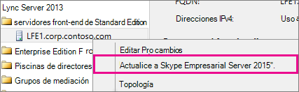
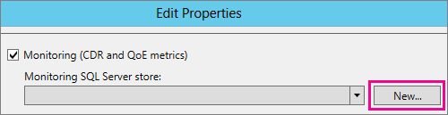

# <a name="upgrade-to-skype-for-business-server-2015"></a>Actualizar a Skype Empresarial Server 2015
 
**Resumen:** Obtenga información sobre cómo actualizar de Lync Server 2013 a Skype Empresarial Server 2015. Descargue una prueba gratuita de Skype Empresarial Server 2015 desde el Centro [de evaluación de Microsoft.](https://www.microsoft.com/evalcenter/evaluate-skype-for-business-server)
  
Use los procedimientos descritos en este documento para actualizar de Lync Server 2013 a Skype Empresarial Server 2015 mediante el Generador de topologías de Skype Empresarial Server y la nueva característica In-Place Actualización. Si desea actualizar desde Lync Server 2010 u Office Communications Server 2007 R2, consulte [Plan to upgrade to Skype for Business Server 2015](../plan-your-deployment/upgrade.md).

> [!NOTE]
> Las actualizaciones locales estaban disponibles en Skype Empresarial Server 2015, pero ya no son compatibles con Skype Empresarial Server 2019. Para obtener más información, consulte Migración a [Skype Empresarial Server 2019.](../../SfBServer2019/migration/migration-to-skype-for-business-server-2019.md)
  
## <a name="upgrade-from-lync-server-2013"></a>Actualización desde Lync Server 2013

La actualización de Lync Server 2013 a Skype Empresarial Server 2015 implica instalar software necesario, usar el Generador de topologías de Skype Empresarial Server para actualizar bases de datos en el grupo de servidores y usar la actualización In-Place de Skype Empresarial Server en cada uno de los servidores asociados con el grupo. Para completar la actualización, siga los ocho pasos de este tema.
  
### <a name="before-you-begin"></a>Antes de empezar

- Review [Plan to upgrade to Skype for Business Server 2015](../plan-your-deployment/upgrade.md).
    
- Revise [los requisitos del servidor para Skype Empresarial Server 2015.](../plan-your-deployment/requirements-for-your-environment/server-requirements.md)
    
- [Instale los requisitos previos para Skype Empresarial Server 2015.](install/install-prerequisites.md)
    
- [Instalar Skype Empresarial Server 2015.](install/install.md)
    
### <a name="step-1-install-administrator-tools-and-download-topology"></a>Paso 1: Instalar las herramientas de administrador y descargar la topología

1. Conéctese al equipo de la topología que no tenga instalado Lync OCSCore ni ningún otro componente de Lync.
    
2. Desde los medios de instalación de Skype Empresarial Server 2015, ejecute **Setup.exe** desde **OCS_Volume\Setup\AMD64**. 
    
3. Haga clic en **Instalar**. 
    
4. Acepta el contrato de licencia.
    
5. En el Asistente para la implementación, haga **clic en Instalar herramientas de** administrador y siga los pasos para instalar.
    
     
  
6. En la pantalla Inicio de Windows, abra el Generador de topologías de Skype Empresarial Server.
    
7. Haga **clic en Descargar topología de la implementación** existente y, a **continuación, haga clic en Siguiente.**
    
8. Escriba un nombre para la topología y haga clic en **Guardar.**
    
9. Vaya a la ubicación donde guardó la topología y realice una copia de la topología.
    
### <a name="step-2-upgrade-and-publish-topology-using-topology-builder"></a>Paso 2: Actualizar y publicar la topología con topology Builder

Antes de iniciar el proceso de actualización, todos los servicios deben estar en ejecución para los grupos de servidores que planea actualizar. Esto es así para que los cambios de topología se repliquen en la base de datos local de los servidores del grupo.
  
> [!IMPORTANT]
>  Guarde una copia del archivo de topología antes de actualizar. Después de la actualización, no podrá degradar la topología.> Si los servicios se encuentran en los mismos servidores que las bases de datos, como el servicio de chat persistente se encuentra en el mismo servidor que la base de datos de chat persistente, omita este paso y vaya al paso 4. Después de detener los servicios, ejecute el programa de instalación In-Place actualización en cada servidor para actualizar las bases de datos locales.
  
> [!NOTE]
> Si la topología tiene una base de datos back-end reflejada, verá que  tanto la base de datos principal como la base de datos reflejada se mostrarán al publicar la topología mediante el Generador de topologías. Asegúrese de que todas las bases de datos se ejecutan en la entidad de seguridad y solo seleccione la entidad de seguridad, no el reflejo, al publicar la topología; de lo contrario, verá una advertencia después de publicar la topología.
  
Elija una de las siguientes opciones para actualizar y publicar una nueva topología mediante el Generador de topologías de Skype Empresarial Server 2015. Después de completar los pasos y publicar la topología actualizada, pase al paso 3 de este tema.
  
#### <a name="option-1-upgrade-an-isolated-front-end-pool-and-associated-archiving-and-monitoring-stores"></a>Opción 1: Actualizar un grupo de servidores front-end aislado y almacenes de archivado y supervisión asociados

Si el grupo de servidores que está actualizando tiene una dependencia de almacén de archivado y supervisión, al seguir los pasos siguientes, también se actualizará el almacén de archivado y supervisión.
  
1. En el Generador de topologías, haga clic con el botón secundario en un grupo de servidores de Lync Server 2013, seleccione Actualizar a Skype Empresarial **Server 2015** y siga los pasos. 
    
     
  
2. En el Generador de topologías, haga clic en **Topología**  >  **de publicación de acciones** o Publicación de topología   >  **de**  >  **acción.** 
    
     
  
3. Durante la publicación, elija instalar una base de datos en el almacén de archivado y supervisión.
    
#### <a name="option-2-upgrade-front-end-pool-without-upgrading-archiving-and-monitoring-stores"></a>Opción 2: Actualizar el grupo de servidores front-end sin actualizar los almacenes de archivado y supervisión

Si usa los siguientes pasos, se deshabilita el archivado y la supervisión del grupo seleccionado. El grupo de servidores no tendrá almacenes de archivado y supervisión después de la actualización.
  
1. En el Generador de topologías, seleccione el grupo de servidores de Lync Server 2013 que desea actualizar.
    
2. Quite la dependencia de los almacenes de archivado y supervisión de Lync Server 2013. 
    
   - Vaya a **Propiedades de**  >  **edición de acciones.**
    
   - Desactive la **casilla archivado.**
    
     
  
   - Desactive la **casilla** supervisión.
    
     
  
3. Haga clic con el botón secundario en el grupo de servidores de Lync Server 2013, seleccione Actualizar a **Skype Empresarial Server 2015** y siga los pasos. 
    
     
  
4. En el Generador de topologías, haga clic en **Topología**  >  **de publicación de acciones** o Publicación de topología   >  **de**  >  **acción.** 
    
#### <a name="option-3-upgrade-front-end-pool-and-associated-it-to-new-skype-for-business-server-2015-archiving-and-monitoring-stores"></a>Opción 3: Actualizar el grupo de servidores front-end y asociarlo a los nuevos almacenes de archivado y supervisión de Skype Empresarial Server 2015

Si usa los siguientes pasos, el archivado y la supervisión se detendrán en el almacén anterior y se iniciarán en el nuevo almacén que haya creado. 
  
1. En el Generador de topologías, seleccione el grupo de servidores de Lync Server 2013 que desea actualizar. 
    
2. Quite la dependencia de los almacenes de archivado y supervisión de Lync Server 2013. 
    
   - Vaya a **Propiedades de**  >  **edición de acciones.**
    
   - Desactive la **casilla archivado.**
    
     
  
   - Desactive la **casilla** supervisión.
    
     
  
3. Haga clic con el botón secundario en el grupo de servidores de Lync Server 2013, seleccione Actualizar a **Skype Empresarial Server 2015** y siga los pasos. 
    
     
  
4. Cree un nuevo almacén de SQL para archivado. 
    
   - Seleccione el grupo de servidores y **las propiedades de**  >  **edición de acciones.** 
    
   -  Seleccione la casilla **Archivado**.
    
   - Haga clic en **Nuevo**.
    
     
  
5. Cree un nuevo almacén de SQL para supervisión. 
    
   - Seleccione el grupo de servidores y **las propiedades de**  >  **edición de acciones.** 
    
   -  Active la **casilla** supervisión.
    
   - Haga clic en **Nuevo**.
    
     
  
6. En el Generador de topologías, haga clic en **Topología**  >  **de publicación de acciones** o Publicación de topología   >  **de**  >  **acción.** 
    
7. Durante la publicación, elija instalar la base de datos en el nuevo almacén de archivado y supervisión.
    
### <a name="step-3-wait-for-replication"></a>Paso 3: Esperar la replicación

Dele tiempo a la replicación para publicar la topología actualizada en todos los servidores del entorno.
  
### <a name="step-4-stop-all-services-in-pool-to-be-upgraded"></a>Paso 4: Detener la actualización de todos los servicios del grupo

En cada servidor que da servicio al grupo de servidores que va a actualizar, ejecute el siguiente cmdlet en PowerShell:
  
```powershell
Disable-CsComputer -Scorch
```

Se recomienda usar Disable-CsComputer porque es posible que deba reiniciar el servidor durante el proceso In-Place actualización. Si usa Stop-CsWindowsService, es posible que algunos servicios se reinicien automáticamente después de un reinicio. Esto puede provocar un error In-Place actualización automática.
  
### <a name="step-5-upgrade-front-end-pools-and-non-front-end-pool-servers"></a>Paso 5: Actualizar grupos de servidores front-end y servidores de grupo no front-end

> [!NOTE]
>  Antes de actualizar, instale todos los nuevos requisitos previos necesarios para Skype Empresarial Server 2015, que incluyen: > al menos 32 GB de espacio libre antes de intentar una actualización. Además, asegúrate de que la unidad es una unidad local fija, no está conectada por USB o Firewire, tiene formato de sistema de archivos NTFS, no está comprimido y no contiene un archivo de página.> PowerShell versión 6.2.9 200.0 o posterior.> La última actualización acumulativa de Lync Server 2013 instalada.> SQL Server 2012 SP1 instalada.> Se instalaron los siguientes KB (instalados automáticamente si se usa Microsoft Update):> > Windows Server 2008 R2 -[KB2533623](https://support.microsoft.com/kb/2533623)> Windows Server 2012 -[KB2858668](https://support.microsoft.com/kb/2858668)> Windows Server 2012 R2 -[KB2982006](https://support.microsoft.com/kb/2982006)
  
Use la In-Place actualización en cada servidor para actualizar el grupo de servidores front-end, el grupo de servidores perimetrales, el servidor de mediación y el grupo de chat persistente.
  
1. En cada servidor, **ejecute** Setup.exedesde **OCS_Volume\Setup\amd64** en los medios de instalación de Skype Empresarial Server 2015.
    
2. Acepte el contrato de licencia y siga las instrucciones para la In-Place actualización.
    
3. Repita estos pasos para cada servidor del grupo de servidores front-end y en cada servidor de grupo de servidores no front-end.
    
> [!NOTE]
> Es posible que se le pida que reinicie el servidor durante la In-Place actualización. Eso está bien. Después de reiniciar, el In-Place actualización continuará desde donde lo dejó. 
  
Cuando la In-Place actualización se complete correctamente, verá el siguiente mensaje.
  

  
### <a name="step-6-restart-services-on-all-upgraded-servers"></a>Paso 6: Reiniciar servicios en todos los servidores actualizados

> [!NOTE]
> Antes de reiniciar los servicios, asegúrese de que %ProgramData%\WindowsFabric no existe en todos los servidores front-end. Si existe, elimínelo antes de iniciar los servicios. 
  
- Después de actualizar todos los servidores del grupo de servidores front-end, reinicie los servicios con el siguiente comando de PowerShell: 
    
  ```powershell
  Start-CsPool
  ```

    > [!NOTE]
    > Si ya hay un reinicio del sistema pendiente necesario antes de empezar a ejecutar In-Place Upgrade, In-Place Upgrade no te pedirá que reinicies al final de la instalación. Esto hará que se inicien algunas excepciones de ensamblado en el primer servidor front-end al intentar iniciar servicios con el cmdlet Start-CSPool servidor. Para resolver estos errores, reinicie todos los servidores del grupo y vuelva a ejecutar el cmdlet. 
  
- En los servidores que no son de grupo de servidores front-end, reinicie los servicios mediante el siguiente comando:
    
  ```powershell
  Start-CsWindowsService
  ```

Después de hacer **clic** en Aceptar en la In-Place actualización automática, verá el siguiente aviso para completar este paso.
  

  
### <a name="step-7-verify-skype-for-business-functionality-works"></a>Paso 7: Comprobar que la funcionalidad de Skype Empresarial funciona

Para asegurarse de que la actualización se ha realizado correctamente, para el grupo de servidores que se actualizó, pruebe Skype Empresarial para asegurarse de que la funcionalidad funciona según lo esperado. 
  
### <a name="step-8-upgrade-secondary-pools"></a>Paso 8: Actualizar grupos de servidores secundarios

Repita los pasos de este tema para actualizar los grupos de servidores adicionales que tenga en su entorno.
  
## <a name="troubleshoot-issues-with-the-in-place-upgrade"></a>Solucionar problemas con la actualización In-Place actualización

Si se In-Place actualización automática, es posible que vea un mensaje similar al de la siguiente imagen. 
  

  
Revise el mensaje completo en la parte inferior de la página para ayudarle a solucionar el problema. Haga **clic en Ver** registros para obtener más detalles.
  
Si se produce un error  en la actualización de In-Place al comprobar la preparación de la actualización o instalar los **requisitos previos** que faltan, asegúrese de que el servidor tenga aplicadas todas las actualizaciones más recientes de Windows Server, Lync Server y SQL Server, y de que se instalen todos los roles y software necesarios. Para obtener una lista de lo que se necesita, consulte Requisitos del servidor para [Skype Empresarial Server 2015](../plan-your-deployment/requirements-for-your-environment/server-requirements.md) e Instalar [requisitos previos para Skype Empresarial Server 2015.](install/install-prerequisites.md)
  
## <a name="see-also"></a>Vea también

[Planear la actualización a Skype Empresarial Server 2015](../plan-your-deployment/upgrade.md)
  
[Requisitos del servidor para Skype Empresarial Server 2015](../plan-your-deployment/requirements-for-your-environment/server-requirements.md)
  
[Instalar requisitos previos para Skype Empresarial Server 2015](install/install-prerequisites.md)
  
[Instalar Skype Empresarial Server 2015](install/install.md)
