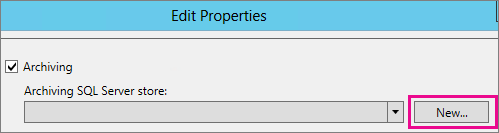

# <a name="upgrade-to-skype-for-business-server-2015"></a><span data-ttu-id="249f6-104">Actualizar a Skype Empresarial Server 2015</span><span class="sxs-lookup"><span data-stu-id="249f6-104">Upgrade to Skype for Business Server 2015</span></span>
 
<span data-ttu-id="249f6-105">**Resumen:** Obtenga información sobre cómo actualizar de Lync Server 2013 a Skype Empresarial Server 2015.</span><span class="sxs-lookup"><span data-stu-id="249f6-105">**Summary:** Learn how to upgrade from Lync Server 2013 to Skype for Business Server 2015.</span></span> <span data-ttu-id="249f6-106">Descargue una prueba gratuita de Skype Empresarial Server 2015 desde el Centro [de evaluación de Microsoft.](https://www.microsoft.com/evalcenter/evaluate-skype-for-business-server)</span><span class="sxs-lookup"><span data-stu-id="249f6-106">Download a free trial of Skype for Business Server 2015 from the  [Microsoft Evaluation center](https://www.microsoft.com/evalcenter/evaluate-skype-for-business-server).</span></span>
  
<span data-ttu-id="249f6-107">Use los procedimientos descritos en este documento para actualizar de Lync Server 2013 a Skype Empresarial Server 2015 mediante el Generador de topologías de Skype Empresarial Server y la nueva característica In-Place Actualización.</span><span class="sxs-lookup"><span data-stu-id="249f6-107">Use the procedures in this document to upgrade from Lync Server 2013 to Skype for Business Server 2015 by using the Skype for Business Server Topology Builder and the new In-Place Upgrade feature.</span></span> <span data-ttu-id="249f6-108">Si desea actualizar desde Lync Server 2010 u Office Communications Server 2007 R2, consulte [Plan to upgrade to Skype for Business Server 2015](../plan-your-deployment/upgrade.md).</span><span class="sxs-lookup"><span data-stu-id="249f6-108">If you want to upgrade from Lync Server 2010 or Office Communications Server 2007 R2, see [Plan to upgrade to Skype for Business Server 2015](../plan-your-deployment/upgrade.md).</span></span>

> [!NOTE]
> <span data-ttu-id="249f6-109">Las actualizaciones locales estaban disponibles en Skype Empresarial Server 2015, pero ya no son compatibles con Skype Empresarial Server 2019.</span><span class="sxs-lookup"><span data-stu-id="249f6-109">In-place upgrades were available in Skype for Business Server 2015 but are no longer supported in Skype for Business Server 2019.</span></span> <span data-ttu-id="249f6-110">Para obtener más información, consulte Migración a [Skype Empresarial Server 2019.](../../SfBServer2019/migration/migration-to-skype-for-business-server-2019.md)</span><span class="sxs-lookup"><span data-stu-id="249f6-110">Side by side coexistance is supported, see [Migration to Skype for Business Server 2019](../../SfBServer2019/migration/migration-to-skype-for-business-server-2019.md) for more information.</span></span>
  
## <a name="upgrade-from-lync-server-2013"></a><span data-ttu-id="249f6-111">Actualización desde Lync Server 2013</span><span class="sxs-lookup"><span data-stu-id="249f6-111">Upgrade from Lync Server 2013</span></span>

<span data-ttu-id="249f6-112">La actualización de Lync Server 2013 a Skype Empresarial Server 2015 implica instalar software necesario, usar el Generador de topologías de Skype Empresarial Server para actualizar bases de datos en el grupo de servidores y usar la actualización In-Place de Skype Empresarial Server en cada uno de los servidores asociados con el grupo.</span><span class="sxs-lookup"><span data-stu-id="249f6-112">Upgrading Lync Server 2013 to Skype for Business Server 2015 involves installing prerequisite software, using the Skype for Business Server Topology Builder to upgrade databases in the pool, and using the Skype for Business Server In-Place Upgrade on each of the servers associated with the pool.</span></span> <span data-ttu-id="249f6-113">Para completar la actualización, siga los ocho pasos de este tema.</span><span class="sxs-lookup"><span data-stu-id="249f6-113">To complete the upgrade, go through the eight steps in this topic.</span></span>
  
### <a name="before-you-begin"></a><span data-ttu-id="249f6-114">Antes de empezar</span><span class="sxs-lookup"><span data-stu-id="249f6-114">Before you begin</span></span>

- <span data-ttu-id="249f6-115">Review [Plan to upgrade to Skype for Business Server 2015](../plan-your-deployment/upgrade.md).</span><span class="sxs-lookup"><span data-stu-id="249f6-115">Review [Plan to upgrade to Skype for Business Server 2015](../plan-your-deployment/upgrade.md).</span></span>
    
- <span data-ttu-id="249f6-116">Revise [los requisitos del servidor para Skype Empresarial Server 2015.](../plan-your-deployment/requirements-for-your-environment/server-requirements.md)</span><span class="sxs-lookup"><span data-stu-id="249f6-116">Review [Server requirements for Skype for Business Server 2015](../plan-your-deployment/requirements-for-your-environment/server-requirements.md).</span></span>
    
- <span data-ttu-id="249f6-117">[Instale los requisitos previos para Skype Empresarial Server 2015.](install/install-prerequisites.md)</span><span class="sxs-lookup"><span data-stu-id="249f6-117">[Install prerequisites for Skype for Business Server 2015](install/install-prerequisites.md) .</span></span>
    
- <span data-ttu-id="249f6-118">[Instalar Skype Empresarial Server 2015.](install/install.md)</span><span class="sxs-lookup"><span data-stu-id="249f6-118">[Install Skype for Business Server 2015](install/install.md) .</span></span>
    
### <a name="step-1-install-administrator-tools-and-download-topology"></a><span data-ttu-id="249f6-119">Paso 1: Instalar las herramientas de administrador y descargar la topología</span><span class="sxs-lookup"><span data-stu-id="249f6-119">Step 1: Install Administrator tools and download topology</span></span>

1. <span data-ttu-id="249f6-120">Conéctese al equipo de la topología que no tenga instalado Lync OCSCore ni ningún otro componente de Lync.</span><span class="sxs-lookup"><span data-stu-id="249f6-120">Connect to computer in the topology that does not have Lync OCSCore or any other Lync components installed.</span></span>
    
2. <span data-ttu-id="249f6-121">Desde los medios de instalación de Skype Empresarial Server 2015, ejecuteSetup.exe **desde** **OCS_Volume\Setup\AMD64**.</span><span class="sxs-lookup"><span data-stu-id="249f6-121">From Skype for Business Server 2015 installation media, run **Setup.exe** from **OCS_Volume\Setup\AMD64**.</span></span> 
    
3. <span data-ttu-id="249f6-122">Haga clic en **Instalar**.</span><span class="sxs-lookup"><span data-stu-id="249f6-122">Click **Install**.</span></span> 
    
4. <span data-ttu-id="249f6-123">Acepta el contrato de licencia.</span><span class="sxs-lookup"><span data-stu-id="249f6-123">Accept the license agreement.</span></span>
    
5. <span data-ttu-id="249f6-124">En el Asistente para la implementación, haga **clic en Instalar herramientas de** administrador y siga los pasos para instalar.</span><span class="sxs-lookup"><span data-stu-id="249f6-124">On the Deployment Wizard, click **Install Administrator tools**, and follow the steps to install.</span></span>
    
     
  
6. <span data-ttu-id="249f6-126">En la pantalla Inicio de Windows, abra el Generador de topologías de Skype Empresarial Server.</span><span class="sxs-lookup"><span data-stu-id="249f6-126">From the Windows Start screen, open Skype for Business Server Topology Builder.</span></span>
    
7. <span data-ttu-id="249f6-127">Haga **clic en Descargar topología de la implementación** existente y, a **continuación, haga clic en Siguiente.**</span><span class="sxs-lookup"><span data-stu-id="249f6-127">Click **Download topology from existing deployment**, and click **Next**.</span></span>
    
8. <span data-ttu-id="249f6-128">Escriba un nombre para la topología y haga clic en **Guardar.**</span><span class="sxs-lookup"><span data-stu-id="249f6-128">Enter a name for the topology, and click **Save**.</span></span>
    
9. <span data-ttu-id="249f6-129">Vaya a la ubicación donde guardó la topología y realice una copia de la topología.</span><span class="sxs-lookup"><span data-stu-id="249f6-129">Go to location where you saved the topology, and make a copy of the topology.</span></span>
    
### <a name="step-2-upgrade-and-publish-topology-using-topology-builder"></a><span data-ttu-id="249f6-130">Paso 2: Actualizar y publicar la topología con topology Builder</span><span class="sxs-lookup"><span data-stu-id="249f6-130">Step 2: Upgrade and publish topology using Topology Builder</span></span>

<span data-ttu-id="249f6-131">Antes de iniciar el proceso de actualización, todos los servicios deben estar en ejecución para los grupos de servidores que planea actualizar.</span><span class="sxs-lookup"><span data-stu-id="249f6-131">Before you start the upgrade process, all services must be running for the pools you plan to upgrade.</span></span> <span data-ttu-id="249f6-132">Esto es así por lo que los cambios de topología se replicarán en la base de datos local de los servidores del grupo.</span><span class="sxs-lookup"><span data-stu-id="249f6-132">This is so the topology changes will be replicated to the local database of the servers in the pool.</span></span>
  
> [!IMPORTANT]
>  <span data-ttu-id="249f6-133">Guarde una copia del archivo de topología antes de actualizar.</span><span class="sxs-lookup"><span data-stu-id="249f6-133">Save a copy of your topology file before you upgrade.</span></span> <span data-ttu-id="249f6-134">Después de la actualización, no podrá degradar la topología.> Si los servicios se encuentran en los mismos servidores que las bases de datos, como el servicio de chat persistente se encuentra en el mismo servidor que la base de datos de chat persistente, omita este paso y vaya al paso 4.</span><span class="sxs-lookup"><span data-stu-id="249f6-134">After you upgrade, you will not be able to downgrade the topology.>  If your services are on the same servers as your databases, like the Persistent Chat service is on the same server as the Persistent Chat database, skip this step, and go to step 4.</span></span> <span data-ttu-id="249f6-135">Después de detener los servicios, ejecute el programa de instalación In-Place actualización en cada servidor para actualizar las bases de datos locales.</span><span class="sxs-lookup"><span data-stu-id="249f6-135">After you stop the services, run the In-Place Upgrade setup on each server to upgrade the local databases.</span></span>
  
> [!NOTE]
> <span data-ttu-id="249f6-136">Si la topología tiene una base de datos back-end reflejada, verá que  tanto la base de datos principal como la base de datos reflejada se mostrarán al publicar la topología mediante el Generador de topologías.</span><span class="sxs-lookup"><span data-stu-id="249f6-136">If the topology has a back-end database that is mirrored then you will see both the Principal and the Mirrored databases show up **when you publish the topology** using Topology Builder.</span></span> <span data-ttu-id="249f6-137">Asegúrese de que todas las bases de datos se ejecutan en la entidad de seguridad y solo seleccione la entidad de seguridad, no el reflejo, al publicar la topología; de lo contrario, verá una advertencia después de publicar la topología.</span><span class="sxs-lookup"><span data-stu-id="249f6-137">Make sure all of the databases are running on the Principal and only select the Principal, not the mirror, when publishing the topology otherwise you will see a warning after publishing the topology.</span></span>
  
<span data-ttu-id="249f6-138">Elija una de las siguientes opciones para actualizar y publicar una nueva topología mediante el Generador de topologías de Skype Empresarial Server 2015.</span><span class="sxs-lookup"><span data-stu-id="249f6-138">Pick one of the options below to upgrade and publish a new topology by using the Skype for Business Server 2015 Topology Builder.</span></span> <span data-ttu-id="249f6-139">Después de completar los pasos y publicar la topología actualizada, pase al paso 3 de este tema.</span><span class="sxs-lookup"><span data-stu-id="249f6-139">After you complete the steps and publish the updated topology, move to Step 3 in this topic.</span></span>
  
#### <a name="option-1-upgrade-an-isolated-front-end-pool-and-associated-archiving-and-monitoring-stores"></a><span data-ttu-id="249f6-140">Opción 1: Actualizar un grupo de servidores front-end aislado y almacenes de archivado y supervisión asociados</span><span class="sxs-lookup"><span data-stu-id="249f6-140">Option 1: Upgrade an isolated Front End pool and associated Archiving and Monitoring stores</span></span>

<span data-ttu-id="249f6-141">Si el grupo de servidores que está actualizando tiene una dependencia de almacén de archivado y supervisión, al seguir los pasos siguientes, también se actualizará el almacén de archivado y supervisión.</span><span class="sxs-lookup"><span data-stu-id="249f6-141">If the pool you're upgrading has an Archiving and Monitoring store dependency, when you use the following steps, the Archiving and Monitoring store will be upgraded as well.</span></span>
  
1. <span data-ttu-id="249f6-142">En el Generador de topologías, haga clic con el botón secundario en un grupo de Lync Server 2013, seleccione Actualizar a Skype Empresarial **Server 2015** y siga los pasos.</span><span class="sxs-lookup"><span data-stu-id="249f6-142">In Topology Builder, right-click a Lync Server 2013 pool, select **Upgrade to Skype for Business Server 2015**, and follow the steps.</span></span> 
    
     
  
2. <span data-ttu-id="249f6-144">En el Generador de topologías, haga clic en **Topología**  >  **de publicación de acciones** o Publicación de topología   >  **de**  >  **acción.**</span><span class="sxs-lookup"><span data-stu-id="249f6-144">In Topology Builder, click **Action** > **Publish topology** or **Action** > **Topology** > **Publish**.</span></span> 
    
     
  
3. <span data-ttu-id="249f6-146">Durante la publicación, elija instalar una base de datos en el almacén de archivado y supervisión.</span><span class="sxs-lookup"><span data-stu-id="249f6-146">During publishing, choose to install a database on the Archiving and Monitoring store.</span></span>
    
#### <a name="option-2-upgrade-front-end-pool-without-upgrading-archiving-and-monitoring-stores"></a><span data-ttu-id="249f6-147">Opción 2: Actualizar el grupo de servidores front-end sin actualizar los almacenes de archivado y supervisión</span><span class="sxs-lookup"><span data-stu-id="249f6-147">Option 2: Upgrade Front End pool without upgrading Archiving and Monitoring stores</span></span>

<span data-ttu-id="249f6-148">Si usa los siguientes pasos, se deshabilita el archivado y la supervisión del grupo seleccionado.</span><span class="sxs-lookup"><span data-stu-id="249f6-148">If you use the following steps, archiving and monitoring for the selected pool are disabled.</span></span> <span data-ttu-id="249f6-149">El grupo de servidores no tendrá almacenes de archivado y supervisión después de la actualización.</span><span class="sxs-lookup"><span data-stu-id="249f6-149">The pool will not have Archiving and Monitoring stores after the upgrade.</span></span>
  
1. <span data-ttu-id="249f6-150">En el Generador de topologías, seleccione el grupo de servidores de Lync Server 2013 que desea actualizar.</span><span class="sxs-lookup"><span data-stu-id="249f6-150">In Topology Builder, select the Lync Server 2013 pool that you want to upgrade.</span></span>
    
2. <span data-ttu-id="249f6-151">Quite la dependencia de los almacenes de archivado y supervisión de Lync Server 2013.</span><span class="sxs-lookup"><span data-stu-id="249f6-151">Remove the dependency to the Lync Server 2013 Archiving and Monitoring stores.</span></span> 
    
   - <span data-ttu-id="249f6-152">Vaya a **Propiedades de**  >  **edición de acciones.**</span><span class="sxs-lookup"><span data-stu-id="249f6-152">Go to **Action** > **Edit properties**.</span></span>
    
   - <span data-ttu-id="249f6-153">Desactive la **casilla archivado.**</span><span class="sxs-lookup"><span data-stu-id="249f6-153">Clear the **Archiving** check box.</span></span>
    
     
  
   - <span data-ttu-id="249f6-155">Desactive la **casilla** supervisión.</span><span class="sxs-lookup"><span data-stu-id="249f6-155">Clear the **Monitoring** check box.</span></span>
    
     
  
3. <span data-ttu-id="249f6-157">Haga clic con el botón secundario en el grupo de servidores de Lync Server 2013, seleccione Actualizar a **Skype Empresarial Server 2015** y siga los pasos.</span><span class="sxs-lookup"><span data-stu-id="249f6-157">Right-click the Lync Server 2013 pool, select **Upgrade to Skype for Business Server 2015**, and follow the steps.</span></span> 
    
     
  
4. <span data-ttu-id="249f6-159">En el Generador de topologías, haga clic en **Topología**  >  **de publicación de acciones** o Publicación de topología   >  **de**  >  **acción.**</span><span class="sxs-lookup"><span data-stu-id="249f6-159">In Topology Builder, click **Action** > **Publish topology** or **Action** > **Topology** > **Publish**.</span></span> 
    
#### <a name="option-3-upgrade-front-end-pool-and-associated-it-to-new-skype-for-business-server-2015-archiving-and-monitoring-stores"></a><span data-ttu-id="249f6-160">Opción 3: Actualizar el grupo de servidores front-end y asociarlo a los nuevos almacenes de archivado y supervisión de Skype Empresarial Server 2015</span><span class="sxs-lookup"><span data-stu-id="249f6-160">Option 3: Upgrade Front End pool and associated it to new Skype for Business Server 2015 Archiving and Monitoring stores</span></span>

<span data-ttu-id="249f6-161">Si usa los siguientes pasos, el archivado y la supervisión se detendrán en el almacén anterior y se iniciarán en el nuevo almacén que haya creado.</span><span class="sxs-lookup"><span data-stu-id="249f6-161">If you use the following steps, archiving and monitoring will stop in the previous store and start in the new store you've created.</span></span> 
  
1. <span data-ttu-id="249f6-162">En el Generador de topologías, seleccione el grupo de servidores de Lync Server 2013 que desea actualizar.</span><span class="sxs-lookup"><span data-stu-id="249f6-162">In Topology Builder, select the Lync Server 2013 pool that you want to upgrade.</span></span> 
    
2. <span data-ttu-id="249f6-163">Quite la dependencia de los almacenes de archivado y supervisión de Lync Server 2013.</span><span class="sxs-lookup"><span data-stu-id="249f6-163">Remove the dependency to the Lync Server 2013 Archiving and Monitoring stores.</span></span> 
    
   - <span data-ttu-id="249f6-164">Vaya a **Propiedades de**  >  **edición de acciones.**</span><span class="sxs-lookup"><span data-stu-id="249f6-164">Go to **Action** > **Edit properties**.</span></span>
    
   - <span data-ttu-id="249f6-165">Desactive la **casilla archivado.**</span><span class="sxs-lookup"><span data-stu-id="249f6-165">Clear the **Archiving** check box.</span></span>
    
     
  
   - <span data-ttu-id="249f6-167">Desactive la **casilla** supervisión.</span><span class="sxs-lookup"><span data-stu-id="249f6-167">Clear the **Monitoring** check box.</span></span>
    
     
  
3. <span data-ttu-id="249f6-169">Haga clic con el botón secundario en el grupo de servidores de Lync Server 2013, seleccione Actualizar a **Skype Empresarial Server 2015** y siga los pasos.</span><span class="sxs-lookup"><span data-stu-id="249f6-169">Right-click the Lync Server 2013 pool, select **Upgrade to Skype for Business Server 2015**, and follow the steps.</span></span> 
    
     
  
4. <span data-ttu-id="249f6-171">Cree un nuevo almacén de SQL para archivado.</span><span class="sxs-lookup"><span data-stu-id="249f6-171">Create a new SQL store for Archiving.</span></span> 
    
   - <span data-ttu-id="249f6-172">Seleccione el grupo de servidores y **las propiedades de**  >  **edición de acciones.**</span><span class="sxs-lookup"><span data-stu-id="249f6-172">Select the pool and **Action** > **Edit properties**.</span></span> 
    
   -  <span data-ttu-id="249f6-173">Seleccione la casilla **Archivado**.</span><span class="sxs-lookup"><span data-stu-id="249f6-173">Select the **Archiving** check box.</span></span>
    
   - <span data-ttu-id="249f6-174">Haga clic en **Nuevo**.</span><span class="sxs-lookup"><span data-stu-id="249f6-174">Click **New**.</span></span>
    
     
  
5. <span data-ttu-id="249f6-176">Cree un nuevo almacén de SQL para supervisión.</span><span class="sxs-lookup"><span data-stu-id="249f6-176">Create a new SQL store for Monitoring.</span></span> 
    
   - <span data-ttu-id="249f6-177">Seleccione el grupo de servidores y **las propiedades de**  >  **edición de acciones.**</span><span class="sxs-lookup"><span data-stu-id="249f6-177">Select the pool and **Action** > **Edit properties**.</span></span> 
    
   -  <span data-ttu-id="249f6-178">Active la **casilla** supervisión.</span><span class="sxs-lookup"><span data-stu-id="249f6-178">Select the **Monitoring** check box.</span></span>
    
   - <span data-ttu-id="249f6-179">Haga clic en **Nuevo**.</span><span class="sxs-lookup"><span data-stu-id="249f6-179">Click **New**.</span></span>
    
     
  
6. <span data-ttu-id="249f6-181">En el Generador de topologías, haga clic en **Topología**  >  **de publicación de acciones** o Publicación de topología   >  **de**  >  **acción.**</span><span class="sxs-lookup"><span data-stu-id="249f6-181">In Topology Builder, click **Action** > **Publish topology** or **Action** > **Topology** > **Publish**.</span></span> 
    
7. <span data-ttu-id="249f6-182">Durante la publicación, elija instalar la base de datos en el nuevo almacén de archivado y supervisión.</span><span class="sxs-lookup"><span data-stu-id="249f6-182">During publishing, choose to install the database on the new Archiving and Monitoring store.</span></span>
    
### <a name="step-3-wait-for-replication"></a><span data-ttu-id="249f6-183">Paso 3: Esperar la replicación</span><span class="sxs-lookup"><span data-stu-id="249f6-183">Step 3: Wait for replication</span></span>

<span data-ttu-id="249f6-184">Dele tiempo a la replicación para publicar la topología actualizada en todos los servidores del entorno.</span><span class="sxs-lookup"><span data-stu-id="249f6-184">Give replication some time to publish the updated topology to all the servers in the environment.</span></span>
  
### <a name="step-4-stop-all-services-in-pool-to-be-upgraded"></a><span data-ttu-id="249f6-185">Paso 4: Detener la actualización de todos los servicios del grupo</span><span class="sxs-lookup"><span data-stu-id="249f6-185">Step 4: Stop all services in pool to be upgraded</span></span>

<span data-ttu-id="249f6-186">En cada servidor que da servicio al grupo de servidores que va a actualizar, ejecute el siguiente cmdlet en PowerShell:</span><span class="sxs-lookup"><span data-stu-id="249f6-186">On each server that is servicing the pool that you're going to upgrade, run the following cmdlet in PowerShell:</span></span>
  
```powershell
Disable-CsComputer -Scorch
```

<span data-ttu-id="249f6-187">Se recomienda usar Disable-CsComputer porque es posible que deba reiniciar el servidor durante el proceso In-Place actualización.</span><span class="sxs-lookup"><span data-stu-id="249f6-187">We recommend using Disable-CsComputer because you may need to reboot the server during the In-Place Upgrade process.</span></span> <span data-ttu-id="249f6-188">Si usa Stop-CsWindowsService, es posible que algunos servicios se reinicien automáticamente después de un reinicio.</span><span class="sxs-lookup"><span data-stu-id="249f6-188">If you use Stop-CsWindowsService, some services may restart automatically after a reboot.</span></span> <span data-ttu-id="249f6-189">Esto puede provocar que se In-Place actualización automática.</span><span class="sxs-lookup"><span data-stu-id="249f6-189">This may cause the In-Place Upgrade to fail.</span></span>
  
### <a name="step-5-upgrade-front-end-pools-and-non-front-end-pool-servers"></a><span data-ttu-id="249f6-190">Paso 5: Actualizar grupos de servidores front-end y servidores de grupo no front-end</span><span class="sxs-lookup"><span data-stu-id="249f6-190">Step 5: Upgrade Front End pools and non-Front End pool servers</span></span>

> [!NOTE]
>  <span data-ttu-id="249f6-191">Antes de actualizar, instale todos los nuevos requisitos previos necesarios para Skype Empresarial Server 2015, que incluyen: > al menos 32 GB de espacio libre antes de intentar una actualización.</span><span class="sxs-lookup"><span data-stu-id="249f6-191">Before upgrading please install all new prerequisites required for Skype for Business Server 2015 which include:>  At least 32GB of free space before attempting an upgrade.</span></span> <span data-ttu-id="249f6-192">Además, asegúrate de que la unidad es una unidad local fija, no está conectada por USB o Firewire, tiene formato de sistema de archivos NTFS, no está comprimido y no contiene un archivo de página.> PowerShell versión 6.2.9 200.0 o posterior.> La última actualización acumulativa de Lync Server 2013 instalada.> SQL Server 2012 SP1 instalada.> Se instalaron los siguientes KB (instalados automáticamente si se usa Microsoft Update):> > Windows Server 2008 R2 -[KB2533623](https://support.microsoft.com/kb/2533623)> Windows Server 2012 -[KB2858668](https://support.microsoft.com/kb/2858668)> Windows Server 2012 R2 -[KB2982006](https://support.microsoft.com/kb/2982006)</span><span class="sxs-lookup"><span data-stu-id="249f6-192">In addition, make sure that the drive is a fixed local drive, is not connected by USB or Firewire, is formatted with NTFS file system, is not compressed, and does not contain a page file.>  PowerShell version 6.2.9200.0 or later.>  The latest Lync Server 2013 Cumulative Update installed.>  SQL Server 2012 SP1 installed.>  The following KB's installed (installed automatically if using Microsoft Update):>  Windows Server 2008 R2 -[KB2533623](https://support.microsoft.com/kb/2533623)>  Windows Server 2012 -[KB2858668](https://support.microsoft.com/kb/2858668)>  Windows Server 2012 R2 -[KB2982006](https://support.microsoft.com/kb/2982006)</span></span>
  
<span data-ttu-id="249f6-193">Use la In-Place actualización en cada servidor para actualizar el grupo de servidores front-end, el grupo de servidores perimetrales, el servidor de mediación y el grupo de chat persistente.</span><span class="sxs-lookup"><span data-stu-id="249f6-193">Use the In-Place Upgrade on each server to update the Front End pool, Edge pool, Mediation server, and the Persistent Chat pool.</span></span>
  
1. <span data-ttu-id="249f6-194">En cada servidor, **ejecute** Setup.exedesde **OCS_Volume\Setup\amd64** en los medios de instalación de Skype Empresarial Server 2015.</span><span class="sxs-lookup"><span data-stu-id="249f6-194">On each server, run **Setup.exe** from **OCS_Volume\Setup\amd64** on the Skype for Business Server 2015 installation media.</span></span>
    
2. <span data-ttu-id="249f6-195">Acepte el contrato de licencia y siga las instrucciones para la In-Place actualización.</span><span class="sxs-lookup"><span data-stu-id="249f6-195">Accept the license agreement and follow the prompts for the In-Place Upgrade.</span></span>
    
3. <span data-ttu-id="249f6-196">Repita estos pasos para cada servidor del grupo de servidores front-end y en cada servidor de grupo de servidores no front-end.</span><span class="sxs-lookup"><span data-stu-id="249f6-196">Repeat these steps for each server in the Front End pool and on each non-Front End pool server.</span></span>
    
> [!NOTE]
> <span data-ttu-id="249f6-197">Es posible que se le pida que reinicie el servidor durante la In-Place actualización.</span><span class="sxs-lookup"><span data-stu-id="249f6-197">You might be prompted to reboot the server during the In-Place Upgrade.</span></span> <span data-ttu-id="249f6-198">Eso está bien.</span><span class="sxs-lookup"><span data-stu-id="249f6-198">That's ok.</span></span> <span data-ttu-id="249f6-199">Después de reiniciar, el In-Place actualización continuará desde donde lo dejó.</span><span class="sxs-lookup"><span data-stu-id="249f6-199">After you reboot, the In-Place Upgrade will continue from where it left off.</span></span> 
  
<span data-ttu-id="249f6-200">Cuando la In-Place actualización se complete correctamente, verá el siguiente mensaje.</span><span class="sxs-lookup"><span data-stu-id="249f6-200">When the In-Place Upgrade completes successfully, you see the following message.</span></span>
  

  
### <a name="step-6-restart-services-on-all-upgraded-servers"></a><span data-ttu-id="249f6-202">Paso 6: Reiniciar los servicios en todos los servidores actualizados</span><span class="sxs-lookup"><span data-stu-id="249f6-202">Step 6: Restart services on all upgraded servers</span></span>

> [!NOTE]
> <span data-ttu-id="249f6-203">Antes de reiniciar los servicios, asegúrese de que %ProgramData%\WindowsFabric no existe en todos los servidores front-end.</span><span class="sxs-lookup"><span data-stu-id="249f6-203">Before restarting the services, please make sure %ProgramData%\WindowsFabric doesn't exist on all Front End Servers.</span></span> <span data-ttu-id="249f6-204">Si existe, elimínelo antes de iniciar los servicios.</span><span class="sxs-lookup"><span data-stu-id="249f6-204">If it exists, delete it before starting the services.</span></span> 
  
- <span data-ttu-id="249f6-205">Después de actualizar todos los servidores del grupo de servidores front-end, reinicie los servicios con el siguiente comando de PowerShell:</span><span class="sxs-lookup"><span data-stu-id="249f6-205">After you've upgraded all servers in the Front End pool, restart the services by using the following PowerShell command:</span></span> 
    
  ```powershell
  Start-CsPool
  ```

    > [!NOTE]
    > <span data-ttu-id="249f6-206">Si ya hay un reinicio del sistema pendiente necesario antes de empezar a ejecutar In-Place Upgrade, In-Place Upgrade no te pedirá que reinicies al final de la instalación.</span><span class="sxs-lookup"><span data-stu-id="249f6-206">If there is already a pending system reboot needed before you start running In-Place Upgrade, then In-Place Upgrade won't ask you to reboot at the end of the installation.</span></span> <span data-ttu-id="249f6-207">Esto hará que se inicien algunas excepciones de ensamblado en el primer servidor front-end al intentar iniciar servicios mediante el cmdlet Start-CSPool web.</span><span class="sxs-lookup"><span data-stu-id="249f6-207">This will cause some assembly exceptions to be thrown against the first Front End server when you try to start services using the Start-CSPool cmdlet.</span></span> <span data-ttu-id="249f6-208">Para resolver estos errores, reinicie todos los servidores del grupo y vuelva a ejecutar el cmdlet.</span><span class="sxs-lookup"><span data-stu-id="249f6-208">To resolve these errors, reboot all of the servers in the pool and run the cmdlet again.</span></span> 
  
- <span data-ttu-id="249f6-209">En los servidores que no son de grupo de servidores front-end, reinicie los servicios mediante el siguiente comando:</span><span class="sxs-lookup"><span data-stu-id="249f6-209">On the non-Front End pool servers, restart the services by using the following command:</span></span>
    
  ```powershell
  Start-CsWindowsService
  ```

<span data-ttu-id="249f6-210">Después de hacer **clic en** Aceptar en la In-Place actualización automática, verá el siguiente aviso para completar este paso.</span><span class="sxs-lookup"><span data-stu-id="249f6-210">After you click **OK** on the In-Place Upgrade page, you'll see the following reminder to complete this step.</span></span>
  

  
### <a name="step-7-verify-skype-for-business-functionality-works"></a><span data-ttu-id="249f6-212">Paso 7: Comprobar que la funcionalidad de Skype Empresarial funciona</span><span class="sxs-lookup"><span data-stu-id="249f6-212">Step 7: Verify Skype for Business functionality works</span></span>

<span data-ttu-id="249f6-213">Para asegurarse de que la actualización se ha realizado correctamente, para el grupo de servidores que se actualizó, pruebe Skype Empresarial para asegurarse de que la funcionalidad funciona según lo esperado.</span><span class="sxs-lookup"><span data-stu-id="249f6-213">To make sure the upgrade was successful, for the pool that was upgraded, test Skype for Business to make sure the functionality is working as expected.</span></span> 
  
### <a name="step-8-upgrade-secondary-pools"></a><span data-ttu-id="249f6-214">Paso 8: Actualizar grupos de servidores secundarios</span><span class="sxs-lookup"><span data-stu-id="249f6-214">Step 8: Upgrade secondary pools</span></span>

<span data-ttu-id="249f6-215">Repita los pasos de este tema para actualizar los grupos de servidores adicionales que tenga en su entorno.</span><span class="sxs-lookup"><span data-stu-id="249f6-215">Repeat the steps in this topic to upgrade any additional pools that you have in your environment.</span></span>
  
## <a name="troubleshoot-issues-with-the-in-place-upgrade"></a><span data-ttu-id="249f6-216">Solucionar problemas con la actualización In-Place actualización</span><span class="sxs-lookup"><span data-stu-id="249f6-216">Troubleshoot issues with the In-Place Upgrade</span></span>

<span data-ttu-id="249f6-217">Si se In-Place actualización automática, es posible que vea un mensaje similar al de la siguiente imagen.</span><span class="sxs-lookup"><span data-stu-id="249f6-217">If the In-Place Upgrade fails, you might see a message similar to what's in the following image.</span></span> 
  

  
<span data-ttu-id="249f6-219">Revise el mensaje completo en la parte inferior de la página para ayudarle a solucionar el problema.</span><span class="sxs-lookup"><span data-stu-id="249f6-219">Review the full message at the bottom of the page to help you troubleshoot the issue.</span></span> <span data-ttu-id="249f6-220">Haga **clic en Ver** registros para obtener más detalles.</span><span class="sxs-lookup"><span data-stu-id="249f6-220">Click **View logs** to get more detail.</span></span>
  
<span data-ttu-id="249f6-221">Si se produce un error  en la actualización de In-Place al comprobar la preparación de la actualización o instalar los **requisitos previos** que faltan, asegúrese de que el servidor tenga aplicadas todas las actualizaciones más recientes de Windows Server, Lync Server y SQL Server, y de que se instalen todos los roles y software necesarios.</span><span class="sxs-lookup"><span data-stu-id="249f6-221">If the In-Place Upgrade fails on **Verifying upgrade readiness** or **Installing missing prerequisites**, make sure the server has all the latest Windows Server, Lync Server, and SQL Server updates applied, and all the required software and roles are installed.</span></span> <span data-ttu-id="249f6-222">Para obtener una lista de lo que se necesita, consulte Requisitos del servidor para [Skype Empresarial Server 2015](../plan-your-deployment/requirements-for-your-environment/server-requirements.md) e Instalar [requisitos previos para Skype Empresarial Server 2015.](install/install-prerequisites.md)</span><span class="sxs-lookup"><span data-stu-id="249f6-222">For a list of what's required, see [Server requirements for Skype for Business Server 2015](../plan-your-deployment/requirements-for-your-environment/server-requirements.md) and [Install prerequisites for Skype for Business Server 2015](install/install-prerequisites.md).</span></span>
  
## <a name="see-also"></a><span data-ttu-id="249f6-223">Ver también</span><span class="sxs-lookup"><span data-stu-id="249f6-223">See also</span></span>

[<span data-ttu-id="249f6-224">Planear la actualización a Skype Empresarial Server 2015</span><span class="sxs-lookup"><span data-stu-id="249f6-224">Plan to upgrade to Skype for Business Server 2015</span></span>](../plan-your-deployment/upgrade.md)
  
[<span data-ttu-id="249f6-225">Requisitos del servidor para Skype Empresarial Server 2015</span><span class="sxs-lookup"><span data-stu-id="249f6-225">Server requirements for Skype for Business Server 2015</span></span>](../plan-your-deployment/requirements-for-your-environment/server-requirements.md)
  
[<span data-ttu-id="249f6-226">Instalar requisitos previos para Skype Empresarial Server 2015</span><span class="sxs-lookup"><span data-stu-id="249f6-226">Install prerequisites for Skype for Business Server 2015</span></span>](install/install-prerequisites.md)
  
[<span data-ttu-id="249f6-227">Instalar Skype Empresarial Server 2015</span><span class="sxs-lookup"><span data-stu-id="249f6-227">Install Skype for Business Server 2015</span></span>](install/install.md)
