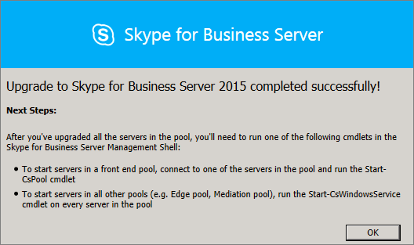

# <a name="upgrade-to-skype-for-business-server-2015"></a>Actualización a Skype Empresarial Server 2015
 
**Resumen:** Obtenga información sobre cómo actualizar de Lync Server 2013 a Skype Empresarial Server 2015. 
  
Use los procedimientos de este documento para actualizar de Lync Server 2013 a Skype Empresarial Server 2015 mediante el Generador de topologías de Skype Empresarial Server y la nueva característica de actualización de In-Place. Si desea actualizar desde Lync Server 2010 o Office Communications Server 2007 R2, consulte [Planeamiento de la actualización a Skype Empresarial Server 2015](../plan-your-deployment/upgrade.md).

> [!NOTE]
> Las actualizaciones locales estaban disponibles en Skype Empresarial Server 2015, pero ya no se admiten en Skype Empresarial Server 2019. Se admite la coexistencia en paralelo, consulte [Migración a Skype Empresarial Server 2019](../../SfBServer2019/migration/migration-to-skype-for-business-server-2019.md) para obtener más información.
  
## <a name="upgrade-from-lync-server-2013"></a>Actualización desde Lync Server 2013

Actualizar Lync Server 2013 a Skype Empresarial Server 2015 implica la instalación de software de requisitos previos, el uso de Skype Empresarial Server Generador de topologías para actualizar bases de datos en el grupo y el uso de la actualización de Skype Empresarial Server In-Place en cada uno de los servidores asociados al grupo. Para completar la actualización, siga los ocho pasos de este tema.
  
### <a name="before-you-begin"></a>Antes de empezar

- Revise [Plan para actualizar a Skype Empresarial Server 2015](../plan-your-deployment/upgrade.md).
    
- Revise [los requisitos del servidor para Skype Empresarial Server 2015](../plan-your-deployment/requirements-for-your-environment/server-requirements.md).
    
- [Instale los requisitos previos para Skype Empresarial Server 2015](install/install-prerequisites.md) .
    
- [Instale Skype Empresarial Server 2015](install/install.md) .
    
### <a name="step-1-install-administrator-tools-and-download-topology"></a>Paso 1: Instalar herramientas de administrador y descargar topología

1. Conectar al equipo de la topología que no tenga instalado Lync OCSCore ni ningún otro componente de Lync.
    
2. Desde Skype Empresarial Server medios de instalación de 2015, ejecute **Setup.exe** desde **OCS_Volume\Setup\AMD64**. 
    
3. Haga clic en **Instalar**. 
    
4. Acepta el contrato de licencia.
    
5. En el Asistente para implementación, haga clic en **Instalar herramientas de administrador** y siga los pasos para instalar.
    
     
  
6. En el Windows pantalla Inicio, abra Skype Empresarial Server Generador de topologías.
    
7. Haga clic en **Descargar topología de la implementación existente** y haga clic en **Siguiente**.
    
8. Escriba un nombre para la topología y haga clic en **Guardar**.
    
9. Vaya a la ubicación donde guardó la topología y realice una copia de la topología.
    
### <a name="step-2-upgrade-and-publish-topology-using-topology-builder"></a>Paso 2: Actualización y publicación de la topología mediante el Generador de topologías

Antes de iniciar el proceso de actualización, todos los servicios deben ejecutarse para los grupos que tiene previsto actualizar. Esto es así que los cambios de topología se replicarán en la base de datos local de los servidores del grupo.
  
> [!IMPORTANT]
>  Guarde una copia del archivo de topología antes de actualizar. Después de actualizar, no podrá degradar la topología.> Si los servicios están en los mismos servidores que las bases de datos, como el servicio de chat persistente está en el mismo servidor que la base de datos de chat persistente, omita este paso y vaya al paso 4. Después de detener los servicios, ejecute la configuración de actualización de In-Place en cada servidor para actualizar las bases de datos locales.
  
> [!NOTE]
> Si la topología tiene una base de datos de back-end reflejada, verá que la entidad de seguridad y las bases de datos reflejadas se muestran **al publicar la topología mediante el** Generador de topologías. Asegúrese de que todas las bases de datos se ejecutan en la entidad de seguridad y solo seleccione la entidad de seguridad, no el reflejo, al publicar la topología; de lo contrario, verá una advertencia después de publicar la topología.
  
Elija una de las opciones siguientes para actualizar y publicar una nueva topología mediante el Generador de topologías de Skype Empresarial Server 2015. Después de completar los pasos y publicar la topología actualizada, vaya al paso 3 de este tema.
  
#### <a name="option-1-upgrade-an-isolated-front-end-pool-and-associated-archiving-and-monitoring-stores"></a>Opción 1: Actualizar un grupo de servidores front-end aislado y almacenes de archivado y supervisión asociados

Si el grupo que va a actualizar tiene una dependencia de almacén de archivado y supervisión, cuando use los pasos siguientes, también se actualizará el almacén de archivado y supervisión.
  
1. En el Generador de topologías, haga clic con el botón derecho en un grupo de Lync Server 2013, seleccione **Actualizar a Skype Empresarial Server 2015** y siga los pasos. 
    
     
  
2. En el Generador de topologías, haga clic en Topología **de publicación de** **acciones** >  o **Publicación** **de topología de** >  **acción** > . 
    
     
  
3. Durante la publicación, elija instalar una base de datos en el almacén de archivado y supervisión.
    
#### <a name="option-2-upgrade-front-end-pool-without-upgrading-archiving-and-monitoring-stores"></a>Opción 2: Actualizar grupo de servidores front-end sin actualizar almacenes de archivado y supervisión

Si usa los pasos siguientes, el archivado y la supervisión del grupo seleccionado se deshabilitan. El grupo no tendrá almacenes de archivado y supervisión después de la actualización.
  
1. En el Generador de topologías, seleccione el grupo de Lync Server 2013 que desea actualizar.
    
2. Quite la dependencia a los almacenes de archivado y supervisión de Lync Server 2013. 
    
   - Vaya a **Propiedades de edición de acciones** > .
    
   - Desactive la casilla **Archivado** .
    
     
  
   - Desactive la casilla **Supervisión** .
    
     
  
3. Haga clic con el botón derecho en el grupo de Lync Server 2013, seleccione **Actualizar a Skype Empresarial Server 2015** y siga los pasos. 
    
     
  
4. En el Generador de topologías, haga clic en Topología **de publicación de** **acciones** >  o **Publicación** **de topología de** >  **acción** > . 
    
#### <a name="option-3-upgrade-front-end-pool-and-associated-it-to-new-skype-for-business-server-2015-archiving-and-monitoring-stores"></a>Opción 3: Actualizar grupo de servidores front-end y asociarlo a nuevos almacenes de archivado y supervisión de Skype Empresarial Server 2015

Si usa los pasos siguientes, el archivado y la supervisión se detendrán en el almacén anterior e iniciarán en el nuevo almacén que haya creado. 
  
1. En el Generador de topologías, seleccione el grupo de Lync Server 2013 que desea actualizar. 
    
2. Quite la dependencia a los almacenes de archivado y supervisión de Lync Server 2013. 
    
   - Vaya a **Propiedades de edición de acciones** > .
    
   - Desactive la casilla **Archivado** .
    
     
  
   - Desactive la casilla **Supervisión** .
    
     
  
3. Haga clic con el botón derecho en el grupo de Lync Server 2013, seleccione **Actualizar a Skype Empresarial Server 2015** y siga los pasos. 
    
     
  
4. Cree un nuevo almacén de SQL para archivado. 
    
   - Seleccione las propiedades grupo y **Edición de acciones** > . 
    
   -  Seleccione la casilla **Archivado**.
    
   - Haga clic en **Nuevo**.
    
     
  
5. Cree un nuevo almacén de SQL para supervisión. 
    
   - Seleccione las propiedades grupo y **Edición de acciones** > . 
    
   -  Active la casilla **Supervisión** .
    
   - Haga clic en **Nuevo**.
    
     
  
6. En el Generador de topologías, haga clic en Topología **de publicación de** **acciones** >  o **Publicación** **de topología de** >  **acción** > . 
    
7. Durante la publicación, elija instalar la base de datos en el nuevo almacén de archivado y supervisión.
    
### <a name="step-3-wait-for-replication"></a>Paso 3: Esperar a la replicación

Dé tiempo a la replicación para publicar la topología actualizada en todos los servidores del entorno.
  
### <a name="step-4-stop-all-services-in-pool-to-be-upgraded"></a>Paso 4: Detener todos los servicios del grupo que se van a actualizar

En cada servidor que esté dando servicio al grupo que va a actualizar, ejecute el siguiente cmdlet en PowerShell:
  
```powershell
Disable-CsComputer -Scorch
```

Se recomienda usar Disable-CsComputer porque es posible que tenga que reiniciar el servidor durante el proceso de actualización de In-Place. Si usa Stop-CsWindowsService, algunos servicios pueden reiniciarse automáticamente después de un reinicio. Esto puede hacer que se produzca un error en la actualización de In-Place.
  
### <a name="step-5-upgrade-front-end-pools-and-non-front-end-pool-servers"></a>Paso 5: Actualización de grupos de servidores front-end y servidores de grupos de servidores no front-end

> [!NOTE]
>  Antes de actualizar, instale todos los nuevos requisitos previos necesarios para Skype Empresarial Server 2015 que incluyen: > al menos 32 GB de espacio libre antes de intentar una actualización. Además, asegúrese de que la unidad es una unidad local fija, no está conectado mediante USB o Firewire, tiene formato con el sistema de archivos NTFS, no está comprimido y no contiene un archivo de página.> versión 6.2.9200.0 o posterior de PowerShell.> La última actualización acumulativa de Lync Server 2013 instalada.> SQL Server 2012 SP1 instalada.> Las siguientes KB están instaladas (se instalan automáticamente si se usa Microsoft Update): > Windows Server 2008 R2 -[KB2533623](https://support.microsoft.com/kb/2533623)> Windows Server 2012 -[KB2858668](https://support.microsoft.com/kb/2858668)> Windows Server 2012 R2 -[KB2982006](https://support.microsoft.com/kb/2982006)
  
Use el In-Place Actualizar en cada servidor para actualizar el grupo de servidores front-end, el grupo perimetral, el servidor de mediación y el grupo de chat persistente.
  
1. En cada servidor, ejecute **Setup.exe** desde **OCS_Volume\Setup\amd64** en el medio de instalación de Skype Empresarial Server 2015.
    
2. Acepte el contrato de licencia y siga las indicaciones para la actualización de In-Place.
    
3. Repita estos pasos para cada servidor del grupo de servidores front-end y en cada servidor de grupo de servidores no front-end.
    
> [!NOTE]
> Es posible que se le pida que reinicie el servidor durante la actualización de In-Place. Eso está bien. Después de reiniciar, la actualización de In-Place continuará desde donde se dejó. 
  
Cuando la actualización de In-Place se complete correctamente, verá el siguiente mensaje.
  

  
### <a name="step-6-restart-services-on-all-upgraded-servers"></a>Paso 6: Reiniciar servicios en todos los servidores actualizados

> [!NOTE]
> Antes de reiniciar los servicios, asegúrese de que %ProgramData%\WindowsFabric no existe en todos los servidores front-end. Si existe, elimínelo antes de iniciar los servicios. 
  
- Después de actualizar todos los servidores del grupo de servidores front-end, reinicie los servicios mediante el siguiente comando de PowerShell: 
    
  ```powershell
  Start-CsPool
  ```

    > [!NOTE]
    > Si ya se necesita un reinicio del sistema pendiente antes de empezar a ejecutar In-Place Actualización, In-Place Actualización no le pedirá que se reinicie al final de la instalación. Esto hará que se inicien algunas excepciones de ensamblado en el primer servidor front-end al intentar iniciar servicios mediante el cmdlet Start-CSPool. Para resolver estos errores, reinicie todos los servidores del grupo y vuelva a ejecutar el cmdlet. 
  
- En los servidores del grupo de servidores que no son front-end, reinicie los servicios mediante el siguiente comando:
    
  ```powershell
  Start-CsWindowsService
  ```

Después de hacer clic en **Aceptar** en la página actualizar In-Place, verá el siguiente aviso para completar este paso.
  

  
### <a name="step-7-verify-skype-for-business-functionality-works"></a>Paso 7: Comprobar Skype Empresarial funcionalidad funciona

Para asegurarse de que la actualización se realizó correctamente, en el grupo que se actualizó, pruebe Skype Empresarial para asegurarse de que la funcionalidad funciona según lo esperado. 
  
### <a name="step-8-upgrade-secondary-pools"></a>Paso 8: Actualización de grupos secundarios

Repita los pasos de este tema para actualizar los grupos adicionales que tenga en su entorno.
  
## <a name="troubleshoot-issues-with-the-in-place-upgrade"></a>Solución de problemas con la actualización de In-Place

Si se produce un error en la actualización de In-Place, es posible que vea un mensaje similar al de la siguiente imagen. 
  

  
Revise el mensaje completo en la parte inferior de la página para ayudarle a solucionar el problema. Haga clic en **Ver registros** para obtener más detalles.
  
Si se produce un error en la actualización de In-Place al **comprobar la preparación** de la actualización o **instalar los requisitos previos que faltan**, asegúrese de que el servidor tiene todas las actualizaciones de Windows Server, Lync Server y SQL Server más recientes aplicadas, y de que se instalan todos los roles y el software necesarios. Para obtener una lista de lo necesario, consulte Requisitos del servidor [para Skype Empresarial Server 2015](../plan-your-deployment/requirements-for-your-environment/server-requirements.md) e [Instalar requisitos previos para Skype Empresarial Server 2015](install/install-prerequisites.md).
  
## <a name="see-also"></a>Vea también

[Planeamiento de la actualización a Skype Empresarial Server 2015](../plan-your-deployment/upgrade.md)
  
[Requisitos del servidor para Skype Empresarial Server 2015](../plan-your-deployment/requirements-for-your-environment/server-requirements.md)
  
[Instalación de requisitos previos para Skype Empresarial Server 2015](install/install-prerequisites.md)
  
[Instalación de Skype Empresarial Server 2015](install/install.md)
