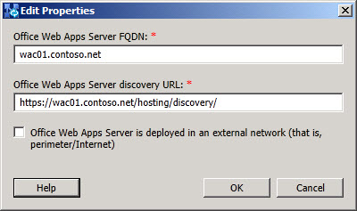

# Editar configuración del servidor Office Web Apps

Las propiedades del servidor de Office Web Apps configurado se editan. Pueden modificarse las siguientes propiedades:

 **FQDN** de Office Web Apps Server: esta propiedad define el nombre de dominio completo de Office Web Apps Server y debe coincidir con un registro A o AAAA de host del sistema de nombres de dominio (DNS) (si se usa IPv6).

 Dirección URL de detección de **Office Web Apps Server:** el localizador uniforme de recursos (URL) para el acceso de cliente a Office Web Apps Server, es posible que deba editar esta dirección desde su valor predeterminado si el servidor se coloca en otra zona de red distinta de la red interna para la implementación.

Active la casilla **El Servidor de Office Web Apps está implementado como una red externa** si este servidor está implementado en su red perimetral o en otra zona de red que se encuentra fuera del firewall interno que separa la red perimetral, las redes de poca confianza e Internet de la implementación interna.

## Ver también

[Componentes y topologías para conferencias](/previous-versions/office/lync-server-2013/lync-server-2013-components-and-topologies-for-conferencing)