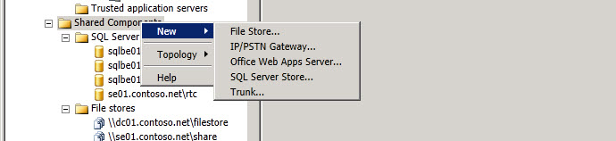

# Nodo de ámbito de componentes compartidos
 
Botón secundario haga clic en **Componentes compartidos** en el árbol de la jerarquía de Topology Builder para crear nuevos componentes compartidos o para tener acceso a las opciones del nivel topología.
  

  
Seleccione **nuevo** para crear un nuevo almacén de archivos, una nueva puerta de enlace IP/RTC, un servidor de Office Web Apps nuevo, un nuevo almacén de SQL Server o un nuevo tronco.
  
> [!NOTE]
> Vea los temas de ayuda para cada una de estas opciones. 
  

  
Seleccione la **topología** que hacer clic en Opciones para abrir un nuevo documento de topología. Abra un documento de topología existente, descargar topología actual desde el almacén de Administración Central, guardar una copia del documento de topología actual, publicar el documento actual de la topología, instalar base de datos para crear las configuraciones de la base de datos configurado actualmente, Combinar Office Communications Server 2007 R2 en la implementación actual, o para quitar implementación.
  

  

