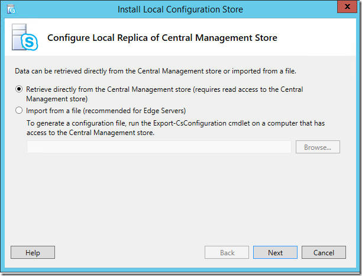

# <a name="disable-tls-1011-in-skype-for-business-server-2015"></a><span data-ttu-id="5347a-103">Deshabilitar TLS 1.0/1.1 en Skype para Business Server 2015</span><span class="sxs-lookup"><span data-stu-id="5347a-103">Disable TLS 1.0/1.1 in Skype for Business Server 2015</span></span>

<span data-ttu-id="5347a-104">El propósito de este artículo es proporcionar las instrucciones necesarias para preparar e implementar deshabilitar TLS 1.0 y 1.1 en sus entornos.</span><span class="sxs-lookup"><span data-stu-id="5347a-104">The purpose of this article is to provide the necessary guidance for you to prepare for and implement disabling TLS 1.0 and 1.1 in your environments.</span></span> <span data-ttu-id="5347a-105">Este proceso requiere extensa planificación y preparación.</span><span class="sxs-lookup"><span data-stu-id="5347a-105">This process requires extensive planning and preparation.</span></span> <span data-ttu-id="5347a-106">Por favor, revise toda la información de este artículo cuidadosamente a medida que el plan para deshabilitar TLS 1.0 y 1.1 para su organización.</span><span class="sxs-lookup"><span data-stu-id="5347a-106">Please carefully review all of the information in this article as you make your plan to disable TLS 1.0 and 1.1 for your organization.</span></span> <span data-ttu-id="5347a-107">Tenga en cuenta que hay muchas dependencias externas y las condiciones de conectividad que podrían verse afectadas por deshabilitar TLS 1.0/1.1, planeación y pruebas amplias por lo que está justificado.</span><span class="sxs-lookup"><span data-stu-id="5347a-107">Note that there are many external dependencies and connectivity conditions that could be impacted by disabling TLS 1.0/1.1, so extensive planning and testing is warranted.</span></span>

## <a name="in-this-article"></a><span data-ttu-id="5347a-108">En este artículo</span><span class="sxs-lookup"><span data-stu-id="5347a-108">In this article</span></span>

- [<span data-ttu-id="5347a-109">Fondo y ámbito</span><span class="sxs-lookup"><span data-stu-id="5347a-109">Background and scope</span></span>](#background)
- [<span data-ttu-id="5347a-110">Los requisitos previos y proceso</span><span class="sxs-lookup"><span data-stu-id="5347a-110">Prerequisites and process</span></span>](#prerequisites-and-process)
- [<span data-ttu-id="5347a-111">Escenarios de implementación avanzada</span><span class="sxs-lookup"><span data-stu-id="5347a-111">Advanced deployment scenarios</span></span>](#advanced-deployment-scenarios)

## <a name="background"></a><span data-ttu-id="5347a-112">Información general</span><span class="sxs-lookup"><span data-stu-id="5347a-112">Background</span></span>

<span data-ttu-id="5347a-113">Los controladores principales para proporcionar TLS 1.0 y 1.1 deshabilitar compatibilidad para Skype para Business Server local son los requisitos de Consejo de estándares de seguridad del sector de tarjetas de pago (PCI) y los estándares de procesamiento de información Federal.</span><span class="sxs-lookup"><span data-stu-id="5347a-113">The primary drivers for providing TLS 1.0 and 1.1 disable support for Skype for Business Server On-Premises are Payment Card Industry (PCI) Security Standards Council and Federal Information Processing Standards requirements.</span></span> <span data-ttu-id="5347a-114">Puede encontrar más información para los requisitos de PCI [aquí](https://blog.pcisecuritystandards.org/are-you-ready-for-30-june-2018-sayin-goodbye-to-ssl-early-tls).</span><span class="sxs-lookup"><span data-stu-id="5347a-114">More information for PCI requirements can be found [here](https://blog.pcisecuritystandards.org/are-you-ready-for-30-june-2018-sayin-goodbye-to-ssl-early-tls).</span></span>  <span data-ttu-id="5347a-115">Microsoft no puede proporcionar información sobre si se requiere su organización a cumplir estos u otros requisitos.</span><span class="sxs-lookup"><span data-stu-id="5347a-115">Microsoft cannot provide guidance on whether or not your organization is required to adhere to these or other requirements.</span></span> <span data-ttu-id="5347a-116">Debe determinar si es necesario para deshabilitar TLS 1.0 o 1.1 en sus entornos.</span><span class="sxs-lookup"><span data-stu-id="5347a-116">You must determine if it is required for you to disable TLS 1.0 and/or 1.1 in your environments.</span></span>

<span data-ttu-id="5347a-117">Microsoft ha publicado notas del producto en TLS disponibles [aquí](https://cloudblogs.microsoft.com/microsoftsecure/2017/06/20/tls-1-2-support-at-microsoft/), y también se recomienda el fondo leer disponibles en este [blog de Exchange](https://blogs.technet.microsoft.com/exchange/2018/01/26/exchange-server-tls-guidance-part-1-getting-ready-for-tls-1-2/).</span><span class="sxs-lookup"><span data-stu-id="5347a-117">Microsoft has produced a white paper on TLS available [here](https://cloudblogs.microsoft.com/microsoftsecure/2017/06/20/tls-1-2-support-at-microsoft/), and we also recommend the background reading available in this [Exchange blog](https://blogs.technet.microsoft.com/exchange/2018/01/26/exchange-server-tls-guidance-part-1-getting-ready-for-tls-1-2/).</span></span>

## <a name="supportability-scope"></a><span data-ttu-id="5347a-118">Ámbito de compatibilidad</span><span class="sxs-lookup"><span data-stu-id="5347a-118">Supportability Scope</span></span>

<span data-ttu-id="5347a-119">*Ámbito* hace referencia a los límites de soporte.</span><span class="sxs-lookup"><span data-stu-id="5347a-119">*Scope* refers to supportability boundaries.</span></span> <span data-ttu-id="5347a-120">Para Skype para Business Server local, *en el ámbito* significa que se admiten y haya probado la deshabilitación de TLS 1.0 y 1.1 para las versiones del producto enumerados totalmente.</span><span class="sxs-lookup"><span data-stu-id="5347a-120">For Skype for Business Server On-Premises, *in scope* means we fully support and have tested disabling of TLS 1.0 and 1.1 for the listed product versions.</span></span> <span data-ttu-id="5347a-121">*Actualmente se investigarse* significa simplemente; Estamos investigando activamente incorporación de estos productos en ámbito para deshabilitar la compatibilidad con TLS.</span><span class="sxs-lookup"><span data-stu-id="5347a-121">*Currently being investigated* means just that; we are actively investigating bringing these products into scope for TLS disable support.</span></span> <span data-ttu-id="5347a-122">*Fuera del ámbito* significa que estas versiones del producto no admiten deshabilitar TLS 1.0 o 1.1 y no funciona, con las excepciones indicadas.</span><span class="sxs-lookup"><span data-stu-id="5347a-122">*Out of scope* means these product versions do not support disabling TLS 1.0 or 1.1 and will not work, with noted exceptions.</span></span>

### <a name="fully-tested-and-supported-servers"></a><span data-ttu-id="5347a-123">Servidores totalmente probados y admitidos</span><span class="sxs-lookup"><span data-stu-id="5347a-123">Fully tested and supported servers</span></span>

- <span data-ttu-id="5347a-124">Skype Empresarial Server 2019</span><span class="sxs-lookup"><span data-stu-id="5347a-124">Skype for Business Server 2019</span></span>
- <span data-ttu-id="5347a-125">Skype para Business Server 2015 CU6 HF2 6.0.9319.516 ([actualización de marzo 2018](https://support.microsoft.com/en-us/help/4086059/march-2018-cumulative-update-6-0-9319-516-for-skype-for-business)) y superior en:</span><span class="sxs-lookup"><span data-stu-id="5347a-125">Skype for Business Server 2015 CU6 HF2 6.0.9319.516 ([March 2018 update](https://support.microsoft.com/en-us/help/4086059/march-2018-cumulative-update-6-0-9319-516-for-skype-for-business)) and higher on:</span></span> 
    - <span data-ttu-id="5347a-126">Windows Server 2012 (con 3140245 KB o actualización que reemplaza), 2012 R2 o 2016</span><span class="sxs-lookup"><span data-stu-id="5347a-126">Windows Server 2012 (with KB 3140245 or superseding update), 2012 R2 or 2016</span></span>
- <span data-ttu-id="5347a-127">En contexto actualizado Skype para servidor empresarial 2015, con CU6 HF2 y superior en</span><span class="sxs-lookup"><span data-stu-id="5347a-127">In-place Upgraded Skype for Business Server 2015, with CU6 HF2 and higher on</span></span> 
    - <span data-ttu-id="5347a-128">Windows Server 2008 R2, 2012 (con KB [3140245](https://support.microsoft.com/en-us/help/3140245/update-to-enable-tls-1-1-and-tls-1-2-as-a-default-secure-protocols-in) o actualización que reemplaza) o 2012 R2</span><span class="sxs-lookup"><span data-stu-id="5347a-128">Windows Server 2008 R2, 2012 (with KB [3140245](https://support.microsoft.com/en-us/help/3140245/update-to-enable-tls-1-1-and-tls-1-2-as-a-default-secure-protocols-in) or superseding update), or 2012 R2</span></span>
- <span data-ttu-id="5347a-129">Conectividad de Exchange y Outlook Web App con RU19 de Exchange Server 2010 SP3 o posterior, instrucciones [aquí](https://blogs.technet.microsoft.com/exchange/2018/01/26/exchange-server-tls-guidance-part-1-getting-ready-for-tls-1-2/)</span><span class="sxs-lookup"><span data-stu-id="5347a-129">Exchange Connectivity and Outlook Web App with Exchange Server 2010 SP3 RU19 or higher, guidance [here](https://blogs.technet.microsoft.com/exchange/2018/01/26/exchange-server-tls-guidance-part-1-getting-ready-for-tls-1-2/)</span></span>
- <span data-ttu-id="5347a-130">Dispositivo de sucursal con funciones de supervivencia (SBA) con Skype para Business Server 2015 CU6 HF2 o superior (se confirme con su proveedor que empaqueta las actualizaciones adecuado y que se han realizado disponibles para el dispositivo)</span><span class="sxs-lookup"><span data-stu-id="5347a-130">Survivable Branch Appliance (SBA) with Skype for Business Server 2015 CU6 HF2 or higher (confirm with your vendor that they packaged the appropiate updates and have been made available for your appliance)</span></span>
- <span data-ttu-id="5347a-131">Servidor de sucursal con funciones de supervivencia (SBS) con Skype para Business Server 2015 CU6 HF2 o superior</span><span class="sxs-lookup"><span data-stu-id="5347a-131">Survivable Branch Server (SBS) with Skype for Business Server 2015 CU6 HF2 or higher</span></span>
- <span data-ttu-id="5347a-132">Lync Server 2013 **Sólo rol de borde**, esto es debido a que la función perimetral no tiene una dependencia en Windows Fabric 1.0.</span><span class="sxs-lookup"><span data-stu-id="5347a-132">Lync Server 2013 **Edge Role Only**, this is because Edge role does not have a dependency on Windows Fabric 1.0.</span></span>


### <a name="fully-tested-and-supported-clients"></a><span data-ttu-id="5347a-133">Clientes totalmente probados y admitidos</span><span class="sxs-lookup"><span data-stu-id="5347a-133">Fully tested and supported clients</span></span>

- <span data-ttu-id="5347a-134">Cliente de escritorio de Lync 2013 (Skype para la empresa), MSI y C2R, incluidos Basic [15.0.5023.1000 y posterior](https://support.microsoft.com/en-us/help/4018334/april-3-2018-update-for-skype-for-business-2015-lync-2013-kb4018334)</span><span class="sxs-lookup"><span data-stu-id="5347a-134">Lync 2013 (Skype for Business) Desktop Client, MSI and C2R, including Basic [15.0.5023.1000 and higher](https://support.microsoft.com/en-us/help/4018334/april-3-2018-update-for-skype-for-business-2015-lync-2013-kb4018334)</span></span>
- <span data-ttu-id="5347a-135">Skype para el cliente de escritorio de 2016 empresarial, MSI [16.0.4678.1000 y posterior](https://support.microsoft.com/en-us/help/4018323/april-3-2018-update-for-skype-for-business-2016-kb4018323), incluidos Basic</span><span class="sxs-lookup"><span data-stu-id="5347a-135">Skype for Business 2016 Desktop Client, MSI [16.0.4678.1000 and higher](https://support.microsoft.com/en-us/help/4018323/april-3-2018-update-for-skype-for-business-2016-kb4018323), including Basic</span></span>
- <span data-ttu-id="5347a-136">Skype para profesionales de 2016 clic ejecutar requieren las actualizaciones de [abril 2018](https://docs.microsoft.com/officeupdates/release-notes-office365-proplus) :</span><span class="sxs-lookup"><span data-stu-id="5347a-136">Skype for Business 2016 Click to Run Require the [April 2018](https://docs.microsoft.com/officeupdates/release-notes-office365-proplus) Updates:</span></span> 
    - <span data-ttu-id="5347a-137">Mensual y anual delimitadas dirigidas, 16\.0\.9126\.2152 y posterior</span><span class="sxs-lookup"><span data-stu-id="5347a-137">Monthly and Semi-Annual Targeted, 16\.0\.9126\.2152 and higher</span></span>
    - <span data-ttu-id="5347a-138">Anual delimitadas y canal aplazada, 16\.0\.8431\.2242 y posterior</span><span class="sxs-lookup"><span data-stu-id="5347a-138">Semi-Annual and Deferred Channel, 16\.0\.8431\.2242 and higher</span></span>
- <span data-ttu-id="5347a-139">Skype para la empresa en Mac 16.15 y versiones posteriores</span><span class="sxs-lookup"><span data-stu-id="5347a-139">Skype for Business on Mac 16.15 and higher</span></span>
- <span data-ttu-id="5347a-140">Skype para empresariales para iOS y Android 6.19 y posterior</span><span class="sxs-lookup"><span data-stu-id="5347a-140">Skype for Business for iOS and Android 6.19 and higher</span></span>
- <span data-ttu-id="5347a-141">Skype Web App 2015 CU6 HF2 y superior (se incluye con el servidor)</span><span class="sxs-lookup"><span data-stu-id="5347a-141">Skype Web App 2015 CU6 HF2 and higher (ships with Server)</span></span>

### <a name="currently-being-investigated"></a><span data-ttu-id="5347a-142">Actualmente se investigarse</span><span class="sxs-lookup"><span data-stu-id="5347a-142">Currently being investigated</span></span>

#### <a name="devices"></a><span data-ttu-id="5347a-143">Dispositivos</span><span class="sxs-lookup"><span data-stu-id="5347a-143">Devices</span></span>

- <span data-ttu-id="5347a-144">El sistema de sala de Lync (también conocido como</span><span class="sxs-lookup"><span data-stu-id="5347a-144">Lync Room System (a.k.a.</span></span> <span data-ttu-id="5347a-145">SRSv1)</span><span class="sxs-lookup"><span data-stu-id="5347a-145">SRSv1)</span></span>
- <span data-ttu-id="5347a-146">Salones de equipos de Microsoft</span><span class="sxs-lookup"><span data-stu-id="5347a-146">Microsoft Teams Rooms</span></span>
- <span data-ttu-id="5347a-147">Concentrador de superficie</span><span class="sxs-lookup"><span data-stu-id="5347a-147">Surface Hub</span></span>
- <span data-ttu-id="5347a-148">en función de 2015 dispositivo de sucursal con funciones de supervivencia (SBA) o servidor de sucursal con funciones de supervivencia (SBS)</span><span class="sxs-lookup"><span data-stu-id="5347a-148">2015 based Survivable Branch Appliance (SBA) or Survivable Branch Server (SBS)</span></span>

#### <a name="other"></a><span data-ttu-id="5347a-149">Otros</span><span class="sxs-lookup"><span data-stu-id="5347a-149">Other</span></span>

- <span data-ttu-id="5347a-150">Panel de calidad de llamadas (que se haya deshabilitado la nueva instalación después de TLS 1.0, 1.1, vea más adelante) \*</span><span class="sxs-lookup"><span data-stu-id="5347a-150">Call Quality Dashboard (new install after TLS 1.0, 1.1 have been disabled, see below)\*</span></span>
 
### <a name="out-of-scope"></a><span data-ttu-id="5347a-151">Fuera del ámbito</span><span class="sxs-lookup"><span data-stu-id="5347a-151">Out of scope</span></span>

<span data-ttu-id="5347a-152">Excepto donde se indique, los siguientes productos no están en el ámbito de deshabilitar compatibilidad de TLS 1.0/1.1 y no funcionará en un entorno donde se han deshabilitado TLS 1.0 y 1.1.</span><span class="sxs-lookup"><span data-stu-id="5347a-152">Except where noted, the following products are not in scope for TLS 1.0/1.1 disable support and will not function in an environment where TLS 1.0 and 1.1 have been disabled.</span></span>  <span data-ttu-id="5347a-153">Lo que esto significa: si todavía utiliza clientes o servidores fuera de ámbito, debe actualizar o quitar estos si necesita deshabilitar TLS 1.0/1.1 en cualquier lugar en su Skype para Business Server implementación local.</span><span class="sxs-lookup"><span data-stu-id="5347a-153">What this means: if you still utilize out-of-scope servers or clients, you must update or remove these if you need to disable TLS 1.0/1.1 anywhere in your Skype for Business Server on-premises deployment.</span></span>

- <span data-ttu-id="5347a-154">Lync Server 2013</span><span class="sxs-lookup"><span data-stu-id="5347a-154">Lync Server 2013</span></span>
- <span data-ttu-id="5347a-155">Lync Server 2010</span><span class="sxs-lookup"><span data-stu-id="5347a-155">Lync Server 2010</span></span>
- <span data-ttu-id="5347a-156">Windows Server 2008 e inferior</span><span class="sxs-lookup"><span data-stu-id="5347a-156">Windows Server 2008 and lower</span></span>
- <span data-ttu-id="5347a-157">Lync para Mac 2011</span><span class="sxs-lookup"><span data-stu-id="5347a-157">Lync for Mac 2011</span></span>
- <span data-ttu-id="5347a-158">Lync 2013 para Mobile - iOS, iPad, Android o Windows Phone</span><span class="sxs-lookup"><span data-stu-id="5347a-158">Lync 2013 for Mobile - iOS, iPad, Android or Windows Phone</span></span>
- <span data-ttu-id="5347a-159">Cliente de Lync "MX" tienda Windows</span><span class="sxs-lookup"><span data-stu-id="5347a-159">Lync "MX" Windows Store client</span></span>
- <span data-ttu-id="5347a-160">Todos los clientes de Lync 2010</span><span class="sxs-lookup"><span data-stu-id="5347a-160">All Lync 2010 clients</span></span>
- <span data-ttu-id="5347a-161">Lync Phone Edition - se actualizaron las instrucciones [aquí](https://techcommunity.microsoft.com/t5/Skype-for-Business-Blog/Certified-Skype-for-Business-Online-Phones-and-what-this-means/ba-p/120035).</span><span class="sxs-lookup"><span data-stu-id="5347a-161">Lync Phone Edition - updated guidance [here](https://techcommunity.microsoft.com/t5/Skype-for-Business-Blog/Certified-Skype-for-Business-Online-Phones-and-what-this-means/ba-p/120035).</span></span>
- <span data-ttu-id="5347a-162">en función de 2013 dispositivo de sucursal con funciones de supervivencia (SBA) o servidor de sucursal con funciones de supervivencia (SBS)</span><span class="sxs-lookup"><span data-stu-id="5347a-162">2013 based Survivable Branch Appliance (SBA) or Survivable Branch Server (SBS)</span></span>
- <span data-ttu-id="5347a-163">En la nube conector Edition (CCE)</span><span class="sxs-lookup"><span data-stu-id="5347a-163">Cloud Connector Edition (CCE)</span></span>
- <span data-ttu-id="5347a-164">Skype Empresarial para Windows Phone</span><span class="sxs-lookup"><span data-stu-id="5347a-164">Skype for Business for Windows Phone</span></span>

### <a name="exceptions"></a><span data-ttu-id="5347a-165">Excepciones</span><span class="sxs-lookup"><span data-stu-id="5347a-165">Exceptions</span></span>

#### <a name="lync-server-2013"></a><span data-ttu-id="5347a-166">Lync Server 2013</span><span class="sxs-lookup"><span data-stu-id="5347a-166">Lync Server 2013</span></span>

<span data-ttu-id="5347a-167">Lync Server 2013 tiene una dependencia en Windows Fabric versión 1.0.</span><span class="sxs-lookup"><span data-stu-id="5347a-167">Lync Server 2013 takes a dependency on Windows Fabric version 1.0.</span></span>  <span data-ttu-id="5347a-168">En la fase de diseño para Lync Server 2013, Windows Fabric 1.0 se ha seleccionado para que su arquitectura distribuida nueva y atractiva proporcionar replicación, alta disponibilidad y tolerancia a errores.</span><span class="sxs-lookup"><span data-stu-id="5347a-168">In the design phase for Lync Server 2013, Windows Fabric 1.0 was chosen for its compelling and new distributed architecture to provide replication, high availability, and fault tolerance.</span></span>  <span data-ttu-id="5347a-169">Con el tiempo, ambos Skype para Business Server y Windows Fabric han mejorado considerablemente esta arquitectura conjunta con importante vuelva a diseñar en versiones posteriores.</span><span class="sxs-lookup"><span data-stu-id="5347a-169">Over time, both Skype for Business Server and Windows Fabric have greatly improved this joint architecture with significant re-design in subsequent versions.</span></span>  <span data-ttu-id="5347a-170">Skype actual para Business 2015 Server usa Windows Fabric 3.0, por ejemplo.</span><span class="sxs-lookup"><span data-stu-id="5347a-170">Current Skype for Business 2015 Server uses Windows Fabric 3.0, for example.</span></span>

<span data-ttu-id="5347a-171">Desafortunadamente, Windows Fabric 1.0 **no admite TLS 1.2.  Sin embargo, actualizaremos Lync Server 2013 para que funcione con TLS 1.2**.</span><span class="sxs-lookup"><span data-stu-id="5347a-171">Unfortunately, Windows Fabric 1.0 **does not support TLS 1.2.  However, we will be updating Lync Server 2013 to work with TLS 1.2**.</span></span> <span data-ttu-id="5347a-172">Esto se procedentes en la próxima actualización acumulativa para Lync Server 2013.</span><span class="sxs-lookup"><span data-stu-id="5347a-172">This will be coming in the next Cumulative Update for Lync Server 2013.</span></span>  <span data-ttu-id="5347a-173">Nos permite proporcionar compatibilidad con TLS 1.2 para habilitar los escenarios de coexistencia, migración, federación y híbrida.</span><span class="sxs-lookup"><span data-stu-id="5347a-173">We're providing TLS 1.2 support to enable co-existence, migration, federation, and hybrid scenarios.</span></span>

<span data-ttu-id="5347a-174">Si su organización se requiere para deshabilitar TLS 1.0 y 1.1, y que utiliza actualmente Lync Server 2013, se recomienda empezar el proceso de planeación, con la posibilidad de actualización en contexto es posible que deba o en paralelo migrar (nuevos grupos de servidores, mover usuarios) a Skype para Business Server 2015 o superior.</span><span class="sxs-lookup"><span data-stu-id="5347a-174">If your organization is required to disable TLS 1.0 and 1.1, and you currently use Lync Server 2013, we recommend you begin your planning process, with the possibility you may have to In-place upgrade or Side-by-Side migrate (new pools, move users) to Skype for Business Server 2015 or higher.</span></span>  <span data-ttu-id="5347a-175">O bien, es posible que desee acelerar la migración a Skype para profesionales en línea.</span><span class="sxs-lookup"><span data-stu-id="5347a-175">Or you may want to accelerate migration to Skype for Business Online.</span></span>

#### <a name="call-quality-dashboard"></a><span data-ttu-id="5347a-176">Panel de calidad de llamadas</span><span class="sxs-lookup"><span data-stu-id="5347a-176">Call Quality Dashboard</span></span>

<span data-ttu-id="5347a-177">Panel de calidad de llamada local actualmente tiene una dependencia en TLS 1.0 durante la instalación nueva (la primera vez a instalar en los entornos locales).</span><span class="sxs-lookup"><span data-stu-id="5347a-177">On-Premises Call Quality Dashboard currently has a dependency on TLS 1.0 during new install (first time installing into your On-Premises environments).</span></span>  <span data-ttu-id="5347a-178">Se actualmente se investiga este problema y plan liberar una corrección en un futuro próximo.</span><span class="sxs-lookup"><span data-stu-id="5347a-178">We are currently investigating this issue and plan to release a fix in the near future.</span></span>  <span data-ttu-id="5347a-179">Si tiene pensado instalar CQD y deshabilitar también TLS 1.0, se recomienda que complete la instalación de CQD en primer lugar y, a continuación, continuar con la deshabilitación de TLS 1.0.</span><span class="sxs-lookup"><span data-stu-id="5347a-179">If you are planning to install CQD and also disable TLS 1.0, we recommend that you complete CQD installation first, and then proceed with TLS 1.0 disabling.</span></span>

#### <a name="third-party-devices"></a><span data-ttu-id="5347a-180">Dispositivos de otros fabricantes</span><span class="sxs-lookup"><span data-stu-id="5347a-180">Third-party devices</span></span>

<span data-ttu-id="5347a-181">En dispositivos de otros fabricantes, como los teléfonos 3PIP, conferencias de vídeo, los servidores proxy inversos y los equilibradores de carga, asegúrese de validar la compatibilidad de TLS 1.2, probar detenidamente y póngase en contacto con el proveedor si es necesario.</span><span class="sxs-lookup"><span data-stu-id="5347a-181">On third-party devices such as 3PIP phones, Video conferencing, Reverse Proxies and Load Balancers, be sure to validate TLS 1.2 supportability, test carefully, and contact the vendor if needed.</span></span>

### <a name="federation-considerations-when-disabling-tls-1011-on-edge-servers"></a><span data-ttu-id="5347a-182">Consideraciones de federación al deshabilitar TLS 1.0/1.1 en los servidores perimetrales</span><span class="sxs-lookup"><span data-stu-id="5347a-182">Federation considerations when disabling TLS 1.0/1.1 on Edge servers</span></span>

<span data-ttu-id="5347a-183">Detenidamente debe planear y tenga en cuenta el impacto de deshabilitar TLS 1.0/1.1 en los servidores perimetrales.</span><span class="sxs-lookup"><span data-stu-id="5347a-183">You must carefully plan for and consider the impact of disabling TLS 1.0/1.1 on your Edge servers.</span></span>  <span data-ttu-id="5347a-184">Una vez que se deshabilitan TLS 1.0 y 1.1, es posible que encuentre que son otras organizaciones ya no podrá federarse con su organización.</span><span class="sxs-lookup"><span data-stu-id="5347a-184">Once TLS 1.0 and 1.1 are disabled, you may find that other organizations are no longer be able to federate with your organization.</span></span>

<span data-ttu-id="5347a-185">Puede optar por mantener TLS 1.0/1.1 habilitada en los servidores perimetrales para mantener la compatibilidad con versiones anteriores con no revisadas (SfB 2015, Lync 2013) o sistemas externos de antiguos (2010).</span><span class="sxs-lookup"><span data-stu-id="5347a-185">You may opt to keep TLS 1.0/1.1 enabled on your Edge servers to maintain backward compatibility with non-patched (SfB 2015, Lync 2013) or older (2010) external systems.</span></span>

<span data-ttu-id="5347a-186">Microsoft no puede proporcionar consejos o recomendaciones sobre si la red perimetral (o cualquier red) explicar PCI estándar; que se determinará por la compañía individual.</span><span class="sxs-lookup"><span data-stu-id="5347a-186">Microsoft cannot provide advice or recommendations on whether or not your Edge network (or any network) falls under PCI standard; that must be determined by the individual company.</span></span>

<span data-ttu-id="5347a-187">Skype para profesionales en línea es capaz de TLS 1.2 en la actualidad, por lo que no se espera ningún impacto híbrida y federación con Online.</span><span class="sxs-lookup"><span data-stu-id="5347a-187">Skype for Business Online is capable of TLS 1.2 today, so no impact to Hybrid/Federation with Online is expected.</span></span>

<span data-ttu-id="5347a-188">Mensajería instantánea pública (conectividad de mensajería instantánea pública) al servicio de consumidor de Skype: Esperamos que no deshabilitar TLS 1.0/1.1 para afectar a [La conectividad de Skype](../../deploy/deploy-skype-connectivity.md); Las puertas de enlace de mensajería instantánea pública de Microsoft ya están capaz de TLS 1.2.</span><span class="sxs-lookup"><span data-stu-id="5347a-188">PIC (Public IM Connectivity) to Skype Consumer service: We do not expect disabling TLS 1.0/1.1 to impact [Skype Connectivity](../../deploy/deploy-skype-connectivity.md); Microsoft PIC Gateways are already TLS 1.2 capable.</span></span>

## <a name="prerequisites-and-process"></a><span data-ttu-id="5347a-189">Los requisitos previos y proceso</span><span class="sxs-lookup"><span data-stu-id="5347a-189">Prerequisites and process</span></span>

<span data-ttu-id="5347a-190">Excepto donde se indicó anteriormente, una vez TLS 1.0 y 1.1 están deshabilitados servidores fuera de ámbito, clientes y dispositivos ya funcionará correctamente o en absoluto.</span><span class="sxs-lookup"><span data-stu-id="5347a-190">Except where noted above, once TLS 1.0 and 1.1 are disabled out-of-scope servers, clients and devices will longer function properly, or at all.</span></span> <span data-ttu-id="5347a-191">Esto puede significar que desea pausar y espere a que se actualizaron las instrucciones de Microsoft.</span><span class="sxs-lookup"><span data-stu-id="5347a-191">This may mean you need to pause and wait for updated guidance from Microsoft.</span></span> <span data-ttu-id="5347a-192">Una vez que esté satisfecho que cumple todos los requisitos y tener un plan para los intervalos de direcciones, continúe con.</span><span class="sxs-lookup"><span data-stu-id="5347a-192">Once you are satisfied that you meet all requirements and have a plan to address gaps, proceed.</span></span>

<span data-ttu-id="5347a-193">En un nivel alto, mientras está listo para procedimiento durante la instalación, Skype para Business Server 2019 Skype para Business Server 2015 requerirá que instale CU6 HF2, aplicar actualizaciones de requisitos previos para .NET y SQL, implementación claves del registro de requisitos previos y, por último un independiente Round de configuración del sistema operativo actualiza (es decir, deshabilitar TLS 1.0 y 1.1 a través de importación de archivos de registro).</span><span class="sxs-lookup"><span data-stu-id="5347a-193">At a high level, while Skype for Business Server 2019 is ready for procedure at install, Skype for Business Server 2015 will require that you install CU6 HF2, applying pre-requisite updates to .NET and SQL, deploying prerequisite registry keys, and finally a separate round of OS configuration updates (i.e. disabling TLS 1.0 and 1.1 via registry file import).</span></span> <span data-ttu-id="5347a-194">Es muy importante que complete la instalación de todos los requisitos previos, incluidos Skype para Business Server 2015 CU6 HF2, antes de deshabilitar TLS 1.0 y 1.1 en cualquier servidor en el entorno.</span><span class="sxs-lookup"><span data-stu-id="5347a-194">It is critically important that you complete installation of all prerequisites, including Skype for Business Server 2015 CU6 HF2, prior to disabling TLS 1.0 and 1.1 on any server in your environment.</span></span> <span data-ttu-id="5347a-195">Cada Skype para Business server, incluida la función perimetral y back-ends de SQL, requiere las actualizaciones.</span><span class="sxs-lookup"><span data-stu-id="5347a-195">Every Skype for Business server, including Edge role and SQL Backends, requires the updates.</span></span> <span data-ttu-id="5347a-196">Asegúrese también de que se han actualizado todos los clientes (en el ámbito) admitidos para las versiones mínimas necesarias.</span><span class="sxs-lookup"><span data-stu-id="5347a-196">Also ensure that all supported (in-scope) clients have been updated to the required minimum versions.</span></span> <span data-ttu-id="5347a-197">No olvide actualizar las estaciones de trabajo como administración.</span><span class="sxs-lookup"><span data-stu-id="5347a-197">Don’t forget to update management workstations as well.</span></span>

<span data-ttu-id="5347a-198">Queremos que se deben seguir el orden de las operaciones de "en profundidad" habitual para actualizar Skype para servidores empresariales.</span><span class="sxs-lookup"><span data-stu-id="5347a-198">We want to follow the usual order of operations of "inside out" for upgrading Skype for Business servers.</span></span> <span data-ttu-id="5347a-199">Tratar los grupos de servidores Director, chat persistente y emparejada grupos de servidores de la misma manera que lo haría normalmente.</span><span class="sxs-lookup"><span data-stu-id="5347a-199">Treat Director pools, Persistent chat, and Paired Pools in the same manner you normally would.</span></span> <span data-ttu-id="5347a-200">Orden y los métodos de actualización que se tratan [aquí](topology.md) y [aquí](https://support.microsoft.com/en-us/help/3061064/updates-for-skype-for-business-server-2015).</span><span class="sxs-lookup"><span data-stu-id="5347a-200">Order and methods for upgrade are covered [here](topology.md) and [here](https://support.microsoft.com/en-us/help/3061064/updates-for-skype-for-business-server-2015).</span></span>

### <a name="high-level-process"></a><span data-ttu-id="5347a-201">Proceso de alto nivel</span><span class="sxs-lookup"><span data-stu-id="5347a-201">High-level process</span></span>

1. <span data-ttu-id="5347a-202">Todos los pasos de prueba en el laboratorio antes de configurar los servidores de producción.</span><span class="sxs-lookup"><span data-stu-id="5347a-202">Test all steps in your lab prior to configuring production servers.</span></span>
2. <span data-ttu-id="5347a-203">Copia de seguridad y conservar una copia del registro exportado en cada servidor individual van a actualizar.</span><span class="sxs-lookup"><span data-stu-id="5347a-203">Back up and preserve a copy of exported registry on each and every individual server to be updated.</span></span> <span data-ttu-id="5347a-204">No se pueden compartir registros entre servidores; que contienen claves únicas en el equipo.</span><span class="sxs-lookup"><span data-stu-id="5347a-204">You cannot share registries between servers; they contain unique machine-based keys.</span></span>
3. <span data-ttu-id="5347a-205">Actualizar todos los Skype para los servidores de negocio 2015 a CU6 HF2 o superior.</span><span class="sxs-lookup"><span data-stu-id="5347a-205">Upgrade all Skype for Business 2015 servers to CU6 HF2 or higher.</span></span> <span data-ttu-id="5347a-206">(Para Skype para Business Server 2019, no es necesario ningún CU)</span><span class="sxs-lookup"><span data-stu-id="5347a-206">(For Skype for Business Server 2019, no CU is needed)</span></span>
4. <span data-ttu-id="5347a-207">Instalar los requisitos previos para todos los servidores.</span><span class="sxs-lookup"><span data-stu-id="5347a-207">Install all prerequisites to all servers.</span></span>
5. <span data-ttu-id="5347a-208">Implementación de las claves del registro necesario como requisito previo.</span><span class="sxs-lookup"><span data-stu-id="5347a-208">Deploy prerequisite registry keys.</span></span>
6. <span data-ttu-id="5347a-209">Asegúrese de que se actualizan todos los clientes en el ámbito.</span><span class="sxs-lookup"><span data-stu-id="5347a-209">Ensure that all in-scope clients are updated.</span></span>
7. <span data-ttu-id="5347a-210">Deshabilitar TLS 1.0 y 1.1 mediante la importación del registro.</span><span class="sxs-lookup"><span data-stu-id="5347a-210">Disable TLS 1.0 and 1.1 via registry import.</span></span>
8. <span data-ttu-id="5347a-211">Validar que las cargas de trabajo funcionan según lo previsto.</span><span class="sxs-lookup"><span data-stu-id="5347a-211">Validate that workloads are functioning as expected.</span></span>
    - <span data-ttu-id="5347a-212">Si se encuentran problemas, solución de problemas y resolver, o</span><span class="sxs-lookup"><span data-stu-id="5347a-212">If problems are encountered, troubleshoot and resolve, or</span></span>
    - <span data-ttu-id="5347a-213">Restaurar el registro desde el paso 2 para volver a habilitar TLS 1.0 y 1.1</span><span class="sxs-lookup"><span data-stu-id="5347a-213">Restore registry from step 2 to re-enable TLS 1.0 and 1.1</span></span>
9. <span data-ttu-id="5347a-214">Validar que se utiliza sólo TLS 1.2.</span><span class="sxs-lookup"><span data-stu-id="5347a-214">Validate that only TLS 1.2 is being used.</span></span>

### <a name="install-prerequisites-to-all-servers"></a><span data-ttu-id="5347a-215">Instalar los requisitos previos para todos los servidores</span><span class="sxs-lookup"><span data-stu-id="5347a-215">Install prerequisites to all servers</span></span>

<span data-ttu-id="5347a-216">Se requiere la actualización de dependencia extensa antes de comenzar a deshabilitar TLS 1.0 y 1.1 en el nivel de sistema operativo en su Skype para las implementaciones empresariales Server 2015.</span><span class="sxs-lookup"><span data-stu-id="5347a-216">Extensive dependency updating is required before you begin to disable TLS 1.0 and 1.1 at the operating system level in your Skype for Business Server 2015 deployments.</span></span> <span data-ttu-id="5347a-217">Los siguientes son las versiones mínimas que pueden admitir TLS 1.2.</span><span class="sxs-lookup"><span data-stu-id="5347a-217">The following are the minimum versions that can support TLS 1.2.</span></span> <span data-ttu-id="5347a-218">Implementar todas las actualizaciones de requisitos previos en cada Skype para Business server en su entorno antes de comenzar a deshabilitar TLS 1.0 y 1.1.</span><span class="sxs-lookup"><span data-stu-id="5347a-218">Deploy all prerequisite updates across every Skype for Business server in your environment before you begin disabling TLS 1.0 and 1.1.</span></span>

- <span data-ttu-id="5347a-219">Skype para Business Server 2015 CU6 HF2 6.0.9319.516 ([actualización de marzo 2018](https://support.microsoft.com/en-us/help/4086059/march-2018-cumulative-update-6-0-9319-516-for-skype-for-business)) o superior</span><span class="sxs-lookup"><span data-stu-id="5347a-219">Skype for Business Server 2015 CU6 HF2 6.0.9319.516 ([March 2018 update](https://support.microsoft.com/en-us/help/4086059/march-2018-cumulative-update-6-0-9319-516-for-skype-for-business)) or higher</span></span>
- <span data-ttu-id="5347a-220">[.NET framework 4.7](https://www.microsoft.com/en-us/download/details.aspx?id=55167) o superior con SchUseStrongCrypto habilitado en el registro (proporcionado a continuación)</span><span class="sxs-lookup"><span data-stu-id="5347a-220">[.NET Framework 4.7](https://www.microsoft.com/en-us/download/details.aspx?id=55167) or higher with SchUseStrongCrypto enabled in the registry (provided below)</span></span>
- <span data-ttu-id="5347a-221">SQL debe actualizarse en todos los Skype para servidores de negocio 2015 y back-ends.</span><span class="sxs-lookup"><span data-stu-id="5347a-221">SQL must be updated on all Skype for Business 2015 servers and backends.</span></span> <span data-ttu-id="5347a-222">Actualizar Enterprise Edition del grupo SQL back-ends en primer lugar, a continuación, su servidor respectivos.</span><span class="sxs-lookup"><span data-stu-id="5347a-222">Update Enterprise Edition Pool SQL Backends first, then their respective FEs.</span></span> 
    - <span data-ttu-id="5347a-223">SQL Server 2014 SP1 + CU5 ([vínculo](https://support.microsoft.com/help/3130926)), o superior o SQL Server 2012 SP2 + CU16 o superior / RTM de SQL Server 2014 + CU12 ([vínculo](https://support.microsoft.com/en-us/help/3130923/cumulative-update-12-for-sql-server-2014)) o superior o SQL Server 2014 SP2</span><span class="sxs-lookup"><span data-stu-id="5347a-223">SQL Server 2014 SP1 + CU5 ([link](https://support.microsoft.com/help/3130926)), or higher / SQL Server 2012 SP2 + CU16 or higher/ SQL Server 2014 RTM + CU12 ([link](https://support.microsoft.com/en-us/help/3130923/cumulative-update-12-for-sql-server-2014)) or higher / SQL Server 2014 SP2</span></span>
    - <span data-ttu-id="5347a-224">SQL Server Native Client para SQL Server 2012 ([vínculo](https://www.microsoft.com/en-us/download/details.aspx?id=50402))</span><span class="sxs-lookup"><span data-stu-id="5347a-224">SQL Server Native Client for SQL Server 2012 ([link](https://www.microsoft.com/en-us/download/details.aspx?id=50402))</span></span>
    - <span data-ttu-id="5347a-225">11 de controlador ODBC de Microsoft para SQL Server ([vínculo](https://www.microsoft.com/en-us/download/details.aspx?id=36434)) o superior</span><span class="sxs-lookup"><span data-stu-id="5347a-225">Microsoft ODBC Driver 11 for SQL Server ([link](https://www.microsoft.com/en-us/download/details.aspx?id=36434)), or higher</span></span>
    - <span data-ttu-id="5347a-226">Shared objetos de administración de SQL Server 2014 SP2 ([vínculo](https://www.microsoft.com/en-in/download/details.aspx?id=42295))</span><span class="sxs-lookup"><span data-stu-id="5347a-226">Shared Management Objects for SQL Server 2014 SP2 ([link](https://www.microsoft.com/en-in/download/details.aspx?id=42295))</span></span>
    - <span data-ttu-id="5347a-227">SQLSysClrTypes para SQL server 2014 SP2 ([vínculo](https://www.microsoft.com/en-in/download/details.aspx?id=42295))</span><span class="sxs-lookup"><span data-stu-id="5347a-227">SQLSysClrTypes for SQL server 2014 SP2 ([link](https://www.microsoft.com/en-in/download/details.aspx?id=42295))</span></span>

### <a name="basic-steps-to-install-pre-requisites-in-recommended-order-of-operations"></a><span data-ttu-id="5347a-228">Pasos básicos para instalar los requisitos previos, en el orden recomendado de operaciones</span><span class="sxs-lookup"><span data-stu-id="5347a-228">Basic steps to install pre-requisites, in recommended order of operations</span></span>

1. <span data-ttu-id="5347a-229">Instalar el Skype para Business Server CU6HF2 (6.0.9319.516) actualizar a todos los servidores.</span><span class="sxs-lookup"><span data-stu-id="5347a-229">Install the Skype for Business Server CU6HF2 (6.0.9319.516) update to all servers.</span></span> 
    1. <span data-ttu-id="5347a-230">Instalar la actualización de componentes mediante el actualizador.</span><span class="sxs-lookup"><span data-stu-id="5347a-230">Install the update to components using the updater.</span></span>
    2. <span data-ttu-id="5347a-231">Actualizar bases de datos de acuerdo con los procedimientos documentados.</span><span class="sxs-lookup"><span data-stu-id="5347a-231">Update databases according to documented procedures.</span></span> <span data-ttu-id="5347a-232">Las instrucciones se documentan en [https://support.microsoft.com/en-us/help/3061064/updates-for-skype-for-business-server-2015](https://support.microsoft.com/en-us/help/3061064/updates-for-skype-for-business-server-2015).</span><span class="sxs-lookup"><span data-stu-id="5347a-232">Instructions are documented at [https://support.microsoft.com/en-us/help/3061064/updates-for-skype-for-business-server-2015](https://support.microsoft.com/en-us/help/3061064/updates-for-skype-for-business-server-2015).</span></span>
    3. <span data-ttu-id="5347a-233">Validar la funcionalidad del producto en la implementación antes de avanzar con cualquier otro cambio.</span><span class="sxs-lookup"><span data-stu-id="5347a-233">Validate product functionality in the deployment prior to moving forward with any other changes.</span></span>
2. <span data-ttu-id="5347a-234">Descargar .NET 4.7 Installer sin conexión.</span><span class="sxs-lookup"><span data-stu-id="5347a-234">Download .NET 4.7 Offline Installer.</span></span> 
    1. <span data-ttu-id="5347a-235">Referencia:[https://www.microsoft.com/en-us/download/details.aspx?id=55167](https://www.microsoft.com/en-us/download/details.aspx?id=55167)</span><span class="sxs-lookup"><span data-stu-id="5347a-235">Reference: [https://www.microsoft.com/en-us/download/details.aspx?id=55167](https://www.microsoft.com/en-us/download/details.aspx?id=55167)</span></span>
    2. <span data-ttu-id="5347a-236">Asegúrese de que se detienen Skype para Business Server 2015 servicios en el servidor Front-End.</span><span class="sxs-lookup"><span data-stu-id="5347a-236">Ensure that Skype for Business Server 2015 services are stopped on the Front End server.</span></span>
    3. <span data-ttu-id="5347a-237">Referencia:[https://support.microsoft.com/en-us/help/3061064/updates-for-skype-for-business-server-2015](https://support.microsoft.com/en-us/help/3061064/updates-for-skype-for-business-server-2015)</span><span class="sxs-lookup"><span data-stu-id="5347a-237">Reference: [https://support.microsoft.com/en-us/help/3061064/updates-for-skype-for-business-server-2015](https://support.microsoft.com/en-us/help/3061064/updates-for-skype-for-business-server-2015)</span></span>
    4. <span data-ttu-id="5347a-238">Ex (Standard Edition): Stop-CsWindowsServices</span><span class="sxs-lookup"><span data-stu-id="5347a-238">Ex (Standard Edition): Stop-CsWindowsServices</span></span>
    5. <span data-ttu-id="5347a-239">Ex (Enterprise Edition): Invoke-CsComputerFailover</span><span class="sxs-lookup"><span data-stu-id="5347a-239">Ex (Enterprise Edition): Invoke-CsComputerFailover</span></span>
    6. <span data-ttu-id="5347a-240">Ejecute el paquete de instalación.</span><span class="sxs-lookup"><span data-stu-id="5347a-240">Run the installer package.</span></span>
    7. <span data-ttu-id="5347a-241">Reinicie el servidor.</span><span class="sxs-lookup"><span data-stu-id="5347a-241">Reboot the server.</span></span>
3. <span data-ttu-id="5347a-242">Actualización de SQL Express 2014 en todos los servidores.</span><span class="sxs-lookup"><span data-stu-id="5347a-242">Update SQL Express 2014 on all servers.</span></span> 
    1. <span data-ttu-id="5347a-243">Referencia:[https://support.microsoft.com/en-us/help/3135244/tls-1-2-support-for-microsoft-sql-server](https://support.microsoft.com/en-us/help/3135244/tls-1-2-support-for-microsoft-sql-server)</span><span class="sxs-lookup"><span data-stu-id="5347a-243">Reference: [https://support.microsoft.com/en-us/help/3135244/tls-1-2-support-for-microsoft-sql-server](https://support.microsoft.com/en-us/help/3135244/tls-1-2-support-for-microsoft-sql-server)</span></span>
    2. <span data-ttu-id="5347a-244">Descargar el SP2 de SQL de 2014</span><span class="sxs-lookup"><span data-stu-id="5347a-244">Download SQL 2014 SP2</span></span> 
        - <span data-ttu-id="5347a-245">Referencia:[https://www.microsoft.com/en-us/download/details.aspx?id=53168](https://www.microsoft.com/en-us/download/details.aspx?id=53168)</span><span class="sxs-lookup"><span data-stu-id="5347a-245">Reference: [https://www.microsoft.com/en-us/download/details.aspx?id=53168](https://www.microsoft.com/en-us/download/details.aspx?id=53168)</span></span>
    3. <span data-ttu-id="5347a-246">Copie los medios de instalación en una carpeta en el servidor (ej: C:\01_2014SqlSp2)</span><span class="sxs-lookup"><span data-stu-id="5347a-246">Copy the installation media to a folder on the server (Ex: C:\01_2014SqlSp2)</span></span>
    4. <span data-ttu-id="5347a-247">Asegúrese de Skype para Business Server 2015 servicios se detienen en el servidor Front-End</span><span class="sxs-lookup"><span data-stu-id="5347a-247">Ensure Skype for Business Server 2015 services are stopped on the Front End server</span></span> 
        - <span data-ttu-id="5347a-248">Ex (Standard Edition): Stop-CsWindowsService</span><span class="sxs-lookup"><span data-stu-id="5347a-248">Ex (Standard Edition): Stop-CsWindowsService</span></span>
        - <span data-ttu-id="5347a-249">Ex (Enterprise Edition): Invoke-CsComputerFailove</span><span class="sxs-lookup"><span data-stu-id="5347a-249">Ex (Enterprise Edition): Invoke-CsComputerFailove</span></span>
    5. <span data-ttu-id="5347a-250">Abra un símbolo del sistema de administración y actualizar todos los componentes instalados e instancias</span><span class="sxs-lookup"><span data-stu-id="5347a-250">Open an Admin Command Prompt, and upgrade all installed components and instances</span></span> 
        - <span data-ttu-id="5347a-251">Ejemplo: C:\01_2014SqlSp2\SQLServer2014SP2-KB3171021-x64-ENU.exe/Action de /IAcceptSQLServerLicenseTerms /qs = revisión /AllInstances</span><span class="sxs-lookup"><span data-stu-id="5347a-251">Example: C:\01_2014SqlSp2\SQLServer2014SP2-KB3171021-x64-ENU.exe /qs /IAcceptSQLServerLicenseTerms /Action=Patch /AllInstances</span></span>
4. <span data-ttu-id="5347a-252">Actualización de SQL Native Client.</span><span class="sxs-lookup"><span data-stu-id="5347a-252">Update SQL Native Client.</span></span> 
    1. <span data-ttu-id="5347a-253">Referencia: [https://support.microsoft.com/en-us/help/3135244/tls-1-2-support-for-microsoft-sql-server](https://support.microsoft.com/en-us/help/3135244/tls-1-2-support-for-microsoft-sql-server).</span><span class="sxs-lookup"><span data-stu-id="5347a-253">Reference: [https://support.microsoft.com/en-us/help/3135244/tls-1-2-support-for-microsoft-sql-server](https://support.microsoft.com/en-us/help/3135244/tls-1-2-support-for-microsoft-sql-server).</span></span>
    2. <span data-ttu-id="5347a-254">Descargar desde[https://www.microsoft.com/en-us/download/details.aspx?id=50402](https://www.microsoft.com/en-us/download/details.aspx?id=50402)</span><span class="sxs-lookup"><span data-stu-id="5347a-254">Download from [https://www.microsoft.com/en-us/download/details.aspx?id=50402](https://www.microsoft.com/en-us/download/details.aspx?id=50402)</span></span>
    3. <span data-ttu-id="5347a-255">Asegúrese de Skype para Business Server 2015 servicios se detienen en el servidor Front-End.</span><span class="sxs-lookup"><span data-stu-id="5347a-255">Ensure Skype for Business Server 2015 services are stopped on the Front End server.</span></span> 
        - <span data-ttu-id="5347a-256">Ex (Standard Edition): Stop-CsWindowsServices</span><span class="sxs-lookup"><span data-stu-id="5347a-256">Ex (Standard Edition): Stop-CsWindowsServices</span></span>
        - <span data-ttu-id="5347a-257">Ex (Enterprise Edition): Invoke-CsComputerFailove</span><span class="sxs-lookup"><span data-stu-id="5347a-257">Ex (Enterprise Edition): Invoke-CsComputerFailove</span></span>
    4. <span data-ttu-id="5347a-258">Detener las instancias de SQL instaladas se ejecuten</span><span class="sxs-lookup"><span data-stu-id="5347a-258">Stop the SQL instances installed from running</span></span> 
        - <span data-ttu-id="5347a-259">Ex: Get-Service 'MSSQL$ RTCLOCAL' | Detener servicios</span><span class="sxs-lookup"><span data-stu-id="5347a-259">Ex: Get-Service 'MSSQL$RTCLOCAL' | Stop-Servic</span></span>
        - <span data-ttu-id="5347a-260">Ex: Get-Service 'MSSQL$ LYNCLOCAL' | Detener servicios</span><span class="sxs-lookup"><span data-stu-id="5347a-260">Ex: Get-Service 'MSSQL$LYNCLOCAL' | Stop-Servic</span></span>
        - <span data-ttu-id="5347a-261">Ex (Standard Edition sólo): Get-Service 'MSSQL$ RTC' | Detener servicios</span><span class="sxs-lookup"><span data-stu-id="5347a-261">Ex (Standard Edition Only): Get-Service 'MSSQL$RTC' | Stop-Servic</span></span>
    5. <span data-ttu-id="5347a-262">Instale la actualización.</span><span class="sxs-lookup"><span data-stu-id="5347a-262">Install the update.</span></span>
5. <span data-ttu-id="5347a-263">Actualizar el controlador ODBC 11 para SQL Server.</span><span class="sxs-lookup"><span data-stu-id="5347a-263">Update ODBC Driver 11 for SQL Server.</span></span> 
    1. <span data-ttu-id="5347a-264">Referencia: [https://support.microsoft.com/en-us/help/3135244/tls-1-2-support-for-microsoft-sql-server](https://support.microsoft.com/en-us/help/3135244/tls-1-2-support-for-microsoft-sql-server).</span><span class="sxs-lookup"><span data-stu-id="5347a-264">Reference: [https://support.microsoft.com/en-us/help/3135244/tls-1-2-support-for-microsoft-sql-server](https://support.microsoft.com/en-us/help/3135244/tls-1-2-support-for-microsoft-sql-server).</span></span>
    2. <span data-ttu-id="5347a-265">Descargar desde[https://www.microsoft.com/en-us/download/confirmation.aspx?id=36434](https://www.microsoft.com/en-us/download/confirmation.aspx?id=36434)</span><span class="sxs-lookup"><span data-stu-id="5347a-265">Download from [https://www.microsoft.com/en-us/download/confirmation.aspx?id=36434](https://www.microsoft.com/en-us/download/confirmation.aspx?id=36434)</span></span>
    3. <span data-ttu-id="5347a-266">Asegúrese de que se detienen Skype para Business Server 2015 servicios en el servidor Front-End</span><span class="sxs-lookup"><span data-stu-id="5347a-266">Ensure that Skype for Business Server 2015 services are stopped on the Front End server</span></span> 
        - <span data-ttu-id="5347a-267">Ex (Standard Edition): Stop-CsWindowsService</span><span class="sxs-lookup"><span data-stu-id="5347a-267">Ex (Standard Edition): Stop-CsWindowsService</span></span>
        - <span data-ttu-id="5347a-268">Ex (Enterprise Edition): Invoke-CsComputerFailove</span><span class="sxs-lookup"><span data-stu-id="5347a-268">Ex (Enterprise Edition): Invoke-CsComputerFailove</span></span>
    4. <span data-ttu-id="5347a-269">Instale la actualización.</span><span class="sxs-lookup"><span data-stu-id="5347a-269">Install the update.</span></span>
6. <span data-ttu-id="5347a-270">Implementación de las claves del registro necesario como requisito previo.</span><span class="sxs-lookup"><span data-stu-id="5347a-270">Deploy prerequisite registry keys.</span></span>

### <a name="pre-requisite-registry-keys"></a><span data-ttu-id="5347a-271">Claves del registro de requisitos previos</span><span class="sxs-lookup"><span data-stu-id="5347a-271">Pre-requisite registry keys</span></span>

<span data-ttu-id="5347a-272">Copiar y pegar la prueba siguiente en el Bloc de notas y cambie el nombre TLSPreReq.reg o un nombre de su elección, a continuación, importar:</span><span class="sxs-lookup"><span data-stu-id="5347a-272">Copy/paste the following test into Notepad and rename TLSPreReq.reg or a name of your choice, then import:</span></span>

```
Windows Registry Editor Version 5.00

[HKEY_LOCAL_MACHINE\SOFTWARE\Microsoft\.NETFramework\v2.0.50727]

"SchUseStrongCrypto"=dword:00000001

[HKEY_LOCAL_MACHINE\SOFTWARE\Microsoft\.NETFramework\v4.0.30319]

"SchUseStrongCrypto"=dword:00000001

[HKEY_LOCAL_MACHINE\SOFTWARE\Wow6432Node\Microsoft\.NETFramework\v2.0.50727]

"SchUseStrongCrypto"=dword:00000001

[HKEY_LOCAL_MACHINE\SOFTWARE\Wow6432Node\Microsoft\.NETFramework\v4.0.30319]

"SchUseStrongCrypto"=dword:00000001

[HKEY_LOCAL_MACHINE\SOFTWARE\Microsoft\Windows\CurrentVersion\Internet Settings\WinHttp]

"DefaultSecureProtocols"=dword:00000AA0

[HKEY_LOCAL_MACHINE\SOFTWARE\Wow6432Node\Microsoft\Windows\CurrentVersion\Internet Settings\WinHttp]

"DefaultSecureProtocols"=dword:00000AA0

[HKEY_LOCAL_MACHINE\SYSTEM\CurrentControlSet\Control\SecurityProviders\SCHANNEL\Protocols\TLS 1.2]

[HKEY_LOCAL_MACHINE\SYSTEM\CurrentControlSet\Control\SecurityProviders\SCHANNEL\Protocols\TLS 1.2\Client]

"DisabledByDefault"=dword:00000000

"Enabled"=dword:00000001

[HKEY_LOCAL_MACHINE\SYSTEM\CurrentControlSet\Control\SecurityProviders\SCHANNEL\Protocols\TLS 1.2\Server]

"DisabledByDefault"=dword:00000000

"Enabled"=dword:00000001
```

<span data-ttu-id="5347a-273">Para SQL back end para grupos de servidores Enterprise Edition, los requisitos previos y TLS deshabilita debe tratarse como haría con cualquier actualizaciones SQL o el sistema operativo; consulte:[https://docs.microsoft.com/skypeforbusiness/manage/topology/patch-or-update-a-back-end-or-standard-edition-server](https://docs.microsoft.com/skypeforbusiness/manage/topology/patch-or-update-a-back-end-or-standard-edition-server)</span><span class="sxs-lookup"><span data-stu-id="5347a-273">For SQL back ends for Enterprise Edition Pools, prerequisites and TLS disable should be treated as any SQL or OS updates would; refer to: [https://docs.microsoft.com/skypeforbusiness/manage/topology/patch-or-update-a-back-end-or-standard-edition-server](https://docs.microsoft.com/skypeforbusiness/manage/topology/patch-or-update-a-back-end-or-standard-edition-server)</span></span>

<span data-ttu-id="5347a-274">Mientras que la aplicación de requisitos previos y TLS deshabilitar pasos se pueden combinar, se recomienda encarecidamente que se aplican todos los requisitos previos antes de continuar con la desactivación de TLS 1.0 y 1.1 en el nivel de sistema operativo.</span><span class="sxs-lookup"><span data-stu-id="5347a-274">While both the prerequisite application and TLS disabling steps can be combined, we strongly recommend all prerequisites be applied before proceeding with disabling of TLS 1.0 and 1.1 at the operating system level.</span></span> <span data-ttu-id="5347a-275">El enfoque en mejores prácticas sería preparar el entorno mediante la implementación de todos los requisitos previos, validar que las cargas de trabajo todos los funcionen correctamente y como se esperaba y, a continuación, continuar con TLS 1.0/1.1 Deshabilitar en un momento posterior.</span><span class="sxs-lookup"><span data-stu-id="5347a-275">The best practice approach would be to prepare the environment by deploying all prerequisites, validating that workloads all function correctly and as expected, and then proceeding with TLS 1.0/1.1 disable at a later time.</span></span>

### <a name="disable-tls-10-and-11-via-registry-import"></a><span data-ttu-id="5347a-276">Deshabilitar TLS 1.0 y 1.1 mediante la importación del registro</span><span class="sxs-lookup"><span data-stu-id="5347a-276">Disable TLS 1.0 and 1.1 via registry import</span></span>

<span data-ttu-id="5347a-277">Antes de seguir con los pasos siguientes, *Asegúrese de haber completado todos los requisitos previos y se actualizó Skype para servidores empresariales*.</span><span class="sxs-lookup"><span data-stu-id="5347a-277">Before you proceed with the next steps, *make sure you have completed all prerequisites and updated Skype for Business Servers*.</span></span>

<span data-ttu-id="5347a-278">Copie el siguiente texto en un archivo de Bloc de notas y cámbiele el nombre **TLSDisable.reg**:</span><span class="sxs-lookup"><span data-stu-id="5347a-278">Copy the following text into a Notepad file and rename it **TLSDisable.reg**:</span></span>

```
Windows Registry Editor Version 5.00

[HKEY_LOCAL_MACHINE\SOFTWARE\Policies\Microsoft\Cryptography\Configuration\SSL\00010002]

"Functions"="TLS_ECDHE_ECDSA_WITH_AES_256_GCM_SHA384_P384,TLS_ECDHE_ECDSA_WITH_AES_128_GCM_SHA256_P256,TLS_ECDHE_RSA_WITH_AES_256_GCM_SHA384_P384,TLS_ECDHE_RSA_WITH_AES_128_GCM_SHA256_P256,TLS_ECDHE_ECDSA_WITH_AES_256_CBC_SHA384_P384,TLS_ECDHE_ECDSA_WITH_AES_128_CBC_SHA256_P256,TLS_ECDHE_RSA_WITH_AES_256_CBC_SHA384_P384,TLS_ECDHE_RSA_WITH_AES_128_CBC_SHA256_P256,TLS_RSA_WITH_AES_256_GCM_SHA384,TLS_RSA_WITH_AES_128_GCM_SHA256,TLS_RSA_WITH_AES_256_CBC_SHA256,TLS_RSA_WITH_AES_128_CBC_SHA256"

[HKEY_LOCAL_MACHINE\SYSTEM\CurrentControlSet\Control\SecurityProviders\SCHANNEL]

"AllowInsecureRenegoClients"=dword:00000000

"AllowInsecureRenegoServers"=dword:00000000

[HKEY_LOCAL_MACHINE\SYSTEM\CurrentControlSet\Control\SecurityProviders\SCHANNEL\Ciphers]

[HKEY_LOCAL_MACHINE\SYSTEM\CurrentControlSet\Control\SecurityProviders\SCHANNEL\Ciphers\AES 128/128]

"Enabled"=dword:FFFFFFFF

[HKEY_LOCAL_MACHINE\SYSTEM\CurrentControlSet\Control\SecurityProviders\SCHANNEL\Ciphers\AES 256/256]

"Enabled"=dword:FFFFFFFF

[HKEY_LOCAL_MACHINE\SYSTEM\CurrentControlSet\Control\SecurityProviders\SCHANNEL\Ciphers\DES 56/56]

"Enabled"=dword:00000000

[HKEY_LOCAL_MACHINE\SYSTEM\CurrentControlSet\Control\SecurityProviders\SCHANNEL\Ciphers\NULL]

"Enabled"=dword:00000000

[HKEY_LOCAL_MACHINE\SYSTEM\CurrentControlSet\Control\SecurityProviders\SCHANNEL\Ciphers\RC2 128/128]

"Enabled"=dword:00000000

[HKEY_LOCAL_MACHINE\SYSTEM\CurrentControlSet\Control\SecurityProviders\SCHANNEL\Ciphers\RC2 40/128]

"Enabled"=dword:00000000

[HKEY_LOCAL_MACHINE\SYSTEM\CurrentControlSet\Control\SecurityProviders\SCHANNEL\Ciphers\RC2 56/128]

"Enabled"=dword:00000000

[HKEY_LOCAL_MACHINE\SYSTEM\CurrentControlSet\Control\SecurityProviders\SCHANNEL\Ciphers\RC2 56/56]

"Enabled"=dword:00000000

[HKEY_LOCAL_MACHINE\SYSTEM\CurrentControlSet\Control\SecurityProviders\SCHANNEL\Ciphers\RC4 128/128]

"Enabled"=dword:00000000

[HKEY_LOCAL_MACHINE\SYSTEM\CurrentControlSet\Control\SecurityProviders\SCHANNEL\Ciphers\RC4 40/128]

"Enabled"=dword:00000000

[HKEY_LOCAL_MACHINE\SYSTEM\CurrentControlSet\Control\SecurityProviders\SCHANNEL\Ciphers\RC4 56/128]

"Enabled"=dword:00000000

[HKEY_LOCAL_MACHINE\SYSTEM\CurrentControlSet\Control\SecurityProviders\SCHANNEL\Ciphers\RC4 64/128]

"Enabled"=dword:00000000

[HKEY_LOCAL_MACHINE\SYSTEM\CurrentControlSet\Control\SecurityProviders\SCHANNEL\Ciphers\Triple DES 168]

"Enabled"=dword:00000000

[HKEY_LOCAL_MACHINE\SYSTEM\CurrentControlSet\Control\SecurityProviders\SCHANNEL\Hashes]

[HKEY_LOCAL_MACHINE\SYSTEM\CurrentControlSet\Control\SecurityProviders\SCHANNEL\Hashes\MD5]

"Enabled"=dword:00000000

[HKEY_LOCAL_MACHINE\SYSTEM\CurrentControlSet\Control\SecurityProviders\SCHANNEL\Hashes\SHA]

"Enabled"=dword:FFFFFFFF

[HKEY_LOCAL_MACHINE\SYSTEM\CurrentControlSet\Control\SecurityProviders\SCHANNEL\Hashes\SHA256]

"Enabled"=dword:FFFFFFFF

[HKEY_LOCAL_MACHINE\SYSTEM\CurrentControlSet\Control\SecurityProviders\SCHANNEL\Hashes\SHA384]

"Enabled"=dword:FFFFFFFF

[HKEY_LOCAL_MACHINE\SYSTEM\CurrentControlSet\Control\SecurityProviders\SCHANNEL\Hashes\SHA512]

"Enabled"=dword:FFFFFFFF

[HKEY_LOCAL_MACHINE\SYSTEM\CurrentControlSet\Control\SecurityProviders\SCHANNEL\KeyExchangeAlgorithms]

[HKEY_LOCAL_MACHINE\SYSTEM\CurrentControlSet\Control\SecurityProviders\SCHANNEL\KeyExchangeAlgorithms\Diffie-Hellman]

"Enabled"=dword:FFFFFFFF

[HKEY_LOCAL_MACHINE\SYSTEM\CurrentControlSet\Control\SecurityProviders\SCHANNEL\KeyExchangeAlgorithms\ECDH]

"Enabled"=dword:FFFFFFFF

[HKEY_LOCAL_MACHINE\SYSTEM\CurrentControlSet\Control\SecurityProviders\SCHANNEL\KeyExchangeAlgorithms\PKCS]

"Enabled"=dword:FFFFFFFF

[HKEY_LOCAL_MACHINE\SYSTEM\CurrentControlSet\Control\SecurityProviders\SCHANNEL\Protocols]

[HKEY_LOCAL_MACHINE\SYSTEM\CurrentControlSet\Control\SecurityProviders\SCHANNEL\Protocols\Multi-Protocol Unified Hello]

[HKEY_LOCAL_MACHINE\SYSTEM\CurrentControlSet\Control\SecurityProviders\SCHANNEL\Protocols\Multi-Protocol Unified Hello\Client]

"DisabledByDefault"=dword:00000001

"Enabled"=dword:00000000

[HKEY_LOCAL_MACHINE\SYSTEM\CurrentControlSet\Control\SecurityProviders\SCHANNEL\Protocols\Multi-Protocol Unified Hello\Server]

"DisabledByDefault"=dword:00000001

"Enabled"=dword:00000000

[HKEY_LOCAL_MACHINE\SYSTEM\CurrentControlSet\Control\SecurityProviders\SCHANNEL\Protocols\PCT 1.0]

[HKEY_LOCAL_MACHINE\SYSTEM\CurrentControlSet\Control\SecurityProviders\SCHANNEL\Protocols\PCT 1.0\Client]

"DisabledByDefault"=dword:00000001

"Enabled"=dword:00000000

[HKEY_LOCAL_MACHINE\SYSTEM\CurrentControlSet\Control\SecurityProviders\SCHANNEL\Protocols\PCT 1.0\Server]

"DisabledByDefault"=dword:00000001

"Enabled"=dword:00000000

[HKEY_LOCAL_MACHINE\SYSTEM\CurrentControlSet\Control\SecurityProviders\SCHANNEL\Protocols\SSL 2.0]

[HKEY_LOCAL_MACHINE\SYSTEM\CurrentControlSet\Control\SecurityProviders\SCHANNEL\Protocols\SSL 2.0\Client]

"DisabledByDefault"=dword:00000001

"Enabled"=dword:00000000

[HKEY_LOCAL_MACHINE\SYSTEM\CurrentControlSet\Control\SecurityProviders\SCHANNEL\Protocols\SSL 2.0\Server]

"DisabledByDefault"=dword:00000001

"Enabled"=dword:00000000

[HKEY_LOCAL_MACHINE\SYSTEM\CurrentControlSet\Control\SecurityProviders\SCHANNEL\Protocols\SSL 3.0]

[HKEY_LOCAL_MACHINE\SYSTEM\CurrentControlSet\Control\SecurityProviders\SCHANNEL\Protocols\SSL 3.0\Client]

"DisabledByDefault"=dword:00000001

"Enabled"=dword:00000000

[HKEY_LOCAL_MACHINE\SYSTEM\CurrentControlSet\Control\SecurityProviders\SCHANNEL\Protocols\SSL 3.0\Server]

"DisabledByDefault"=dword:00000001

"Enabled"=dword:00000000

[HKEY_LOCAL_MACHINE\SYSTEM\CurrentControlSet\Control\SecurityProviders\SCHANNEL\Protocols\TLS 1.0]

[HKEY_LOCAL_MACHINE\SYSTEM\CurrentControlSet\Control\SecurityProviders\SCHANNEL\Protocols\TLS 1.0\Client]

"DisabledByDefault"=dword:00000001

"Enabled"=dword:00000000

[HKEY_LOCAL_MACHINE\SYSTEM\CurrentControlSet\Control\SecurityProviders\SCHANNEL\Protocols\TLS 1.0\Server]

"DisabledByDefault"=dword:00000001

"Enabled"=dword:00000000

[HKEY_LOCAL_MACHINE\SYSTEM\CurrentControlSet\Control\SecurityProviders\SCHANNEL\Protocols\TLS 1.1]

[HKEY_LOCAL_MACHINE\SYSTEM\CurrentControlSet\Control\SecurityProviders\SCHANNEL\Protocols\TLS 1.1\Client]

"DisabledByDefault"=dword:00000001

"Enabled"=dword:00000000

[HKEY_LOCAL_MACHINE\SYSTEM\CurrentControlSet\Control\SecurityProviders\SCHANNEL\Protocols\TLS 1.1\Server]

"DisabledByDefault"=dword:00000001

"Enabled"=dword:00000000
```

<span data-ttu-id="5347a-279">Importar el archivo .reg en cada servidor que desea deshabilitar TLS 1.0 y 1.1.</span><span class="sxs-lookup"><span data-stu-id="5347a-279">Import the .reg file on each server you wish to disable TLS 1.0 and 1.1.</span></span> <span data-ttu-id="5347a-280">Reinicie el servidor.</span><span class="sxs-lookup"><span data-stu-id="5347a-280">Reboot the server.</span></span> <span data-ttu-id="5347a-281">Una vez que los servicios se han vuelva a conectarse, mover para el servidor del próximo.</span><span class="sxs-lookup"><span data-stu-id="5347a-281">Once the services have come back online, move to the next server.</span></span> <span data-ttu-id="5347a-282">El enfoque para grupos de servidores Enterprise Edition es el mismo que usaría para cualquier actualización del sistema operativo.</span><span class="sxs-lookup"><span data-stu-id="5347a-282">The approach for Enterprise Edition Pools is the same you would take for any OS update.</span></span>

<span data-ttu-id="5347a-283">Es posible que haya observado que hacemos más que sólo deshabilitar TLS 1.0 y 1.1 aquí.</span><span class="sxs-lookup"><span data-stu-id="5347a-283">You may have noticed we are doing more than just disabling TLS 1.0 and 1.1 here.</span></span> <span data-ttu-id="5347a-284">Nos estamos soporte conjunto cifrado Reordenar (tal como se muestra anteriormente) y la deshabilitación de algunos cifrados débiles más antiguos.</span><span class="sxs-lookup"><span data-stu-id="5347a-284">We are supporting Cipher Suite re-order (as shown above) and the disabling of some older weak ciphers.</span></span> <span data-ttu-id="5347a-285">Esta es la primera vez que nos hemos admitidas oficialmente estos cambios a SCHANNEL y API de criptografía en Skype para Business Server y es importante tener en cuenta que estos cambios son los únicos se admite y se ha probado en este momento.</span><span class="sxs-lookup"><span data-stu-id="5347a-285">This is the first time we have officially supported these changes to SCHANNEL and Crypto API on Skype for Business Server, and it is important to note that these changes are the only ones we support and have tested at this time.</span></span> <span data-ttu-id="5347a-286">Se pueden tener en cuenta configuraciones adicionales en el futuro, pero por ahora, no modifique el archivo de importación del registro en su implementación.</span><span class="sxs-lookup"><span data-stu-id="5347a-286">We may consider additional configurations in the future, but for now, please do not modify the registry import file in your implementation.</span></span>

### <a name="validate-that-workloads-are-functioning-as-expected"></a><span data-ttu-id="5347a-287">Validar que las cargas de trabajo funcionan según lo esperado</span><span class="sxs-lookup"><span data-stu-id="5347a-287">Validate that workloads are functioning as expected</span></span>

<span data-ttu-id="5347a-288">Una vez que se han deshabilitado TLS 1.0 y 1.1 en su entorno, asegúrese de que todas las cargas de trabajo principales funcionan según lo esperado, como mensajería instantánea & presencia, P2P llamadas, Enterprise Voice, etcetera.</span><span class="sxs-lookup"><span data-stu-id="5347a-288">Once TLS 1.0 and 1.1 have been disabled in your environment, ensure that all your main workloads are functioning as expected, such as IM & Presence, P2P calls, Enterprise Voice, etc.</span></span>

<span data-ttu-id="5347a-289">**Validar sólo TLS 1.2 se está usando**</span><span class="sxs-lookup"><span data-stu-id="5347a-289">**Validate only TLS 1.2 is being used**</span></span>

<span data-ttu-id="5347a-290">El equipo de seguridad para que realice una auditoría de nuevo de Skype para el tráfico de negocio para asegurarse de que la versión más antigua los protocolos TLS 1.0 y 1.1 ya no están en uso.</span><span class="sxs-lookup"><span data-stu-id="5347a-290">Have your Security Team perform a new audit of Skype for Business traffic to ensure that the older protocols TLS 1.0 and 1.1 are no longer in use.</span></span>

<span data-ttu-id="5347a-291">Como alternativa, puede usar Internet Explorer para probar las conexiones TLS a los servicios web de Skype para Business Server 2015 después de que se han deshabilitado TLS 1.0 y 1.1 de TLS.</span><span class="sxs-lookup"><span data-stu-id="5347a-291">Alternatively, you can use Internet Explorer to test TLS connections to web services from Skype for Business Server 2015 after TLS 1.0 and TLS 1.1 have been disabled.</span></span>

1. <span data-ttu-id="5347a-292">Inicie Internet Explorer.</span><span class="sxs-lookup"><span data-stu-id="5347a-292">Launch Internet Explorer.</span></span>
2. <span data-ttu-id="5347a-293">Seleccione **Herramientas** > **Opciones de Internet**.</span><span class="sxs-lookup"><span data-stu-id="5347a-293">Select **Tools** > **Internet Options**.</span></span>
3. <span data-ttu-id="5347a-294">Seleccione la ficha **Opciones avanzadas** .</span><span class="sxs-lookup"><span data-stu-id="5347a-294">Select the **Advanced** tab.</span></span>
4. <span data-ttu-id="5347a-295">En **configuración**, desplácese hasta la parte inferior.</span><span class="sxs-lookup"><span data-stu-id="5347a-295">Under **Settings**, scroll to the bottom.</span></span>
5. <span data-ttu-id="5347a-296">Compruebe que estén habilitadas TLS 1.0, 1.1 TLS y TLS 1.2.</span><span class="sxs-lookup"><span data-stu-id="5347a-296">Verify that TLS 1.0, TLS 1.1, and TLS 1.2 are enabled.</span></span>
6. <span data-ttu-id="5347a-297">Examinar la URL del servicio Web interno de su grupo de SfB 2015 (debe conectarse correctamente).</span><span class="sxs-lookup"><span data-stu-id="5347a-297">Browse the Internal Web Service URL of your SfB 2015 pool (should connect successfully).</span></span>
7. <span data-ttu-id="5347a-298">Vuelva atrás en el Explorador de Internet y deshabilitar la opción de **Usar TLS 1.2** sólo.</span><span class="sxs-lookup"><span data-stu-id="5347a-298">Go back into Internet Explorer and disable the option to **Use TLS 1.2** only.</span></span>
8. <span data-ttu-id="5347a-299">Examinar la URL del servicio Web interna de nuevo su grupo SfB 2015 (debe no se pueda conectar).</span><span class="sxs-lookup"><span data-stu-id="5347a-299">Browse the Internal Web Service URL of your SfB 2015 pool again (should fail to connect).</span></span>


## <a name="advanced-deployment-scenarios"></a><span data-ttu-id="5347a-301">Escenarios de implementación avanzada</span><span class="sxs-lookup"><span data-stu-id="5347a-301">Advanced deployment scenarios</span></span>

<span data-ttu-id="5347a-302">Debido a que algunos requisitos previos de dependencia son necesarios para admitir TLS 1.2 en Skype para profesionales Ser 2015, la instalación desde los medios RTM producirá un error en cualquier sistema donde se han deshabilitado TLS 1.0 y 1.1.</span><span class="sxs-lookup"><span data-stu-id="5347a-302">Because some dependency prerequisites are required to support TLS 1.2 in Skype for Business Ser 2015, installing from RTM media will fail on any system where TLS 1.0 and 1.1 have been disabled.</span></span>

<span data-ttu-id="5347a-303">**Una vez que se han deshabilitado en el entorno de TLS 1.0 y 1.1, implementar nuevos servidores Standard Edition o grupos de servidores Enterprise Edition.**</span><span class="sxs-lookup"><span data-stu-id="5347a-303">**Deploying New Standard Edition Servers or Enterprise Edition Pools once TLS 1.0 and 1.1 have been disabled in your environment.**</span></span>

<span data-ttu-id="5347a-304">**Opción 1:** Use [SmartSetup](../../deploy/install/install-skype-for-business-server.md).</span><span class="sxs-lookup"><span data-stu-id="5347a-304">**Option 1:** Use [SmartSetup](../../deploy/install/install-skype-for-business-server.md).</span></span> <span data-ttu-id="5347a-305">Tenga en cuenta que se está actualizando SmartSetup para dar cabida a los archivos binarios actualizados de SQL en un futuro CU y se actualizará en el futuro en este artículo.</span><span class="sxs-lookup"><span data-stu-id="5347a-305">Note that we are updating SmartSetup to accommodate the updated SQL binaries in a future CU, and will update this article in the future.</span></span>

<span data-ttu-id="5347a-306">**Opción 2:** Previos a la instalación locales instancias de SQL (RTCLOCAL y LYNCLOCAL)</span><span class="sxs-lookup"><span data-stu-id="5347a-306">**Option 2:** Pre-install local SQL instances (RTCLOCAL and LYNCLOCAL)</span></span>

1. <span data-ttu-id="5347a-307">Descargue y copie SQL Express 2014 SP2 (SQLEXPR_x64.exe) en la carpeta local en FE.</span><span class="sxs-lookup"><span data-stu-id="5347a-307">Download and copy SQL Express 2014 SP2 (SQLEXPR_x64.exe) to local folder on FE.</span></span> <span data-ttu-id="5347a-308">Supongamos <SQL_FOLDER_PATH> de ruta de acceso de carpeta.</span><span class="sxs-lookup"><span data-stu-id="5347a-308">Let’s say folder path <SQL_FOLDER_PATH>.</span></span>
2. <span data-ttu-id="5347a-309">Inicie PowerShell o el símbolo del sistema y vaya a <SQL_FOLDER_PATH>.</span><span class="sxs-lookup"><span data-stu-id="5347a-309">Launch PowerShell or Command Prompt and navigate to <SQL_FOLDER_PATH>.</span></span>
3. <span data-ttu-id="5347a-310">Crear la instancia de SQL RTCLOCAL ejecutando el siguiente comando.</span><span class="sxs-lookup"><span data-stu-id="5347a-310">Create the RTCLOCAL SQL instance by running the command below.</span></span> <span data-ttu-id="5347a-311">Espere hasta que finalice SQLEXPR_x64.exe antes de continuar:</span><span class="sxs-lookup"><span data-stu-id="5347a-311">Wait until SQLEXPR_x64.exe finishes before proceeding:</span></span>

    <span data-ttu-id="5347a-312">SQLEXPR_x64.exe /Q /IACCEPTSQLSERVERLICENSETERMS /UPDATEENABLED = / Action /HIDECONSOLE 0 = Install/características = SQLEngine, herramientas/instancename = RTCLOCAL /TCPENABLED = 1 /SQLSVCACCOUNT = "NT AUTHORITY\NetworkService" /SQLSYSADMINACCOUNTS = "Builtin\ Los administradores"/BROWSERSVCSTARTUPTYPE ="Automatic"/AGTSVCACCOUNT ="NTAUTHORITY\NetworkService"/SQLSVCSTARTUPTYPE = automáticamente</span><span class="sxs-lookup"><span data-stu-id="5347a-312">SQLEXPR_x64.exe  /Q /IACCEPTSQLSERVERLICENSETERMS /UPDATEENABLED=0 /HIDECONSOLE /ACTION=Install /FEATURES=SQLEngine,Tools /INSTANCENAME=RTCLOCAL /TCPENABLED=1 /SQLSVCACCOUNT="NT AUTHORITY\NetworkService" /SQLSYSADMINACCOUNTS="Builtin\Administrators" /BROWSERSVCSTARTUPTYPE="Automatic" /AGTSVCACCOUNT="NTAUTHORITY\NetworkService" /SQLSVCSTARTUPTYPE=Automati</span></span>
1. <span data-ttu-id="5347a-313">Crear la instancia de SQL LYNCLOCAL ejecutando el siguiente comando.</span><span class="sxs-lookup"><span data-stu-id="5347a-313">Create the LYNCLOCAL SQL instance by running the command below.</span></span> <span data-ttu-id="5347a-314">Espere hasta que finalice SQLEXPR_x64.exe antes de continuar con el siguiente paso:</span><span class="sxs-lookup"><span data-stu-id="5347a-314">Wait until SQLEXPR_x64.exe finishes before proceeding to the next step:</span></span>

    <span data-ttu-id="5347a-315">SQLEXPR_x64.exe /Q /IACCEPTSQLSERVERLICENSETERMS /UPDATEENABLED = / Action /HIDECONSOLE 0 = Install/características = SQLEngine, herramientas/instancename = LYNCLOCAL /TCPENABLED = 1 /SQLSVCACCOUNT = "NT AUTHORITY\NetworkService" /SQLSYSADMINACCOUNTS = "Builtin\ Los administradores"/BROWSERSVCSTARTUPTYPE ="Automatic"/AGTSVCACCOUNT ="NTAUTHORITY\NetworkService"/SQLSVCSTARTUPTYPE = automático</span><span class="sxs-lookup"><span data-stu-id="5347a-315">SQLEXPR_x64.exe /Q /IACCEPTSQLSERVERLICENSETERMS /UPDATEENABLED=0 /HIDECONSOLE /ACTION=Install /FEATURES=SQLEngine,Tools /INSTANCENAME=LYNCLOCAL /TCPENABLED=1 /SQLSVCACCOUNT="NT AUTHORITY\NetworkService" /SQLSYSADMINACCOUNTS="Builtin\Administrators" /BROWSERSVCSTARTUPTYPE="Automatic" /AGTSVCACCOUNT="NTAUTHORITY\NetworkService" /SQLSVCSTARTUPTYPE=Automatic</span></span>
1. <span data-ttu-id="5347a-316">Ejecute Skype para el programa de instalación de Business Server 2015 RTM.</span><span class="sxs-lookup"><span data-stu-id="5347a-316">Run Skype for Business Server 2015 RTM setup.</span></span>
2. <span data-ttu-id="5347a-317">Siga los pasos restantes de la sección Requisitos previos anterior.</span><span class="sxs-lookup"><span data-stu-id="5347a-317">Follow the remaining steps from the prerequisites section above.</span></span>

<span data-ttu-id="5347a-318">**Opción 3:** Es posible que reemplace también manualmente los archivos binarios en un directorio de medios de instalación local como sigue:</span><span class="sxs-lookup"><span data-stu-id="5347a-318">**Option 3:** You may also manually replace binaries in a local installation media directory as follows:</span></span>

1. [<span data-ttu-id="5347a-319">Instalar los requisitos previos de Skype para Business Server</span><span class="sxs-lookup"><span data-stu-id="5347a-319">Install prerequisites for Skype for Business Server</span></span>](../../deploy/install/install-prerequisites.md)  
2. 2. <span data-ttu-id="5347a-320">Instale .NET 4.7:</span><span class="sxs-lookup"><span data-stu-id="5347a-320">Install .NET 4.7:</span></span> 
      - <span data-ttu-id="5347a-321">**Nota:** Se introdujo por primera vez compatibilidad para .NET 4.7 en Skype para servidor 2015 CU5 + Business (6.0.9319.281).</span><span class="sxs-lookup"><span data-stu-id="5347a-321">**Note:** We first introduced support for .NET 4.7 in Skype for Business Server 2015 CU5+ (6.0.9319.281).</span></span> <span data-ttu-id="5347a-322">Por lo tanto, en pasos posteriores siguientes actualizaremos los componentes principales antes de la instalación principal.</span><span class="sxs-lookup"><span data-stu-id="5347a-322">Therefore, in later steps below we will be updating Core Components prior to the main install.</span></span>
      - <span data-ttu-id="5347a-323">Descarga: https://www.microsoft.com/en-us/download/details.aspx?id=55167.</span><span class="sxs-lookup"><span data-stu-id="5347a-323">Download: https://www.microsoft.com/en-us/download/details.aspx?id=55167.</span></span>
      - <span data-ttu-id="5347a-324">Referencia: [Software que debe instalarse antes de una Skype para la implementación empresarial Server 2015](../../plan-your-deployment/requirements-for-your-environment/server-requirements.md#software-that-should-be-installed-before-a-skype-for-business-server-2015-deployment)</span><span class="sxs-lookup"><span data-stu-id="5347a-324">Reference: [Software that should be installed before a Skype for Business Server 2015 deployment](../../plan-your-deployment/requirements-for-your-environment/server-requirements.md#software-that-should-be-installed-before-a-skype-for-business-server-2015-deployment)</span></span>
3. <span data-ttu-id="5347a-325">Copie los archivos y carpetas ISO:</span><span class="sxs-lookup"><span data-stu-id="5347a-325">Copy ISO Files/Folders:</span></span> 
    - <span data-ttu-id="5347a-326">Con Skype para Business Server 2015 ISO adjunto, abra el directorio raíz de la unidad se adjunta como (ej: D:\) en el Explorador de archivos.</span><span class="sxs-lookup"><span data-stu-id="5347a-326">With the Skype for Business Server 2015 ISO attached, open the root directory of the drive it is attached as (Ex: D:\) in File Explorer.</span></span>
    - <span data-ttu-id="5347a-327">Copie todos los archivos y carpetas en una carpeta en un disco local (ej: C:\SkypeForBusiness2015ISO).</span><span class="sxs-lookup"><span data-stu-id="5347a-327">Copy all folders and files to a folder on a local disk (Ex: C:\SkypeForBusiness2015ISO).</span></span>
    - <span data-ttu-id="5347a-328">**Nota:** Antes de instalar los componentes, algunos archivos se necesitan actualizarse para la compatibilidad con TLS 1.2.</span><span class="sxs-lookup"><span data-stu-id="5347a-328">**Note:** Prior to installing components, some files will need to be updated for support of TLS 1.2.</span></span>
4. <span data-ttu-id="5347a-329">Reemplace los paquetes MSI o EXE:</span><span class="sxs-lookup"><span data-stu-id="5347a-329">Replace MSI/EXE Packages:</span></span> 
    - <span data-ttu-id="5347a-330">Reemplace los paquetes MSI and EXE existentes en la carpeta/amd64//Setup de los medios de instalación en el equipo local.</span><span class="sxs-lookup"><span data-stu-id="5347a-330">Replace the existing MSI and EXE packages in the /Setup/amd64/ folder of the installation media on the local machine.</span></span>
    - <span data-ttu-id="5347a-331">SP2 de 2014 SQL Express:https://www.microsoft.com/en-us/download/details.aspx?id=53167</span><span class="sxs-lookup"><span data-stu-id="5347a-331">SQL 2014 SP2 Express: https://www.microsoft.com/en-us/download/details.aspx?id=53167</span></span> 
        - <span data-ttu-id="5347a-332">Cambie el nombre a SQLEXPR_x64 en el equipo local y reemplace el archivo existente en el programa de instalación o amd64/carpeta de los medios de instalación.</span><span class="sxs-lookup"><span data-stu-id="5347a-332">Rename to SQLEXPR_x64 on the local machine, and replace the existing file in the Setup/amd64/ folder of the installation media.</span></span>
    - <span data-ttu-id="5347a-333">SQL Native Client:https://www.microsoft.com/en-us/download/details.aspx?id=50402</span><span class="sxs-lookup"><span data-stu-id="5347a-333">SQL Native Client: https://www.microsoft.com/en-us/download/details.aspx?id=50402</span></span> 
        - <span data-ttu-id="5347a-334">**Nota:** Cambiar el nombre de esto si es necesario sqlncli.msi y, a continuación, reemplazar el archivo existente que se encuentra en el programa de instalación o amd64/carpeta de los medios de instalación.</span><span class="sxs-lookup"><span data-stu-id="5347a-334">**Note:** Rename this if necessary to sqlncli.msi, and then replace the existing file that exists in the Setup/amd64/ folder of the installation media.</span></span>
    - <span data-ttu-id="5347a-335">Objetos de administración de SQL:https://www.microsoft.com/en-us/download/details.aspx?id=53164</span><span class="sxs-lookup"><span data-stu-id="5347a-335">SQL Management Objects: https://www.microsoft.com/en-us/download/details.aspx?id=53164</span></span> 
        - <span data-ttu-id="5347a-336">**Nota:** El paquete de características tendrán una gran cantidad de elementos que se pueden descargar.</span><span class="sxs-lookup"><span data-stu-id="5347a-336">**Note:** The Feature pack will have a lot of items that can be downloaded.</span></span> <span data-ttu-id="5347a-337">Seleccione esta opción para descargar sólo SharedManagementObjects.msi.</span><span class="sxs-lookup"><span data-stu-id="5347a-337">Select to download SharedManagementObjects.msi only.</span></span>
        - <span data-ttu-id="5347a-338">**Nota:** Reemplazar el archivo existente que se encuentra en el programa de instalación o amd64/carpeta de los medios de instalación.</span><span class="sxs-lookup"><span data-stu-id="5347a-338">**Note:** Replace the existing file that exists in the Setup/amd64/ folder of the installation media.</span></span>
    - <span data-ttu-id="5347a-339">Tipos CLR de SQL:https://www.microsoft.com/en-us/download/details.aspx?id=53164</span><span class="sxs-lookup"><span data-stu-id="5347a-339">SQL CLR Types: https://www.microsoft.com/en-us/download/details.aspx?id=53164</span></span> 
        - <span data-ttu-id="5347a-340">**Nota:** El paquete de características tendrán una gran cantidad de elementos que se pueden descargar.</span><span class="sxs-lookup"><span data-stu-id="5347a-340">**Note:** The Feature pack will have a lot of items that can be downloaded.</span></span> <span data-ttu-id="5347a-341">Seleccione esta opción para descargar CQLSysClrTypes.msi sólo</span><span class="sxs-lookup"><span data-stu-id="5347a-341">Select to download CQLSysClrTypes.msi only</span></span>
        - <span data-ttu-id="5347a-342">**Nota**: reemplazar el archivo existente que se encuentra en el programa de instalación o amd64/carpeta de los medios de instalación.</span><span class="sxs-lookup"><span data-stu-id="5347a-342">**Note**: Replace the existing file that exists in the Setup/amd64/ folder of the installation media.</span></span>
5. <span data-ttu-id="5347a-343">Instale los componentes principales:</span><span class="sxs-lookup"><span data-stu-id="5347a-343">Install Core Components:</span></span> 
    - <span data-ttu-id="5347a-344">Ejecute Setup.exe desde el programa de instalación o amd64/carpeta de los medios de instalación.</span><span class="sxs-lookup"><span data-stu-id="5347a-344">Run Setup.exe from the Setup/amd64/ folder of the installation media.</span></span> <span data-ttu-id="5347a-345">Siga las instrucciones para instalar los componentes principales</span><span class="sxs-lookup"><span data-stu-id="5347a-345">Follow the instructions to install Core Components</span></span>
    - <span data-ttu-id="5347a-346">Cierre los componentes principales.</span><span class="sxs-lookup"><span data-stu-id="5347a-346">Close Core Components.</span></span>
6. <span data-ttu-id="5347a-347">Actualizar los componentes principales:</span><span class="sxs-lookup"><span data-stu-id="5347a-347">Update Core Components:</span></span> 
    - <span data-ttu-id="5347a-348">Descargue el Skype para el instalador de la actualización de negocio.</span><span class="sxs-lookup"><span data-stu-id="5347a-348">Download the Skype for Business Update Installer.</span></span>
    - <span data-ttu-id="5347a-349">Ejecute el programa de instalación para actualizar los componentes principales e instalar los contadores de rendimiento.</span><span class="sxs-lookup"><span data-stu-id="5347a-349">Run the installer to update Core Components and install the performance counters.</span></span>
    - <span data-ttu-id="5347a-350">**Nota:** A partir de la versión de CU6HF2, la característica de actualización automática actualmente sólo instalará hasta CU6.</span><span class="sxs-lookup"><span data-stu-id="5347a-350">**Note:** As of the release of CU6HF2, the auto-update feature currently only will install up to CU6.</span></span> <span data-ttu-id="5347a-351">Por lo tanto, se debe ejecutar el actualizador por separado para actualizar los componentes principales a 6.0.9319.516.</span><span class="sxs-lookup"><span data-stu-id="5347a-351">Therefore, the updater must be run separately to update Core Components to 6.0.9319.516.</span></span>
    - <span data-ttu-id="5347a-352">Referencia:https://support.microsoft.com/en-us/help/3061064/updates-for-skype-for-business-server-2015</span><span class="sxs-lookup"><span data-stu-id="5347a-352">Reference: https://support.microsoft.com/en-us/help/3061064/updates-for-skype-for-business-server-2015</span></span>
7. <span data-ttu-id="5347a-353">Instalar las herramientas administrativas (opcionales):</span><span class="sxs-lookup"><span data-stu-id="5347a-353">Install Administrative Tools (Optional):</span></span> 
    - <span data-ttu-id="5347a-354">Esto instalará el cliente nativo de Microsoft SQL Server 2012, objetos de administración 2014 (x64) SQL Server y Microsoft System CLR Types para SQL Server 2014 (x64) con los archivos actualizados.</span><span class="sxs-lookup"><span data-stu-id="5347a-354">This will install the Microsoft SQL Server 2012 Native Client, SQL Server 2014 Management Objects (x64), and Microsoft System CLR Types for SQL Server 2014 (x64) using the updated files.</span></span> <span data-ttu-id="5347a-355">Además, el Skype para Business Server 2015 Topology Builder y Panel de Control estará disponible en la máquina local.</span><span class="sxs-lookup"><span data-stu-id="5347a-355">Additionally, the Skype for Business Server 2015 Topology Builder and Control Panel will be available on the local machine.</span></span>
8. <span data-ttu-id="5347a-356">Almacén de configuración de instalación Local (paso 1):</span><span class="sxs-lookup"><span data-stu-id="5347a-356">Install Local Configuration Store (Step 1):</span></span> 
     - <span data-ttu-id="5347a-357">Abra el Asistente para la implementación, haga clic en instalar o actualizar Skype para Business Server System y haga clic en **Ejecutar** en el paso 1: instalar almacén de configuración Local.</span><span class="sxs-lookup"><span data-stu-id="5347a-357">Open the Deployment Wizard, click Install or Update Skype for Business Server System, and click on **Run** at Step 1: Install Local Configuration Store.</span></span>
     - <span data-ttu-id="5347a-358">Haga clic en **siguiente** en el cuadro de diálogo **Instalar almacén de configuración Local** .</span><span class="sxs-lookup"><span data-stu-id="5347a-358">Click **Next** in the **Install Local Configuration Store** dialog box.</span></span>
     <span data-ttu-id="5347a-359"></span><span class="sxs-lookup"><span data-stu-id="5347a-359"></span></span>
     - <span data-ttu-id="5347a-360">Revise los resultados y asegúrese de que el estado de la tarea se ha completado.</span><span class="sxs-lookup"><span data-stu-id="5347a-360">Review the results, and ensure that the Task Status is Completed.</span></span> <span data-ttu-id="5347a-361">Revise el archivo de registro resultante haciendo clic en **Ver registro**.</span><span class="sxs-lookup"><span data-stu-id="5347a-361">Review the resulting log file by clicking **View Log**.</span></span>
     <span data-ttu-id="5347a-362"></span><span class="sxs-lookup"><span data-stu-id="5347a-362"></span></span>
     - <span data-ttu-id="5347a-363">Haga clic en **Finalizar**.</span><span class="sxs-lookup"><span data-stu-id="5347a-363">Click **Finish**.</span></span>
9. <span data-ttu-id="5347a-364">Establecer o quitar Skype para los componentes de servidor empresariales (paso 2):</span><span class="sxs-lookup"><span data-stu-id="5347a-364">Set up or remove Skype for Business Server Components (Step 2):</span></span>
    - <span data-ttu-id="5347a-365">Abra el Asistente para la implementación, haga clic en **instalar o actualización de Skype para Business Server System**y haga clic en **Ejecutar** en el paso 2: configurar o quitar Skype para los componentes de servidor empresariales</span><span class="sxs-lookup"><span data-stu-id="5347a-365">Open the Deployment Wizard, click **Install or Update Skype for Business Server System**, and click **Run** at Step 2: Set up or Remove Skype for Business Server Components</span></span>
    - <span data-ttu-id="5347a-366">Haga clic en **siguiente** en la Skype establecer seguridad para el cuadro de diálogo componentes de servidor empresarial.</span><span class="sxs-lookup"><span data-stu-id="5347a-366">Click **Next** in the Set Up Skype for Business Server Components dialog box.</span></span>
    <span data-ttu-id="5347a-367"></span><span class="sxs-lookup"><span data-stu-id="5347a-367"></span></span>
    - <span data-ttu-id="5347a-368">Revise el registro de uso de registro de vista y validar que el programa de instalación ha finalizado sin problemas.</span><span class="sxs-lookup"><span data-stu-id="5347a-368">Review the log using View Log, and validate that setup completed without issues.</span></span> 
    - <span data-ttu-id="5347a-369">Haga clic en **Finalizar**.</span><span class="sxs-lookup"><span data-stu-id="5347a-369">Click **Finish**.</span></span>
10. <span data-ttu-id="5347a-370">Continuar con la instalación adicional y la configuración según sea necesario (puede reanudar los procedimientos de instalación normal en este momento).</span><span class="sxs-lookup"><span data-stu-id="5347a-370">Proceed with additional installation and configuration as required (you can resume normal installation procedures at this point).</span></span>
