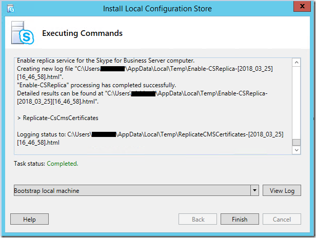

# <a name="disable-tls-1011-in-skype-for-business-server-2015"></a>Deshabilitar TLS 1.0/1.1 en Skype para Business Server 2015

El propósito de este artículo es proporcionar las instrucciones necesarias para preparar e implementar deshabilitar TLS 1.0 y 1.1 en sus entornos. Este proceso requiere extensa planificación y preparación. Por favor, revise toda la información de este artículo cuidadosamente a medida que el plan para deshabilitar TLS 1.0 y 1.1 para su organización. Tenga en cuenta que hay muchas dependencias externas y las condiciones de conectividad que podrían verse afectadas por deshabilitar TLS 1.0/1.1, planeación y pruebas amplias por lo que está justificado.

## <a name="in-this-article"></a>En este artículo

- [Fondo y ámbito](#background)
- [Los requisitos previos y proceso](#prerequisites-and-process)
- [Escenarios de implementación avanzada](#advanced-deployment-scenarios)

## <a name="background"></a>Información general

Los controladores principales para proporcionar TLS 1.0 y 1.1 deshabilitar compatibilidad para Skype para Business Server local son los requisitos de Consejo de estándares de seguridad del sector de tarjetas de pago (PCI) y los estándares de procesamiento de información Federal. Puede encontrar más información para los requisitos de PCI [aquí](https://blog.pcisecuritystandards.org/are-you-ready-for-30-june-2018-sayin-goodbye-to-ssl-early-tls).  Microsoft no puede proporcionar información sobre si se requiere su organización a cumplir estos u otros requisitos. Debe determinar si es necesario para deshabilitar TLS 1.0 o 1.1 en sus entornos.

Microsoft ha publicado notas del producto en TLS disponibles [aquí](https://cloudblogs.microsoft.com/microsoftsecure/2017/06/20/tls-1-2-support-at-microsoft/), y también se recomienda el fondo leer disponibles en este [blog de Exchange](https://blogs.technet.microsoft.com/exchange/2018/01/26/exchange-server-tls-guidance-part-1-getting-ready-for-tls-1-2/).

## <a name="supportability-scope"></a>Ámbito de compatibilidad

*Ámbito* hace referencia a los límites de soporte. Para Skype para Business Server local, *en el ámbito* significa que se admiten y haya probado la deshabilitación de TLS 1.0 y 1.1 para las versiones del producto enumerados totalmente. *Actualmente se investigarse* significa simplemente; Estamos investigando activamente incorporación de estos productos en ámbito para deshabilitar la compatibilidad con TLS. *Fuera del ámbito* significa que estas versiones del producto no admiten deshabilitar TLS 1.0 o 1.1 y no funciona, con las excepciones indicadas.

### <a name="fully-tested-and-supported-servers"></a>Servidores totalmente probados y admitidos

- Skype para Business Server 2019
- Skype para Business Server 2015 CU6 HF2 6.0.9319.516 ([actualización de marzo 2018](https://support.microsoft.com/en-us/help/4086059/march-2018-cumulative-update-6-0-9319-516-for-skype-for-business)) y superior en: 
    - Windows Server 2012 (con 3140245 KB o actualización que reemplaza), 2012 R2 o 2016
- En contexto actualizado Skype para servidor empresarial 2015, con CU6 HF2 y superior en 
    - Windows Server 2008 R2, 2012 (con KB [3140245](https://support.microsoft.com/en-us/help/3140245/update-to-enable-tls-1-1-and-tls-1-2-as-a-default-secure-protocols-in) o actualización que reemplaza) o 2012 R2
- Conectividad de Exchange y Outlook Web App con RU19 de Exchange Server 2010 SP3 o posterior, instrucciones [aquí](https://blogs.technet.microsoft.com/exchange/2018/01/26/exchange-server-tls-guidance-part-1-getting-ready-for-tls-1-2/)
 
### <a name="fully-tested-and-supported-clients"></a>Clientes totalmente probados y admitidos

- Cliente de escritorio de Lync 2013 (Skype para la empresa), MSI y C2R, incluidos Basic [15.0.5023.1000 y posterior](https://support.microsoft.com/en-us/help/4018334/april-3-2018-update-for-skype-for-business-2015-lync-2013-kb4018334)
- Skype para el cliente de escritorio de 2016 empresarial, MSI [16.0.4678.1000 y posterior](https://support.microsoft.com/en-us/help/4018323/april-3-2018-update-for-skype-for-business-2016-kb4018323), incluidos Basic
- Skype para profesionales de 2016 clic ejecutar requieren las actualizaciones de [abril 2018](https://docs.microsoft.com/officeupdates/release-notes-office365-proplus) : 
    - Mensual y anual delimitadas dirigidas, 16\.0\.9126\.2152 y posterior
    - Anual delimitadas y canal aplazada, 16\.0\.8431\.2242 y posterior
- Skype para la empresa en Mac 16.15 y versiones posteriores
- Skype para empresariales para iOS y Android 6.19 y posterior
- Skype Web App 2015 CU6 HF2 y superior (se incluye con el servidor)

### <a name="currently-being-investigated"></a>Actualmente se investigarse

#### <a name="devices"></a>Dispositivos

- El sistema de sala de Lync (también conocido como SRSv1)
- Sistemas de salón de Skype v2 (también conocido como SRSv2)
- Surface Hub
- en función de 2015 dispositivo de sucursal con funciones de supervivencia (SBA) o servidor de sucursal con funciones de supervivencia (SBS)

#### <a name="other"></a>Otros

- Panel de calidad de llamadas (que se haya deshabilitado la nueva instalación después de TLS 1.0, 1.1, vea más adelante) *
 
### <a name="out-of-scope"></a>Fuera del ámbito

Excepto donde se indique, los siguientes productos no están en el ámbito de deshabilitar compatibilidad de TLS 1.0/1.1 y no funcionará en un entorno donde se han deshabilitado TLS 1.0 y 1.1.  Lo que esto significa: si todavía utiliza clientes o servidores fuera de ámbito, debe actualizar o quitar estos si necesita deshabilitar TLS 1.0/1.1 en cualquier lugar en su Skype para Business Server implementación local.

- Lync Server 2013
- Windows Server 2008 e inferior
- Lync para Mac 2011
- Lync 2013 para Mobile - iOS, iPad, Android o Windows Phone
- Cliente de Lync "MX" tienda Windows
- Todos los clientes de Lync 2010
- Lync Phone Edition - se actualizaron las instrucciones [aquí](https://techcommunity.microsoft.com/t5/Skype-for-Business-Blog/Certified-Skype-for-Business-Online-Phones-and-what-this-means/ba-p/120035).
- en función de 2013 dispositivo de sucursal con funciones de supervivencia (SBA) o servidor de sucursal con funciones de supervivencia (SBS)

### <a name="exceptions"></a>Excepciones

#### <a name="lync-server-2013"></a>Lync Server 2013

Lync Server 2013 tiene una dependencia en Windows Fabric versión 1.0.  En la fase de diseño para Lync Server 2013, Windows Fabric 1.0 se ha seleccionado para que su arquitectura distribuida nueva y atractiva proporcionar replicación, alta disponibilidad y tolerancia a errores.  Con el tiempo, ambos Skype para Business Server y Windows Fabric han mejorado considerablemente esta arquitectura conjunta con importante vuelva a diseñar en versiones posteriores.  Skype actual para Business 2015 Server usa Windows Fabric 3.0, por ejemplo.

Desafortunadamente, Windows Fabric 1.0 **no admite TLS 1.2.  Sin embargo, actualizaremos Lync Server 2013 para que funcione con TLS 1.2**. Esto se procedentes en la próxima actualización acumulativa para Lync Server 2013.  Nos permite proporcionar compatibilidad con TLS 1.2 para habilitar los escenarios de coexistencia, migración, federación y híbrida.

Si su organización se requiere para deshabilitar TLS 1.0 y 1.1, y que utiliza actualmente Lync Server 2013, se recomienda empezar el proceso de planeación, con la posibilidad de actualización en contexto es posible que deba o en paralelo migrar (nuevos grupos de servidores, mover usuarios) a Skype para Business Server 2015 o superior.  O bien, es posible que desee acelerar la migración a Skype para profesionales en línea.

#### <a name="call-quality-dashboard"></a>Panel de calidad de llamadas

Panel de calidad de llamada local actualmente tiene una dependencia en TLS 1.0 durante la instalación nueva (la primera vez a instalar en los entornos locales).  Se actualmente se investiga este problema y plan liberar una corrección en un futuro próximo.  Si tiene pensado instalar CQD y deshabilitar también TLS 1.0, se recomienda que complete la instalación de CQD en primer lugar y, a continuación, continuar con la deshabilitación de TLS 1.0.

#### <a name="third-party-devices"></a>Dispositivos de otros fabricantes

En dispositivos de otros fabricantes, como los teléfonos 3PIP, conferencias de vídeo, los servidores proxy inversos y los equilibradores de carga, asegúrese de validar la compatibilidad de TLS 1.2, probar detenidamente y póngase en contacto con el proveedor si es necesario.

### <a name="federation-considerations-when-disabling-tls-1011-on-edge-servers"></a>Consideraciones de federación al deshabilitar TLS 1.0/1.1 en los servidores perimetrales

Detenidamente debe planear y tenga en cuenta el impacto de deshabilitar TLS 1.0/1.1 en los servidores perimetrales.  Una vez que se deshabilitan TLS 1.0 y 1.1, es posible que encuentre que son otras organizaciones ya no podrá federarse con su organización.

Puede optar por mantener TLS 1.0/1.1 habilitada en los servidores perimetrales para mantener la compatibilidad con versiones anteriores con no revisadas (SfB 2015, Lync 2013) o sistemas externos de antiguos (2010).

Microsoft no puede proporcionar consejos o recomendaciones sobre si la red perimetral (o cualquier red) explicar PCI estándar; que se determinará por la compañía individual.

Skype para profesionales en línea es capaz de TLS 1.2 en la actualidad, por lo que no se espera ningún impacto híbrida y federación con Online.

Mensajería instantánea pública (conectividad de mensajería instantánea pública) al servicio de consumidor de Skype: Esperamos que no deshabilitar TLS 1.0/1.1 para afectar a [La conectividad de Skype](../../deploy/deploy-skype-connectivity.md); Las puertas de enlace de mensajería instantánea pública de Microsoft ya están capaz de TLS 1.2.

## <a name="prerequisites-and-process"></a>Los requisitos previos y proceso

Excepto donde se indicó anteriormente, una vez TLS 1.0 y 1.1 están deshabilitados servidores fuera de ámbito, clientes y dispositivos ya funcionará correctamente o en absoluto. Esto puede significar que desea pausar y espere a que se actualizaron las instrucciones de Microsoft. Una vez que esté satisfecho que cumple todos los requisitos y tener un plan para los intervalos de direcciones, continúe con.

En un nivel alto, mientras está listo para procedimiento durante la instalación, Skype para Business Server 2019 Skype para Business Server 2015 requerirá que instale CU6 HF2, aplicar actualizaciones de requisitos previos para .NET y SQL, implementación claves del registro de requisitos previos y, por último un independiente Round de configuración del sistema operativo actualiza (es decir, deshabilitar TLS 1.0 y 1.1 a través de importación de archivos de registro). Es muy importante que complete la instalación de todos los requisitos previos, incluidos Skype para Business Server 2015 CU6 HF2, antes de deshabilitar TLS 1.0 y 1.1 en cualquier servidor en el entorno. Cada Skype para Business server, incluida la función perimetral y back-ends de SQL, requiere las actualizaciones. Asegúrese también de que se han actualizado todos los clientes (en el ámbito) admitidos para las versiones mínimas necesarias. No olvide actualizar las estaciones de trabajo como administración.

Queremos que se deben seguir el orden de las operaciones de "en profundidad" habitual para actualizar Skype para servidores empresariales. Tratar los grupos de servidores Director, chat persistente y emparejada grupos de servidores de la misma manera que lo haría normalmente. Orden y los métodos de actualización que se tratan [aquí](topology.md) y [aquí](https://support.microsoft.com/en-us/help/3061064/updates-for-skype-for-business-server-2015).

### <a name="high-level-process"></a>Proceso de alto nivel

1. Todos los pasos de prueba en el laboratorio antes de configurar los servidores de producción.
2. Copia de seguridad y conservar una copia del registro exportado en cada servidor individual van a actualizar. No se pueden compartir registros entre servidores; que contienen claves únicas en el equipo.
3. Actualizar todos los Skype para los servidores de negocio 2015 a CU6 HF2 o superior. (Para Skype para Business Server 2019, no es necesario ningún CU)
4. Instalar los requisitos previos para todos los servidores.
5. Implementación de las claves del registro necesario como requisito previo.
6. Asegúrese de que se actualizan todos los clientes en el ámbito.
7. Deshabilitar TLS 1.0 y 1.1 mediante la importación del registro.
8. Validar que las cargas de trabajo funcionan según lo previsto.
    - Si se encuentran problemas, solución de problemas y resolver, o
    - Restaurar el registro desde el paso 2 para volver a habilitar TLS 1.0 y 1.1
9. Validar que se utiliza sólo TLS 1.2.

### <a name="install-prerequisites-to-all-servers"></a>Instalar los requisitos previos para todos los servidores

Se requiere la actualización de dependencia extensa antes de comenzar a deshabilitar TLS 1.0 y 1.1 en el nivel de sistema operativo en su Skype para las implementaciones empresariales Server 2015. Los siguientes son las versiones mínimas que pueden admitir TLS 1.2. Implementar todas las actualizaciones de requisitos previos en cada Skype para Business server en su entorno antes de comenzar a deshabilitar TLS 1.0 y 1.1.

- Skype para Business Server 2015 CU6 HF2 6.0.9319.516 ([actualización de marzo 2018](https://support.microsoft.com/en-us/help/4086059/march-2018-cumulative-update-6-0-9319-516-for-skype-for-business)) o superior
- [.NET framework 4.7](https://www.microsoft.com/en-us/download/details.aspx?id=55167) o superior con SchUseStrongCrypto habilitado en el registro (proporcionado a continuación)
- SQL debe actualizarse en todos los Skype para servidores de negocio 2015 y back-ends. Actualizar Enterprise Edition del grupo SQL back-ends en primer lugar, a continuación, su servidor respectivos. 
    - SQL Server 2014 SP1 + CU5 ([vínculo](https://support.microsoft.com/help/3130926)), o superior o SQL Server 2012 SP2 + CU16 o superior / RTM de SQL Server 2014 + CU12 ([vínculo](https://support.microsoft.com/en-us/help/3130923/cumulative-update-12-for-sql-server-2014)) o superior o SQL Server 2014 SP2
    - SQL Server Native Client para SQL Server 2012 ([vínculo](https://www.microsoft.com/en-us/download/details.aspx?id=50402))
    - 11 de controlador ODBC de Microsoft para SQL Server ([vínculo](https://www.microsoft.com/en-us/download/details.aspx?id=36434)) o superior
    - Shared objetos de administración de SQL Server 2014 SP2 ([vínculo](https://www.microsoft.com/en-in/download/details.aspx?id=42295))
    - SQLSysClrTypes para SQL server 2014 SP2 ([vínculo](https://www.microsoft.com/en-in/download/details.aspx?id=42295))

### <a name="basic-steps-to-install-pre-requisites-in-recommended-order-of-operations"></a>Pasos básicos para instalar los requisitos previos, en el orden recomendado de operaciones

1. Instalar el Skype para Business Server CU6HF2 (6.0.9319.516) actualizar a todos los servidores. 
    1. Instalar la actualización de componentes mediante el actualizador.
    2. Actualizar bases de datos de acuerdo con los procedimientos documentados. Las instrucciones se documentan en [https://support.microsoft.com/en-us/help/3061064/updates-for-skype-for-business-server-2015](https://support.microsoft.com/en-us/help/3061064/updates-for-skype-for-business-server-2015).
    3. Validar la funcionalidad del producto en la implementación antes de avanzar con cualquier otro cambio.
2. Descargar .NET 4.7 Installer sin conexión. 
    1. Referencia:[https://www.microsoft.com/en-us/download/details.aspx?id=55167](https://www.microsoft.com/en-us/download/details.aspx?id=55167)
    2. Asegúrese de que se detienen Skype para Business Server 2015 servicios en el servidor Front-End.
    3. Referencia:[https://support.microsoft.com/en-us/help/3061064/updates-for-skype-for-business-server-2015](https://support.microsoft.com/en-us/help/3061064/updates-for-skype-for-business-server-2015)
    4. Ex (Standard Edition): Stop-CsWindowsServices
    5. Ex (Enterprise Edition): Invoke-CsComputerFailover
    6. Ejecute el paquete de instalación.
    7. Reinicie el servidor.
3. Actualización de SQL Express 2014 en todos los servidores. 
    1. Referencia:[https://support.microsoft.com/en-us/help/3135244/tls-1-2-support-for-microsoft-sql-server](https://support.microsoft.com/en-us/help/3135244/tls-1-2-support-for-microsoft-sql-server)
    2. Descargar el SP2 de SQL de 2014 
        - Referencia:[https://www.microsoft.com/en-us/download/details.aspx?id=53168](https://www.microsoft.com/en-us/download/details.aspx?id=53168)
    3. Copie los medios de instalación en una carpeta en el servidor (ej: C:\01_2014SqlSp2)
    4. Asegúrese de Skype para Business Server 2015 servicios se detienen en el servidor Front-End 
        - Ex (Standard Edition): Stop-CsWindowsService
        - Ex (Enterprise Edition): Invoke-CsComputerFailove
    5. Abra un símbolo del sistema de administración y actualizar todos los componentes instalados e instancias 
        - Ejemplo: C:\01_2014SqlSp2\SQLServer2014SP2-KB3171021-x64-ENU.exe/Action de /IAcceptSQLServerLicenseTerms /qs = revisión /AllInstances
4. Actualización de SQL Native Client. 
    1. Referencia: [https://support.microsoft.com/en-us/help/3135244/tls-1-2-support-for-microsoft-sql-server](https://support.microsoft.com/en-us/help/3135244/tls-1-2-support-for-microsoft-sql-server).
    2. Descargar desde[https://www.microsoft.com/en-us/download/details.aspx?id=50402](https://www.microsoft.com/en-us/download/details.aspx?id=50402)
    3. Asegúrese de Skype para Business Server 2015 servicios se detienen en el servidor Front-End. 
        - Ex (Standard Edition): Stop-CsWindowsServices
        - Ex (Enterprise Edition): Invoke-CsComputerFailove
    4. Detener las instancias de SQL instaladas se ejecuten 
        - Ex: Get-Service 'MSSQL$ RTCLOCAL' | Detener servicios
        - Ex: Get-Service 'MSSQL$ LYNCLOCAL' | Detener servicios
        - Ex (Standard Edition sólo): Get-Service 'MSSQL$ RTC' | Detener servicios
    5. Instale la actualización.
5. Actualizar el controlador ODBC 11 para SQL Server. 
    1. Referencia: [https://support.microsoft.com/en-us/help/3135244/tls-1-2-support-for-microsoft-sql-server](https://support.microsoft.com/en-us/help/3135244/tls-1-2-support-for-microsoft-sql-server).
    2. Descargar desde[https://www.microsoft.com/en-us/download/confirmation.aspx?id=36434](https://www.microsoft.com/en-us/download/confirmation.aspx?id=36434)
    3. Asegúrese de que se detienen Skype para Business Server 2015 servicios en el servidor Front-End 
        - Ex (Standard Edition): Stop-CsWindowsService
        - Ex (Enterprise Edition): Invoke-CsComputerFailove
    4. Instale la actualización.
6. Implementación de las claves del registro necesario como requisito previo.

### <a name="pre-requisite-registry-keys"></a>Claves del registro de requisitos previos

Copiar y pegar la prueba siguiente en el Bloc de notas y cambie el nombre TLSPreReq.reg o un nombre de su elección, a continuación, importar:

```
Windows Registry Editor Version 5.00

[HKEY_LOCAL_MACHINE\SOFTWARE\Microsoft\.NETFramework\v2.0.50727]

"SchUseStrongCrypto"=dword:00000001

[HKEY_LOCAL_MACHINE\SOFTWARE\Microsoft\.NETFramework\v4.0.30319]

"SchUseStrongCrypto"=dword:00000001

[HKEY_LOCAL_MACHINE\SOFTWARE\Wow6432Node\Microsoft\.NETFramework\v2.0.50727]

"SchUseStrongCrypto"=dword:00000001

[HKEY_LOCAL_MACHINE\SOFTWARE\Wow6432Node\Microsoft\.NETFramework\v4.0.30319]

"SchUseStrongCrypto"=dword:00000001

[HKEY_LOCAL_MACHINE\SOFTWARE\Microsoft\Windows\CurrentVersion\Internet Settings\WinHttp]

"DefaultSecureProtocols"=dword:00000AA0

[HKEY_LOCAL_MACHINE\SOFTWARE\Wow6432Node\Microsoft\Windows\CurrentVersion\Internet Settings\WinHttp]

"DefaultSecureProtocols"=dword:00000AA0

[HKEY_LOCAL_MACHINE\SYSTEM\CurrentControlSet\Control\SecurityProviders\SCHANNEL\Protocols\TLS 1.2]

[HKEY_LOCAL_MACHINE\SYSTEM\CurrentControlSet\Control\SecurityProviders\SCHANNEL\Protocols\TLS 1.2\Client]

"DisabledByDefault"=dword:00000000

"Enabled"=dword:00000001

[HKEY_LOCAL_MACHINE\SYSTEM\CurrentControlSet\Control\SecurityProviders\SCHANNEL\Protocols\TLS 1.2\Server]

"DisabledByDefault"=dword:00000000

"Enabled"=dword:00000001
```

Para SQL back end para grupos de servidores Enterprise Edition, los requisitos previos y TLS deshabilita debe tratarse como haría con cualquier actualizaciones SQL o el sistema operativo; consulte:[https://docs.microsoft.com/skypeforbusiness/manage/topology/patch-or-update-a-back-end-or-standard-edition-server](https://docs.microsoft.com/skypeforbusiness/manage/topology/patch-or-update-a-back-end-or-standard-edition-server)

Mientras que la aplicación de requisitos previos y TLS deshabilitar pasos se pueden combinar, se recomienda encarecidamente que se aplican todos los requisitos previos antes de continuar con la desactivación de TLS 1.0 y 1.1 en el nivel de sistema operativo. El enfoque en mejores prácticas sería preparar el entorno mediante la implementación de todos los requisitos previos, validar que las cargas de trabajo todos los funcionen correctamente y como se esperaba y, a continuación, continuar con TLS 1.0/1.1 Deshabilitar en un momento posterior.

### <a name="disable-tls-10-and-11-via-registry-import"></a>Deshabilitar TLS 1.0 y 1.1 mediante la importación del registro

Antes de seguir con los pasos siguientes, *Asegúrese de haber completado todos los requisitos previos y se actualizó Skype para servidores empresariales*.

Copie el siguiente texto en un archivo de Bloc de notas y cámbiele el nombre **TLSDisable.reg**:

```
Windows Registry Editor Version 5.00

[HKEY_LOCAL_MACHINE\SOFTWARE\Policies\Microsoft\Cryptography\Configuration\SSL\00010002]

"Functions"="TLS_ECDHE_ECDSA_WITH_AES_256_GCM_SHA384_P384,TLS_ECDHE_ECDSA_WITH_AES_128_GCM_SHA256_P256,TLS_ECDHE_RSA_WITH_AES_256_GCM_SHA384_P384,TLS_ECDHE_RSA_WITH_AES_128_GCM_SHA256_P256,TLS_ECDHE_ECDSA_WITH_AES_256_CBC_SHA384_P384,TLS_ECDHE_ECDSA_WITH_AES_128_CBC_SHA256_P256,TLS_ECDHE_RSA_WITH_AES_256_CBC_SHA384_P384,TLS_ECDHE_RSA_WITH_AES_128_CBC_SHA256_P256,TLS_RSA_WITH_AES_256_GCM_SHA384,TLS_RSA_WITH_AES_128_GCM_SHA256,TLS_RSA_WITH_AES_256_CBC_SHA256,TLS_RSA_WITH_AES_128_CBC_SHA256"

[HKEY_LOCAL_MACHINE\SYSTEM\CurrentControlSet\Control\SecurityProviders\SCHANNEL]

"AllowInsecureRenegoClients"=dword:00000000

"AllowInsecureRenegoServers"=dword:00000000

[HKEY_LOCAL_MACHINE\SYSTEM\CurrentControlSet\Control\SecurityProviders\SCHANNEL\Ciphers]

[HKEY_LOCAL_MACHINE\SYSTEM\CurrentControlSet\Control\SecurityProviders\SCHANNEL\Ciphers\AES 128/128]

"Enabled"=dword:FFFFFFFF

[HKEY_LOCAL_MACHINE\SYSTEM\CurrentControlSet\Control\SecurityProviders\SCHANNEL\Ciphers\AES 256/256]

"Enabled"=dword:FFFFFFFF

[HKEY_LOCAL_MACHINE\SYSTEM\CurrentControlSet\Control\SecurityProviders\SCHANNEL\Ciphers\DES 56/56]

"Enabled"=dword:00000000

[HKEY_LOCAL_MACHINE\SYSTEM\CurrentControlSet\Control\SecurityProviders\SCHANNEL\Ciphers\NULL]

"Enabled"=dword:00000000

[HKEY_LOCAL_MACHINE\SYSTEM\CurrentControlSet\Control\SecurityProviders\SCHANNEL\Ciphers\RC2 128/128]

"Enabled"=dword:00000000

[HKEY_LOCAL_MACHINE\SYSTEM\CurrentControlSet\Control\SecurityProviders\SCHANNEL\Ciphers\RC2 40/128]

"Enabled"=dword:00000000

[HKEY_LOCAL_MACHINE\SYSTEM\CurrentControlSet\Control\SecurityProviders\SCHANNEL\Ciphers\RC2 56/128]

"Enabled"=dword:00000000

[HKEY_LOCAL_MACHINE\SYSTEM\CurrentControlSet\Control\SecurityProviders\SCHANNEL\Ciphers\RC2 56/56]

"Enabled"=dword:00000000

[HKEY_LOCAL_MACHINE\SYSTEM\CurrentControlSet\Control\SecurityProviders\SCHANNEL\Ciphers\RC4 128/128]

"Enabled"=dword:00000000

[HKEY_LOCAL_MACHINE\SYSTEM\CurrentControlSet\Control\SecurityProviders\SCHANNEL\Ciphers\RC4 40/128]

"Enabled"=dword:00000000

[HKEY_LOCAL_MACHINE\SYSTEM\CurrentControlSet\Control\SecurityProviders\SCHANNEL\Ciphers\RC4 56/128]

"Enabled"=dword:00000000

[HKEY_LOCAL_MACHINE\SYSTEM\CurrentControlSet\Control\SecurityProviders\SCHANNEL\Ciphers\RC4 64/128]

"Enabled"=dword:00000000

[HKEY_LOCAL_MACHINE\SYSTEM\CurrentControlSet\Control\SecurityProviders\SCHANNEL\Ciphers\Triple DES 168]

"Enabled"=dword:00000000

[HKEY_LOCAL_MACHINE\SYSTEM\CurrentControlSet\Control\SecurityProviders\SCHANNEL\Hashes]

[HKEY_LOCAL_MACHINE\SYSTEM\CurrentControlSet\Control\SecurityProviders\SCHANNEL\Hashes\MD5]

"Enabled"=dword:00000000

[HKEY_LOCAL_MACHINE\SYSTEM\CurrentControlSet\Control\SecurityProviders\SCHANNEL\Hashes\SHA]

"Enabled"=dword:FFFFFFFF

[HKEY_LOCAL_MACHINE\SYSTEM\CurrentControlSet\Control\SecurityProviders\SCHANNEL\Hashes\SHA256]

"Enabled"=dword:FFFFFFFF

[HKEY_LOCAL_MACHINE\SYSTEM\CurrentControlSet\Control\SecurityProviders\SCHANNEL\Hashes\SHA384]

"Enabled"=dword:FFFFFFFF

[HKEY_LOCAL_MACHINE\SYSTEM\CurrentControlSet\Control\SecurityProviders\SCHANNEL\Hashes\SHA512]

"Enabled"=dword:FFFFFFFF

[HKEY_LOCAL_MACHINE\SYSTEM\CurrentControlSet\Control\SecurityProviders\SCHANNEL\KeyExchangeAlgorithms]

[HKEY_LOCAL_MACHINE\SYSTEM\CurrentControlSet\Control\SecurityProviders\SCHANNEL\KeyExchangeAlgorithms\Diffie-Hellman]

"Enabled"=dword:FFFFFFFF

[HKEY_LOCAL_MACHINE\SYSTEM\CurrentControlSet\Control\SecurityProviders\SCHANNEL\KeyExchangeAlgorithms\ECDH]

"Enabled"=dword:FFFFFFFF

[HKEY_LOCAL_MACHINE\SYSTEM\CurrentControlSet\Control\SecurityProviders\SCHANNEL\KeyExchangeAlgorithms\PKCS]

"Enabled"=dword:FFFFFFFF

[HKEY_LOCAL_MACHINE\SYSTEM\CurrentControlSet\Control\SecurityProviders\SCHANNEL\Protocols]

[HKEY_LOCAL_MACHINE\SYSTEM\CurrentControlSet\Control\SecurityProviders\SCHANNEL\Protocols\Multi-Protocol Unified Hello]

[HKEY_LOCAL_MACHINE\SYSTEM\CurrentControlSet\Control\SecurityProviders\SCHANNEL\Protocols\Multi-Protocol Unified Hello\Client]

"DisabledByDefault"=dword:00000001

"Enabled"=dword:00000000

[HKEY_LOCAL_MACHINE\SYSTEM\CurrentControlSet\Control\SecurityProviders\SCHANNEL\Protocols\Multi-Protocol Unified Hello\Server]

"DisabledByDefault"=dword:00000001

"Enabled"=dword:00000000

[HKEY_LOCAL_MACHINE\SYSTEM\CurrentControlSet\Control\SecurityProviders\SCHANNEL\Protocols\PCT 1.0]

[HKEY_LOCAL_MACHINE\SYSTEM\CurrentControlSet\Control\SecurityProviders\SCHANNEL\Protocols\PCT 1.0\Client]

"DisabledByDefault"=dword:00000001

"Enabled"=dword:00000000

[HKEY_LOCAL_MACHINE\SYSTEM\CurrentControlSet\Control\SecurityProviders\SCHANNEL\Protocols\PCT 1.0\Server]

"DisabledByDefault"=dword:00000001

"Enabled"=dword:00000000

[HKEY_LOCAL_MACHINE\SYSTEM\CurrentControlSet\Control\SecurityProviders\SCHANNEL\Protocols\SSL 2.0]

[HKEY_LOCAL_MACHINE\SYSTEM\CurrentControlSet\Control\SecurityProviders\SCHANNEL\Protocols\SSL 2.0\Client]

"DisabledByDefault"=dword:00000001

"Enabled"=dword:00000000

[HKEY_LOCAL_MACHINE\SYSTEM\CurrentControlSet\Control\SecurityProviders\SCHANNEL\Protocols\SSL 2.0\Server]

"DisabledByDefault"=dword:00000001

"Enabled"=dword:00000000

[HKEY_LOCAL_MACHINE\SYSTEM\CurrentControlSet\Control\SecurityProviders\SCHANNEL\Protocols\SSL 3.0]

[HKEY_LOCAL_MACHINE\SYSTEM\CurrentControlSet\Control\SecurityProviders\SCHANNEL\Protocols\SSL 3.0\Client]

"DisabledByDefault"=dword:00000001

"Enabled"=dword:00000000

[HKEY_LOCAL_MACHINE\SYSTEM\CurrentControlSet\Control\SecurityProviders\SCHANNEL\Protocols\SSL 3.0\Server]

"DisabledByDefault"=dword:00000001

"Enabled"=dword:00000000

[HKEY_LOCAL_MACHINE\SYSTEM\CurrentControlSet\Control\SecurityProviders\SCHANNEL\Protocols\TLS 1.0]

[HKEY_LOCAL_MACHINE\SYSTEM\CurrentControlSet\Control\SecurityProviders\SCHANNEL\Protocols\TLS 1.0\Client]

"DisabledByDefault"=dword:00000001

"Enabled"=dword:00000000

[HKEY_LOCAL_MACHINE\SYSTEM\CurrentControlSet\Control\SecurityProviders\SCHANNEL\Protocols\TLS 1.0\Server]

"DisabledByDefault"=dword:00000001

"Enabled"=dword:00000000

[HKEY_LOCAL_MACHINE\SYSTEM\CurrentControlSet\Control\SecurityProviders\SCHANNEL\Protocols\TLS 1.1]

[HKEY_LOCAL_MACHINE\SYSTEM\CurrentControlSet\Control\SecurityProviders\SCHANNEL\Protocols\TLS 1.1\Client]

"DisabledByDefault"=dword:00000001

"Enabled"=dword:00000000

[HKEY_LOCAL_MACHINE\SYSTEM\CurrentControlSet\Control\SecurityProviders\SCHANNEL\Protocols\TLS 1.1\Server]

"DisabledByDefault"=dword:00000001

"Enabled"=dword:00000000
```

Importar el archivo .reg en cada servidor que desea deshabilitar TLS 1.0 y 1.1. Reinicie el servidor. Una vez que los servicios se han vuelva a conectarse, mover para el servidor del próximo. El enfoque para grupos de servidores Enterprise Edition es el mismo que usaría para cualquier actualización del sistema operativo.

Es posible que haya observado que hacemos más que sólo deshabilitar TLS 1.0 y 1.1 aquí. Nos estamos soporte conjunto cifrado Reordenar (tal como se muestra anteriormente) y la deshabilitación de algunos cifrados débiles más antiguos. Esta es la primera vez que nos hemos admitidas oficialmente estos cambios a SCHANNEL y API de criptografía en Skype para Business Server y es importante tener en cuenta que estos cambios son los únicos se admite y se ha probado en este momento. Se pueden tener en cuenta configuraciones adicionales en el futuro, pero por ahora, no modifique el archivo de importación del registro en su implementación.

### <a name="validate-that-workloads-are-functioning-as-expected"></a>Validar que las cargas de trabajo funcionan según lo esperado

Una vez que se han deshabilitado TLS 1.0 y 1.1 en su entorno, asegúrese de que todas las cargas de trabajo principales funcionan como se esperaba, como mensajería instantánea y presencia, P2P las llamadas, Enterprise Voice, etcetera.

**Validar sólo TLS 1.2 se está usando**

El equipo de seguridad para que realice una auditoría de nuevo de Skype para el tráfico de negocio para asegurarse de que la versión más antigua los protocolos TLS 1.0 y 1.1 ya no están en uso.

Como alternativa, puede usar Internet Explorer para probar las conexiones TLS a los servicios web de Skype para Business Server 2015 después de que se han deshabilitado TLS 1.0 y 1.1 de TLS.

1. Inicie Internet Explorer.
2. Seleccione **Herramientas** > **Opciones de Internet**.
3. Seleccione la ficha **Opciones avanzadas** .
4. En **configuración**, desplácese hasta la parte inferior.
5. Compruebe que estén habilitadas TLS 1.0, 1.1 TLS y TLS 1.2.
6. Examinar la URL del servicio Web interno de su grupo de SfB 2015 (debe conectarse correctamente).
7. Vuelva atrás en el Explorador de Internet y deshabilitar la opción de **Usar TLS 1.2** sólo.
8. Examinar la URL del servicio Web interna de nuevo su grupo SfB 2015 (debe no se pueda conectar).


## <a name="advanced-deployment-scenarios"></a>Escenarios de implementación avanzada

Debido a que algunos requisitos previos de dependencia son necesarios para admitir TLS 1.2 en Skype para profesionales Ser 2015, la instalación desde los medios RTM producirá un error en cualquier sistema donde se han deshabilitado TLS 1.0 y 1.1.

**Una vez que se han deshabilitado en el entorno de TLS 1.0 y 1.1, implementar nuevos servidores Standard Edition o grupos de servidores Enterprise Edition.**

**Opción 1:** Use [SmartSetup](../../deploy/install/install-skype-for-business-server.md). Tenga en cuenta que se está actualizando SmartSetup para dar cabida a los archivos binarios actualizados de SQL en un futuro CU y se actualizará en el futuro en este artículo.

**Opción 2:** Previos a la instalación locales instancias de SQL (RTCLOCAL y LYNCLOCAL)

1. Descargue y copie SQL Express 2014 SP2 (SQLEXPR_x64.exe) en la carpeta local en FE. Supongamos ruta a la carpeta < SQL_FOLDER_PATH >.
2. Inicie PowerShell o el símbolo del sistema y vaya a < SQL_FOLDER_PATH >.
3. Crear la instancia de SQL RTCLOCAL ejecutando el siguiente comando. Espere hasta que finalice SQLEXPR_x64.exe antes de continuar:

    SQLEXPR_x64.exe /Q /IACCEPTSQLSERVERLICENSETERMS /UPDATEENABLED = / Action /HIDECONSOLE 0 = Install/características = SQLEngine, herramientas/instancename = RTCLOCAL /TCPENABLED = 1 /SQLSVCACCOUNT = "NT AUTHORITY\NetworkService" /SQLSYSADMINACCOUNTS = "Builtin\ Los administradores"/BROWSERSVCSTARTUPTYPE ="Automatic"/AGTSVCACCOUNT ="NTAUTHORITY\NetworkService"/SQLSVCSTARTUPTYPE = automáticamente
1. Crear la instancia de SQL LYNCLOCAL ejecutando el siguiente comando. Espere hasta que finalice SQLEXPR_x64.exe antes de continuar con el siguiente paso:

    SQLEXPR_x64.exe /Q /IACCEPTSQLSERVERLICENSETERMS /UPDATEENABLED = / Action /HIDECONSOLE 0 = Install/características = SQLEngine, herramientas/instancename = LYNCLOCAL /TCPENABLED = 1 /SQLSVCACCOUNT = "NT AUTHORITY\NetworkService" /SQLSYSADMINACCOUNTS = "Builtin\ Los administradores"/BROWSERSVCSTARTUPTYPE ="Automatic"/AGTSVCACCOUNT ="NTAUTHORITY\NetworkService"/SQLSVCSTARTUPTYPE = automático
1. Ejecute Skype para el programa de instalación de Business Server 2015 RTM.
2. Siga los pasos restantes de la sección Requisitos previos anterior.

**Opción 3:** Es posible que reemplace también manualmente los archivos binarios en un directorio de medios de instalación local como sigue:

1. [Instalar los requisitos previos de Skype para Business Server](../../deploy/install/install-prerequisites.md)  
2. 2. Instale .NET 4.7: 
      - **Nota:** Se introdujo por primera vez compatibilidad para .NET 4.7 en Skype para servidor 2015 CU5 + Business (6.0.9319.281). Por lo tanto, en pasos posteriores siguientes actualizaremos los componentes principales antes de la instalación principal.
      - Descarga: https://www.microsoft.com/en-us/download/details.aspx?id=55167.
      - Referencia: [Software que debe instalarse antes de una Skype para la implementación empresarial Server 2015](../../plan-your-deployment/requirements-for-your-environment/server-requirements.md#software-that-should-be-installed-before-a-skype-for-business-server-2015-deployment)
3. Copie los archivos y carpetas ISO: 
    - Con Skype para Business Server 2015 ISO adjunto, abra el directorio raíz de la unidad se adjunta como (ej: D:\) en el Explorador de archivos.
    - Copie todos los archivos y carpetas en una carpeta en un disco local (ej: C:\SkypeForBusiness2015ISO).
    - **Nota:** Antes de instalar los componentes, algunos archivos se necesitan actualizarse para la compatibilidad con TLS 1.2.
4. Reemplace los paquetes MSI o EXE: 
    - Reemplace los paquetes MSI and EXE existentes en la carpeta/amd64//Setup de los medios de instalación en el equipo local.
    - SP2 de 2014 SQL Express:https://www.microsoft.com/en-us/download/details.aspx?id=53167 
        - Cambie el nombre a SQLEXPR_x64 en el equipo local y reemplace el archivo existente en el programa de instalación o amd64/carpeta de los medios de instalación.
    - SQL Native Client:https://www.microsoft.com/en-us/download/details.aspx?id=50402 
        - **Nota:** Cambiar el nombre de esto si es necesario sqlncli.msi y, a continuación, reemplazar el archivo existente que se encuentra en el programa de instalación o amd64/carpeta de los medios de instalación.
    - Objetos de administración de SQL:https://www.microsoft.com/en-us/download/details.aspx?id=53164 
        - **Nota:** El paquete de características tendrán una gran cantidad de elementos que se pueden descargar. Seleccione esta opción para descargar sólo SharedManagementObjects.msi.
        - **Nota:** Reemplazar el archivo existente que se encuentra en el programa de instalación o amd64/carpeta de los medios de instalación.
    - Tipos CLR de SQL:https://www.microsoft.com/en-us/download/details.aspx?id=53164 
        - **Nota:** El paquete de características tendrán una gran cantidad de elementos que se pueden descargar. Seleccione esta opción para descargar CQLSysClrTypes.msi sólo
        - **Nota**: reemplazar el archivo existente que se encuentra en el programa de instalación o amd64/carpeta de los medios de instalación.
5. Instale los componentes principales: 
    - Ejecute Setup.exe desde el programa de instalación o amd64/carpeta de los medios de instalación. Siga las instrucciones para instalar los componentes principales
    - Cierre los componentes principales.
6. Actualizar los componentes principales: 
    - Descargue el Skype para el instalador de la actualización de negocio.
    - Ejecute el programa de instalación para actualizar los componentes principales e instalar los contadores de rendimiento.
    - **Nota:** A partir de la versión de CU6HF2, la característica de actualización automática actualmente sólo instalará hasta CU6. Por lo tanto, se debe ejecutar el actualizador por separado para actualizar los componentes principales a 6.0.9319.516.
    - Referencia:https://support.microsoft.com/en-us/help/3061064/updates-for-skype-for-business-server-2015
7. Instalar las herramientas administrativas (opcionales): 
    - Esto instalará el cliente nativo de Microsoft SQL Server 2012, objetos de administración 2014 (x64) SQL Server y Microsoft System CLR Types para SQL Server 2014 (x64) con los archivos actualizados. Además, el Skype para Business Server 2015 Topology Builder y Panel de Control estará disponible en la máquina local.
8. Almacén de configuración de instalación Local (paso 1): 
     - Abra el Asistente para la implementación, haga clic en instalar o actualizar Skype para Business Server System y haga clic en **Ejecutar** en el paso 1: instalar almacén de configuración Local.
     - Haga clic en **siguiente** en el cuadro de diálogo **Instalar almacén de configuración Local** .
     
     - Revise los resultados y asegúrese de que el estado de la tarea se ha completado. Revise el archivo de registro resultante haciendo clic en **Ver registro**.
     
     - Haga clic en **Finalizar**.
9. Establecer o quitar Skype para los componentes de servidor empresariales (paso 2):
    - Abra el Asistente para la implementación, haga clic en **instalar o actualización de Skype para Business Server System**y haga clic en **Ejecutar** en el paso 2: configurar o quitar Skype para los componentes de servidor empresariales
    - Haga clic en **siguiente** en la Skype establecer seguridad para el cuadro de diálogo componentes de servidor empresarial.
    
    - Revise el registro de uso de registro de vista y validar que el programa de instalación ha finalizado sin problemas. 
    - Haga clic en **Finalizar**.
10. Continuar con la instalación adicional y la configuración según sea necesario (puede reanudar los procedimientos de instalación normal en este momento).
