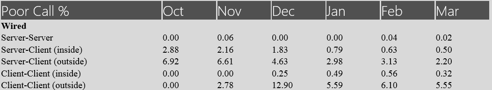

# <a name="cqd-development-samples"></a>Ejemplos de desarrollo del Panel de calidad de llamadas

**Resumen:** Revise un tutorial y ejemplos de desarrollo para el Panel de calidad de llamadas. El Panel de calidad de llamadas es una herramienta para Skype Empresarial Server.

En este artículo se proporciona un tutorial y ejemplos sobre el desarrollo del Panel de calidad de llamadas (CQD).

## <a name="call-quality-dashboard-cqd-development-samples"></a>Ejemplos de desarrollo del Panel de calidad de llamadas (CQD)

Tutorial: Creación de una presentación de informes personalizada con las API del servicio de datos de CQD y del servicio de repositorio.

### <a name="introduction-to-cqd"></a>Introducción al CQD

El CQD ofrece un acceso rápido y fácil a la información de calidad de llamadas agregada para las implementaciones locales de Skype Empresarial Server. El CQD consta de tres componentes: la base de datos de archivo qoE, el cubo y el portal. El portal es la capa de presentación principal y se puede dividir en los tres componentes siguientes:

1. Servicio de datos, que es accesible para los usuarios autenticados a través de la API de datos para el Panel de calidad de llamadas [(CQD) en Skype Empresarial Server.](data-api.md)

2. Servicio de repositorio, que es accesible para los usuarios autenticados a través de la API de repositorio para el Panel de calidad de llamadas [(CQD) en Skype Empresarial Server.](repository-api.md)

3. Portal web, que es la interfaz basada en HTML5 con la que los usuarios del CQD ven e interactúan. Esto es accesible para los usuarios autenticados.

Los informes que se muestran en el portal web se agrupan en "conjuntos de informes". La figura muestra un conjunto de informes con dos informes. Cada informe de este panel siguiente muestra los resultados de la consulta sobre el número de llamadas buenas, llamadas deficientes y porcentaje de llamadas deficientes durante varios meses, con varios filtros aplicados. 


El CQD se crea siguiendo la Metodología de calidad de llamadas (CQM), por lo que el conjunto predeterminado de informes está diseñado para alinearse con el flujo de investigación introducido por CQM. Los usuarios también tienen la flexibilidad de editar o crear informes personalizados para satisfacer sus necesidades. Sin embargo, dado que hay varias formas de visualizar los datos, la visualización proporcionada por el CQD puede no satisfacer completamente las necesidades de cada usuario. En estas situaciones, un usuario puede aprovechar las API de datos y las API de repositorio para crear páginas de informes personalizadas. Vamos a ver una serie de ejemplos en este tutorial.

### <a name="how-the-dashboard-consumes-the-data-service"></a>Cómo usa el panel el servicio de datos

Al navegar a la página principal del CQD (por ejemplo, el conjunto de informes y los informes correspondientes de un usuario autenticado y autorizado se recuperarán del servicio http://localhost/cqd) de repositorio. Se construirá una dirección URL completa a partir del identificador del conjunto de informes y el año-mes (el identificador del conjunto de informes es el número entero después de la sección "/#/" en la dirección URL y, de forma predeterminada, el año-mes actual se anexa al final del identificador del conjunto de informes después de la barra diagonal). Las definiciones de informe se almacenan en formato JSON y, cuando se recuperan del servicio de repositorio, se usarán como entrada para el servicio de datos. El servicio de datos genera consultas de expresiones multi dimension (MDX) basadas en la entrada y, a continuación, ejecuta estas consultas MDX en el cubo para recuperar datos para cada informe. 

### <a name="building-customized-reports"></a>Creación de informes personalizados

El CQD ya tiene mucha flexibilidad a la hora de personalizar informes, pero puede haber situaciones en las que los usuarios quieran agregar datos en varios informes creados en el CQD. Por ejemplo, podría ser necesario crear un informe que muestre los porcentajes de llamadas deficientes de todas las combinaciones posibles de llamadas cableadas en una tabla (un resultado como la figura):



Con el Portal proporcionado por el CQD, un usuario tendría que navegar a varios informes para extraer y registrar el porcentaje de llamadas deficientes para cada uno de ellos, lo que puede ser laborioso si hay muchos puntos de datos que deben recopilarse. Las API de datos proporcionan a los usuarios una forma de hacerlo mediante programación, mediante la recuperación de datos del servicio de datos (por ejemplo, a través de llamadas AJAX). 

 **Ejemplo 1: ejemplo de informe simple**

Veamos un ejemplo sencillo en primer lugar. Si queremos mostrar el recuento de secuencias de audio buena y mala de audio de febrero de 2015 en una página HTML como la figura:


Lo que necesitamos es enviar una llamada al servicio de datos con los parámetros adecuados y mostrar los resultados de la consulta en una tabla HTML. A continuación se muestra un ejemplo del código JavaScript:

```javascript        
$($.fn.freeFormReport = function (queries, urlApi, presentation) {
            var query = {
                Dimensions: [{ DataModelName: '[StartDate].[Month]' }],
                Filters: [{
                    DataModelName: '[StartDate].[Month]',
                    Value: '[2015-02-01T00:00:00]',
                    Operand: 0
                }],
                Measurements:
                    [{ DataModelName: '[Measures].[Audio Good Streams JPDR Count]' },
                     { DataModelName: '[Measures].[Audio Poor Streams JPDR Count]' },]
            };            

            $.ajax({
                url: 'http://localhost/QoEDataService/RunQuery',
                data: JSON.stringify(query),
                type: 'POST',
                async: true,
                contentType: 'application/json;charset=utf-8',
                success: function (data) {
                    //This is the jQuery syntax for document.GetElementById()
                    $('#AudioGoodStreamsJPDRCount').html(data.DataResult[0][1]);
                    $('#AudioPoorStreamsJPDRCount').html(data.DataResult[0][2]);
                }
                error: function (error) {
                    alert('Error getting data, check that the data service is running and that the URL is correct.');
           }
            });
        });
```

Este ejemplo se puede desconstruir en tres pasos:

1. Construya la consulta (en el ejemplo se define en la variable 'query'). La consulta se define como un objeto JSON, que incluye los siguientes datos:

   a. Cero o más dimensiones. Cada dimensión se indica mediante un DataModelName.

   b. Cero o más filtros. Cada filtro tiene:

   - DataModelName (la dimensión que tendrá el conjunto de filtros).

   - Valor (el valor que comparará el operando).

   - Operando (tipo de comparación, 0 significa "Igual").

     c. Una o más medidas.

2. Envíe la consulta al servicio de datos a través de una llamada AJAX. Deben proporcionarse los siguientes parámetros de solicitud:

   a. url (que debe ser http://[ServerName]/QoEDataService/RunQuery).

   b. (esta es la representación de cadena del objeto JSON definido en la variable 'query'). El servicio de datos devolverá los resultados de la consulta como parámetro de la función de devolución de llamada para que se devuelva correctamente.

   c. (para QoEDataService, RunQuery solo acepta solicitudes "POST").

   d. asincrónico (una marca que indica si la llamada AJAX debe ser sincrónica o asincrónica).

   e. contentType (debe ser "application/json").

   f. correcto (función de des llamada cuando la llamada AJAX finaliza correctamente).

   g. error (función de control de errores cuando se produce un error en la llamada AJAX).

3. Coloque los datos en elementos div en el código HTML (en el ejemplo del código, esto se realiza a través de la llamada de función anónima después de que la solicitud AJAX se complete correctamente).

Si se incluye el código JavaScript en una página HTML, la página mostrará un informe como el que se muestra en la figura. El html completo es el siguiente:

```javascript
<!DOCTYPE html>
<html xmlns="http://www.w3.org/1999/xhtml">
<head>
</head>
<body>
    <script src="OpenSourceSoftware/Scripts/jquery-2.1.1.js"></script>

    <script>
        $($.fn.freeFormReport = function (queries, urlApi, presentation) {

            var query = {
                Dimensions: [{ DataModelName: '[StartDate].[Month]' }],
                Filters: [{
                    DataModelName: '[StartDate].[Month]',
                    Value: '[2015-02-01T00:00:00]',
                    Operand: 0
                }],
                Measurements:
                    [{ DataModelName: '[Measures].[Audio Good Streams JPDR Count]' },
                     { DataModelName: '[Measures].[Audio Poor Streams JPDR Count]' },]
            };            

            $.ajax({
                url: 'http://localhost/QoEDataService/RunQuery',
                data: JSON.stringify(query),
                type: 'POST',
                async: true,
                contentType: 'application/json;charset=utf-8',
                success: function (data) {
                    //This is the jQuery syntax for document.GetElementById()
                    $('#AudioGoodStreamsJPDRCount').html(data.DataResult[0][1]);
                    $('#AudioPoorStreamsJPDRCount').html(data.DataResult[0][2]);
                }
                error: function (error) {
                    alert('Error getting data, check that the data service is running and that the URL is correct.');
           }

            });
        });
    </script>
    <table border="1">
        <tr>
            <td></td>
            <td><div>Audio Good Streams JPDR Count</div></td>
            <td><div>Audio Poor Streams JPDR Count</div></td>
        </tr>
        <tr>
            <td>February</td>
            <td><div id="AudioGoodStreamsJPDRCount"></div></td>
            <td><div id="AudioPoorStreamsJPDRCount"></div></td>
        </tr>
    </table>
</body>
</html>
```

Hasta ahora, el informe sigue siendo muy sencillo. El usuario puede agregar más medidas, dimensiones o filtros para personalizar el informe. Por ejemplo, si quieres mostrar el porcentaje de llamadas deficientes de AppSharing, debe agregarse una nueva medida relativa a AppSharing. Si desea mostrar todas las llamadas TCP v.s. Llamadas UDP, debe agregarse una nueva dimensión en relación con el tipo de transporte. Si desea mostrar el número de llamadas deficientes dentro de un edificio específico, debe agregarse un nuevo filtro para seleccionar las llamadas a y desde ese edificio.

 **Ejemplo 2: ejemplo de definición de informe**

Puede ser difícil para alguien averiguar cómo escribir la lista completa de medidas, dimensiones/filtros y sus valores correspondientes al construir una consulta. En este caso, puede ir al Portal, crear un informe con el editor de informes, ver la cadena JSON de la definición del informe y, a continuación, copiar la definición en un informe personalizado. 

En este ejemplo, crearemos una página web como la que se muestra en la figura donde un usuario puede escribir el identificador de cualquier conjunto de informes existente (o informe) y mostrar la definición del conjunto de informes o informe en la página web. A continuación, el usuario puede conectar la cadena JSON de cada informe en un código similar al que se muestra en el ejemplo 1 y crear cualquier informe personalizado que el usuario desee. 


Para crear la herramienta visor de definiciones de informes, necesitamos enviar llamadas al servicio de repositorio para recuperar las representaciones de cadena JSON de las definiciones de cada conjunto de informes que queremos. La API de repositorio devolverá la definición del conjunto de informes en función de un identificador de conjunto de informes determinado. 

Un ejemplo rápido es el siguiente, el código contiene un bloque que es un ejemplo sencillo para enviar una consulta al servicio repositorio para obtener el contenido de un elemento de repositorio en función de su identificador. Y la siguiente parte del código (método processReportSetData) es enviar llamadas AJAX para obtener la definición de cada informe dentro de ese conjunto de informes. Dado que el identificador del portal web de CQD es el identificador de un conjunto de informes, la llamada AJAX devolverá un elemento del conjunto de informes. Encontrará más información sobre la API de repositorio y, específicamente, GetItems, en [Obtener elementos.](get-items.md) 

```html
<!DOCTYPE html>
<html lang="en">
<head>
    <meta charset="utf-8" />
    <meta http-equiv='cache-control' content='no-cache'>
    <meta http-equiv='expires' content='0'>
    <meta http-equiv='pragma' content='no-cache'>
    <meta http-equiv="X-UA-Compatible" content="IE=edge">
    <meta http-equiv="x-content-type-options" content="nosniff">
    <title>CQD Report definition viewer</title>
</head>
<body>    
    <div style="font-size:32pt">CQD Report definition viewer</div>
        <p>ReportSet Id: <input id="reportSetId" /></p>
        <button onclick='loadReportSet()'>Load</button>
        <div id="Report"></div>
    <!-- Third party Libraries -->
    <script src="OpenSourceSoftware/Scripts/jquery-2.1.1.js"></script>

    <script>
        var urlRepositoryApi = 'http://localhost/QoERepositoryService/repository/item/';

        var loadReportSet = function ()
        {
            var reportSetId = document.getElementById('reportSetId').value;

            $.ajax({
                url: urlRepositoryApi + reportSetId,
                data: '',
                type: 'GET',
                async: false,
                contentType: 'application/json;charset=utf-8',
                success: function (data) {
                    var reportSetDiv = document.getElementById('Report');
                    reportSetDiv.innerHTML = '';
                    processReportSetData(reportSetDiv, data);
                },
                error: function (error) {
                    alert('Error getting Report, check that the qoe data service is running and url is correct.');
                }
            });
        };

        var processReportSetData = function (divReportSet, reportSetDef) {
             //show the report set definition like Title, Description, etc
            showReportSetDefinition(divReportSet, reportSetDef);

            //for each Report in the Reportset, get the Report definition from the Repository Service
            for (var i = 0; i < reportSetDef.subItemIds.length; i++)
            {
                //the reportId is in the subItemIds array.  This is not shown in the CQD UI at all
                var reportId = reportSetDef.subItemIds[i];

                var divReport = document.createElement('div');
                divReport.style.margin = '12px';                
                divReportSet.appendChild(divReport);

                //retrieve the report definition with the reportId
                $.ajax({
                    url: urlRepositoryApi + reportId,
                    data: '',
                    type: 'GET',
                    async: false,
                    contentType: 'application/json;charset=utf-8',
                    success: function (reportData) {
                        processReportData(divReport, reportData, reportId);
                    },
                    error: function (error) {
                        alert('Error getting Report ' + reportId.toString() + ', check that the qoe data service is running and url is correct.');
                    }
                });
            }
        };

        //helper function to render the ReportSet definition
        var showReportSetDefinition = function (divReportSet, reportSetDef) {
            var div = document.createElement('div');
            ReportSetDefinition = reportSetDef.content;
            txt = document.createTextNode(ReportSetDefinition);
            div.style.margin = '12px';
            div.appendChild(txt);
            divReportSet.appendChild(div);
        };

        //show the report definition
        var processReportData = function (divReport, reportData, itemId) {
            if (divReport != undefined &amp;&amp; reportData.content != undefined) {
                var Report = JSON.parse(reportData.content);

                var divReportId = document.createElement('div');
                var subItemId = reportData.subItemIds.length > 0 ? reportData.subItemIds[0].toString() : 'none';
                divReportId.innerHTML = 'ItemId: ' + itemId.toString() + ' (' + Report.Title + ') [subItemId:' + subItemId + ']';
                divReport.appendChild(divReportId);

                var divReportDef = document.createElement('div');
                txt = document.createTextNode(JSON.stringify(Report));
                divReportDef.style.margin = '12px';
                divReportDef.appendChild(txt);                            
                divReport.appendChild(divReportDef);
            }
        };
    </script>
</body>
</html>
```

Lo anterior dará como resultado una página web como la de la figura (sin la definición del informe tras la visita inicial). Obtener el identificador del conjunto de informes del portal CQD (es después del inicio de sesión "/#/" en la dirección URL del portal CQD (por ejemplo, en la primera figura, el identificador del conjunto de informes es 3024) y coloque este identificador del conjunto de informes en la sección de entrada de esta página web. Presione el botón "cargar" y vea la definición completa (medidas, dimensiones, listas de filtros) del conjunto de informes.

En resumen, para obtener rápidamente la definición completa de un conjunto de informes o informes. Estos pasos son:

1. Vaya al Portal y use el editor de consultas para personalizar un informe (haga clic en el botón "Editar" situado encima de un informe para editar, agregar, quitar medidas, dimensiones/filtros y, a continuación, guardar el informe).

2. Obtener el identificador del conjunto de informes de la dirección URL (el entero después de la dirección URL de inicio de sesión "/#/").

3. Inicie esta página web de definición de informe creada en el ejemplo 2 y escriba el identificador del conjunto de informes y recupere la definición completa de un conjunto de informes (para usarla en llamadas api de datos).

   **Ejemplo 3: ejemplo de cuadro de mandos**

Hora de una tarea más complicada. ¿Qué ocurre si queremos crear una página web como la figura? Es necesario actualizar el ejemplo 1 (con la ayuda de la página web generada en el ejemplo 2 para recuperar la definición completa de cualquier informe) para poder controlar una mayor cantidad de datos.

En este caso, necesitamos actualizar la lista de medidas y dimensiones. La forma de averiguar cómo agregar o editar una medida o una dimensión es seguir las instrucciones del ejemplo 2 y recuperar la definición completa del informe, incluidas las listas completas de medidas y dimensiones. Conecte la definición completa del informe en el código de ejemplo. 

Estos son los pasos detallados para ir a la página del cuadro de mandos en la figura del ejemplo proporcionado en el ejemplo 1:

1. Actualizar medidas en la variable "consulta" de  `[Measures].[Audio Good Streams JPDR Count]` y `[Measures].[Audio Poor Streams JPDR Count]` a `[Measures].[AudioPoorJPDRPercentage]` . 

2. Actualice los filtros. Los datos JSON de filtros del ejemplo 1 tienen un filtro, que se establece en la dimensión  `[StartDate].[Month]` . Dado que Filters es una matriz JSON, se pueden agregar dimensiones adicionales a la lista de filtros. Por ejemplo, para obtener el servidor-cliente dentro de llamadas cableadas para el "currentMonth", debemos tener los siguientes filtros:

   ```javascript
   Filters: [
     { DataModelName: '[StartDate].[Month]', Value: currentMonth, Operand: 0 },
    {
        "DataModelName": "[Scenarios].[ScenarioPair]",
         "Caption": " Server-Inside-wired,Client-Inside-wired",
         "Value": "[1]&amp;[0]&amp;[1]&amp;[1]&amp;[Wired]&amp;[Wired]",
         "Operand": 0,
         "UnionGroup": ""
     },

     { DataModelName: '[StreamType].[StreamType]', Caption: "Valid", Value: "[False]", Operand: 0, UnionGroup: "" }
   ],
   ```

   Aquí la dimensión  `[Scenarios].[ScenarioPair]` se establece en igual `[1]&amp;[0]&amp;[1]&amp;[1]&amp;[Wired]&amp;[Wired]` . Se  `[Scenario.][ScenarioPair]` trata de una dimensión especial creada para simplificar la creación de informes. Tiene seis valores correspondientes a `[FirstIsServer], [SecondIsServer], [FirstInside], [SecondIsServer], [FirstConnectionType], [SecondConnectionType]` . Por lo tanto, en lugar de usar una combinación de 6 filtros para definir un escenario, solo necesitamos usar 1 filtro. En nuestro ejemplo, el valor se traduce en el escenario donde: primero es el servidor, el segundo no es el servidor, el primero está dentro, el segundo está dentro, el primer tipo de conexión está cableado y el segundo tipo de conexión está cableado, que es la definición exacta de  `[1]&amp;[0]&amp;[1]&amp;[1]&amp;[Wired]&amp;[Wired]` "Server-Client-Inside Wired".

3. Cree un conjunto de filtros por escenario. Cada fila del cuadro de mandos, en la figura, representa un escenario diferente, que será un filtro diferente (mientras que las dimensiones y medidas permanecen iguales). 

4. Analizar los resultados de las llamadas AJAX y colocarlos en la posición correcta de la tabla. Dado que esto es principalmente manipulación de HTML y JavaScript, no entraremos en los detalles aquí. En su lugar, el código se proporciona en el Apéndice A.

    > [!NOTE]
    >  Si el uso compartido de recursos entre orígenes (CORS) está habilitado, los usuarios pueden encontrar errores como "No hay ningún encabezado "Access-Control-Allow-Origin" en el recurso solicitado. Por lo tanto, no se permite el acceso al origen 'null'". Para resolver el problema, coloque el archivo HTML en la carpeta donde está instalado el Portal (de forma predeterminada, debe ser `%SystemDrive%\Program Files\Skype for Business 2015 CQD\CQD)` . A continuación, obtenga acceso al html a través de cualquier explorador con la dirección  `http://<servername>/cqd/<html_file_name>` URL. (La dirección URL predeterminada para el panel CQD local es  `http://<servername>/cqd.` ) 

### <a name="appendix-a"></a>Apéndice A

Código HTML para el ejemplo 3 (ejemplo de cuadro de mandos):

```html
<!DOCTYPE html>
<html xmlns="http://www.w3.org/1999/xhtml">
<head>
    <meta charset="utf-8" />
    <meta http-equiv='cache-control' content='no-cache'>
    <meta http-equiv='expires' content='0'>
    <meta http-equiv='pragma' content='no-cache'>
    <meta http-equiv="X-UA-Compatible" content="IE=edge">
    <title>Scoreboard Sample</title>

    <style>
        .row {
            margin-right: -15px;
            margin-left: -15px;
            display: table-row;
        }
        .col-md-3 {
            width: 25%;
            display: table-cell;
        }
        .col-md-2 {
            width: 16.66666667%;
            display: table-cell;
        }
        .col-md-1 {
            width: 8.33333333%;
            display: table-cell;
        }

    </style>
</head>
<body>    

    <!-- Third party Libraries -->
    <script src="OpenSourceSoftware/Scripts/jquery-2.1.1.js"></script>

    <table id="ScoreCardTable" style="margin:100px">
        <tr>
            <td width="250px" style="text-align: center; font-size: 24px; font-family: 'Segoe UI'; font-weight: lighter; color: white; background-color: #505050">
                <div style="margin:10px">Scoreboard Sample</div>
            </td>
            <td width="1200px">
                <div style="margin:10px;background-color:#D9D9D9" >
                    <div class="row" id="Header" style="font-size:24px;font-family:'Segoe UI';font-weight:lighter;color:white;background-color:#505050">
                        <div class="col-md-3">Poor Call %</div>
                        <div class="col-md-1">Month1</div>
                        <div class="col-md-1">Month2</div>
                        <div class="col-md-1">Month3</div>
                        <div class="col-md-1">Month4</div>
                        <div class="col-md-1">Month5</div>
                        <div class="col-md-1">Month6</div>
                    </div>                    
                    <div class="row"><div class="col-md-3" style="font-weight:bold">Wired</div></div>
                    <div class="row" id="SS"><div class="col-md-3">Server-Server</div><div class="col-md-1"></div><div class="col-md-1"></div><div class="col-md-1"></div><div class="col-md-1"></div><div class="col-md-1"></div><div class="col-md-1"></div></div>
                    <div class="row" id="SWI"><div class="col-md-3">Server-Client (inside)</div><div class="col-md-1"></div><div class="col-md-1"></div><div class="col-md-1"></div><div class="col-md-1"></div><div class="col-md-1"></div><div class="col-md-1"></div></div>
                    <div class="row" id="SWO"><div class="col-md-3">Server-Client (outside)</div><div class="col-md-1"></div><div class="col-md-1"></div><div class="col-md-1"></div><div class="col-md-1"></div><div class="col-md-1"></div><div class="col-md-1"></div></div>
                    <div class="row" id="WWI"><div class="col-md-3">Client-Client (inside)</div><div class="col-md-1"></div><div class="col-md-1"></div><div class="col-md-1"></div><div class="col-md-1"></div><div class="col-md-1"></div><div class="col-md-1"></div></div>
                    <div class="row" id="WIWO"><div class="col-md-3">Client-Client (outside)</div><div class="col-md-1"></div><div class="col-md-1"></div><div class="col-md-1"></div><div class="col-md-1"></div><div class="col-md-1"></div><div class="col-md-1"></div></div>
                    <div class="row"><div class="col-md-3" style="font-weight:bold">Wireless</div></div>
                    <div class="row" id="SWFI"><div class="col-md-3">Server-Client (inside)</div><div class="col-md-1"></div><div class="col-md-1"></div><div class="col-md-1"></div><div class="col-md-1"></div><div class="col-md-1"></div><div class="col-md-1"></div></div>
                    <div class="row" id="SWFO"><div class="col-md-3">Server-Client (outside)</div><div class="col-md-1"></div><div class="col-md-1"></div><div class="col-md-1"></div><div class="col-md-1"></div><div class="col-md-1"></div><div class="col-md-1"></div></div>
                    <div class="row" id="WFIWFI"><div class="col-md-3">Client-Client (inside)</div><div class="col-md-1"></div><div class="col-md-1"></div><div class="col-md-1"></div><div class="col-md-1"></div><div class="col-md-1"></div><div class="col-md-1"></div></div>
                    <div class="row" id="WFOWFO"><div class="col-md-3">Client-Client (outside)</div><div class="col-md-1"></div><div class="col-md-1"></div><div class="col-md-1"></div><div class="col-md-1"></div><div class="col-md-1"></div><div class="col-md-1"></div></div>
                    <div class="row"><div class="col-md-3" style="font-weight:bold">Mobile/Broadband</div></div>
                    <div class="row" id="SMP"><div class="col-md-3">Server-MobilePhone</div><div class="col-md-1"></div><div class="col-md-1"></div><div class="col-md-1"></div><div class="col-md-1"></div><div class="col-md-1"></div><div class="col-md-1"></div></div>
                    <div class="row" id="SMBB"><div class="col-md-3">Server-MobileBroadBand</div><div class="col-md-1"></div><div class="col-md-1"></div><div class="col-md-1"></div><div class="col-md-1"></div><div class="col-md-1"></div><div class="col-md-1"></div></div>
                    <div class="row"><div class="col-md-3" style="font-weight:bold">Lync Web App</div></div>
                    <div class="row" id="SLWA"><div class="col-md-3">Server-Client (inside &amp; outside)</div><div class="col-md-1"></div><div class="col-md-1"></div><div class="col-md-1"></div><div class="col-md-1"></div><div class="col-md-1"></div><div class="col-md-1"></div></div>
                </div>
            </td>
        </tr>
        <tr>
            <td><br /></td>
        </tr>
    </table>

    <script>

        $(function () {
            var month_names_short = ['NAM', 'Jan', 'Feb', 'Mar', 'Apr', 'May', 'Jun', 'Jul', 'Aug', 'Sep', 'Oct', 'Nov', 'Dec'];
            var currentMonth = '2015-3';

            //update the header with the month names
            var row = document.getElementById('Header');
            var numMonthsToShow = 6;
            for (var m = numMonthsToShow-1; m >= 0; m--) {
                var dateSplit = currentMonth.split('-');
                var monthInt = parseInt(dateSplit[1]);
                var yearInt = parseInt(dateSplit[0]);
                monthInt = monthInt - m;
                if (monthInt < 1)
                {
                    monthInt += 12;
                    yearInt--;
                }
                row.children[numMonthsToShow-m].innerHTML = month_names_short[monthInt];
            }

            var queries = [
            {
                Label: "Server-Server",
                ID: "SS",
                Query:
                {
                  Dimensions: [{ DataModelName: '[StartDate].[Month]'}],
                  Filters: [
                      {
                          "DataModelName": "[Scenarios].[ScenarioPair]",
                          "Caption": " Server-Inside-wired,Server-Inside-wired",
                          "Value": "[1]&amp;[1]&amp;[1]&amp;[1]&amp;[Wired]&amp;[Wired]",
                          "Operand": 0,
                          "UnionGroup": ""
                      },
                      { DataModelName: '[StartDate].[Month]', Value: currentMonth, Operand: 0 },
                      { DataModelName: '[StreamType].[StreamType]', Caption: "Valid", Value: "[False]", Operand: 0, UnionGroup: ""}
                  ],
                  Measurements: [{ DataModelName: '[Measures].[AudioPoorJPDRPercentage]'}],
                  Trend: { EnableTrend: true, SpanCount: numMonthsToShow, TrendDate: currentMonth, Type: 0 }
                 }
            },
            {
                Label: "Server-Client (inside)",
                ID: "SWI",
                Query:
                {
                  Dimensions: [{ DataModelName: '[StartDate].[Month]' }],
                  Filters: [
                      {
                          "DataModelName": "[Scenarios].[ScenarioPair]",
                          "Caption": " Server-Inside-wired,Client-Inside-wired",
                          "Value": "[1]&amp;[0]&amp;[1]&amp;[1]&amp;[Wired]&amp;[Wired]",
                          "Operand": 0,
                          "UnionGroup": ""
                      },
                      { DataModelName: '[StartDate].[Month]', Value: currentMonth, Operand: 0 },
                      { DataModelName: '[StreamType].[StreamType]', Caption: "Valid", Value: "[False]", Operand: 0, UnionGroup: "" }
                  ],
                  Measurements: [{ DataModelName: '[Measures].[AudioPoorJPDRPercentage]' }],
                  Trend: { EnableTrend: true, SpanCount: numMonthsToShow, TrendDate: currentMonth, Type: 0 }
                }
            },
            {
                Label: "Server-Client (outside)",
                ID: "SWO",
                Query:
                {
                  Dimensions: [{ DataModelName: '[StartDate].[Month]' }],
                  Filters: [
                      {
                          "DataModelName": "[Scenarios].[ScenarioPair]",
                          "Caption": " Server-Inside-wired,Client-Outside-wired",
                          "Value": "[1]&amp;[0]&amp;[1]&amp;[0]&amp;[Wired]&amp;[Wired]",
                          "Operand": 0,
                          "UnionGroup": ""
                      },
                      { DataModelName: '[StartDate].[Month]', Value: currentMonth, Operand: 0 },
                      { DataModelName: '[StreamType].[StreamType]', Caption: "Valid", Value: "[False]", Operand: 0, UnionGroup: "" }
                  ],
                  Measurements: [{ DataModelName: '[Measures].[AudioPoorJPDRPercentage]' }],
                  Trend: { EnableTrend: true, SpanCount: numMonthsToShow, TrendDate: currentMonth, Type: 0 }
                 }
            },
            {
                Label: "Client-Client (inside)",
                ID: "WWI",
                Query:
                {
                    Dimensions: [{ DataModelName: '[StartDate].[Month]' }],
                    Filters: [
                        {
                            "DataModelName": "[Scenarios].[ScenarioPair]",
                            "Caption": " Client-Inside-wired,Client-Inside-wired",
                            "Value": "[0]&amp;[0]&amp;[1]&amp;[1]&amp;[Wired]&amp;[Wired]",
                            "Operand": 0,
                            "UnionGroup": ""
                        },
                        { DataModelName: '[StartDate].[Month]', Value: currentMonth, Operand: 0 },
                        { DataModelName: '[StreamType].[StreamType]', Caption: "Valid", Value: "[False]", Operand: 0, UnionGroup: "" }
                    ],
                    Measurements: [{ DataModelName: '[Measures].[AudioPoorJPDRPercentage]' }],
                    Trend: { EnableTrend: true, SpanCount: numMonthsToShow, TrendDate: currentMonth, Type: 0 }
                }
            }
            ,
            {
                Label: "Client-Client (outside)",
                ID: "WIWO",
                Query:
                {
                    Dimensions: [{ DataModelName: '[StartDate].[Month]' }],
                    Filters: [
                        {
                          "DataModelName": "[Scenarios].[ScenarioPair]",
                          "Caption": "Client-Outside-Wired,Client-Outside-Wired",
                          "Value": "[0]&amp;[0]&amp;[0]&amp;[0]&amp;[Wired]&amp;[Wired]",
                          "Operand": 0,
                          "UnionGroup": ""
                        },
                        { DataModelName: '[StartDate].[Month]', Value: currentMonth, Operand: 0 },
                        { DataModelName: '[StreamType].[StreamType]', Caption: "Valid", Value: "[False]", Operand: 0, UnionGroup: "" }
                    ],
                    Measurements: [{ DataModelName: '[Measures].[AudioPoorJPDRPercentage]' }],
                    Trend: { EnableTrend: true, SpanCount: numMonthsToShow, TrendDate: currentMonth, Type: 0 }
                }
            },
            {
                Label: "Server-Client (inside)",
                ID: "SWFI",
                Query:
                {
                    Dimensions: [{ DataModelName: '[StartDate].[Month]' }],
                    Filters: [
                        {
                            "DataModelName": "[Scenarios].[ScenarioPair]",
                            "Caption": " Server-Inside-wired,Client-Inside-wifi",
                            "Value": "[1]&amp;[0]&amp;[1]&amp;[1]&amp;[Wired]&amp;[Wifi]",
                            "Operand": 0,
                            "UnionGroup": ""
                        },
                        { DataModelName: '[StartDate].[Month]', Value: currentMonth, Operand: 0 },
                        { DataModelName: '[StreamType].[StreamType]', Caption: "Valid", Value: "[False]", Operand: 0, UnionGroup: "" }
                    ],
                    Measurements: [{ DataModelName: '[Measures].[AudioPoorJPDRPercentage]' }],
                    Trend: { EnableTrend: true, SpanCount: numMonthsToShow, TrendDate: currentMonth, Type: 0 }
                }
            },
            {
                Label: "Server-Client (outside)",
                ID: "SWFO",
                Query:
                {
                    Dimensions: [{ DataModelName: '[StartDate].[Month]' }],
                    Filters: [
                         {
                             "DataModelName": "[Scenarios].[ScenarioPair]",
                             "Caption": " Server-Inside-wired,Client-Outside-wifi",
                             "Value": "[1]&amp;[0]&amp;[1]&amp;[0]&amp;[Wired]&amp;[Wifi]",
                             "Operand": 0,
                             "UnionGroup": ""
                         },
                        { DataModelName: '[StartDate].[Month]', Value: currentMonth, Operand: 0 },
                        { DataModelName: '[StreamType].[StreamType]', Caption: "Valid", Value: "[False]", Operand: 0, UnionGroup: "" }
                    ],
                    Measurements: [{ DataModelName: '[Measures].[AudioPoorJPDRPercentage]' }],
                    Trend: { EnableTrend: true, SpanCount: numMonthsToShow, TrendDate: currentMonth, Type: 0 }
                }
            },
            {
                Label: "Client-Client (inside)",
                ID: "WFIWFI",
                Query:
                {
                    Dimensions: [{ DataModelName: '[StartDate].[Month]' }],
                    Filters: [
                        {
                            "DataModelName": "[Scenarios].[ScenarioPair]",
                            "Caption": " Client-Inside-Wifi,Client-Inside-Wifi",
                            "Value": "[0]&amp;[0]&amp;[1]&amp;[1]&amp;[Wifi]&amp;[Wifi]",
                            "Operand": 0,
                            "UnionGroup": ""
                        },
                        { DataModelName: '[StartDate].[Month]', Value: currentMonth, Operand: 0 },
                        { DataModelName: '[StreamType].[StreamType]', Caption: "Valid", Value: "[False]", Operand: 0, UnionGroup: "" }
                    ],
                    Measurements: [{ DataModelName: '[Measures].[AudioPoorJPDRPercentage]' }],
                    Trend: { EnableTrend: true, SpanCount: numMonthsToShow, TrendDate: currentMonth, Type: 0 }
                }
            },
            {
                Label: "Client-Client (outside)",
                ID: "WFOWFO",
                Query:
                {
                    Dimensions: [{ DataModelName: '[StartDate].[Month]' }],
                    Filters: [
                        {
                          "DataModelName": "[Scenarios].[ScenarioPair]",
                          "Caption": "Client-Outside-Wifi,Client-Outside-Wifi",
                          "Value": "[0]&amp;[0]&amp;[0]&amp;[0]&amp;[Wifi]&amp;[Wifi]",
                          "Operand": 0,
                          "UnionGroup": ""
                        },
                        { DataModelName: '[StartDate].[Month]', Value: currentMonth, Operand: 0 },
                        { DataModelName: '[StreamType].[StreamType]', Caption: "Valid", Value: "[False]", Operand: 0, UnionGroup: "" }
                    ],
                    Measurements: [{ DataModelName: '[Measures].[AudioPoorJPDRPercentage]' }],
                    Trend: { EnableTrend: true, SpanCount: numMonthsToShow, TrendDate: currentMonth, Type: 0 }
                }
            },
            {
                Label: "Server-MobilePhone",
                ID: "SMP",
                Query:
                {
                    Dimensions: [{ DataModelName: '[StartDate].[Month]' }],
                    Filters: [
                        {"DataModelName": "[First Is Server].[Agent]","Caption": "Server","Value": "[1]","Operand": 0,"UnionGroup": ""},
                        {"DataModelName": "[Second User Agent].[User Agent Type]","Caption": "AndroidLync | iPhoneLync | WPLync","Value": "[AndroidLync],[iPhoneLync],[WPLync]","Operand": 0,"UnionGroup": ""},
                        { DataModelName: '[StartDate].[Month]', Value: currentMonth, Operand: 0 },
                    ],
                    Measurements: [{ DataModelName: '[Measures].[AudioPoorJPDRPercentage]' }],
                    Trend: { EnableTrend: true, SpanCount: numMonthsToShow, TrendDate: currentMonth, Type: 0 }
                }
            },
            {
                Label: "Server-MobileBroadBand",
                ID: "SMBB",
                Query:
                {
                    Dimensions: [{ DataModelName: '[StartDate].[Month]' }],
                    Filters: [
                        {"DataModelName": "[Second Network Connection Type].[Network Connection Detail]","Caption": "MobileBB","Value": "[MobileBB]","Operand": 0,"UnionGroup": ""},
                        {"DataModelName": "[First Is Server].[Agent]","Caption": "Server","Value": "[1]","Operand": 0,"UnionGroup": ""},
                        {"DataModelName": "[Second Is Server].[Agent]","Caption": "Client ","Value": "[0]","Operand": 0,"UnionGroup": ""},
                        { DataModelName: '[StartDate].[Month]', Value: currentMonth, Operand: 0 }                       
                    ],
                    Measurements: [{ DataModelName: '[Measures].[AudioPoorJPDRPercentage]' }],
                    Trend: { EnableTrend: true, SpanCount: numMonthsToShow, TrendDate: currentMonth, Type: 0 }
                }
            },
            {
                Label: "Server-LWA",
                ID: "SLWA",
                Query:
                {
                    Dimensions: [{ DataModelName: '[StartDate].[Month]' }],
                    Filters: [
                        {"DataModelName": "[First Is Server].[Agent]","Caption": "Server","Value": "[1]","Operand": 0,"UnionGroup": ""},
                        {"DataModelName": "[Second User Agent].[User Agent Type]","Caption": "LWA","Value": "[LWA]","Operand": 0,"UnionGroup": ""},
                        { DataModelName: '[StartDate].[Month]', Value: currentMonth, Operand: 0 }                       
                    ],
                    Measurements: [{ DataModelName: '[Measures].[AudioPoorJPDRPercentage]' }],
                    Trend: { EnableTrend: true, SpanCount: numMonthsToShow, TrendDate: currentMonth, Type: 0 }
                }
            }

            ];

            //get the overall corpnet data
            for (var i = 0; i < queries.length; i++) {
                $.ajax({

                    url: 'http://localhost/QoEDataService/RunQuery',
                    data: JSON.stringify(queries[i].Query),
                    type: 'POST',
                    async: false,
                    withCredentials: true,
                    contentType: 'application/json;charset=utf-8',
                    success: function (data) {

                        //find the table row corresponding to the name of this query
                        var row = document.getElementById(queries[i].ID);

                        //update the values for each month
                        for (var m = 0; m < data.DataResult.length; m++)
                        {
                            row.children[m + 1].innerHTML = data.DataResult[m][1].toFixed(2).toString();
                        }

                    },
                    error: function (error) {
                        var row = document.getElementById(queries[i].ID);
                        row.children[1].innerHTML = 'error';
                    }
                });
            }
        });
    </script>
</body>
</html>
```
