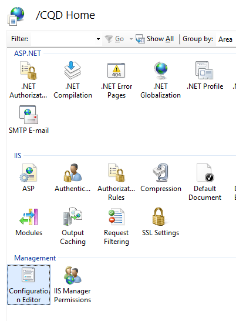

# <a name="deploy-call-quality-dashboard-for-skype-for-business-server"></a><span data-ttu-id="2c316-104">Implementación de paneles de calidad de llamada de Skype para Business Server</span><span class="sxs-lookup"><span data-stu-id="2c316-104">Deploy Call Quality Dashboard for Skype for Business Server</span></span>
 
<span data-ttu-id="2c316-105">**Resumen:** Obtenga información sobre el proceso de implementación para llamar al panel de calidad.</span><span class="sxs-lookup"><span data-stu-id="2c316-105">**Summary:** Learn about the deployment process for Call Quality Dashboard.</span></span> <span data-ttu-id="2c316-106">Panel de calidad de llamada es una herramienta de Skype para Business Server.</span><span class="sxs-lookup"><span data-stu-id="2c316-106">Call Quality Dashboard is a tool for Skype for Business Server.</span></span>
  
## <a name="deployment-overview"></a><span data-ttu-id="2c316-107">Introducción a la implementación</span><span class="sxs-lookup"><span data-stu-id="2c316-107">Deployment Overview</span></span>

<span data-ttu-id="2c316-108">Panel de calidad de llamada (CQD) consta de tres componentes principales:</span><span class="sxs-lookup"><span data-stu-id="2c316-108">Call Quality Dashboard (CQD) consists of three major components:</span></span>
  
- <span data-ttu-id="2c316-109">**Base de datos de archivo**, donde se replica y se almacenan los datos de calidad de la experiencia (QoE).</span><span class="sxs-lookup"><span data-stu-id="2c316-109">**Archive Database**, where the Quality of Experience (QoE) data is replicated and stored.</span></span>
    
- <span data-ttu-id="2c316-110">**Cubo**, donde se agregan los datos de la base de datos de archivo de QoE para acceso rápido y optimizado.</span><span class="sxs-lookup"><span data-stu-id="2c316-110">**Cube**, where data from QoE Archive database is aggregated for optimized and fast access.</span></span>
    
- <span data-ttu-id="2c316-111">**Portal**, donde los usuarios pueden consultar y visualizar los datos de QoE fácilmente.</span><span class="sxs-lookup"><span data-stu-id="2c316-111">**Portal**, where users can easily query and visualize QoE data.</span></span>
    

  
<span data-ttu-id="2c316-113">El proceso de instalación para el archivo QoE implica la creación de la base de datos de archivo de QoE, implementación de un procedimiento almacenado de SQL Server que se moverá los datos desde el origen de base de datos de métricas de QoE en QoE Archivar base de datos y configurar el trabajo de agente SQL Server para ejecutar el almacenado procedimiento a intervalos regulares.</span><span class="sxs-lookup"><span data-stu-id="2c316-113">The setup process for QoE Archive involves creating the QoE Archive database, deploying a SQL Server stored procedure that will move the data from the source QoE Metrics database into QoE Archive database, and setting up the SQL Server Agent job to execute the stored procedure at a regular interval.</span></span> 
  
<span data-ttu-id="2c316-114">Implementación de cubo obtiene información de usuario en donde el archivo QoE se encuentra, implementa el cubo y configura un trabajo del Agente SQL Server regular que se va a actualizar el cubo a intervalos regulares.</span><span class="sxs-lookup"><span data-stu-id="2c316-114">Cube deployment gets information from the user on where the QoE Archive is located, deploys the cube, and sets up a regular SQL Server agent job that will refresh the cube at a regular interval.</span></span>
  
<span data-ttu-id="2c316-115">Instalación del portal crea una base de datos de repositorio que almacena la asignación de usuarios CQD a informes o consultas de cada usuario.</span><span class="sxs-lookup"><span data-stu-id="2c316-115">Portal install creates a Repository database that stores the mapping of CQD users to each user's reports/queries.</span></span> <span data-ttu-id="2c316-116">A continuación, configura una aplicación web IIS que es el panel donde los usuarios pueden ver un conjunto de informes predefinido, así como personalizar y crear sus propias consultas para visualizar los datos del cubo.</span><span class="sxs-lookup"><span data-stu-id="2c316-116">It then sets up an IIS web application which is the dashboard where users can see a pre-defined set of reports as well as customize and create their own queries to visualize data from the cube.</span></span> <span data-ttu-id="2c316-117">La instalación del portal crea dos aplicaciones web adicionales que expone las API para los usuarios a obtener acceso mediante programación el repositorio y el cubo.</span><span class="sxs-lookup"><span data-stu-id="2c316-117">The portal install creates two additional web applications that exposes APIs for users to programmatically access the repository and the cube.</span></span> <span data-ttu-id="2c316-118">(Estas API se usan internamente por el tablero de mandos).</span><span class="sxs-lookup"><span data-stu-id="2c316-118">(These APIs are used internally by the dashboard as well.)</span></span>
  

|<span data-ttu-id="2c316-119">**Fase**</span><span class="sxs-lookup"><span data-stu-id="2c316-119">**Phase**</span></span>|<span data-ttu-id="2c316-120">**Pasos**</span><span class="sxs-lookup"><span data-stu-id="2c316-120">**Steps**</span></span>|<span data-ttu-id="2c316-121">**Roles y pertenencia a grupos**</span><span class="sxs-lookup"><span data-stu-id="2c316-121">**Roles and group membership**</span></span>|<span data-ttu-id="2c316-122">**Documentación**</span><span class="sxs-lookup"><span data-stu-id="2c316-122">**Documentation**</span></span>|
|:-----|:-----|:-----|:-----|
|<span data-ttu-id="2c316-123">Instalar software y hardware como requisito previo.</span><span class="sxs-lookup"><span data-stu-id="2c316-123">Install prerequisite hardware and software.</span></span>  <br/> |<span data-ttu-id="2c316-124">Decida en la configuración de CQD y elija un servidor SQL Server desde el que se va a realizar la instalación.</span><span class="sxs-lookup"><span data-stu-id="2c316-124">Decide on the CQD configuration, and choose a SQL Server from which to perform the install.</span></span>  <br/> |<span data-ttu-id="2c316-125">Usuario de dominio que es miembro del grupo de administradores locales.</span><span class="sxs-lookup"><span data-stu-id="2c316-125">Domain user who is a member of the local administrators group.</span></span>  <br/> |<span data-ttu-id="2c316-126">Sección "Pre-requisitos para la instalación" en la documentación de implementación.</span><span class="sxs-lookup"><span data-stu-id="2c316-126">"Pre-install Requirements" section in the deployment documentation.</span></span>  <br/> |
|<span data-ttu-id="2c316-127">Instalar CQD.</span><span class="sxs-lookup"><span data-stu-id="2c316-127">Install CQD.</span></span>  <br/> |<span data-ttu-id="2c316-128">Ejecute el MSI siguiendo el documento de implementación.</span><span class="sxs-lookup"><span data-stu-id="2c316-128">Run the MSI following the deployment document.</span></span>  <br/> |<span data-ttu-id="2c316-129">Para realizar la instalación, la cuenta de instalación debe ser un usuario de dominio que sea miembro del grupo de administradores locales y tener acceso de lectura a la base de datos de métricas de QoE en el servidor de supervisión.</span><span class="sxs-lookup"><span data-stu-id="2c316-129">To perform the setup, the installing account must be a domain user who is a member of the local administrators group and have read access to QoE Metrics database on the Monitoring Server.</span></span>  <br/> |<span data-ttu-id="2c316-130">Secciones "Las cuentas y los pasos de implementación" en la documentación de implementación.</span><span class="sxs-lookup"><span data-stu-id="2c316-130">"Accounts and Deployment Steps" sections in the deployment documentation.</span></span>  <br/> |
|<span data-ttu-id="2c316-131">Conceder acceso de usuario.</span><span class="sxs-lookup"><span data-stu-id="2c316-131">Grant user access.</span></span>  <br/> |<span data-ttu-id="2c316-132">Para administrar la autorización de usuario en el Portal, se recomienda utilizar la autorización de dirección URL, que se introdujo en IIS 7.0.</span><span class="sxs-lookup"><span data-stu-id="2c316-132">For managing user authorization to the Portal, we recommend using URL Authorization, which was introduced in IIS 7.0.</span></span> <span data-ttu-id="2c316-133">Para obtener más información, vea [Autorización de dirección URL de descripción IIS 7.0](https://www.iis.net/learn/manage/configuring-security/understanding-iis-url-authorization).</span><span class="sxs-lookup"><span data-stu-id="2c316-133">For more information, see [Understanding IIS 7.0 URL Authorization](https://www.iis.net/learn/manage/configuring-security/understanding-iis-url-authorization).</span></span>  <br/> |<span data-ttu-id="2c316-134">Usuario de dominio que es miembro del grupo de administradores locales.</span><span class="sxs-lookup"><span data-stu-id="2c316-134">Domain user who is a member of the local administrators group.</span></span>  <br/> |<span data-ttu-id="2c316-135">Administrar el acceso de usuario para la sección de Portal en la documentación de implementación.</span><span class="sxs-lookup"><span data-stu-id="2c316-135">Managing User Access for the Portal section in the deployment documentation.</span></span>  <br/> |
|<span data-ttu-id="2c316-136">Opcional: Proporcionar información de asignación de subred.</span><span class="sxs-lookup"><span data-stu-id="2c316-136">Optional: Provide subnet mapping information.</span></span>  <br/> |<span data-ttu-id="2c316-137">Rellenar la red y las tablas de asignación de creación en la base de datos QoE Archive.</span><span class="sxs-lookup"><span data-stu-id="2c316-137">Populate network and building mapping tables in QoE Archive database.</span></span>  <br/> |<span data-ttu-id="2c316-138">Una cuenta con acceso de escritura a la base de datos de archivo de QoE.</span><span class="sxs-lookup"><span data-stu-id="2c316-138">An account with write access to the QoE Archive database.</span></span>  <br/> |<span data-ttu-id="2c316-139">Sección "Proporcionar información de subred" en la documentación del usuario.</span><span class="sxs-lookup"><span data-stu-id="2c316-139">"Supplying Subnet Information" section in the user documentation.</span></span>  <br/> |
   


<span data-ttu-id="2c316-140">La implementación de panel de calidad de llamadas implica la configuración de la infraestructura e instalar el software.</span><span class="sxs-lookup"><span data-stu-id="2c316-140">Deployment of Call Quality Dashboard involves setting up the infrastructure and installing the software.</span></span> <span data-ttu-id="2c316-141">El siguiente procedimiento describe el proceso.</span><span class="sxs-lookup"><span data-stu-id="2c316-141">The following procedure outlines the process.</span></span>
  
## <a name="deployment-steps"></a><span data-ttu-id="2c316-142">Pasos de implementación</span><span class="sxs-lookup"><span data-stu-id="2c316-142">Deployment Steps</span></span>

1. <span data-ttu-id="2c316-143">Copie la CallQualityDashboard.msi en el equipo donde se tiene que instalar el componente de base de datos de archivo de CQD (Esto es el equipo que tiene instalado SQL Server).</span><span class="sxs-lookup"><span data-stu-id="2c316-143">Copy the CallQualityDashboard.msi to the machine where the archive database component of CQD is to be installed (this is the machine that has SQL Server installed).</span></span> 
    
2. <span data-ttu-id="2c316-144">Ejecute el archivo MSI (Windows solicitará ejecutar con privilegios de administrador, hágalo).</span><span class="sxs-lookup"><span data-stu-id="2c316-144">Execute the MSI (Windows will prompt to run with administrator privilege, do so).</span></span> 
    
3. <span data-ttu-id="2c316-145">Acepte al CLUF.</span><span class="sxs-lookup"><span data-stu-id="2c316-145">Accept the EULA.</span></span>
    
4. <span data-ttu-id="2c316-146">Seleccione la carpeta de destino donde los archivos relacionados con los componentes del panel de calidad de llamadas se encuentra o acepte la ubicación predeterminada.</span><span class="sxs-lookup"><span data-stu-id="2c316-146">Select the destination folder where files related to Call Quality Dashboard components will be located or accept the default location.</span></span>
    
5. <span data-ttu-id="2c316-147">Seleccione todas las características.</span><span class="sxs-lookup"><span data-stu-id="2c316-147">Select all features.</span></span>
    
6. <span data-ttu-id="2c316-148">En la página Configuración del archivo de QoE, proporcione la información siguiente:</span><span class="sxs-lookup"><span data-stu-id="2c316-148">At the QoE Archive Configuration page, provide the following information:</span></span>
    
   - <span data-ttu-id="2c316-149">**Las métricas de QoE SQL Server:** Nombre de instancia de SQL Server para que se encuentra la base de datos de métricas de QoE (Esto será el origen de datos).</span><span class="sxs-lookup"><span data-stu-id="2c316-149">**QoE Metrics SQL Server:** SQL Server instance name for where the QoE Metrics DB is located (this will be the data source).</span></span>
    
   - <span data-ttu-id="2c316-150">**Nombre de archivo de QoE SQL Server:** Este es el campo de sólo lectura y se fija en el nombre de dominio completo de la máquina local.</span><span class="sxs-lookup"><span data-stu-id="2c316-150">**QoE Archive SQL Server Name:** This is read-only field and fixed to the fully qualified domain name of the local machine.</span></span> <span data-ttu-id="2c316-151">Archivo de base de datos puede instalarse solo en la máquina local.</span><span class="sxs-lookup"><span data-stu-id="2c316-151">Archive DB can be installed only on the local machine.</span></span>
    
   - <span data-ttu-id="2c316-152">**Archivo QoE instancia de SQL Server:** Un nombre de la instancia de SQL Server local para donde es la base de datos de archivo que se creará.</span><span class="sxs-lookup"><span data-stu-id="2c316-152">**QoE Archive SQL Server Instance:** A local SQL Server instance name for where the Archive DB is to be created.</span></span> <span data-ttu-id="2c316-153">Para usar una instancia de SQL Server de forma predeterminada, deje este campo en blanco.</span><span class="sxs-lookup"><span data-stu-id="2c316-153">To use a default SQL Server instance, leave this field blank.</span></span> <span data-ttu-id="2c316-154">Para usar una instancia con nombre de SQL Server, especifique el nombre de instancia (por ejemplo, el nombre después de la "\").</span><span class="sxs-lookup"><span data-stu-id="2c316-154">To use a named SQL Server instance, specify the instance name (e.g. the name after the "\").</span></span>
    
   - <span data-ttu-id="2c316-155">**QoE Archivar base de datos:** De forma predeterminada, esta opción se establece en "Crear nueva base de datos".</span><span class="sxs-lookup"><span data-stu-id="2c316-155">**QoE Archive Database:** By default, this option is set to "Create new database".</span></span> <span data-ttu-id="2c316-156">Dado que no se admite la actualización de base de datos de archivo, el único caso en que se puede usar la opción "Usar la base de datos existente" es si la base de datos de archivo existente tiene el mismo esquema que la compilación que se van a instalar.</span><span class="sxs-lookup"><span data-stu-id="2c316-156">Since Archive DB upgrade is not supported, the only circumstance under which the "Use existing database" option can be used is if the existing Archive database has the same schema as the build to be installed.</span></span>
    
   - <span data-ttu-id="2c316-157">**Directorio del archivo de base de datos:** Ruta de acceso donde se deben colocar los archivos de base de datos (archivos .mdf y .ldf) para la base de datos de archivo.</span><span class="sxs-lookup"><span data-stu-id="2c316-157">**Database File Directory:** Path to where the database files (.mdf and .ldf) for the Archive DB should be placed.</span></span> <span data-ttu-id="2c316-158">Esto debe estar en una unidad independiente (HDD2 en la configuración de hardware recomendada) desde el sistema operativo.</span><span class="sxs-lookup"><span data-stu-id="2c316-158">This should be on a drive (HDD2 in the recommended hardware configuration) separate from the OS.</span></span> <span data-ttu-id="2c316-159">Tenga en cuenta que dado que los nombres de archivo se corrigen en la instalación, para evitar posibles conflictos, se recomienda que se utiliza un directorio en blanco con ningún archivo.</span><span class="sxs-lookup"><span data-stu-id="2c316-159">Note that since the file names are fixed in the install, to avoid any potential conflict, it is recommended that a blank directory with no files be used.</span></span>
    
   - <span data-ttu-id="2c316-160">**Usar varias particiones:** El valor predeterminado se establece en "Partición varios", lo cual requiere la edición de inteligencia empresarial o Enterprise edition de SQL Server.</span><span class="sxs-lookup"><span data-stu-id="2c316-160">**Use Multiple Partitions:** The default is set to "Multiple partition", which requires Business Intelligence edition or Enterprise edition of SQL Server.</span></span> <span data-ttu-id="2c316-161">Para Standard edition, seleccione la opción de "Única partición".</span><span class="sxs-lookup"><span data-stu-id="2c316-161">For Standard edition, select "Single Partition" option.</span></span> <span data-ttu-id="2c316-162">Tenga en cuenta que el rendimiento de procesamiento del cubo puede verse afectado si se usa una única partición.</span><span class="sxs-lookup"><span data-stu-id="2c316-162">Note that cube processing performance may be impacted if Single Partition is used.</span></span>
    
     > [!NOTE]
     > <span data-ttu-id="2c316-163">No se puede cambiar la selección para la opción de usar varias particiones una vez finalizada la instalación.</span><span class="sxs-lookup"><span data-stu-id="2c316-163">The selection for Use Multiple Partitions option cannot be changed once Setup completes.</span></span> <span data-ttu-id="2c316-164">Para cambiarlo, el cubo que se necesita la característica a la primera desinstalado y, a continuación, volver a instalar mediante la opción "Cambiar" en el Panel de Control.</span><span class="sxs-lookup"><span data-stu-id="2c316-164">In order to change it, the Cube feature needs to be first uninstalled and then reinstalled using "Change" option in Control Panel.</span></span> 
  
   - <span data-ttu-id="2c316-165">**Crear particiones de directorio de archivo:** Ruta de acceso donde se deben colocar las particiones de la base de datos de archivo de QoE.</span><span class="sxs-lookup"><span data-stu-id="2c316-165">**Partition File Directory:** Path to where the partitions for the QoE Archive database should be placed.</span></span> <span data-ttu-id="2c316-166">Esto debe estar en una unidad independiente (HDD3 en la configuración de hardware recomendada) de la unidad de sistema operativo y la unidad de archivos de registro de base de datos SQL.</span><span class="sxs-lookup"><span data-stu-id="2c316-166">This should be on a drive (HDD3 in the recommended hardware configuration) separate from the OS drive and SQL database log files drive.</span></span> <span data-ttu-id="2c316-167">Tenga en cuenta que dado que los nombres de archivo se corrigen en la instalación, para evitar posibles conflictos, se recomienda que se utiliza un directorio en blanco con ningún archivo.</span><span class="sxs-lookup"><span data-stu-id="2c316-167">Note that since the file names are fixed in the install, to avoid any potential conflict, it is recommended that a blank directory with no files be used.</span></span>
    
   - <span data-ttu-id="2c316-168">**Usuario de trabajo del Agente SQL - nombre de usuario &amp; contraseña:** Nombre de cuenta de servicio de dominio y la contraseña (enmascarado) que se usará para ejecutar el paso de "Datos de archivo QoE" del trabajo de agente SQL Server (que se ejecutará el procedimiento almacenado para recuperar datos la base de datos de métricas de calidad de la experiencia en la base de datos de archivo, por lo que esta cuenta debe tener acceso de lectura a la base de datos de métricas de QoE,  como se indica en la sección cuentas.</span><span class="sxs-lookup"><span data-stu-id="2c316-168">**SQL Agent Job User - User Name &amp; Password:** Domain service account name and password (masked) that will be used to run the "QoE Archive Data" step of the SQL Server Agent job (which will run the stored procedure to fetch data from QoE Metrics DB into Archive DB, so this account must have read access to QoE Metrics DB, as indicated under Accounts section.</span></span> <span data-ttu-id="2c316-169">Esta cuenta también debe tener un inicio de sesión en la instancia de SQL Server de QoE archivo).</span><span class="sxs-lookup"><span data-stu-id="2c316-169">This account also needs to have a login in the QoE Archive SQL Server Instance).</span></span>
    
     > [!NOTE]
     > <span data-ttu-id="2c316-170">La cuenta que se está ejecutando la instancia de SQL Server, como NT SERVICE\MSSQLSERVER, debe tener acceso a los directorios indicadas anteriormente para que la instalación se realice correctamente.</span><span class="sxs-lookup"><span data-stu-id="2c316-170">The account that the SQL Server instance is running under, such as NT SERVICE\MSSQLSERVER, must have access/permission to the directories given above for the installation to succeed.</span></span> <span data-ttu-id="2c316-171">Para obtener información detallada, vea [Configurar permisos de sistema de archivos para obtener acceso al motor de base de datos](https://msdn.microsoft.com/en-us/library/jj219062%28v=sql.110%29.aspx)</span><span class="sxs-lookup"><span data-stu-id="2c316-171">For details, see [Configure File System Permissions for Database Engine Access](https://msdn.microsoft.com/en-us/library/jj219062%28v=sql.110%29.aspx)</span></span>
  
7. <span data-ttu-id="2c316-172">Tras hacer clic en siguiente, el programa de instalación llevará a cabo comprobaciones de requisitos previos e informe si se producen problemas.</span><span class="sxs-lookup"><span data-stu-id="2c316-172">Upon clicking next, the installer will perform pre-requisite checks and report if any issues are encountered.</span></span> <span data-ttu-id="2c316-173">Cuando comprobaciones de todas las de requisitos previos paso, el programa de instalación se vaya a la página de configuración de cubo.</span><span class="sxs-lookup"><span data-stu-id="2c316-173">When all pre-requisite checks pass, the installer will go to the Cube Configuration page.</span></span> 
    
    > [!NOTE]
    > <span data-ttu-id="2c316-174">Si el programa de instalación muestra un mensaje de advertencia que el servicio Agente SQL Server para la instancia de SQL Server de QoE archivo actualmente no se está ejecutando, puede continuar con la instalación, pero posterior a la instalación por favor, asegúrese de que el servicio del Agente SQL se está ejecutando y establece el tipo de inicio Automática para que se ejecute el trabajo programado.</span><span class="sxs-lookup"><span data-stu-id="2c316-174">If the installer shows a warning message that the SQL Server Agent service for the QoE Archive SQL Server instance is currently not running, installation can proceed, but post installation please make sure that SQL Agent service is running and set the Startup type to Automatic so that the scheduled Job runs.</span></span> 
  
8. <span data-ttu-id="2c316-175">En la página de configuración de cubo, proporcione la información siguiente:</span><span class="sxs-lookup"><span data-stu-id="2c316-175">At Cube Configuration page, provide the following information:</span></span>
    
   - <span data-ttu-id="2c316-176">**Nombre de archivo de QoE SQL Server:** Este es el campo de sólo lectura y se fija en el nombre de dominio completo de la máquina local.</span><span class="sxs-lookup"><span data-stu-id="2c316-176">**QoE Archive SQL Server Name:** This is read-only field and fixed to the fully qualified domain name of the local machine.</span></span> <span data-ttu-id="2c316-177">Cubo puede instalarse solo desde el equipo que tiene la base de datos de archivo de QoE (tenga en cuenta.</span><span class="sxs-lookup"><span data-stu-id="2c316-177">Cube can be installed only from the machine that has QoE Archive database (Note.</span></span> <span data-ttu-id="2c316-178">Cubo propio puede instalarse en un equipo remoto.</span><span class="sxs-lookup"><span data-stu-id="2c316-178">Cube itself may be installed on a remote machine.</span></span> <span data-ttu-id="2c316-179">Vea más adelante)</span><span class="sxs-lookup"><span data-stu-id="2c316-179">See below)</span></span>
    
   - <span data-ttu-id="2c316-180">**Archivo QoE instancia de SQL Server:** Nombre de instancia de SQL Server para que se encuentra la base de datos de archivo de QoE.</span><span class="sxs-lookup"><span data-stu-id="2c316-180">**QoE Archive SQL Server Instance:** SQL Server instance name for where the QoE Archive DB is located.</span></span> <span data-ttu-id="2c316-181">Para especificar una instancia de SQL Server de forma predeterminada, deje este campo en blanco.</span><span class="sxs-lookup"><span data-stu-id="2c316-181">To specify a default SQL Server instance, leave this field blank.</span></span> <span data-ttu-id="2c316-182">Para especificar una instancia con nombre de SQL Server, escriba el nombre de instancia (por ejemplo, el nombre después de la "\").</span><span class="sxs-lookup"><span data-stu-id="2c316-182">To specify a named SQL Server instance, enter the instance name (e.g. the name after the "\").</span></span> <span data-ttu-id="2c316-183">Si el componente de archivo QoE se ha seleccionado para la instalación, este campo estará rellenado previamente con el valor proporcionado en la página Configuración de QoE archiving.</span><span class="sxs-lookup"><span data-stu-id="2c316-183">If QoE Archive component was selected for the install, this field will be pre-populated with the value provided on the QoE Archive Configuration page.</span></span>
    
   - <span data-ttu-id="2c316-184">**Cubos de Analysis Server:** Nombre de instancia de SQL Server Analysis Services para donde es el cubo que se creará.</span><span class="sxs-lookup"><span data-stu-id="2c316-184">**Cube Analysis Server:** SQL Server Analysis Service instance name for where the cube is to be created.</span></span> <span data-ttu-id="2c316-185">Esto puede ser un equipo diferente, pero el usuario que instala tiene que ser un miembro de los administradores del servidor de la instancia de SQL Server Analysis Services de destino.</span><span class="sxs-lookup"><span data-stu-id="2c316-185">This can be a different machine but the installing user has to be a member of Server administrators of the target SQL Server Analysis Service instance.</span></span>
    
     > [!NOTE]
     >  <span data-ttu-id="2c316-186">Para obtener más información acerca de cómo configurar permisos de administrador del servidor de Analysis Services, vea [Conceder permisos de administrador del servidor (Analysis Services)](https://msdn.microsoft.com/en-us/library/ms174561.aspx)</span><span class="sxs-lookup"><span data-stu-id="2c316-186">For more information about configuring Analysis Services Server Administrator Permissions, see [Grant Server Administrator Permissions (Analysis Services)](https://msdn.microsoft.com/en-us/library/ms174561.aspx)</span></span>
  
   - <span data-ttu-id="2c316-187">**Usar varias particiones:** El valor predeterminado se establece en "Partición varios", lo cual requiere la edición de inteligencia empresarial o Enterprise edition de SQL Server.</span><span class="sxs-lookup"><span data-stu-id="2c316-187">**Use Multiple Partitions:** The default is set to "Multiple partition", which requires Business Intelligence edition or Enterprise edition of SQL Server.</span></span> <span data-ttu-id="2c316-188">Para Standard edition, seleccione la opción de "Única partición".</span><span class="sxs-lookup"><span data-stu-id="2c316-188">For Standard edition, select "Single Partition" option.</span></span> <span data-ttu-id="2c316-189">Tenga en cuenta que el rendimiento de procesamiento del cubo puede verse afectado si se usa una única partición.</span><span class="sxs-lookup"><span data-stu-id="2c316-189">Note that cube processing performance may be impacted if Single Partition is used .</span></span>
    
     > [!NOTE]
     >  <span data-ttu-id="2c316-190">No se puede cambiar la selección para la opción de usar varias particiones una vez finalizada la instalación.</span><span class="sxs-lookup"><span data-stu-id="2c316-190">The selection for Use Multiple Partitions option cannot be changed once Setup completes.</span></span> <span data-ttu-id="2c316-191">Para cambiarlo, el cubo que se necesita la característica a la primera desinstalado y, a continuación, volver a instalar mediante la opción "Cambiar" en el Panel de Control.</span><span class="sxs-lookup"><span data-stu-id="2c316-191">In order to change it, the Cube feature needs to be first uninstalled and then reinstalled using "Change" option in Control Panel.</span></span>
  
   - <span data-ttu-id="2c316-192">**Usuario - nombre de usuario de cubos &amp; contraseña:** Nombre de cuenta de servicio de dominio y contraseña (enmascarado) que se activará el procesamiento del cubo.</span><span class="sxs-lookup"><span data-stu-id="2c316-192">**Cube User - User Name &amp; Password:** Domain service account name and password (masked) that will trigger the cube processing.</span></span> <span data-ttu-id="2c316-193">Si el componente de archiving QoE se ha seleccionado para la instalación, este campo se rellenará previamente con el valor proporcionado en la página Configuración de archivo para el usuario de trabajo del Agente SQL, pero se recomienda especificar una cuenta de servicio de dominio diferente para que el programa de instalación puede conceder el privilegios necesarios a ella.</span><span class="sxs-lookup"><span data-stu-id="2c316-193">If QoE Archive component was selected for the install, this field will be pre-populated with the value provided on the Archive Configuration page for the SQL Agent Job User, but we recommend specifying a different domain service account so that Setup can grant the least required privilege to it.</span></span>
    
9. <span data-ttu-id="2c316-194">Al hacer clic en siguiente, se realizará otra ronda de validación y se informará de cualquier problema.</span><span class="sxs-lookup"><span data-stu-id="2c316-194">When clicking next, another round of validation will be performed and any issue will be reported.</span></span> <span data-ttu-id="2c316-195">Tras completar correctamente la validación, el programa de instalación se vaya a la página de configuración del Portal.</span><span class="sxs-lookup"><span data-stu-id="2c316-195">Upon successful completion of the validation, the installer will go to the Portal Configuration page.</span></span> 
    
10. <span data-ttu-id="2c316-196">En la página Configuración de Portal, proporcione la información siguiente:</span><span class="sxs-lookup"><span data-stu-id="2c316-196">At Portal Configuration page, provide the following information:</span></span>
    
    - <span data-ttu-id="2c316-197">**Archivo QoE SQL Server:** Nombre de instancia de SQL Server para que se encuentra la base de datos de archivo de QoE.</span><span class="sxs-lookup"><span data-stu-id="2c316-197">**QoE Archive SQL Server:** SQL Server instance name for where the QoE Archive database is located.</span></span> <span data-ttu-id="2c316-198">Tenga en cuenta que, a diferencia de la página de configuración de archivo de calidad de la experiencia y la página de configuración de cubo, el nombre del equipo no es fijo y se debe proporcionar.</span><span class="sxs-lookup"><span data-stu-id="2c316-198">Note that unlike the QoE Archive Configuration page and the Cube Configuration page, the machine name is not fixed and must be provided.</span></span> <span data-ttu-id="2c316-199">Si el componente de archivo QoE se ha seleccionado para la instalación, este campo estará rellenado previamente con el valor proporcionado en la página Configuración de QoE archiving.</span><span class="sxs-lookup"><span data-stu-id="2c316-199">If QoE Archive component was selected for the install, this field will be pre-populated with the value provided on the QoE Archive Configuration page.</span></span>
    
    - <span data-ttu-id="2c316-200">**Cubos de Analysis Server:** Nombre de instancia de SQL Server Analysis Services para que se encuentra el cubo.</span><span class="sxs-lookup"><span data-stu-id="2c316-200">**Cube Analysis Server:** SQL Server Analysis Service instance name for where the cube is located.</span></span> <span data-ttu-id="2c316-201">Si el componente de cubo se ha seleccionado para la instalación, este campo estará rellenado previamente con el valor proporcionado en la página Configuración de cubo.</span><span class="sxs-lookup"><span data-stu-id="2c316-201">If Cube component was selected for the install, this field will be pre-populated with the value provided on the Cube Configuration page.</span></span>
    
    - <span data-ttu-id="2c316-202">**Repositorio SQL Server:** Nombre de instancia de SQL Server donde está la base de datos de repositorio que se creará.</span><span class="sxs-lookup"><span data-stu-id="2c316-202">**Repository SQL Server:** SQL Server instance name where the Repository database is to be created.</span></span> <span data-ttu-id="2c316-203">Si se ha proporcionado el nombre de instancia de SQL Server para que se encuentra la base de datos de archivo QoE anteriormente en el programa de instalación (en otros componentes), este campo se rellena previamente con el nombre de instancia QoE Archivar base de datos SQL Server.</span><span class="sxs-lookup"><span data-stu-id="2c316-203">If the SQL Server instance name for where the QoE Archive database is located has been provided earlier in the setup (in other components), this field will be pre-populated with the QoE Archive DB SQL Server instance name.</span></span> <span data-ttu-id="2c316-204">Esto puede ser cualquier instancia de SQL Server.</span><span class="sxs-lookup"><span data-stu-id="2c316-204">This can be any SQL Server instance.</span></span>
    
    - <span data-ttu-id="2c316-205">**Base de datos de repositorio:** De forma predeterminada, la opción se establece en "Crear nueva base de datos".</span><span class="sxs-lookup"><span data-stu-id="2c316-205">**Repository Database:** By default the option is set to "Create new database".</span></span> <span data-ttu-id="2c316-206">Dado que no se admite la actualización de base de datos de repositorio, el único caso en que se puede usar la opción "Usar la base de datos existente" es si la base de datos de repositorio existente tiene el mismo esquema que la compilación que se van a instalar.</span><span class="sxs-lookup"><span data-stu-id="2c316-206">Since Repository DB upgrade is not supported, the only circumstance under which the "Use existing database" option can be used is if the existing Repository DB has the same schema as the build to be installed.</span></span>
    
    - <span data-ttu-id="2c316-207">**Usuario del grupo de aplicaciones IIS - nombre de usuario &amp; contraseña:** La cuenta que se debe ejecutar en el grupo de aplicaciones de IIS.</span><span class="sxs-lookup"><span data-stu-id="2c316-207">**IIS App Pool User - User Name &amp; Password:** The account that the IIS application pool should execute under.</span></span> <span data-ttu-id="2c316-208">Los campos nombre de usuario y la contraseña se resaltan en gris si están seleccionadas las cuentas del sistema integrado.</span><span class="sxs-lookup"><span data-stu-id="2c316-208">The User Name and Password fields will be grayed out if built-in system accounts are selected.</span></span> <span data-ttu-id="2c316-209">Estos campos sólo se habilitará si "Otros" esté activada en el cuadro desplegable para que el usuario puede escribir la información de cuenta de servicio de dominio.</span><span class="sxs-lookup"><span data-stu-id="2c316-209">These fields will only be enabled if "Other" is selected from the drop down box so the user can enter the domain service account information.</span></span>
    
11. <span data-ttu-id="2c316-210">Al hacer clic en siguiente, se realizará la Ronda final de validación para asegurarse de que las instancias de SQL Server son accesibles utilizando las credenciales proporcionadas y que está disponible en el equipo de IIS.</span><span class="sxs-lookup"><span data-stu-id="2c316-210">When clicking next, the final round of validation will be done to ensure that the SQL Server instances are accessible using the credentials provided and that IIS is available on the machine.</span></span> <span data-ttu-id="2c316-211">Tras completar correctamente la validación, el instalador continuará con el programa de instalación.</span><span class="sxs-lookup"><span data-stu-id="2c316-211">Upon successful completion of the validation, the installer will proceed with the setup.</span></span> 
    
<span data-ttu-id="2c316-212">Cuando se realiza el programa de instalación, es muy probable que el trabajo del Agente SQL Server será en curso, realizando la carga inicial de los datos de QoE y el procesamiento del cubo.</span><span class="sxs-lookup"><span data-stu-id="2c316-212">When the installer is done, most likely the SQL Server Agent job will be in progress, doing the initial load of the QoE data and the cube processing.</span></span> <span data-ttu-id="2c316-213">Dependiendo de la cantidad de datos de QoE, el portal no tendrán datos disponibles para la visualización aún.</span><span class="sxs-lookup"><span data-stu-id="2c316-213">Depending on the amount of data in QoE, the portal will not have data available for viewing yet.</span></span> <span data-ttu-id="2c316-214">Para comprobar el estado de la carga de datos y el procesamiento del cubo, vaya a `http://<machinename>/CQD/#/Health`.</span><span class="sxs-lookup"><span data-stu-id="2c316-214">To check on the status of the data load and cube processing, go to  `http://<machinename>/CQD/#/Health`.</span></span> 
> [!NOTE]
> <span data-ttu-id="2c316-215">Tenga en cuenta que la dirección URL de comprobación del estado de la descarga de procesamiento de cubos distingue mayúsculas de minúsculas.</span><span class="sxs-lookup"><span data-stu-id="2c316-215">Note that the URL for checking the status of the download cube processing is case sensitive.</span></span> <span data-ttu-id="2c316-216">Si escribe 'estado' no funcionan en la dirección URL.</span><span class="sxs-lookup"><span data-stu-id="2c316-216">If you enter 'health' the URL will not work.</span></span> <span data-ttu-id="2c316-217">Debe escribir 'Estado' al final de la dirección URL con una letra mayúscula H.</span><span class="sxs-lookup"><span data-stu-id="2c316-217">You must enter 'Health' at the end of the URL with a capital H.</span></span> 
  
<span data-ttu-id="2c316-218">Los mensajes de registro detallado se mostrarán si está habilitado el modo de depuración.</span><span class="sxs-lookup"><span data-stu-id="2c316-218">Detailed log messages will be shown if debug mode is enabled.</span></span> <span data-ttu-id="2c316-219">Para habilitar el modo de depuración, vaya a **%SYSTEMDRIVE%\Program Files\Skype para profesionales de 2015 CQD\QoEDataService\web.config**y actualizar la siguiente línea, por lo que el valor se establece en **True**:</span><span class="sxs-lookup"><span data-stu-id="2c316-219">To enable debug mode, go to **%SYSTEMDRIVE%\Program Files\Skype For Business 2015 CQD\QoEDataService\web.config**, and update the following line so the value is set to **True**:</span></span>

```
<add key="QoEDataLib.DebugMode" value="True" /> 
```

<span data-ttu-id="2c316-220">La página principal del portal es accesible a través de `http://<machinename>/CQD`.</span><span class="sxs-lookup"><span data-stu-id="2c316-220">The main portal page is accessible via  `http://<machinename>/CQD`.</span></span> 
## <a name="managing-user-access-for-the-portal"></a><span data-ttu-id="2c316-221">Administrar el acceso de usuario para el Portal</span><span class="sxs-lookup"><span data-stu-id="2c316-221">Managing User Access for the Portal</span></span>

<span data-ttu-id="2c316-222">Para administrar la autorización de usuario en el Portal, se recomienda utilizar la autorización de dirección URL, que se introdujo en IIS 7.0.</span><span class="sxs-lookup"><span data-stu-id="2c316-222">For managing user authorization to the Portal, we recommend using URL Authorization, which was introduced in IIS 7.0.</span></span> <span data-ttu-id="2c316-223">Para obtener más información acerca de la seguridad IIS, vea [Autorización de dirección URL de descripción IIS 7.0 ](https://www.iis.net/learn/manage/configuring-security/understanding-iis-url-authorization).</span><span class="sxs-lookup"><span data-stu-id="2c316-223">For more information on IIS security, see [Understanding IIS 7.0 URL Authorization ](https://www.iis.net/learn/manage/configuring-security/understanding-iis-url-authorization).</span></span>
  
<span data-ttu-id="2c316-224">Cualquier aplicación web, web o sitio heredan el valor predeterminado configurado para IIS todo, que normalmente es "Permitir que todos los usuarios" de autorización de dirección URL.</span><span class="sxs-lookup"><span data-stu-id="2c316-224">Any web site or web application inherit the default URL Authorization configured for the entire IIS, which is typically "Allow All Users".</span></span> <span data-ttu-id="2c316-225">Si necesita acceso al Portal para que sea más restrictivo, a continuación, los administradores pueden conceder acceso a sólo el grupo específico de usuarios mediante la edición de las reglas de autorización"".</span><span class="sxs-lookup"><span data-stu-id="2c316-225">If access to the Portal needs to be more restrictive, then administrators can grant access to only the specific group of users by editing the "Authorization Rules".</span></span>
  

  
> [!NOTE]
> <span data-ttu-id="2c316-227">El icono de las reglas de autorización no es debe confundirse con el "autorización de. NET" en la sección ASP.NET, que es un mecanismo de autorización diferentes.</span><span class="sxs-lookup"><span data-stu-id="2c316-227">The Authorization Rules icon is not to be confused with the ".NET Authorization" under the ASP.NET section, which is a different authorization mechanism.</span></span> 
  
<span data-ttu-id="2c316-228">Los administradores deben quitar primero la regla heredado "permitir que todos los usuarios".</span><span class="sxs-lookup"><span data-stu-id="2c316-228">Administrators should first remove the inherited "Allow All Users" rule.</span></span> <span data-ttu-id="2c316-229">Esto impide que los usuarios no autorizados acceso al Portal.</span><span class="sxs-lookup"><span data-stu-id="2c316-229">This prevents any non-authorized users from accessing the Portal.</span></span>
  

  
<span data-ttu-id="2c316-231">A continuación, los administradores deben agregar nuevas reglas permitir y concesión de permiso para obtener acceso al Portal de usuarios específicos.</span><span class="sxs-lookup"><span data-stu-id="2c316-231">Next, administrators should add new Allow Rules and give specific users the permission to access the Portal.</span></span> <span data-ttu-id="2c316-232">Se recomienda que se ha creado un grupo local denominado "CQDPortalUsers" para administrar los usuarios.</span><span class="sxs-lookup"><span data-stu-id="2c316-232">It is recommended that a local Group called "CQDPortalUsers" be created to manage the users.</span></span>
  

  
<span data-ttu-id="2c316-234">Los detalles de configuración se almacenan en el archivo web.config que se encuentra en el directorio físico del Portal.</span><span class="sxs-lookup"><span data-stu-id="2c316-234">The configuration details are stored in the web.config located at the Portal's physical directory.</span></span>
  
```
<?xml version="1.0" encoding="UTF-8"?> <configuration> <system.webServer> <security> <authorization> <remove users="*" roles="" verbs="" /> <add accessType="Allow" roles="CQDPortalUsers" /> </authorization> </security> </system.webServer> </configuration> 
```

<span data-ttu-id="2c316-235">El siguiente paso es configurar el panel de la CQD.</span><span class="sxs-lookup"><span data-stu-id="2c316-235">The next step is to configure the dashboard of the CQD.</span></span> <span data-ttu-id="2c316-236">Después de que los usuarios se autentican con IIS, deberá tener permisos de archivo en el directorio CQD con el fin de obtener acceso al contenido del portal web.</span><span class="sxs-lookup"><span data-stu-id="2c316-236">After users are authenticated by IIS, they will have to have file permissions on the CQD directory in order to access the web portal content.</span></span> <span data-ttu-id="2c316-237">Es posible cambiar las ACL a través de la ficha seguridad de las propiedades del directorio CQD para agregar usuarios individuales o grupos; Sin embargo, el enfoque recomendado es dejar intactos los permisos de archivo.</span><span class="sxs-lookup"><span data-stu-id="2c316-237">It is possible to change the ACLs through the security tab of the CQD directory properties to add individual users or groups; however the recommended approach is to leave the file permissions untouched.</span></span> <span data-ttu-id="2c316-238">En su lugar, cambie la configuración de IIS para usar el proceso de trabajo IIS para tener acceso al directorio CQD independientemente del lugar en que se autentica el usuario.</span><span class="sxs-lookup"><span data-stu-id="2c316-238">Instead, change the IIS setting to use the IIS worker process to access the CQD directory no matter which user is authenticated.</span></span> 
  
> [!IMPORTANT]
> <span data-ttu-id="2c316-239">Es importante sólo cambiar esta configuración para la aplicación de CQD y no para las dos aplicaciones de API: QoEDataService y QoERepositoryService.</span><span class="sxs-lookup"><span data-stu-id="2c316-239">It is important to only change this setting for the CQD application, and not for the two API applications: QoEDataService and QoERepositoryService.</span></span> 
  
## <a name="configuring-file-access-for-the-cqd-dashboard"></a><span data-ttu-id="2c316-240">Configurar el acceso de archivo para el CQD (panel)</span><span class="sxs-lookup"><span data-stu-id="2c316-240">Configuring File Access for the CQD (Dashboard)</span></span>

1. <span data-ttu-id="2c316-241">Abra el Editor de configuración de CQD.</span><span class="sxs-lookup"><span data-stu-id="2c316-241">Open the Configuration Editor for CQD.</span></span>
    
     
  
2. <span data-ttu-id="2c316-243">En la sección, elija **system.webServer/serverRuntime**.</span><span class="sxs-lookup"><span data-stu-id="2c316-243">Under Section, choose **system.webServer/serverRuntime**.</span></span>
    
     
  
3. <span data-ttu-id="2c316-245">Cambie authenticatedUserOverride a **UseWorkerProcessUser**.</span><span class="sxs-lookup"><span data-stu-id="2c316-245">Change authenticatedUserOverride to **UseWorkerProcessUser**.</span></span>
    
     
  
4. <span data-ttu-id="2c316-247">Haga clic en **Aplicar** en el lado derecho de la página.</span><span class="sxs-lookup"><span data-stu-id="2c316-247">Click **Apply** on the right-hand side of the page.</span></span>
    
## <a name="known-issues"></a><span data-ttu-id="2c316-248">Problemas conocidos</span><span class="sxs-lookup"><span data-stu-id="2c316-248">Known Issues</span></span>

### <a name="the-cqd-shows-no-data-after-deployment"></a><span data-ttu-id="2c316-249">La CQD no muestra datos después de la implementación</span><span class="sxs-lookup"><span data-stu-id="2c316-249">The CQD shows no data after deployment</span></span>

<span data-ttu-id="2c316-250">Es posible que reciba el siguiente error:</span><span class="sxs-lookup"><span data-stu-id="2c316-250">You may receive the following error:</span></span>

<span data-ttu-id="2c316-251">*No podríamos realizamos la consulta mientras se ejecuta en el cubo. Use el Editor de consultas para modificar la consulta y corregir los problemas. Asegúrese también de que el cubo es accesible.*</span><span class="sxs-lookup"><span data-stu-id="2c316-251">*We couldn’t perform the query while running it on the Cube. Use the Query Editor to modify the query and fix any issues. Also make sure that the Cube is accessible.*</span></span>

<span data-ttu-id="2c316-252">Esto significa que se debe procesar el cubo en SQL Server Analysis Services antes de que se usa en CQD.</span><span class="sxs-lookup"><span data-stu-id="2c316-252">This means that the cube must be processed in SQL Server Analysis Services prior to being used in CQD.</span></span> <span data-ttu-id="2c316-253">Esto se puede resolver siguiendo estos pasos:</span><span class="sxs-lookup"><span data-stu-id="2c316-253">You can resolve this by following these steps:</span></span>

1. <span data-ttu-id="2c316-254">Abra SQL Management Studio y seleccione **Analysis Services**.</span><span class="sxs-lookup"><span data-stu-id="2c316-254">Open SQL Management Studio and select **Analysis Services**.</span></span>

2. <span data-ttu-id="2c316-255">Expanda el clic con botón secundario **QoECube** objeto, seleccione la **Métrica de calidad de la experiencia**y, a continuación, elija **Examinar**.</span><span class="sxs-lookup"><span data-stu-id="2c316-255">Expand the **QoECube** object, select **QoE Metric**, right-click, and then choose **Browse**.</span></span> 

    <span data-ttu-id="2c316-256">Si este parámetro devuelve explorador vacía, todavía no se han continuar con el cubo aún.</span><span class="sxs-lookup"><span data-stu-id="2c316-256">If this returns empty browser, the cube hasn’t been proceed yet.</span></span>

3. <span data-ttu-id="2c316-257">Haga clic con el botón angain de **Métrica de calidad de la experiencia** y seleccione **procesar**.</span><span class="sxs-lookup"><span data-stu-id="2c316-257">Right-click **QoE Metric** angain and choose **Process**.</span></span>

4. <span data-ttu-id="2c316-258">Una vez completado el procesamiento, haga clic en el objeto nuevo y elija **Examinar** para confirmar que la página del explorador ahora muestra los datos.</span><span class="sxs-lookup"><span data-stu-id="2c316-258">When processing is complete, right-click the object again, and choose **Browse** to confirm that the browser page now shows data.</span></span> 


### <a name="users-have-trouble-logging-in-because-installer-fails-to-create-the-correct-settings-in-iis"></a><span data-ttu-id="2c316-259">Los usuarios tienen problemas para iniciar sesión debido a que se produce un error de instalador crear la configuración correcta en IIS</span><span class="sxs-lookup"><span data-stu-id="2c316-259">Users have trouble logging in because installer fails to create the correct settings in IIS</span></span>

<span data-ttu-id="2c316-260">En algunos casos poco frecuentes, el programa de instalación no puede crear la configuración correcta en IIS.</span><span class="sxs-lookup"><span data-stu-id="2c316-260">In rare cases, the installer fails to create the correct settings in IIS.</span></span> <span data-ttu-id="2c316-261">Cambio manual se requiere para permitir a los usuarios iniciar sesión en la CQD.</span><span class="sxs-lookup"><span data-stu-id="2c316-261">Manual change is required to allow users to log into the CQD.</span></span> <span data-ttu-id="2c316-262">Si los usuarios tienen problemas para iniciar sesión, siga estos pasos:</span><span class="sxs-lookup"><span data-stu-id="2c316-262">If users are having trouble logging in, please follow these steps:</span></span>
  
1. <span data-ttu-id="2c316-263">Abra el Administrador de IIS y navegue al sitio Web predeterminado.</span><span class="sxs-lookup"><span data-stu-id="2c316-263">Open up IIS Manager, and navigate to Default Web Site.</span></span>
    
     
  
2. <span data-ttu-id="2c316-265">Haga clic en "Autenticación".</span><span class="sxs-lookup"><span data-stu-id="2c316-265">Click on "Authentication".</span></span> <span data-ttu-id="2c316-266">Si la "Autenticación anónima", "Suplantación de ASP.NET", "Autenticación basada en formularios" y "Autenticación de Windows" no coincide con la configuración que se muestra a continuación, cámbielos manualmente para que coincida con la siguiente configuración.</span><span class="sxs-lookup"><span data-stu-id="2c316-266">If the "Anonymous Authentication", "ASP.NET Impersonation", "Form Authentication", and "Windows Authentication" do not match the settings shown below, manually change them to match the settings below.</span></span> <span data-ttu-id="2c316-267">Se deben deshabilitar todos los otros mecanismos de autenticación.</span><span class="sxs-lookup"><span data-stu-id="2c316-267">All other authentication mechanisms should be disabled.</span></span>
    
     
  
3. <span data-ttu-id="2c316-269">Para la "Autenticación de Windows", haga clic en Configuración avanzada en el lado derecho.</span><span class="sxs-lookup"><span data-stu-id="2c316-269">For "Windows Authentication", click on Advanced Settings on the right-hand side.</span></span>
    
     
  
4. <span data-ttu-id="2c316-271">Establezca "Protección ampliada" para aceptar y Active la casilla "autenticación de modo Kernel de habilitar".</span><span class="sxs-lookup"><span data-stu-id="2c316-271">Set "Extended Protection" to Accept and check the "Enable Kernel-mode authentication" box.</span></span>
    
     
  
5. <span data-ttu-id="2c316-273">Repita los pasos anteriores para cada una de las entradas de "CQD", "QoEDataService" y "QoERepositoryService" debajo de "sitio Web predeterminado".</span><span class="sxs-lookup"><span data-stu-id="2c316-273">Repeat the above steps for each of the "CQD", "QoEDataService", and "QoERepositoryService" entries below "Default Web Site".</span></span>
    
<span data-ttu-id="2c316-274">Para los enlaces de puerto HTTP y HTTPS, el instalador creará los enlaces de puerto en los números de puerto predeterminado (puerto 80 para HTTP) y el puerto 443 para HTTPS.</span><span class="sxs-lookup"><span data-stu-id="2c316-274">For HTTP and HTTPS port bindings the installer will create port bindings on the default port numbers (port 80 for HTTP and port 443 for HTTPS).</span></span> <span data-ttu-id="2c316-275">Si no hay otro sitio Web en el equipo que usa estos enlaces, habrá un conflicto y no se puede predecir el comportamiento IIS.</span><span class="sxs-lookup"><span data-stu-id="2c316-275">If there is another website on the machine that uses these bindings, there will be a conflict and the IIS behavior cannot be predicted.</span></span> <span data-ttu-id="2c316-276">La mejor forma de evitar este problema es asegurarse de que no hay otros sitios Web se asigna a los puertos 80 y 443 antes de instalar CQD.</span><span class="sxs-lookup"><span data-stu-id="2c316-276">The best way to avoid this problem is to make sure that no other websites are mapped to ports 80 and 443 before installing CQD.</span></span> 
  
<span data-ttu-id="2c316-277">Para habilitar SSL/TLS en IIS y obligar a los usuarios para conectarse a través de HTTPS seguro en lugar de HTTP:</span><span class="sxs-lookup"><span data-stu-id="2c316-277">To enable SSL/TLS in IIS and force users to connect via secure HTTPS instead of HTTP:</span></span>
  
1. <span data-ttu-id="2c316-278">Configuración de capa de Sockets seguros en IIS, vea [Configuring Secure Sockets Layer en IIS 7](https://technet.microsoft.com/en-us/library/cc771438%28v=ws.10%29.aspx).</span><span class="sxs-lookup"><span data-stu-id="2c316-278">Configure Secure Sockets Layer in IIS, see [Configuring Secure Sockets Layer in IIS 7](https://technet.microsoft.com/en-us/library/cc771438%28v=ws.10%29.aspx).</span></span> <span data-ttu-id="2c316-279">Una vez hecho, reemplace `http` con `https`.</span><span class="sxs-lookup"><span data-stu-id="2c316-279">Once done, replace  `http` with `https`.</span></span>
    
2. <span data-ttu-id="2c316-280">Para obtener instrucciones acerca de cómo habilitar TLS en las conexiones de SQL Server, vea [cómo habilitar el cifrado SSL para una instancia de SQL Server mediante el uso de Microsoft Management Console ](https://support.microsoft.com/en-us/kb/316898/).</span><span class="sxs-lookup"><span data-stu-id="2c316-280">For instructions on enabling TLS in the SQL Server connections, see [How to enable SSL encryption for an instance of SQL Server by using Microsoft Management Console ](https://support.microsoft.com/en-us/kb/316898/).</span></span>
    
## <a name="cube-sync-fails"></a><span data-ttu-id="2c316-281">Error de sincronización de cubo</span><span class="sxs-lookup"><span data-stu-id="2c316-281">Cube Sync Fails</span></span>

<span data-ttu-id="2c316-282">QoEMetrics puede contener algunos registros no válidos en función de los relojes de usuario final.</span><span class="sxs-lookup"><span data-stu-id="2c316-282">QoEMetrics may contain some invalid records based on end user clocks.</span></span> <span data-ttu-id="2c316-283">Si el tiempo sesgado es mayor que 60 años, se producirá un error en la importación de cubo.</span><span class="sxs-lookup"><span data-stu-id="2c316-283">If the time skew is greater than 60 yrs, the cube import will fail.</span></span>
  
 <span data-ttu-id="2c316-284">Compruebe el Min y Max StartTime y EndTime mediante las siguientes selecciones.</span><span class="sxs-lookup"><span data-stu-id="2c316-284">Check the Min and Max StartTime/EndTime using the selections below.</span></span> <span data-ttu-id="2c316-285">Buscar y eliminar registros en el futuro últimos mucho y muy lejano, puede ignorarse e interrumpirá la seguridad de los procesos de sincronización.</span><span class="sxs-lookup"><span data-stu-id="2c316-285">Look for and delete records in the far past and very distant future, they can be disregarded and they will break up the sync processes.</span></span>
  
- <span data-ttu-id="2c316-286">Seleccione MIN(StartTime) desde CqdPartitionedStreamView</span><span class="sxs-lookup"><span data-stu-id="2c316-286">Select MIN(StartTime) FROM CqdPartitionedStreamView</span></span>
    
- <span data-ttu-id="2c316-287">Seleccione MAX(StartTime) desde CqdPartitionedStreamView</span><span class="sxs-lookup"><span data-stu-id="2c316-287">Select MAX(StartTime) FROM CqdPartitionedStreamView</span></span>
    
- <span data-ttu-id="2c316-288">Seleccione MIN(EndTime) desde CqdPartitionedStreamView</span><span class="sxs-lookup"><span data-stu-id="2c316-288">Select MIN(EndTime) FROM CqdPartitionedStreamView</span></span>
    
- <span data-ttu-id="2c316-289">Seleccione MAX(EndTime) desde CqdPartitionedStreamView</span><span class="sxs-lookup"><span data-stu-id="2c316-289">Select MAX(EndTime) FROM CqdPartitionedStreamView</span></span>
    
## <a name="post-install-tasks"></a><span data-ttu-id="2c316-290">Tareas posteriores a la instalación</span><span class="sxs-lookup"><span data-stu-id="2c316-290">Post-install tasks</span></span>

### <a name="importing-buildings-and-networks"></a><span data-ttu-id="2c316-291">Importación de los edificios y las redes</span><span class="sxs-lookup"><span data-stu-id="2c316-291">Importing Buildings and Networks</span></span>

<span data-ttu-id="2c316-292">Después de instalar CQD, realice las siguientes tareas de configuración:</span><span class="sxs-lookup"><span data-stu-id="2c316-292">After Installing CQD, perform the following configuration tasks:</span></span>
  
1. <span data-ttu-id="2c316-293">Definir tipos de creación (recomendados)</span><span class="sxs-lookup"><span data-stu-id="2c316-293">Define Building types (recommended)</span></span>
    
2. <span data-ttu-id="2c316-294">Definir tipos de propiedad de creación (recomendados)</span><span class="sxs-lookup"><span data-stu-id="2c316-294">Define Building Ownership types (recommended)</span></span>
    
3. <span data-ttu-id="2c316-295">Definir tipos de redes (altamente recomendados)</span><span class="sxs-lookup"><span data-stu-id="2c316-295">Define Network types (highly recommended)</span></span>
    
4. <span data-ttu-id="2c316-296">Los edificios de importación (recomendado)</span><span class="sxs-lookup"><span data-stu-id="2c316-296">Import Buildings (recommended)</span></span>
    
5. <span data-ttu-id="2c316-297">Subredes de importación (recomendadas)</span><span class="sxs-lookup"><span data-stu-id="2c316-297">Import Subnets (recommended)</span></span>
    
### <a name="define-building-types"></a><span data-ttu-id="2c316-298">Definir tipos de creación</span><span class="sxs-lookup"><span data-stu-id="2c316-298">Define Building Types</span></span>

<span data-ttu-id="2c316-299">Tipos de creación se utilizan para describir las definiciones de diferentes edificios o tipos de dentro de la organización.</span><span class="sxs-lookup"><span data-stu-id="2c316-299">Building types are used to describe the different buildings definitions or types within your organization.</span></span> 
  
> [!NOTE]
> <span data-ttu-id="2c316-300">Este paso es opcional, pero se recomienda.</span><span class="sxs-lookup"><span data-stu-id="2c316-300">This step is optional, but recommended.</span></span> 
  
<span data-ttu-id="2c316-301">Ejemplos</span><span class="sxs-lookup"><span data-stu-id="2c316-301">Examples</span></span>
  
- <span data-ttu-id="2c316-302">Sede central</span><span class="sxs-lookup"><span data-stu-id="2c316-302">Headquarters</span></span>
    
- <span data-ttu-id="2c316-303">Remoto de Office</span><span class="sxs-lookup"><span data-stu-id="2c316-303">Remote Office</span></span>
    
- <span data-ttu-id="2c316-304">Ubicación de participación</span><span class="sxs-lookup"><span data-stu-id="2c316-304">Joint-venture location</span></span>
    
  <span data-ttu-id="2c316-305">**Sintaxis SQL de ejemplo**</span><span class="sxs-lookup"><span data-stu-id="2c316-305">**Sample SQL Syntax**</span></span>
  
```
INSERT INTO
[dbo].[CqdBuildingType]
([BuildingTypeId],
[BuildingTypeDesc])
VALUES
(1, 
'Headquarters')   
```

<span data-ttu-id="2c316-306">Los parámetros BuildingTypeId y BuildingTypeDesc son necesarios.</span><span class="sxs-lookup"><span data-stu-id="2c316-306">The BuildingTypeId and BuildingTypeDesc parameters are required.</span></span>
  
### <a name="define-building-ownership-types"></a><span data-ttu-id="2c316-307">Definir tipos de propiedad de creación</span><span class="sxs-lookup"><span data-stu-id="2c316-307">Define Building Ownership Types</span></span>

<span data-ttu-id="2c316-308">Tipos de propiedad se usan para distinguir vs perteneciente cedida activos.</span><span class="sxs-lookup"><span data-stu-id="2c316-308">Ownership types are used to distinguish owned vs leased assets.</span></span>
  
> [!NOTE]
> <span data-ttu-id="2c316-309">Este paso es opcional, pero se recomienda.</span><span class="sxs-lookup"><span data-stu-id="2c316-309">This step is optional, but recommended.</span></span> 
  
<span data-ttu-id="2c316-310">Ejemplos</span><span class="sxs-lookup"><span data-stu-id="2c316-310">Examples</span></span>
  
- <span data-ttu-id="2c316-311">Concesión de Contoso que no sean-RE&amp;F</span><span class="sxs-lookup"><span data-stu-id="2c316-311">Contoso Leased non-RE&amp;F</span></span>
    
- <span data-ttu-id="2c316-312">Contoso conexión alquilada RE&amp;F</span><span class="sxs-lookup"><span data-stu-id="2c316-312">Contoso Leased RE&amp;F</span></span>
    
- <span data-ttu-id="2c316-313">Contoso que pertenecen</span><span class="sxs-lookup"><span data-stu-id="2c316-313">Contoso Owned</span></span>
    
- <span data-ttu-id="2c316-314">Subsidiaria concedida</span><span class="sxs-lookup"><span data-stu-id="2c316-314">Subsidiary Leased</span></span>
    
  <span data-ttu-id="2c316-315">**Sintaxis SQL de ejemplo**</span><span class="sxs-lookup"><span data-stu-id="2c316-315">**Sample SQL Syntax**</span></span>
  
```
INSERT INTO
[dbo].[CqdBuildingOwnershipType]
([OwnershipTypeId],
[OwnershipTypeDesc],
)

VALUES
(1,
'Contoso Owned',
)
```

<span data-ttu-id="2c316-316">Los parámetros OwnershipTypeId y OwnershipTypeDesc son necesarios.</span><span class="sxs-lookup"><span data-stu-id="2c316-316">The OwnershipTypeId and OwnershipTypeDesc parameters are required.</span></span> 
  
### <a name="define-network-names"></a><span data-ttu-id="2c316-317">Definir los nombres de red</span><span class="sxs-lookup"><span data-stu-id="2c316-317">Define Network Names</span></span>

<span data-ttu-id="2c316-318">Tipos de redes se utilizan para describir los diversos tipos de redes dentro de la organización.</span><span class="sxs-lookup"><span data-stu-id="2c316-318">Network Types are used to describe different types of networks within the organization.</span></span> <span data-ttu-id="2c316-319">Esto le ofrece la capacidad de filtrar en (o filtrar) tipos específicos de red.</span><span class="sxs-lookup"><span data-stu-id="2c316-319">This gives you the ability to filter on (or filter out) specific Network Types.</span></span>
  
> [!NOTE]
> <span data-ttu-id="2c316-320">Se recomienda para definir los nombres de red, pero es opcional.</span><span class="sxs-lookup"><span data-stu-id="2c316-320">It is highly recommended to define Network Names, but it is optional.</span></span> <span data-ttu-id="2c316-321">Si decide no definir los nombres de red, asegúrese de que cada entrada de CqdNetwork tiene un BuildingId de 0.</span><span class="sxs-lookup"><span data-stu-id="2c316-321">If you decide to not define network names, ensure the each CqdNetwork entry has a BuildingId of 0.</span></span> 
  
<span data-ttu-id="2c316-322">Ejemplos</span><span class="sxs-lookup"><span data-stu-id="2c316-322">Examples</span></span>
  
- <span data-ttu-id="2c316-323">VPN</span><span class="sxs-lookup"><span data-stu-id="2c316-323">VPN</span></span>
    
- <span data-ttu-id="2c316-324">LABORATORIO</span><span class="sxs-lookup"><span data-stu-id="2c316-324">LAB</span></span>
    
  <span data-ttu-id="2c316-325">**Sintaxis SQL de ejemplo**</span><span class="sxs-lookup"><span data-stu-id="2c316-325">**Sample SQL Syntax**</span></span>
  
```
INSERT INTO [dbo].[CqdNetworkName] 
( [NetworkName]
,[NetworkType]
 ) 
VALUES
('VPN','VPN') 
```

<span data-ttu-id="2c316-326">Los parámetros NetworkNameID y NetworkName son necesarios, el parámetro NetworkType es opcional pero recomendado.</span><span class="sxs-lookup"><span data-stu-id="2c316-326">The NetworkNameID and NetworkName parameters are required, the NetworkType parameter is optional but recommended.</span></span>
  
### <a name="import-buildings"></a><span data-ttu-id="2c316-327">Los edificios de importación</span><span class="sxs-lookup"><span data-stu-id="2c316-327">Import Buildings</span></span>

<span data-ttu-id="2c316-328">Importación de edificios le ofrece la posibilidad de obtener creación de conocimientos específicos (llamadas deficientes por a partir de WiFi o con cable, etcetera.).</span><span class="sxs-lookup"><span data-stu-id="2c316-328">Importing Buildings gives you the ability to get building specific insights (poor calls per building on WiFi/Wired, etc.).</span></span> 
  
> [!NOTE]
> <span data-ttu-id="2c316-329">Este paso es opcional, pero se recomienda.</span><span class="sxs-lookup"><span data-stu-id="2c316-329">This step is optional, but recommended.</span></span> 
  
<span data-ttu-id="2c316-330">Antes de importar un nuevo edificio debe tener un BuildingKey predefinido identificado.</span><span class="sxs-lookup"><span data-stu-id="2c316-330">Before you Import a new building you should already have a predefined BuildingKey identified.</span></span> <span data-ttu-id="2c316-331">Para ello, ejecute el comando "Seleccione MAX(BuildingKey) desde CqdBuilding" SQL para identificar el valor actual y agregar 1 para el resultado.</span><span class="sxs-lookup"><span data-stu-id="2c316-331">To do that, issue the "SELECT MAX(BuildingKey) FROM CqdBuilding" SQL command to identify the current value and add 1 to the result.</span></span>
  
 <span data-ttu-id="2c316-332">**Sintaxis SQL de ejemplo**</span><span class="sxs-lookup"><span data-stu-id="2c316-332">**Sample SQL Syntax**</span></span>
  
```
INSERT INTO [dbo].[CqdBuilding] 
( [BuildingKey]
,[BuildingName]
,[BuildingShortName]
,[OwnershipTypeId],
[BuildingTypeId]
)
VALUES
(2, 'Ann Arbor', 'AA', 0, 0)
```

<span data-ttu-id="2c316-333">El BuildingKey, nombredeedificio, BuildingShortName, OwnershipTypeId, se requieren los parámetros BuildingTypeId, los demás parámetros son opcionales.</span><span class="sxs-lookup"><span data-stu-id="2c316-333">The BuildingKey, BuildingName, BuildingShortName, OwnershipTypeId, BuildingTypeId parameters are required, the other parameters are optional.</span></span>
  
### <a name="import-subnets"></a><span data-ttu-id="2c316-334">Importar subredes</span><span class="sxs-lookup"><span data-stu-id="2c316-334">Import Subnets</span></span>

<span data-ttu-id="2c316-335">Importación de edificios le ofrece la posibilidad de obtener creación de conocimientos específicos (llamadas deficientes por a partir de WiFi o con cable, etcetera.).</span><span class="sxs-lookup"><span data-stu-id="2c316-335">Importing Buildings gives you the ability to get building specific insights (poor calls per building on WiFi/Wired, etc.).</span></span> 
  
> [!NOTE]
> <span data-ttu-id="2c316-336">Este paso es opcional, pero se recomienda.</span><span class="sxs-lookup"><span data-stu-id="2c316-336">This step is optional, but recommended.</span></span> 
  
<span data-ttu-id="2c316-337">Importar subredes y asignarlos a los edificios importados en el último paso.</span><span class="sxs-lookup"><span data-stu-id="2c316-337">Import Subnets and map them to the Buildings imported in the last step.</span></span> <span data-ttu-id="2c316-338">Si ha decidido no rellenar NetworkName, asegúrese de que cada entrada en la tabla siguiente usa un NetworkNameID de 0.</span><span class="sxs-lookup"><span data-stu-id="2c316-338">If you decided not to populate NetworkName, ensure each entry in this table uses a NetworkNameID of 0.</span></span>
  
 <span data-ttu-id="2c316-339">**Sintaxis SQL de ejemplo**</span><span class="sxs-lookup"><span data-stu-id="2c316-339">**Sample SQL Syntax**</span></span>
  
```
INSERT INTO [dbo].[CqdNetwork] 
([Network]
,[NetworkNameID]
,[BuildingKey]
,[UpdatedDate]
)

VALUES
 ('172.16.254.0',0,1,'2015-11-11')
```

<span data-ttu-id="2c316-340">La red y se requieren los parámetros UpdatedDate, los demás parámetros son opcionales.</span><span class="sxs-lookup"><span data-stu-id="2c316-340">The Network, and UpdatedDate parameters are required, the other parameters are optional.</span></span>
  
### <a name="optional-bssid"></a><span data-ttu-id="2c316-341">Opcional: BSSID</span><span class="sxs-lookup"><span data-stu-id="2c316-341">Optional: BSSID</span></span>

<span data-ttu-id="2c316-342">Rellenar información BSSID proporciona correlación de secuencia WiFi adicional por controlador o radio.</span><span class="sxs-lookup"><span data-stu-id="2c316-342">Populating BSSID information gives you additional WiFi stream correlation by controller or radio.</span></span> <span data-ttu-id="2c316-343">Esto es además de filtrar por crear o subred.</span><span class="sxs-lookup"><span data-stu-id="2c316-343">This is in addition to filtering by building or subnet.</span></span> 
  
 <span data-ttu-id="2c316-344">**Sintaxis SQL de ejemplo**</span><span class="sxs-lookup"><span data-stu-id="2c316-344">**Sample SQL Syntax**</span></span>
  
```
INSERT INTO [dbo].[CqdBssid]
([Ap],
[Bss],
[Building],
[ess],
[phy]
)
VALUES
('AP1','00-00-00-00-00-00','Aruba AP 1','Controller1','bgn')
```

<span data-ttu-id="2c316-345">**Detalles de CqdBssidTable**</span><span class="sxs-lookup"><span data-stu-id="2c316-345">**CqdBssidTable Details**</span></span>

|<span data-ttu-id="2c316-346">**Como se muestra en CQD**</span><span class="sxs-lookup"><span data-stu-id="2c316-346">**As shown in CQD**</span></span>|<span data-ttu-id="2c316-347">**Tabla CQDBssid**</span><span class="sxs-lookup"><span data-stu-id="2c316-347">**CQDBssid Table**</span></span>|<span data-ttu-id="2c316-348">**Entradas de ejemplo**</span><span class="sxs-lookup"><span data-stu-id="2c316-348">**Example inputs**</span></span>|
|:-----|:-----|:-----|
|<span data-ttu-id="2c316-349">AP NName</span><span class="sxs-lookup"><span data-stu-id="2c316-349">Ap NName</span></span>  <br/> |<span data-ttu-id="2c316-350">PUNTO DE ACCESO</span><span class="sxs-lookup"><span data-stu-id="2c316-350">AP</span></span>  <br/> |<span data-ttu-id="2c316-351">AP1</span><span class="sxs-lookup"><span data-stu-id="2c316-351">AP1</span></span>  <br/> |
|<span data-ttu-id="2c316-352">BBssid</span><span class="sxs-lookup"><span data-stu-id="2c316-352">BBssid</span></span>  <br/> |<span data-ttu-id="2c316-353">BSS</span><span class="sxs-lookup"><span data-stu-id="2c316-353">BSS</span></span>  <br/> |<span data-ttu-id="2c316-354">00-00-00-00-00-00 (debe utilizar el formato delimitado)</span><span class="sxs-lookup"><span data-stu-id="2c316-354">00-00-00-00-00-00 (you must use the delimited fformat)</span></span>  <br/> |
|<span data-ttu-id="2c316-355">Controlador de</span><span class="sxs-lookup"><span data-stu-id="2c316-355">Controller</span></span>  <br/> |<span data-ttu-id="2c316-356">Building</span><span class="sxs-lookup"><span data-stu-id="2c316-356">Building</span></span>  <br/> |<span data-ttu-id="2c316-357">AP Aruba 7</span><span class="sxs-lookup"><span data-stu-id="2c316-357">Aruba AP 7</span></span>  <br/> |
|<span data-ttu-id="2c316-358">Dispositivo</span><span class="sxs-lookup"><span data-stu-id="2c316-358">Device</span></span>  <br/> |<span data-ttu-id="2c316-359">ess</span><span class="sxs-lookup"><span data-stu-id="2c316-359">ess</span></span>  <br/> |<span data-ttu-id="2c316-360">Controlador1</span><span class="sxs-lookup"><span data-stu-id="2c316-360">Controller1</span></span>  <br/> |
|<span data-ttu-id="2c316-361">Radio</span><span class="sxs-lookup"><span data-stu-id="2c316-361">Radio</span></span>  <br/> |<span data-ttu-id="2c316-362">phy</span><span class="sxs-lookup"><span data-stu-id="2c316-362">phy</span></span>  <br/> |<span data-ttu-id="2c316-363">BGN</span><span class="sxs-lookup"><span data-stu-id="2c316-363">bgn</span></span>  <br/> |
   
### <a name="processing-the-imported-data"></a><span data-ttu-id="2c316-364">Procesamiento de los datos importados</span><span class="sxs-lookup"><span data-stu-id="2c316-364">Processing the imported data</span></span>

<span data-ttu-id="2c316-365">De forma predeterminada, después de importar datos de creación/red se aplicará sólo a registros generados después de ese punto en el tiempo.</span><span class="sxs-lookup"><span data-stu-id="2c316-365">By default, after you import building/network data it will only apply to records generated after that point in time.</span></span> 
  
<span data-ttu-id="2c316-366">Para marcar todos los registros anteriores con estos nuevos datos, debe ejecutar el procedimiento almacenado de CqdUpdateBuilding tal y como se muestra a continuación:</span><span class="sxs-lookup"><span data-stu-id="2c316-366">To tag all the previous records with this new data, you will need to run the CqdUpdateBuilding stored procedure as shown below:</span></span> 
  
<span data-ttu-id="2c316-367">Asígnele la fecha de su primer registro (identificar que con el comando Seleccionar MIN(StartTime) desde CqdPartitionedStreamView SQL), una fecha de finalización de la mañana, a continuación, en NULL para los dos últimos valores.</span><span class="sxs-lookup"><span data-stu-id="2c316-367">Give it the date of your first record (identify that using the Select MIN(StartTime) FROM CqdPartitionedStreamView SQL command ), an EndDate of tomorrow, then NULL for the last two values.</span></span>
  
<span data-ttu-id="2c316-368">Una vez que los datos se asocian con los datos de la secuencia, se necesita el cubo de SSIS para volver a procesar todos los registros.</span><span class="sxs-lookup"><span data-stu-id="2c316-368">Once the data is associated with stream data, the SSIS Cube needs to reprocess all records.</span></span> <span data-ttu-id="2c316-369">Esto también aplica cuando masiva agregar datos BSSID-ISP.</span><span class="sxs-lookup"><span data-stu-id="2c316-369">This also applies when bulk adding BSSID/ISP data.</span></span> <span data-ttu-id="2c316-370">Asegúrese de que esté seleccionado "Proceso completo".</span><span class="sxs-lookup"><span data-stu-id="2c316-370">Ensure that "Process Full" is selected.</span></span>
  

