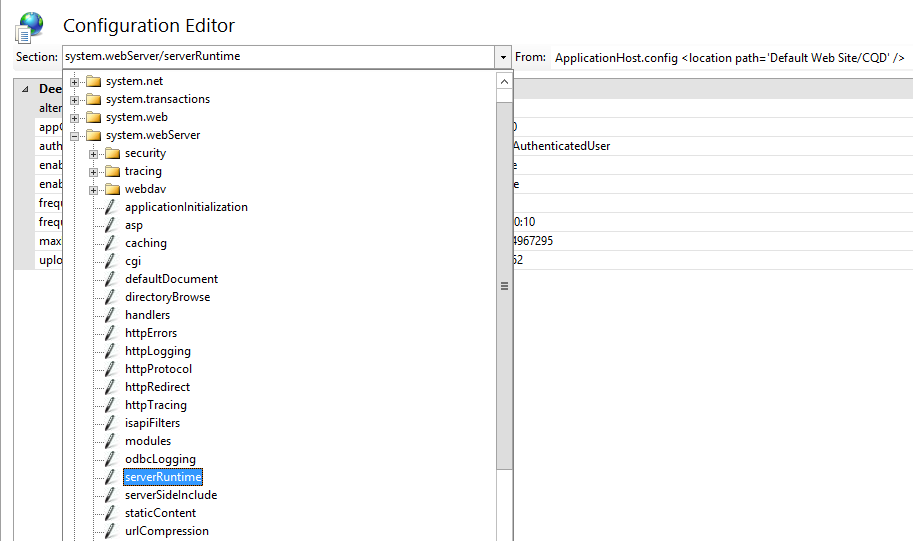

# <a name="deploy-call-quality-dashboard-for-skype-for-business-server"></a><span data-ttu-id="b12ce-104">Implementar el panel de calidad de llamadas para Skype empresarial Server</span><span class="sxs-lookup"><span data-stu-id="b12ce-104">Deploy Call Quality Dashboard for Skype for Business Server</span></span>
 
<span data-ttu-id="b12ce-105">**Resumen:** Obtenga más información sobre el proceso de implementación para el panel de calidad de llamadas.</span><span class="sxs-lookup"><span data-stu-id="b12ce-105">**Summary:** Learn about the deployment process for Call Quality Dashboard.</span></span> <span data-ttu-id="b12ce-106">El panel de calidad de llamadas es una herramienta para Skype empresarial Server.</span><span class="sxs-lookup"><span data-stu-id="b12ce-106">Call Quality Dashboard is a tool for Skype for Business Server.</span></span>
  
## <a name="deployment-overview"></a><span data-ttu-id="b12ce-107">Información general de la implementación</span><span class="sxs-lookup"><span data-stu-id="b12ce-107">Deployment Overview</span></span>

<span data-ttu-id="b12ce-108">El panel de calidad de llamadas (CQD) consta de tres componentes principales:</span><span class="sxs-lookup"><span data-stu-id="b12ce-108">Call Quality Dashboard (CQD) consists of three major components:</span></span>
  
- <span data-ttu-id="b12ce-109">**Archivar la base**de datos, donde se replican y almacenan los datos de la calidad de la experiencia (QoE).</span><span class="sxs-lookup"><span data-stu-id="b12ce-109">**Archive Database**, where the Quality of Experience (QoE) data is replicated and stored.</span></span>
    
- <span data-ttu-id="b12ce-110">**Cubo**, donde los datos de la base de datos de archivo de QoE se agregan para un acceso rápido y optimizado.</span><span class="sxs-lookup"><span data-stu-id="b12ce-110">**Cube**, where data from QoE Archive database is aggregated for optimized and fast access.</span></span>
    
- <span data-ttu-id="b12ce-111">**Portal**, donde los usuarios pueden consultar y visualizar los datos de la calidad del QoE con facilidad.</span><span class="sxs-lookup"><span data-stu-id="b12ce-111">**Portal**, where users can easily query and visualize QoE data.</span></span>
    

  
<span data-ttu-id="b12ce-113">El proceso de configuración para el archivo de QoE incluye la creación de la base de datos de archivo de QoE, la implementación de un procedimiento almacenado de SQL Server que moverá los datos de la base de datos de la QoE de origen a la base de datos de archivo de QoE y la configuración del trabajo del Agente SQL Server para ejecutar el procedimiento a intervalos regulares.</span><span class="sxs-lookup"><span data-stu-id="b12ce-113">The setup process for QoE Archive involves creating the QoE Archive database, deploying a SQL Server stored procedure that will move the data from the source QoE Metrics database into QoE Archive database, and setting up the SQL Server Agent job to execute the stored procedure at a regular interval.</span></span> 
  
<span data-ttu-id="b12ce-114">Implementación de cubo obtiene información del usuario en la que se encuentra el archivo de calidad de la calidad, implementa el cubo y configura un trabajo normal del Agente SQL Server que actualizará el cubo a intervalos regulares.</span><span class="sxs-lookup"><span data-stu-id="b12ce-114">Cube deployment gets information from the user on where the QoE Archive is located, deploys the cube, and sets up a regular SQL Server agent job that will refresh the cube at a regular interval.</span></span>
  
<span data-ttu-id="b12ce-115">Instalación del portal crea una base de datos del depósito que almacena la asignación de los usuarios del CQD a las consultas o los informes de cada usuario.</span><span class="sxs-lookup"><span data-stu-id="b12ce-115">Portal install creates a Repository database that stores the mapping of CQD users to each user's reports/queries.</span></span> <span data-ttu-id="b12ce-116">Después, configura una aplicación Web de IIS, que es el panel donde los usuarios pueden ver un conjunto predefinido de informes, así como personalizar y crear sus propias consultas para visualizar los datos del cubo.</span><span class="sxs-lookup"><span data-stu-id="b12ce-116">It then sets up an IIS web application which is the dashboard where users can see a pre-defined set of reports as well as customize and create their own queries to visualize data from the cube.</span></span> <span data-ttu-id="b12ce-117">La instalación del portal crea dos aplicaciones web adicionales que exponen las API para que los usuarios tengan acceso mediante programación al repositorio y al cubo.</span><span class="sxs-lookup"><span data-stu-id="b12ce-117">The portal install creates two additional web applications that exposes APIs for users to programmatically access the repository and the cube.</span></span> <span data-ttu-id="b12ce-118">(El panel también usa internamente estas API).</span><span class="sxs-lookup"><span data-stu-id="b12ce-118">(These APIs are used internally by the dashboard as well.)</span></span>
  

|<span data-ttu-id="b12ce-119">**Fase**</span><span class="sxs-lookup"><span data-stu-id="b12ce-119">**Phase**</span></span>|<span data-ttu-id="b12ce-120">**Pasos**</span><span class="sxs-lookup"><span data-stu-id="b12ce-120">**Steps**</span></span>|<span data-ttu-id="b12ce-121">**Roles y pertenencia a grupos**</span><span class="sxs-lookup"><span data-stu-id="b12ce-121">**Roles and group membership**</span></span>|<span data-ttu-id="b12ce-122">**Documentación**</span><span class="sxs-lookup"><span data-stu-id="b12ce-122">**Documentation**</span></span>|
|:-----|:-----|:-----|:-----|
|<span data-ttu-id="b12ce-123">Instalar requisitos previos de hardware y software.</span><span class="sxs-lookup"><span data-stu-id="b12ce-123">Install prerequisite hardware and software.</span></span>  <br/> |<span data-ttu-id="b12ce-124">Decida la configuración del CQD y seleccione un SQL Server desde el que realizar la instalación.</span><span class="sxs-lookup"><span data-stu-id="b12ce-124">Decide on the CQD configuration, and choose a SQL Server from which to perform the install.</span></span>  <br/> |<span data-ttu-id="b12ce-125">Usuario de dominio que es miembro del grupo de administradores locales.</span><span class="sxs-lookup"><span data-stu-id="b12ce-125">Domain user who is a member of the local administrators group.</span></span>  <br/> |<span data-ttu-id="b12ce-126">Sección "requisitos previos a la instalación" de la documentación de implementación.</span><span class="sxs-lookup"><span data-stu-id="b12ce-126">"Pre-install Requirements" section in the deployment documentation.</span></span>  <br/> |
|<span data-ttu-id="b12ce-127">Instale el CQD.</span><span class="sxs-lookup"><span data-stu-id="b12ce-127">Install CQD.</span></span>  <br/> |<span data-ttu-id="b12ce-128">Ejecute el MSI siguiendo el documento de implementación.</span><span class="sxs-lookup"><span data-stu-id="b12ce-128">Run the MSI following the deployment document.</span></span>  <br/> |<span data-ttu-id="b12ce-129">Para realizar la configuración, la cuenta de instalación debe ser un usuario de dominio que sea miembro del grupo de administradores locales y tener acceso de lectura a la base de datos de QoE Metrics en el servidor de supervisión.</span><span class="sxs-lookup"><span data-stu-id="b12ce-129">To perform the setup, the installing account must be a domain user who is a member of the local administrators group and have read access to QoE Metrics database on the Monitoring Server.</span></span>  <br/> |<span data-ttu-id="b12ce-130">Secciones "cuentas y pasos de implementación" en la documentación de implementación.</span><span class="sxs-lookup"><span data-stu-id="b12ce-130">"Accounts and Deployment Steps" sections in the deployment documentation.</span></span>  <br/> |
|<span data-ttu-id="b12ce-131">Conceder acceso al usuario.</span><span class="sxs-lookup"><span data-stu-id="b12ce-131">Grant user access.</span></span>  <br/> |<span data-ttu-id="b12ce-132">Para administrar la autorización de usuario para el portal, se recomienda usar la autorización de URL, que se presentó en IIS 7,0.</span><span class="sxs-lookup"><span data-stu-id="b12ce-132">For managing user authorization to the Portal, we recommend using URL Authorization, which was introduced in IIS 7.0.</span></span> <span data-ttu-id="b12ce-133">Para obtener más información, vea Descripción de la [autorización de URL de IIS 7,0](https://www.iis.net/learn/manage/configuring-security/understanding-iis-url-authorization).</span><span class="sxs-lookup"><span data-stu-id="b12ce-133">For more information, see [Understanding IIS 7.0 URL Authorization](https://www.iis.net/learn/manage/configuring-security/understanding-iis-url-authorization).</span></span>  <br/> |<span data-ttu-id="b12ce-134">Usuario de dominio que es miembro del grupo de administradores locales.</span><span class="sxs-lookup"><span data-stu-id="b12ce-134">Domain user who is a member of the local administrators group.</span></span>  <br/> |<span data-ttu-id="b12ce-135">Administrar el acceso de los usuarios para la sección del portal en la documentación de implementación.</span><span class="sxs-lookup"><span data-stu-id="b12ce-135">Managing User Access for the Portal section in the deployment documentation.</span></span>  <br/> |
|<span data-ttu-id="b12ce-136">Opcional: proporcionar información de asignación de subred.</span><span class="sxs-lookup"><span data-stu-id="b12ce-136">Optional: Provide subnet mapping information.</span></span>  <br/> |<span data-ttu-id="b12ce-137">Rellene la red y cree tablas de asignación en la base de datos de archivos de QoE.</span><span class="sxs-lookup"><span data-stu-id="b12ce-137">Populate network and building mapping tables in QoE Archive database.</span></span>  <br/> |<span data-ttu-id="b12ce-138">Una cuenta con acceso de escritura a la base de datos de archivo de calidad.</span><span class="sxs-lookup"><span data-stu-id="b12ce-138">An account with write access to the QoE Archive database.</span></span>  <br/> |<span data-ttu-id="b12ce-139">Sección "suministrar información de subred" en la documentación del usuario.</span><span class="sxs-lookup"><span data-stu-id="b12ce-139">"Supplying Subnet Information" section in the user documentation.</span></span>  <br/> |
   


<span data-ttu-id="b12ce-140">La implementación del panel de calidad de llamadas implica la configuración de la infraestructura y la instalación del software.</span><span class="sxs-lookup"><span data-stu-id="b12ce-140">Deployment of Call Quality Dashboard involves setting up the infrastructure and installing the software.</span></span> <span data-ttu-id="b12ce-141">El procedimiento siguiente describe el proceso.</span><span class="sxs-lookup"><span data-stu-id="b12ce-141">The following procedure outlines the process.</span></span>
  
## <a name="deployment-steps"></a><span data-ttu-id="b12ce-142">Pasos de implementación</span><span class="sxs-lookup"><span data-stu-id="b12ce-142">Deployment Steps</span></span>

1. <span data-ttu-id="b12ce-143">Copie CallQualityDashboard. msi en el equipo en el que se va a instalar el componente de base de datos de archivo del CQD (este es el equipo que tiene instalado SQL Server).</span><span class="sxs-lookup"><span data-stu-id="b12ce-143">Copy the CallQualityDashboard.msi to the machine where the archive database component of CQD is to be installed (this is the machine that has SQL Server installed).</span></span> 
    
2. <span data-ttu-id="b12ce-144">Ejecute el MSI (Windows le pedirá que se ejecute con privilegio de administrador, etc.).</span><span class="sxs-lookup"><span data-stu-id="b12ce-144">Execute the MSI (Windows will prompt to run with administrator privilege, do so).</span></span> 
    
3. <span data-ttu-id="b12ce-145">Acepte el CLUF.</span><span class="sxs-lookup"><span data-stu-id="b12ce-145">Accept the EULA.</span></span>
    
4. <span data-ttu-id="b12ce-146">Seleccione la carpeta de destino donde se encuentran los archivos relacionados con los componentes del panel de calidad de llamadas o acepte la ubicación predeterminada.</span><span class="sxs-lookup"><span data-stu-id="b12ce-146">Select the destination folder where files related to Call Quality Dashboard components will be located or accept the default location.</span></span>
    
5. <span data-ttu-id="b12ce-147">Seleccione todas las características.</span><span class="sxs-lookup"><span data-stu-id="b12ce-147">Select all features.</span></span>
    
6. <span data-ttu-id="b12ce-148">En la página Configuración del archivo de calidad del archivo, proporcione la siguiente información:</span><span class="sxs-lookup"><span data-stu-id="b12ce-148">At the QoE Archive Configuration page, provide the following information:</span></span>
    
   - <span data-ttu-id="b12ce-149">La QoE de calidad de la **calidad de SQL Server:** Nombre de la instancia de SQL Server para el lugar donde se encuentra la base de datos de la calidad de la QoE (este es el origen de datos).</span><span class="sxs-lookup"><span data-stu-id="b12ce-149">**QoE Metrics SQL Server:** SQL Server instance name for where the QoE Metrics DB is located (this will be the data source).</span></span>
    
   - <span data-ttu-id="b12ce-150">**Nombre del servidor SQL del archivo QoE:** Este campo es de solo lectura y se fija en el nombre de dominio completo del equipo local.</span><span class="sxs-lookup"><span data-stu-id="b12ce-150">**QoE Archive SQL Server Name:** This is read-only field and fixed to the fully qualified domain name of the local machine.</span></span> <span data-ttu-id="b12ce-151">La base de datos de almacenamiento solo se puede instalar en el equipo local.</span><span class="sxs-lookup"><span data-stu-id="b12ce-151">Archive DB can be installed only on the local machine.</span></span>
    
   - <span data-ttu-id="b12ce-152">**Archivo de la instancia de SQL Server de archivo QoE:** Un nombre de instancia de SQL Server local para el lugar donde se va a crear la base de datos de archivo.</span><span class="sxs-lookup"><span data-stu-id="b12ce-152">**QoE Archive SQL Server Instance:** A local SQL Server instance name for where the Archive DB is to be created.</span></span> <span data-ttu-id="b12ce-153">Para usar una instancia de SQL Server predeterminada, deje este campo en blanco.</span><span class="sxs-lookup"><span data-stu-id="b12ce-153">To use a default SQL Server instance, leave this field blank.</span></span> <span data-ttu-id="b12ce-154">Para usar una instancia de SQL Server con nombre, especifique el nombre de la instancia (por ejemplo,\"el nombre después de ")".</span><span class="sxs-lookup"><span data-stu-id="b12ce-154">To use a named SQL Server instance, specify the instance name (e.g. the name after the "\").</span></span>
    
   - <span data-ttu-id="b12ce-155">**Base de datos de archivo de QoE:** De forma predeterminada, esta opción está establecida en "crear nueva base de datos".</span><span class="sxs-lookup"><span data-stu-id="b12ce-155">**QoE Archive Database:** By default, this option is set to "Create new database".</span></span> <span data-ttu-id="b12ce-156">Como la actualización de la base de datos archivada no es compatible, la única circunstancia en la que se puede usar la opción "usar base de datos existente" es si la base de datos de archivo existente tiene el mismo esquema que la compilación que se va a instalar.</span><span class="sxs-lookup"><span data-stu-id="b12ce-156">Since Archive DB upgrade is not supported, the only circumstance under which the "Use existing database" option can be used is if the existing Archive database has the same schema as the build to be installed.</span></span>
    
   - <span data-ttu-id="b12ce-157">**Directorio de archivos de base de datos:** Ruta de acceso donde se deben colocar los archivos de base de datos (. MDF y. ldf) para el archivo BD de archivo.</span><span class="sxs-lookup"><span data-stu-id="b12ce-157">**Database File Directory:** Path to where the database files (.mdf and .ldf) for the Archive DB should be placed.</span></span> <span data-ttu-id="b12ce-158">Debe estar en una unidad (HDD2 en la configuración de hardware recomendada) independiente del sistema operativo.</span><span class="sxs-lookup"><span data-stu-id="b12ce-158">This should be on a drive (HDD2 in the recommended hardware configuration) separate from the OS.</span></span> <span data-ttu-id="b12ce-159">Tenga en cuenta que, dado que los nombres de archivo se corrigen en la instalación, para evitar posibles conflictos, se recomienda que se use un directorio en blanco sin archivos.</span><span class="sxs-lookup"><span data-stu-id="b12ce-159">Note that since the file names are fixed in the install, to avoid any potential conflict, it is recommended that a blank directory with no files be used.</span></span>
    
   - <span data-ttu-id="b12ce-160">**Usar varias particiones:** El valor predeterminado se establece en "partición múltiple", que requiere Business Intelligence Edition o Enterprise Edition de SQL Server.</span><span class="sxs-lookup"><span data-stu-id="b12ce-160">**Use Multiple Partitions:** The default is set to "Multiple partition", which requires Business Intelligence edition or Enterprise edition of SQL Server.</span></span> <span data-ttu-id="b12ce-161">Para Standard Edition, seleccione la opción "partición única".</span><span class="sxs-lookup"><span data-stu-id="b12ce-161">For Standard edition, select "Single Partition" option.</span></span> <span data-ttu-id="b12ce-162">Tenga en cuenta que el rendimiento del procesamiento del cubo puede verse afectado si se usa una única partición.</span><span class="sxs-lookup"><span data-stu-id="b12ce-162">Note that cube processing performance may be impacted if Single Partition is used.</span></span>
    
     > [!NOTE]
     > <span data-ttu-id="b12ce-163">La opción selección para usar varias particiones no se puede cambiar una vez que se complete la instalación.</span><span class="sxs-lookup"><span data-stu-id="b12ce-163">The selection for Use Multiple Partitions option cannot be changed once Setup completes.</span></span> <span data-ttu-id="b12ce-164">Para poder cambiarla, la característica de cubo debe desinstalarse primero y volver a instalarse con la opción "cambiar" del panel de control.</span><span class="sxs-lookup"><span data-stu-id="b12ce-164">In order to change it, the Cube feature needs to be first uninstalled and then reinstalled using "Change" option in Control Panel.</span></span> 
  
   - <span data-ttu-id="b12ce-165">**Directorio de archivos de partición:** Ruta en la que se deben ubicar las particiones de la base de datos de archivo de calidad.</span><span class="sxs-lookup"><span data-stu-id="b12ce-165">**Partition File Directory:** Path to where the partitions for the QoE Archive database should be placed.</span></span> <span data-ttu-id="b12ce-166">Debe estar en una unidad (HDD3 en la configuración de hardware recomendada) independiente de la unidad del sistema operativo y de los archivos de registro de la base de datos de SQL.</span><span class="sxs-lookup"><span data-stu-id="b12ce-166">This should be on a drive (HDD3 in the recommended hardware configuration) separate from the OS drive and SQL database log files drive.</span></span> <span data-ttu-id="b12ce-167">Tenga en cuenta que, dado que los nombres de archivo se corrigen en la instalación, para evitar posibles conflictos, se recomienda que se use un directorio en blanco sin archivos.</span><span class="sxs-lookup"><span data-stu-id="b12ce-167">Note that since the file names are fixed in the install, to avoid any potential conflict, it is recommended that a blank directory with no files be used.</span></span>
    
   - <span data-ttu-id="b12ce-168">**Trabajo del Agente SQL-contraseña del &amp; nombre de usuario:** Nombre y contraseña de la cuenta de servicio de dominio (enmascarado) que se utilizarán para ejecutar el paso "información del archivo de QoE" del trabajo del Agente SQL Server (que ejecutará el procedimiento almacenado para capturar datos de la base de datos de la serie QoE a la BD de archivo, por lo que esta cuenta debe tener acceso de lectura a la base de datos de la métrica</span><span class="sxs-lookup"><span data-stu-id="b12ce-168">**SQL Agent Job User - User Name &amp; Password:** Domain service account name and password (masked) that will be used to run the "QoE Archive Data" step of the SQL Server Agent job (which will run the stored procedure to fetch data from QoE Metrics DB into Archive DB, so this account must have read access to QoE Metrics DB, as indicated under Accounts section.</span></span> <span data-ttu-id="b12ce-169">Esta cuenta también necesita tener un inicio de sesión en la instancia de Archive SQL Server de QoE).</span><span class="sxs-lookup"><span data-stu-id="b12ce-169">This account also needs to have a login in the QoE Archive SQL Server Instance).</span></span>
    
     > [!NOTE]
     > <span data-ttu-id="b12ce-170">La cuenta con la que se ejecuta la instancia de SQL Server, como NT SERVICE\MSSQLSERVER, debe tener acceso/permiso a los directorios mencionados anteriormente para que la instalación se realice correctamente.</span><span class="sxs-lookup"><span data-stu-id="b12ce-170">The account that the SQL Server instance is running under, such as NT SERVICE\MSSQLSERVER, must have access/permission to the directories given above for the installation to succeed.</span></span> <span data-ttu-id="b12ce-171">Para obtener más información, vea [configurar permisos del sistema de archivos para el acceso del motor de base de datos](https://msdn.microsoft.com/en-us/library/jj219062%28v=sql.110%29.aspx)</span><span class="sxs-lookup"><span data-stu-id="b12ce-171">For details, see [Configure File System Permissions for Database Engine Access](https://msdn.microsoft.com/en-us/library/jj219062%28v=sql.110%29.aspx)</span></span>
  
7. <span data-ttu-id="b12ce-172">Al hacer clic en siguiente, el instalador realizará comprobaciones y notificaciones de requisitos previos si se producen problemas.</span><span class="sxs-lookup"><span data-stu-id="b12ce-172">Upon clicking next, the installer will perform pre-requisite checks and report if any issues are encountered.</span></span> <span data-ttu-id="b12ce-173">Cuando se superan todas las comprobaciones de requisitos previos, el instalador irá a la página de configuración del cubo.</span><span class="sxs-lookup"><span data-stu-id="b12ce-173">When all pre-requisite checks pass, the installer will go to the Cube Configuration page.</span></span> 
    
    > [!NOTE]
    > <span data-ttu-id="b12ce-174">Si el instalador muestra un mensaje de advertencia que indica que el servicio del Agente SQL Server para la instancia de Archive SQL Server de QoE no se está ejecutando actualmente, la instalación puede continuar, pero después de la instalación, asegúrese de que el servicio Agente SQL se esté ejecutando y establezca el tipo de inicio en Automático para que se ejecute el trabajo programado.</span><span class="sxs-lookup"><span data-stu-id="b12ce-174">If the installer shows a warning message that the SQL Server Agent service for the QoE Archive SQL Server instance is currently not running, installation can proceed, but post installation please make sure that SQL Agent service is running and set the Startup type to Automatic so that the scheduled Job runs.</span></span> 
  
8. <span data-ttu-id="b12ce-175">En la página Configuración del cubo, proporcione la siguiente información:</span><span class="sxs-lookup"><span data-stu-id="b12ce-175">At Cube Configuration page, provide the following information:</span></span>
    
   - <span data-ttu-id="b12ce-176">**Nombre del servidor SQL del archivo QoE:** Este campo es de solo lectura y se fija en el nombre de dominio completo del equipo local.</span><span class="sxs-lookup"><span data-stu-id="b12ce-176">**QoE Archive SQL Server Name:** This is read-only field and fixed to the fully qualified domain name of the local machine.</span></span> <span data-ttu-id="b12ce-177">El cubo solo se puede instalar desde la máquina que tiene la base de datos de archivo de calidad.</span><span class="sxs-lookup"><span data-stu-id="b12ce-177">Cube can be installed only from the machine that has QoE Archive database (Note.</span></span> <span data-ttu-id="b12ce-178">El propio cubo puede instalarse en un equipo remoto.</span><span class="sxs-lookup"><span data-stu-id="b12ce-178">Cube itself may be installed on a remote machine.</span></span> <span data-ttu-id="b12ce-179">Ver a continuación)</span><span class="sxs-lookup"><span data-stu-id="b12ce-179">See below)</span></span>
    
   - <span data-ttu-id="b12ce-180">**Archivo de la instancia de SQL Server de archivo QoE:** Nombre de la instancia de SQL Server en la que se encuentra la QoE Archive DB.</span><span class="sxs-lookup"><span data-stu-id="b12ce-180">**QoE Archive SQL Server Instance:** SQL Server instance name for where the QoE Archive DB is located.</span></span> <span data-ttu-id="b12ce-181">Para especificar una instancia de SQL Server predeterminada, deje este campo en blanco.</span><span class="sxs-lookup"><span data-stu-id="b12ce-181">To specify a default SQL Server instance, leave this field blank.</span></span> <span data-ttu-id="b12ce-182">Para especificar una instancia de SQL Server con nombre, escriba el nombre de la instancia (por ejemplo,\"el nombre después de ")".</span><span class="sxs-lookup"><span data-stu-id="b12ce-182">To specify a named SQL Server instance, enter the instance name (e.g. the name after the "\").</span></span> <span data-ttu-id="b12ce-183">Si se seleccionó el componente de archivo QoE para la instalación, este campo estará previamente rellenado con el valor proporcionado en la página de configuración del archivo de calidad.</span><span class="sxs-lookup"><span data-stu-id="b12ce-183">If QoE Archive component was selected for the install, this field will be pre-populated with the value provided on the QoE Archive Configuration page.</span></span>
    
   - <span data-ttu-id="b12ce-184">**Servidor de análisis de cubos:** Nombre de instancia de SQL Server Analysis Services para la ubicación donde se va a crear el cubo.</span><span class="sxs-lookup"><span data-stu-id="b12ce-184">**Cube Analysis Server:** SQL Server Analysis Service instance name for where the cube is to be created.</span></span> <span data-ttu-id="b12ce-185">Puede ser un equipo diferente, pero el usuario de instalación tiene que ser miembro de los administradores de servidor de la instancia de SQL Server Analysis Services de destino.</span><span class="sxs-lookup"><span data-stu-id="b12ce-185">This can be a different machine but the installing user has to be a member of Server administrators of the target SQL Server Analysis Service instance.</span></span>
    
     > [!NOTE]
     >  <span data-ttu-id="b12ce-186">Para obtener más información sobre cómo configurar permisos de administrador del servidor de Analysis Services, consulte [conceder permisos de administrador de servidor (Analysis Services)](https://msdn.microsoft.com/en-us/library/ms174561.aspx) .</span><span class="sxs-lookup"><span data-stu-id="b12ce-186">For more information about configuring Analysis Services Server Administrator Permissions, see [Grant Server Administrator Permissions (Analysis Services)](https://msdn.microsoft.com/en-us/library/ms174561.aspx)</span></span>
  
   - <span data-ttu-id="b12ce-187">**Usar varias particiones:** El valor predeterminado se establece en "partición múltiple", que requiere Business Intelligence Edition o Enterprise Edition de SQL Server.</span><span class="sxs-lookup"><span data-stu-id="b12ce-187">**Use Multiple Partitions:** The default is set to "Multiple partition", which requires Business Intelligence edition or Enterprise edition of SQL Server.</span></span> <span data-ttu-id="b12ce-188">Para Standard Edition, seleccione la opción "partición única".</span><span class="sxs-lookup"><span data-stu-id="b12ce-188">For Standard edition, select "Single Partition" option.</span></span> <span data-ttu-id="b12ce-189">Tenga en cuenta que el rendimiento del procesamiento del cubo puede verse afectado si se usa una única partición.</span><span class="sxs-lookup"><span data-stu-id="b12ce-189">Note that cube processing performance may be impacted if Single Partition is used .</span></span>
    
     > [!NOTE]
     >  <span data-ttu-id="b12ce-190">La opción selección para usar varias particiones no se puede cambiar una vez que se complete la instalación.</span><span class="sxs-lookup"><span data-stu-id="b12ce-190">The selection for Use Multiple Partitions option cannot be changed once Setup completes.</span></span> <span data-ttu-id="b12ce-191">Para poder cambiarla, la característica de cubo debe desinstalarse primero y volver a instalarse con la opción "cambiar" del panel de control.</span><span class="sxs-lookup"><span data-stu-id="b12ce-191">In order to change it, the Cube feature needs to be first uninstalled and then reinstalled using "Change" option in Control Panel.</span></span>
  
   - <span data-ttu-id="b12ce-192">**Usuario del cubo: contraseña &amp; del nombre de usuario:** Nombre y contraseña de la cuenta de servicio de dominio (enmascarado) que desencadenarán el procesamiento del cubo.</span><span class="sxs-lookup"><span data-stu-id="b12ce-192">**Cube User - User Name &amp; Password:** Domain service account name and password (masked) that will trigger the cube processing.</span></span> <span data-ttu-id="b12ce-193">Si se seleccionó el componente de archivo QoE para la instalación, este campo se rellenará previamente con el valor proporcionado en la página Configuración de archivo del usuario del trabajo del Agente SQL, pero recomendamos especificar otra cuenta de servicio de dominio para que el programa de instalación pueda conceder el privilegio mínimo requerido.</span><span class="sxs-lookup"><span data-stu-id="b12ce-193">If QoE Archive component was selected for the install, this field will be pre-populated with the value provided on the Archive Configuration page for the SQL Agent Job User, but we recommend specifying a different domain service account so that Setup can grant the least required privilege to it.</span></span>
    
9. <span data-ttu-id="b12ce-194">Al hacer clic en siguiente, se realizará otro turno de validación y se informará de cualquier problema.</span><span class="sxs-lookup"><span data-stu-id="b12ce-194">When clicking next, another round of validation will be performed and any issue will be reported.</span></span> <span data-ttu-id="b12ce-195">Una vez completada la validación correctamente, el instalador irá a la página de configuración del portal.</span><span class="sxs-lookup"><span data-stu-id="b12ce-195">Upon successful completion of the validation, the installer will go to the Portal Configuration page.</span></span> 
    
10. <span data-ttu-id="b12ce-196">En la página Configuración del portal, proporcione la siguiente información:</span><span class="sxs-lookup"><span data-stu-id="b12ce-196">At Portal Configuration page, provide the following information:</span></span>
    
    - <span data-ttu-id="b12ce-197">**Servidor SQL Server de calidad:** Nombre de la instancia de SQL Server en la que se encuentra la base de datos del archivo de calidad.</span><span class="sxs-lookup"><span data-stu-id="b12ce-197">**QoE Archive SQL Server:** SQL Server instance name for where the QoE Archive database is located.</span></span> <span data-ttu-id="b12ce-198">Tenga en cuenta que, a diferencia de la página Configuración del archivo de calidad del archivo y la página Configuración del cubo, el nombre del equipo no es fijo y debe proporcionarse.</span><span class="sxs-lookup"><span data-stu-id="b12ce-198">Note that unlike the QoE Archive Configuration page and the Cube Configuration page, the machine name is not fixed and must be provided.</span></span> <span data-ttu-id="b12ce-199">Si se seleccionó el componente de archivo QoE para la instalación, este campo estará previamente rellenado con el valor proporcionado en la página de configuración del archivo de calidad.</span><span class="sxs-lookup"><span data-stu-id="b12ce-199">If QoE Archive component was selected for the install, this field will be pre-populated with the value provided on the QoE Archive Configuration page.</span></span>
    
    - <span data-ttu-id="b12ce-200">**Servidor de análisis de cubos:** Nombre de la instancia de SQL Server Analysis Services para la ubicación del cubo.</span><span class="sxs-lookup"><span data-stu-id="b12ce-200">**Cube Analysis Server:** SQL Server Analysis Service instance name for where the cube is located.</span></span> <span data-ttu-id="b12ce-201">Si se seleccionó el componente de cubo para la instalación, este campo se rellenará previamente con el valor proporcionado en la página Configuración del cubo.</span><span class="sxs-lookup"><span data-stu-id="b12ce-201">If Cube component was selected for the install, this field will be pre-populated with the value provided on the Cube Configuration page.</span></span>
    
    - <span data-ttu-id="b12ce-202">**SQL Server del repositorio:** Nombre de la instancia de SQL Server donde se va a crear la base de datos del repositorio.</span><span class="sxs-lookup"><span data-stu-id="b12ce-202">**Repository SQL Server:** SQL Server instance name where the Repository database is to be created.</span></span> <span data-ttu-id="b12ce-203">Si el nombre de la instancia de SQL Server en el que se encuentra la base de datos de archivo de QoE se ha proporcionado anteriormente en la configuración (en otros componentes), este campo estará previamente rellenado con el nombre de la instancia de SQL Server de archivo de QoE.</span><span class="sxs-lookup"><span data-stu-id="b12ce-203">If the SQL Server instance name for where the QoE Archive database is located has been provided earlier in the setup (in other components), this field will be pre-populated with the QoE Archive DB SQL Server instance name.</span></span> <span data-ttu-id="b12ce-204">Puede ser cualquier instancia de SQL Server.</span><span class="sxs-lookup"><span data-stu-id="b12ce-204">This can be any SQL Server instance.</span></span>
    
    - <span data-ttu-id="b12ce-205">**Base de datos del repositorio:** De forma predeterminada, la opción se establece en "crear una nueva base de datos".</span><span class="sxs-lookup"><span data-stu-id="b12ce-205">**Repository Database:** By default the option is set to "Create new database".</span></span> <span data-ttu-id="b12ce-206">Puesto que la actualización de BD de repositorio no es compatible, la única circunstancia en la que se puede usar la opción "usar base de datos existente" es si la base de datos del repositorio existente tiene el mismo esquema que la compilación que se va a instalar.</span><span class="sxs-lookup"><span data-stu-id="b12ce-206">Since Repository DB upgrade is not supported, the only circumstance under which the "Use existing database" option can be used is if the existing Repository DB has the same schema as the build to be installed.</span></span>
    
    - <span data-ttu-id="b12ce-207">**Usuario del grupo de aplicaciones de IIS &amp; : contraseña del nombre de usuario:** Cuenta con la que se debe ejecutar el grupo de aplicaciones de IIS.</span><span class="sxs-lookup"><span data-stu-id="b12ce-207">**IIS App Pool User - User Name &amp; Password:** The account that the IIS application pool should execute under.</span></span> <span data-ttu-id="b12ce-208">Los campos nombre de usuario y contraseña aparecerán atenuados si se seleccionan las cuentas del sistema integrado.</span><span class="sxs-lookup"><span data-stu-id="b12ce-208">The User Name and Password fields will be grayed out if built-in system accounts are selected.</span></span> <span data-ttu-id="b12ce-209">Estos campos solo se habilitan si se selecciona "otro" en el cuadro desplegable para que el usuario pueda escribir la información de la cuenta de servicio de dominio.</span><span class="sxs-lookup"><span data-stu-id="b12ce-209">These fields will only be enabled if "Other" is selected from the drop down box so the user can enter the domain service account information.</span></span>
    
11. <span data-ttu-id="b12ce-210">Al hacer clic en siguiente, la última ronda de validación se realizará para asegurarse de que se puede acceder a las instancias de SQL Server con las credenciales proporcionadas y de que IIS está disponible en el equipo.</span><span class="sxs-lookup"><span data-stu-id="b12ce-210">When clicking next, the final round of validation will be done to ensure that the SQL Server instances are accessible using the credentials provided and that IIS is available on the machine.</span></span> <span data-ttu-id="b12ce-211">Una vez completada la validación correctamente, el instalador continuará con la configuración.</span><span class="sxs-lookup"><span data-stu-id="b12ce-211">Upon successful completion of the validation, the installer will proceed with the setup.</span></span> 
    
<span data-ttu-id="b12ce-212">Una vez finalizado el instalador, lo más probable es que el trabajo del Agente SQL Server esté en curso, realizando la carga inicial de los datos de la calidad de la calidad y el procesamiento del cubo.</span><span class="sxs-lookup"><span data-stu-id="b12ce-212">When the installer is done, most likely the SQL Server Agent job will be in progress, doing the initial load of the QoE data and the cube processing.</span></span> <span data-ttu-id="b12ce-213">En función de la cantidad de datos de QoE, el portal no tendrá datos disponibles para su visualización.</span><span class="sxs-lookup"><span data-stu-id="b12ce-213">Depending on the amount of data in QoE, the portal will not have data available for viewing yet.</span></span> <span data-ttu-id="b12ce-214">Para comprobar el estado de la carga de datos y el procesamiento del cubo, `http://<machinename>/CQD/#/Health`vaya a.</span><span class="sxs-lookup"><span data-stu-id="b12ce-214">To check on the status of the data load and cube processing, go to  `http://<machinename>/CQD/#/Health`.</span></span> 
> [!NOTE]
> <span data-ttu-id="b12ce-215">Observe que la dirección URL para comprobar el estado del procesamiento del cubo de descarga distingue entre mayúsculas y minúsculas.</span><span class="sxs-lookup"><span data-stu-id="b12ce-215">Note that the URL for checking the status of the download cube processing is case sensitive.</span></span> <span data-ttu-id="b12ce-216">Si escribe ' Health ', la dirección URL no funcionará.</span><span class="sxs-lookup"><span data-stu-id="b12ce-216">If you enter 'health' the URL will not work.</span></span> <span data-ttu-id="b12ce-217">Debes introducir ' Health ' al final de la dirección URL con una H mayúscula.</span><span class="sxs-lookup"><span data-stu-id="b12ce-217">You must enter 'Health' at the end of the URL with a capital H.</span></span> 
  
<span data-ttu-id="b12ce-218">Los mensajes de registro detallados se mostrarán si el modo de depuración está habilitado.</span><span class="sxs-lookup"><span data-stu-id="b12ce-218">Detailed log messages will be shown if debug mode is enabled.</span></span> <span data-ttu-id="b12ce-219">Para habilitar el modo de depuración, vaya a **%SystemDrive%\Archivos de Files\Skype para empresas 2015 CQD\QoEDataService\web.config**y actualice la siguiente línea para que el valor se establezca en **verdadero**:</span><span class="sxs-lookup"><span data-stu-id="b12ce-219">To enable debug mode, go to **%SYSTEMDRIVE%\Program Files\Skype For Business 2015 CQD\QoEDataService\web.config**, and update the following line so the value is set to **True**:</span></span>

```
<add key="QoEDataLib.DebugMode" value="True" /> 
```

<span data-ttu-id="b12ce-220">Se puede acceder a la Página principal `http://<machinename>/CQD`del portal a través de.</span><span class="sxs-lookup"><span data-stu-id="b12ce-220">The main portal page is accessible via  `http://<machinename>/CQD`.</span></span> 
## <a name="managing-user-access-for-the-portal"></a><span data-ttu-id="b12ce-221">Administrar el acceso de los usuarios del portal</span><span class="sxs-lookup"><span data-stu-id="b12ce-221">Managing User Access for the Portal</span></span>

<span data-ttu-id="b12ce-222">Para administrar la autorización de usuario para el portal, se recomienda usar la autorización de URL, que se presentó en IIS 7,0.</span><span class="sxs-lookup"><span data-stu-id="b12ce-222">For managing user authorization to the Portal, we recommend using URL Authorization, which was introduced in IIS 7.0.</span></span> <span data-ttu-id="b12ce-223">Para obtener más información sobre la seguridad de IIS, vea Descripción de la [autorización de URL de iis 7,0](https://www.iis.net/learn/manage/configuring-security/understanding-iis-url-authorization).</span><span class="sxs-lookup"><span data-stu-id="b12ce-223">For more information on IIS security, see [Understanding IIS 7.0 URL Authorization](https://www.iis.net/learn/manage/configuring-security/understanding-iis-url-authorization).</span></span>
  
<span data-ttu-id="b12ce-224">Cualquier sitio web o aplicación web hereda la autorización de dirección URL predeterminada configurada para el IIS completo, que normalmente es "permitir a todos los usuarios".</span><span class="sxs-lookup"><span data-stu-id="b12ce-224">Any web site or web application inherit the default URL Authorization configured for the entire IIS, which is typically "Allow All Users".</span></span> <span data-ttu-id="b12ce-225">Si el acceso al portal tiene que ser más restrictivo, los administradores pueden conceder acceso solo a un grupo específico de usuarios mediante la edición de las "reglas de autorización".</span><span class="sxs-lookup"><span data-stu-id="b12ce-225">If access to the Portal needs to be more restrictive, then administrators can grant access to only the specific group of users by editing the "Authorization Rules".</span></span>
  

  
> [!NOTE]
> <span data-ttu-id="b12ce-227">El icono de reglas de autorización no se debe confundir con la "autorización de .NET" en la sección ASP.NET, que es un mecanismo de autorización diferente.</span><span class="sxs-lookup"><span data-stu-id="b12ce-227">The Authorization Rules icon is not to be confused with the ".NET Authorization" under the ASP.NET section, which is a different authorization mechanism.</span></span> 
  
<span data-ttu-id="b12ce-228">Los administradores deben quitar primero la regla heredada "permitir todos los usuarios".</span><span class="sxs-lookup"><span data-stu-id="b12ce-228">Administrators should first remove the inherited "Allow All Users" rule.</span></span> <span data-ttu-id="b12ce-229">Esto evita que los usuarios no autorizados tengan acceso al portal.</span><span class="sxs-lookup"><span data-stu-id="b12ce-229">This prevents any non-authorized users from accessing the Portal.</span></span>
  

  
<span data-ttu-id="b12ce-231">Después, los administradores deben agregar nuevas reglas de autorización y conceder a los usuarios específicos el permiso para acceder al portal.</span><span class="sxs-lookup"><span data-stu-id="b12ce-231">Next, administrators should add new Allow Rules and give specific users the permission to access the Portal.</span></span> <span data-ttu-id="b12ce-232">Se recomienda crear un grupo local denominado "CQDPortalUsers" para administrar los usuarios.</span><span class="sxs-lookup"><span data-stu-id="b12ce-232">It is recommended that a local Group called "CQDPortalUsers" be created to manage the users.</span></span>
  

  
<span data-ttu-id="b12ce-234">Los detalles de configuración se almacenan en la Web. config, que se encuentra en el directorio físico del portal.</span><span class="sxs-lookup"><span data-stu-id="b12ce-234">The configuration details are stored in the web.config located at the Portal's physical directory.</span></span>
  
```XML
<?xml version="1.0" encoding="UTF-8"?> <configuration> <system.webServer> <security> <authorization> <remove users="*" roles="" verbs="" /> <add accessType="Allow" roles="CQDPortalUsers" /> </authorization> </security> </system.webServer> </configuration> 
```

<span data-ttu-id="b12ce-235">El siguiente paso es configurar el panel del CQD.</span><span class="sxs-lookup"><span data-stu-id="b12ce-235">The next step is to configure the dashboard of the CQD.</span></span> <span data-ttu-id="b12ce-236">Una vez que los usuarios sean autenticados por IIS, deberán tener permisos de archivo en el directorio de CQD para poder acceder al contenido del portal web.</span><span class="sxs-lookup"><span data-stu-id="b12ce-236">After users are authenticated by IIS, they will have to have file permissions on the CQD directory in order to access the web portal content.</span></span> <span data-ttu-id="b12ce-237">Es posible cambiar las ACL mediante la pestaña seguridad de las propiedades del directorio CQD para agregar usuarios individuales o grupos; sin embargo, el enfoque recomendado es dejar los permisos de archivo intactos.</span><span class="sxs-lookup"><span data-stu-id="b12ce-237">It is possible to change the ACLs through the security tab of the CQD directory properties to add individual users or groups; however the recommended approach is to leave the file permissions untouched.</span></span> <span data-ttu-id="b12ce-238">En su lugar, cambie la configuración de IIS para usar el proceso de trabajo de IIS para obtener acceso al directorio de CQD independientemente del usuario autenticado.</span><span class="sxs-lookup"><span data-stu-id="b12ce-238">Instead, change the IIS setting to use the IIS worker process to access the CQD directory no matter which user is authenticated.</span></span> 
  
> [!IMPORTANT]
> <span data-ttu-id="b12ce-239">Es importante que solo cambie esta configuración para la aplicación CQD y no para las dos aplicaciones API: QoEDataService y QoERepositoryService.</span><span class="sxs-lookup"><span data-stu-id="b12ce-239">It is important to only change this setting for the CQD application, and not for the two API applications: QoEDataService and QoERepositoryService.</span></span> 
  
## <a name="configuring-file-access-for-the-cqd-dashboard"></a><span data-ttu-id="b12ce-240">Configuración del acceso a archivos para el CQD (panel)</span><span class="sxs-lookup"><span data-stu-id="b12ce-240">Configuring File Access for the CQD (Dashboard)</span></span>

1. <span data-ttu-id="b12ce-241">Abra el editor de configuración de CQD.</span><span class="sxs-lookup"><span data-stu-id="b12ce-241">Open the Configuration Editor for CQD.</span></span>
    
     
  
2. <span data-ttu-id="b12ce-243">En sección, elija **System. WebServer/serverRuntime**.</span><span class="sxs-lookup"><span data-stu-id="b12ce-243">Under Section, choose **system.webServer/serverRuntime**.</span></span>
    
     
  
3. <span data-ttu-id="b12ce-245">Cambie authenticatedUserOverride a **UseWorkerProcessUser**.</span><span class="sxs-lookup"><span data-stu-id="b12ce-245">Change authenticatedUserOverride to **UseWorkerProcessUser**.</span></span>
    
     
  
4. <span data-ttu-id="b12ce-247">Haga clic en **aplicar** en el lado derecho de la página.</span><span class="sxs-lookup"><span data-stu-id="b12ce-247">Click **Apply** on the right-hand side of the page.</span></span>
    
## <a name="known-issues"></a><span data-ttu-id="b12ce-248">Problemas conocidos</span><span class="sxs-lookup"><span data-stu-id="b12ce-248">Known Issues</span></span>

### <a name="the-cqd-shows-no-data-after-deployment"></a><span data-ttu-id="b12ce-249">El CQD no muestra datos después de la implementación</span><span class="sxs-lookup"><span data-stu-id="b12ce-249">The CQD shows no data after deployment</span></span>

<span data-ttu-id="b12ce-250">Es posible que reciba el siguiente error:</span><span class="sxs-lookup"><span data-stu-id="b12ce-250">You may receive the following error:</span></span>

<span data-ttu-id="b12ce-251">*No pudimos realizar la consulta mientras se ejecutaba en el cubo. Use el editor de consultas para modificar la consulta y corregir los problemas. Asegúrese también de que el cubo es accesible.*</span><span class="sxs-lookup"><span data-stu-id="b12ce-251">*We couldn’t perform the query while running it on the Cube. Use the Query Editor to modify the query and fix any issues. Also make sure that the Cube is accessible.*</span></span>

<span data-ttu-id="b12ce-252">Esto significa que el cubo debe procesarse en SQL Server Analysis Services antes de usarlo en el CQD.</span><span class="sxs-lookup"><span data-stu-id="b12ce-252">This means that the cube must be processed in SQL Server Analysis Services prior to being used in CQD.</span></span> <span data-ttu-id="b12ce-253">Para solucionar esto, siga estos pasos:</span><span class="sxs-lookup"><span data-stu-id="b12ce-253">You can resolve this by following these steps:</span></span>

1. <span data-ttu-id="b12ce-254">Abra SQL Management Studio y seleccione **Analysis Services**.</span><span class="sxs-lookup"><span data-stu-id="b12ce-254">Open SQL Management Studio and select **Analysis Services**.</span></span>

2. <span data-ttu-id="b12ce-255">Expanda el objeto **QoECube** , seleccione la **métrica de QoE**, haga clic con el botón derecho y, a continuación, elija **examinar**.</span><span class="sxs-lookup"><span data-stu-id="b12ce-255">Expand the **QoECube** object, select **QoE Metric**, right-click, and then choose **Browse**.</span></span> 

    <span data-ttu-id="b12ce-256">Si devuelve un explorador vacío, el cubo aún no se ha realizado.</span><span class="sxs-lookup"><span data-stu-id="b12ce-256">If this returns empty browser, the cube hasn’t been proceed yet.</span></span>

3. <span data-ttu-id="b12ce-257">Haga clic con el botón secundario en ganancia **métrica de QoE** y elija **procesar**.</span><span class="sxs-lookup"><span data-stu-id="b12ce-257">Right-click **QoE Metric** angain and choose **Process**.</span></span>

4. <span data-ttu-id="b12ce-258">Cuando el procesamiento haya finalizado, vuelva a hacer clic con el botón derecho en el objeto y elija **examinar** para confirmar que la página del explorador muestra los datos.</span><span class="sxs-lookup"><span data-stu-id="b12ce-258">When processing is complete, right-click the object again, and choose **Browse** to confirm that the browser page now shows data.</span></span> 


### <a name="users-have-trouble-logging-in-because-installer-fails-to-create-the-correct-settings-in-iis"></a><span data-ttu-id="b12ce-259">Los usuarios tienen problemas para iniciar sesión porque el instalador no puede crear la configuración correcta en IIS</span><span class="sxs-lookup"><span data-stu-id="b12ce-259">Users have trouble logging in because installer fails to create the correct settings in IIS</span></span>

<span data-ttu-id="b12ce-260">En raras ocasiones, el instalador no puede crear la configuración correcta en IIS.</span><span class="sxs-lookup"><span data-stu-id="b12ce-260">In rare cases, the installer fails to create the correct settings in IIS.</span></span> <span data-ttu-id="b12ce-261">El cambio manual es necesario para permitir que los usuarios inicien sesión en el CQD.</span><span class="sxs-lookup"><span data-stu-id="b12ce-261">Manual change is required to allow users to log into the CQD.</span></span> <span data-ttu-id="b12ce-262">Si los usuarios tienen problemas para iniciar sesión, siga estos pasos:</span><span class="sxs-lookup"><span data-stu-id="b12ce-262">If users are having trouble logging in, please follow these steps:</span></span>
  
1. <span data-ttu-id="b12ce-263">Abra el administrador de IIS y vaya al sitio web predeterminado.</span><span class="sxs-lookup"><span data-stu-id="b12ce-263">Open up IIS Manager, and navigate to Default Web Site.</span></span>
    
     
  
2. <span data-ttu-id="b12ce-265">Haz clic en "autenticación".</span><span class="sxs-lookup"><span data-stu-id="b12ce-265">Click on "Authentication".</span></span> <span data-ttu-id="b12ce-266">Si la "autenticación anónima", "ASP.NET suplantación", "autenticación de formularios" y "autenticación de Windows" no coinciden con la configuración que se muestra a continuación, cámbielas manualmente para que coincidan con los valores siguientes.</span><span class="sxs-lookup"><span data-stu-id="b12ce-266">If the "Anonymous Authentication", "ASP.NET Impersonation", "Form Authentication", and "Windows Authentication" do not match the settings shown below, manually change them to match the settings below.</span></span> <span data-ttu-id="b12ce-267">Se debe deshabilitar el resto de los mecanismos de autenticación.</span><span class="sxs-lookup"><span data-stu-id="b12ce-267">All other authentication mechanisms should be disabled.</span></span>
    
     
  
3. <span data-ttu-id="b12ce-269">Para "autenticación de Windows", haga clic en configuración avanzada, en la parte derecha.</span><span class="sxs-lookup"><span data-stu-id="b12ce-269">For "Windows Authentication", click on Advanced Settings on the right-hand side.</span></span>
    
     
  
4. <span data-ttu-id="b12ce-271">Configure "protección extendida" para que acepte y active la casilla "habilitar la autenticación de modo kernel".</span><span class="sxs-lookup"><span data-stu-id="b12ce-271">Set "Extended Protection" to Accept and check the "Enable Kernel-mode authentication" box.</span></span>
    
     
  
5. <span data-ttu-id="b12ce-273">Repita los pasos anteriores para cada una de las entradas "CQD", "QoEDataService" y "QoERepositoryService", que se encuentran debajo de "sitio web predeterminado".</span><span class="sxs-lookup"><span data-stu-id="b12ce-273">Repeat the above steps for each of the "CQD", "QoEDataService", and "QoERepositoryService" entries below "Default Web Site".</span></span>
    
<span data-ttu-id="b12ce-274">Para los enlaces de Puerto HTTP y HTTPS, el instalador creará enlaces de puertos en los números de puertos predeterminados (puerto 80 para HTTP y puerto 443 para HTTPS).</span><span class="sxs-lookup"><span data-stu-id="b12ce-274">For HTTP and HTTPS port bindings the installer will create port bindings on the default port numbers (port 80 for HTTP and port 443 for HTTPS).</span></span> <span data-ttu-id="b12ce-275">Si hay otro sitio web en el equipo que usa estos enlaces, se producirá un conflicto y no se podrá predecir el comportamiento de IIS.</span><span class="sxs-lookup"><span data-stu-id="b12ce-275">If there is another website on the machine that uses these bindings, there will be a conflict and the IIS behavior cannot be predicted.</span></span> <span data-ttu-id="b12ce-276">La mejor manera de evitar este problema es asegurarse de que no hay otros sitios web asignados a los puertos 80 y 443 antes de instalar el CQD.</span><span class="sxs-lookup"><span data-stu-id="b12ce-276">The best way to avoid this problem is to make sure that no other websites are mapped to ports 80 and 443 before installing CQD.</span></span> 
  
<span data-ttu-id="b12ce-277">Para habilitar SSL/TLS en IIS y obligar a los usuarios a conectarse a través de HTTPS seguro en lugar de HTTP:</span><span class="sxs-lookup"><span data-stu-id="b12ce-277">To enable SSL/TLS in IIS and force users to connect via secure HTTPS instead of HTTP:</span></span>
  
1. <span data-ttu-id="b12ce-278">Configurar la capa de sockets seguros en IIS, vea [configurar el nivel de sockets seguros en IIS 7](https://technet.microsoft.com/en-us/library/cc771438%28v=ws.10%29.aspx).</span><span class="sxs-lookup"><span data-stu-id="b12ce-278">Configure Secure Sockets Layer in IIS, see [Configuring Secure Sockets Layer in IIS 7](https://technet.microsoft.com/en-us/library/cc771438%28v=ws.10%29.aspx).</span></span> <span data-ttu-id="b12ce-279">Una vez hecho esto `http` , `https`reemplaza por.</span><span class="sxs-lookup"><span data-stu-id="b12ce-279">Once done, replace  `http` with `https`.</span></span>
    
2. <span data-ttu-id="b12ce-280">Para obtener instrucciones sobre cómo habilitar TLS en las conexiones de SQL Server, consulte [Cómo habilitar el cifrado SSL para una instancia de SQL Server mediante Microsoft Management Console](https://support.microsoft.com/en-us/kb/316898/).</span><span class="sxs-lookup"><span data-stu-id="b12ce-280">For instructions on enabling TLS in the SQL Server connections, see [How to enable SSL encryption for an instance of SQL Server by using Microsoft Management Console](https://support.microsoft.com/en-us/kb/316898/).</span></span>
    
## <a name="cube-sync-fails"></a><span data-ttu-id="b12ce-281">Error en la sincronización del cubo</span><span class="sxs-lookup"><span data-stu-id="b12ce-281">Cube Sync Fails</span></span>

<span data-ttu-id="b12ce-282">QoEMetrics puede contener algunos registros no válidos basados en los relojes de los usuarios finales.</span><span class="sxs-lookup"><span data-stu-id="b12ce-282">QoEMetrics may contain some invalid records based on end user clocks.</span></span> <span data-ttu-id="b12ce-283">Si el sesgo horario es superior a 60 años, se producirá un error en la importación del cubo.</span><span class="sxs-lookup"><span data-stu-id="b12ce-283">If the time skew is greater than 60 yrs, the cube import will fail.</span></span>
  
 <span data-ttu-id="b12ce-284">Comprueba la hora de finalización mínima y máxima de la hora de finalización/hora de las siguientes opciones.</span><span class="sxs-lookup"><span data-stu-id="b12ce-284">Check the Min and Max StartTime/EndTime using the selections below.</span></span> <span data-ttu-id="b12ce-285">Busque y elimine registros en el futuro muy lejano y muy lejano, se pueden descartar y se descartarán los procesos de sincronización.</span><span class="sxs-lookup"><span data-stu-id="b12ce-285">Look for and delete records in the far past and very distant future, they can be disregarded and they will break up the sync processes.</span></span>
  
- <span data-ttu-id="b12ce-286">Seleccione mín (StartTime) desde CqdPartitionedStreamView</span><span class="sxs-lookup"><span data-stu-id="b12ce-286">Select MIN(StartTime) FROM CqdPartitionedStreamView</span></span>
    
- <span data-ttu-id="b12ce-287">Seleccione MAX (StartTime) FROM CqdPartitionedStreamView</span><span class="sxs-lookup"><span data-stu-id="b12ce-287">Select MAX(StartTime) FROM CqdPartitionedStreamView</span></span>
    
- <span data-ttu-id="b12ce-288">Seleccione mín (EndTime) desde CqdPartitionedStreamView</span><span class="sxs-lookup"><span data-stu-id="b12ce-288">Select MIN(EndTime) FROM CqdPartitionedStreamView</span></span>
    
- <span data-ttu-id="b12ce-289">Seleccione MAX (EndTime) desde CqdPartitionedStreamView</span><span class="sxs-lookup"><span data-stu-id="b12ce-289">Select MAX(EndTime) FROM CqdPartitionedStreamView</span></span>
    
## <a name="post-install-tasks"></a><span data-ttu-id="b12ce-290">Tareas posteriores a la instalación</span><span class="sxs-lookup"><span data-stu-id="b12ce-290">Post-install tasks</span></span>

### <a name="importing-buildings-and-networks"></a><span data-ttu-id="b12ce-291">Importar edificios y redes</span><span class="sxs-lookup"><span data-stu-id="b12ce-291">Importing Buildings and Networks</span></span>

<span data-ttu-id="b12ce-292">Después de instalar el CQD, realice las siguientes tareas de configuración:</span><span class="sxs-lookup"><span data-stu-id="b12ce-292">After Installing CQD, perform the following configuration tasks:</span></span>
  
1. <span data-ttu-id="b12ce-293">Definir tipos de creación (recomendado)</span><span class="sxs-lookup"><span data-stu-id="b12ce-293">Define Building types (recommended)</span></span>
    
2. <span data-ttu-id="b12ce-294">Definir tipos de propiedad de construcción (recomendado)</span><span class="sxs-lookup"><span data-stu-id="b12ce-294">Define Building Ownership types (recommended)</span></span>
    
3. <span data-ttu-id="b12ce-295">Definir tipos de red (muy recomendable)</span><span class="sxs-lookup"><span data-stu-id="b12ce-295">Define Network types (highly recommended)</span></span>
    
4. <span data-ttu-id="b12ce-296">Importar edificios (recomendado)</span><span class="sxs-lookup"><span data-stu-id="b12ce-296">Import Buildings (recommended)</span></span>
    
5. <span data-ttu-id="b12ce-297">Importar subredes (recomendado)</span><span class="sxs-lookup"><span data-stu-id="b12ce-297">Import Subnets (recommended)</span></span>
    
### <a name="define-building-types"></a><span data-ttu-id="b12ce-298">Definir tipos de creación</span><span class="sxs-lookup"><span data-stu-id="b12ce-298">Define Building Types</span></span>

<span data-ttu-id="b12ce-299">Los tipos de construcción se usan para describir las diferentes definiciones o tipos de edificios de su organización.</span><span class="sxs-lookup"><span data-stu-id="b12ce-299">Building types are used to describe the different buildings definitions or types within your organization.</span></span> 
  
> [!NOTE]
> <span data-ttu-id="b12ce-300">Este paso es opcional, pero recomendado.</span><span class="sxs-lookup"><span data-stu-id="b12ce-300">This step is optional, but recommended.</span></span> 
  
<span data-ttu-id="b12ce-301">Ejemplos</span><span class="sxs-lookup"><span data-stu-id="b12ce-301">Examples</span></span>
  
- <span data-ttu-id="b12ce-302">Sede central</span><span class="sxs-lookup"><span data-stu-id="b12ce-302">Headquarters</span></span>
    
- <span data-ttu-id="b12ce-303">Oficina remota</span><span class="sxs-lookup"><span data-stu-id="b12ce-303">Remote Office</span></span>
    
- <span data-ttu-id="b12ce-304">Ubicación de la empresa conjunta</span><span class="sxs-lookup"><span data-stu-id="b12ce-304">Joint-venture location</span></span>
    
  <span data-ttu-id="b12ce-305">**Ejemplo de sintaxis SQL**</span><span class="sxs-lookup"><span data-stu-id="b12ce-305">**Sample SQL Syntax**</span></span>
  
```SQL
INSERT INTO
[dbo].[CqdBuildingType]
([BuildingTypeId],
[BuildingTypeDesc])
VALUES
(1, 
'Headquarters')   
```

<span data-ttu-id="b12ce-306">Los parámetros BuildingTypeId y BuildingTypeDesc son obligatorios.</span><span class="sxs-lookup"><span data-stu-id="b12ce-306">The BuildingTypeId and BuildingTypeDesc parameters are required.</span></span>
  
### <a name="define-building-ownership-types"></a><span data-ttu-id="b12ce-307">Definir tipos de propiedad de construcción</span><span class="sxs-lookup"><span data-stu-id="b12ce-307">Define Building Ownership Types</span></span>

<span data-ttu-id="b12ce-308">Los tipos de propiedad se usan para distinguir los activos de propiedad y concesiones.</span><span class="sxs-lookup"><span data-stu-id="b12ce-308">Ownership types are used to distinguish owned vs leased assets.</span></span>
  
> [!NOTE]
> <span data-ttu-id="b12ce-309">Este paso es opcional, pero recomendado.</span><span class="sxs-lookup"><span data-stu-id="b12ce-309">This step is optional, but recommended.</span></span> 
  
<span data-ttu-id="b12ce-310">Ejemplos</span><span class="sxs-lookup"><span data-stu-id="b12ce-310">Examples</span></span>
  
- <span data-ttu-id="b12ce-311">Contoso alquilado no RE&amp;F</span><span class="sxs-lookup"><span data-stu-id="b12ce-311">Contoso Leased non-RE&amp;F</span></span>
    
- <span data-ttu-id="b12ce-312">RE&amp;alquilada de Contoso F</span><span class="sxs-lookup"><span data-stu-id="b12ce-312">Contoso Leased RE&amp;F</span></span>
    
- <span data-ttu-id="b12ce-313">Propiedad de Contoso</span><span class="sxs-lookup"><span data-stu-id="b12ce-313">Contoso Owned</span></span>
    
- <span data-ttu-id="b12ce-314">Arrendamiento de subsidiarias</span><span class="sxs-lookup"><span data-stu-id="b12ce-314">Subsidiary Leased</span></span>
    
  <span data-ttu-id="b12ce-315">**Ejemplo de sintaxis SQL**</span><span class="sxs-lookup"><span data-stu-id="b12ce-315">**Sample SQL Syntax**</span></span>
  
```SQL
INSERT INTO
[dbo].[CqdBuildingOwnershipType]
([OwnershipTypeId],
[OwnershipTypeDesc]
)

VALUES
(1,
'Contoso Owned'
)
```

<span data-ttu-id="b12ce-316">Los parámetros OwnershipTypeId y OwnershipTypeDesc son obligatorios.</span><span class="sxs-lookup"><span data-stu-id="b12ce-316">The OwnershipTypeId and OwnershipTypeDesc parameters are required.</span></span> 
  
### <a name="define-network-names"></a><span data-ttu-id="b12ce-317">Definir nombres de red</span><span class="sxs-lookup"><span data-stu-id="b12ce-317">Define Network Names</span></span>

<span data-ttu-id="b12ce-318">Los tipos de red se usan para describir distintos tipos de redes dentro de la organización.</span><span class="sxs-lookup"><span data-stu-id="b12ce-318">Network Types are used to describe different types of networks within the organization.</span></span> <span data-ttu-id="b12ce-319">Esto le ofrece la posibilidad de filtrar (o filtrar) determinados tipos de red.</span><span class="sxs-lookup"><span data-stu-id="b12ce-319">This gives you the ability to filter on (or filter out) specific Network Types.</span></span>
  
> [!NOTE]
> <span data-ttu-id="b12ce-320">Es muy recomendable definir nombres de red, pero es opcional.</span><span class="sxs-lookup"><span data-stu-id="b12ce-320">It is highly recommended to define Network Names, but it is optional.</span></span> <span data-ttu-id="b12ce-321">Si decide no definir nombres de red, asegúrese de que la entrada de CqdNetwork tiene un BuildingId de 0.</span><span class="sxs-lookup"><span data-stu-id="b12ce-321">If you decide to not define network names, ensure the each CqdNetwork entry has a BuildingId of 0.</span></span> 
  
<span data-ttu-id="b12ce-322">Ejemplos</span><span class="sxs-lookup"><span data-stu-id="b12ce-322">Examples</span></span>
  
- <span data-ttu-id="b12ce-323">VPN</span><span class="sxs-lookup"><span data-stu-id="b12ce-323">VPN</span></span>
    
- <span data-ttu-id="b12ce-324">PRÁCTICO</span><span class="sxs-lookup"><span data-stu-id="b12ce-324">LAB</span></span>
    
  <span data-ttu-id="b12ce-325">**Ejemplo de sintaxis SQL**</span><span class="sxs-lookup"><span data-stu-id="b12ce-325">**Sample SQL Syntax**</span></span>
  
```SQL
INSERT INTO [dbo].[CqdNetworkName] 
( [NetworkName]
,[NetworkType]
 ) 
VALUES
('VPN','VPN') 
```

<span data-ttu-id="b12ce-326">Los parámetros NetworkNameID y red son obligatorios, el parámetro NetworkType es opcional, pero se recomienda.</span><span class="sxs-lookup"><span data-stu-id="b12ce-326">The NetworkNameID and NetworkName parameters are required, the NetworkType parameter is optional but recommended.</span></span>
  
### <a name="import-buildings"></a><span data-ttu-id="b12ce-327">Importar edificios</span><span class="sxs-lookup"><span data-stu-id="b12ce-327">Import Buildings</span></span>

<span data-ttu-id="b12ce-328">La importación de edificios te brinda la posibilidad de obtener información específica (llamadas deficientes por construcción en WiFi/cableada, etc.).</span><span class="sxs-lookup"><span data-stu-id="b12ce-328">Importing Buildings gives you the ability to get building specific insights (poor calls per building on WiFi/Wired, etc.).</span></span> 
  
> [!NOTE]
> <span data-ttu-id="b12ce-329">Este paso es opcional, pero recomendado.</span><span class="sxs-lookup"><span data-stu-id="b12ce-329">This step is optional, but recommended.</span></span> 
  
<span data-ttu-id="b12ce-330">Antes de importar un nuevo edificio, ya tiene un BuildingKey predefinido.</span><span class="sxs-lookup"><span data-stu-id="b12ce-330">Before you Import a new building you should already have a predefined BuildingKey identified.</span></span> <span data-ttu-id="b12ce-331">Para ello, emita el comando SQL "SELECT MAX (BuildingKey) FROM CqdBuilding" para identificar el valor actual y agregar 1 al resultado.</span><span class="sxs-lookup"><span data-stu-id="b12ce-331">To do that, issue the "SELECT MAX(BuildingKey) FROM CqdBuilding" SQL command to identify the current value and add 1 to the result.</span></span>
  
 <span data-ttu-id="b12ce-332">**Ejemplo de sintaxis SQL**</span><span class="sxs-lookup"><span data-stu-id="b12ce-332">**Sample SQL Syntax**</span></span>
  
```SQL
INSERT INTO [dbo].[CqdBuilding] 
( [BuildingKey]
,[BuildingName]
,[BuildingShortName]
,[OwnershipTypeId],
[BuildingTypeId]
)
VALUES
(2, 'Ann Arbor', 'AA', 0, 0)
```

<span data-ttu-id="b12ce-333">Se necesitan los parámetros BuildingKey, edificio, BuildingShortName, OwnershipTypeId, BuildingTypeId, los otros parámetros son opcionales.</span><span class="sxs-lookup"><span data-stu-id="b12ce-333">The BuildingKey, BuildingName, BuildingShortName, OwnershipTypeId, BuildingTypeId parameters are required, the other parameters are optional.</span></span>
  
### <a name="import-subnets"></a><span data-ttu-id="b12ce-334">Importar subredes</span><span class="sxs-lookup"><span data-stu-id="b12ce-334">Import Subnets</span></span>

<span data-ttu-id="b12ce-335">La importación de edificios te brinda la posibilidad de obtener información específica (llamadas deficientes por construcción en WiFi/cableada, etc.).</span><span class="sxs-lookup"><span data-stu-id="b12ce-335">Importing Buildings gives you the ability to get building specific insights (poor calls per building on WiFi/Wired, etc.).</span></span> 
  
> [!NOTE]
> <span data-ttu-id="b12ce-336">Este paso es opcional, pero recomendado.</span><span class="sxs-lookup"><span data-stu-id="b12ce-336">This step is optional, but recommended.</span></span> 
  
<span data-ttu-id="b12ce-337">Importar subredes y asignarlas a los edificios importados en el último paso.</span><span class="sxs-lookup"><span data-stu-id="b12ce-337">Import Subnets and map them to the Buildings imported in the last step.</span></span> <span data-ttu-id="b12ce-338">Si decide no rellenar red, asegúrese de que cada entrada de esta tabla use un NetworkNameID de 0.</span><span class="sxs-lookup"><span data-stu-id="b12ce-338">If you decided not to populate NetworkName, ensure each entry in this table uses a NetworkNameID of 0.</span></span>
  
 <span data-ttu-id="b12ce-339">**Ejemplo de sintaxis SQL**</span><span class="sxs-lookup"><span data-stu-id="b12ce-339">**Sample SQL Syntax**</span></span>
  
```SQL
INSERT INTO [dbo].[CqdNetwork] 
([Network]
,[NetworkNameID]
,[BuildingKey]
,[UpdatedDate]
)

VALUES
 ('172.16.254.0',0,1,'2015-11-11')
```

<span data-ttu-id="b12ce-340">La red y los parámetros UpdatedDate son obligatorios, los otros parámetros son opcionales.</span><span class="sxs-lookup"><span data-stu-id="b12ce-340">The Network, and UpdatedDate parameters are required, the other parameters are optional.</span></span>
  
### <a name="optional-bssid"></a><span data-ttu-id="b12ce-341">Opcional: BSSID</span><span class="sxs-lookup"><span data-stu-id="b12ce-341">Optional: BSSID</span></span>

<span data-ttu-id="b12ce-342">Rellenar la información de BSSID proporciona una correlación adicional de secuencias WiFi por controlador o radio.</span><span class="sxs-lookup"><span data-stu-id="b12ce-342">Populating BSSID information gives you additional WiFi stream correlation by controller or radio.</span></span> <span data-ttu-id="b12ce-343">Esto es además de filtrar por edificio o subred.</span><span class="sxs-lookup"><span data-stu-id="b12ce-343">This is in addition to filtering by building or subnet.</span></span> 
  
 <span data-ttu-id="b12ce-344">**Ejemplo de sintaxis SQL**</span><span class="sxs-lookup"><span data-stu-id="b12ce-344">**Sample SQL Syntax**</span></span>
  
```SQL
INSERT INTO [dbo].[CqdBssid]
([Ap],
[Bss],
[Building],
[ess],
[phy]
)
VALUES
('AP1','00-00-00-00-00-00','Aruba AP 1','Controller1','bgn')
```

<span data-ttu-id="b12ce-345">**Detalles de CqdBssidTable**</span><span class="sxs-lookup"><span data-stu-id="b12ce-345">**CqdBssidTable Details**</span></span>

|<span data-ttu-id="b12ce-346">**Tal como se muestra en el CQD**</span><span class="sxs-lookup"><span data-stu-id="b12ce-346">**As shown in CQD**</span></span>|<span data-ttu-id="b12ce-347">**Tabla CQDBssid**</span><span class="sxs-lookup"><span data-stu-id="b12ce-347">**CQDBssid Table**</span></span>|<span data-ttu-id="b12ce-348">**Entradas de ejemplo**</span><span class="sxs-lookup"><span data-stu-id="b12ce-348">**Example inputs**</span></span>|
|:-----|:-----|:-----|
|<span data-ttu-id="b12ce-349">AP NName</span><span class="sxs-lookup"><span data-stu-id="b12ce-349">Ap NName</span></span>  <br/> |<span data-ttu-id="b12ce-350">INALÁMBRICO</span><span class="sxs-lookup"><span data-stu-id="b12ce-350">AP</span></span>  <br/> |<span data-ttu-id="b12ce-351">AP1</span><span class="sxs-lookup"><span data-stu-id="b12ce-351">AP1</span></span>  <br/> |
|<span data-ttu-id="b12ce-352">BBssid</span><span class="sxs-lookup"><span data-stu-id="b12ce-352">BBssid</span></span>  <br/> |<span data-ttu-id="b12ce-353">BSS</span><span class="sxs-lookup"><span data-stu-id="b12ce-353">BSS</span></span>  <br/> |<span data-ttu-id="b12ce-354">00-00-00-00-00-00 (debe usar la Fformat delimitada)</span><span class="sxs-lookup"><span data-stu-id="b12ce-354">00-00-00-00-00-00 (you must use the delimited fformat)</span></span>  <br/> |
|<span data-ttu-id="b12ce-355">Control</span><span class="sxs-lookup"><span data-stu-id="b12ce-355">Controller</span></span>  <br/> |<span data-ttu-id="b12ce-356">Building</span><span class="sxs-lookup"><span data-stu-id="b12ce-356">Building</span></span>  <br/> |<span data-ttu-id="b12ce-357">Aruba PA 7</span><span class="sxs-lookup"><span data-stu-id="b12ce-357">Aruba AP 7</span></span>  <br/> |
|<span data-ttu-id="b12ce-358">Dispositivo</span><span class="sxs-lookup"><span data-stu-id="b12ce-358">Device</span></span>  <br/> |<span data-ttu-id="b12ce-359">ess</span><span class="sxs-lookup"><span data-stu-id="b12ce-359">ess</span></span>  <br/> |<span data-ttu-id="b12ce-360">Controller1</span><span class="sxs-lookup"><span data-stu-id="b12ce-360">Controller1</span></span>  <br/> |
|<span data-ttu-id="b12ce-361">Aficionados</span><span class="sxs-lookup"><span data-stu-id="b12ce-361">Radio</span></span>  <br/> |<span data-ttu-id="b12ce-362">phy</span><span class="sxs-lookup"><span data-stu-id="b12ce-362">phy</span></span>  <br/> |<span data-ttu-id="b12ce-363">bgn</span><span class="sxs-lookup"><span data-stu-id="b12ce-363">bgn</span></span>  <br/> |
   
### <a name="processing-the-imported-data"></a><span data-ttu-id="b12ce-364">Procesando los datos importados</span><span class="sxs-lookup"><span data-stu-id="b12ce-364">Processing the imported data</span></span>

<span data-ttu-id="b12ce-365">De forma predeterminada, después de importar datos de edificio o de red, solo se aplicará a los registros generados después de ese momento.</span><span class="sxs-lookup"><span data-stu-id="b12ce-365">By default, after you import building/network data it will only apply to records generated after that point in time.</span></span> 
  
<span data-ttu-id="b12ce-366">Para etiquetar todos los registros anteriores con estos nuevos datos, tendrá que ejecutar el procedimiento almacenado CqdUpdateBuilding, como se muestra a continuación:</span><span class="sxs-lookup"><span data-stu-id="b12ce-366">To tag all the previous records with this new data, you will need to run the CqdUpdateBuilding stored procedure as shown below:</span></span> 
  
<span data-ttu-id="b12ce-367">Asígnele la fecha del primer registro (identifique el uso del comando SELECT MIN (StartTime) de CqdPartitionedStreamView SQL), un EndDate de mañana y, a continuación, NULL para los dos últimos valores.</span><span class="sxs-lookup"><span data-stu-id="b12ce-367">Give it the date of your first record (identify that using the Select MIN(StartTime) FROM CqdPartitionedStreamView SQL command ), an EndDate of tomorrow, then NULL for the last two values.</span></span>
  
<span data-ttu-id="b12ce-368">Una vez que los datos están asociados a los datos de la secuencia, el cubo SSIS debe reprocesar todos los registros.</span><span class="sxs-lookup"><span data-stu-id="b12ce-368">Once the data is associated with stream data, the SSIS Cube needs to reprocess all records.</span></span> <span data-ttu-id="b12ce-369">Esto también se aplica al agregar de forma masiva datos de BSSID o ISP.</span><span class="sxs-lookup"><span data-stu-id="b12ce-369">This also applies when bulk adding BSSID/ISP data.</span></span> <span data-ttu-id="b12ce-370">Asegúrese de que esté seleccionado "proceso completo".</span><span class="sxs-lookup"><span data-stu-id="b12ce-370">Ensure that "Process Full" is selected.</span></span>
  

