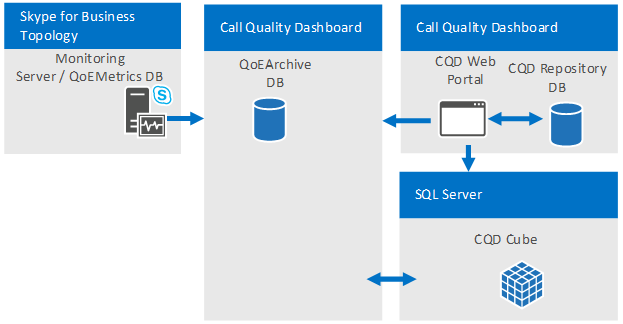

# <a name="plan-for-call-quality-dashboard-for-skype-for-business-server"></a>Planeación de panel de calidad de llamada de Skype para Business Server 
 
**Resumen:** Obtenga información sobre lo que debe tener en cuenta al planear para el panel de calidad de llamadas.
  
## <a name="overview-of-the-skype-for-business-server-call-quality-dashboard"></a>Información general de la Skype para Business Dashboard de calidad de llamada de servidor

El Skype para servidor de llamadas calidad panel (CQD) de negocio es una capa informes sobre la calidad de experiencia de base de datos en el servidor de supervisión en Skype para Business Server. CQD utiliza Microsoft SQL Server Analysis Services para proporcionar uso agregado e información sobre la calidad, así como para el filtrado y la creación de tablas dinámicas en el conjunto de datos de llamadas. Las características CQD incluyen:
  
- **Almacenamiento de archiving de datos de QoE mediante el componente de archivo QoE de CQD.** El componente de archiving QoE puede almacenar datos de QoE para una duración mucho mayor que el servidor de supervisión puede. Esto permite tendencias e informes para hasta siete meses a partir de datos a la vez, con la capacidad de diapositiva de la ventana de informes medida atrás en que no hay datos.
    
- **Creación de informes y análisis de uso de la energía y la velocidad de Microsoft SQL Server Analysis Services.** CQD utiliza Microsoft SQL Analysis Services para proporcionar resumen fast, filtro y creación de tablas dinámicas capacidades potenciar el panel a través de un cubo de Analysis. Velocidad de ejecución y la capacidad para profundizar en los datos de informes pueden reducir considerablemente los tiempos de análisis.
    
- **Nuevo esquema de datos optimizado para informes de calidad de llamada.** El cubo tiene un esquema diseñado para la creación de informes de calidad de voz e investigaciones. Los usuarios del portal pueden centrarse en las tareas informes en lugar de averiguar cómo las métricas QoE base de datos de esquema se asigna a las vistas que necesitan. La combinación del archivo QoE y el cubo proporciona una abstracción que reduce la complejidad de la creación de informes y análisis a través de CQD. El esquema de base de datos de archivo QoE también contiene tablas que se pueden rellenar con datos específicos de la implementación para mejorar el valor general de los datos.
    
- **Diseñador de informes integradas y edición de informes en contexto.** El componente de Portal incluye varios informes integrados que se modela después de la metodología de calidad de llamadas. Los usuarios del portal pueden modificar los informes y crear nuevos informes a través de la funcionalidad de edición del Portal.
    
- **Acceso de API Web a la estructura de informes y análisis de los datos del cubo.** El marco de informes de panel no es la única forma de mostrar los datos del cubo. CQD proporciona varios ejemplos de uso de HTML y JavaScript para recuperar datos de las API de Web CQD y representar los datos en un formato personalizado. La combinación de la API de Web de CQD y el Editor de informes permite la creación rápida de prototipos de informes y diseño de informe personalizado.
    
## <a name="cqd-design-goals"></a>Objetivos de diseño CQD

El panel de calidad de llamadas permite a los profesionales de TI usar datos de agregados para identificar áreas en su entorno que estén experimentando problemas en la calidad de los medios. También les permite comparar estadísticas de diferentes grupos de usuarios, e identificar tendencias y patrones. No se centra en la solución de problemas con llamadas individuales, sino en la identificación de problemas y soluciones aplicables a muchos usuarios dentro de un entorno. 
  
## <a name="call-quality-dashboard-components"></a>Llamar a los componentes del panel de calidad

El panel de calidad de llamadas consta de varias bases de datos, agente de SQL de Microsoft trabajos, procesos y aplicaciones web. Los trabajos del Agente SQL de Microsoft periódicamente copien los datos desde la base de datos de métricas de QoE en la base de datos QoE Archive y procesos el cubo con los datos de la base de datos de archivo de QoE. La base de datos de repositorio almacena las definiciones de informe que el Portal de energía. El Portal proporciona acceso de explorador a los datos del cubo. 
  
Los componentes CQD, incluidas las bases de datos de archivo QoE, cubo y repositorio, se pueden instalados en el servidor de supervisión, instalados en su propio servidor o instalados en varios servidores. El método de instalación particular dependerá de las demandas de rendimiento de CQD, así como la repercusión a otros procesos en los mismos servidores. Para obtener más información, consulte la sección "Componentes y topologías para CQD" más adelante en este artículo.
  
### <a name="architectural-overview"></a>Introducción a la arquitectura

Para resumir, CQD requiere los siguientes elementos:
  
- Dos bases de datos: una base de datos de archivo y una base de datos de repositorio.
    
- Un cubo de SSAS visualizar datos agregados 
    
- IIS hospeda CQD Web Portal
    

  
La misma arquitectura CQD es compatible con Lync Server 2013 y Skype para la empresa. 
  
### <a name="cqd-and-skype-for-business-vs-lync-2013"></a>CQD y Skype para empresarial frente a Lync 2013

 En un Skype para sólo en entornos empresariales, están disponibles las siguientes capacidades:
  
- Wi-Fi informes de intensidad de la señal
    
- Wi-Fi de informes de los controladores de conjunto de chips
    
- Tasa de Mis datos de llamada 
    
## <a name="information-available-through-cqd"></a>Información disponible a través de CQD

CQD puede mostrar Skype para Business Server audio, vídeo y uso compartido recuentos de secuencia y el número de buena frente a incorrectas llamadas así como las relaciones de las llamadas incorrectos a una buena de aplicaciones. Las vistas se pueden segmentadas y filtradas por el número de dimensiones diferente. CQD dibuja datos desde la base de datos de métricas de QoE en el servidor de supervisión. Los datos, a continuación, se combinan con los datos proporcionados por el cliente, como asignación de creación de subred de red para que sea posible informes como "Llamar calidad por Building". 
  
CQD también muchas de las idiosincrasias de datos QoE interno como "autor de la llamada" y "destinatario de la llamada" resume tal que el usuario puede centrarse en la creación de vistas de informe alrededor de "servidor" y "cliente". Después de la metodología de calidad de llamadas, CQD está optimizada para ayudar a identificar las condiciones que bolsillos de llamadas deficientes tienen en común: uno de los principios para mejorar la calidad de la llamada.
  
## <a name="viewing-data-in-cqd"></a>Visualización de datos en CQD

Los datos CQD se pueden ver a través del Portal de CQD y tener acceso a través de llamadas a la API de REST.
  
### <a name="cqd-portal"></a>Portal CQD

El Portal es la manera más rápida de ver los datos del cubo. El Portal incluye varios informes integrados que se pueden usar inmediatamente. Los informes integrados están vinculados de forma estructurada para guiar al usuario a segmentos sucesivamente más pequeños y más pequeños de los datos de llamada. Los informes integrados también resaltan las diferentes formas de que los datos se pueden mostrar con la demostración de una combinación de los gráficos y tablas con tablas dinámicas diferentes, filtros y medidas. Cada usuario que obtiene acceso el Portal puede tener su propio conjunto de informes que éste puede modificar y compartir. Para obtener más información sobre el uso del Portal Web CQD, vea [Usar el panel de calidad de llamadas de Skype para Business Server](use.md).
  
Sistemas operativos compatibles para CQD Portal: Windows 8.1, Windows 8, Windows Server 2012 R2, Windows Server 2012 y Windows Server 2016 (Skype para Business Server 2019 CQD únicamente).
  
Exploradores compatibles para CQD Portal: Internet Explorer 11, Internet Explorer 10 e Internet Explorer 9.
  
### <a name="rest-apis"></a>API de REST

También se pueden tener acceso a los datos del cubo a través de llamadas a la API de REST. Los datos recuperados a través de las llamadas de API de REST se pueden representar a través de las páginas HTML. Pueden realizar los usuarios aprovechar la velocidad de consulta y el esquema de alto nivel de CQD mientras aún crear informes personalizados se adapten a sus necesidades empresariales. Para obtener más información sobre la API y ejemplos, vea [Desarrollar el panel de calidad de llamadas de Skype para Business Server](develop.md). 
  
## <a name="defining-your-organizations-requirements-for-cqd"></a>Definir los requisitos de su organización para CQD

CQD proporciona los análisis de archivado y rápidamente y profundo de datos QoE de datos de calidad de la llamada. La siguiente guía le ayuda a decidir cuándo y por qué debería implementar CQD.
  
### <a name="when-to-deploy-cqd"></a>Cuándo se debe implementar CQD

 **CQD se puede implementar para establecer una medida de calidad de llamada de línea base, incluso si una organización no experimenta problemas de calidad de la llamada.** Establecimiento de una medida de calidad de llamada de línea de base es importante debido a que cada organización tiene una combinación diferente de Wi-Fi frente a remoto frente a los trabajadores de oficina y por cable. Cuando surgen problemas de calidad de llamada, las mediciones de calidad de llamada más recientes pueden compararse con los intervalos de tiempo anterior. Características de tendencias de CQD permiten fácil de detección de cambios en la calidad de las llamadas a través del tiempo.
  
 **CQD se puede implementar para buscar de forma proactiva áreas con problemas que pueden afectar la calidad de la llamada.** Incluso si el promedio de llamadas calidad para una organización puede cumplir los objetivos establecidos por la organización, podría haber bolsillos de problemas de calidad de llamada que están ocultos detrás de las métricas de promedio. CQD permite desglose de similar a una tabla dinámica de métricas de calidad de llamada por número de dimensiones de la base de datos QoEMetrics. Descubrir los valores atípicos en grupos del mismo nivel es una manera rápida de forma proactiva busque problemas de calidad de la llamada.
  
 **Deben implementarse CQD si hay problemas de calidad a llamadas en la organización para reducir el tiempo necesario para solucionar problemas.** CQD puede simplificar las investigaciones de calidad de llamada existente mediante el ofrecimiento de fast informes de rendimiento y funciones de desglose dinámica. CQD está diseñado para muchos tipos de flujos de trabajo en la validación de investigaciones de calidad de llamada de reparaciones en el entorno.
  
### <a name="why-deploy-cqd"></a>¿Por qué implementar CQD

 **Deben implementarse CQD si informes QoE deben ocurrir durante más de 3 meses de datos.** La base de datos QoEMetrics y los informes del servidor de supervisión están diseñados para conservar y un pequeño conjunto de datos de informes. La base de datos de métricas de QoE está optimizado para fast inserciones y, por lo tanto, rendimiento de los informes puede verse obstaculizada por gran volumen de llamadas o acceso informes que compitan entre sí a la base de datos. Base de datos de archivo de calidad de la experiencia del CQD proporciona una segunda copia de los datos de las métricas de QoE con mucho más capacidades de retención. El Portal también está optimizado para mostrar hasta 7 meses a partir de datos a la vez y puede informar sobre todos los datos en el archivo QoE según sea necesario.
  
 **Deben implementarse CQD si son necesarios informes QoE personalizados.** El Portal de tiene una característica de Editor de informes para crear prototipos y creación de informes de forma rápida y sencilla. También se hace las API de REST disponibles para el acceso mediante programación a los datos del cubo, que permiten la presentación personalizada con HTML/JavaScript o muchos otros marcos. Ya no es necesario crear nuevas consultas SQL con el fin de crear vistas de datos personalizados para informes.
  
 **Deben implementarse CQD si la funcionalidad de informes de QoE existente no cumple la velocidad o la profundidad requerida por la organización.** CQD incluye muchos informes integrados. Los informes son útiles inmediatamente y demostrar cómo progresivamente obtención de detalles en los datos puede ofrecer conocimientos adicionales en cada nivel. La jerarquía de informes también ayuda a administrar los numerosos informes de una manera lógica y fomenta la creación de muchos informes más que son fácilmente accesibles y de fácil comprensión. CQD simplemente no ofrece la velocidad y la flexibilidad, pero también está optimizada para los flujos de trabajo desarrollados por la metodología de calidad de llamadas.
  
## <a name="components-and-topologies-for-cqd"></a>Componentes y topologías para CQD

CQD incluye varios componentes y ayuda a comprender los requisitos de cada componente y su relación con cada una de las demás para obtener la implementación más simple y con un mejor rendimiento de la herramienta. En la siguiente tabla se describe el componente dependiente para cada componente CQD.
  

|**Nombre de componente**|**Componente dependiente**|
|:-----|:-----|
|Archivo de QoE  <br/> |Microsoft SQL Server  <br/> |
|Cubo  <br/> |Microsoft SQL Server Analysis Services  <br/> |
|Portal  <br/> |Servicios de información de Microsoft  <br/> |
|Servicio de repositorio (parte de la instalación de Portal)  <br/> |Microsoft SQL Server  <br/> |
   
> [!NOTE]
> Para archivar QoE y cubo, algunas opciones de implementación requieren ediciones de Business Intelligence o Enterprise de Microsoft SQL Server. Hacer referencia a la sección de [requisitos de infraestructura para CQD](plan.md#Infrastructure_Req) a continuación para obtener más detalles.
  

  
### <a name="single-server-configuration"></a>Configuración de servidor único

Todos los componentes CQD y dependientes se puede instalar en un equipo. La configuración de un solo es la configuración más sencilla y permite CQD a ser autónomos. CQD simplemente tendría acceso a la base de datos de métricas de QoE en el servidor de supervisión. El servidor de CQD puede ser un equipo independiente, una máquina virtual, o incluso puede ser el servidor de supervisión, dependiendo de los recursos disponibles del equipo host y los requisitos de rendimiento. 
  
Durante la instalación, el usuario realiza que la instalación simplemente se necesita para proporcionar a Microsoft SQL Server y las instancias de Microsoft SQL Server Analysis Services que se han previamente configuradas en el equipo donde está el CQD esté instalado. Hacer referencia a [Implementar el panel de calidad de llamadas de Skype para Business Server](deploy-0.md) para obtener más información.
  
### <a name="multiserver-configuration"></a>Configuración de varios servidores

En una configuración multiservidor, el archivo de QoE, cubo y Portal puede estar en equipos diferentes. Existen dos usos principales para la configuración de varios servidores:
  
- Hospedaje CQD Web Portal y CQD cubo en servidores diferentes.
    
- Hospedar un Portal independiente desde el Portal de "producción" "desarrollo". 
    
  **Hospedaje CQD Web Portal y CQD cubo en equipos diferentes.** Las organizaciones que pueden tener requisitos para separar el Portal de CQD de la instalación de SQL Server o que es posible que desee mezclar y hacer coincidir las ediciones de SQL Server para la instancia de SQL Server y una instancia de SQL Server Analysis Services pueden optar por instalar el Portal de CQD y Cubo de CQD en equipos diferentes. El componente de archiving QoE también puede ser el único componente de CQD que se instala si la organización simplemente desea tener un método sostenible para archivar los datos de QoE sin llegar a los límites de rendimiento en el servidor de supervisión.
  

  
 **Hospedar un Portal independiente desde el Portal de "producción" "desarrollo".** Las organizaciones que desarrollar sus propios informes personalizados (a través de las API de REST) es posible que prefieren implementar instancias adicionales de Portal (CQD) junto con la producción Portal que tienen acceso los usuarios normales para la supervisión de la calidad de llamada o investigaciones. El Portal de desarrollo puede aislar las modificaciones en el Portal de desde el entorno de producción. Los portales web adicionales se pueden implementar en equipos diferentes (que se muestra a continuación) o implementa en directorios web diferentes en el mismo equipo (no se muestra). Para llevar a cabo este último, el portal web CQD adicional debe copiarse en la máquina de producción manualmente debido a que el proceso de instalación CQD siempre implementa el Portal Web de CQD en el sitio web predeterminado con nombres de aplicaciones web predefinidos.
  

  
### <a name="supported-topologies"></a>Topologías compatibles

CQD no combinar datos de varias bases de datos QoEMetrics, como es el caso de que hay varios Skype para topologías de servidor empresarial, cada uno con su propio servidor de supervisión. Cada instancia CQD debe apuntar a una base de datos QoEMetrics. Sin embargo, debido a que se moverán CQD gran parte de la carga de trabajo informes fuera del servidor de supervisión, grandes organizaciones que necesitan para implementar un servidor de supervisión por Skype para la topología de servidor empresarial deben tener en cuenta el uso de un servidor de supervisión para todas las topologías.
  
## <a name="infrastructure-requirements-for-cqd"></a>Requisitos de infraestructura para CQD
<a name="Infrastructure_Req"> </a>

CQD, incluidos todos sus componentes y dependientes, puede implementarse en una máquina virtual, un solo equipo, o en varios equipos. Los requisitos mínimos de hardware y software se enumeran a continuación. Disponibilidad de los datos y la consulta de rendimiento puede variar de minutos a horas, dependiendo del número de Skype activo para los usuarios de Business Server y el hardware y la configuración, por lo que algunas mediciones de rendimiento se indican a continuación.
  
|||
|:-----|:-----|
|Sistemas operativos compatibles  <br/> |Windows Server 2008 R2, Windows Server 2012, Windows Server 2012 R2  <br/> |
|Compatibles SQL Server  <br/> |SQL Server 2012, SQL Server 2014, SQL Server 2016  <br/> |
   
CQD utiliza Microsoft SQL Server, Microsoft SQL Server Analysis Services y Microsoft Internet Information Services en modo de CQD mínimo requisitos de hardware y software son básicamente los mismos que esos componentes dependientes. Sin embargo, en función de los requisitos de la organización alrededor de actualización de datos (que depende en parte el volumen de datos QoE que genera la organización) y el costo de implementación, consideraciones de implementación adicionales deben hacerse.
  
Procesamiento de datos en CQD se divide en dos fases principales: 
  
- Proceso de archivado de QoE
    
- Procesamiento de cubo CQD
    
  **Archivo de QoE de procesamiento.** La tarea de procesamiento de archivo QoE copia los datos de la base de datos de métricas de QoE en el servidor de supervisión para la base de datos de archivo de QoE. Existen dos situaciones donde el tiempo de procesamiento de la tarea tendría fundamentalmente diferentes características de rendimiento. La primera es después de la instalación inicial de CQD. Cuando la tarea se ejecuta por primera vez después de una instalación nueva, la tarea de procesamiento de archivo QoE copiará todos los datos que se encuentra en la base de datos de métricas de QoE en QoE Archivar base de datos. El segundo es el procesamiento periódico después de esta fase inicial. El archivo QoE procesamiento tarea ejecutará cada 15 minutos y procesar todos los registros QoE nuevos que se encuentran en la base de datos de métricas de QoE. Por lo general, el tiempo de procesamiento inicial no es una preocupación debido a que éste se ejecute sólo la primera vez, cuando se instala CQD. Sin embargo, si el servidor CQD es muy bajo-aprovisionado, esta tarea puede tardar varias horas. Consulte la tabla siguiente por ejemplo inicial QoE de contenedores tiempo de procesamiento.
  
  **Procesamiento del cubo de CQD.** La tarea de procesamiento de cubo agrega los datos de la base de datos de archivo de QoE en el cubo. El tiempo de procesamiento de cubo inicial y el tiempo de procesamiento de cubo subsiguientes se determinan mediante la edición de SQL Server Analysis Services usada para el cubo de CQD. Si se utiliza la versión Standard edition, no hay ninguna diferencia entre el tiempo de procesamiento de cubo inicial y el cubo subsiguiente tiempo de procesamiento debido a que cada vez que se actualizan los datos del cubo, que siempre será un procesamiento completo de todos los datos disponibles. (Esto significa que el tiempo de procesamiento de cubo aumenta a medida que la cantidad de datos en el archivo QoE aumenta la base de datos). Debido a que el Business Intelligence Edition y Enterprise Edition de SQL Server tienen partición admitir, si se utiliza cualquier edición, sólo la ejecución inicial procesará todos los datos en la base de datos de archivo de QoE. En las ejecuciones subsiguientes, cuando la tarea se desencadena cada 15 minutos, la tarea sólo procesará los nuevos registros agregados a la base de datos de archivo de QoE desde la última vez que se ejecutó la tarea. Una vez al día, también habrá un procesamiento completo en la partición que contiene los datos del mes actual.
  
Las características de la máquina física pueden afectar al rendimiento de CQD, así como las características de software que están disponibles desde los componentes de SQL Server. El componente de archiving QoE será más-uso intensivo del disco en comparación con otros componentes, mientras que el componente de cubo será más CPU y memoria intensiva. Todos estos factores contribuyen a tiempo de procesamiento de datos total del CQD, que afecta directamente a la disponibilidad y la actualización de datos. Las organizaciones deben tomar decisiones en el hardware y software según las necesidades individuales de la organización. 
  
### <a name="tested-hardware-configurations"></a>Configuraciones de Hardware probada

Esta sección hace que la suposición de que hay una sola base de datos de QoEMetrics en el entorno. 
  
**Perfiles de equipo**

|**Máquina**|**Núcleos de CPU**|**MEMORIA RAM**|**Archivo de QoE y el cubo en el mismo disco**|**Base de datos de SQL Temp en el mismo disco y de archivo de QoE**|
|:-----|:-----|:-----|:-----|:-----|
|Máquina virtual  <br/> |4  <br/> |7 GB  <br/> |Sí  <br/> |Sí  <br/> |
|4 núcleos  <br/> |4  <br/> |20 GB  <br/> |Sí  <br/> |No  <br/> |
|8 núcleos  <br/> |8  <br/> |32 GB  <br/> |Sí  <br/> |No  <br/> |
|16 núcleos  <br/> |16  <br/> |128 GB  <br/> |No  <br/> |No  <br/> |
   
**Resultados de rendimiento**

|**Máquina**|**Tamaño de base de datos de métricas de QoE**|**Particiones de SQL**|**Tipo de disco**|**Número de transmisiones**|**Proceso de archivado inicial**|**Proceso inicial de cubo**|**Proceso de archivo posterior**|**Proceso de cubo posterior**|
|:-----|:-----|:-----|:-----|:-----|:-----|:-----|:-----|:-----|
|Máquina virtual  <br/> |900 MB  <br/> |Único  <br/> |VHD (tamaño variable)  <br/> |.5 M  <br/> |30 m  <br/> |2 m  <br/> |30 s  <br/> |1 m  <br/> |
|Máquina virtual  <br/> |9 GB  <br/> |Único  <br/> |VHD (tamaño variable)  <br/> |5 M  <br/> |4 h  <br/> |15 m  <br/> |1 m  <br/> |5 m  <br/> |
|Máquina virtual  <br/> |9 GB  <br/> |Único  <br/> |VHD (tamaño fijo)  <br/> |5 M  <br/> |2 h  <br/> |5 m  <br/> |1 m  <br/> |5 m  <br/> |
|Máquina virtual  <br/> |MÁS DE 30 GB  <br/> |Único  <br/> |VHD (tamaño fijo)  <br/> |10 M  <br/> |15 h  <br/> |20 m  <br/> |2 m  <br/> |45 m  <br/> |
|8 núcleos  <br/> |9 GB  <br/> |Único  <br/> |Varios discos  <br/> |5 M  <br/> |2 h  <br/> |5 m  <br/> |25 s  <br/> |5 m  <br/> |
|8 núcleos  <br/> |9 GB  <br/> |Varios  <br/> |Varios discos  <br/> |5 M  <br/> |2 h  <br/> |15 m  <br/> |35 s  <br/> |2 m  <br/> |
|8 núcleos  <br/> |MÁS DE 30 GB  <br/> |Único  <br/> |Varios discos  <br/> |20 M  <br/> |9 h  <br/> |20 m  <br/> |1 m  <br/> |20 m  <br/> |
|8 núcleos  <br/> |MÁS DE 30 GB  <br/> |Varios  <br/> |Varios discos  <br/> |20 M  <br/> |9 h  <br/> |30 m  <br/> |2 m  <br/> |2 m  <br/> |
|4 núcleos  <br/> |200 GB  <br/> |Único  <br/> |Varios discos  <br/> |125 M  <br/> |6 + días  <br/> |7 h  <br/> |2 m  <br/> |6 h  <br/> |
|16 núcleos  <br/> |500 GB  <br/> |Varios  <br/> |Varios cilindros  <br/> |250 M  <br/> |8 días  <br/> |2 h  <br/> |2 m  <br/> |10 m  <br/> |
   
\*No se espera que se encontró en las implementaciones reales debido a que la base de datos de métricas de QoE tendría que 9 y 18 meses de datos, respectivamente, pero que se proporcionan aquí para integridad.
  
### <a name="service-account-requirements"></a>Requisitos de la cuenta de servicio

Necesita una cuenta (con acceso de lectura a QoEMetrics) que el agente de SQL en el servidor de CQD puede usar para importar datos a la QoEArchiveDB.
  
También es posible que necesite configurar una cuenta independiente para un trabajo de SSAS para extraer datos de QoEArchiveDB (Esto es un proceso opcional).
  
IIS usa el servicio de red como identidad del grupo de servidores de aplicación con más frecuencia, pero se pueden configurar para una cuenta de servicio.
  
### <a name="portal-access-control"></a>Control de acceso al portal

De forma predeterminada, cualquier usuario autenticado tiene acceso. Esto se puede cambiar mediante el uso de las reglas de autorización de IIS para restringir a un grupo específico.
  
### <a name="pre-install-requirements"></a>Requisitos previos a la instalación

Estas instrucciones suponen que una base de datos de métricas de QoE ya se ha instalado y está ejecutándose en el Skype de topología de servidores de negocio.
  
#### <a name="hardware-requirements"></a>Requisitos de hardware

CQD utiliza Microsoft SQL Server, Microsoft SQL Analysis Server y Microsoft Internet Information Server en modo de CQD mínimo requisitos de hardware y software son básicamente los mismos que esos componentes dependientes. Sin embargo, en función de los requisitos de la organización alrededor de actualización de datos (que depende en parte el volumen de datos QoE que genera la organización) y el costo de implementación, consideraciones de implementación adicionales deben hacerse.
  
#### <a name="software-requirements"></a>Requisitos de software

Los siguientes sistemas operativos son necesarios para CQD:
  
- Windows Server 2008 R2 con IIS 7.5
    
- Windows Server 2012 con IIS 8.0
    
- Windows Server 2012 R2 con IIS 8,5

- Windows Server 2016 con IIS 10.0 (Skype para Business Server 2019 CQD sólo)
    
Los siguientes son los servicios de rol requeridos de IIS (en orden jerárquico):
  
- Servidor Web
    
  - Características HTTP comunes
    
  - Contenido estático
    
  - Documento predeterminado
    
  - Desarrollo de aplicaciones
    
  - ASP.NET
    
  - Filtros ISAPI
    
  - Mantenimiento &amp; diagnósticos
    
  - Registro HTTP
    
  - Seguridad
    
  - Autorización de dirección URL
    
  - Autenticación de Windows
    
  - Herramientas de administración
    
  - Consola de administración de IIS
    
> [!NOTE]
>  Tenga en cuenta que lo siguiente para las versiones de .net framework 3.5 y 4.5 requisitos: > mencionadas está disponibles. Ambos son necesarios (más concretamente, 3.5 SP1 es necesario) .> en algunos sistemas, si ASP.NET es el programa de instalación antes de instalar IIS, entonces no se puede registrar ASP.NET en IIS. El problema se produce a través de la ausencia de grupos de aplicaciones para la versión de .net correspondiente y también falta la versión de .NET CLR en configuración de grupo de servidores de aplicaciones. Para corregir un problema en Windows Server 2008 R2, ejecutar `%systemroot%\Microsoft.NET\Framework64\4.0.30319\aspnet_regiis.exe -iru`. En Windows Server 2012 y Windows Server 2012 R2, ejecutar `dism /online /enable-Feature /all /FeatureName:WCF-HTTP-Activation45` seguido de eliminación de la "ServiceModel" módulo desde el sitio Web predeterminado en las herramientas de administración de IIS Manager.> es opcional pero recomendado.
  
Para instalar estos requisitos con PowerShell, ejecute lo siguiente:
  
```
import-module servermanager
```

```
add-windowsfeature Web-Server, Web-Static-Content, Web-Default-Doc, Web-Asp-Net, Web-Asp-Net45, Web-Net-Ext, Web-Net-Ext45, Web-ISAPI-Ext, Web-ISAPI-Filter, Web-Http-Logging, Web-Url-Auth, Web-Windows-Auth, Web-Mgmt-Console
```

Se admiten las siguientes versiones de SQL Server:
  
- SQL Server 2012
    
- SQL Server 2014

- SQL Server 2016

- SQL Server 2017
    
Business Intelligence o Enterprise edition se recomienda por motivos de rendimiento. Estas ediciones de permiten el uso de varios archivos de partición que se pueden procesar en paralelo, lo que es beneficioso para el procesamiento de datos que abarcan varios meses o más larga. 
  
Mientras no se recomienda, también se admite la edición estándar. Procesamiento se restringe a una única partición (que debe configurarse durante el programa de instalación). 
  
En todos los casos, deben estar instalado "Servicios de motor de base de datos" y "Analysis Services". Se recomienda, aunque no es necesario que también instalar la característica "Herramientas de administración - completa", que agrega compatibilidad con SQL Server Management Studio para Analysis Services. Pantalla de selección de característica debe tener un aspecto similar a la ilustración.
  

  
Al configurar el programa de instalación SSAS, en la configuración de Analysis Services, establezca "Modo de servidor" a "Multidimensional y minería de modo de datos". 
  
Para obtener más ayuda en la instalación y configuración de características de inteligencia empresarial de SQL Server, vea [Instalar Analysis Services en Multidimensional y modo de minería de datos](https://msdn.microsoft.com/en-us/library/ms143708%28v=sql.110%29.aspx).
  
#### <a name="account-requirements"></a>Requisitos de la cuenta

Se recomiendan tres cuentas de servicio de dominio en el principio de privilegios mínimos: 
  
- Uno que ya tiene una entidad de seguridad de inicio de sesión para la base de datos de métricas de QoE (con privilegios db_datareader) y una entidad de seguridad de inicio de sesión en QoE archivo de instancia de SQL Server (es necesario para crear un objeto de servidor vinculado durante el programa de instalación). Esta cuenta se utilizará para ejecutar el paso de "Datos de archivo QoE" del trabajo del agente de SQL Server.
    
- Uno que se usará para ejecutar el paso "Proceso cubo" del trabajo del agente de SQL Server. El programa de instalación va a crear un inicio de sesión de entidad de seguridad a la base de datos QoE Archive (con de lectura y escritura con privilegios) y crear también un miembro de la función de QoE (con privilegios de control total) para el cubo.
    
- Uno que se usará para ejecutar el proceso de trabajo de IIS para el web API y portales web. El programa de instalación va a crear un inicio de sesión de entidad de seguridad a la base de datos de QoE Archive (con privilegios de lectura), una entidad de seguridad de inicio de sesión para la base de datos de repositorio (con de lectura y escritura con privilegios) y un miembro de QoERole (con privilegios de control total) para el cubo. 
    
    > [!NOTE]
    > Cuando la base de datos de archivo de calidad de la experiencia y base de datos de repositorio se hospedan en el mismo servidor de SQL Server, se crea sólo una entidad con dos asignaciones de usuario de seguridad de inicio de sesión. 
  
Las dos primeras cuentas pueden considerarse lógicamente como "cuentas de servicio back-end" y la última cuenta es una "cuenta de servicio de front-end". Si bien no se recomienda, es posible utilizar una única cuenta en todos los casos.
  
> [!NOTE]
> Inicio de la instalación de la cuenta de usuario debe tener acceso de lectura a la base de datos de métricas de QoE también (además de tener derechos de administrador de equipo en el servidor QoE archivo DB donde debe efectuarse para la instalación). 
  
## <a name="capacity-planning"></a>Planeación de la capacidad
<a name="Infrastructure_Req"> </a>

CQD está diseñado para minimizar el impacto en QoEMetrics: el código se ha optimizado para no bloquear datos y trabajos de importación son ajustables.
  
El tipo de hardware que use depende de los requisitos para la rapidez se deben ejecutar las sincronizaciones. Tamaño de disco es como sigue:
  
- QoEArchive es mayor que QoEMetrics DB ~1.5x inicialmente
    
- Cubo de SSIS comprime los datos casi 10 x en comparación con la base de datos
    
- Los datos se dividen mensualmente; se pueden eliminar particiones
    

