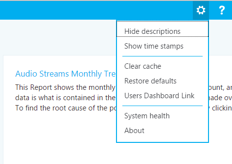

# Usar el panel de calidad de llamada de Skype para Business Server
 
**Resumen:** Obtenga información acerca de cómo usar el panel de calidad de llamadas. Panel de calidad de llamada es una herramienta de Skype para Business Server.
  
El panel de calidad de llamadas permite a los profesionales de TI usar datos de agregados para identificar áreas en su entorno que estén experimentando problemas en la calidad de los medios. También les permite comparar estadísticas de diferentes grupos de usuarios, e identificar tendencias y patrones. No se centra en la solución de problemas con llamadas individuales, sino en la identificación de problemas y soluciones aplicables a muchos usuarios dentro de un entorno.
  
## Manual de usuario del panel de calidad de llamadas

El panel de calidad de llamadas (CQD) es un portal web para crear y organizar rápidamente informes en función de los datos de la calidad de la experiencia (QoE). El CQD implementa un cubo SSAS para agregar los datos a la base de datos de métricas de la QoE, de manera que los usuarios puedan crear y modificar los informes, y llevar a cabo investigaciones en tiempo real. Además de poder usar Excel para conectarse directamente con el cubo, el portal está optimizado para varios flujos de trabajo relacionados con los datos de la QoE. Dichos datos incluyen el almacenamiento en caché de datos de informes para conseguir un acceso rápido, vínculos profundos a páginas de informes para compartir y publicar información, edición y creación mejoradas de informes, y metadatos editables para descripciones de informes. Además, el CQD expone API web que ofrecen a los usuarios un acceso por medio de la programación a los datos del cubo para usarlos en paneles personalizados.  
  
### Información general sobre las características

Cuando un usuario visita el panel de calidad de llamadas verá lo siguiente:
  

  
1. El panel de resumen de"" es donde se puede encontrar el contexto de la "informe Set" (a la derecha). 
    
2. Informe de propiedades de nivel de conjunto (incluido el alto del eje y) se pueden establecer haciendo clic en "Editar" en el panel Resumen.
    
3. La barra de ruta de navegación ayuda a los usuarios a identificar su ubicación actual dentro de la jerarquía del conjunto de informes.  
    
4. Los informes que contienen subinformes se muestran con un vínculo azul. Al hacer clic en él se verán los detalles de los informes secundarios.  
    
Al pasar el mouse sobre los gráficos de barras y las líneas de tendencia se mostrarán los valores detallados. El informe que tiene el foco mostrará el menú Acción: "Editar", "Clonar", "Eliminar" y "Descargar". 
  
### Informes predeterminados

La primera vez que un usuario obtiene acceso al portal del panel de calidad de llamadas, se crea de forma automática un conjunto predeterminado de informes (que a veces reciben la denominación de "informes del sistema"). Los usuarios pueden modificar o eliminar libremente estos informes y normalmente los amplían creando nuevos informes del mismo nivel o informes secundarios.  
  
En el nivel superior, el informe de "Audio secuencias mensual tendencias" muestra la tendencia mensual para todas las secuencias de audioconferencias. Mover el mouse sobre las barras en un gráfico de barras, se mostrará una vista más detallada de los datos representados por el gráfico de barras. Al hacer clic en el título del informe de tendencias mensual de secuencias de Audio navegará al informe "Administrado frente a secuencias de Audio no administrado", donde los informes se dividen entre administrado y no administradas llamadas. Las llamadas administradas son las llamadas realizadas desde dentro del firewall corporativo a través de conexiones por cable. Las llamadas no administradas incluyen las llamadas realizadas desde fuera del firewall corporativo, así como todas las llamadas realizadas a través de Wi-Fi.
  
El otro informe de nivel superior se denomina "Indicado por el usuario llamada calidad clasificación histograma." Las valoraciones de la calidad de las llamadas son los números que proporcionan los usuarios de Skype Empresarial al final de una llamada para indicar su calidad. Los números van del 1 al 5, siendo 1 la peor valoración y 5 la mejor. El histograma muestra la cantidad de llamadas de audio que tuvieron la valoración indicada en el plazo de un mes. 
  
Por lo general, al hacer clic en el título de cualquiera de los informes se le redirigirá a los informes con filtros adicionales en los datos. En los informes del sistema, cada informe secundario muestra un subconjunto de los datos disponibles en su informe primario. De esta forma se proporciona un modelo conceptualmente sencillo para solucionar problemas, pues puede acotar el ámbito del problema investigando a qué subinforme están limitados los datos o la tendencia problemáticos. La capacidad de crear subinformes nuevos permite que los usuarios puedan investigar sus propias hipótesis sobre el origen de tendencias de datos específicas.
  
### Crear y editar informes

Al hacer clic en "Editar" en el menú Acción de un informe, los usuarios verán el Editor de informes. Cada informe está respaldado por una consulta dentro del cubo. Un informe es una visualización de los datos devueltos por su consulta. El editor de informes es una interfaz de usuario para editar dichas consultas, así como las opciones de visualización del informe. Cuando un usuario abre el editor de consultas ve lo siguiente:
  

  
1. Las dimensiones, las medidas y los filtros se eligen en el panel de la izquierda. Colocar el puntero sobre uno de los valores existentes, se mostrará un botón "x" que permite que el valor que se va a quitar. Al hacer clic en el botón "más" junto al encabezado se abrirá el cuadro de diálogo para agregar una nueva dimensión, medida o un filtro. 
    
2. Las opciones para personalizar los gráficos se visualizan en la parte superior.
    
3. En el editor de informes hay una vista previa del informe.  
    
4. Se puede utilizar el cuadro de edición de la parte inferior para crear una descripción detallada de un informe.  
    
### Minigráficos en las tablas

Si se agrega el mes de inicio como dimensión y los datos se representan como tendencia en formato de tabla, se pueden mostrar los gráficos de barras y los minigráficos dentro de las celdas de la tabla. Al pasar el puntero del mouse por encima del gráfico de barras y los minigráficos, se mostrarán los valores de los diferentes meses.  
  

  
En el orden de los gráficos de barras y los minigráficos que aparezca, la casilla de verificación "Mostrar minigráficos" en la parte superior del Editor de informe debe estar protegido. Esto se seleccione la opción de tendencias y Bajar mes a ser la última dimensión, que también se puede hacer haciendo clic en el mes y utilizando la arriba y abajo para desplazar StartDate.Month hacia arriba o hacia abajo. 
  
### Configuración

En la esquina superior derecha del panel se encuentra el menú de configuración, que contiene vínculos a páginas útiles como Mantenimiento del sistema y las páginas Acerca de.
  

  
Si o no mostrar descripciones y marcas de tiempo depende de los usuarios individuales, y estas opciones sólo afectan a versión del individuo del panel, no modifique el informe de establece o vean ¿qué otros usuarios. Borrar la memoria caché hace que todas las consultas volver a cargar los datos del cubo, mientras que restaurar los valores predeterminados elimina todos los informes creados por el usuario o modificados y vuelve a crear el conjunto de informes del sistema, lo que se ve un usuario cuando inicien la sesión por primera vez.
  
El Vínculo del panel de usuarios muestra una página en la que los usuarios pueden ver otros usuarios del CQD y examinar sus informes. Si desea compartir un conjunto de informes, copie el vínculo en la barra de direcciones URL y compártalo con otro usuario del CQD. Este vínculo será el mismo uno otros usuarios pueden ver en la página de vínculo de escritorio de los usuarios en el nombre del usuario.
  
### Suministrar información de subred

Se pueden mostrar más detalles si se indica información específica del sitio en la base de datos de archivo para proporcionar información sobre la asignación de subredes y edificios (por ejemplo, calidad de las llamadas por cable/inalámbricas por edificio).  
  
Se deben rellenar al menos las siguientes tablas para crear estos informes:
  
- CqdBuilding
    
- CqdNetwork
    
En las tablas CqdBuildingType y CqdBuildingOwnershipType se puede proporcionar información adicional para permitir más opciones de filtro y exploración.  
  
El esquema para dichas tablas se define del siguiente modo:
  
**CqdBuilding**

|**Columna**|**Tipo de datos**|**¿Permite valores nulos?**|**Detalles**|
|:-----|:-----|:-----|:-----|
|BuildingKey    |int    |No    |Clave principal para la tabla CqdBuilding.    |
|BuildingName    |varchar(80)    |No    |Nombre del edificio.    |
|BuildingShortName    |varchar(10)    |No    |Versión abreviada del nombre del edificio.    |
|OwnershipTypeId    |int    |No    |Clave externa; necesita coincidir con una de las entradas de la tabla CqdBuildingOwners.    |
|BuildingTypeId    |int    |No    |Clave externa; necesita coincidir con una de las entradas de la tabla CqdBuildingType.    |
|Latitutde    |float    |Sí    |Latitud del edificio.    |
|Longitude    |float    |Sí    |Longitud del edificio.    |
|CityName    |varchar(30)    |Sí    |Nombre de la ciudad en la que se encuentra el edificio.    |
|ZipCode    |varchar(25)    |Sí    |Código postal en el que se encuentra el edificio.    |
|CountryShortCode    |varchar(2)    |Sí    |Códigos ISO 3166-1 alfa-2 para el país en el que se encuentra el edificio.    |
|StateProvinceCode    |varchar(3)    |Sí    |Abreviación de 3 letras del estado o provincia del edificio.    |
|InsideCorp    |bit    |Sí    |Bit que indica si el edificio forma parte de la red corporativa.    |
|BuildingOfficeType    |nvarchar(150)    |Sí    |Descripción del tipo de oficina del edificio.    |
|Region    |varchar(25)    |Sí    |Región en la que se encuentra el edificio.    |
   
**CqdNetwork**

|**Columna**|**Tipo de datos**|**¿Permite valores nulos?**|**Detalles**|
|:-----|:-----|:-----|:-----|
|Network    |varchar(25)    |No    |Dirección de subred.    |
|NetworkRange    |tinyint    |Sí    |Máscara de la subred.    |
|NetworkNameID    |int    |Sí    |Se asigna de forma opcional a una fila de la tabla CqdNetworkName.    |
|BuildingKey    |int    |Sí    |Clave externa; necesita coincidir con una de las entradas de la tabla CqdBuilding.    |
|UpdatedDate    |datetime    |No    |Fecha y hora de la última actualización de la entrada.    |
   
De manera predeterminada en esta tabla siguiente tiene una entrada (0, 'Desconocido').
  
**CqdBuildingType**

|**Columna**|**Tipo de datos**|**¿Permite valores nulos?**|**Detalles**|
|:-----|:-----|:-----|:-----|
|BuildingTypeId    |int    |No    |Clave principal para la tabla CqdBuildingType.    |
|BuildingTypeDesc    |char(18)    |No    |Descripción del tipo de edificio.    |
   
De manera predeterminada, esta tabla siguiente tiene una entrada (0, 'desconocido', 0, null).
  
**CqdBuildingOwnershipType**

|**Columna**|**Tipo de datos**|**¿Permite valores nulos?**|**Detalles**|
|:-----|:-----|:-----|:-----|
|OwnershipTypeId    |int    |No    |Clave principal para la tabla CqdBuildingOwnershipType.    |
|OwnershipTypeDesc    |varchar(25)    |No    |Descripción del tipo de propiedad.    |
|LeaseInd    |tinyint    |Sí    |Índice que hace referencia a otra fila de la tabla CqdBuildingOwnershipType, que se usa para identificar edificios alquilados.    |
|Owner    |varchar(50)    |Sí    |Propietario del edificio.    |
   
De manera predeterminada, esta tabla siguiente tiene una entrada (0, 'desconocido', 0, null).
  
**CqdBssid**

|**Columna**|**Tipo de datos**|**¿Permite valores nulos?**|**Detalles**|
|:-----|:-----|:-----|:-----|
|bss    |nvarchar(50)    |No    |Clave principal para la tabla CqdBssid. Es el BSSID del punto de acceso Wi-Fi.    |
|ess    |nvarchar(50)    |Sí    |Información del controlador del punto de acceso Wi-Fi.    |
|phy    |nvarchar(50)    |Sí    |Información de phy.    |
|ap    |nvarchar(50)    |Sí    |Nombre del punto de acceso Wi-Fi.    |
|Building    |nvarchar(500)    |Sí    |El nombre del edificio en el que se encuentra el punto de acceso Wi-Fi.    |
   
## Secuencias del CQD

Las secuencias del CQD se identifican como buenas, deficientes o sin clasificar. CQM 1.5 ahora usa la siguiente definición de CQD:  
  
- Una secuencia de deficiente es cualquier combinación de métricas de llamada deficientes que superan el umbral.
    
- Cuando una secuencia en una llamada es deficiente, ambas secuencias de la llamada están marcados deficientes. En las conferencias, cada participante se cuenta como una única llamada y se notifica de manera independiente de todos los demás.
    
- Las secuencias sin clasificar son aquellas que no tienen métricas de calidad (como las transacciones sintéticas o las llamadas de corta duración).
    
- Secuencias válidas = clientes no móviles
    
- No se puede modificar el clasificador
    
**Definición de llamada deficiente/clasificador**

|**Métrica**|**Umbral**|
|:-----|:-----|
|DDegradationAvg    |Mayor que 1,0 (-1 red MOS)    |
|RoundTrip    |Mayor que 500     |
|PacketLossRate    |Mayor que 0,1 (10%)     |
|JitterInterArrival    |Mayor que 30     |
|RRatioConcealedSamplesAvg    |Mayor que 0,07     |
   
Definición de JPDR = definición de llamada deficiente menos RatioConcealedSamplesAvg  
  
## ¿Dónde está el autor/destinatario de la llamada?

CQD no utilice los campos de autor de la llamada y el destinatario. Estos han sido cambió de nombre "First" y "Segundo" porque hay pasos intermedios entre el autor de la llamada y el destinatario de la llamada.
  
 **Primero**: siempre será el extremo del servidor (p. ej., AV MCU; servidor de mediación) si hay un servidor implicado en la secuencia.
  
 **Segundo**: siempre será el extremo del cliente, a no ser que se trate de una secuencia servidor-servidor. 
  
**Ejemplo de clasificación de Primero y Segundo**

|**Extremo 1 UAType **|**Extremo 2 UUAType **|**Primero**: siempre será el extremo del servidor (p.|**Segundo**|
|:-----|:-----|:-----|:-----|
|2 (AVMCU)     |4 (Skype Empresarial)     |Extremo 1    |Extremo 2    |
|2 (AVMCU)     |1 (mMediationServer)     |Extremo 2    |Extremo 1    |
|4 (Skype Empresarial)    |4 (Skype Empresarial)     |El autor de la llamada en MediaLine     |El destinatario de la llamada en MMediaLine    |
   
Si los dos extremos son del mismo tipo, el CQD registrará la entrada del autor de la llamada como Primero y el destinatario como Segundo. Consulte [este blog](https://blogs.technet.com/b/jenstr/archive/2015/05/22/call-quality-dashboard-tips-and-tricks.aspx) para obtener más información.
  
## Preparación para VPN

Si se conoce la solución VPN para establecer con precisión la marca VPN, está todos los conjunto. De lo contrario, utilice uno de los métodos siguientes:
  
- Cree un tipo de red llamado VPN (recomendado) y asocie las subredes VPN con el nuevo tipo de red "VPN".
    
- Cree un edificio llamado VPN y asocie las subredes VPN con este edificio.  
    
## Aspectos básicos de las consultas

Una consulta con el formato correcto contiene estos tres parámetros:  
  
- Medida
    
- Dimensión
    
- Filtro
    
Un ejemplo de una consulta con el formato correcto sería "Mostrarme secuencias deficientes [Medida] por subred [dimensión] para el edificio 6 [filtro]."
  
## ¿Qué hace UNION?

Union le permite filtrar condiciones usando el operador AND. Hay situaciones en las que necesita combinar varias condiciones de filtro para lograr un resultado similar a OR.
  
Ejemplo: si necesita obtener todas las secuencias de un edificio, UNION le proporciona una vista específica del conjunto de datos combinado. Para usar UNION, inserte texto común en el campo UNION en las dos condiciones de filtro que quiera unir.  
  
## Desglose de informe predeterminado

Si la red inalámbrica se administra internamente, puede volver a crear los informes de red inalámbrica en el cubo Administradas.  
  

  
## Procesos operativos

Para comenzar, revise y solucione las secuencias administradas. La calidad en esta sección debe estar totalmente bajo su control, por lo que es más sencillo solucionar problemas en este punto.  
  
### Secuencias administradas 

Revise y solucione las secuencias administradas en el siguiente orden:  
  
1. Servidor-servidor  
    
2.   Servidor-cable-interior
    
3. Cable-cable-interior  
    
### Secuencias no administradas

Revise y solucione las secuencias no administradas en el siguiente orden:  
  
1. Servidor-Wi-Fi-interior
    
2. Servidor-cable-exterior
    
3. Servidor-Wi-Fi-exterior
    
4. Cable-externa-directa
    
5. Cable-externa-relé
    
6. Otras no gestionadas
    

