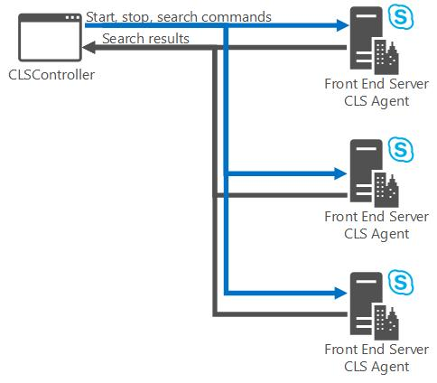

# <a name="centralized-logging-service-in-skype-for-business-2015"></a><span data-ttu-id="4da7d-103">Servicio de registro centralizado en Skype Empresarial 2015</span><span class="sxs-lookup"><span data-stu-id="4da7d-103">Centralized Logging Service in Skype for Business 2015</span></span>
 
<span data-ttu-id="4da7d-104">**Resumen:** Obtenga información sobre los componentes de servicio y las opciones de configuración del servicio de registro centralizado en Skype Empresarial Server 2015.</span><span class="sxs-lookup"><span data-stu-id="4da7d-104">**Summary:** Learn about the service components and configuration settings for the Centralized Logging Service in Skype for Business Server 2015.</span></span>
  
<span data-ttu-id="4da7d-105">El servicio de registro centralizado puede:</span><span class="sxs-lookup"><span data-stu-id="4da7d-105">The Centralized Logging Service can:</span></span> 
  
- <span data-ttu-id="4da7d-106">Inicie o detenga el registro en uno o varios equipos y grupos de servidores con un único comando desde una ubicación central.</span><span class="sxs-lookup"><span data-stu-id="4da7d-106">Start or stop logging on one or more computers and pools with a single command from a central location.</span></span>
    
- <span data-ttu-id="4da7d-107">Registros de búsqueda en uno o más equipos y grupos de servidores.</span><span class="sxs-lookup"><span data-stu-id="4da7d-107">Search logs on one or more computers and pools.</span></span> <span data-ttu-id="4da7d-108">Puedes personalizar la búsqueda para devolver todos los registros de todas las máquinas o devolver resultados más concisos.</span><span class="sxs-lookup"><span data-stu-id="4da7d-108">You can tailor the search to return all logs on all machines, or return more concise results.</span></span>
    
- <span data-ttu-id="4da7d-109">Configurar las sesiones de registro de la siguiente manera:</span><span class="sxs-lookup"><span data-stu-id="4da7d-109">Configure logging sessions as follows:</span></span>
    
  - <span data-ttu-id="4da7d-110">Defina un **Escenario** o use un escenario predeterminado.</span><span class="sxs-lookup"><span data-stu-id="4da7d-110">Define a **Scenario**, or use a default scenario.</span></span> <span data-ttu-id="4da7d-111">Un escenario del servicio de registro centralizado se conste de ámbito (global o de sitio), un nombre de escenario para identificar el propósito del escenario y uno o más proveedores.</span><span class="sxs-lookup"><span data-stu-id="4da7d-111">A scenario in Centralized Logging Service is made up of scope (global or site), a scenario name to identify the purpose of the scenario, and one or more providers.</span></span> <span data-ttu-id="4da7d-112">Puede ejecutar el escenario predeterminado y uno definido en cualquier momento en un equipo.</span><span class="sxs-lookup"><span data-stu-id="4da7d-112">You can run the default scenario and one defined scenario at any given time on a computer.</span></span>
    
  - <span data-ttu-id="4da7d-113">Use un proveedor existente o cree un nuevo proveedor.</span><span class="sxs-lookup"><span data-stu-id="4da7d-113">Use an existing provider or create a new provider.</span></span> <span data-ttu-id="4da7d-114">Aprovider define lo que recopila la sesión de registro, qué nivel de detalle, qué componentes se deben seguir y qué marcas se aplican.</span><span class="sxs-lookup"><span data-stu-id="4da7d-114">Aprovider defines what the logging session collects, what level of detail, what components to trace, and what flags are applied.</span></span>
    
    > [!TIP]
    >  <span data-ttu-id="4da7d-115">Si está familiarizado con OCSLogger, los termproviders se **refieren** **a** la colección de componentes **(por** ejemplo, S4, SIPStack), un tipo de registro (por ejemplo, WPP, EventLog o archivo de registro de IIS), un nivel de seguimiento (por ejemplo, All, verbose, debug) y marcas **(por** ejemplo, TF_COMPONENT, TF_DIAG).</span><span class="sxs-lookup"><span data-stu-id="4da7d-115">If you are familiar with OCSLogger, the termproviders refers to the collection of **components** (for example, S4, SIPStack), a **logging type** (for example, WPP, EventLog, or IIS logfile), a **tracing level** (for example, All, verbose, debug), and **flags** (for example, TF_COMPONENT, TF_DIAG).</span></span> <span data-ttu-id="4da7d-116">Estos elementos se definen en el proveedor (una variable Windows PowerShell) y se pasan al comando Servicio de registro centralizado.</span><span class="sxs-lookup"><span data-stu-id="4da7d-116">These items are defined in the provider (a Windows PowerShell variable) and passed into the Centralized Logging Service command.</span></span>
  
  - <span data-ttu-id="4da7d-117">Configurar registros para equipos y grupos específicos.</span><span class="sxs-lookup"><span data-stu-id="4da7d-117">Configure logs for specific computers and pools.</span></span>
    
  - <span data-ttu-id="4da7d-118">Defina el ámbito de la sesión de registro desde las opciones Sitio **(para** ejecutar capturas de registro solo en equipos de ese sitio) o **Global** (para ejecutar capturas de registro en todos los equipos de la implementación).</span><span class="sxs-lookup"><span data-stu-id="4da7d-118">Define the scope for the logging session from the options **Site** (to run logging captures on computers in that site only), or **Global** (to run logging captures on all computers in the deployment).</span></span>
    
<span data-ttu-id="4da7d-119">El servicio de registro centralizado es una herramienta de solución de problemas eficaz para problemas grandes o pequeños, desde el análisis de la causa raíz hasta los problemas de rendimiento.</span><span class="sxs-lookup"><span data-stu-id="4da7d-119">The Centralized Logging Service is a powerful troubleshooting tool for problems large or small, from root cause analysis to performance problems.</span></span> <span data-ttu-id="4da7d-120">Todos los ejemplos se muestran con el Shell de administración de Skype Empresarial Server.</span><span class="sxs-lookup"><span data-stu-id="4da7d-120">All examples are shown using the Skype for Business Server Management Shell.</span></span> <span data-ttu-id="4da7d-121">Se proporciona ayuda para la herramienta de línea de comandos a través de la propia herramienta, pero hay un conjunto limitado de funciones que se pueden ejecutar desde la línea de comandos.</span><span class="sxs-lookup"><span data-stu-id="4da7d-121">Help is provided for the command-line tool through the tool itself, but there is a limited set of functions that you can execute from the command line.</span></span> <span data-ttu-id="4da7d-122">Al usar el Shell de administración de Skype Empresarial Server, tiene acceso a un conjunto de características mucho más grande y mucho más configurable, por lo que siempre debe ser su primera opción.</span><span class="sxs-lookup"><span data-stu-id="4da7d-122">By using Skype for Business Server Management Shell, you have access to a much larger and much more configurable set of features, so that should always be your first choice.</span></span> 
  
## <a name="logging-service-components"></a><span data-ttu-id="4da7d-123">Componentes del servicio de registro</span><span class="sxs-lookup"><span data-stu-id="4da7d-123">Logging service components</span></span>

 <span data-ttu-id="4da7d-124">El servicio de registro centralizado se ejecuta en todos los servidores de la implementación y está configurado por los siguientes agentes y servicios:</span><span class="sxs-lookup"><span data-stu-id="4da7d-124">The Centralized Logging Service runs on all servers in your deployment, and is made up of the following agents and services:</span></span>
  
- <span data-ttu-id="4da7d-125">El agente clsAgent del servicio de registro centralizado se ejecuta en todos los equipos con Skype Empresarial Server implementado.</span><span class="sxs-lookup"><span data-stu-id="4da7d-125">Centralized Logging Service Agent ClsAgent runs on every machine with Skype for Business Server deployed.</span></span> <span data-ttu-id="4da7d-126">Escucha ( en los puertos **TCP 50001-50003**) los comandos de ClsController a través de WCF y envía respuestas de vuelta al controlador.</span><span class="sxs-lookup"><span data-stu-id="4da7d-126">It listens ( on ports **TCP 50001-50003**) for commands from ClsController over WCF and sends responses back to the controller.</span></span> <span data-ttu-id="4da7d-127">Administra las sesiones de registro (inicio,detén/actualización) y busca registros.</span><span class="sxs-lookup"><span data-stu-id="4da7d-127">It manages log sessions (start/stop/update), and searches logs.</span></span> <span data-ttu-id="4da7d-128">También realiza operaciones de mantenimiento, como el archivado de registros y las purgas.</span><span class="sxs-lookup"><span data-stu-id="4da7d-128">It also performs housekeeping operations like log archiving and purges.</span></span> 
    
- <span data-ttu-id="4da7d-129">Cmdlets del controlador de servicio de registro centralizado El Shell de administración de Skype Empresarial Server envía comandos Start, Stop, Flush y Search a ClsAgent.</span><span class="sxs-lookup"><span data-stu-id="4da7d-129">Centralized Logging Service Controller Cmdlets The Skype for Business Server Management Shell sends Start, Stop, Flush, and Search commands to the ClsAgent.</span></span> <span data-ttu-id="4da7d-130">Cuando se envían comandos de búsqueda, los registros resultantes se devuelven al ClsControllerLib.dll y se agregan.</span><span class="sxs-lookup"><span data-stu-id="4da7d-130">When search commands are sent, the resulting logs are returned to the ClsControllerLib.dll and aggregated.</span></span> <span data-ttu-id="4da7d-131">El controlador envía comandos al agente, recibe el estado de esos comandos y administra los datos del archivo de registro de búsqueda a medida que se devuelven de todos los agentes en cualquier equipo del ámbito de búsqueda y agrega los datos de registro en un conjunto de resultados significativo y ordenado.</span><span class="sxs-lookup"><span data-stu-id="4da7d-131">The controller sends commands to the agent, receives the status of those commands and manages the search log file data as it is returned from all agents on any computer in the search scope, and aggregates the log data into a meaningful and ordered output set.</span></span> <span data-ttu-id="4da7d-132">La información de los siguientes temas se centra en el uso del Shell de administración de Skype Empresarial Server.</span><span class="sxs-lookup"><span data-stu-id="4da7d-132">The information in the following topics is focused on using the Skype for Business Server Management Shell.</span></span>
    
<span data-ttu-id="4da7d-133">**Comunicaciones clsController con ClsAgent**</span><span class="sxs-lookup"><span data-stu-id="4da7d-133">**ClsController communications to ClsAgent**</span></span>


  
<span data-ttu-id="4da7d-135">Los comandos se emiten mediante la interfaz de línea de comandos de Windows Server o mediante el Shell de administración de Skype Empresarial Server.</span><span class="sxs-lookup"><span data-stu-id="4da7d-135">You issue commands using the Windows Server command-line interface or using the Skype for Business Server Management Shell.</span></span> <span data-ttu-id="4da7d-136">Los comandos se ejecutan en el equipo en el que ha iniciado sesión y se envían al ClsAgent localmente o a los demás equipos y grupos de servidores de la implementación.</span><span class="sxs-lookup"><span data-stu-id="4da7d-136">The commands are executed on the computer you are logged in to and sent to the ClsAgent locally or to the other computers and pools in your deployment.</span></span>
  
<span data-ttu-id="4da7d-137">ClsAgent mantiene un archivo de índice de todos los archivos . Archivos CACHÉ que tiene en el equipo local.</span><span class="sxs-lookup"><span data-stu-id="4da7d-137">ClsAgent maintains an index file of all .CACHE files that it has on the local machine.</span></span> <span data-ttu-id="4da7d-138">ClsAgent los asigna para que se distribuyen uniformemente entre los volúmenes definidos por la opción CacheFileLocalFolders, sin consumir nunca más del 80 % de cada volumen (es decir, la ubicación de caché local y el porcentaje se pueden configurar mediante el cmdlet **Set-CsClsConfiguration).**</span><span class="sxs-lookup"><span data-stu-id="4da7d-138">ClsAgent allocates them so that they are evenly distributed across volumes defined by the option CacheFileLocalFolders, never consuming more than 80% of each volume (that is, the local cache location and the percentage is configurable using the **Set-CsClsConfiguration** cmdlet).</span></span> <span data-ttu-id="4da7d-139">ClsAgent también es responsable de la aging de archivos antiguos de registro de seguimiento de eventos en caché (.etl) fuera del equipo local.</span><span class="sxs-lookup"><span data-stu-id="4da7d-139">ClsAgent is also responsible for aging old cached event trace log (.etl) files off the local machine.</span></span> <span data-ttu-id="4da7d-140">Después de dos semanas (es decir, el período de tiempo se puede configurar con el cmdlet **Set-CsClsConfiguration),** estos archivos se copian en un recurso compartido de archivos y se eliminan del equipo local.</span><span class="sxs-lookup"><span data-stu-id="4da7d-140">After two weeks (that is, the timeframe is configurable using the **Set-CsClsConfiguration** cmdlet) these files are copied to a file share and deleted from the local computer.</span></span> <span data-ttu-id="4da7d-141">Para obtener más información, [consulte Set-CsClsConfiguration](https://docs.microsoft.com/powershell/module/skype/set-csclsconfiguration?view=skype-ps).</span><span class="sxs-lookup"><span data-stu-id="4da7d-141">For details, see [Set-CsClsConfiguration](https://docs.microsoft.com/powershell/module/skype/set-csclsconfiguration?view=skype-ps).</span></span> <span data-ttu-id="4da7d-142">Cuando se recibe una solicitud de búsqueda, los criterios de búsqueda se usan para seleccionar el conjunto de archivos .etl almacenados en caché para realizar la búsqueda en función de los valores del índice mantenido por el agente.</span><span class="sxs-lookup"><span data-stu-id="4da7d-142">When a search request is received, the search criteria is used to select the set of cached .etl files to perform the search based on the values in the index maintained by the agent.</span></span>
  
> [!NOTE]
> <span data-ttu-id="4da7d-143">ClsAgent puede buscar los archivos que se mueven al recurso compartido de archivos desde el equipo local.</span><span class="sxs-lookup"><span data-stu-id="4da7d-143">Files that are moved to the file share from the local computer can be searched by ClsAgent.</span></span> <span data-ttu-id="4da7d-144">Una vez que ClsAgent mueve los archivos al recurso compartido de archivos, ClsAgent no mantiene la eliminación y la eliminación de archivos.</span><span class="sxs-lookup"><span data-stu-id="4da7d-144">Once ClsAgent moves the files to the file share, the aging and removal of files is not maintained by ClsAgent.</span></span> <span data-ttu-id="4da7d-145">Debe definir una tarea administrativa para supervisar el tamaño de los archivos del recurso compartido de archivos y eliminarlos o archivarlos.</span><span class="sxs-lookup"><span data-stu-id="4da7d-145">You should define an administrative task to monitor the size of the files in the file share and delete them or archive them.</span></span> 
  
<span data-ttu-id="4da7d-146">Los archivos de registro resultantes se pueden leer y analizar con una variedad de herramientas, como **Snooper.exe** y cualquier herramienta que pueda leer un archivo de texto, como **Notepad.exe**.</span><span class="sxs-lookup"><span data-stu-id="4da7d-146">The resulting log files can be read and analyzed using a variety of tools, including **Snooper.exe** and any tool that can read a text file, such as **Notepad.exe**.</span></span> <span data-ttu-id="4da7d-147">Snooper.exe forma parte de las herramientas de depuración de Skype Empresarial Server 2015 y está disponible como [descarga web.](https://go.microsoft.com/fwlink/p/?LinkId=285257)</span><span class="sxs-lookup"><span data-stu-id="4da7d-147">Snooper.exe is part of the Skype for Business Server 2015 Debug Tools and is available as a [Web download](https://go.microsoft.com/fwlink/p/?LinkId=285257).</span></span>
  
<span data-ttu-id="4da7d-148">Al igual que OCSLogger, el servicio de registro centralizado tiene varios componentes con los que hacer un seguimiento y proporciona opciones para seleccionar marcas, como TF_COMPONENT y TF_DIAG.</span><span class="sxs-lookup"><span data-stu-id="4da7d-148">Like OCSLogger, the Centralized Logging Service has several components to trace against, and provides options to select flags, such as TF_COMPONENT and TF_DIAG.</span></span> <span data-ttu-id="4da7d-149">El servicio de registro centralizado también conserva las opciones de nivel de registro de OCSLogger.</span><span class="sxs-lookup"><span data-stu-id="4da7d-149">Centralized Logging Service also retains the logging level options of OCSLogger.</span></span>
  
<span data-ttu-id="4da7d-150">La ventaja más importante de usar el Shell de administración de Skype Empresarial Server en la línea de comandos ClsController es que puede configurar y definir nuevos escenarios con proveedores seleccionados destinados al espacio del problema, las marcas personalizadas y los niveles de registro.</span><span class="sxs-lookup"><span data-stu-id="4da7d-150">The most important advantage to using the Skype for Business Server Management Shell over the command-line ClsController is that you can configure and define new scenarios using selected providers that target the problem space, custom flags, and logging levels.</span></span> <span data-ttu-id="4da7d-151">Los escenarios disponibles para ClsController se limitan a los que se definen para el archivo ejecutable.</span><span class="sxs-lookup"><span data-stu-id="4da7d-151">The scenarios available to ClsController are limited to those that are defined for the executable.</span></span>
  
<span data-ttu-id="4da7d-152">En versiones anteriores, se OCSLogger.exe para permitir a los administradores y al personal de soporte técnico recopilar archivos de seguimiento de los equipos de la implementación.</span><span class="sxs-lookup"><span data-stu-id="4da7d-152">In previous versions, OCSLogger.exe was provided to enable administrators and support personnel to collect trace files from computers in the deployment.</span></span> <span data-ttu-id="4da7d-153">OCSLogger, para todos sus puntos fuertes, tenía una desventaja.</span><span class="sxs-lookup"><span data-stu-id="4da7d-153">OCSLogger, for all of its strengths, had a shortcoming.</span></span> <span data-ttu-id="4da7d-154">Solo se podían recopilar registros en un equipo a la vez.</span><span class="sxs-lookup"><span data-stu-id="4da7d-154">You could only collect logs on one computer at a given time.</span></span> <span data-ttu-id="4da7d-155">Puede iniciar sesión en varios equipos mediante copias independientes de OCSLogger, pero terminó con varios registros y sin una forma sencilla de agregar los resultados.</span><span class="sxs-lookup"><span data-stu-id="4da7d-155">You could log on to multiple computers by using separate copies of OCSLogger, but you ended up with multiple logs and no easy way to aggregate the results.</span></span>
  
<span data-ttu-id="4da7d-156">Cuando un usuario solicita una búsqueda de registro, clsController determina a qué equipos enviar la solicitud (es decir, en función de los escenarios seleccionados).</span><span class="sxs-lookup"><span data-stu-id="4da7d-156">When a user requests a log search, the ClsController determines which machines to send the request to (that is, based on the scenarios selected).</span></span> <span data-ttu-id="4da7d-157">También determina si la búsqueda debe enviarse al recurso compartido de archivos donde se encuentran los archivos .etl guardados.</span><span class="sxs-lookup"><span data-stu-id="4da7d-157">It also determines whether the search needs to be sent to the file share where the saved .etl files are located.</span></span> <span data-ttu-id="4da7d-158">Cuando los resultados de la búsqueda se devuelven al ClsController, el controlador combina los resultados en un único conjunto de resultados ordenado por tiempo que se presenta al usuario.</span><span class="sxs-lookup"><span data-stu-id="4da7d-158">When the search results are returned to the ClsController, the controller merges the results into a single time-ordered result set that is presented to the user.</span></span> <span data-ttu-id="4da7d-159">Los usuarios pueden guardar los resultados de la búsqueda en su equipo local para realizar un análisis posterior.</span><span class="sxs-lookup"><span data-stu-id="4da7d-159">Users can save the search results to their local machine for further analysis.</span></span>
  
<span data-ttu-id="4da7d-160">Cuando se inicia una sesión de registro, se especifican escenarios relativos al problema que se intenta resolver.</span><span class="sxs-lookup"><span data-stu-id="4da7d-160">When you start a logging session, you specify scenarios that are relative to the problem that you are trying to resolve.</span></span> <span data-ttu-id="4da7d-161">Puede tener dos escenarios en ejecución en cualquier momento.</span><span class="sxs-lookup"><span data-stu-id="4da7d-161">You can have two scenarios running at any time.</span></span> <span data-ttu-id="4da7d-162">Uno de estos dos escenarios debe ser el escenario AlwaysOn.</span><span class="sxs-lookup"><span data-stu-id="4da7d-162">One of these two scenarios should be the AlwaysOn scenario.</span></span> <span data-ttu-id="4da7d-163">Como su nombre indica, siempre debe estar ejecutándose en la implementación, recopilando información en todos los equipos, grupos y componentes.</span><span class="sxs-lookup"><span data-stu-id="4da7d-163">As the name implies, it should always be running in your deployment, collecting information on all computers, pools, and components.</span></span>
  
> [!IMPORTANT]
> <span data-ttu-id="4da7d-164">De forma predeterminada, el escenario AlwaysOn no se está ejecutando en la implementación.</span><span class="sxs-lookup"><span data-stu-id="4da7d-164">By default, the AlwaysOn scenario is not running in your deployment.</span></span> <span data-ttu-id="4da7d-165">Debe iniciar explícitamente el escenario.</span><span class="sxs-lookup"><span data-stu-id="4da7d-165">You must explicitly start the scenario.</span></span> <span data-ttu-id="4da7d-166">Una vez iniciado, seguirá ejecutándose hasta que se detenga explícitamente y el estado de ejecución persistirá durante los reinicios de los equipos.</span><span class="sxs-lookup"><span data-stu-id="4da7d-166">Once started, it will continue to run until explicitly stopped, and the running state will persist through reboots of the computers.</span></span> <span data-ttu-id="4da7d-167">Para obtener más información sobre los escenarios de inicio y detención, consulte Iniciar o detener la captura de registros de CLS en [Skype Empresarial Server 2015.](start-or-stop-log-capture.md)</span><span class="sxs-lookup"><span data-stu-id="4da7d-167">For details on starting and stopping scenarios, see [Start or stop CLS log capture in Skype for Business Server 2015](start-or-stop-log-capture.md).</span></span> 
  
<span data-ttu-id="4da7d-168">Cuando se produzca un problema, inicie un segundo escenario relacionado con el problema notificado.</span><span class="sxs-lookup"><span data-stu-id="4da7d-168">When a problem occurs, start a second scenario that relates to the problem reported.</span></span> <span data-ttu-id="4da7d-169">Reproduzca el problema y detenga el registro del segundo escenario.</span><span class="sxs-lookup"><span data-stu-id="4da7d-169">Reproduce the problem, and stop the logging for the second scenario.</span></span> <span data-ttu-id="4da7d-170">Inicie las búsquedas de registro relativas al problema notificado.</span><span class="sxs-lookup"><span data-stu-id="4da7d-170">Begin your log searches relative to the problem reported.</span></span> <span data-ttu-id="4da7d-171">La colección agregada de registros genera un archivo de registro que contiene mensajes de seguimiento de todos los equipos del sitio o del ámbito global de la implementación.</span><span class="sxs-lookup"><span data-stu-id="4da7d-171">The aggregated collection of logs produces a log file that contains trace messages from all computers in your site or global scope of your deployment.</span></span> <span data-ttu-id="4da7d-172">Si la búsqueda devuelve más datos de los que puede analizar (normalmente conocido como relación señal-ruido, donde el ruido es demasiado alto), ejecute otra búsqueda con parámetros más estrechos.</span><span class="sxs-lookup"><span data-stu-id="4da7d-172">If the search returns more data than you can feasibly analyze (typically known as a signal-to-noise ratio, where the noise is too high), you run another search with narrower parameters.</span></span> <span data-ttu-id="4da7d-173">En este punto, puede empezar a observar patrones que se muestran y pueden ayudarle a centrarse más claramente en el problema.</span><span class="sxs-lookup"><span data-stu-id="4da7d-173">At this point, you can begin to notice patterns that show up and can help you get a clearer focus on the problem.</span></span> <span data-ttu-id="4da7d-174">En última instancia, después de realizar un par de búsquedas refinadas, puede encontrar datos relevantes para el problema y averiguar la causa raíz.</span><span class="sxs-lookup"><span data-stu-id="4da7d-174">Ultimately, after you perform a couple of refined searches you can find data that is relevant to the problem and figure out the root cause.</span></span>
  
> [!TIP]
> <span data-ttu-id="4da7d-175">Cuando se le presente un escenario de problema en Skype Empresarial Server, empiece por preguntarse "¿Qué sé ya sobre el problema?".</span><span class="sxs-lookup"><span data-stu-id="4da7d-175">When presented with a problem scenario in Skype for Business Server, start by asking yourself "What do I already know about the problem?"</span></span> <span data-ttu-id="4da7d-176">Si cuantifica los límites del problema, puede eliminar una gran parte de las entidades operativas en Skype Empresarial Server.</span><span class="sxs-lookup"><span data-stu-id="4da7d-176">If you quantify the problem boundaries, you can eliminate a large part of the operational entities in Skype for Business Server.</span></span> 
  
<span data-ttu-id="4da7d-177">Considere un escenario de ejemplo en el que sepa que los usuarios no están obteniendo resultados actuales cuando buscan un contacto.</span><span class="sxs-lookup"><span data-stu-id="4da7d-177">Consider an example scenario where you know that users are not getting current results when looking for a contact.</span></span> <span data-ttu-id="4da7d-178">No tiene sentido buscar problemas en los componentes multimedia, Telefonía IP empresarial, conferencias y otros componentes.</span><span class="sxs-lookup"><span data-stu-id="4da7d-178">There is no point in looking for problems in the media components, Enterprise Voice, conferencing, and a number of other components.</span></span> <span data-ttu-id="4da7d-179">Lo que puede que no sepa es dónde está realmente el problema: en el cliente o es un problema del lado servidor?</span><span class="sxs-lookup"><span data-stu-id="4da7d-179">What you may not know is where the problem actually is: on the client, or is this a server-side problem?</span></span> <span data-ttu-id="4da7d-180">El replicador de usuarios recopila los contactos de Active Directory y se entregan al cliente mediante el servidor de libreta de direcciones (ABServer).</span><span class="sxs-lookup"><span data-stu-id="4da7d-180">Contacts are collected from Active Directory by the User Replicator and delivered to the client by way of the Address Book Server (ABServer).</span></span> <span data-ttu-id="4da7d-181">AbServer obtiene sus actualizaciones de la base de datos RTC (donde el replicador de usuarios las escribió) y las recopila en los archivos de la libreta de direcciones de forma predeterminada : 1:30 a.m.</span><span class="sxs-lookup"><span data-stu-id="4da7d-181">The ABServer gets its updates from the RTC database (where User Replicator wrote them) and collects them into address book files, by default - 1:30 AM.</span></span> <span data-ttu-id="4da7d-182">Los clientes de Skype Empresarial Server recuperan la nueva libreta de direcciones según una programación aleatoria.</span><span class="sxs-lookup"><span data-stu-id="4da7d-182">The Skype for Business Server clients retrieve the new address book on a randomized schedule.</span></span> <span data-ttu-id="4da7d-183">Dado que sabe cómo funciona el proceso, puede reducir la búsqueda de la posible causa de un problema relacionado con los datos recopilados de Active Directory por el replicador de usuarios, el ABServer no recupera y crea los archivos de la libreta de direcciones o los clientes no descargan el archivo de la libreta de direcciones.</span><span class="sxs-lookup"><span data-stu-id="4da7d-183">Because you know how the process works, you can reduce your search for the potential cause to an issue related to data being collected from Active Directory by the User Replicator, the ABServer not retrieving and creating the address book files, or the clients not downloading the address book file.</span></span>
  
## <a name="current-configuration"></a><span data-ttu-id="4da7d-184">Configuración actual</span><span class="sxs-lookup"><span data-stu-id="4da7d-184">Current configuration</span></span>

<span data-ttu-id="4da7d-185">El servicio de registro centralizado está configurado para definir lo que el servicio de registro pretende recopilar, cómo se recopila, de dónde se recopilará y cuál es la configuración de registro.</span><span class="sxs-lookup"><span data-stu-id="4da7d-185">The Centralized Logging Service is configured to define what the logging service is intended to collect, how it collects, where it will collect from, and what the log settings are.</span></span> <span data-ttu-id="4da7d-186">Estas configuraciones se definen globalmente (es decir, para toda la implementación) o para un sitio (es decir, un sitio con nombre en la implementación).</span><span class="sxs-lookup"><span data-stu-id="4da7d-186">You define these settings globally (that is, for the entire deployment) or for a site (that is, a named site in your deployment).</span></span> <span data-ttu-id="4da7d-187">Cualquier registro que defina utilizará las configuraciones apropiadas para la identidad que utiliza para iniciar, detener, vaciar y buscar registros.</span><span class="sxs-lookup"><span data-stu-id="4da7d-187">Any logging that you define will use the settings that are appropriate for the identity that you use for commands to start, stop, flush, and search logs.</span></span>
  
### <a name="to-display-the-current-centralized-logging-service-configuration"></a><span data-ttu-id="4da7d-188">Para mostrar la configuración actual del servicio de registro centralizado</span><span class="sxs-lookup"><span data-stu-id="4da7d-188">To display the current Centralized Logging Service configuration</span></span>

1. <span data-ttu-id="4da7d-189">Inicie el Shell de administración de Skype Empresarial Server: Haga clic en **Inicio,** en Todos los **programas,** **en Skype Empresarial 2015** y, a continuación, en Shell de administración de Skype Empresarial **Server.**</span><span class="sxs-lookup"><span data-stu-id="4da7d-189">Start the Skype for Business Server Management Shell: Click **Start**, click **All Programs**, click **Skype for Business 2015**, and then click **Skype for Business Server Management Shell**.</span></span>
    
2. <span data-ttu-id="4da7d-190">Escriba lo siguiente en un símbolo del sistema:</span><span class="sxs-lookup"><span data-stu-id="4da7d-190">Type the following at a command-line prompt:</span></span>
    
   ```PowerShell
   Get-CsClsConfiguration
   ```

    > [!TIP]
    > <span data-ttu-id="4da7d-191">Puede restringir o expandir el ámbito de las opciones de configuración que se devuelven mediante la definición y un ámbito, como "Site:Redmond" para devolver sólo CsClsConfiguration para el sitio  `-Identity` Redmond.</span><span class="sxs-lookup"><span data-stu-id="4da7d-191">You can narrow or expand the scope of the configuration settings that are returned by defining  `-Identity` and a scope, such as "Site:Redmond" to return only the CsClsConfiguration for the site Redmond.</span></span> <span data-ttu-id="4da7d-192">Si desea obtener información detallada sobre una parte determinada de la configuración, puede canalizar el resultado a otro cmdlet Windows PowerShell configuración.</span><span class="sxs-lookup"><span data-stu-id="4da7d-192">If you want details about a given portion of the configuration, you can pipe the output into another Windows PowerShell cmdlet.</span></span> <span data-ttu-id="4da7d-193">Por ejemplo, para obtener detalles sobre los escenarios definidos en la configuración del sitio "Redmond", escriba: `Get-CsClsConfiguration -Identity "site:Redmond" | Select-Object -ExpandProperty Scenarios`</span><span class="sxs-lookup"><span data-stu-id="4da7d-193">For example, to get details about the scenarios defined in the configuration for site "Redmond", type: `Get-CsClsConfiguration -Identity "site:Redmond" | Select-Object -ExpandProperty Scenarios`</span></span>
  
     
  
    <span data-ttu-id="4da7d-195">El resultado del cmdlet muestra la configuración actual del servicio de registro centralizado.</span><span class="sxs-lookup"><span data-stu-id="4da7d-195">The result from the cmdlet displays the current configuration of the Centralized Logging Service.</span></span>
    
|<span data-ttu-id="4da7d-196">**Configuración**</span><span class="sxs-lookup"><span data-stu-id="4da7d-196">**Configuration Setting**</span></span>|<span data-ttu-id="4da7d-197">**Descripción**</span><span class="sxs-lookup"><span data-stu-id="4da7d-197">**Description**</span></span>|
|:-----|:-----|
|<span data-ttu-id="4da7d-198">**Identidad**</span><span class="sxs-lookup"><span data-stu-id="4da7d-198">**Identity**</span></span> <br/> |<span data-ttu-id="4da7d-p123">Identifica el ámbito y el nombre de esta configuración. Hay solamente una configuración global y una configuración por sitio.</span><span class="sxs-lookup"><span data-stu-id="4da7d-p123">Identifies the scope and name for this configuration. There is only one Global configuration, and one configuration per site.</span></span>  <br/> |
|<span data-ttu-id="4da7d-201">**Scenarios**</span><span class="sxs-lookup"><span data-stu-id="4da7d-201">**Scenarios**</span></span> <br/> |<span data-ttu-id="4da7d-202">Listado de todos los escenarios que se definen para esta configuración.</span><span class="sxs-lookup"><span data-stu-id="4da7d-202">Listing of all scenarios that are defined for this configuration.</span></span>  <br/> |
|<span data-ttu-id="4da7d-203">**SearchTerms**</span><span class="sxs-lookup"><span data-stu-id="4da7d-203">**SearchTerms**</span></span> <br/> |<span data-ttu-id="4da7d-204">Términos de búsqueda definidos para la configuración.</span><span class="sxs-lookup"><span data-stu-id="4da7d-204">Defined search terms for the configuration.</span></span> <span data-ttu-id="4da7d-205">Microsoft 365 u Office 365, no las implementaciones locales.</span><span class="sxs-lookup"><span data-stu-id="4da7d-205">Microsoft 365 or Office 365, not on-premises deployments.</span></span>  <br/> |
|<span data-ttu-id="4da7d-206">**SecurityGroups**</span><span class="sxs-lookup"><span data-stu-id="4da7d-206">**SecurityGroups**</span></span> <br/> |<span data-ttu-id="4da7d-207">Grupos de seguridad definidos que controlan quiénes (es decir, miembros de los grupos de seguridad) pueden ver equipos basados en el sitio en el que se encuentran.</span><span class="sxs-lookup"><span data-stu-id="4da7d-207">Defined security groups that control who (that is, members of the security groups) can see computers based on the site they are located in.</span></span> <span data-ttu-id="4da7d-208">El sitio, en este contexto, es el sitio tal como se define en el Generador de topologías.</span><span class="sxs-lookup"><span data-stu-id="4da7d-208">Site, in this context, is the site as defined in Topology Builder.</span></span>  <br/> |
|<span data-ttu-id="4da7d-209">**Regiones**</span><span class="sxs-lookup"><span data-stu-id="4da7d-209">**Regions**</span></span> <br/> |<span data-ttu-id="4da7d-210">Las regiones definidas se utilizan para reunir SecurityGroups en una región, por ejemplo EMEA.</span><span class="sxs-lookup"><span data-stu-id="4da7d-210">Defined regions are used to collect SecurityGroups into a region, for example EMEA.</span></span>  <br/> |
|<span data-ttu-id="4da7d-211">**EtlFileRolloverSizeMB**</span><span class="sxs-lookup"><span data-stu-id="4da7d-211">**EtlFileRolloverSizeMB**</span></span> <br/> |<span data-ttu-id="4da7d-p126">El parámetro indica el tamaño máximo del archivo de registro antes de que se cree un nuevo archivo de registro de seguimiento de eventos (.etl). Un nuevo archivo de registro se crea cuando se alcanza el tamaño definido incluso si aún no se ha alcanzado el tiempo máximo establecido en EtlFileRolloverMinutes.</span><span class="sxs-lookup"><span data-stu-id="4da7d-p126">The parameter indicates the maximum size of the log file before a new event trace log (.etl) file is created. A new log file is created when the defined size is reached even if the maximum time set in EtlFileRolloverMinutes has not yet been reached.</span></span>  <br/> |
|<span data-ttu-id="4da7d-214">**EtlFileRolloverMinutes**</span><span class="sxs-lookup"><span data-stu-id="4da7d-214">**EtlFileRolloverMinutes**</span></span> <br/> |<span data-ttu-id="4da7d-p127">Cantidad máxima definida de tiempo, en minutos, que puede durar un registro antes de que se cree un nuevo archivo .etl. Un nuevo archivo de registro se crea cuando expira el tiempo definido incluso si aún no se ha alcanzado el tamaño máximo establecido en EtlFileRolloverSizeMB.</span><span class="sxs-lookup"><span data-stu-id="4da7d-p127">Defined maximum amount of time, in minutes, that a log can elapse before a new .etl file is created. A new log file is created when the timer expires even if the maximum size set in EtlFileRolloverSizeMB has not yet been reached.</span></span>  <br/> |
|<span data-ttu-id="4da7d-217">**TmfFileSearchPath**</span><span class="sxs-lookup"><span data-stu-id="4da7d-217">**TmfFileSearchPath**</span></span> <br/> |<span data-ttu-id="4da7d-218">Ubicación en la que se buscará archivos con formato de mensaje de seguimiento.</span><span class="sxs-lookup"><span data-stu-id="4da7d-218">Location to search for the trace message format files.</span></span>  <br/> |
|<span data-ttu-id="4da7d-219">**CacheFileLocalFolders**</span><span class="sxs-lookup"><span data-stu-id="4da7d-219">**CacheFileLocalFolders**</span></span> <br/> |<span data-ttu-id="4da7d-p128">Ruta definida de la ubicación en la que se escriben los archivos de caché en los equipos. CLSAgent escribe los archivos de caché y se ejecuta en el contexto del servicio de red. En este caso, %TEMP% se expande a %WINDIR%\ServiceProfiles\NetworkService\AppData\Local. De manera predeterminada, los archivos de caché y los archivos de registro se escriben en el mismo directorio.</span><span class="sxs-lookup"><span data-stu-id="4da7d-p128">Defined path to the location where cache files are written on computers. CLSAgent writes the cache files and runs under the context of the Network Service. In this case, %TEMP% expands to %WINDIR%\ServiceProfiles\NetworkService\AppData\Local. By default, cache files and log files are written to the same directory.</span></span>  <br/> |
|<span data-ttu-id="4da7d-224">**CacheFileNetworkFolder**</span><span class="sxs-lookup"><span data-stu-id="4da7d-224">**CacheFileNetworkFolder**</span></span> <br/> |<span data-ttu-id="4da7d-225">Puede definir una ruta de acceso UNC (convención de nomenclatura universal) para recibir los archivos de caché durante las operaciones de registro.</span><span class="sxs-lookup"><span data-stu-id="4da7d-225">You can define a universal naming convention (UNC) path to receive the cache files during logging operations.</span></span>  <br/> |
|<span data-ttu-id="4da7d-226">**CacheFileLocalRetentionPeriod**</span><span class="sxs-lookup"><span data-stu-id="4da7d-226">**CacheFileLocalRetentionPeriod**</span></span> <br/> |<span data-ttu-id="4da7d-227">Definido como el tiempo máximo, en días, que se pueden retener los archivos de caché.</span><span class="sxs-lookup"><span data-stu-id="4da7d-227">Defined as the maximum time, in days, that cache files are retained.</span></span>  <br/> |
|<span data-ttu-id="4da7d-228">**CacheFileMaxDiskUsage**</span><span class="sxs-lookup"><span data-stu-id="4da7d-228">**CacheFileMaxDiskUsage**</span></span> <br/> |<span data-ttu-id="4da7d-229">Definido como el porcentaje de espacio en disco que pueden utilizar los archivos de caché.</span><span class="sxs-lookup"><span data-stu-id="4da7d-229">Defined as the percentage of disk space that can be used by the cache files.</span></span>  <br/> |
|<span data-ttu-id="4da7d-230">**ComponentThrottleLimit**</span><span class="sxs-lookup"><span data-stu-id="4da7d-230">**ComponentThrottleLimit**</span></span> <br/> |<span data-ttu-id="4da7d-231">Definido como la cantidad máxima de seguimientos por segundo que puede producir un componente antes de que se active el limitador de aceleración automático.</span><span class="sxs-lookup"><span data-stu-id="4da7d-231">Defined as the maximum number of traces per second that a component can produce before the automatic throttle limiter is triggered.</span></span>  <br/> |
|<span data-ttu-id="4da7d-232">**ComponentThrottleSample**</span><span class="sxs-lookup"><span data-stu-id="4da7d-232">**ComponentThrottleSample**</span></span> <br/> |<span data-ttu-id="4da7d-233">Cantidad de veces en 60 segundos que puede excederse el ComponentThrottleLimit.</span><span class="sxs-lookup"><span data-stu-id="4da7d-233">Number of times in 60 seconds that the ComponentThrottleLimit can be exceeded.</span></span>  <br/> |
|<span data-ttu-id="4da7d-234">**MinimumClsAgentServiceVersion**</span><span class="sxs-lookup"><span data-stu-id="4da7d-234">**MinimumClsAgentServiceVersion**</span></span> <br/> |<span data-ttu-id="4da7d-235">La versión mínima del CLSAgent que se permite ejecutar.</span><span class="sxs-lookup"><span data-stu-id="4da7d-235">The minimum version of the CLSAgent allowed to run.</span></span> <span data-ttu-id="4da7d-236">Este elemento está pensado para Microsoft 365 u Office 365.</span><span class="sxs-lookup"><span data-stu-id="4da7d-236">This element is intended for Microsoft 365 or Office 365.</span></span>  <br/> |
   

