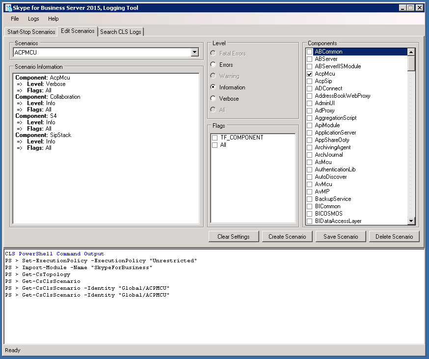

# Registrador cls para Skype Empresarial Server 2015
 
**Resumen:** Obtenga información sobre cómo usar el registrador del Servicio de registro centralizado (CLS) en Skype Empresarial Server 2015.
  
ClS Logger es una herramienta que ayuda a administrar los registros generados por el servicio de registro centralizado.
  
## Requisitos previos

Para usar correctamente el registrador de CLS, debe asegurarse de que se cumple lo siguiente:
  
- Está usando la herramienta en un equipo que es miembro del dominio donde se ejecuta el Servicio de registro centralizado (CLS). La herramienta no se admite actualmente en sesiones remotas de PowerShell.
    
- El archivo Default.tmx de la carpeta de seguimiento (la carpeta donde se capturan los datos de seguimiento para CLS) y Snooper deben copiarse en la misma carpeta en la que está instalada la herramienta ClS Logger.
    
## Comprobar el estado de registro de un conjunto de grupos o equipos

Use los siguientes comandos para comprobar el estado del registro:
  
1. En la pestaña "Escenarios de inicio/detección", seleccione una agrupación de grupos o equipos en la vista de árbol de topología.
    
2. Haga clic en el botón Estado de registro.
    
3. Vea el resultado del comando en el área de salida de comandos de PowerShell para obtener información específica sobre el estado de registro de los equipos o grupos de servidores seleccionados.
    
## Iniciar un escenario existente

Para iniciar un escenario existente:
  
1. En la pestaña "Iniciar/Detener escenarios", seleccione un escenario existente en el menú desplegable Escenarios.
    
2. Seleccione una agrupación de grupos o equipos en la vista de árbol de topología.
    
3. Haga clic en el botón Iniciar escenario. La interfaz de usuario se deshabilitará hasta que finalice la operación. Esto puede ser lento en implementaciones grandes.
    
4. La interfaz de usuario se habilitará de nuevo una vez que el escenario se haya iniciado correctamente, los detalles de la acción también se mostrarán en el área de salida de comandos de PowerShell.
    
5. ClS puede tardar un tiempo antes de que CLS rete encargado del registro antes de los nuevos datos de este escenario.
    
## Detener un escenario existente

Para detener un escenario existente:
  
1. En la pestaña "Iniciar/Detener escenarios", seleccione un escenario existente en el menú desplegable Escenarios.
    
2. Seleccione una agrupación de grupos o equipos en la vista de árbol de topología.
    
3. Haga clic en el botón Detener escenario. La interfaz de usuario se deshabilitará hasta que finalice la operación. Esto puede ser lento en implementaciones grandes.
    
4. La interfaz de usuario se habilitará de nuevo una vez que el escenario se haya detenido, los detalles de la acción también se mostrarán en el área de salida de comandos de PowerShell.
    

  
## Buscar registros

Para buscar registros, seleccione la pestaña "Registros de CLS de búsqueda" y haga clic en el botón "Registros de búsqueda" después de rellenar los campos mostrados, como se describe a continuación:
  
> **Carpeta de archivo de registro** Carpeta para guardar los resultados de la búsqueda de registro. (Obligatorio)
> 
> **Nivel de registro** Esto determina el nivel más bajo que se mostrará en los resultados. Por ejemplo, si se selecciona Advertencia, solo se mostrarán Advertencia, Error y Fatal. El valor predeterminado es Depurar.
> 
> **Grupos de servidores** Los grupos de equipos en los que se realizará la búsqueda de registros son los nodos primarios de la vista de árbol. (Obligatorio)
> 
> **Equipos** Los equipos individuales en los que se realizará la búsqueda de registros son todos los nodos secundarios de la vista de árbol. (Obligatorio)
> 
> **Hora de inicio** Período de tiempo desde el que CLS consultará los registros. (Obligatorio)
> 
> **Hora de finalización** Período de tiempo desde el que CLS dejará de consultar los registros. (Obligatorio)
> 
> **Componentes** Se usa para seleccionar los componentes que se agregarán a la consulta. (Opcional)
> 
> **Id. de llamada** Identificador de llamada de los cuadros de diálogo SIP que se filtrarán. Tenga en cuenta que este campo usa coincidencia exacta. (Opcional)
> 
> **Id. de conferencia** El id. de conferencia de las conferencias por las que se va a filtrar. Tenga en cuenta que este campo usa coincidencia exacta. (Opcional)
> 
> **Dirección IP** Dirección IP que se va a filtrar. Tenga en cuenta que este campo usa coincidencia exacta. (Opcional)
> 
> **Identificadores de correlación** Instrucciones de seguimiento vinculadas lógicamente por este identificador. (Opcional)
> 
> **Número de teléfono** Filtra por número de teléfono. (Opcional)
> 
> **URI de SIP** Filtrar por URI de SIP. (Opcional)
> 
> **Contenido de mensajes SIP contiene** Filtra por el contenido de los mensajes SIP, esta búsqueda subcadena dentro de este campo. (Opcional)
> 
> **Coincidir con cualquiera** Busca con un OPERADOR lógico si está activado. El valor predeterminado es Coincidencia exacta de todos los parámetros.
> 
> **Omitir registros de red** Omite la búsqueda en los registros de red si está activada.
    

  
## Crear un escenario

1. En la **pestaña Editar escenarios,** haga clic en **el botón Crear** escenario.
    
    > [!NOTE]
    > La creación de un escenario clonará la configuración del escenario seleccionado actualmente. Si hace clic **en Borrar configuración** antes de crear un nuevo escenario, comenzará sin componentes ni marcas seleccionadas.
  
2. Escriba el nombre del escenario que desea crear y presione la tecla Entrar o haga clic en el botón Aceptar.
    
3. Ahora se creará el nuevo escenario. Una vez creada correctamente, se seleccionará la lista desplegable Escenarios con el escenario recién creado.
    
## Modificar un escenario

  
1. En la **pestaña Editar escenarios,** busque el escenario deseado que desea modificar.
    
2. Realice los cambios deseados en los componentes, niveles y marcas.
    
3. Haga clic en **el botón Guardar escenario.**
    
4. Tras guardar correctamente el escenario, actualizará el panel de información del escenario con la configuración actualizada.
    
## Eliminar un escenario

1. En la **pestaña Editar escenarios,** seleccione un escenario existente en el menú desplegable Escenarios.
    
2. Haga **clic en Eliminar escenario** para eliminar el escenario.
    
3. Después de confirmar la acción, se eliminará el escenario.
    

