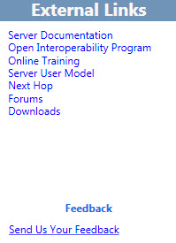

# Navegar por la Herramienta de planeación en Skype Empresarial Server 2015Navigate the Planning Tool in Skype for Business Server 2015

Navegue el Skype para la herramienta de planeación de Business Server 2015 mediante una combinación de una barra de herramientas, los botones específicos de la página y vínculos y paneles específicos del contexto.You navigate the Skype for Business Server 2015 Planning Tool by using a combination of a toolbar, page-specific buttons and links, and context-specific panes. Los paneles contextuales proporcionan información de diseño sobre la planeación y la capacidad que resulta relevante para tomar las decisiones de selección en una página determinada.The context-specific panes provide design information for planning and capacity that is relevant to the selection options on a specific page.

Acerca de cómo iniciar la herramienta de planeación, un diseñador en primer lugar ve la página de **bienvenida a la herramienta de planeación de Skype para Business Server 2015** .On starting the Planning Tool, a designer first sees the **Welcome to the Planning Tool for Skype for Business Server 2015** page.

En esta página, el diseñador podrá elegir entre **Introducción**, **Diseñar sitios** o **Mostrar**.On the Welcome page, the designer chooses **Get Started**, **Design Sites**, or **Display**. Para obtener información detallada, vea [crear el diseño de topología inicial de Skype para Business Server 2015](create-the-initial-design.md).For details, see [Create the initial topology design for Skype for Business Server 2015](create-the-initial-design.md).

En la parte superior de la herramienta de planeación es una barra de herramientas que proporciona acceso fácil a funciones que se usan con frecuencia.At the top of the Planning Tool is a toolbar that provides easy access to frequently used functions. Aquí se muestra la barra de herramientas, a modo de referencia, y las funciones se abordarán en los temas relacionados.The toolbar is displayed here for reference, and each function will be discussed in related topics.

La herramienta de planeación tiene una sección de vínculos externos en el lado izquierdo de la herramienta.The Planning Tool has an External Links section on the left side of the tool. Desde aquí, el diseñador puede acceder fácilmente a la información de planeación e implementación, así como a otros recursos técnicos como, por ejemplo, formación, blogs técnicos, foros y otros recursos descargables.From here, the designer has easy access to planning and deployment information, and other technical resources such as training, technical blogs, forums, and other downloadable resources. También en los vínculos externos sección es un vínculo de comentarios para el Skype para el equipo de la herramienta de planeación de Business Server 2015.Also in the External Links section is a Feedback link to the Skype for Business Server 2015 Planning Tool team.

Se muestra un panel de acciones contextual en varias páginas en la herramienta de planeación.A context-sensitive Actions pane is displayed on many pages in the Planning Tool. Este panel permite al diseñador acceder con facilidad a las secciones principales de la topología.The Actions pane gives the designer easy access to main sections of the topology. Los vínculos disponibles en el panel Acciones cambian en función del nivel de detalle de la topología.The links available in the Actions pane change based on the detail level in your topology. El panel estará disponible una vez que se hayan completado las preguntas de la entrevista y se haya mostrado la topología.The Actions pane is available after you have completed the interview questions and displayed your topology. Dentro del panel Acciones se incluye la sección Información general, donde se muestran las cifras que el diseñador ha especificado como parte del proceso de la entrevista.Included in the Actions pane is the Overview section, which displays numbers that the designer has entered as part of the interview process. La información general está relacionada contextualmente con la información mostrada.The overview is contextually related to the displayed information.

Además, se muestra información sobre el hardware en la información general del panel Acciones. En la configuración del hardware se muestra una lista de los requisitos de hardware que recomienda la topología actual.Additionally, hardware information is displayed in the overview under the Actions pane. The hardware configuration displays a list of hardware requirements that the current topology recommends.

## Vea tambiénSee also

[Crear el diseño de la topología inicial para Skype Empresarial Server 2015Create the initial topology design for Skype for Business Server 2015](create-the-initial-design.md)

[Edición del diseñoEditing the Design](https://technet.microsoft.com/library/08f639ba-0e5f-4ae7-9191-c3d96c25b169.aspx)

[Revisión de los informes del administradorReviewing the Administrator Reports](https://technet.microsoft.com/library/1dee56a9-a033-4201-9765-e3469bd7d3e3.aspx)