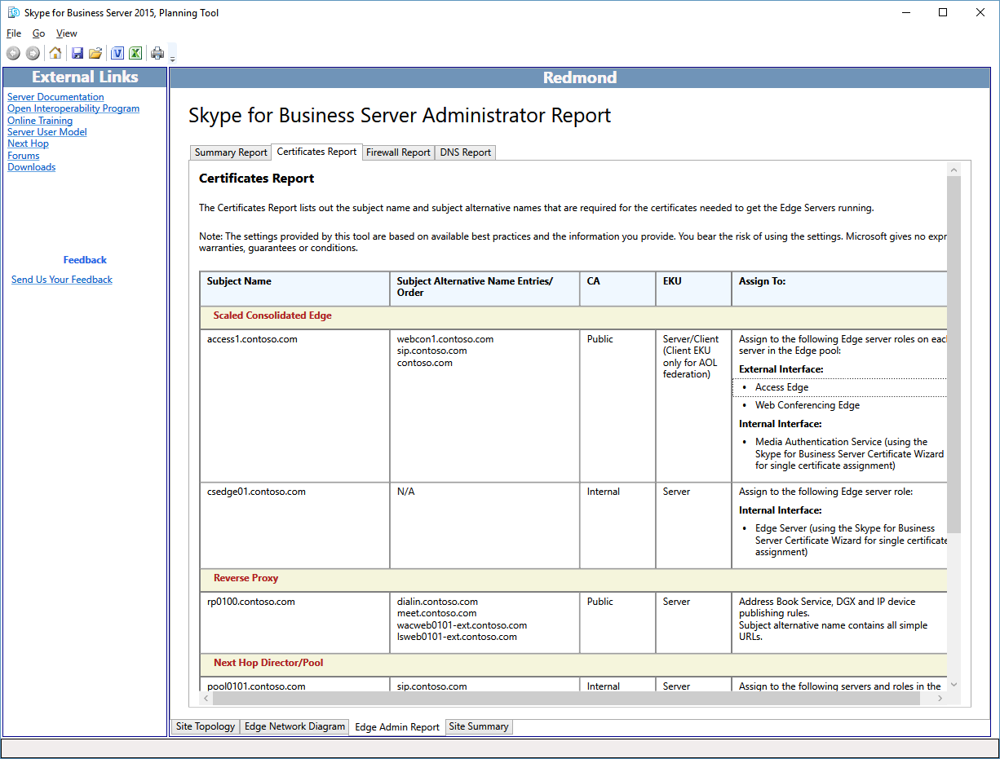

# Revisar los informes del administrador en Skype Empresarial Server 2015Review the Administrator Reports in Skype for Business Server 2015

Los informes de administrador consisten en información detallada acerca de la implementación y las operaciones. Los informes se generan en función de las elecciones realizadas en **Diseñar sitios**. El diseñador puede agregar más valor a los informes de administrador si se editan los diagramas de red y se definen las direcciones IP completas y los nombres de dominio completos (FQDN) de servidores, grupos y equilibradores de carga.The Administrator Reports are detailed information for deployment and operations. The reports are generated based on the selections marked in **Design Sites**. The designer can further add value to the Administrator Reports by editing the network diagrams and defining the complete IP addresses and fully qualified domain names (FQDNs) for servers, pools, and load balancers.

La característica de informes de administrador le permite:The Administrator reports feature allows you to:

- [Review the Summary ReportReview the Summary Report](review-the-administrator-reports.md#Summary_report)

- [Review the Certificates ReportReview the Certificates Report](review-the-administrator-reports.md#Certificates_Report)

- [Review the Firewall ReportReview the Firewall Report](review-the-administrator-reports.md#Firewall_report)

- [Review the DNS ReportReview the DNS Report](review-the-administrator-reports.md#DNS_Report)

## Revisar el informe de resumenReview the Summary Report

El Skype para informe del administrador empresarial es el primero de cuatro valiosos informes que su diseño en todos los detalles de documentos.The Skype for Business Administrator Report is the first of four valuable reports that document your design in detail. La información en este informe, como en los otros tres informes asociados, es útil para los equipos de tecnologías de la información:The information in this report, and the other three associated reports, is useful for your Information Technology Teams:

En el informe de resumen se recoge la información de configuración general relativa a la red perimetral. Se documenta la ubicación, el nombre de dominio completo y la dirección IP, el tipo de red y los comentarios específicos de un rol en particular.The Summary Report lists general configuration information associated with your Edge network. The location, fully qualified domain name (FQDN) and IP address, type of network, and comments specific to a given role are documented.

El diseñador y cada uno de los equipos encargados de implementar, administrar y mantener la infraestructura deben revisar el informe de resumen en busca de datos precisos para asegurarse de que los errores se reduzcan al mínimo.The designer and each of the teams that will deploy, manage, and maintain the infrastructure should review the summary report for accuracy and to make sure that errors are at a minimum.

También puede ver informes más detallados:You can also view more detailed reports:

- Informe de certificadosCertificates Report

- Informe de firewallFirewall Report

- Informe de DNSDNS Report

## Revisión del informe de certificadosReview the Certificates Report

El informe de certificados contiene todos los certificados que se necesitan en el Skype recomendada para la implementación empresarial Server 2015.The Certificates Report contains all certificates that are required in the recommended Skype for Business Server 2015 deployment. La herramienta de planeación de cuentas para los nombres de sujeto y nombre alternativo de sujeto que se hayan especificado.The Planning Tool accounts for the subject names and subject alternative names that are entered. El texto predeterminado que se deja sin editar puede representar un posible desafío para el equipo responsable de solicitar y emitir los certificados.Default text that is left unedited may represent a potential challenge for the team responsible for requesting and issuing the certificates. La información del certificado también contiene datos sobre el origen desde el cual puede emitirse normalmente el certificado.Certificate information also contains information about where the certificate can typically be issued from. Si la infraestructura no dispone de una infraestructura de clave pública (PKI) interna, todos los certificados se pueden solicitar a través de un proveedor de certificados público.If the infrastructure does not have an internal public key infrastructure (PKI) in place, all certificates can be requested through a public certificate provider. Los campos “Uso mejorado de clave (EKU)” y “Asignar a” del informe son muy útiles para comprender el objetivo y la ubicación de cada certificado.Extended key usages (EKU) and Assign To fields in the report are very helpful in understanding what the purpose and location for each certificate should be.

Revise con atención y comprenda completamente el uso y el propósito de cada certificado de la implementación.Carefully review, and be sure to understand, the use and purpose of each certificate in the deployment. Si tiene alguna pregunta acerca de la función de un certificado, determine los elementos con los que se comunica un servidor o servicio.If there is a question about what a certificate does, determine which server or service is talking to what. Se usan los certificados en Skype para Business Server 2015 para dos principales objetivos:Certificates in Skype for Business Server 2015 are used for two primary purposes:

- Seguridad de la capa de transporte mutua (MTLS) - los equipos necesarios para la comunicación presentan un certificado que demuestre su identidad a otro equipo.Mutual Transport Layer Security (MTLS) - The computers involved in the communication each present a certificate that proves their identity to another computer. Esto se conoce como autenticación de servidor.This is known as server authentication. No se puede iniciar la comunicación hasta que la identidad del otro equipo confía en cada equipo.Communication cannot begin until each computer trusts the other computer's identity.

- Cifrado - cifrado (capa de Sockets seguros, o SSL y seguridad de la capa de transporte o TLS) es un método crítico para ayudar a comunicaciones seguras, ayudar a garantizar la privacidad y para crear un sistema de comunicaciones y colaboración de confianza.Encryption - Encryption (Secure Sockets Layer, or SSL, and Transport Layer Security, or TLS) is a critical means to help secure communications, help ensure privacy, and to create a trusted communications and collaboration system.

## Revisar el informe de firewallReview the Firewall Report

Skype para Business Server 2015 tiene un conjunto de reglas de firewall potencialmente complejo.Skype for Business Server 2015 has a potentially complex set of firewall rules. La herramienta de planeación reduce esta complejidad al generar un informe que define con detalle todos los requisitos de firewall, en función de criterios de entrada del diseñador.The Planning Tool reduces this complexity by generating a report that defines in detail all firewall requirements, based on the designer's input criteria. El administrador de firewall de TI podrá usar este informe para configurar y definir las reglas necesarias.The IT firewall administrator will be able to use this report to configure and define the necessary rules.

Desde el punto de vista de la administración del firewall, el informe deberá revisarse atentamente para garantizar que no haya conflictos con reglas de firewall existentes y que no haya directivas ni procedimientos infringidos.From the standpoint of firewall management, the report should be carefully reviewed to make sure that there are no conflicts with exiting firewall rules and that there are no policies or procedures that might be violated.

## Revisar el informe de DNSReview the DNS Report

El informe de DNS, que forma parte de los informes de administrador, detalla todas las entradas recomendadas y conocidas del sistema de nombres de dominio (DNS) para las redes interna, perimetral y externa. Si el diseñador ha completado las ediciones del diagrama de red y ha establecido todas las direcciones IP y los nombres de dominio completos (FQDN) en sus valores de producción, el informe de DNS representa un recurso de configuración excelente. Asimismo, se trata de un documento de solución de problemas operativos.The DNS Report, which is part of the Administrator Report, details all of the recommended and known entries for the Domain Name System (DNS) in the internal, perimeter, and external networks. If the designer has completed the edits to the network diagram, and all IP addresses and fully qualified domain names (FQDNs) are defined to their production values, the DNS Report provides an excellent configuration resource. This report can also serve as an operational troubleshooting document.

Deberá hacer que el equipo de administración de DNS revise completamente el informe de DNS para asegurarse de que no haya errores que puedan provocar alguna dificultad durante la implementación o que compliquen una sesión de solución de problemas.You should have your DNS management team review the DNS Report thoroughly to make sure that there are no errors that may cause difficulty during deployment or that may complicate a troubleshooting session.

## Vea tambiénSee also

[Revisión de los informes del administradorReviewing the Administrator Reports](https://technet.microsoft.com/library/1dee56a9-a033-4201-9765-e3469bd7d3e3.aspx)