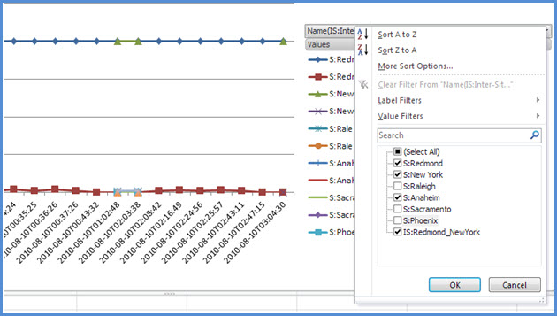
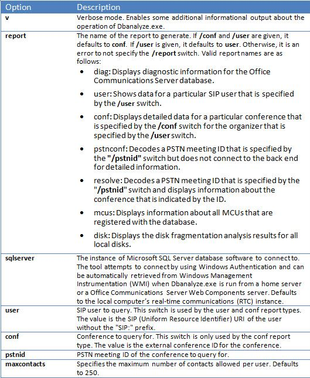

# <a name="skype-for-business-server-2015-resource-kit-tools-documentation"></a><span data-ttu-id="2385a-107">Documentación de herramientas del kit de recursos de Skype Empresarial Server 2015</span><span class="sxs-lookup"><span data-stu-id="2385a-107">Skype for Business Server 2015 Resource Kit Tools Documentation</span></span>

<span data-ttu-id="2385a-108">En este tema se describen las herramientas del Kit de recursos de Skype Empresarial Server 2015, incluido el propósito de cada herramienta y ejemplos de su uso.</span><span class="sxs-lookup"><span data-stu-id="2385a-108">This topic describes the tools in the Skype for Business Server 2015 Resource Kit, including the purpose of each tool, and examples of its use.</span></span> <span data-ttu-id="2385a-109">El Kit de recursos de Skype Empresarial Server 2015 ayuda a facilitar las tareas rutinarias a los administradores de TI que implementan y administran Skype Empresarial Server 2015.</span><span class="sxs-lookup"><span data-stu-id="2385a-109">The Skype for Business Server 2015 Resource Kit helps to make routine tasks easier for IT administrators who deploy and manage Skype for Business Server 2015.</span></span> <span data-ttu-id="2385a-110">Por ejemplo, la **herramienta Web Conf Data** se puede usar para controlar fácilmente los datos que cargan los usuarios durante una reunión en línea.</span><span class="sxs-lookup"><span data-stu-id="2385a-110">For example, the **Web Conf Data** tool can be used to easily control data that is uploaded by users during an online meeting.</span></span> <span data-ttu-id="2385a-111">La **herramienta SEFAUtil** se puede usar para configurar el reenvío delegado de llamadas y la respuesta para los usuarios.</span><span class="sxs-lookup"><span data-stu-id="2385a-111">The **SEFAUtil** tool can be used to set up delegate call forwarding and answering for users.</span></span> <span data-ttu-id="2385a-112">Animamos a los administradores de TI a usar estas herramientas para administrar Skype Empresarial Server 2015 de forma más eficaz.</span><span class="sxs-lookup"><span data-stu-id="2385a-112">We encourage IT administrators to use these tools to more effectively manage Skype for Business Server 2015.</span></span>

## <a name="installation-of-the-resource-kit-tools"></a><span data-ttu-id="2385a-113">Instalación de las herramientas del kit de recursos</span><span class="sxs-lookup"><span data-stu-id="2385a-113">Installation of the Resource Kit Tools</span></span>

<span data-ttu-id="2385a-114">Para instalar el Kit de recursos de Skype Empresarial Server 2015,OCSReskit.msi[ desde ](https://www.microsoft.com/download/details.aspx?id=52631) el Centro de descarga.</span><span class="sxs-lookup"><span data-stu-id="2385a-114">To install the Skype for Business Server 2015 Resource Kit, download [OCSReskit.msi](https://www.microsoft.com/download/details.aspx?id=52631) from the Download Center.</span></span>

<span data-ttu-id="2385a-115">Ejecute **OCSResKit.msi** para realizar una instalación sencilla.</span><span class="sxs-lookup"><span data-stu-id="2385a-115">Run **OCSResKit.msi** to do a simple installation.</span></span> <span data-ttu-id="2385a-116">El archivo .msi instala todas las herramientas en la ruta de acceso siguiente: **%Archivos de programa%\Skype Empresarial Server 2015\ResKit**.</span><span class="sxs-lookup"><span data-stu-id="2385a-116">The .msi installs all the tools in the following path: **%Program Files%\Skype for Business Server 2015\ResKit**.</span></span> <span data-ttu-id="2385a-117">Las herramientas que son ejecutables independientes se encuentran en esta carpeta.</span><span class="sxs-lookup"><span data-stu-id="2385a-117">Tools that are self-contained executables are in this folder.</span></span> <span data-ttu-id="2385a-118">Las herramientas que también tienen archivos compatibles se encuentran en sus propias subcarpetas.</span><span class="sxs-lookup"><span data-stu-id="2385a-118">Tools that also have supporting files are in their own subfolders.</span></span>

## <a name="supported-environments"></a><span data-ttu-id="2385a-119">Entornos admitidos</span><span class="sxs-lookup"><span data-stu-id="2385a-119">Supported Environments</span></span>

<span data-ttu-id="2385a-120">El Kit de recursos de Skype Empresarial Server 2015 debe instalarse en un servidor que cumpla las especificaciones necesarias para Skype Empresarial Server 2015, normalmente uno que se usa para ejecutar Skype Empresarial Server 2015.</span><span class="sxs-lookup"><span data-stu-id="2385a-120">The Skype for Business Server 2015 Resource Kit should be installed on a server that meets the specifications required for Skype for Business Server 2015, usually one being used to run Skype for Business Server 2015.</span></span>

## <a name="resource-kit-tools-overview"></a><span data-ttu-id="2385a-121">Introducción a las herramientas del kit de recursos</span><span class="sxs-lookup"><span data-stu-id="2385a-121">Resource Kit Tools Overview</span></span>

<span data-ttu-id="2385a-122">A continuación se muestra una lista de las herramientas que se proporcionan en el Kit de recursos de Skype Empresarial Server 2015.</span><span class="sxs-lookup"><span data-stu-id="2385a-122">The following is a list of the tools that are provided in the Skype for Business Server 2015 Resource Kit.</span></span> <span data-ttu-id="2385a-123">En las secciones siguientes se incluye una descripción de cada herramienta, incluidos los requisitos y el uso de ejemplo.</span><span class="sxs-lookup"><span data-stu-id="2385a-123">A description of each tool, including the requirements and example usage is covered in the following sections.</span></span>

- [<span data-ttu-id="2385a-124">ABSConfig</span><span class="sxs-lookup"><span data-stu-id="2385a-124">ABSConfig</span></span>](resource-kit-tools.md#ABSConfig)

- [<span data-ttu-id="2385a-125">Monitor de servicio de directivas de ancho de banda</span><span class="sxs-lookup"><span data-stu-id="2385a-125">Bandwidth Policy Service Monitor</span></span>](resource-kit-tools.md#bpsm)

- [<span data-ttu-id="2385a-126">Analizador de uso de ancho de banda</span><span class="sxs-lookup"><span data-stu-id="2385a-126">Bandwidth Utilization Analyzer</span></span>](resource-kit-tools.md#bua)

- [<span data-ttu-id="2385a-127">Call Parkometer</span><span class="sxs-lookup"><span data-stu-id="2385a-127">Call Parkometer</span></span>](resource-kit-tools.md#callpark)

- [<span data-ttu-id="2385a-128">DBAnalyze</span><span class="sxs-lookup"><span data-stu-id="2385a-128">DBAnalyze</span></span>](resource-kit-tools.md#dba)

- [<span data-ttu-id="2385a-129">Importar datos del servicio de almacenamiento</span><span class="sxs-lookup"><span data-stu-id="2385a-129">Import Storage Service Data</span></span>](resource-kit-tools.md#Issd)

- [<span data-ttu-id="2385a-130">LCSSync</span><span class="sxs-lookup"><span data-stu-id="2385a-130">LCSSync</span></span>](resource-kit-tools.md#LCSSync)

- [<span data-ttu-id="2385a-131">Consola de usuario de búsqueda</span><span class="sxs-lookup"><span data-stu-id="2385a-131">Lookup User Console</span></span>](resource-kit-tools.md#LUC)

- [<span data-ttu-id="2385a-132">MsTurnPing</span><span class="sxs-lookup"><span data-stu-id="2385a-132">MsTurnPing</span></span>](resource-kit-tools.md#MsTurnPing)

- [<span data-ttu-id="2385a-133">Visor de configuración de red</span><span class="sxs-lookup"><span data-stu-id="2385a-133">Network Configuration Viewer</span></span>](resource-kit-tools.md#NCV)

- [<span data-ttu-id="2385a-134">Response Group Agent Live</span><span class="sxs-lookup"><span data-stu-id="2385a-134">Response Group Agent Live</span></span>](resource-kit-tools.md#RGAL)

- [<span data-ttu-id="2385a-135">SEFAUtil</span><span class="sxs-lookup"><span data-stu-id="2385a-135">SEFAUtil</span></span>](resource-kit-tools.md#SEFAUtil)

- [<span data-ttu-id="2385a-136">SYSPrep.ps1</span><span class="sxs-lookup"><span data-stu-id="2385a-136">SYSPrep.ps1</span></span>](resource-kit-tools.md#SYSPrep)

- [<span data-ttu-id="2385a-137">Migración de anuncios de números sin signo</span><span class="sxs-lookup"><span data-stu-id="2385a-137">Unassigned Number Announcements Migration</span></span>](resource-kit-tools.md#UNAM)

- [<span data-ttu-id="2385a-138">Web Conf Data</span><span class="sxs-lookup"><span data-stu-id="2385a-138">Web Conf Data</span></span>](resource-kit-tools.md#WebConfData)

## <a name="absconfig"></a><span data-ttu-id="2385a-139">ABSConfig</span><span class="sxs-lookup"><span data-stu-id="2385a-139">ABSConfig</span></span>
<span data-ttu-id="2385a-140"><a name="ABSConfig"> </a></span><span class="sxs-lookup"><span data-stu-id="2385a-140"><a name="ABSConfig"> </a></span></span>

<span data-ttu-id="2385a-141">La herramienta de configuración del servicio de libreta de direcciones (ABSConfig) es una herramienta administrativa que ayuda a los administradores a personalizar la configuración del servicio de libreta de direcciones en Skype Empresarial Server 2015.</span><span class="sxs-lookup"><span data-stu-id="2385a-141">The Address Book Service Configuration tool (ABSConfig) is an administrative tool that helps administrators customize Address Book Service configuration in Skype for Business Server 2015.</span></span> <span data-ttu-id="2385a-142">Esta herramienta también permite a los administradores de Skype Empresarial Server 2015 restaurar la configuración predeterminada del servicio de libreta de direcciones.</span><span class="sxs-lookup"><span data-stu-id="2385a-142">This tool also enables Skype for Business Server 2015 administrators to restore the default Address Book Service settings.</span></span>

### <a name="description"></a><span data-ttu-id="2385a-143">Descripción</span><span class="sxs-lookup"><span data-stu-id="2385a-143">Description</span></span>

<span data-ttu-id="2385a-144">ABSConfig es una aplicación gráfica de interfaz de usuario que permite a los administradores configurar atributos de Servicios de dominio de Active Directory relacionados con el servicio de libreta de direcciones.</span><span class="sxs-lookup"><span data-stu-id="2385a-144">ABSConfig is a graphical user interface application that enables administrators to configure Active Directory Domain Services attributes that are related to Address Book Service.</span></span>

<span data-ttu-id="2385a-145">Los escenarios principales de la herramienta son los siguientes:</span><span class="sxs-lookup"><span data-stu-id="2385a-145">The primary scenarios for the tool are the following:</span></span>

- <span data-ttu-id="2385a-146">Para permitir que los administradores asignen atributos de los Servicios de dominio de Active Directory a los atributos de Skype Empresarial Server 2015.</span><span class="sxs-lookup"><span data-stu-id="2385a-146">To enable administrators to map attributes in Active Directory Domain Services to the attributes for Skype for Business Server 2015.</span></span>

- <span data-ttu-id="2385a-147">Para permitir que los administradores especifiquen el atributo servicios de dominio de Active Directory que se incluirá o excluirá en los archivos del servicio de libreta de direcciones.</span><span class="sxs-lookup"><span data-stu-id="2385a-147">To enable administrators to specify the Active Directory Domain Services attribute to be included or excluded in the Address Book Service files.</span></span>

- <span data-ttu-id="2385a-148">Para permitir a los administradores restaurar la configuración predeterminada del servicio de libreta de direcciones.</span><span class="sxs-lookup"><span data-stu-id="2385a-148">To enable administrators to restore default Address Book Service settings.</span></span>

<span data-ttu-id="2385a-149">La herramienta ABSConfig se puede iniciar mediante el ABSConfig.exe archivo.</span><span class="sxs-lookup"><span data-stu-id="2385a-149">The ABSConfig tool can be started by using the ABSConfig.exe file.</span></span> <span data-ttu-id="2385a-150">La herramienta se abre en la **pestaña Configurar atributos.** Esta tabla tiene opciones para asignar atributos de Servicios de dominio de Active Directory a los campos de atributo de Skype Empresarial Server 2015 y para especificar qué usuarios incluir o excluir en los archivos del servicio de libreta de direcciones en función de filtros de atributos específicos.</span><span class="sxs-lookup"><span data-stu-id="2385a-150">The tool opens to the **Configure Attributes** tab. This table has options to map Active Directory Domain Services attributes to the attribute fields for Skype for Business Server 2015 and to specify which users to include or exclude in Address Book Service files based on specific attribute filters.</span></span> <span data-ttu-id="2385a-151">También tiene opciones para personalizar el valor del número de teléfono que se incluirá en el archivo de la Libreta de direcciones.</span><span class="sxs-lookup"><span data-stu-id="2385a-151">It also has options to customize which value of the phone number to be included in the Address Book file.</span></span> <span data-ttu-id="2385a-152">La **opción Restaurar valores predeterminados permite** a los administradores restaurar la configuración del servicio de libreta de direcciones a los valores predeterminados.</span><span class="sxs-lookup"><span data-stu-id="2385a-152">The **Restore Defaults** option enables administrators to restore Address Book Service settings to default values.</span></span>

> [!NOTE]
> <span data-ttu-id="2385a-153">La nueva asignación de atributos de AD a diferentes nombres de campo OC solo funcionará para la descarga de archivos de libreta de direcciones y no es compatible con la consulta web de libreta de direcciones.</span><span class="sxs-lookup"><span data-stu-id="2385a-153">Re-mapping of AD attributes to different OC Field Names will only work for Address Book File Download, and is not supported by Address Book Web Query.</span></span>

### <a name="output"></a><span data-ttu-id="2385a-154">Salida</span><span class="sxs-lookup"><span data-stu-id="2385a-154">Output</span></span>

<span data-ttu-id="2385a-155">ABSConfig almacena la configuración del servicio de libreta de direcciones en la base de datos.</span><span class="sxs-lookup"><span data-stu-id="2385a-155">ABSConfig stores the Address Book Service configuration in the database.</span></span>

```console
Path: %ProgramFiles%\Skype for Business Server 2015\Reskit
```

### <a name="purpose"></a><span data-ttu-id="2385a-156">Finalidad</span><span class="sxs-lookup"><span data-stu-id="2385a-156">Purpose</span></span>

<span data-ttu-id="2385a-157">ABSConfig proporciona una forma rápida y sencilla de personalizar el servicio de libreta de direcciones de Skype Empresarial Server 2015.</span><span class="sxs-lookup"><span data-stu-id="2385a-157">ABSConfig provides a quick and easy way to customize Skype for Business Server 2015 Address Book Service.</span></span>

### <a name="requirements"></a><span data-ttu-id="2385a-158">Requisitos</span><span class="sxs-lookup"><span data-stu-id="2385a-158">Requirements</span></span>

#### <a name="computer"></a><span data-ttu-id="2385a-159">Equipo</span><span class="sxs-lookup"><span data-stu-id="2385a-159">Computer</span></span>

<span data-ttu-id="2385a-160">ABSConfig solo se puede ejecutar desde un equipo unido a un dominio que tenga instalado Skype Empresarial Server 2015.</span><span class="sxs-lookup"><span data-stu-id="2385a-160">ABSConfig can be run only from a domain-joined computer that has Skype for Business Server 2015 installed.</span></span> <span data-ttu-id="2385a-161">En el caso de Skype Empresarial Server 2015, Enterprise Edition, esta herramienta se puede ejecutar en cualquier servidor front-end que tenga habilitado el servicio de libreta de direcciones durante la instalación.</span><span class="sxs-lookup"><span data-stu-id="2385a-161">In the case of Skype for Business Server 2015, Enterprise Edition, this tool can be run on any Front End servers that have the Address Book Service enabled during setup.</span></span>

#### <a name="network"></a><span data-ttu-id="2385a-162">Red</span><span class="sxs-lookup"><span data-stu-id="2385a-162">Network</span></span>

<span data-ttu-id="2385a-163">El equipo debe poder conectarse al grupo de servidores front-end y a la base de datos back-end.</span><span class="sxs-lookup"><span data-stu-id="2385a-163">The computer should be able to connect to the Front End pool and back-end database.</span></span>

#### <a name="software"></a><span data-ttu-id="2385a-164">Software</span><span class="sxs-lookup"><span data-stu-id="2385a-164">Software</span></span>

<span data-ttu-id="2385a-165">Los siguientes componentes de software deben instalarse antes de ejecutar la herramienta ABSConfig:</span><span class="sxs-lookup"><span data-stu-id="2385a-165">The following software components must be installed before running the ABSConfig tool:</span></span>

- <span data-ttu-id="2385a-166">Skype Empresarial Server 2015</span><span class="sxs-lookup"><span data-stu-id="2385a-166">Skype for Business Server 2015</span></span>

#### <a name="users"></a><span data-ttu-id="2385a-167">Usuarios</span><span class="sxs-lookup"><span data-stu-id="2385a-167">Users</span></span>

<span data-ttu-id="2385a-168">Administradores que tienen los permisos necesarios para actualizar la implementación de Skype Empresarial Server 2015.</span><span class="sxs-lookup"><span data-stu-id="2385a-168">Administrators who have the permissions required to update the Skype for Business Server 2015 deployment.</span></span>

### <a name="examples"></a><span data-ttu-id="2385a-169">Ejemplos</span><span class="sxs-lookup"><span data-stu-id="2385a-169">Examples</span></span>

<span data-ttu-id="2385a-170">ABSConfig se puede iniciar **escribiendo** ABSConfig.exeen un símbolo del sistema.</span><span class="sxs-lookup"><span data-stu-id="2385a-170">ABSConfig can be started by typing **ABSConfig.exe** at a command prompt.</span></span> <span data-ttu-id="2385a-171">A continuación se muestra la interfaz de usuario de la herramienta ABSConfig.</span><span class="sxs-lookup"><span data-stu-id="2385a-171">Shown below is the ABSConfig tool user interface.</span></span>


### <a name="summary"></a><span data-ttu-id="2385a-173">Resumen</span><span class="sxs-lookup"><span data-stu-id="2385a-173">Summary</span></span>

<span data-ttu-id="2385a-174">La herramienta ABSConfig proporciona a los administradores una herramienta rápida y fácil de usar para personalizar el servicio de libreta de direcciones de Skype Empresarial Server 2015.</span><span class="sxs-lookup"><span data-stu-id="2385a-174">The ABSConfig tool provides administrators a quick and easy to use tool to customize Skype for Business Server 2015 Address Book Service.</span></span>

## <a name="bandwidth-policy-service-monitor"></a><span data-ttu-id="2385a-175">Monitor de servicio de directivas de ancho de banda</span><span class="sxs-lookup"><span data-stu-id="2385a-175">Bandwidth Policy Service Monitor</span></span>
<span data-ttu-id="2385a-176"><a name="bpsm"> </a></span><span class="sxs-lookup"><span data-stu-id="2385a-176"><a name="bpsm"> </a></span></span>

<span data-ttu-id="2385a-177">La herramienta Bandwidth Policy Service Monitor está diseñada para permitir a los administradores ver una lista de lo siguiente:</span><span class="sxs-lookup"><span data-stu-id="2385a-177">The Bandwidth Policy Service Monitor tool is intended to allow administrators to view a list of the following:</span></span>

1. <span data-ttu-id="2385a-178">Todos los servicios de directiva de ancho de banda de Skype Empresarial Server 2015 configurados (autenticación y núcleo) en la topología</span><span class="sxs-lookup"><span data-stu-id="2385a-178">All the configured Skype for Business Server 2015 Bandwidth Policy services (Authentication and Core) in the topology</span></span>

2. <span data-ttu-id="2385a-179">Las conexiones que cada servicio realiza a otros servicios de directiva de ancho de banda y a los servidores perimetrales</span><span class="sxs-lookup"><span data-stu-id="2385a-179">The connections that each service makes to other Bandwidth Policy services and to the Edge servers</span></span>

3. <span data-ttu-id="2385a-180">Todos los vínculos configurados en el documento de configuración de red y el uso de ancho de banda en tiempo real según lo notificado por cada uno de los servicios de directiva de ancho de banda</span><span class="sxs-lookup"><span data-stu-id="2385a-180">All the links that are configured in the Network configuration document and real-time bandwidth usage as reported by each of the Bandwidth Policy services</span></span>

### <a name="description"></a><span data-ttu-id="2385a-181">Descripción</span><span class="sxs-lookup"><span data-stu-id="2385a-181">Description</span></span>

<span data-ttu-id="2385a-182">La herramienta Bandwidth Policy Service Monitor se implementa como una aplicación basada en GUI.</span><span class="sxs-lookup"><span data-stu-id="2385a-182">The Bandwidth Policy Service Monitor tool is implemented as a GUI-based application.</span></span> <span data-ttu-id="2385a-183">Los administradores inician la herramienta ejecutando PDPMonUI.exe.</span><span class="sxs-lookup"><span data-stu-id="2385a-183">Administrators start the tool by running PDPMonUI.exe.</span></span>

<span data-ttu-id="2385a-184">Cuando se inicia la herramienta, intenta detectar la lista de servicios de directiva de ancho de banda en la topología.</span><span class="sxs-lookup"><span data-stu-id="2385a-184">When the tool starts, it attempts to discover the list of Bandwidth Policy services in the topology.</span></span> <span data-ttu-id="2385a-185">Una vez realizada la actualización inicial, el panel situado a la izquierda de la ventana se rellena con una lista de servicios agrupados por los clústeres a los que pertenecen.</span><span class="sxs-lookup"><span data-stu-id="2385a-185">After the initial update is done, the pane to the left of the window is populated with a list of services that are grouped by the clusters that they belong to.</span></span>

<span data-ttu-id="2385a-186">Cuando los administradores seleccionan un servicio de directiva de ancho de banda determinado, el panel de la derecha muestra la información sobre ese servicio en particular.</span><span class="sxs-lookup"><span data-stu-id="2385a-186">When administrators select a particular Bandwidth Policy Service, the pane on the right displays the information about that particular service.</span></span> <span data-ttu-id="2385a-187">Ese panel también tiene dos pestañas principales que muestran información.</span><span class="sxs-lookup"><span data-stu-id="2385a-187">That pane also has two main tabs that display information.</span></span>

#### <a name="machine-info-tab"></a><span data-ttu-id="2385a-188">Pestaña Información del equipo</span><span class="sxs-lookup"><span data-stu-id="2385a-188">Machine Info Tab</span></span>

<span data-ttu-id="2385a-189">La **pestaña Información del** equipo muestra los detalles del servicio de directivas de ancho de banda seleccionado y la lista y el estado de todas las conexiones que realiza el servicio de directivas de ancho de banda seleccionado con otros servicios.</span><span class="sxs-lookup"><span data-stu-id="2385a-189">The **Machine Info** tab shows the details of the Bandwidth Policy Service that is selected and the list and state of all the connections that are made by the selected Bandwidth Policy Service to other services.</span></span>

#### <a name="topology-info-tab"></a><span data-ttu-id="2385a-190">Pestaña Información de topología</span><span class="sxs-lookup"><span data-stu-id="2385a-190">Topology Info Tab</span></span>

<span data-ttu-id="2385a-191">La **pestaña Información de** topología muestra una lista de todos los vínculos configurados en las opciones de configuración de red.</span><span class="sxs-lookup"><span data-stu-id="2385a-191">The **Topology Info** tab shows a list of all the links that are configured in the Network configuration settings.</span></span> <span data-ttu-id="2385a-192">Para cada vínculo, se muestra la capacidad de ancho de banda de audio y vídeo.</span><span class="sxs-lookup"><span data-stu-id="2385a-192">For each link, the audio and video bandwidth capacity is displayed.</span></span> <span data-ttu-id="2385a-193">Además, se muestra el ancho de banda que se usa actualmente, tanto en Kbps como en un porcentaje de la capacidad.</span><span class="sxs-lookup"><span data-stu-id="2385a-193">Additionally, the currently utilized bandwidth is displayed, both in Kbps and as a percentage of the capacity.</span></span> <span data-ttu-id="2385a-194">La herramienta usa la codificación de color para resaltar vínculos que tienen un uso cercano a la capacidad, lo que permite a los administradores aislar rápidamente dichos vínculos.</span><span class="sxs-lookup"><span data-stu-id="2385a-194">The tool uses color-coding to highlight links that have utilization that is close to the capacity—this allows administrators to quickly isolate such links.</span></span>

> [!NOTE]
>  <span data-ttu-id="2385a-195">Si se produce un error en la herramienta Bandwidth Policy Service Monitor cuando  se conecta  a cualquiera de los servicios de directiva de ancho de banda configurados, la información de las pestañas Información del equipo e Información de topología no se rellenará.</span><span class="sxs-lookup"><span data-stu-id="2385a-195">If the Bandwidth Policy Service Monitor tool experiences failure when it connects to any of the configured Bandwidth Policy services, the information in the **Machine Info** and the **Topology Info** tabs won't be populated.</span></span> <span data-ttu-id="2385a-196">Sin embargo, es posible que la herramienta se conecte inicialmente pero, posteriormente, pierda su conexión con el servicio.</span><span class="sxs-lookup"><span data-stu-id="2385a-196">However, it is possible that the tool might connect initially but subsequently lose its connection to the service.</span></span> <span data-ttu-id="2385a-197">En estos casos, es posible que los administradores vean información obsoleta.</span><span class="sxs-lookup"><span data-stu-id="2385a-197">In such cases, administrators might see outdated information.</span></span> <span data-ttu-id="2385a-198">Hay una marca **de tiempo de** última actualización en cada una de las pestañas que puede permitir a los administradores ver cuándo se actualizaron los datos por última vez para un servicio de directivas de ancho de banda determinado.</span><span class="sxs-lookup"><span data-stu-id="2385a-198">There is a **Last Updated** time stamp on each of the tabs that can allow administrators to see when the data was last updated for a particular Bandwidth Policy Service.</span></span>

### <a name="output"></a><span data-ttu-id="2385a-199">Salida</span><span class="sxs-lookup"><span data-stu-id="2385a-199">Output</span></span>

<span data-ttu-id="2385a-200">No hay ningún resultado de la línea de comandos; la salida del programa está incluida en la interfaz gráfica de usuario (GUI) principal.</span><span class="sxs-lookup"><span data-stu-id="2385a-200">There is no command-line output; the program output is contained within the main graphical user interface (GUI).</span></span>

### <a name="purpose"></a><span data-ttu-id="2385a-201">Finalidad</span><span class="sxs-lookup"><span data-stu-id="2385a-201">Purpose</span></span>

<span data-ttu-id="2385a-202">La finalidad de la herramienta Bandwidth Policy Service Monitor es permitir a los administradores ver el estado de cada uno de los servicios de directiva de ancho de banda definidos en la topología.</span><span class="sxs-lookup"><span data-stu-id="2385a-202">The purpose of the Bandwidth Policy Service Monitor tool is to allow administrators visibility into the state of each of the Bandwidth Policy services that are defined in the topology.</span></span> <span data-ttu-id="2385a-203">Además, los administradores pueden ver el uso de ancho de banda en tiempo real para todos los vínculos definidos en el documento de configuración de red.</span><span class="sxs-lookup"><span data-stu-id="2385a-203">In addition, administrators can see real-time bandwidth usage for all the links that are defined in the Network configuration document.</span></span>

### <a name="requirements"></a><span data-ttu-id="2385a-204">Requisitos</span><span class="sxs-lookup"><span data-stu-id="2385a-204">Requirements</span></span>

<span data-ttu-id="2385a-205">La herramienta Bandwidth Policy Service Monitor debe ejecutarse en un equipo que forme parte de la topología de Skype Empresarial Server.</span><span class="sxs-lookup"><span data-stu-id="2385a-205">The Bandwidth Policy Service Monitor tool needs to be run on a computer that is part of the Skype for Business Server topology.</span></span>

### <a name="summary"></a><span data-ttu-id="2385a-206">Resumen</span><span class="sxs-lookup"><span data-stu-id="2385a-206">Summary</span></span>

<span data-ttu-id="2385a-207">La herramienta Bandwidth Policy Service Monitor puede ser un recurso valioso para los administradores para que puedan inspeccionar el estado de todos los servicios de directiva de ancho de banda de la topología y, lo que es más importante, pueden obtener el uso de ancho de banda en tiempo real para los vínculos definidos en las opciones de configuración de red.</span><span class="sxs-lookup"><span data-stu-id="2385a-207">The Bandwidth Policy Service Monitor tool can be a valuable resource to administrators so they can inspect the state of all the Bandwidth Policy services in the topology—and more importantly—they can obtain real-time bandwidth utilization for the links that are defined in the Network configuration settings.</span></span>

## <a name="bandwidth-utilization-analyzer"></a><span data-ttu-id="2385a-208">Analizador de uso de ancho de banda</span><span class="sxs-lookup"><span data-stu-id="2385a-208">Bandwidth Utilization Analyzer</span></span>
<span data-ttu-id="2385a-209"><a name="bua"> </a></span><span class="sxs-lookup"><span data-stu-id="2385a-209"><a name="bua"> </a></span></span>

<span data-ttu-id="2385a-210">Bandwidth Utilization Analyzer es una herramienta que crea informes sobre diversas vistas de consumo de ancho de banda por parte de los puntos de conexión de UC a través de vínculos WAN en la red empresarial.</span><span class="sxs-lookup"><span data-stu-id="2385a-210">Bandwidth Utilization Analyzer is a tool that creates reports about various views of bandwidth consumption by the UC endpoints across WAN links in the enterprise network.</span></span> <span data-ttu-id="2385a-211">Estos informes se pueden usar para comprender el patrón de consumo de ancho de banda actual y para ayudar en la planeación de la capacidad de ancho de banda.</span><span class="sxs-lookup"><span data-stu-id="2385a-211">These reports can be used to understand the current bandwidth consumption pattern and to aid in bandwidth capacity planning.</span></span>

### <a name="description"></a><span data-ttu-id="2385a-212">Descripción</span><span class="sxs-lookup"><span data-stu-id="2385a-212">Description</span></span>

<span data-ttu-id="2385a-213">Bandwidth Utilization Analyzer se implementa como una aplicación basada en GUI.</span><span class="sxs-lookup"><span data-stu-id="2385a-213">Bandwidth Utilization Analyzer is implemented as a GUI-based application.</span></span> <span data-ttu-id="2385a-214">Esta herramienta genera informes específicamente para el uso de audio en toda la red y ayuda con la planeación de la capacidad.</span><span class="sxs-lookup"><span data-stu-id="2385a-214">This tool generates reports specifically for audio utilization across the network and helps with capacity planning.</span></span> <span data-ttu-id="2385a-215">También itera en la capacidad de ancho de banda asignada a varios vínculos.</span><span class="sxs-lookup"><span data-stu-id="2385a-215">It also iterates on the bandwidth capacity that is assigned to various links.</span></span>

### <a name="output"></a><span data-ttu-id="2385a-216">Salida</span><span class="sxs-lookup"><span data-stu-id="2385a-216">Output</span></span>

<span data-ttu-id="2385a-217">El Analizador de uso de ancho de banda proporciona gráficos al trazados de capacidad de ancho de banda y uso de audio para todos los vínculos WAN configurados en el sistema.</span><span class="sxs-lookup"><span data-stu-id="2385a-217">Bandwidth Utilization Analyzer provides graphic al plots of bandwidth capacity and utilization for audio for all the WAN links that are configured in the system.</span></span>

### <a name="purpose"></a><span data-ttu-id="2385a-218">Finalidad</span><span class="sxs-lookup"><span data-stu-id="2385a-218">Purpose</span></span>

<span data-ttu-id="2385a-219">En cualquier implementación de voz y vídeo, es fundamental supervisar y comprender la tendencia del uso de ancho de banda del tráfico multimedia en la red empresarial.</span><span class="sxs-lookup"><span data-stu-id="2385a-219">In any voice and video deployment, it's critical to monitor and understand the trend of bandwidth utilization of media traffic across the enterprise network.</span></span> <span data-ttu-id="2385a-220">La herramienta Bandwidth Utilization Analyzer permite a un administrador lograr esto.</span><span class="sxs-lookup"><span data-stu-id="2385a-220">The Bandwidth Utilization Analyzer tool allows an administrator to achieve just that.</span></span> <span data-ttu-id="2385a-221">Esta herramienta hace lo siguiente:</span><span class="sxs-lookup"><span data-stu-id="2385a-221">This tool does the following:</span></span>

- <span data-ttu-id="2385a-222">Genera informes específicos para el uso de audio en toda la red</span><span class="sxs-lookup"><span data-stu-id="2385a-222">Generates specific reports for audio utilization across the network</span></span>

- <span data-ttu-id="2385a-223">Ayuda a planear e iteraciones de capacidad más eficaces en la capacidad de ancho de banda asignada a varios vínculos</span><span class="sxs-lookup"><span data-stu-id="2385a-223">Helps with more effective capacity planning and iteration on the bandwidth capacity that is assigned to various links</span></span>

<span data-ttu-id="2385a-224">El Analizador de uso de ancho de banda puede generar trazados gráficos de informes de uso y capacidad de ancho de banda; son los siguientes:</span><span class="sxs-lookup"><span data-stu-id="2385a-224">Bandwidth Utilization Analyzer can generate graphical plots of bandwidth capacity and utilization reports; they are as follows:</span></span>

- <span data-ttu-id="2385a-225">Todos los vínculos WAN de la red empresarial</span><span class="sxs-lookup"><span data-stu-id="2385a-225">All the WAN links in the enterprise network</span></span>

- <span data-ttu-id="2385a-226">Filtrado por vínculos WAN seleccionados que se han elegido</span><span class="sxs-lookup"><span data-stu-id="2385a-226">Filtered by selected WAN links that have been chosen</span></span>

- <span data-ttu-id="2385a-227">Filtrado por vínculos WAN que han superado la capacidad de vínculos</span><span class="sxs-lookup"><span data-stu-id="2385a-227">Filtered by WAN links that have exceeded link capacity</span></span>

- <span data-ttu-id="2385a-228">Filtrado por vínculos WAN que han usado poco el ancho de banda aprovisionado</span><span class="sxs-lookup"><span data-stu-id="2385a-228">Filtered by WAN links that have been under-utilizing the provisioned bandwidth</span></span>

- <span data-ttu-id="2385a-229">Filtrar por vínculos WAN que han llegado a niveles críticos (un uso de ancho de banda superior al 90 % de la capacidad de ancho de banda del vínculo WAN)</span><span class="sxs-lookup"><span data-stu-id="2385a-229">Filter by WAN links that have been reaching critical levels (a bandwidth utilization that is greater than 90% of bandwidth capacity of the WAN link)</span></span>

- <span data-ttu-id="2385a-230">Filtrado por tipo de vínculo WAN: vínculos de sitio de red, vínculos entre regiones y vínculos dentro de un sitio</span><span class="sxs-lookup"><span data-stu-id="2385a-230">Filtered by WAN link type—network-site links, interregional links, and links within a site</span></span>

- <span data-ttu-id="2385a-231">Filtrado por región de red</span><span class="sxs-lookup"><span data-stu-id="2385a-231">Filtered by network region</span></span>

#### <a name="applications"></a><span data-ttu-id="2385a-232">Aplicaciones</span><span class="sxs-lookup"><span data-stu-id="2385a-232">Applications</span></span>

<span data-ttu-id="2385a-233">El Analizador de uso de ancho de banda tiene las siguientes dos aplicaciones (herramientas):</span><span class="sxs-lookup"><span data-stu-id="2385a-233">Bandwidth Utilization Analyzer has the following two applications (tools):</span></span>

- <span data-ttu-id="2385a-234">**WanLinkLogCollector.exe** Esta herramienta permite al usuario introducir la información necesaria.</span><span class="sxs-lookup"><span data-stu-id="2385a-234">**WanLinkLogCollector.exe** This tool enables its user to input the required information.</span></span>

- <span data-ttu-id="2385a-235">**BandwidthUtilizationAnalyzer.xlsm** Un informe de software de hoja de cálculo de Microsoft Excel se inicia automáticamente mediante WanLinkLogCollector.exe.</span><span class="sxs-lookup"><span data-stu-id="2385a-235">**BandwidthUtilizationAnalyzer.xlsm** A Microsoft Excel spreadsheet software report is automatically launched by WanLinkLogCollector.exe.</span></span> <span data-ttu-id="2385a-236">Esta aplicación permite al usuario aplicar filtros al informe, como se muestra más adelante en este artículo.</span><span class="sxs-lookup"><span data-stu-id="2385a-236">This application allows the user to apply filters to the report as shown later in this article.</span></span>

#### <a name="phases-of-using-bandwidth-utilization-analyzer"></a><span data-ttu-id="2385a-237">Fases del uso del analizador de uso de ancho de banda</span><span class="sxs-lookup"><span data-stu-id="2385a-237">Phases of Using Bandwidth Utilization Analyzer</span></span>

<span data-ttu-id="2385a-238">Existen dos fases al usar el Analizador de uso de ancho de banda:</span><span class="sxs-lookup"><span data-stu-id="2385a-238">There are two phases when using Bandwidth Utilization Analyzer:</span></span>

- <span data-ttu-id="2385a-239">Recopilar registros, que se realiza mediante WanLinkLogCollector.exe</span><span class="sxs-lookup"><span data-stu-id="2385a-239">Collect logs, which is performed by using WanLinkLogCollector.exe</span></span>

- <span data-ttu-id="2385a-240">Personalización de informes, que se realiza mediante BandwidthUtilizationAnalyzer.xlsm</span><span class="sxs-lookup"><span data-stu-id="2385a-240">Customize reports, which is performed by using BandwidthUtilizationAnalyzer.xlsm</span></span>

    > [!IMPORTANT]
    > <span data-ttu-id="2385a-241">Se recomienda encarecidamente que BandwidthUtilizationAnalyzer.xlslos usuarios finales no puedan iniciar manualmente el archivo m.</span><span class="sxs-lookup"><span data-stu-id="2385a-241">We strongly recommend that BandwidthUtilizationAnalyzer.xlsm not be manually launched by end users.</span></span>

#### <a name="starting-bandwidth-utilization-analyzer"></a><span data-ttu-id="2385a-242">Iniciar el analizador de uso de ancho de banda</span><span class="sxs-lookup"><span data-stu-id="2385a-242">Starting Bandwidth Utilization Analyzer</span></span>

<span data-ttu-id="2385a-243">Inicia WanLinkLogCollector.exe en el símbolo del sistema o mediante el Explorador de Windows.</span><span class="sxs-lookup"><span data-stu-id="2385a-243">Start WanLinkLogCollector.exe at the command prompt or by using Windows Explorer.</span></span>

 <span data-ttu-id="2385a-244">**Uso de WanLinkLogCollector.exe**</span><span class="sxs-lookup"><span data-stu-id="2385a-244">**Using WanLinkLogCollector.exe**</span></span>

<span data-ttu-id="2385a-245">Hay tres pasos para usar WanLinkLogCollector.exe:</span><span class="sxs-lookup"><span data-stu-id="2385a-245">There are three steps to using WanLinkLogCollector.exe:</span></span>

1. <span data-ttu-id="2385a-246">**Registrar la escala de tiempo** Proporcionar la escala de tiempo para la que se debe generar el informe</span><span class="sxs-lookup"><span data-stu-id="2385a-246">**Log the timeline** Provide the timeline that the report needs to be generated for</span></span>

2. <span data-ttu-id="2385a-247">**Especificar los directorios de archivos** Proporcionar información de ubicación de archivos</span><span class="sxs-lookup"><span data-stu-id="2385a-247">**Specify the file directories** Provide file location information</span></span>

3. <span data-ttu-id="2385a-248">**Recopilar los registros e iniciar el visor de informes** Ejecutar el comando para generar el informe</span><span class="sxs-lookup"><span data-stu-id="2385a-248">**Collect the logs and launch the report viewer** Execute the command to generate the report</span></span>

#### <a name="step-1---log-the-timeline"></a><span data-ttu-id="2385a-249">Paso 1: registrar la escala de tiempo</span><span class="sxs-lookup"><span data-stu-id="2385a-249">Step 1 - Log the timeline</span></span>

<span data-ttu-id="2385a-250">El registro de la escala de tiempo permite al usuario de la herramienta especificar lo siguiente como se muestra en la ilustración siguiente.</span><span class="sxs-lookup"><span data-stu-id="2385a-250">Logging the timeline allows the tool user to specify the following as shown in the figure below.</span></span>

1. <span data-ttu-id="2385a-251">**Fecha de inicio** Esta es la fecha de inicio de la escala de tiempo para la que se va a generar el informe; por ejemplo, 1 de agosto de 2010.</span><span class="sxs-lookup"><span data-stu-id="2385a-251">**Start date** This is the start date of the timeline that the report is to be generated for; for example, August 1, 2010.</span></span>

2. <span data-ttu-id="2385a-252">**Fecha de finalización** Esta es la fecha de finalización de la escala de tiempo para la que se va a generar el informe; por ejemplo, 30 de septiembre de 2010.</span><span class="sxs-lookup"><span data-stu-id="2385a-252">**End date** This is the end date of the timeline that the report is to be generated for; for example, September 30, 2010.</span></span>

     

#### <a name="step-2---specify-the-file-directories"></a><span data-ttu-id="2385a-254">Paso 2: Especificar los directorios de archivos</span><span class="sxs-lookup"><span data-stu-id="2385a-254">Step 2 - Specify the file directories</span></span>

<span data-ttu-id="2385a-255">El usuario puede especificar los siguientes directorios de archivos, como se muestra.</span><span class="sxs-lookup"><span data-stu-id="2385a-255">The following file directories can be specified by the user as shown.</span></span>

- <span data-ttu-id="2385a-256">**Ubicación de los archivos de registro del servidor** Ubicación de la carpeta donde se almacenan los registros del servidor de directivas de ancho de banda.</span><span class="sxs-lookup"><span data-stu-id="2385a-256">**Server log files location** The folder location where Bandwidth policy server logs are stored.</span></span> <span data-ttu-id="2385a-257">Esto suele estar en \<fileserver\> \\<de FE \> \AppServerFiles\PDP.</span><span class="sxs-lookup"><span data-stu-id="2385a-257">This is typically in \<fileserver\>\\<choice of FE\>\AppServerFiles\PDP.</span></span>

- <span data-ttu-id="2385a-258">**Ubicación de almacenamiento temporal de archivos** Ubicación del archivo temporal donde se almacenan los archivos intermedios mientras se genera el informe.</span><span class="sxs-lookup"><span data-stu-id="2385a-258">**Temporary file storage location** The temporary file location where intermediate files are stored while the report is being generated.</span></span>

    

    > [!NOTE]
    > <span data-ttu-id="2385a-260">Asegúrese de que el usuario de la herramienta tenga acceso suficiente a los registros del servidor y a la carpeta de almacén de archivos temporal.</span><span class="sxs-lookup"><span data-stu-id="2385a-260">Ensure that sufficient file access to the server logs and the temporary file store folder is provided to the tool user.</span></span>

#### <a name="step-3---collect-the-logs-and-start-the-report-viewer"></a><span data-ttu-id="2385a-261">Paso 3: recopilar los registros e iniciar el visor de informes</span><span class="sxs-lookup"><span data-stu-id="2385a-261">Step 3 - Collect the logs and start the report viewer</span></span>

<span data-ttu-id="2385a-262">Para recopilar los registros e iniciar el visor de informes, haga clic **en Ejecutar** como se muestra a continuación.</span><span class="sxs-lookup"><span data-stu-id="2385a-262">To collect the logs and start the report viewer, click **Execute** as shown below.</span></span> <span data-ttu-id="2385a-263">En este paso se recopilan los datos necesarios.</span><span class="sxs-lookup"><span data-stu-id="2385a-263">This step collects the required data.</span></span>


<span data-ttu-id="2385a-265">Cuando la validación de entrada se realiza correctamente, se muestra el mensaje que se muestra a continuación.</span><span class="sxs-lookup"><span data-stu-id="2385a-265">When the input validation is successful, the message shown below is displayed.</span></span>


<span data-ttu-id="2385a-267">Haga clic en **Aceptar**.</span><span class="sxs-lookup"><span data-stu-id="2385a-267">Click **OK**.</span></span> <span data-ttu-id="2385a-268">BandwidthUtilizationAnalyzer.xlsm se inicia automáticamente.</span><span class="sxs-lookup"><span data-stu-id="2385a-268">BandwidthUtilizationAnalyzer.xlsm is automatically started.</span></span> <span data-ttu-id="2385a-269">Siga las instrucciones del cuadro de mensaje.</span><span class="sxs-lookup"><span data-stu-id="2385a-269">Follow the instructions in the message box.</span></span> <span data-ttu-id="2385a-270">Para obtener más información, **consulte BandwidthUtilizationAnalyzer.xlsm** en la sección siguiente.</span><span class="sxs-lookup"><span data-stu-id="2385a-270">For details, see **Using BandwidthUtilizationAnalyzer.xlsm** in the next section.</span></span>


### <a name="using-bandwidthutilizationanalyzerxlsm"></a><span data-ttu-id="2385a-271">Usar BandwidthUtilizationAnalyzer.xlsm</span><span class="sxs-lookup"><span data-stu-id="2385a-271">Using BandwidthUtilizationAnalyzer.xlsm</span></span>

1. <span data-ttu-id="2385a-272">Cuando BandwidthUtilizationAnalyzer.xlsm se inicie automáticamente, haga clic **en Actualizar** como se muestra a continuación.</span><span class="sxs-lookup"><span data-stu-id="2385a-272">When BandwidthUtilizationAnalyzer.xlsm is automatically started, click **Refresh** as shown below.</span></span>

     

2. <span data-ttu-id="2385a-274">Cuando se abra una carpeta de archivos, seleccione consolidated.csv la ubicación especificada en el cuadro de mensaje, como se muestra a continuación.</span><span class="sxs-lookup"><span data-stu-id="2385a-274">When a file folder is opened, select consolidated.csv from the location that is specified in the message box as shown below.</span></span> <span data-ttu-id="2385a-275">También muestra la ubicación como **C:\Temp**.</span><span class="sxs-lookup"><span data-stu-id="2385a-275">It also shows the location as **C:\Temp**.</span></span>

     

3. <span data-ttu-id="2385a-277">Haga clic en **Importar**.</span><span class="sxs-lookup"><span data-stu-id="2385a-277">Click **Import**.</span></span>

4. <span data-ttu-id="2385a-278">El trazado gráfico se genera automáticamente.</span><span class="sxs-lookup"><span data-stu-id="2385a-278">The graphical plot is automatically generated.</span></span> <span data-ttu-id="2385a-279">Está disponible cuando desaparece el puntero de trabajo en segundo plano.</span><span class="sxs-lookup"><span data-stu-id="2385a-279">It is available when the working-in-the-background pointer disappears.</span></span>

     

#### <a name="applying-filters-to-the-report-view"></a><span data-ttu-id="2385a-281">Aplicar filtros a la vista Informe</span><span class="sxs-lookup"><span data-stu-id="2385a-281">Applying Filters to the Report View</span></span>

<span data-ttu-id="2385a-282">Los filtros que se pueden aplicar a la vista de informe, como se muestra a continuación, se describen de la siguiente manera:</span><span class="sxs-lookup"><span data-stu-id="2385a-282">The filters that can be applied to the report view as shown below are described as follows:</span></span>


1. <span data-ttu-id="2385a-284">**Nombre** Filtra por vínculos WAN (el filtro está en el lado derecho del gráfico). El prefijo indica los siguientes tipos de vínculos; ver el cuadro vertical (azul):</span><span class="sxs-lookup"><span data-stu-id="2385a-284">**Name** Filter by WAN links (the filter is on the right side of the graph).The prefix denotes the following link types; see the vertical (blue) box:</span></span>

   - <span data-ttu-id="2385a-285">**S Site** El vínculo WAN de un sitio de red a una región de red</span><span class="sxs-lookup"><span data-stu-id="2385a-285">**S Site** The WAN link from a network site to a network region</span></span>

   - <span data-ttu-id="2385a-286">**IS entre sitios** El vínculo WAN entre dos sitios de red</span><span class="sxs-lookup"><span data-stu-id="2385a-286">**IS Inter-Site** The WAN link between two network sites</span></span>

   - <span data-ttu-id="2385a-287">**R entre regiones** El vínculo WAN entre dos regiones de red</span><span class="sxs-lookup"><span data-stu-id="2385a-287">**R Inter-Region** The WAN link between two network region</span></span>

2. <span data-ttu-id="2385a-288">**Límite superado** Filtrar por vínculos WAN cuyo uso de ancho de banda es superior a la capacidad de ancho de banda</span><span class="sxs-lookup"><span data-stu-id="2385a-288">**Exceeded limit** Filter by WAN links whose bandwidth utilization is more than the bandwidth capacity</span></span>

3. <span data-ttu-id="2385a-289">**Niveles críticos** Filtrar por vínculos WAN cuyo uso de ancho de banda ha alcanzado el 90 % o más de la capacidad de ancho de banda</span><span class="sxs-lookup"><span data-stu-id="2385a-289">**Critical levels** Filter by WAN links whose bandwidth utilization has reached 90% or more than the bandwidth capacity</span></span>

4. <span data-ttu-id="2385a-290">**Infrautilmente utilizado** Filtrar por vínculos WAN cuyo uso de ancho de banda ha sido inferior al 25 % de la capacidad de ancho de banda</span><span class="sxs-lookup"><span data-stu-id="2385a-290">**Under-utilized** Filter by WAN links whose bandwidth utilization has been less than 25% of the bandwidth capacity</span></span>

5. <span data-ttu-id="2385a-291">**Tipo de vínculo** Filtre por los siguientes tipos de vínculos WAN:</span><span class="sxs-lookup"><span data-stu-id="2385a-291">**Link type** Filter by the following WAN links types:</span></span>

   - <span data-ttu-id="2385a-292">**Tipo de sitio de** red</span><span class="sxs-lookup"><span data-stu-id="2385a-292">**Network site** type</span></span>

   - <span data-ttu-id="2385a-293">**Tipo entre sitios**</span><span class="sxs-lookup"><span data-stu-id="2385a-293">**Inter-site** type</span></span>

   - <span data-ttu-id="2385a-294">**Tipo de vínculo entre regiones**</span><span class="sxs-lookup"><span data-stu-id="2385a-294">**Inter-Region link** type</span></span>

6. <span data-ttu-id="2385a-295">**Región** Filtrar por región de red</span><span class="sxs-lookup"><span data-stu-id="2385a-295">**Region** Filter by network region</span></span>

<span data-ttu-id="2385a-296">Las siguientes figuras muestran los filtros descritos anteriormente.</span><span class="sxs-lookup"><span data-stu-id="2385a-296">The following figures show the previously described filters.</span></span>

<span data-ttu-id="2385a-297">Filtrar por **nombre**.</span><span class="sxs-lookup"><span data-stu-id="2385a-297">Filter by **Name**.</span></span> <span data-ttu-id="2385a-298">Seleccione la lista de vínculos que deben mostrarse en el gráfico.</span><span class="sxs-lookup"><span data-stu-id="2385a-298">Select the list of links that need to be displayed in the graph.</span></span>



<span data-ttu-id="2385a-300">Filtrar por **límite superado.**</span><span class="sxs-lookup"><span data-stu-id="2385a-300">Filter by **Exceeded limit**.</span></span> <span data-ttu-id="2385a-301">Seleccione **True** para aplicar el filtro.</span><span class="sxs-lookup"><span data-stu-id="2385a-301">Select **True** to enforce the filter.</span></span>


<span data-ttu-id="2385a-303">Filtrar por **niveles críticos**.</span><span class="sxs-lookup"><span data-stu-id="2385a-303">Filter by **Critical levels**.</span></span> <span data-ttu-id="2385a-304">Seleccione **True** para aplicar el filtro.</span><span class="sxs-lookup"><span data-stu-id="2385a-304">Select **True** to enforce the filter.</span></span>


<span data-ttu-id="2385a-306">Filtrar por **Under utilizado**.</span><span class="sxs-lookup"><span data-stu-id="2385a-306">Filter by **Under utilized**.</span></span> <span data-ttu-id="2385a-307">Seleccione **True** para aplicar el filtro.</span><span class="sxs-lookup"><span data-stu-id="2385a-307">Select **True** to enforce the filter.</span></span>


<span data-ttu-id="2385a-309">Filtrar por **tipo de vínculo.**</span><span class="sxs-lookup"><span data-stu-id="2385a-309">Filter by **Link Type**.</span></span> <span data-ttu-id="2385a-310">Seleccione el tipo o los tipos que deben mostrarse.</span><span class="sxs-lookup"><span data-stu-id="2385a-310">Select the type or types that need to be displayed.</span></span>


<span data-ttu-id="2385a-312">Filtrar por **región**.</span><span class="sxs-lookup"><span data-stu-id="2385a-312">Filter by **Region**.</span></span> <span data-ttu-id="2385a-313">Seleccione una lista de regiones cuyos vínculos deben mostrarse.</span><span class="sxs-lookup"><span data-stu-id="2385a-313">Select a list of regions whose links need to be displayed.</span></span>


### <a name="requirements"></a><span data-ttu-id="2385a-315">Requisitos</span><span class="sxs-lookup"><span data-stu-id="2385a-315">Requirements</span></span>

- <span data-ttu-id="2385a-316">.NET Framework 3.5</span><span class="sxs-lookup"><span data-stu-id="2385a-316">The .NET Framework 3.5</span></span>

- <span data-ttu-id="2385a-317">Microsoft Excel 2010 o Excel 2007</span><span class="sxs-lookup"><span data-stu-id="2385a-317">Microsoft Excel 2010 or Excel 2007</span></span>

### <a name="summary"></a><span data-ttu-id="2385a-318">Resumen</span><span class="sxs-lookup"><span data-stu-id="2385a-318">Summary</span></span>

<span data-ttu-id="2385a-319">El Analizador de uso de ancho de banda se usa para trazar el uso del ancho de banda de audio para el tráfico de UC a través de la red.</span><span class="sxs-lookup"><span data-stu-id="2385a-319">Bandwidth Utilization Analyzer is used to plot the audio bandwidth utilization for UC traffic across the network.</span></span> <span data-ttu-id="2385a-320">Esta herramienta también se puede usar para informar del uso del ancho de banda de vídeo en la red.</span><span class="sxs-lookup"><span data-stu-id="2385a-320">This tool can be used to report the utilization of video bandwidth on the network as well.</span></span>

## <a name="call-parkometer"></a><span data-ttu-id="2385a-321">Call Parkometer</span><span class="sxs-lookup"><span data-stu-id="2385a-321">Call Parkometer</span></span>
<span data-ttu-id="2385a-322"><a name="callpark"> </a></span><span class="sxs-lookup"><span data-stu-id="2385a-322"><a name="callpark"> </a></span></span>

<span data-ttu-id="2385a-323">Call Parkometer es una aplicación de línea de comandos que proporciona fácil acceso a la base de datos de órbitas de estacionamiento de llamadas.</span><span class="sxs-lookup"><span data-stu-id="2385a-323">Call Parkometer is a command-line application that provides easy access to the Call Park orbit database.</span></span>

### <a name="description"></a><span data-ttu-id="2385a-324">Descripción</span><span class="sxs-lookup"><span data-stu-id="2385a-324">Description</span></span>

<span data-ttu-id="2385a-325">Call Parkometer es una herramienta para realizar un seguimiento de las llamadas estacionadas actualmente.</span><span class="sxs-lookup"><span data-stu-id="2385a-325">Call Parkometer is a tool to track currently parked calls.</span></span> <span data-ttu-id="2385a-326">También recopila estadísticas sobre órbitas y uso del servidor de estacionamiento de llamadas (CPS).</span><span class="sxs-lookup"><span data-stu-id="2385a-326">It also collects statistics about orbits and Call Park Server (CPS) usage.</span></span> <span data-ttu-id="2385a-327">Esta herramienta de línea de comandos proporciona acceso de lectura y escritura a la órbita de CPS SQL Server base de datos desde un equipo local o conectado remotamente.</span><span class="sxs-lookup"><span data-stu-id="2385a-327">This command-line tool provides both read and write-access to the CPS orbit SQL Server database from a local or remotely connected computer.</span></span>

<span data-ttu-id="2385a-328">Todas las opciones son mutuamente excluyentes.</span><span class="sxs-lookup"><span data-stu-id="2385a-328">All options are mutually exclusive.</span></span> <span data-ttu-id="2385a-329">La sintaxis de la línea de comandos es la siguiente:</span><span class="sxs-lookup"><span data-stu-id="2385a-329">Command-line syntax is as follows:</span></span>

- <span data-ttu-id="2385a-330">**Parámetro -o:** enumera todos los intervalos de órbitas configurados para este grupo.</span><span class="sxs-lookup"><span data-stu-id="2385a-330">**-o** parameter—lists all orbit ranges configured for this pool.</span></span>

- <span data-ttu-id="2385a-331">**Parámetro -n:** enumera todas las órbitas usadas actualmente en este grupo de servidores.</span><span class="sxs-lookup"><span data-stu-id="2385a-331">**-n** parameter—lists all currently used orbits in this pool.</span></span> <span data-ttu-id="2385a-332">La información que se muestra es la siguiente:</span><span class="sxs-lookup"><span data-stu-id="2385a-332">The information displayed is as follows:</span></span>

  - <span data-ttu-id="2385a-333">Identificador uniforme de recursos (URI) de SIP del estacionado y el aparcado.</span><span class="sxs-lookup"><span data-stu-id="2385a-333">SIP Uniform Resource Identifier (URI) of the parkee and parker.</span></span>

  - <span data-ttu-id="2385a-334">Nombre de host del CPS donde está estacionada la llamada.</span><span class="sxs-lookup"><span data-stu-id="2385a-334">Host name of the CPS where the call is parked.</span></span>

  - <span data-ttu-id="2385a-335">Marca de tiempo de cuándo se estacionó la llamada.</span><span class="sxs-lookup"><span data-stu-id="2385a-335">Time stamp of when the call was parked.</span></span>

- <span data-ttu-id="2385a-336">**Parámetro -f:** enumera el número de órbitas disponibles actualmente en el grupo de servidores.</span><span class="sxs-lookup"><span data-stu-id="2385a-336">**-f** parameter—lists the number of currently free orbits in the pool.</span></span>

- <span data-ttu-id="2385a-337">**-r \<n\>** enumera las \<n\> últimas llamadas estacionadas.</span><span class="sxs-lookup"><span data-stu-id="2385a-337">**-r \<n\>** parameter—lists the \<n\> last parked calls.</span></span> <span data-ttu-id="2385a-338">La información que se muestra es la siguiente:</span><span class="sxs-lookup"><span data-stu-id="2385a-338">The information displayed is as follows:</span></span>

  - <span data-ttu-id="2385a-339">URI de SIP de estacionado.</span><span class="sxs-lookup"><span data-stu-id="2385a-339">Parkee SIP URI.</span></span>

  - <span data-ttu-id="2385a-340">URI sip de Sip.</span><span class="sxs-lookup"><span data-stu-id="2385a-340">Parker SIP URI.</span></span>

  - <span data-ttu-id="2385a-341">Nombre de host del CPS donde se estacionó la llamada.</span><span class="sxs-lookup"><span data-stu-id="2385a-341">Host name of the CPS where the call was parked.</span></span>

  - <span data-ttu-id="2385a-342">Marca de tiempo de cuándo se recuperó o se soltó la llamada.</span><span class="sxs-lookup"><span data-stu-id="2385a-342">Time stamp of when the call was retrieved or dropped.</span></span>

- <span data-ttu-id="2385a-343">**-t \<n\>** : prueba la reserva de una órbita en la base de datos para mostrar la aleatoriedad de los números de órbita asignados.</span><span class="sxs-lookup"><span data-stu-id="2385a-343">**-t\<n\>** parameter - tests reserving an orbit in the database to show the randomness of the assigned orbit numbers.</span></span>

### <a name="output"></a><span data-ttu-id="2385a-344">Salida</span><span class="sxs-lookup"><span data-stu-id="2385a-344">Output</span></span>

<span data-ttu-id="2385a-345">Según los parámetros de entrada especificados en un símbolo del sistema, Call Parkometer muestra la siguiente salida:</span><span class="sxs-lookup"><span data-stu-id="2385a-345">Depending on the input parameters that are specified at a command prompt, Call Parkometer displays the following output:</span></span>

- <span data-ttu-id="2385a-346">Todos los intervalos de órbitas configurados para este grupo</span><span class="sxs-lookup"><span data-stu-id="2385a-346">All orbit ranges that are configured for this pool</span></span>

- <span data-ttu-id="2385a-347">Llamadas estacionadas actualmente</span><span class="sxs-lookup"><span data-stu-id="2385a-347">Currently parked calls</span></span>

- <span data-ttu-id="2385a-348">Número de órbitas libres (disponibles)</span><span class="sxs-lookup"><span data-stu-id="2385a-348">Number of free (available) orbits</span></span>

- <span data-ttu-id="2385a-349">Llamadas estacionadas recientemente</span><span class="sxs-lookup"><span data-stu-id="2385a-349">Recently parked calls</span></span>

- <span data-ttu-id="2385a-350">Órbitas reservadas para probar valores de órbita uniformes y aleatorios</span><span class="sxs-lookup"><span data-stu-id="2385a-350">Reserved orbits for testing uniform and random orbit values</span></span>

### <a name="purpose"></a><span data-ttu-id="2385a-351">Finalidad</span><span class="sxs-lookup"><span data-stu-id="2385a-351">Purpose</span></span>

<span data-ttu-id="2385a-352">El propósito de la herramienta CPS es proporcionar acceso de línea de comandos a la base de datos de CPS.</span><span class="sxs-lookup"><span data-stu-id="2385a-352">The purpose of the CPS tool is to provide command-line access to the CPS database.</span></span> <span data-ttu-id="2385a-353">El administrador puede ver el uso de CPS y determinar el número de órbitas asignadas a un grupo de servidores.</span><span class="sxs-lookup"><span data-stu-id="2385a-353">The administrator can view the CPS usage and determine the number of orbits assigned to a pool.</span></span>

### <a name="requirements"></a><span data-ttu-id="2385a-354">Requisitos</span><span class="sxs-lookup"><span data-stu-id="2385a-354">Requirements</span></span>

<span data-ttu-id="2385a-355">No hay requisitos si esta herramienta se ejecuta en el mismo equipo que ejecuta CPS.</span><span class="sxs-lookup"><span data-stu-id="2385a-355">There are no requirements if this tool is run on the same computer that is running CPS.</span></span> <span data-ttu-id="2385a-356">Si esta herramienta se ejecuta en un equipo remoto, la base de datos SQL Server usada por Skype Empresarial Server 2015 debe configurarse para permitir el acceso remoto.</span><span class="sxs-lookup"><span data-stu-id="2385a-356">If this tool is run on a remote computer, the SQL Server database used by Skype for Business Server 2015 must be configured to allow remote access.</span></span> <span data-ttu-id="2385a-357">Call Parkometer debe configurarse con una SQL Server de conexión de base de datos para conectarse al grupo de servidores SQL Server.</span><span class="sxs-lookup"><span data-stu-id="2385a-357">Call Parkometer must be configured with a SQL Server database connection string to connect to the pool's SQL Server.</span></span> <span data-ttu-id="2385a-358">Esta SQL Server de conexión de base de datos se define en el archivo de configuración, **parkometer.exe.config**. Debe colocarse en el mismo directorio donde se parkometer.exe ubicación.</span><span class="sxs-lookup"><span data-stu-id="2385a-358">This SQL Server database connection string is defined in the configuration file, **parkometer.exe.config**. It must be placed in the same directory where parkometer.exe is located.</span></span> <span data-ttu-id="2385a-359">El siguiente archivo XML es un ejemplo de una parkometer.exe.config. Los parámetros que se deben configurar son el nombre de usuario (por ejemplo, mydomain\Administrator), la contraseña (por ejemplo, mypassword) y el nombre de host (por ejemplo, myserver).</span><span class="sxs-lookup"><span data-stu-id="2385a-359">The following XML file is an example of a parkometer.exe.config. The parameters that must be configured are user name (for example, mydomain\Administrator), password (for example, mypassword), and host name (for example, myserver).</span></span>

```xml
<?xml version="1.0" encoding="utf-8" ?>
<configuration>
  <appSettings>
   <add key="SQL" value="server=myserver\RTC;
database=cpsdyn;
User Id=mydomain\Administrator;
Password=mypassword.;
Integrated Security=false;"/>
  </appSettings>
</configuration>
```

### <a name="examples"></a><span data-ttu-id="2385a-360">Ejemplos</span><span class="sxs-lookup"><span data-stu-id="2385a-360">Examples</span></span>

<span data-ttu-id="2385a-361">Intervalos de órbitas implementados: el parámetro -o enumera todos los intervalos de órbitas configurados para este grupo de servidores, como se muestra</span><span class="sxs-lookup"><span data-stu-id="2385a-361">Deployed orbit ranges: the -o parameter lists all orbit ranges that are configured for this pool as shown</span></span>


<span data-ttu-id="2385a-363">Llamadas estacionadas actualmente: el parámetro -n enumera todas las órbitas usadas actualmente en este grupo como se muestra</span><span class="sxs-lookup"><span data-stu-id="2385a-363">Currently parked calls: the -n parameter lists all currently used orbits on this pool as shown</span></span>


<span data-ttu-id="2385a-365">Número de órbitas libres: el parámetro -f muestra el número de órbitas disponibles actualmente en el grupo de servidores, como se muestra</span><span class="sxs-lookup"><span data-stu-id="2385a-365">Number of free orbits: the -f parameter lists the number of currently free orbits in the pool as shown</span></span>


<span data-ttu-id="2385a-367">Llamadas estacionadas recientemente: el parámetro -r \<n\> enumera las \<n\> últimas llamadas estacionadas como se muestra</span><span class="sxs-lookup"><span data-stu-id="2385a-367">Recently parked calls: the -r \<n\> parameter lists the \<n\> last parked calls as shown</span></span>


<span data-ttu-id="2385a-369">Reserva de órbita de prueba: el parámetro -t \<n\> prueba la reserva de una órbita en la base de datos como se muestra</span><span class="sxs-lookup"><span data-stu-id="2385a-369">Test orbit reservation: the -t \<n\> parameter tests reserving an orbit in the database as shown</span></span>


### <a name="summary"></a><span data-ttu-id="2385a-371">Resumen</span><span class="sxs-lookup"><span data-stu-id="2385a-371">Summary</span></span>

<span data-ttu-id="2385a-372">Call Parkometer es una herramienta de línea de comandos que proporciona información detallada sobre el servidor de estacionamiento de llamadas.</span><span class="sxs-lookup"><span data-stu-id="2385a-372">Call Parkometer is a command-line tool that provides detailed information about the Call Park Server.</span></span>

## <a name="dbanalyze"></a><span data-ttu-id="2385a-373">DBAnalyze</span><span class="sxs-lookup"><span data-stu-id="2385a-373">DBAnalyze</span></span>
<span data-ttu-id="2385a-374"><a name="dba"> </a></span><span class="sxs-lookup"><span data-stu-id="2385a-374"><a name="dba"> </a></span></span>

### <a name="description"></a><span data-ttu-id="2385a-375">Descripción</span><span class="sxs-lookup"><span data-stu-id="2385a-375">Description</span></span>

<span data-ttu-id="2385a-376">DBAnalyze es una herramienta de línea de comandos que ayuda a los administradores a recopilar informes de análisis sobre las bases de datos de Skype Empresarial Server 2015.</span><span class="sxs-lookup"><span data-stu-id="2385a-376">DBAnalyze is a command-line tool that helps administrators to gather analysis reports about the Skype for Business Server 2015 databases.</span></span> <span data-ttu-id="2385a-377">DBAnalyze tiene los siguientes modos: diagnóstico, datos de usuario, conferencia, M MCU y fragmentación de disco:</span><span class="sxs-lookup"><span data-stu-id="2385a-377">DBAnalyze has the following modes: diagnostic, user data, conference, MCUs, and disk fragmentation:</span></span>

- <span data-ttu-id="2385a-378">**Modo de diagnóstico** Crea un informe que incluye información sobre las tablas (número de registros, fragmentación, tamaño de datos y tamaño del índice), los tamaños de los archivos de registro y datos, el último tiempo de copia de seguridad, la distribución de contactos entre los servidores que ejecutan Microsoft Office Communications Server, el número medio de permisos, contactos, contenedores, suscripciones, publicaciones, puntos de conexión por usuario, cualquier usuario que no esté adecuadamente albergado, usuarios que no se pueden enrutar, el número medio de conferencias organizadas por usuario, conferencias programadas, conferencias activas y la versión de la base de datos.</span><span class="sxs-lookup"><span data-stu-id="2385a-378">**Diagnostic mode** Creates a report that includes information about tables (number of records, fragmentation, data size, and index size), data and log file sizes, the last back-up time, contact distribution among servers that are running Microsoft Office Communications Server, the average number of permissions, contacts, containers, subscriptions, publications, endpoints per user, any improperly homed users, users that can't be routed, the average number of conferences organized per user, scheduled conferences, active conferences, and the database version.</span></span>

    > [!NOTE]
    > <span data-ttu-id="2385a-379">La ejecución del modo de diagnóstico puede afectar al rendimiento del servidor.</span><span class="sxs-lookup"><span data-stu-id="2385a-379">Running diagnostic mode can affect server performance.</span></span>

- <span data-ttu-id="2385a-380">**Modo de datos de usuario** Informa de los datos de contacto, contenedor, suscripción, publicación, permiso y grupo de contactos de un usuario especificado o de los usuarios que tienen ese usuario en sus listas de contactos y permisos.</span><span class="sxs-lookup"><span data-stu-id="2385a-380">**User data mode** Reports contact, container, subscription, publication, permission, and contact-group data for a specified user or for users who have that user in their contact and permission lists.</span></span> <span data-ttu-id="2385a-381">Este modo también informa de los datos de resumen de las conferencias que un usuario organiza o a las que se invita.</span><span class="sxs-lookup"><span data-stu-id="2385a-381">This mode also reports summary data for conferences that a user organizes or is invited to.</span></span>

- <span data-ttu-id="2385a-382">**Modo de conferencia** Informa de los datos detallados de una conferencia específica, incluidos todos los detalles de la programación de la conferencia, la lista de invitados, la lista de tipos de medios permitidos para la conferencia, las MCU activas (unidades de control multipunto), la lista de participantes activos y el estado de señalización de cada participante.</span><span class="sxs-lookup"><span data-stu-id="2385a-382">**Conference mode** Reports detailed data for a specific conference, including all schedule-time details for the conference, the invitee list, the list of media types allowed for the conference, active MCUs (multipoint control units), the active participant list, and each participant's signaling state.</span></span>

- <span data-ttu-id="2385a-383">**Descodificar id. de reunión** Descodifica un identificador de reunión de la red telefónica conmutada (RTC) especificado por el modificador **/pstnid,** pero que no se conecta al back-end para obtener información detallada.</span><span class="sxs-lookup"><span data-stu-id="2385a-383">**Decode Meeting ID** Decodes a public switched telephone network (PSTN) meeting ID that is specified by the **/pstnid** switch but does not connect to the back end for detailed information.</span></span>

- <span data-ttu-id="2385a-384">**Resolver conferencia** Descodifica un identificador de reunión RTC especificado por el modificador **/pstnid** y muestra información sobre la conferencia indicada por el identificador.</span><span class="sxs-lookup"><span data-stu-id="2385a-384">**Resolve conference** Decodes a PSTN meeting ID that is specified by the **/pstnid** switch and displays information about the conference indicated by the ID.</span></span>

- <span data-ttu-id="2385a-385">**Modo M MCUs** Notifica el identificador, el tipo de medio, la dirección URL, el estado del latido, la carga de conferencia y la carga de participantes para cada MCU del grupo.</span><span class="sxs-lookup"><span data-stu-id="2385a-385">**MCUs mode** Reports the ID, media type, URL, heartbeat status, conference load, and participant load for each MCU in the pool.</span></span>

- <span data-ttu-id="2385a-386">**Modo de fragmentación de disco** Muestra el estado de fragmentación de todos los discos.</span><span class="sxs-lookup"><span data-stu-id="2385a-386">**Disk fragmentation mode** Displays the fragmentation status of all disks.</span></span>

<span data-ttu-id="2385a-387">Esta herramienta se puede usar para diagnosticar diversos problemas o para ayudar a los administradores con la planeación de la capacidad.</span><span class="sxs-lookup"><span data-stu-id="2385a-387">This tool can be used to diagnose various problems or to assist administrators with capacity planning.</span></span> <span data-ttu-id="2385a-388">Por ejemplo, si la mayoría de los usuarios que están en el servidor A eligen los usuarios que están en el servidor B como sus contactos, el administrador puede mover los usuarios del servidor A al servidor B para reducir el tráfico entre servidores.</span><span class="sxs-lookup"><span data-stu-id="2385a-388">For example, if most of the users homed on server A choose users homed on server B as their contacts, the administrator can move the users on server A to server B to reduce cross-server traffic.</span></span>

### <a name="output"></a><span data-ttu-id="2385a-389">Salida</span><span class="sxs-lookup"><span data-stu-id="2385a-389">Output</span></span>

<span data-ttu-id="2385a-390">Esta herramienta genera informes predefinidos sobre la base de datos de Skype Empresarial Server 2015.</span><span class="sxs-lookup"><span data-stu-id="2385a-390">This tool outputs predefined reports about the Skype for Business Server 2015 database.</span></span> <span data-ttu-id="2385a-391">**Ruta** de acceso: %ProgramFiles%\Skype Empresarial Server 2015\Reskit</span><span class="sxs-lookup"><span data-stu-id="2385a-391">**Path**: %ProgramFiles%\Skype for Business Server 2015\Reskit</span></span>

### <a name="purpose"></a><span data-ttu-id="2385a-392">Finalidad</span><span class="sxs-lookup"><span data-stu-id="2385a-392">Purpose</span></span>

<span data-ttu-id="2385a-393">Para instalar Dbanalyze.exe, cópielo en una carpeta local y, a continuación, ejecute la herramienta.</span><span class="sxs-lookup"><span data-stu-id="2385a-393">To install Dbanalyze.exe, copy it to a local folder and then run the tool.</span></span> <span data-ttu-id="2385a-394">Para usar la herramienta, ejecute el siguiente comando desde la línea de comandos.</span><span class="sxs-lookup"><span data-stu-id="2385a-394">To use the tool, run the following command from the command line.</span></span> <span data-ttu-id="2385a-395">`dbanalyze.exe [/v] [/report:value] [/sqlserver:value] [/user:user@domain.com] [/conf:value][/pstnid:Value] [/maxcontacts:value]` A continuación se muestran las descripciones de las opciones de la línea de comandos.</span><span class="sxs-lookup"><span data-stu-id="2385a-395">`dbanalyze.exe [/v] [/report:value] [/sqlserver:value] [/user:user@domain.com] [/conf:value][/pstnid:Value] [/maxcontacts:value]` The descriptions for the command-line options are shown below.</span></span>



### <a name="requirements"></a><span data-ttu-id="2385a-397">Requisitos</span><span class="sxs-lookup"><span data-stu-id="2385a-397">Requirements</span></span>

 <span data-ttu-id="2385a-398">**Equipo** DBAnalyze solo se puede ejecutar desde un equipo unido a un dominio que tenga instalado Skype Empresarial Server 2015.</span><span class="sxs-lookup"><span data-stu-id="2385a-398">**Computer** DBAnalyze can be run only from a domain-joined computer that has Skype for Business Server 2015 installed.</span></span>

 <span data-ttu-id="2385a-399">**Red** El equipo debe poder conectarse a la base de datos back-end.</span><span class="sxs-lookup"><span data-stu-id="2385a-399">**Network** The computer should be able to connect to the back-end database.</span></span>

 <span data-ttu-id="2385a-400">**Software** Los componentes de software de Skype Empresarial Server 2015 deben instalarse antes de ejecutar DBAnalyze.</span><span class="sxs-lookup"><span data-stu-id="2385a-400">**Software** Skype for Business Server 2015 software components must be installed before running DBAnalyze.</span></span>

 <span data-ttu-id="2385a-401">**Usuarios** En la tabla siguiente se muestran los administradores que tienen los permisos necesarios para acceder a las bases de datos de Skype Empresarial Server 2015.</span><span class="sxs-lookup"><span data-stu-id="2385a-401">**Users** The table below shows the administrators who have the necessary permissions to access Skype for Business Server 2015 databases.</span></span>


> [!NOTE]
> <span data-ttu-id="2385a-403">Se requiere una cuenta de administrador local **para el modo /report:disk.**</span><span class="sxs-lookup"><span data-stu-id="2385a-403">A local administrator account is required for **/report:disk** mode.</span></span>

### <a name="examples"></a><span data-ttu-id="2385a-404">Ejemplos</span><span class="sxs-lookup"><span data-stu-id="2385a-404">Examples</span></span>

<span data-ttu-id="2385a-405">A continuación se muestran ejemplos de comandos Dbanalyze.exe válidos:</span><span class="sxs-lookup"><span data-stu-id="2385a-405">The following are examples of valid Dbanalyze.exe commands:</span></span>

```console
dbanalyze.exe /report:diag
dbanalyze.exe /report:user /user:usera@domainb.com
dbanalyze.exe /report:conf /user:bob@example.com /conf:1W9J71SKSX2X
dbanalyze.exe /report:resolve /pstnid:12345
dbanalyze.exe /report:mcus
dbanalyze.exe /report:disk
```

### <a name="summary"></a><span data-ttu-id="2385a-406">Resumen</span><span class="sxs-lookup"><span data-stu-id="2385a-406">Summary</span></span>

<span data-ttu-id="2385a-407">DBAnalyzer proporciona a los administradores un análisis rápido y fácil de las bases de datos de Skype Empresarial Server 2015.</span><span class="sxs-lookup"><span data-stu-id="2385a-407">DBAnalyzer provides administrators a quick and easy to analyze Skype for Business Server 2015 databases.</span></span>

## <a name="import-storage-service-data"></a><span data-ttu-id="2385a-408">Importar datos del servicio de almacenamiento</span><span class="sxs-lookup"><span data-stu-id="2385a-408">Import Storage Service Data</span></span>
<span data-ttu-id="2385a-409"><a name="Issd"> </a></span><span class="sxs-lookup"><span data-stu-id="2385a-409"><a name="Issd"> </a></span></span>

<span data-ttu-id="2385a-410">La herramienta del kit de recursos ImportStorageServiceData permite volver a importar los datos de colas y puntos de conexión que se vaciaron del servicio de almacenamiento (LYSS) de nuevo en el servicio de almacenamiento.</span><span class="sxs-lookup"><span data-stu-id="2385a-410">The ImportStorageServiceData resource kit tool allows for re-importing Queue and Endpoint data that was flushed out of the Storage Service (LYSS) back into the Storage Service.</span></span>

### <a name="description"></a><span data-ttu-id="2385a-411">Descripción</span><span class="sxs-lookup"><span data-stu-id="2385a-411">Description</span></span>

<span data-ttu-id="2385a-412">Los datos vaciados del servicio de almacenamiento podrían haber sido automáticos (periódicos) según el estado del elemento de cola o el tamaño de la base de datos.</span><span class="sxs-lookup"><span data-stu-id="2385a-412">The data flushed out of the Storage Service could have been automatic (periodic) based on Queue Item status or database size.</span></span> <span data-ttu-id="2385a-413">Podría haber ocurrido debido a la invocación manual del cmdlet de conmutación por error del grupo de servidores o al cmdlet StorageServiceFullFlush (que invoca el cmdlet de conmutación por error del grupo de servidores).</span><span class="sxs-lookup"><span data-stu-id="2385a-413">It could have happened due to the manual invocation of the pool failover cmdlet, or the StorageServiceFullFlush cmdlet (which the pool failover cmdlet invokes).</span></span> <span data-ttu-id="2385a-414">Tenga en cuenta que lo ideal es no volver a importar los datos si el tamaño de la base de datos del servicio de almacenamiento (LYSS) en los front-ends está por encima del nivel normal, ya que es probable que esto haga que se vuelvan a exportar más datos. Además, los problemas que podrían haber contribuido a errores que provocaron el crecimiento de la cola del servicio de almacenamiento primero deben resolverse (por ejemplo, errores de extremo de Exchange, problemas de red u otros problemas).</span><span class="sxs-lookup"><span data-stu-id="2385a-414">Note that data should ideally not be re-imported if any of the Storage Service (LYSS ) database size on the front ends is above the normal level, because doing so will likely just cause more data to be exported back out. Furthermore, any problems which could have contributed to errors that caused the Storage Service Queue to grow should first be resolved (for example Exchange endpoint errors, network issues, or other problems).</span></span>

 <span data-ttu-id="2385a-415">**Escenario 1: durante la conmutación** por error del grupo, los archivos pueden vaciarse del servicio de almacenamiento para cada front-end.</span><span class="sxs-lookup"><span data-stu-id="2385a-415">**Scenario 1:** during pool failover, files may be flushed out from storage service for each front end.</span></span> <span data-ttu-id="2385a-416">Una vez completada la conmutación por error, se debe ejecutar la herramienta para volver a importar los datos.</span><span class="sxs-lookup"><span data-stu-id="2385a-416">After failover is completed, the tool should be run to re-import the data.</span></span>

 <span data-ttu-id="2385a-417">Escenario **2: los** datos se vacían automáticamente cada día o en respuesta a que la base de datos del servicio de almacenamiento supera ciertos umbrales de tamaño (por ejemplo, 60%, 80%, 90% completo).</span><span class="sxs-lookup"><span data-stu-id="2385a-417">**Scenario 2:** data is being flushed automatically each day or in response to Storage Service database exceeding certain size thresholds ( for example 60%, 80%, 90% full ).</span></span> <span data-ttu-id="2385a-418">El administrador debe volver a importar de forma rutinaria estos datos vaciados automáticamente.</span><span class="sxs-lookup"><span data-stu-id="2385a-418">This automatically flushed data should be re-imported routinely by the administrator.</span></span> <span data-ttu-id="2385a-419">En la situación anterior, si no se implementa el paquete SCOM de supervisión, hay eventos para el servicio de almacenamiento de Skype Empresarial Server relacionados con los datos que se vacían del servicio de almacenamiento.</span><span class="sxs-lookup"><span data-stu-id="2385a-419">In the above situation, if the monitoring SCOM pack is not deployed, there are events for Skype for Business Server Storage Service relating to data being flushed from the Storage Service.</span></span> <span data-ttu-id="2385a-420">Los IDs de evento de 32075 (se ha iniciado la operación de vaciado completo), 32076 (se ha completado el vaciado completo), 32082 (vaciado del nivel de mantenimiento iniciado), 32083 (vaciado de nivel de mantenimiento completado), 32089 (se ha vaciado debido a rellenar la base de datos).</span><span class="sxs-lookup"><span data-stu-id="2385a-420">Event IDs of 32075 (full flush operation is started), 32076 (full flush has completed), 32082 (maintenance level flush started), 32083 (maintenance level flush complete), 32089 (flush occurred due to filling up of database).</span></span> <span data-ttu-id="2385a-421">Ten en cuenta que estos identificadores de evento corresponden a la versión RTM.</span><span class="sxs-lookup"><span data-stu-id="2385a-421">Note these event Ids correspond to the RTM release.</span></span> <span data-ttu-id="2385a-422">Cuando un administrador ve estos eventos, significa que hay archivos que se han vaciado. Estos datos deben volver a importarse de forma rutinaria con esta herramienta, por ejemplo, una vez por semana.</span><span class="sxs-lookup"><span data-stu-id="2385a-422">When an administrator sees these events, it means that there are files that have been flushed out. This data should routinely be imported back using this tool, for example once per week.</span></span>

<span data-ttu-id="2385a-423">Para la versión del servicio en línea, si se implementa el paquete SCOM de seguimiento de estado para Skype Empresarial Server, se pueden generar nuevas alertas que piden al administrador que vuelva a importar los datos vaciados en el servicio de almacenamiento.</span><span class="sxs-lookup"><span data-stu-id="2385a-423">For the Online Service release, if health monitoring SCOM pack for Skype for Business Server is deployed, there are new alerts which may be raised which ask the administrator to re-import the flushed data back into Storage Service.</span></span> <span data-ttu-id="2385a-424">Habrá un evento correspondiente en el registro de eventos en el servidor front-end que desencadenó la alerta.</span><span class="sxs-lookup"><span data-stu-id="2385a-424">There will be a corresponding event in the event log on the Front End server which triggered the alert.</span></span> <span data-ttu-id="2385a-425">El evento mostrará una descripción de la ruta de acceso principal en la que se encuentran los archivos de datos vaciados, así como el número de archivos que hay que cumplen los criterios de alerta.</span><span class="sxs-lookup"><span data-stu-id="2385a-425">The event will give a description of the Parent path under which the flushed data files are located, as well as how many files there are which meet the alert criteria.</span></span> <span data-ttu-id="2385a-426">El criterio de alerta es que hay X o más archivos en la ruta de acceso principal concreta que tienen al menos días de antigüedad Y (donde X e Y están preestablecidos dentro de StorageService, pero se pueden invalidar cambiando el archivo APPCONFIG). A continuación se muestran dos ejemplos de eventos que pueden desencadenar la alerta de estado, con la diferencia de que su ruta de acceso principal.</span><span class="sxs-lookup"><span data-stu-id="2385a-426">The alert criteria is that there are X or more files under the particular parent path which are at least Y days old ( where X and Y are preset within the StorageService but can be overridden by changing the APPCONFIG file.)Two examples of events which can trigger the health alert are shown below, with the difference being their parent path.</span></span> <span data-ttu-id="2385a-427">Una posibilidad está en el recurso compartido de archivos del servicio web, mientras que la otra posibilidad es el directorio de datos de aplicación local de cada front-end.</span><span class="sxs-lookup"><span data-stu-id="2385a-427">One possibility is under Web service file share, while the other possibility is the local Application Data directory of each front end.</span></span> <span data-ttu-id="2385a-428">( por ejemplo c:\ProgramData\Microsoft\Skype Empresarial Server 2015\StorageService ).</span><span class="sxs-lookup"><span data-stu-id="2385a-428">( for example c:\ProgramData\Microsoft\Skype for Business Server 2015\StorageService ).</span></span> <span data-ttu-id="2385a-429">A continuación, el administrador ejecutará esta herramienta de reskit.</span><span class="sxs-lookup"><span data-stu-id="2385a-429">The administrator will then run this reskit tool.</span></span>

<span data-ttu-id="2385a-430">Esta herramienta aumentará la carga de CPU e E/S en el front-end en el que se ejecuta, así como en otros front-end, en la situación de que los datos no son propiedad del front-end en el que se ejecuta la herramienta.</span><span class="sxs-lookup"><span data-stu-id="2385a-430">This tool will increase CPU and IO load on the front end it is running on, as well as other front ends, in the situation that the data is not owned by the front end that the tool is executed on.</span></span> <span data-ttu-id="2385a-431">Se recomienda ejecutar esta herramienta cuando los front-ends no están bajo una carga intensa de CPU e E/S, por ejemplo fuera de las horas de mayor actividad.</span><span class="sxs-lookup"><span data-stu-id="2385a-431">We recommend runng this tool when front ends are not under heavy CPU and IO load, for example outside of peak hours.</span></span> <span data-ttu-id="2385a-432">En segundo lugar, esta herramienta puede importar entre 2 y 3 minutos para importar un archivo de datos.</span><span class="sxs-lookup"><span data-stu-id="2385a-432">Secondly, this tool can 2 to 3 minutes to import one data file.</span></span> <span data-ttu-id="2385a-433">Ten esto en cuenta al calcular cuánto tiempo se va a ejecutar la herramienta.</span><span class="sxs-lookup"><span data-stu-id="2385a-433">Keep this in mind when estimating how long tool will be running.</span></span> <span data-ttu-id="2385a-434">El archivo de registro detallado generado por la herramienta aparecerá de forma predeterminada en el almacén de archivos.</span><span class="sxs-lookup"><span data-stu-id="2385a-434">The verbose log file generated by the tool will by default appear on the File Store.</span></span> <span data-ttu-id="2385a-435">Elimínelo si no se han notificado errores, ya que el archivo de registro puede ser decenas de MB o más.</span><span class="sxs-lookup"><span data-stu-id="2385a-435">Delete it if there are no errors reported, because the log file can be tens of MB or more.</span></span>


### <a name="requirements"></a><span data-ttu-id="2385a-437">Requisitos</span><span class="sxs-lookup"><span data-stu-id="2385a-437">Requirements</span></span>

<span data-ttu-id="2385a-438">Instale las herramientas del Kit de recursos de Skype Empresarial Server 2015.</span><span class="sxs-lookup"><span data-stu-id="2385a-438">Install the Skype for Business Server 2015 Resource Kit tools.</span></span> <span data-ttu-id="2385a-439">La herramienta se ejecuta en equipos unidos a un dominio donde están instalados Skype Empresarial Server y el Shell de administración de Skype Empresarial Server.</span><span class="sxs-lookup"><span data-stu-id="2385a-439">The tool runs on domain-joined machines where Skype for Business Server and Skype for Business Server Management Shell are installed.</span></span> <span data-ttu-id="2385a-440">La herramienta usa un cmdlet del Shell de administración para identificar todos los servidores front-end del grupo.</span><span class="sxs-lookup"><span data-stu-id="2385a-440">The tool uses a cmdlet from the management shell to identify all the Front End servers in the pool.</span></span> <span data-ttu-id="2385a-441">En segundo lugar, la herramienta debe ejecutarse desde una máquina del grupo de servidores que tenga instalada la base de datos **RtcLocal.**</span><span class="sxs-lookup"><span data-stu-id="2385a-441">Secondly, the tool must be executed from a machine in the pool which has the **RtcLocal** database installed.</span></span> <span data-ttu-id="2385a-442">Esta base de datos la usa la herramienta para recuperar la ubicación del recurso compartido de archivos WEBSERVICE para el grupo de servidores.</span><span class="sxs-lookup"><span data-stu-id="2385a-442">This database is used by the tool to retrieve the location of the WEBSERVICE file share for the pool.</span></span> <span data-ttu-id="2385a-443">Además, antes de usar la herramienta, cada servidor front-end debe habilitar primero la comunicación remota de Windows PowerShell mediante **Enable-PSRemoting** en cada servidor front-end, así como la máquina desde la que se ejecuta la herramienta.</span><span class="sxs-lookup"><span data-stu-id="2385a-443">Additionally, before using the tool, each Front End server must first enable Windows PowerShell Remoting using **Enable-PSRemoting** on each Front End server, as well as the machine that the tool is executed from.</span></span> <span data-ttu-id="2385a-444">De lo contrario, Windows PowerShell comandos remotos de esta herramienta producirán un error.</span><span class="sxs-lookup"><span data-stu-id="2385a-444">Otherwise, remote Windows PowerShell commands from this tool will fail.</span></span> <span data-ttu-id="2385a-445">Windows PowerShell la comunicación remota se puede desactivar en todos los servidores front-end del grupo una vez finalizado.</span><span class="sxs-lookup"><span data-stu-id="2385a-445">Windows PowerShell Remoting can be turned off on all Front End servers in the pool after it is finished.</span></span> <span data-ttu-id="2385a-446">Por último, la cuenta o credencial que invoca a la herramienta debe tener permiso de lectura y escritura en el recurso compartido de archivos de servicio web para el grupo en el que se ejecuta esta herramienta.</span><span class="sxs-lookup"><span data-stu-id="2385a-446">Finally, the account or credential invoking the tool must have read/write permission to the webservice file share for the pool they are executing this tool on.</span></span> <span data-ttu-id="2385a-447">De lo contrario, se producirá un error en la herramienta con errores de permiso de E/S.</span><span class="sxs-lookup"><span data-stu-id="2385a-447">Otherwise the tool will fail with IO Permission errors.</span></span>

> [!NOTE]
> <span data-ttu-id="2385a-448">En Windows Server 2012, Windows PowerShell la comunicación remota está habilitada de forma predeterminada, pero no en el sistema operativo Windows Server 2008.</span><span class="sxs-lookup"><span data-stu-id="2385a-448">On Windows Server 2012, Windows PowerShell Remoting is enabled by default, but not on the Windows Server 2008 operating system.</span></span>

### <a name="examples"></a><span data-ttu-id="2385a-449">Ejemplos</span><span class="sxs-lookup"><span data-stu-id="2385a-449">Examples</span></span>

```console
>  C:\StorageService>ImportStorageServiceData.exe
Description:
This tool will re-import Storage Service (LYSS) flushed queue data back in.  For a pool: you are required to run this tool on a machine inside the pool which has the Lync Server Management Shell installed.  Additionally, all front end machines need to have Windows Powershell Remoting enabled before executing this tool by executing Enable-PSRemoting.  Also, please ensure that all Storage Service instance DB Size are at the 'Normal' level (verify this by viewing Eventlog events). Otherwise re-importing may cause data to be flushed out again if any Storage Service instance DB size level goes above 'Normal'.
Usage: Default behavior is to Import data from web service file share as well as any files on all Front End machines in pool.
Additional Options:
-Verbose                    : Turn verbose output on.

-StorageServiceHostName     : Host Name of Storage Service WCF endpoint.  ( Default=localhost netnamedpipe binding. )

-FileSharePath              : Import only all data from just under the UNC path specified.

ActivityID: cc3b62ff-bb66-4e61-a6e2-96cb3626315c. <-- Use this to correlate with StorageService trace logs if troubleshooting.
Type Server name (TCP binding) or press <enter> for localhost (NamePipe binding):
Using NetNamedPipeBinding...
OnTopologyChanged Event received
Web Service File Share: \\dc.vdomain.com\OcsFileStore\co1-WebServices-1\StorageService

Front Ends:
server.vdomain.com
server2.vdomain.com
server1.vdomain.com
server3.vdomain.com
Looking under directory: \\dc.vdomain.com\OcsFileStore\co1-WebServices-1\StorageService for exported data.
# Files found: 8
Starting Import for file:\\dc.vdomain.com\OcsFileStore\co1-WebServices-1\StorageService\DataExport\2
0120910\SERVER.vdomain.com\944f5724c65c5f93900dc1c8c898b102__0.xml
Items deserialized: 20

All items in file were enqueued successfully, will try to delete file: \\dc.vdomain.com\OcsFileStore\co1-WebServices-1\StorageService\DataExport\20120910\SERVER.vdomain.com\944f5724c65c5f93900dc1c8c898b102__0.xml

All items in file failed to enqueue so file will not be deleted.  File path: \\dc.vdomain.com\OcsFileStore\co1-WebServices-1\StorageService\DataExport\20120910\SERVER.vdomain.com\944f5724c65c5f93900dc1c8c898b102__0.xml

Summary for file \\dc.vdomain.com\OcsFileStore\co1-WebServices-1\StorageService\DataExport\20120910\SERVER.vdomain.com\944f5724c65c5f93900dc1c8c898b102__0.xml: succeeded: 20, failed: 0

Starting Import for file:\\dc.vdomain.com\OcsFileStore\co1-WebServices-1\StorageService\DataExport\20120910\SERVER1.vdomain.com\17d5435ae40259f7bbdf1866776386e4__0.xml
Items deserialized: 20

[cc3b62ff-bb66-4e61-a6e2-96cb3626315c] Send EnqueueMessages to redirected, targetServer=server1.vdomain.com, queueItems=20

All items in file were enqueued successfully, will try to delete file: \\dc.vdomain.com\OcsFileStore\co1-WebServices-1\StorageService\DataExport\20120910\SERVER1.vdomain.com\17d5435ae40259f7bbdf1866776386e4__0.xml

All items in file failed to enqueue so file will not be deleted.  File path: \\dc.vdomain.com\OcsFileStore\co1-WebServices-1\StorageService\DataExport\20120910\SERVER1.vdomain.com\17d5435ae40259f7bbdf1866776386e4__0.xml

Summary for file \\dc.vdomain.com\OcsFileStore\co1-WebServices-1\StorageService\DataExport\20120910\
SERVER1.vdomain.com\17d5435ae40259f7bbdf1866776386e4__0.xml: succeeded: 20, failed: 0

Starting Import for file:\\dc.vdomain.com\OcsFileStore\co1-WebServices-1\StorageService\DataExport\20120910\SERVER1.vdomain.com\904f6c9b8ac951ae8b3c86684d3832e4__0.xml

Items deserialized: 20
[cc3b62ff-bb66-4e61-a6e2-96cb3626315c] Send EnqueueMessages to redirected, targetServer=server1.vdomain.com, queueItems=20

All items in file were enqueued successfully, will try to delete file: \\dc.vdomain.com\OcsFileStore
\co1-WebServices-1\StorageService\DataExport\20120910\SERVER1.vdomain.com\904f6c9b8ac951ae8b3c86684d
3832e4__0.xml

All items in file failed to enqueue so file will not be deleted.  File path: \\dc.vdomain.com\OcsFil
eStore\co1-WebServices-1\StorageService\DataExport\20120910\SERVER1.vdomain.com\904f6c9b8ac951ae8b3c
86684d3832e4__0.xml

Summary for file \\dc.vdomain.com\OcsFileStore\co1-WebServices-1\StorageService\DataExport\20120910\
SERVER1.vdomain.com\904f6c9b8ac951ae8b3c86684d3832e4__0.xml: succeeded: 20, failed: 0

Starting Import for file:\\dc.vdomain.com\OcsFileStore\co1-WebServices-1\StorageService\DataExport\2
0120910\SERVER2.vdomain.com\69844a271e6c5633a1f2b46a42287dd6__0.xml

Items deserialized: 20

[cc3b62ff-bb66-4e61-a6e2-96cb3626315c] Send EnqueueMessages to redirected, targetServer=server2.vdom
ain.com, queueItems=20

All items in file were enqueued successfully, will try to delete file: \\dc.vdomain.com\OcsFileStore
\co1-WebServices-1\StorageService\DataExport\20120910\SERVER2.vdomain.com\69844a271e6c5633a1f2b46a42
287dd6__0.xml

All items in file failed to enqueue so file will not be deleted.  File path: \\dc.vdomain.com\OcsFil
eStore\co1-WebServices-1\StorageService\DataExport\20120910\SERVER2.vdomain.com\69844a271e6c5633a1f2
b46a42287dd6__0.xml

Summary for file \\dc.vdomain.com\OcsFileStore\co1-WebServices-1\StorageService\DataExport\20120910\
SERVER2.vdomain.com\69844a271e6c5633a1f2b46a42287dd6__0.xml: succeeded: 20, failed: 0

Starting Import for file:\\dc.vdomain.com\OcsFileStore\co1-WebServices-1\StorageService\DataExport\2
0120910\SERVER3.vdomain.com\3313935458e35b9b9759e08a15d251e6__0.xml

Items deserialized: 20

[cc3b62ff-bb66-4e61-a6e2-96cb3626315c] Send EnqueueMessages to redirected, targetServer=server3.vdom
ain.com, queueItems=1

All items in file were enqueued successfully, will try to delete file: \\dc.vdomain.com\OcsFileStore
\co1-WebServices-1\StorageService\DataExport\20120910\SERVER3.vdomain.com\3313935458e35b9b9759e08a15
d251e6__0.xml

All items in file failed to enqueue so file will not be deleted.  File path: \\dc.vdomain.com\OcsFil
eStore\co1-WebServices-1\StorageService\DataExport\20120910\SERVER3.vdomain.com\3313935458e35b9b9759
e08a15d251e6__0.xml

Summary for file \\dc.vdomain.com\OcsFileStore\co1-WebServices-1\StorageService\DataExport\20120910\
SERVER3.vdomain.com\3313935458e35b9b9759e08a15d251e6__0.xml: succeeded: 20, failed: 0

Starting Import for file:\\dc.vdomain.com\OcsFileStore\co1-WebServices-1\StorageService\DataExport\2
0120910\SERVER3.vdomain.com\4501e04eae4856059346949ff817c220__0.xml
Items deserialized: 20
[cc3b62ff-bb66-4e61-a6e2-96cb3626315c] Send EnqueueMessages to redirected, targetServer=server3.vdom
ain.com, queueItems=1
All items in file were enqueued successfully, will try to delete file: \\dc.vdomain.com\OcsFileStore
\co1-WebServices-1\StorageService\DataExport\20120910\SERVER3.vdomain.com\4501e04eae4856059346949ff8
17c220__0.xml
All items in file failed to enqueue so file will not be deleted.  File path: \\dc.vdomain.com\OcsFil
eStore\co1-WebServices-1\StorageService\DataExport\20120910\SERVER3.vdomain.com\4501e04eae4856059346
949ff817c220__0.xml

Summary for file \\dc.vdomain.com\OcsFileStore\co1-WebServices-1\StorageService\DataExport\20120910\
SERVER3.vdomain.com\4501e04eae4856059346949ff817c220__0.xml: succeeded: 20, failed: 0
Starting Import for file:\\dc.vdomain.com\OcsFileStore\co1-WebServices-1\StorageService\DataExport\2
0120910\SERVER3.vdomain.com\5ad77443ad955a22a876749be66d5317__0.xml

Items deserialized: 20
[cc3b62ff-bb66-4e61-a6e2-96cb3626315c] Send EnqueueMessages to redirected, targetServer=server3.vdom
ain.com, queueItems=20
All items in file were enqueued successfully, will try to delete file: \\dc.vdomain.com\OcsFileStore
\co1-WebServices-1\StorageService\DataExport\20120910\SERVER3.vdomain.com\5ad77443ad955a22a876749be6
6d5317__0.xml
All items in file failed to enqueue so file will not be deleted.  File path: \\dc.vdomain.com\OcsFil
eStore\co1-WebServices-1\StorageService\DataExport\20120910\SERVER3.vdomain.com\5ad77443ad955a22a876
749be66d5317__0.xml
Summary for file \\dc.vdomain.com\OcsFileStore\co1-WebServices-1\StorageService\DataExport\20120910\
SERVER3.vdomain.com\5ad77443ad955a22a876749be66d5317__0.xml: succeeded: 20, failed: 0
Starting Import for file:\\dc.vdomain.com\OcsFileStore\co1-WebServices-1\StorageService\DataExport\2
0120910\SERVER3.vdomain.com\a11e27ae439a582288d4657eda86b565__0.xml
Items deserialized: 20
[cc3b62ff-bb66-4e61-a6e2-96cb3626315c] Send EnqueueMessages to redirected, targetServer=server3.vdom
ain.com, queueItems=20
All items in file were enqueued successfully, will try to delete file: \\dc.vdomain.com\OcsFileStore
\co1-WebServices-1\StorageService\DataExport\20120910\SERVER3.vdomain.com\a11e27ae439a582288d4657eda
86b565__0.xml
All items in file failed to enqueue so file will not be deleted.  File path: \\dc.vdomain.com\OcsFil
eStore\co1-WebServices-1\StorageService\DataExport\20120910\SERVER3.vdomain.com\a11e27ae439a582288d4
657eda86b565__0.xml
Summary for file \\dc.vdomain.com\OcsFileStore\co1-WebServices-1\StorageService\DataExport\20120910\
SERVER3.vdomain.com\a11e27ae439a582288d4657eda86b565__0.xml: succeeded: 20, failed: 0
All files have been imported into Storage Service for path: \\dc.vdomain.com\OcsFileStore\co1-WebSer
vices-1\StorageService
Importing files for: server.vdomain.com
No files founds.
Importing files for: server2.vdomain.com
No files founds.
Importing files for: server1.vdomain.com
No files founds.
Importing files for: server3.vdomain.com
No files founds.
Writing log: \\dc.vdomain.com\OcsFileStore\co1-WebServices-1\StorageService\ImportStorageServiceData
Log20120910_1609SS
Tool has finished execution.
>  C:\StorageService>
```

## <a name="lcssync"></a><span data-ttu-id="2385a-450">LCSSync</span><span class="sxs-lookup"><span data-stu-id="2385a-450">LCSSync</span></span>
<span data-ttu-id="2385a-451"><a name="LCSSync"> </a></span><span class="sxs-lookup"><span data-stu-id="2385a-451"><a name="LCSSync"> </a></span></span>

<span data-ttu-id="2385a-452">La herramienta LCSSync ayuda a implementar el software de comunicaciones de Skype Empresarial Server 2015 en un entorno de varios bosques.</span><span class="sxs-lookup"><span data-stu-id="2385a-452">The LCSSync tool helps to deploy Skype for Business Server 2015 communications software in a multi-forest environment.</span></span> <span data-ttu-id="2385a-453">Esta herramienta se usa para sincronizar usuarios y grupos de diferentes bosques de usuarios como un objeto de contacto de Servicios de dominio de Active Directory con un bosque central donde está instalado Skype Empresarial Server 2015.</span><span class="sxs-lookup"><span data-stu-id="2385a-453">This tool is used to synchronize users and groups from different user forests as an Active Directory Domain Services contact object to a central forest where Skype for Business Server 2015 is installed.</span></span>

### <a name="description"></a><span data-ttu-id="2385a-454">Descripción</span><span class="sxs-lookup"><span data-stu-id="2385a-454">Description</span></span>

 <span data-ttu-id="2385a-455">LCSSync usa los objetos de contacto sincronizados de Servicios de dominio de Active Directory en el bosque central para habilitar a los usuarios para Skype Empresarial Server.</span><span class="sxs-lookup"><span data-stu-id="2385a-455">LCSSync uses the synchronized Active Directory Domain Services contact objects in the central forest to enable users for Skype for Business Server.</span></span> <span data-ttu-id="2385a-456">Para proporcionar el inicio de sesión único, la cuenta de usuario principal debe asignarse al objeto de contacto de Servicios de dominio de Active Directory en el bosque central de Skype Empresarial Server 2015.</span><span class="sxs-lookup"><span data-stu-id="2385a-456">To provide single sign-in, the primary user account must be mapped to the Active Directory Domain Services contact object in the central forest for Skype for Business Server 2015.</span></span> <span data-ttu-id="2385a-457">Esta herramienta ayuda a realizar esa asignación.</span><span class="sxs-lookup"><span data-stu-id="2385a-457">This tool helps perform that mapping.</span></span> <span data-ttu-id="2385a-458">Esta herramienta proporciona plantillas para crear agentes de administración en Microsoft Identity Integration Server.</span><span class="sxs-lookup"><span data-stu-id="2385a-458">This tool provides templates for creating Management Agents in the Microsoft Identity Integration Server.</span></span>

### <a name="summary"></a><span data-ttu-id="2385a-459">Resumen</span><span class="sxs-lookup"><span data-stu-id="2385a-459">Summary</span></span>

<span data-ttu-id="2385a-460">La herramienta LCSSync ayuda a implementar Skype Empresarial Server 2015 en un entorno de varios bosques.</span><span class="sxs-lookup"><span data-stu-id="2385a-460">The LCSSync tool helps to deploy Skype for Business Server 2015 in a multi-forest environment.</span></span>

## <a name="lookup-user-console"></a><span data-ttu-id="2385a-461">Consola de usuario de búsqueda</span><span class="sxs-lookup"><span data-stu-id="2385a-461">Lookup User Console</span></span>
<span data-ttu-id="2385a-462"><a name="LUC"> </a></span><span class="sxs-lookup"><span data-stu-id="2385a-462"><a name="LUC"> </a></span></span>

<span data-ttu-id="2385a-463">La herramienta LookupUserConsole muestra información interna de enrutamiento de Skype Empresarial Server sobre usuarios específicos.</span><span class="sxs-lookup"><span data-stu-id="2385a-463">The LookupUserConsole tool displays internal Skype for Business Server routing information about specific users.</span></span> <span data-ttu-id="2385a-464">Esta información puede ser útil para que el soporte técnico de Microsoft personal pueda diagnosticar problemas de implementación y enrutamiento.</span><span class="sxs-lookup"><span data-stu-id="2385a-464">This information may be useful to Microsoft support personal in diagnosing deployment and routing problems.</span></span>

### <a name="description"></a><span data-ttu-id="2385a-465">Descripción</span><span class="sxs-lookup"><span data-stu-id="2385a-465">Description</span></span>

 <span data-ttu-id="2385a-466">Al ejecutar LookupUserConsole.exe se abrirá un símbolo del sistema que acepta direcciones SIP e intenta mostrar información de enrutamiento interna de Skype Empresarial Server relacionada con ellas.</span><span class="sxs-lookup"><span data-stu-id="2385a-466">Executing LookupUserConsole.exe will open a command prompt that accepts SIP addresses and attempts to display internal Skype for Business Server routing information relating them.</span></span> <span data-ttu-id="2385a-467">Escriba **exit** para salir de la herramienta LookupUserConsole.</span><span class="sxs-lookup"><span data-stu-id="2385a-467">Type **exit** to quit the LookupUserConsole tool.</span></span>

### <a name="requirements"></a><span data-ttu-id="2385a-468">Requisitos</span><span class="sxs-lookup"><span data-stu-id="2385a-468">Requirements</span></span>

<span data-ttu-id="2385a-469">Instale el kit de recursos de Skype Empresarial Server 2015.</span><span class="sxs-lookup"><span data-stu-id="2385a-469">Install the Skype for Business Server 2015 Resource Kit.</span></span> <span data-ttu-id="2385a-470">La herramienta se ejecuta en equipos unidos a un dominio donde está instalado Skype Empresarial Server.</span><span class="sxs-lookup"><span data-stu-id="2385a-470">The tool runs on domain-joined machines where Skype for Business Server is installed.</span></span>

### <a name="examples"></a><span data-ttu-id="2385a-471">Ejemplos</span><span class="sxs-lookup"><span data-stu-id="2385a-471">Examples</span></span>

<span data-ttu-id="2385a-472">C:\Archivos de programa\Skype Empresarial Server 2015\ResKit \>LookupUserConsole.exe</span><span class="sxs-lookup"><span data-stu-id="2385a-472">C:\Program Files\Skype for Business Server 2015\ResKit\>LookupUserConsole.exe</span></span>

```console
> sip:john.doe@vdomain.com

  Execution time (ms):                            171.094
  Exeuction result:                               Success
  SIP URI:                                        sip:john.doe@vdomain.com
  User info:
    SID:                                          S-1-5-21-2831376166-29632525...    Display name:                                     John Doe
    Grouping ID:                                  00000000-0000-0000-0000-...
    Line URI:                                     <null>
    Policy assignment:                            TenantId={00000000--0000-000....
    SIP enabled:                                  True
    UC enabled:                                   False
    Tenant ID:                                    00000000-0000-0000-0000-...  Cluster info:
    Active cluster:                               pool0.vdomain.com
    Backup registrar cluster:                     <null>
    Deployment location:                          <null>
    Home Front-End FQDN:                          SERVER.vdomain.com
    Primary Registrar cluster:                    pool0.vdomain.com
    Remote Director external SIP FQDN:            <null>
    Remote Director internal SIP FQDN:            <null>
    Remote Director Web FQDN:                     <null>
    Routing group ID:                             4501e04e-ae48-5605-9346...
    Service tag ID:                               1266953005
    User Front-End resolved:                      True
    User in local forest:                         True
    User in remote forest:                        False
    User in split domain:                         False
    User-Services cluster:                        pool0.vdomain.com

> sip:nouser@vdomain.com

  Execution time (ms):                            948.7574
  Exeuction result:                               UserDoesNotExist

> exit
```

## <a name="msturnping"></a><span data-ttu-id="2385a-473">MsTurnPing</span><span class="sxs-lookup"><span data-stu-id="2385a-473">MsTurnPing</span></span>
<span data-ttu-id="2385a-474"><a name="MsTurnPing"> </a></span><span class="sxs-lookup"><span data-stu-id="2385a-474"><a name="MsTurnPing"> </a></span></span>

<span data-ttu-id="2385a-475">La herramienta MSTurnPing permite a un administrador del software de comunicaciones de Skype Empresarial Server 2015 comprobar el estado de los servidores que ejecutan los servicios de autenticación perimetral y de audio y vídeo, así como los servidores que ejecutan los Servicios de directivas de ancho de banda en la topología.</span><span class="sxs-lookup"><span data-stu-id="2385a-475">The MSTurnPing tool allows an administrator of Skype for Business Server 2015 communications software to check the status of the servers running the Audio/Video Edge and Audio/Video Authentication services as well as the servers that are running Bandwidth Policy Services in the topology.</span></span>

### <a name="description"></a><span data-ttu-id="2385a-476">Descripción</span><span class="sxs-lookup"><span data-stu-id="2385a-476">Description</span></span>

<span data-ttu-id="2385a-477">La herramienta MSTurnPing permite a un administrador del software de comunicaciones de Skype Empresarial Server 2015 comprobar el estado de los servidores que ejecutan los servicios de autenticación perimetral y de audio y vídeo, así como los servidores que ejecutan los Servicios de directivas de ancho de banda en la topología.</span><span class="sxs-lookup"><span data-stu-id="2385a-477">The MSTurnPing tool allows an administrator of Skype for Business Server 2015 communications software to check the status of the servers running the Audio/Video Edge and Audio/Video Authentication services as well as the servers that are running Bandwidth Policy Services in the topology.</span></span>

<span data-ttu-id="2385a-478">La herramienta permite al administrador realizar las siguientes pruebas:</span><span class="sxs-lookup"><span data-stu-id="2385a-478">The tool allows the administrator to perform the following tests:</span></span>

1. <span data-ttu-id="2385a-479">Prueba del servidor perimetral A/V: La herramienta realiza pruebas en todos los servidores perimetrales A/V de la topología mediante lo siguiente:</span><span class="sxs-lookup"><span data-stu-id="2385a-479">A/V Edge Server test: The tool performs tests against all A/V Edge Servers in the topology by doing the following:</span></span>

   - <span data-ttu-id="2385a-480">Comprobar que el servicio de autenticación de audio y vídeo de Skype Empresarial Server se ha iniciado y puede emitir las credenciales adecuadas.</span><span class="sxs-lookup"><span data-stu-id="2385a-480">Verifying that the Skype for Business Server Audio/Video Authentication service is started and can issue proper credentials.</span></span>

   - <span data-ttu-id="2385a-481">Comprobar que el servicio perimetral de audio y vídeo de Skype Empresarial Server se ha iniciado correctamente y puede asignar correctamente los recursos en el perímetro externo.</span><span class="sxs-lookup"><span data-stu-id="2385a-481">Verifying that the Skype for Business Server Audio/Video Edge service is started and can allocate the resources on the external edge successfully.</span></span>

2. <span data-ttu-id="2385a-482">Prueba del servicio de directivas de ancho de banda: la herramienta realiza pruebas en todos los servidores que ejecutan los servicios de directivas de ancho de banda en la topología mediante lo siguiente:</span><span class="sxs-lookup"><span data-stu-id="2385a-482">Bandwidth Policy Service test: The tool performs tests against all the servers that are running the Bandwidth Policy Services in the topology by doing the following:</span></span>

   - <span data-ttu-id="2385a-483">Comprobar que el servicio de directiva de ancho de banda (autenticación) de Skype Empresarial Server se ha iniciado y puede emitir las credenciales adecuadas.</span><span class="sxs-lookup"><span data-stu-id="2385a-483">Verifying that the Skype for Business Server Bandwidth Policy Service (Authentication) is started and can issue proper credentials.</span></span>

   - <span data-ttu-id="2385a-484">Comprobar que el servicio de directiva de ancho de banda (core) de Skype Empresarial Server se ha iniciado y puede realizar la comprobación de ancho de banda correctamente.</span><span class="sxs-lookup"><span data-stu-id="2385a-484">Verifying that the Skype for Business Server Bandwidth Policy Service (Core) is started and can perform the bandwidth check successfully.</span></span>

<span data-ttu-id="2385a-485">Esta herramienta debe ejecutarse desde un equipo que forma parte de la topología y tiene instalado el almacén local.</span><span class="sxs-lookup"><span data-stu-id="2385a-485">This tool must be run from a computer that is part of the topology and has the local store installed.</span></span>

### <a name="output"></a><span data-ttu-id="2385a-486">Salida</span><span class="sxs-lookup"><span data-stu-id="2385a-486">Output</span></span>

<span data-ttu-id="2385a-487">La herramienta genera los resultados de cada una de las operaciones.</span><span class="sxs-lookup"><span data-stu-id="2385a-487">The tool outputs the results of each of the operations.</span></span>

- <span data-ttu-id="2385a-488">Si se **realiza la prueba AudioVideoEdgeServer,** los resultados de la herramienta son los siguientes:</span><span class="sxs-lookup"><span data-stu-id="2385a-488">If the **AudioVideoEdgeServer** test is performed, the tool outputs are the following:</span></span>

  - <span data-ttu-id="2385a-489">Los resultados de las pruebas de los equipos que proporcionan el servicio de autenticación de audio y vídeo de Skype Empresarial Server 2015 en la topología</span><span class="sxs-lookup"><span data-stu-id="2385a-489">The test results of the computers that provide the Skype for Business Server 2015 Audio/Video Authentication service in the topology</span></span>

  - <span data-ttu-id="2385a-490">Los resultados de las pruebas de los equipos que proporcionan el servicio perimetral de audio y vídeo de Skype Empresarial Server 2015 en la topología</span><span class="sxs-lookup"><span data-stu-id="2385a-490">The test results of the computers that provide the Skype for Business Server 2015 Audio/Video Edge service in the topology</span></span>

- <span data-ttu-id="2385a-491">Si se realiza la prueba **BandwidthPolicyServer,** los resultados de la herramienta son los siguientes:</span><span class="sxs-lookup"><span data-stu-id="2385a-491">If the **BandwidthPolicyServer** test is performed, the tool outputs are the following:</span></span>

  - <span data-ttu-id="2385a-492">Los resultados de las pruebas de los equipos que proporcionan el servicio de directiva de ancho de banda (autenticación) de Skype Empresarial Server 2015 en la topología</span><span class="sxs-lookup"><span data-stu-id="2385a-492">The test results of the computers that provide the Skype for Business Server 2015 Bandwidth Policy Service (Authentication) in the topology</span></span>

  - <span data-ttu-id="2385a-493">Los resultados de las pruebas de los equipos que proporcionan el servicio de directiva de ancho de banda (core) de Skype Empresarial Server 2015 en la topología</span><span class="sxs-lookup"><span data-stu-id="2385a-493">The test results of the computers that provide the Skype for Business Server 2015 Bandwidth Policy Service (Core) in the topology</span></span>

### <a name="requirements"></a><span data-ttu-id="2385a-494">Requisitos</span><span class="sxs-lookup"><span data-stu-id="2385a-494">Requirements</span></span>

- <span data-ttu-id="2385a-495">Esta herramienta debe ejecutarse desde un equipo que se encuentra en la topología y que tiene el almacén local.</span><span class="sxs-lookup"><span data-stu-id="2385a-495">This tool must be run from a computer that is in the topology and that has the local store.</span></span>

- <span data-ttu-id="2385a-496">La herramienta debe ejecutarse como administrador que tenga acceso al almacén local.</span><span class="sxs-lookup"><span data-stu-id="2385a-496">The tool must be run as an administrator who has access to the local store.</span></span>

### <a name="examples"></a><span data-ttu-id="2385a-497">Ejemplos</span><span class="sxs-lookup"><span data-stu-id="2385a-497">Examples</span></span>

<span data-ttu-id="2385a-498">A continuación se muestra un ejemplo de la entrada de la herramienta.</span><span class="sxs-lookup"><span data-stu-id="2385a-498">The following is an example of the tool input.</span></span>

```console
MsTurnPing -ServerRole AudioVideoEdgeServer

MsTurnPing -ServerRole BandwidthPolicyServer
```

### <a name="summary"></a><span data-ttu-id="2385a-499">Resumen</span><span class="sxs-lookup"><span data-stu-id="2385a-499">Summary</span></span>

<span data-ttu-id="2385a-500">Esta herramienta puede ser un recurso valioso para los administradores de Skype Empresarial Server 2015 que desean comprobar el estado de los servidores que ejecutan servicios de directiva de audio/vídeo y ancho de banda.</span><span class="sxs-lookup"><span data-stu-id="2385a-500">This tool can be a valuable resource to Skype for Business Server 2015 administrators who want to check the status of the servers that are running audio/video and bandwidth policy services.</span></span>

## <a name="network-configuration-viewer"></a><span data-ttu-id="2385a-501">Visor de configuración de red</span><span class="sxs-lookup"><span data-stu-id="2385a-501">Network Configuration Viewer</span></span>
<span data-ttu-id="2385a-502"><a name="NCV"> </a></span><span class="sxs-lookup"><span data-stu-id="2385a-502"><a name="NCV"> </a></span></span>

<span data-ttu-id="2385a-503">Los administradores de software de comunicaciones de Skype Empresarial Server 2015 pueden usar el Visor de configuración de red para ver la topología de red de control de admisión de llamadas (CAC) para una empresa que está aprovisionada para permitir sesiones de comunicación en tiempo real, como llamadas de voz o vídeo en función de la capacidad de ancho de banda especificada.</span><span class="sxs-lookup"><span data-stu-id="2385a-503">Network Configuration Viewer can be used by Skype for Business Server 2015 communications software administrators to view call admission control (CAC) network topology for an enterprise that is provisioned to allow real-time communication sessions, such as voice or video calls based on specified bandwidth capacity.</span></span> <span data-ttu-id="2385a-504">Los administradores de Skype Empresarial Server 2015 definen directivas de CAC, que son aplicadas por los servicios de directiva de ancho de banda que se instalan con Skype Empresarial Server 2015.</span><span class="sxs-lookup"><span data-stu-id="2385a-504">Skype for Business Server 2015 administrators define CAC policies, which are enforced by the Bandwidth Policy services that are installed with Skype for Business Server 2015.</span></span>

### <a name="description"></a><span data-ttu-id="2385a-505">Descripción</span><span class="sxs-lookup"><span data-stu-id="2385a-505">Description</span></span>

<span data-ttu-id="2385a-506">El Visor de configuración de red (NetworkConfigurationViewer.exe) permite a los administradores realizar las siguientes tareas:</span><span class="sxs-lookup"><span data-stu-id="2385a-506">Network Configuration Viewer (NetworkConfigurationViewer.exe) allows administrators to perform the following tasks:</span></span>

- <span data-ttu-id="2385a-507">Cargar y ver la topología de red de CAC desde una implementación de Skype Empresarial Server 2015 en un formato gráfico.</span><span class="sxs-lookup"><span data-stu-id="2385a-507">Load and view CAC network topology from a Skype for Business Server 2015 deployment in a graphical format.</span></span>

- <span data-ttu-id="2385a-508">Cargue y vea la topología de red de CAC desde un archivo de registro del servidor de directivas de ancho de banda en un formato gráfico.</span><span class="sxs-lookup"><span data-stu-id="2385a-508">Load and view CAC network topology from a Bandwidth Policy Server log file in a graphical format.</span></span>

- <span data-ttu-id="2385a-509">Guarde y almacene la topología de red de CAC en un formato XML en el disco.</span><span class="sxs-lookup"><span data-stu-id="2385a-509">Save and store CAC network topology in an XML format on the disk.</span></span>

- <span data-ttu-id="2385a-510">Guarde y almacene el diagrama de topología de red de CAC en formato JPG o BMP.</span><span class="sxs-lookup"><span data-stu-id="2385a-510">Save and store CAC network topology diagram in JPG or BMP format.</span></span>

- <span data-ttu-id="2385a-511">Ver los datos de configuración de topología de red de CAC.</span><span class="sxs-lookup"><span data-stu-id="2385a-511">View CAC network topology configuration data.</span></span>

- <span data-ttu-id="2385a-512">Ver la topología de red de CAC en un estilo de vista de árbol.</span><span class="sxs-lookup"><span data-stu-id="2385a-512">View CAC network topology in a tree-view style.</span></span>

- <span data-ttu-id="2385a-513">Definir conectores personalizados para vínculos de topología de red de CAC (por ejemplo, vínculos de sitio a región, de región a región y de sitio a sitio).</span><span class="sxs-lookup"><span data-stu-id="2385a-513">Define custom connectors for CAC network topology links (for example, site-to-region, region-to-region, and site-to-site links).</span></span>

- <span data-ttu-id="2385a-514">Ver información del sitio de topología de red de CAC, información de región y directivas de ancho de banda aprovisionado y vínculos de red.</span><span class="sxs-lookup"><span data-stu-id="2385a-514">View CAC network topology site information, region Information, and provisioned bandwidth policies and network links.</span></span>

### <a name="purpose"></a><span data-ttu-id="2385a-515">Finalidad</span><span class="sxs-lookup"><span data-stu-id="2385a-515">Purpose</span></span>

<span data-ttu-id="2385a-516">Ver vínculos de topología de red de CAC empresariales en una interfaz gráfica.</span><span class="sxs-lookup"><span data-stu-id="2385a-516">View enterprise CAC network topology links in a graphical interface.</span></span>

### <a name="examples"></a><span data-ttu-id="2385a-517">Ejemplos</span><span class="sxs-lookup"><span data-stu-id="2385a-517">Examples</span></span>

 <span data-ttu-id="2385a-518">Cargar y ver la topología de red de CAC desde una implementación de Skype Empresarial **Server 2015** en formato gráfico: los administradores de Skype Empresarial Server 2015 pueden cargar y ver la configuración de topología de red de CAC en cualquier equipo de Skype Empresarial Server 2015 mediante la opción Descargar configuración de red, como se muestra en la figura siguiente. </span><span class="sxs-lookup"><span data-stu-id="2385a-518">**Load and view CAC network topology from a Skype for Business Server 2015 deployment in a graphical format**: Skype for Business Server 2015 administrators can load and view CAC network topology configuration on any Skype for Business Server 2015 computer by using the **Download Network Configuration** option as shown in the figure below.</span></span> <span data-ttu-id="2385a-519">La herramienta no podrá descargar ni ver dicha configuración cuando se implemente en un equipo que no tenga conectividad con el almacén de configuración de Skype Empresarial Server 2015.</span><span class="sxs-lookup"><span data-stu-id="2385a-519">The tool will fail to download or view such a configuration when deployed on a computer that does not have connectivity to the Skype for Business Server 2015 configuration store.</span></span>


 <span data-ttu-id="2385a-521">**Cargar y ver la topología de red de CAC desde un archivo de** registro del servidor de directivas de ancho de banda en formato gráfico: Los servidores de directivas de ancho de banda de Skype Empresarial Server 2015 guarda la topología de red de CAC como parte del mecanismo de registro en la ubicación del recurso compartido de archivos de Skype Empresarial Server 2015.</span><span class="sxs-lookup"><span data-stu-id="2385a-521">**Load and View CAC network topology from a Bandwidth Policy server log file in a graphical format:** Skype for Business Server 2015 Bandwidth Policy servers save the CAC network topology as a part of the logging mechanism under the Skype for Business Server 2015 file share location.</span></span> <span data-ttu-id="2385a-522">Los administradores de Skype Empresarial Server 2015 pueden ver  este archivo en un formato gráfico mediante la opción Configuración de red abierta, como se muestra a continuación.</span><span class="sxs-lookup"><span data-stu-id="2385a-522">Skype for Business Server 2015 administrators can view such a file in a graphical format by using the **Open Network Configuration** option as shown below.</span></span>


<span data-ttu-id="2385a-524">Guarde y almacene la topología de red de CAC en un formato XML en el disco: los administradores de Skype Empresarial Server 2015 pueden guardar el archivo de configuración de topología de red de CAC en formato XML mediante la opción Guardar una copia de configuración de red, como se muestra **a** continuación.</span><span class="sxs-lookup"><span data-stu-id="2385a-524">Save and store CAC network topology in an XML format on the disk: Skype for Business Server 2015 administrators can save the CAC network topology configuration file in an XML format by using the **Save a copy of Network Configuration** option as shown below.</span></span> <span data-ttu-id="2385a-525">A continuación, el archivo de configuración guardado se puede usar sin conexión con fines de visualización gráfica.</span><span class="sxs-lookup"><span data-stu-id="2385a-525">The saved configuration file can then be used offline for graphical viewing purposes.</span></span>


<span data-ttu-id="2385a-527">Guardar y almacenar el diagrama de topología de red cac en formato JPG o BMP: los administradores de Skype Empresarial Server 2015 pueden guardar la configuración de topología de red de CAC en un formato gráfico (formatos de archivo JPG y BMP) mediante el diagrama Guardar configuración de red como opción de imagen, como se muestra a continuación. </span><span class="sxs-lookup"><span data-stu-id="2385a-527">Save and Store CAC network topology diagram in JPG or BMP format: Skype for Business Server 2015 administrators can save the CAC network topology configuration in a graphical format (JPG and BMP file formats) by using the **Save Network Configuration diagram as picture** option as shown below.</span></span>


 <span data-ttu-id="2385a-529"><strong>Ver los datos de configuración de topología de red de CAC:</strong> Los administradores de Skype Empresarial Server 2015 pueden ver los datos de configuración de red relacionados, como regiones de red, sitios de red, perfiles de ancho de banda y direcciones IP de subred de sitio en un formato textual mediante la opción Ver datos de configuración de red, como se muestra a continuación.</span><span class="sxs-lookup"><span data-stu-id="2385a-529"><strong>View CAC network topology configuration data:</strong>Skype for Business Server 2015 administrators can view related network configuration data such as network regions, network sites, bandwidth profiles, and site subnet IP addresses in a textual format by using the View Network Configuration data option as shown below.</span></span>


 <span data-ttu-id="2385a-531">**Ver la topología de red de CAC en un estilo de vista de árbol:** Los administradores de Skype Empresarial Server 2015 pueden ver los datos de configuración de red relacionados en un estilo de vista de árbol gráfico mediante el panel de control situado a la izquierda de la ventana de herramientas, como se muestra a continuación.</span><span class="sxs-lookup"><span data-stu-id="2385a-531">**View CAC network topology in a tree-view style:** Skype for Business Server 2015 administrators can view related network configuration data in a graphical tree view style by using the control panel on the left side of the tool window as shown below.</span></span>


 <span data-ttu-id="2385a-533">**Definir conectores personalizados para vínculos** de topología de red de CAC (como vínculos de sitio a región, de región a región y de sitio a sitio): Los administradores de Skype Empresarial Server 2015 pueden definir conectores gráficos personalizados para vínculos WAN de configuración de red de CAC mediante la opción Configuración, como se muestra a continuación.</span><span class="sxs-lookup"><span data-stu-id="2385a-533">**Define custom connectors for CAC network topology links (such as site-to-region, region-to-region, and site-to-site links):** Skype for Business Server 2015 administrators can define custom graphical connectors for CAC network configuration WAN links by using the Settings option as shown below.</span></span> <span data-ttu-id="2385a-534">Esto ayuda a diferenciar entre varios tipos de vínculos de red que se aprovisionan en la configuración de red.</span><span class="sxs-lookup"><span data-stu-id="2385a-534">This helps differentiate between various types of network links that are provisioned in the network configuration.</span></span>


 <span data-ttu-id="2385a-536">**Ver la información del sitio de topología de red de CAC, la información de región y las directivas de ancho de banda aprovisionado:** Los administradores de Skype Empresarial Server 2015 pueden ver información de región de red de CAC relacionada, información del sitio e información de aprovisionamiento de ancho de banda de CAC mediante las opciones que se muestran a continuación.</span><span class="sxs-lookup"><span data-stu-id="2385a-536">**View CAC network topology site information, region information, and provisioned bandwidth policies:** Skype for Business Server 2015 administrators can view related CAC network region information, site information, and CAC bandwidth provisioning information by using options shown below.</span></span> <span data-ttu-id="2385a-537">(Por ejemplo, haga clic **en Información** en una región de red o un objeto de sitio de red).</span><span class="sxs-lookup"><span data-stu-id="2385a-537">(For example, click **Info** in a network region or network site object.)</span></span>


### <a name="summary"></a><span data-ttu-id="2385a-539">Resumen</span><span class="sxs-lookup"><span data-stu-id="2385a-539">Summary</span></span>

<span data-ttu-id="2385a-540">Esta herramienta puede ser un recurso valioso para los administradores de Skype Empresarial Server 2015 que quieren ver la topología de red de CAC para su implementación en un formato gráfico.</span><span class="sxs-lookup"><span data-stu-id="2385a-540">This tool can be a valuable resource to Skype for Business Server 2015 administrators who would like to view CAC network topology for their deployment in a graphical format.</span></span>

## <a name="response-group-agent-live"></a><span data-ttu-id="2385a-541">Response Group Agent Live</span><span class="sxs-lookup"><span data-stu-id="2385a-541">Response Group Agent Live</span></span>
<span data-ttu-id="2385a-542"><a name="RGAL"> </a></span><span class="sxs-lookup"><span data-stu-id="2385a-542"><a name="RGAL"> </a></span></span>

<span data-ttu-id="2385a-543">La aplicación Grupo de respuesta ofrece a los agentes la capacidad de obtener acceso a información útil en tiempo real mediante su servicio web integrado.</span><span class="sxs-lookup"><span data-stu-id="2385a-543">The Response Group application gives agents the ability to access useful real-time information using its built-in Web service.</span></span> <span data-ttu-id="2385a-544">Desafortunadamente, no hay ninguna vista gráfica de estos datos disponible fuera de la aplicación.</span><span class="sxs-lookup"><span data-stu-id="2385a-544">Unfortunately, no graphical view of this data is available outside the application.</span></span> <span data-ttu-id="2385a-545">La herramienta Response Group Agent Live Resource Kit soluciona este problema proporcionando una forma gráfica y sencilla de acceder a esta información, mejorada con información de software de comunicaciones de Skype Empresarial en tiempo real, como la presencia de otros agentes.</span><span class="sxs-lookup"><span data-stu-id="2385a-545">The Response Group Agent Live Resource Kit tool solves this issue by providing a simple and graphical way to access this information, enhanced with real-time Skype for Business communications software information such as the presence of other agents.</span></span>

### <a name="description"></a><span data-ttu-id="2385a-546">Descripción</span><span class="sxs-lookup"><span data-stu-id="2385a-546">Description</span></span>

<span data-ttu-id="2385a-547">Response Group Agent Live es una aplicación de Windows que proporciona funciones de inicio y de salida, así como información en tiempo real (como la pertenencia a grupos y el número actual de llamadas) a los agentes de Grupo de respuesta.</span><span class="sxs-lookup"><span data-stu-id="2385a-547">Response Group Agent Live is a Windows application that provides sign-in and sign-out functionality and some real-time information (such as group membership and current number of calls) to Response Group agents.</span></span> <span data-ttu-id="2385a-548">Está pensado para ser una versión mejorada de la página Grupos de agentes (accesible desde Skype Empresarial.</span><span class="sxs-lookup"><span data-stu-id="2385a-548">It is meant to be an enhanced version of the Agent Groups page (accessible from Skype for Business.</span></span>

### <a name="purpose"></a><span data-ttu-id="2385a-549">Finalidad</span><span class="sxs-lookup"><span data-stu-id="2385a-549">Purpose</span></span>

<span data-ttu-id="2385a-550">La aplicación Grupo de respuesta pone en cola las llamadas entrantes y, a continuación, las enruta a grupos de agentes.</span><span class="sxs-lookup"><span data-stu-id="2385a-550">The Response Group application queues incoming calls, and then routes them to agent groups.</span></span> <span data-ttu-id="2385a-551">Para tomar decisiones fundamentadas sobre las llamadas al servicio, los agentes pueden acceder a información en tiempo real sobre sus grupos de agentes, como qué otros agentes están disponibles y cuántas llamadas están esperando en cada cola.</span><span class="sxs-lookup"><span data-stu-id="2385a-551">To make informed decisions about which calls to service, agents can access real-time information about their agent groups, such as what other agents are available and how many calls are waiting in each queue.</span></span> <span data-ttu-id="2385a-552">Esta información, accesible inicialmente solo a través del servicio de Grupo de respuesta, está disponible de forma intuitiva por el Agente de grupo de respuesta Live.</span><span class="sxs-lookup"><span data-stu-id="2385a-552">This information, initially accessible only through the Response Group service, is made available in an intuitive way by Response Group Agent Live.</span></span>

#### <a name="features"></a><span data-ttu-id="2385a-553">Características</span><span class="sxs-lookup"><span data-stu-id="2385a-553">Features</span></span>

<span data-ttu-id="2385a-554">La herramienta Response Group Agent Live se basa en el servicio grupo de respuesta y el SDK de Skype Empresarial Server 2015.</span><span class="sxs-lookup"><span data-stu-id="2385a-554">The Response Group Agent Live tool is built on the Response Group service and the Skype for Business Server 2015 SDK.</span></span> <span data-ttu-id="2385a-555">Proporciona a los agentes del grupo de respuesta la información y las capacidades que están disponibles desde el servicio de grupo de respuesta (como la pertenencia a grupos, la presencia de otros agentes y el número de llamadas en espera).</span><span class="sxs-lookup"><span data-stu-id="2385a-555">It provides Response Group agents the information and capabilities that are available from the Response Group service (such as group membership, presence of other agents, and number of waiting calls).</span></span>

<span data-ttu-id="2385a-556">En la figura siguiente se muestra la interfaz principal de Response Group Agent Live.</span><span class="sxs-lookup"><span data-stu-id="2385a-556">The figure below illustrates the main interface of Response Group Agent Live.</span></span>


<span data-ttu-id="2385a-558">Las tres características principales siguientes están disponibles para los agentes en Response Group Agent Live:</span><span class="sxs-lookup"><span data-stu-id="2385a-558">The following three main features are available for agents in Response Group Agent Live:</span></span>

- <span data-ttu-id="2385a-559">**Inicio y salida:** Al contrario que la página Grupos de agentes (accesible desde Skype Empresarial Server 2015), Response Group Agent Live solo permite a los agentes iniciar o cerrar sesión en todos los grupos de agentes a la vez.</span><span class="sxs-lookup"><span data-stu-id="2385a-559">**Sign-in/out:** Contrary to the Agent Groups page (accessible from Skype for Business Server 2015), Response Group Agent Live allows only agents to sign-in or out of all agent groups at once.</span></span> <span data-ttu-id="2385a-560">Esta aplicación proporciona tres formas rápidas para que los agentes inicien o cerrar sesión:</span><span class="sxs-lookup"><span data-stu-id="2385a-560">This application provides three quick ways for agents to sign in or out:</span></span>

  - <span data-ttu-id="2385a-561">Haga clic en los botones de inicio/salida (verde y rojo) dentro de la aplicación.</span><span class="sxs-lookup"><span data-stu-id="2385a-561">Click the Sign-in/out (green and red) buttons within the application.</span></span>

  - <span data-ttu-id="2385a-562">Haga clic con el botón secundario en el icono de bandeja del sistema y seleccione iniciar o cerrar sesión.</span><span class="sxs-lookup"><span data-stu-id="2385a-562">Right-click the system tray icon, and select sign in or sign out.</span></span>

  - <span data-ttu-id="2385a-563">Uso de métodos abreviados de teclado configurables.</span><span class="sxs-lookup"><span data-stu-id="2385a-563">Using configurable keyboard shortcuts.</span></span>

- <span data-ttu-id="2385a-564">**Pertenencia a grupos:** Cuando se selecciona un grupo de agentes, Response Group Agent Live muestra la lista de agentes de este grupo en el panel derecho.</span><span class="sxs-lookup"><span data-stu-id="2385a-564">**Group membership:** When an agent group is selected, Response Group Agent Live displays the list of agents in this group in the right pane.</span></span> <span data-ttu-id="2385a-565">Si Skype Empresarial Server 2015 se ejecuta en el mismo equipo que esta aplicación, la información de presencia y la tarjeta de contacto se muestran en Response Group Agent Live.</span><span class="sxs-lookup"><span data-stu-id="2385a-565">If Skype for Business Server 2015 is running on the same computer as this application, presence information and the contact card are displayed in the Response Group Agent Live.</span></span> <span data-ttu-id="2385a-566">Los agentes pueden enviar una mensajería instantánea o llamar a otros agentes directamente desde allí.</span><span class="sxs-lookup"><span data-stu-id="2385a-566">Agents can send an IM or call other agents directly from there.</span></span>

- <span data-ttu-id="2385a-567">**Estadísticas en tiempo real:** Response Group Agent Live proporciona estadísticas en tiempo real para todos los grupos de agentes.</span><span class="sxs-lookup"><span data-stu-id="2385a-567">**Real-time statistics:** Response Group Agent Live provides real-time statistics for all agent groups.</span></span> <span data-ttu-id="2385a-568">La frecuencia de actualización es de un minuto.</span><span class="sxs-lookup"><span data-stu-id="2385a-568">The update frequency is one minute.</span></span> <span data-ttu-id="2385a-569">Cuando un grupo de respuesta responde a una llamada, se agrega un indicador visual junto al nombre del grupo con el número actual de llamadas en cola.</span><span class="sxs-lookup"><span data-stu-id="2385a-569">When a call is answered by a Response Group, a visual indicator is added next to the group name with the current number of queued calls.</span></span> <span data-ttu-id="2385a-570">Pausar el puntero sobre un grupo también muestra el tiempo de espera más largo.</span><span class="sxs-lookup"><span data-stu-id="2385a-570">Pausing the pointer over a group also displays the longest waiting time.</span></span>

### <a name="requirements"></a><span data-ttu-id="2385a-571">Requisitos</span><span class="sxs-lookup"><span data-stu-id="2385a-571">Requirements</span></span>

<span data-ttu-id="2385a-572">Response Group Agent Live requiere .NET Framework 4.0.</span><span class="sxs-lookup"><span data-stu-id="2385a-572">Response Group Agent Live requires the .NET Framework 4.0.</span></span> <span data-ttu-id="2385a-573">Además, para aprovechar las características de presencia y tarjeta de contacto, Skype Empresarial debe instalarse localmente (y estar en ejecución).</span><span class="sxs-lookup"><span data-stu-id="2385a-573">In addition, to take advantage of the presence and contact card features, Skype for Business must be installed locally (and be running).</span></span>

#### <a name="configuration"></a><span data-ttu-id="2385a-574">Configuración</span><span class="sxs-lookup"><span data-stu-id="2385a-574">Configuration</span></span>

<span data-ttu-id="2385a-575">Response Group Agent Live se puede personalizar según las preferencias individuales mediante el cuadro de diálogo Opciones de la aplicación.</span><span class="sxs-lookup"><span data-stu-id="2385a-575">Response Group Agent Live can be customized to individual preferences by using the Options dialog box in the application.</span></span> <span data-ttu-id="2385a-576">Además, el administrador puede definir la dirección de host predeterminada editando directamente la propiedad defaultHostAddress del archivo RGAgentLive.exe.config host.</span><span class="sxs-lookup"><span data-stu-id="2385a-576">In addition, the administrator can define the default host address by editing directly the defaultHostAddress property of the RGAgentLive.exe.config file.</span></span>

<span data-ttu-id="2385a-577">En la figura siguiente se muestra el cuadro de diálogo Opciones que los agentes pueden usar para configurar la dirección host y las teclas de método abreviado.</span><span class="sxs-lookup"><span data-stu-id="2385a-577">The figure below illustrates the Options dialog box that agents can use to configure the host address and shortcut keys.</span></span> <span data-ttu-id="2385a-578">Para obtener acceso a este cuadro de diálogo, haga clic en el botón Opciones situado en la parte superior derecha de la interfaz principal.</span><span class="sxs-lookup"><span data-stu-id="2385a-578">This dialog is accessed by clicking the Options button on the top right of the main interface.</span></span>


<span data-ttu-id="2385a-580">Las siguientes tres configuraciones diferentes se pueden personalizar en la configuración de Response Group Agent Live:</span><span class="sxs-lookup"><span data-stu-id="2385a-580">The following three different settings can be customized in the Response Group Agent Live configuration:</span></span>

- <span data-ttu-id="2385a-581">Dirección de host: suele ser el FQDN del grupo de servidores web que pertenece al grupo de servidores principal del agente.</span><span class="sxs-lookup"><span data-stu-id="2385a-581">Host address: This is typically the web pool FQDN belonging to the agent's home pool.</span></span> <span data-ttu-id="2385a-582">La dirección exacta del servicio grupo de respuesta se deriva automáticamente en segundo plano de esta información (anexando la ruta de acceso correcta después del host).</span><span class="sxs-lookup"><span data-stu-id="2385a-582">The exact Response Group service address is automatically derived in the background from this information (by appending the right path after the host).</span></span>

- <span data-ttu-id="2385a-583">Accesos directos: se pueden personalizar los accesos directos exactos para iniciar/cerrar sesión.</span><span class="sxs-lookup"><span data-stu-id="2385a-583">Shortcuts: The exact shortcuts to sign-in/out can be customized.</span></span> <span data-ttu-id="2385a-584">La única limitación es que ambos accesos directos deben contener la tecla "Logotipo de Windows" (además de al menos otra tecla).</span><span class="sxs-lookup"><span data-stu-id="2385a-584">The only limitation is that both shortcuts must contain the "Windows Logo" key (in addition to at least another key).</span></span>

- <span data-ttu-id="2385a-585">Empezar con Windows: la aplicación se puede configurar para iniciarse automáticamente con Windows.</span><span class="sxs-lookup"><span data-stu-id="2385a-585">Start with Windows: The application can be configured to start automatically with Windows.</span></span>

### <a name="examples"></a><span data-ttu-id="2385a-586">Ejemplos</span><span class="sxs-lookup"><span data-stu-id="2385a-586">Examples</span></span>

<span data-ttu-id="2385a-587">En la figura siguiente se muestra cómo llamar o enviar una mensajería instantánea a otro agente haciendo clic con el botón secundario en el contacto en el panel derecho.</span><span class="sxs-lookup"><span data-stu-id="2385a-587">The figure below illustrates how to call or send an IM to another agent by right-clicking the contact in the right pane.</span></span>


<span data-ttu-id="2385a-589">En la figura siguiente se muestra cómo Response Group Agent Live muestra el número actual de llamadas en la cola y el tiempo de espera más largo entre todas estas llamadas entrantes.</span><span class="sxs-lookup"><span data-stu-id="2385a-589">The figure below illustrates how Response Group Agent Live displays the current number of calls in the queue and the longest waiting time among all these incoming calls.</span></span>


### <a name="summary"></a><span data-ttu-id="2385a-591">Resumen</span><span class="sxs-lookup"><span data-stu-id="2385a-591">Summary</span></span>

<span data-ttu-id="2385a-592">El inicio y cierre de sesión rápidos, la pertenencia a grupos y las estadísticas básicas en tiempo real son características de agente de Grupo de respuesta interesantes que solo están disponibles fuera de la aplicación desde el servicio de grupo de respuesta.</span><span class="sxs-lookup"><span data-stu-id="2385a-592">Fast sign-in and sign-out, group membership, and basic real-time statistics are interesting Response Group agent features that are only available outside the application from the Response Group service.</span></span> <span data-ttu-id="2385a-593">Con la herramienta Response Group Agent Live Resource Kit, los administradores de Skype Empresarial Server 2015 pueden proporcionar a sus agentes una aplicación de Windows que les permita realizar tareas de forma más rápida y gráfica.</span><span class="sxs-lookup"><span data-stu-id="2385a-593">With the Response Group Agent Live Resource Kit tool, Skype for Business Server 2015 administrators can provide their agents with a Windows application that allows them to perform tasks in a faster and graphical way.</span></span>

## <a name="sefautil"></a><span data-ttu-id="2385a-594">SEFAUtil</span><span class="sxs-lookup"><span data-stu-id="2385a-594">SEFAUtil</span></span>
<span data-ttu-id="2385a-595"><a name="SEFAUtil"> </a></span><span class="sxs-lookup"><span data-stu-id="2385a-595"><a name="SEFAUtil"> </a></span></span>

<span data-ttu-id="2385a-596">SEFAUtil (activación de características de extensión secundaria) es una herramienta de línea de comandos que permite a los administradores de software de comunicaciones de Skype Empresarial Server 2015 y a los agentes del departamento de soporte técnico configurar llamadas delegadas, desviamiento de llamadas, llamadas simultáneas, configuración de llamadas de equipo y atención de llamadas grupales en nombre de un usuario de Skype Empresarial Server 2015.</span><span class="sxs-lookup"><span data-stu-id="2385a-596">SEFAUtil (secondary extension feature activation) is a command-line tool that enables Skype for Business Server 2015 communications software administrators and helpdesk agents to configure delegate-ringing, call-forwarding, simultaneous ringing, team-call settings and group call pickup on behalf of a Skype for Business Server 2015 user.</span></span> <span data-ttu-id="2385a-597">La herramienta también permite a los administradores consultar la configuración de enrutamiento de llamadas que se publica para un usuario determinado. La herramienta SEFAUtil permite al administrador habilitar, deshabilitar o modificar el reenvío de llamadas o las llamadas simultáneas en nombre del usuario.</span><span class="sxs-lookup"><span data-stu-id="2385a-597">The tool also allows administrators to query the call-routing settings that are published for a particular user.The SEFAUtil tool allows the administrator to enable/disable/modify call forwarding or simultaneously ringing on behalf of the user.</span></span> <span data-ttu-id="2385a-598">El administrador puede especificar el destino (en forma de URI de SIP) o usar un destino que el usuario ya haya publicado.</span><span class="sxs-lookup"><span data-stu-id="2385a-598">The administrator can specify the target (in the form of a SIP URI) or use a target that has already been published by the user.</span></span> <span data-ttu-id="2385a-599">Esta herramienta también permite a los administradores agregar o quitar delegados o miembros del grupo de llamada de equipo en nombre del usuario. Esta herramienta se basa en la API administrada de comunicaciones unificadas de Microsoft (UCMA) 3.0 y requiere que los administradores creen una aplicación de confianza en el almacén de administración central para SEFAUtil.</span><span class="sxs-lookup"><span data-stu-id="2385a-599">This tool also allows administrators to add or remove delegates or team-call group members on behalf of the user.This tool is built on Microsoft Unified Communications Managed API (UCMA) 3.0 and requires that administrators create a trusted application in the Central Management store for SEFAUtil.</span></span>

<span data-ttu-id="2385a-600">SEFAUtil (activación de características de extensión secundaria) permite a los administradores y agentes del departamento de soporte técnico de Skype Empresarial Server 2015 configurar las llamadas delegadas, el reenvío de llamadas, las llamadas simultáneas, la configuración de llamadas de equipo y la atención de llamadas grupales en nombre de un usuario de Skype Empresarial Server 2015.</span><span class="sxs-lookup"><span data-stu-id="2385a-600">SEFAUtil (secondary extension feature activation) enables Skype for Business Server 2015 administrators and helpdesk agents to configure delegate-ringing, call-forwarding, simultaneous ringing, team-call settings and group call pickup on behalf of a Skype for Business Server 2015 user.</span></span> <span data-ttu-id="2385a-601">Esta herramienta también permite a los administradores consultar la configuración de enrutamiento de llamadas que se publica para un usuario determinado.</span><span class="sxs-lookup"><span data-stu-id="2385a-601">This tool also allows administrators to query the call-routing settings that are published for a particular user.</span></span>

### <a name="description"></a><span data-ttu-id="2385a-602">Descripción</span><span class="sxs-lookup"><span data-stu-id="2385a-602">Description</span></span>

<span data-ttu-id="2385a-603">La versión actual de SEFAUtil es solo una herramienta de línea de comandos; no hay ninguna interfaz gráfica de usuario compatible.</span><span class="sxs-lookup"><span data-stu-id="2385a-603">The current version of SEFAUtil is only a command-line tool; there is no supporting graphical user interface.</span></span> <span data-ttu-id="2385a-604">Esta herramienta se basa en la API administrada de comunicaciones unificadas de Microsoft (UCMA) 3.0.</span><span class="sxs-lookup"><span data-stu-id="2385a-604">This tool is based on Microsoft Unified Communications Managed API (UCMA) 3.0.</span></span> <span data-ttu-id="2385a-605">Las características de esta herramienta permiten a los administradores y agentes del departamento de soporte técnico hacer lo siguiente:</span><span class="sxs-lookup"><span data-stu-id="2385a-605">The features in this tool allow administrators and helpdesk agents to do the following:</span></span>

- <span data-ttu-id="2385a-606">Ver todas las opciones de enrutamiento de llamadas de un usuario (incluye el reenvío de llamadas, la delegación, las llamadas simultáneas, la llamada de equipo y la atención de llamadas grupales)</span><span class="sxs-lookup"><span data-stu-id="2385a-606">View all call routing settings for a user (includes call-forwarding, delegation, simultaneous ringing, team-call and group call pickup)</span></span>

- <span data-ttu-id="2385a-607">Habilitar/deshabilitar/modificar la configuración de reenvío de llamadas (incluye el destino y el temporizador sin respuesta)</span><span class="sxs-lookup"><span data-stu-id="2385a-607">Enable/disable/modify call-forwarding setting (includes destination and no-answer timer)</span></span>

- <span data-ttu-id="2385a-608">Habilitar,deshabilitar/modificar configuraciones inmediatas de reenvío de llamadas</span><span class="sxs-lookup"><span data-stu-id="2385a-608">Enable/disable/modify call-forwarding immediate configurations</span></span>

- <span data-ttu-id="2385a-609">Habilitar,deshabilitar/modificar la configuración de delegación</span><span class="sxs-lookup"><span data-stu-id="2385a-609">Enable/disable/modify delegation settings</span></span>

- <span data-ttu-id="2385a-610">Habilitar,deshabilitar/modificar la configuración del grupo de llamadas de equipo</span><span class="sxs-lookup"><span data-stu-id="2385a-610">Enable/disable/modify team-call group settings</span></span>

    > [!NOTE]
    > <span data-ttu-id="2385a-611">Nuevo en la herramienta SEFAUtil de Skype Empresarial Server 2015</span><span class="sxs-lookup"><span data-stu-id="2385a-611">New in Skype for Business Server 2015 SEFAUtil tool</span></span>

- <span data-ttu-id="2385a-612">Habilitar,deshabilitar/modificar la configuración de las llamadas simultáneas (incluye el destino)</span><span class="sxs-lookup"><span data-stu-id="2385a-612">Enable/disable/modify simultaneous ringing settings (includes destination)</span></span>

    > [!NOTE]
    > <span data-ttu-id="2385a-613">Nuevo en la herramienta SEFAUtil de Skype Empresarial Server 2015</span><span class="sxs-lookup"><span data-stu-id="2385a-613">New in Skype for Business Server 2015 SEFAUtil tool</span></span>

- <span data-ttu-id="2385a-614">Habilitar/deshabilitar/modificar la configuración de atención de llamadas grupales</span><span class="sxs-lookup"><span data-stu-id="2385a-614">Enable/disable/modify group call pickup settings</span></span>

    > [!CAUTION]
    > <span data-ttu-id="2385a-615">Nuevo en la herramienta SEFAUtil de Skype Empresarial Server 2015</span><span class="sxs-lookup"><span data-stu-id="2385a-615">New in Skype for Business Server 2015 SEFAUtil tool</span></span>

<span data-ttu-id="2385a-616">Esta herramienta tiene las siguientes limitaciones:</span><span class="sxs-lookup"><span data-stu-id="2385a-616">This tool has the following limitations:</span></span>

- <span data-ttu-id="2385a-617">Solo se admite para los usuarios que están en un grupo de servidores de Skype Empresarial Server</span><span class="sxs-lookup"><span data-stu-id="2385a-617">Supported only for users homed in a Skype for Business Server pool</span></span>

- <span data-ttu-id="2385a-618">No se admite la edición masiva de la configuración de enrutamiento de llamadas para varios usuarios</span><span class="sxs-lookup"><span data-stu-id="2385a-618">Bulk-edit of call routing settings for several users is not supported</span></span>

### <a name="output"></a><span data-ttu-id="2385a-619">Salida</span><span class="sxs-lookup"><span data-stu-id="2385a-619">Output</span></span>

<span data-ttu-id="2385a-620">La versión actual de esta herramienta solo proporciona resultados en la ventana del símbolo del sistema.</span><span class="sxs-lookup"><span data-stu-id="2385a-620">The current version of this tool provides output only in the Command Prompt window.</span></span> <span data-ttu-id="2385a-621">Para obtener más información, vea la sección Ejemplos más adelante en este documento.</span><span class="sxs-lookup"><span data-stu-id="2385a-621">For details, see the Examples section later in this document.</span></span>

### <a name="purpose"></a><span data-ttu-id="2385a-622">Finalidad</span><span class="sxs-lookup"><span data-stu-id="2385a-622">Purpose</span></span>

<span data-ttu-id="2385a-623">Estos son algunos de los escenarios clave en los que se puede usar esta herramienta:</span><span class="sxs-lookup"><span data-stu-id="2385a-623">Following are some of the key scenarios where this tool may be used:</span></span>

- <span data-ttu-id="2385a-624">Bob es un ejecutivo y se ha movido a la telefonía de Skype Empresarial Server.</span><span class="sxs-lookup"><span data-stu-id="2385a-624">Bob is an executive and has been moved to Skype for Business Server telephony.</span></span> <span data-ttu-id="2385a-625">Tiene delegación en su sistema PBX existente.</span><span class="sxs-lookup"><span data-stu-id="2385a-625">He has delegation on his existing PBX system.</span></span> <span data-ttu-id="2385a-626">Como parte del traslado a Skype Empresarial Server 2015, el administrador puede configurar el enrutamiento de Bob para reflejar su configuración de delegación preexistida.</span><span class="sxs-lookup"><span data-stu-id="2385a-626">As part of the move to Skype for Business Server 2015, the administrator is able to configure Bob's routing to reflect his pre-existing delegation configuration.</span></span>

- <span data-ttu-id="2385a-627">Alicia está de viaje y se da cuenta de que espera una llamada importante de uno de sus clientes.</span><span class="sxs-lookup"><span data-stu-id="2385a-627">Alice is travelling and realizes that she is expecting an important call from one of her customers.</span></span> <span data-ttu-id="2385a-628">Sin embargo, se encuentra en un hotel y no tiene acceso a un equipo.</span><span class="sxs-lookup"><span data-stu-id="2385a-628">However, she is in a hotel and has no access to a computer.</span></span> <span data-ttu-id="2385a-629">Llama al departamento de soporte técnico y solicita que reenvía a su número de teléfono móvil todas las llamadas realizadas a su número de trabajo.</span><span class="sxs-lookup"><span data-stu-id="2385a-629">She calls the helpdesk and requests that they forward to her mobile number all the calls made to her work number.</span></span> <span data-ttu-id="2385a-630">El personal del departamento de soporte técnico puede realizar la configuración en su nombre.</span><span class="sxs-lookup"><span data-stu-id="2385a-630">The helpdesk personnel are able to do the configuration on her behalf.</span></span>

- <span data-ttu-id="2385a-631">Las llamadas de Joe a su número de trabajo van a su correo de voz móvil siempre que esté en el trabajo; sin embargo, parece que las cosas funcionan correctamente en la mayoría de las demás ubicaciones.</span><span class="sxs-lookup"><span data-stu-id="2385a-631">Joe's calls to his work number are going to his mobile voicemail whenever he is at work; however, things appear to be working correctly in most other locations.</span></span> <span data-ttu-id="2385a-632">El técnico del departamento de soporte técnico puede ver la configuración de enrutamiento de Joe y descubre que Joe tiene llamadas simultáneas configuradas en su teléfono móvil.</span><span class="sxs-lookup"><span data-stu-id="2385a-632">The helpdesk technician is able to view Joe's routing configuration and discovers that Joe has simultaneous ringing configured to his mobile phone.</span></span> <span data-ttu-id="2385a-633">El técnico pregunta a Joe sobre la cobertura móvil en su oficina y es capaz de determinar que la regla de llamadas simultáneas es lo que hace que las llamadas vayan al correo de voz móvil de Joe cuando su cobertura de red es deficiente.</span><span class="sxs-lookup"><span data-stu-id="2385a-633">The technician asks Joe about the mobile coverage at his office and is able to determine that the simultaneous ringing rule is what is causing the calls to go to Joe's mobile voicemail when his network coverage is poor.</span></span>

- <span data-ttu-id="2385a-634">Mike es un nuevo empleado de Contoso y se está uniendo a un nuevo equipo en el que todos los miembros están configurados para la llamada de equipo. Cuando se habilita para Skype Empresarial Server 2015, el administrador puede establecer la configuración de su grupo de llamada de equipo para incluir todos los miembros de su nuevo equipo, además, el administrador agrega a Mike como miembro de grupo de llamada de equipo para cada uno de los miembros de su equipo.</span><span class="sxs-lookup"><span data-stu-id="2385a-634">Mike is a new employee at Contoso and he's joining a new team on which all members are configured for team-call, when being enabled for Skype for Business Server 2015, the administrator is able to set his team-call group settings to include all his new team members, additionally, the administrator adds Mike as a team-call group member for each of the members in his team.</span></span>

- <span data-ttu-id="2385a-635">Una práctica de atención al cliente en el departamento de recursos humanos de Contoso es proporcionar un servicio personal a todos los autores de llamadas desde la primera llamada.</span><span class="sxs-lookup"><span data-stu-id="2385a-635">A customer service practice in the human resources department at Contoso is to provide personal service for all callers since the first call.</span></span> <span data-ttu-id="2385a-636">Dado que todos los miembros del departamento se sientan muy cerca unos de otros, hacer que todos los teléfonos suene al mismo tiempo con la llamada de equipo es muy molesto para el equipo.</span><span class="sxs-lookup"><span data-stu-id="2385a-636">Given that all members of the department sit very close to each other, having all phones ringing at the same time with team-call is very disruptive for the team.</span></span> <span data-ttu-id="2385a-637">Para proporcionar el mejor servicio sin interrumpir a los miembros del equipo, el administrador de Skype Empresarial Server 2015 aprovecha la capacidad de atención de llamadas grupales.</span><span class="sxs-lookup"><span data-stu-id="2385a-637">To provide the best service without disrupting the team members, the Skype for Business Server 2015 administrator takes advantage of the Group Call Pickup capability.</span></span> <span data-ttu-id="2385a-638">El administrador agrega todos los miembros del departamento a un grupo de recogida y comunica al departamento el número del grupo de recogida.</span><span class="sxs-lookup"><span data-stu-id="2385a-638">The administrator adds all department members to a pickup group and communicates to the department the pickup group number.</span></span> <span data-ttu-id="2385a-639">Cuando María no está en su escritorio, Joe nota sus llamadas telefónicas y continúa a responder la llamada desde su escritorio.</span><span class="sxs-lookup"><span data-stu-id="2385a-639">When Samantha is absent from her desk, Joe notices her phone ringing and he proceeds to answer the call from his desk.</span></span>

### <a name="requirements"></a><span data-ttu-id="2385a-640">Requisitos</span><span class="sxs-lookup"><span data-stu-id="2385a-640">Requirements</span></span>

<span data-ttu-id="2385a-641">La herramienta SEFAUtil solo se puede ejecutar en un equipo que forma parte de un grupo de aplicaciones de confianza.</span><span class="sxs-lookup"><span data-stu-id="2385a-641">The SEFAUtil tool can be run only on a computer that is a part of a Trusted Application Pool.</span></span> <span data-ttu-id="2385a-642">UCMA 3.0 debe estar instalado en ese equipo.</span><span class="sxs-lookup"><span data-stu-id="2385a-642">UCMA 3.0 must be installed on that computer.</span></span> <span data-ttu-id="2385a-643">Para ejecutar la herramienta, debe crearse una nueva aplicación de confianza con el identificador de aplicación SEFAUtil en ese grupo de servidores.</span><span class="sxs-lookup"><span data-stu-id="2385a-643">To run the tool, a new Trusted Application with the SEFAUtil application ID must be created on that pool.</span></span>

### <a name="creating-a-new-trusted-application-for-the-sefautil-tool"></a><span data-ttu-id="2385a-644">Creación de una nueva aplicación de confianza para la herramienta SEFAUtil</span><span class="sxs-lookup"><span data-stu-id="2385a-644">Creating a new Trusted Application for the SEFAUtil tool</span></span>

1. <span data-ttu-id="2385a-645">La herramienta SEFAUTil solo se puede ejecutar en un equipo que forma parte de un grupo de aplicaciones de confianza.</span><span class="sxs-lookup"><span data-stu-id="2385a-645">The SEFAUTil tool can be run only on a computer that is part of a trusted application pool.</span></span> <span data-ttu-id="2385a-646">Si es necesario, puede agregar un grupo de servidores como un nuevo grupo de aplicaciones de confianza a través del Shell de administración de Skype Empresarial Server con el siguiente cmdlet:</span><span class="sxs-lookup"><span data-stu-id="2385a-646">If needed, adding a pool as a new trusted application pool can be done via the Skype for Business Server Management Shell with the following cmdlet:</span></span>

   ```powershell
   New-CsTrustedApplicationPool -id <Pool FQDN> -Registrar <Pool Registrar FQDN> -site Site:<Pool Site>
   ```

    > [!NOTE]
    > <span data-ttu-id="2385a-647">UCMA 3.0 debe estar instalado en cualquier equipo que se usará para ejecutar la herramienta SEFAUtil.</span><span class="sxs-lookup"><span data-stu-id="2385a-647">UCMA 3.0 must be installed on any computer that will be used to run the SEFAUtil tool.</span></span>

2. <span data-ttu-id="2385a-648">Debe definirse una aplicación de confianza en la topología de la herramienta SEFAUtil.</span><span class="sxs-lookup"><span data-stu-id="2385a-648">A trusted application needs to be defined in the topology for the SEFAUtil tool.</span></span> <span data-ttu-id="2385a-649">Para definir SEFAUtil como una nueva aplicación de confianza, use el Shell de administración de Skype Empresarial Server y ejecute el siguiente cmdlet:</span><span class="sxs-lookup"><span data-stu-id="2385a-649">To define SEFAUtil as a new trusted application, use the Skype for Business Server Management Shell and execute the following cmdlet:</span></span>

   ```powershell
   New-CsTrustedApplication -ApplicationId sefautil -TrustedApplicationPoolFqdn <Pool FQDN> -Port 7489
   ```

    > [!NOTE]
    > <span data-ttu-id="2385a-650">Se puede usar un puerto diferente si es necesario.</span><span class="sxs-lookup"><span data-stu-id="2385a-650">A different port can be used if needed.</span></span>
    
    > [!NOTE]
    > <span data-ttu-id="2385a-651">FQDN del grupo de servidores: el FQDN del servidor o grupo de servidores que hospedará la aplicación SEFAUtil (normalmente un servidor front-end de Skype Empresarial > grupo de servidores).</span><span class="sxs-lookup"><span data-stu-id="2385a-651">Pool FQDN: The FQDN of the server or pool that will host the SEFAUtil application (usually a Skype for Business Front End server     > or pool).</span></span>
    > <span data-ttu-id="2385a-652">FQDN del registrador de grupo: el FQDN del servidor front-end de Skype Empresarial o del grupo asociado a este grupo de aplicaciones.</span><span class="sxs-lookup"><span data-stu-id="2385a-652">Pool Registrar FQDN: The FQDN of the Skype for Business Front End server or pool associated with this application pool.</span></span>
    > <span data-ttu-id="2385a-653">Sitio del grupo de servidores: el identificador de sitio del sitio en el que se encuentra este grupo de servidores.</span><span class="sxs-lookup"><span data-stu-id="2385a-653">Pool Site: The Site ID of the site on which this pool is homed.</span></span>

3. <span data-ttu-id="2385a-654">Es necesario habilitar los cambios en la topología.</span><span class="sxs-lookup"><span data-stu-id="2385a-654">The topology changes need to be enabled.</span></span> <span data-ttu-id="2385a-655">La habilitación de los cambios en la topología se puede realizar a través del Shell de administración de Skype Empresarial Server ejecutando el siguiente cmdlet:</span><span class="sxs-lookup"><span data-stu-id="2385a-655">Enabling the topology changes can be done via the Skype for Business Server Management Shell by executing the following cmdlet:</span></span>

   ```powershell
   Enable-CsToplogy
   ```

4. <span data-ttu-id="2385a-656">Si es necesario, instale las herramientas del kit de recursos de Skype Empresarial Server 2015 en el servidor que se usará para ejecutar la herramienta SEFAUtil (el servidor debe formar parte de un grupo de aplicaciones de confianza).</span><span class="sxs-lookup"><span data-stu-id="2385a-656">If needed, install the Skype for Business Server 2015 Resource Kit Tools in the server that will be used to run the SEFAUtil tool (the server must be part of a trusted application pool).</span></span>

5. <span data-ttu-id="2385a-657">Compruebe que SEFAUtil se está ejecutando correctamente.</span><span class="sxs-lookup"><span data-stu-id="2385a-657">Verify the SEFAUtil is running correctly.</span></span> <span data-ttu-id="2385a-658">Para ello, ejecute la herramienta desde un símbolo del sistema de Windows con privilegios de administrador para mostrar la configuración de reenvío de llamadas de un usuario en la implementación.</span><span class="sxs-lookup"><span data-stu-id="2385a-658">To do this, run the tool from a windows command prompt with administrator privileges to display the call forwarding settings of a user in the deployment.</span></span> <span data-ttu-id="2385a-659">De forma predeterminada, la herramienta se encontrará en: "...\Archivos de programa\Skype Empresarial Server 2015\Reskit".</span><span class="sxs-lookup"><span data-stu-id="2385a-659">By default the tool will be located in: "…\Program Files\Skype for Business Server 2015\Reskit".</span></span> <span data-ttu-id="2385a-660">Para mostrar la configuración de reenvío de llamadas de un usuario, use el siguiente comando:</span><span class="sxs-lookup"><span data-stu-id="2385a-660">To display the call forwarding settings of a user, use the following command:</span></span>

   ```console
   SEFAUtil.exe <user SIP address> /server:<Skype for Business Server/Pool FQDN>
   ```

    <span data-ttu-id="2385a-661">Se debe mostrar la configuración de reenvío de llamadas del usuario.</span><span class="sxs-lookup"><span data-stu-id="2385a-661">The call forwarding settings of the user should be displayed.</span></span>

#### <a name="group-call-pickup"></a><span data-ttu-id="2385a-662">Atender llamada grupal</span><span class="sxs-lookup"><span data-stu-id="2385a-662">Group Call Pickup</span></span>

<span data-ttu-id="2385a-663">La atención de llamadas grupales requiere una configuración adicional en Skype Empresarial Server 2015 para que la capacidad esté totalmente habilitada.</span><span class="sxs-lookup"><span data-stu-id="2385a-663">Group Call Pickup requires additional configuration in Skype for Business Server 2015 for the capability to be fully enabled.</span></span> <span data-ttu-id="2385a-664">Antes de asignar grupos de recogida a los usuarios, consulte la documentación del producto de atención de llamadas grupales para ver los pasos de planeación e implementación de esta funcionalidad.</span><span class="sxs-lookup"><span data-stu-id="2385a-664">Before assigning pickup groups to users, refer to the Group Call Pickup product documentation for the planning and deployment steps of this capability.</span></span>

### <a name="examples"></a><span data-ttu-id="2385a-665">Ejemplos</span><span class="sxs-lookup"><span data-stu-id="2385a-665">Examples</span></span>

#### <a name="display-current-call-handling-settings"></a><span data-ttu-id="2385a-666">Mostrar la configuración actual de administración de llamadas</span><span class="sxs-lookup"><span data-stu-id="2385a-666">Display Current Call Handling Settings</span></span>

<span data-ttu-id="2385a-667">El siguiente comando muestra el control de llamadas para el usuario.</span><span class="sxs-lookup"><span data-stu-id="2385a-667">The following command displays the call handling for the user.</span></span>  `SEFAUtil.exe /server:SfBS2015server.contoso.com katarina@contoso.com`

> [!NOTE]
> <span data-ttu-id="2385a-668">En este ejemplo se usa **el modificador /server** para especificar el Skype Empresarial Server al que conectarse.</span><span class="sxs-lookup"><span data-stu-id="2385a-668">This example uses the **/server** switch to specify the Skype for Business Server to connect to.</span></span>

 <span data-ttu-id="2385a-669">**Resultado**</span><span class="sxs-lookup"><span data-stu-id="2385a-669">**Output**</span></span>

```console
User Aor: sip:katarina@contoso.com
Display Name: Katarina Larsson
UM Enabled: True
Simulring enabled: False
User Ring time: 00:00:20
Call Forward No Answer to: voicemail
```

#### <a name="set-the-call-forwardno-answer-destination"></a><span data-ttu-id="2385a-670">Establecer el destino de reenvío de llamada o sin respuesta</span><span class="sxs-lookup"><span data-stu-id="2385a-670">Set the Call Forward/No Answer Destination</span></span>

<span data-ttu-id="2385a-671">En este ejemplo se establece el destino de la llamada de reenvío/no respuesta y el retraso de la llamada.</span><span class="sxs-lookup"><span data-stu-id="2385a-671">This example sets the call forward/no answer destination and the ring delay.</span></span> <span data-ttu-id="2385a-672">Aquí no se proporciona el modificador /server; SEFAUtil intenta detectar automáticamente Skype Empresarial Server 2015.</span><span class="sxs-lookup"><span data-stu-id="2385a-672">Here, the /server switch is not provided; SEFAUtil attempts to autodiscover the Skype for Business Server 2015.</span></span>

```console
SEFAUtil.exe /server:SfBserver.contoso.com sip:katarina@contoso.com /enablefwdnoanswer /callanswerwaittime:30 /setfwddestination:+14255550126@contoso.com;user=phone
```

 <span data-ttu-id="2385a-673">**Resultado**</span><span class="sxs-lookup"><span data-stu-id="2385a-673">**Output**</span></span>

```console
User Aor: sip:katarina@contoso.com
Display Name: Katarina Larsson
UM Enabled: True
Simulring enabled: False
User Ring time: 00:00:30
Call Forward No Answer to: sip:+14255550126@contoso.com;user=phone
```

#### <a name="enable-call-forwarding-immediately"></a><span data-ttu-id="2385a-674">Habilitar el reenvío de llamadas inmediatamente</span><span class="sxs-lookup"><span data-stu-id="2385a-674">Enable Call Forwarding Immediately</span></span>

<span data-ttu-id="2385a-675">En este ejemplo se habilita inmediatamente el reenvío de llamadas a otro usuario.</span><span class="sxs-lookup"><span data-stu-id="2385a-675">This example immediately enables call-forwarding to another user.</span></span>

```console
SEFAUtil.exe sip:katarina@contoso.com /enablefwdimmediate /setfwddestination:anders@contoso.com
```

 <span data-ttu-id="2385a-676">**Resultado**</span><span class="sxs-lookup"><span data-stu-id="2385a-676">**Output**</span></span>

```console
User Aor: sip:katarina@contoso.com
Display Name: Katarina Larsson
UM Enabled: True
Simulring enabled: False
Forward immediate to: sip:anders@contoso.com
```

#### <a name="disable-call-forwarding-immediately"></a><span data-ttu-id="2385a-677">Deshabilitar el reenvío de llamadas inmediatamente</span><span class="sxs-lookup"><span data-stu-id="2385a-677">Disable Call Forwarding Immediately</span></span>

<span data-ttu-id="2385a-678">En este ejemplo se deshabilita inmediatamente el reenvío de llamadas.</span><span class="sxs-lookup"><span data-stu-id="2385a-678">This example immediately disables call forwarding.</span></span>

```console
SEFAUtil.exe /server:SfBserver.contoso.com katarina@contoso.com /disablefwdimmediate
```

 <span data-ttu-id="2385a-679">**Resultado**</span><span class="sxs-lookup"><span data-stu-id="2385a-679">**Output**</span></span>

```console
User Aor: sip:katarina@contoso.com
Display Name: Katarina Larsson
UM Enabled: True
Simulring enabled: False
User Ring time: 00:00:30
Call Forward No Answer to: voicemail
```

#### <a name="add-a-user-as-a-delegate-and-set-up-simultaneous-ringing-of-delegates"></a><span data-ttu-id="2385a-680">Agregar un usuario como delegado y configurar llamadas simultáneas de delegados</span><span class="sxs-lookup"><span data-stu-id="2385a-680">Add a User as a Delegate and Set Up Simultaneous Ringing of Delegates</span></span>

<span data-ttu-id="2385a-681">En este ejemplo se agrega un usuario como delegado y se establecen las llamadas simultáneas de los delegados.</span><span class="sxs-lookup"><span data-stu-id="2385a-681">This example adds a user as a delegate and sets up simultaneous ringing of delegates.</span></span>

```console
SEFAUtil.exe /server:SfBserver.contoso.com sip:katarina@contoso.com /adddelegate:joe@contoso.com /simulringdelegates
```

 <span data-ttu-id="2385a-682">**Resultado**</span><span class="sxs-lookup"><span data-stu-id="2385a-682">**Output**</span></span>

```console
User Aor: sip:katarina@contoso.com
Display Name: Katarina Larsson
UM Enabled: True
Simultaneously Ringing Delegates: sip:joe@contoso.com
```

#### <a name="change-simultaneous-ringing-rule-of-delegates"></a><span data-ttu-id="2385a-683">Cambiar la regla de llamadas simultáneas de delegados</span><span class="sxs-lookup"><span data-stu-id="2385a-683">Change Simultaneous Ringing Rule of Delegates</span></span>

<span data-ttu-id="2385a-684">En este ejemplo se cambia la regla de llamadas simultáneas establecida en el ejemplo anterior a la regla de llamadas retrasadas.</span><span class="sxs-lookup"><span data-stu-id="2385a-684">This example changes the simultaneous ringing rule that was set in the previous example to the delayed ringing rule.</span></span>

```console
SEFAUtil.exe /server:SfBserver.contoso.com sip:katarina@contoso.com /delayringdelegates:10
```

 <span data-ttu-id="2385a-685">**Resultado**</span><span class="sxs-lookup"><span data-stu-id="2385a-685">**Output**</span></span>

```console
User Aor: sip:katarina@contoso.com
Display Name: Katarina Larsson
UM Enabled: True
Simulring enabled: False
Delay Ringing Delegates (delay:10 seconds): sip:joe@contoso.com
```

#### <a name="remove-the-delegate"></a><span data-ttu-id="2385a-686">Quitar el delegado</span><span class="sxs-lookup"><span data-stu-id="2385a-686">Remove the Delegate</span></span>

<span data-ttu-id="2385a-687">En este ejemplo se quita el delegado.</span><span class="sxs-lookup"><span data-stu-id="2385a-687">This example removes the delegate.</span></span>

> [!NOTE]
> <span data-ttu-id="2385a-688">Cuando se quita el último delegado, las anillos delegadas se deshabilitan automáticamente.</span><span class="sxs-lookup"><span data-stu-id="2385a-688">When the last delegate is removed, delegate ringing is automatically disabled.</span></span>

```console
SEFAUtil.exe /server:SfBserver.contoso.com sip:katarina@contoso.com /removedelegate:joe@contoso.com
```

 <span data-ttu-id="2385a-689">**Resultado**</span><span class="sxs-lookup"><span data-stu-id="2385a-689">**Output**</span></span>

```console
User Aor: sip:katarina@contoso.com
Display Name: Katarina Larsson
UM Enabled: True
Simulring enabled: False
User Ring time: 00:00:30
Call Forward No Answer to: voicemail
```

#### <a name="add-a-delegate-and-set-up-the-call-forward-to-delegates-rule"></a><span data-ttu-id="2385a-690">Agregar un delegado y configurar la regla Call-Forward a delegados</span><span class="sxs-lookup"><span data-stu-id="2385a-690">Add a Delegate and Set Up the Call-Forward to Delegates Rule</span></span>

<span data-ttu-id="2385a-691">En este ejemplo se agrega un delegado y se configura la regla de reenvío de llamada a delegados.</span><span class="sxs-lookup"><span data-stu-id="2385a-691">This example adds a delegate and sets up the call-forward to delegates rule.</span></span>

```console
SEFAUtil.exe /server:SfBserver.contoso.com sip:katarina@contoso.com /adddelegate:anders@contoso.com /fwdtodelegates
```

 <span data-ttu-id="2385a-692">**Resultado**</span><span class="sxs-lookup"><span data-stu-id="2385a-692">**Output**</span></span>

```console
User Aor: sip:katarina@contoso.com
Display Name: Katarina Larsson
UM Enabled: True
Forwarding calls to Delegates: sip:anders@contoso.com
```

#### <a name="enable-simultaneous-ringing-and-set-a-destination-number"></a><span data-ttu-id="2385a-693">Habilitar llamadas simultáneas y establecer un número de destino</span><span class="sxs-lookup"><span data-stu-id="2385a-693">Enable Simultaneous Ringing and Set a Destination Number</span></span>

<span data-ttu-id="2385a-694">En este ejemplo se habilitan las llamadas simultáneas y se establece un número de destino de llamadas simultáneas.</span><span class="sxs-lookup"><span data-stu-id="2385a-694">This example enables simultaneous ringing and sets a simultaneous ringing destination number.</span></span>

```console
SEFAUtil.exe /server:SfBserver.contoso.com sip:katarina@contoso.com /setsimulringdestination:+14255550126 /enablesimulring
```

> [!NOTE]
> <span data-ttu-id="2385a-695">Para cambiar el número de destino de las llamadas simultáneas de un usuario que ya tiene habilitadas las llamadas simultáneas, mantenga el comando con el modificador /enablesimulring; de lo contrario, no se cambiará el número de destino.</span><span class="sxs-lookup"><span data-stu-id="2385a-695">To change the simultaneous ringing destination number of a user that has already simultaneous ringing enabled, keep the command with the /enablesimulring switch, otherwise the destination number will not be changed.</span></span>

 <span data-ttu-id="2385a-696">**Resultado**</span><span class="sxs-lookup"><span data-stu-id="2385a-696">**Output**</span></span>

```console
User Aor: sip:katarina@contoso.com
Display Name: Katarina Larsson
UM Enabled: True
Simulring enabled: True
Simul_Ringing to: sip:+14255550126@contoso.com;user=phone
```

#### <a name="disable-simultaneous-ringing"></a><span data-ttu-id="2385a-697">Deshabilitar llamadas simultáneas</span><span class="sxs-lookup"><span data-stu-id="2385a-697">Disable Simultaneous Ringing</span></span>

<span data-ttu-id="2385a-698">En este ejemplo se deshabilitan las llamadas simultáneas.</span><span class="sxs-lookup"><span data-stu-id="2385a-698">This example disables simultaneous ringing.</span></span>

```console
SEFAUtil.exe /server:SfBserver.contoso.com sip:katarina@contoso.com /disablesimulring
```

 <span data-ttu-id="2385a-699">**Resultado**</span><span class="sxs-lookup"><span data-stu-id="2385a-699">**Output**</span></span>

```console
User Aor: sip:katarina@contoso.com
Display Name: Katarina Larsson
UM Enabled: True
Simulring enabled: False
User Ring time: 00:00:30
Call Forward No Answer to: voicemail
```

#### <a name="add-a-team-member-for-team-call-and-set-up-simultaneous-ringing-to-the-team-call-members-group"></a><span data-ttu-id="2385a-700">Agregar un miembro del equipo para Team-Call y configurar las llamadas simultáneas al grupo Team-Call miembros</span><span class="sxs-lookup"><span data-stu-id="2385a-700">Add a Team Member for Team-Call and Set up Simultaneous Ringing to the Team-Call Members Group</span></span>

<span data-ttu-id="2385a-701">En este ejemplo se agrega un miembro del equipo al grupo de llamadas de equipo de un usuario y se habilitan las llamadas simultáneas al grupo de llamadas de equipo.</span><span class="sxs-lookup"><span data-stu-id="2385a-701">This example adds a team member to the team-call group of a user and enables simultaneous ringing to the team-call group.</span></span>

```console
SEFAUtil.exe /server:SfBserver.contoso.com sip:katarina@contoso.com /addteammember:anders@contoso.com /simulringteam
```

> [!NOTE]
> <span data-ttu-id="2385a-702">Al agregar un miembro al grupo de llamada de equipo de un usuario, se cambiarán automáticamente los grupos de llamadas simultáneas de los usuarios para silenciar su grupo de llamadas de equipo.</span><span class="sxs-lookup"><span data-stu-id="2385a-702">Adding a member to the team-call group of a user will automatically switch the simultaneous ringing settigs of the users to simulring his team-call group.</span></span>

 <span data-ttu-id="2385a-703">**Resultado**</span><span class="sxs-lookup"><span data-stu-id="2385a-703">**Output**</span></span>

```console
User Aor: sip:katarina@contoso.com
Display Name: Katarina Larsson
UM Enabled: True
Team ringing enabled. Team: sip:anders@contoso.com
```

#### <a name="remove-a-member-from-the-team-call-group"></a><span data-ttu-id="2385a-704">Quitar un miembro del grupo Team-Call grupo</span><span class="sxs-lookup"><span data-stu-id="2385a-704">Remove a Member from the Team-Call Group</span></span>

<span data-ttu-id="2385a-705">En este ejemplo se quita un integrante del grupo de llamada de equipo de un usuario.</span><span class="sxs-lookup"><span data-stu-id="2385a-705">This example removes a team member of the team-call group of a user.</span></span>

```console
SEFAUtil.exe /server:SfBserver.contoso.com sip:katarina@contoso.com /removeteammember:anders@contoso.com
```

> [!NOTE]
> <span data-ttu-id="2385a-706">Si el miembro que se quita es el único miembro del grupo de llamada de equipo, las llamadas simultáneas al grupo de llamadas de equipo se deshabilitarán automáticamente.</span><span class="sxs-lookup"><span data-stu-id="2385a-706">If the member being removed is the only member of the team-call group, simultaneously ringing to the team-call group will be automatically disabled.</span></span>

 <span data-ttu-id="2385a-707">**Resultado**</span><span class="sxs-lookup"><span data-stu-id="2385a-707">**Output**</span></span>

```console
User Aor: sip:katarina@contoso.com
Display Name: Katarina Larsson
UM Enabled: True
User Ring time: 00:00:30
Call Forward No Answer to: voicemail
```

#### <a name="set-the-delayed-ring-to-the-team-call-group"></a><span data-ttu-id="2385a-708">Establecer el anillo con retraso en el Team-Call grupo</span><span class="sxs-lookup"><span data-stu-id="2385a-708">Set the Delayed Ring to the Team-Call Group</span></span>

<span data-ttu-id="2385a-709">En este ejemplo se cambia el anillo con retraso a la configuración de hora del grupo de llamadas de equipo.</span><span class="sxs-lookup"><span data-stu-id="2385a-709">This example changes the delayed ring to the team-call group time setting.</span></span>

```console
SEFAUtil.exe /server:SfBserver.contoso.com sip:katarina@contoso.com /delayringteam:5
```

 <span data-ttu-id="2385a-710">**Resultado**</span><span class="sxs-lookup"><span data-stu-id="2385a-710">**Output**</span></span>

```console
User Aor: sip:katarina@contoso.com
Display Name: Katarina Larsson
UM Enabled: True
Delay Ringing Team (delay:5 seconds). Team: sip:anders@contoso.com
```

#### <a name="enable-team-call"></a><span data-ttu-id="2385a-711">Habilitar Team-Call</span><span class="sxs-lookup"><span data-stu-id="2385a-711">Enable Team-Call</span></span>

<span data-ttu-id="2385a-712">En este ejemplo se habilita la llamada de equipo para un usuario determinado.</span><span class="sxs-lookup"><span data-stu-id="2385a-712">This example enables team-call for a given user.</span></span>

```console
SEFAUtil.exe /server:SfBserver.contoso.com sip:katarina@contoso.com /simulringteam
```

> [!NOTE]
> <span data-ttu-id="2385a-713">Si el grupo de llamada de equipo del usuario no tiene ningún miembro, no se habilitará la llamada de equipo.</span><span class="sxs-lookup"><span data-stu-id="2385a-713">If the team-call group of the user has no members, team-call won't be enabled.</span></span>

 <span data-ttu-id="2385a-714">**Resultado**</span><span class="sxs-lookup"><span data-stu-id="2385a-714">**Output**</span></span>

#### <a name="disable-team-call"></a><span data-ttu-id="2385a-715">Deshabilitar Team-Call</span><span class="sxs-lookup"><span data-stu-id="2385a-715">Disable Team-Call</span></span>

<span data-ttu-id="2385a-716">En este ejemplo se deshabilita la llamada de equipo para un usuario determinado.</span><span class="sxs-lookup"><span data-stu-id="2385a-716">This example disables team-call for a given user.</span></span>

```console
SEFAUtil.exe /server:SfBserver.contoso.com sip:katarina@contoso.com /disableteamcall
```

 <span data-ttu-id="2385a-717">**Resultado**</span><span class="sxs-lookup"><span data-stu-id="2385a-717">**Output**</span></span>

```console
User Aor: sip:katarina@contoso.com
Display Name: Katarina Larsson
UM Enabled: True
User Ring time: 00:00:30
Call Forward No Answer to: voicemail
```

#### <a name="enable-group-call-pickup-and-assign-a-pickup-group-to-a-user"></a><span data-ttu-id="2385a-718">Habilitar la atención de llamadas grupales y asignar un grupo de recogida a un usuario</span><span class="sxs-lookup"><span data-stu-id="2385a-718">Enable Group Call Pickup and Assign a Pickup Group to a User</span></span>

<span data-ttu-id="2385a-719">En este ejemplo se asigna un grupo de recogida a un usuario y se habilita la atención de llamadas grupales.</span><span class="sxs-lookup"><span data-stu-id="2385a-719">This example assigns a pickup group to a user and enables Group Call Pickup.</span></span>

```console
SEFAUtil.exe /server:SfBserver.contoso.com sip:katarina@contoso.com /enablegrouppickup:199
```

 <span data-ttu-id="2385a-720">**Resultado**</span><span class="sxs-lookup"><span data-stu-id="2385a-720">**Output**</span></span>

```console
User Aor: sip:katarina@contoso.com
Display Name: Katarina Larsson
UM Enabled: True
Group Pickup Orbit: sip:199;phone-context=user-default@contoso.com;user=phone
```

#### <a name="disable-group-call-pickup"></a><span data-ttu-id="2385a-721">Deshabilitar la atención de llamadas grupales</span><span class="sxs-lookup"><span data-stu-id="2385a-721">Disable Group Call Pickup</span></span>

<span data-ttu-id="2385a-722">En este ejemplo se deshabilita la atención de llamadas grupales para un usuario determinado.</span><span class="sxs-lookup"><span data-stu-id="2385a-722">This example disables Group Call Pickup for a given user.</span></span>

```console
SEFAUtil.exe /server:SfBserver.contoso.com sip:katarina@contoso.com /disablegrouppickup
```

> [!NOTE]
> <span data-ttu-id="2385a-723">Cuando se deshabilita la atención de llamadas grupales para un usuario, no se conserva el número de grupo asignado al usuario.</span><span class="sxs-lookup"><span data-stu-id="2385a-723">When you disable Group Call Pickup for a user, the group number that was assigned to the user is not retained.</span></span> <span data-ttu-id="2385a-724">Si posteriormente desea volver a habilitar la atención de llamadas grupales para ese usuario, debe asignar el número de grupo de nuevo con el modificador /enablegrouppickup.</span><span class="sxs-lookup"><span data-stu-id="2385a-724">If you subsequently want to re-enable Group Call Pickup for that user, you must assign the group number again with the /enablegrouppickup switch.</span></span>

```console
User Aor: sip:katarina@contoso.com
Display Name: Katarina Larsson
UM Enabled: True
```

## <a name="sysprepps1"></a><span data-ttu-id="2385a-725">SYSPrep.ps1</span><span class="sxs-lookup"><span data-stu-id="2385a-725">SYSPrep.ps1</span></span>
<span data-ttu-id="2385a-726"><a name="SYSPrep"> </a></span><span class="sxs-lookup"><span data-stu-id="2385a-726"><a name="SYSPrep"> </a></span></span>

### <a name="description"></a><span data-ttu-id="2385a-727">Descripción</span><span class="sxs-lookup"><span data-stu-id="2385a-727">Description</span></span>

<span data-ttu-id="2385a-728">SYSPrep.ps1 es un script Windows PowerShell que instalará los siguientes requisitos previos de Skype Empresarial Server 2015 en su equipo del sistema operativo Windows Server 2008.</span><span class="sxs-lookup"><span data-stu-id="2385a-728">SYSPrep.ps1 is a Windows PowerShell script that will install the following Skype for Business Server 2015 prerequisites on your Windows Server 2008 operating system machine.</span></span>

- <span data-ttu-id="2385a-729">Microsoft .Net Framework 4.5</span><span class="sxs-lookup"><span data-stu-id="2385a-729">Microsoft .Net Framework 4.5</span></span>

- <span data-ttu-id="2385a-730">Microsoft SQL Server Express</span><span class="sxs-lookup"><span data-stu-id="2385a-730">Microsoft SQL Server Express</span></span>

- <span data-ttu-id="2385a-731">Windows Powershell versión 3.0</span><span class="sxs-lookup"><span data-stu-id="2385a-731">Windows Powershell version 3.0</span></span>

- <span data-ttu-id="2385a-732">Visual C++ 2010 Redistributable</span><span class="sxs-lookup"><span data-stu-id="2385a-732">Visual C++ 2010 Redistributable</span></span>

- <span data-ttu-id="2385a-733">Actualizaciones de Internet Information Server</span><span class="sxs-lookup"><span data-stu-id="2385a-733">Internet Information Server Updates</span></span>

- <span data-ttu-id="2385a-734">Windows Identity Foundation</span><span class="sxs-lookup"><span data-stu-id="2385a-734">Windows Identity Foundation</span></span>

- <span data-ttu-id="2385a-735">Archivos principales de Skype Empresarial Server 2015</span><span class="sxs-lookup"><span data-stu-id="2385a-735">Skype for Business Server 2015 Core files</span></span>

  <span data-ttu-id="2385a-736">Aunque el nombre del script es similar a la Herramienta de preparación del sistema para los sistemas operativos Microsoft Windows, son diferentes.</span><span class="sxs-lookup"><span data-stu-id="2385a-736">While the script name is similar to the System Preparation Tool for the Microsoft Windows operating systems, they are different.</span></span> <span data-ttu-id="2385a-737">Este script solo instalará los requisitos previos necesarios para Skype Empresarial Server 2015.</span><span class="sxs-lookup"><span data-stu-id="2385a-737">This script will only install the required prerequisites for Skype for Business Server 2015.</span></span> <span data-ttu-id="2385a-738">Una vez instalados estos requisitos previos, la herramienta SYSPrep de Windows se puede usar para crear una imagen del servidor.</span><span class="sxs-lookup"><span data-stu-id="2385a-738">Once those prerequisites are installed, the Windows SYSPrep tool can then be used to create an image of the server.</span></span>

### <a name="requirements"></a><span data-ttu-id="2385a-739">Requisitos</span><span class="sxs-lookup"><span data-stu-id="2385a-739">Requirements</span></span>

<span data-ttu-id="2385a-740">Antes de ejecutar el script SYSPrep.ps1, debe copiar los archivos de requisitos previos en una carpeta local en la máquina del sistema operativo Windows Server 2008 (por **ejemplo, D:\Setup).**</span><span class="sxs-lookup"><span data-stu-id="2385a-740">Prior to running the SYSPrep.ps1 script, you must copy the prerequisite files to a local folder on the Windows Server 2008 operating system machine (for example **D:\Setup)**.</span></span> <span data-ttu-id="2385a-741">Esta carpeta también debe incluir una copia de los archivos de Skype Empresarial Server 2015, específicamente **Setup.exe.**</span><span class="sxs-lookup"><span data-stu-id="2385a-741">This folder must also include a copy of the Skype for Business Server 2015 files, specifically **Setup.exe.**</span></span> <span data-ttu-id="2385a-742">Los archivos de requisitos previos se pueden descargar desde las siguientes ubicaciones:</span><span class="sxs-lookup"><span data-stu-id="2385a-742">The prerequisite files can be downloaded from the following locations:</span></span>


| <span data-ttu-id="2385a-743">**Requisito previo**</span><span class="sxs-lookup"><span data-stu-id="2385a-743">**Prerequisite**</span></span>                                | <span data-ttu-id="2385a-744">**Location**</span><span class="sxs-lookup"><span data-stu-id="2385a-744">**Location**</span></span>                                                            |
|:------------------------------------------------|:------------------------------------------------------------------------|
| <span data-ttu-id="2385a-745">Microsoft .Net Framework 4.5</span><span class="sxs-lookup"><span data-stu-id="2385a-745">Microsoft .Net Framework 4.5</span></span>  <br/>             | <https://go.microsoft.com/?linkid=9816306>  <br/>                       |
| <span data-ttu-id="2385a-746">Microsoft SQL Server Express 2008 R2</span><span class="sxs-lookup"><span data-stu-id="2385a-746">Microsoft SQL Server Express 2008 R2</span></span>  <br/>     | <https://www.microsoft.com/download/details.aspx?id=23650>  <br/> |
| <span data-ttu-id="2385a-747">Windows Powershell versión 3.0</span><span class="sxs-lookup"><span data-stu-id="2385a-747">Windows Powershell version 3.0</span></span>  <br/>           | <https://www.microsoft.com/download/details.aspx?id=34595>  <br/> |
| <span data-ttu-id="2385a-748">Visual C++ 2010 Redistributable</span><span class="sxs-lookup"><span data-stu-id="2385a-748">Visual C++ 2010 Redistributable</span></span>  <br/>          | <https://www.microsoft.com/download/details.aspx?id=5555>  <br/>  |
| <span data-ttu-id="2385a-749">Actualizaciones de Internet Information Server</span><span class="sxs-lookup"><span data-stu-id="2385a-749">Internet Information Server Updates</span></span>  <br/>      | <https://www.microsoft.com/download/details.aspx?id=34869>  <br/> |
| <span data-ttu-id="2385a-750">Windows Identity Foundation</span><span class="sxs-lookup"><span data-stu-id="2385a-750">Windows Identity Foundation</span></span>  <br/>              | <https://www.microsoft.com/download/details.aspx?id=17331>  <br/> |
| <span data-ttu-id="2385a-751">Skype Empresarial Server 2015 Setup.exe</span><span class="sxs-lookup"><span data-stu-id="2385a-751">Skype for Business Server 2015 Setup.exe</span></span>  <br/> | <span data-ttu-id="2385a-752">Copiar desde medios de Skype Empresarial Server 2015</span><span class="sxs-lookup"><span data-stu-id="2385a-752">Copy from Skype for Business Server 2015 media</span></span>  <br/>                   |

### <a name="parameter"></a><span data-ttu-id="2385a-753">Parameter</span><span class="sxs-lookup"><span data-stu-id="2385a-753">Parameter</span></span>

<span data-ttu-id="2385a-754">El **parámetro -SetupFolder** toma como argumento la ubicación del directorio de los archivos de requisitos previos</span><span class="sxs-lookup"><span data-stu-id="2385a-754">The **-SetupFolder** parameter takes as an argument the directory location of the prerequisite files</span></span>

### <a name="examples"></a><span data-ttu-id="2385a-755">Ejemplos</span><span class="sxs-lookup"><span data-stu-id="2385a-755">Examples</span></span>

<span data-ttu-id="2385a-756">Para ejecutar el script SYSPrep.ps1 e instalar los requisitos previos de Skype Empresarial Server 2015, ejecute el siguiente comando desde un símbolo del sistema con privilegios elevados:</span><span class="sxs-lookup"><span data-stu-id="2385a-756">To run the SYSPrep.ps1 script and install the Skype for Business Server 2015 prerequisites, run the following command from an elevated command prompt:</span></span>

```console
./SysPrep.PS1 -SetupFolder D:\Setup
```

## <a name="unassigned-number-announcements-migration"></a><span data-ttu-id="2385a-757">Migración de anuncios de números sin signo</span><span class="sxs-lookup"><span data-stu-id="2385a-757">Unassigned Number Announcements Migration</span></span>
<span data-ttu-id="2385a-758"><a name="UNAM"> </a></span><span class="sxs-lookup"><span data-stu-id="2385a-758"><a name="UNAM"> </a></span></span>

<span data-ttu-id="2385a-759">La herramienta de migración de anuncios de números sin signo permite a un administrador de Skype Empresarial Server 2015 mover la configuración de números sin signo a la que da servicio la aplicación de anuncio desde un Skype Empresarial Server o un grupo de servidores de origen a un skype empresarial server o grupo de servidores de destino.</span><span class="sxs-lookup"><span data-stu-id="2385a-759">The Unassigned Number Announcements Migration tool enables a Skype for Business Server 2015 administrator to move the unassigned numbers configuration that is serviced by the announcement application from a source Skype for Business Server or Pool to a destination Skype for Business Server or Pool.</span></span>

### <a name="description"></a><span data-ttu-id="2385a-760">Descripción</span><span class="sxs-lookup"><span data-stu-id="2385a-760">Description</span></span>

<span data-ttu-id="2385a-761">La herramienta de migración de anuncios de números sin signo es un script de Windows PowerShell que mueve la configuración de números sin signo a la que da servicio la aplicación de anuncio de un servidor o grupo de servidores de origen a otro servidor o grupo de servidores.</span><span class="sxs-lookup"><span data-stu-id="2385a-761">The Unassigned Number Announcements Migration tool is a Windows PowerShell script that moves the unassigned numbers configuration serviced by the announcement application of a source server or pool to a different server or pool.</span></span>

<span data-ttu-id="2385a-762">Cuando se ejecuta, el script de migración de anuncios de números sin signo realizará las siguientes operaciones:</span><span class="sxs-lookup"><span data-stu-id="2385a-762">When executed, the Unassigned Number Announcements Migration script will perform the following operations:</span></span>

1. <span data-ttu-id="2385a-763">Mueva todos los archivos de audio usados por los anuncios de números sin signo de la aplicación de anuncio hospedada en el servidor o grupo de servidores de origen al almacén de archivos del servidor o grupo de servidores de destino.</span><span class="sxs-lookup"><span data-stu-id="2385a-763">Move all the audio files used by the unassigned number announcements of the announcement application hosted in the source server or pool to the file store of the destination server or pool.</span></span>

    > [!NOTE]
    > <span data-ttu-id="2385a-764">Los archivos de audio se quitan del grupo de origen una vez que se copian en el grupo de servidores de destino.</span><span class="sxs-lookup"><span data-stu-id="2385a-764">The audio files are removed from the source pool once they're copied to the destination pool.</span></span>

2. <span data-ttu-id="2385a-765">Mueva todos los anuncios de números sin signo configurados para la aplicación de anuncio hospedada en el servidor o grupo de servidores de origen al servidor o grupo de servidores de destino.</span><span class="sxs-lookup"><span data-stu-id="2385a-765">Move all unassigned number announcements configured for the announcement application hosted in the source server or pool to the destination server or pool.</span></span>

3. <span data-ttu-id="2385a-766">Reasignar todos los intervalos de números sin asignar a los que da servicio la aplicación de anuncio hospedada en el servidor o grupo de servidores de origen al servidor o grupo de servidores de destino.</span><span class="sxs-lookup"><span data-stu-id="2385a-766">Reassign all the unassigned number ranges that are serviced by the announcement application hosted in the source server or pool to the destination server or pool.</span></span>

<span data-ttu-id="2385a-767">Después de ejecutar correctamente el script, todos los intervalos de números sinsignar a los que presta servicio la aplicación de anuncio hospedada en el servidor o grupo de servidores de origen serán ahora atendidos con la misma configuración por el servidor o grupo de destino.</span><span class="sxs-lookup"><span data-stu-id="2385a-767">After successfully running the script, all the unassigned number ranges that were serviced by the announcement application hosted in the source server or pool will now be serviced with the same configuration by the destination server or pool.</span></span>

### <a name="output"></a><span data-ttu-id="2385a-768">Salida</span><span class="sxs-lookup"><span data-stu-id="2385a-768">Output</span></span>

<span data-ttu-id="2385a-769">El script **Move-CsAnnouncementConfiguration** indica en la ventana del Shell de administración de Skype Empresarial Server desde donde se ejecutó correctamente o no la operación de migración.</span><span class="sxs-lookup"><span data-stu-id="2385a-769">The **Move-CsAnnouncementConfiguration** script indicates in the Skype for Business Server Management Shell window from where it's executed the success or failure of the migration operation.</span></span>

<span data-ttu-id="2385a-770">Si la ejecución de la operación se interrumpe por algún error, los intervalos de números sin signo que se movieron correctamente al destino permanecerán en el destino en un formato operativo y el resto de intervalos de números sin signo que se migrarán permanecerán en el origen, así como en un formato operativo.</span><span class="sxs-lookup"><span data-stu-id="2385a-770">If the execution of the operation is interrupted by any error, the unassigned number ranges that were successfully moved to the destination will remain in the destination in an operational form and the rest of the unassigned number ranges to be migrated will remain in the source as well in an operational form.</span></span> <span data-ttu-id="2385a-771">Para migrar completamente el resto de la configuración, vuelva a ejecutar el script después de solucionar el error.</span><span class="sxs-lookup"><span data-stu-id="2385a-771">To fully migrate the rest of the configuration, rerun the script after addressing the error.</span></span>

### <a name="purpose"></a><span data-ttu-id="2385a-772">Finalidad</span><span class="sxs-lookup"><span data-stu-id="2385a-772">Purpose</span></span>

<span data-ttu-id="2385a-773">El script de migración de anuncios de números sin signo se puede usar en los tres escenarios siguientes:</span><span class="sxs-lookup"><span data-stu-id="2385a-773">The Unassigned Number Announcements Migration script can be used in the following three scenarios:</span></span>

- <span data-ttu-id="2385a-774">**Migrar opciones de configuración a una nueva versión de Skype Empresarial Server:** Contoso está en proceso de migración a Skype Empresarial Server 2015 y, como parte del proceso de migración, el administrador de Skype Empresarial Server desea mover la configuración de números sinsignar a la que presta servicio la aplicación de anuncio desde la implementación de Lync Server 2013 a la nueva implementación de Skype Empresarial Server 2015.</span><span class="sxs-lookup"><span data-stu-id="2385a-774">**Migrating configuration settings to a new version of Skype for Business Server:** Contoso is in the process of migrating to Skype for Business Server 2015 and as part of the migration process the Skype for Business Server administrator would like to move the unassigned numbers configuration serviced by the announcement application from the Lync Server 2013 deployment to the new Skype for Business Server 2015 deployment.</span></span> <span data-ttu-id="2385a-775">Para mover las opciones de configuración, el administrador de Skype Empresarial Server usa la herramienta de migración de anuncios de números sin signo.</span><span class="sxs-lookup"><span data-stu-id="2385a-775">To move the configuration settings, the Skype for Business Server administrator uses the Unassigned Number Announcements Migration tool.</span></span>

- <span data-ttu-id="2385a-776">**Revertir una implementación de Skype Empresarial Server 2015 a Lync Server 2013:** Debido a factores inesperados, Contoso tiene que revertir la migración a la nueva implementación de Skype Empresarial Server 2015.</span><span class="sxs-lookup"><span data-stu-id="2385a-776">**Rolling back a deployment from Skype for Business Server 2015 to Lync Server 2013:** Due unexpected factors, Contoso has to roll back the migration to the new Skype for Business Server 2015 deployment.</span></span> <span data-ttu-id="2385a-777">Para minimizar las interrupciones en el servicio, el administrador de Skype Empresarial Server usa la herramienta de migración de anuncios de números sinsignar para revertir la configuración de la implementación de Skype Empresarial Server 2015 a la implementación de Lync Server 2013.</span><span class="sxs-lookup"><span data-stu-id="2385a-777">To minimize disruptions to the service, the Skype for Business Server administrator uses the Unassigned Number Announcements Migration tool to roll back the configuration from the Skype for Business Server 2015 deployment to the Lync Server 2013 deployment.</span></span>

- <span data-ttu-id="2385a-778">**Mover datos entre implementaciones:** Contoso está en proceso de reemplazar todos los servidores de un grupo por servidores más recientes.</span><span class="sxs-lookup"><span data-stu-id="2385a-778">**Moving data between deployments:** Contoso is in the process of replacing all the servers of one pool with newer servers.</span></span> <span data-ttu-id="2385a-779">Su estrategia es implementar un nuevo grupo de Skype Empresarial Server 2015, mover todos los datos del antiguo al nuevo grupo y, a continuación, desuso del grupo antiguo.</span><span class="sxs-lookup"><span data-stu-id="2385a-779">Their strategy is to deploy a new Skype for Business Server 2015 pool, move all the data from the old to the new pool, and then deprecate the old pool.</span></span> <span data-ttu-id="2385a-780">Una vez implementado el nuevo grupo de servidores, se usa la herramienta de migración de anuncios de números sin signo para mover la configuración del grupo antiguo al nuevo.</span><span class="sxs-lookup"><span data-stu-id="2385a-780">Once the new pool is deployed, the Unassigned Number Announcements Migration tool is used to move the configuration from the old pool to the new one.</span></span>

#### <a name="requirements"></a><span data-ttu-id="2385a-781">Requisitos</span><span class="sxs-lookup"><span data-stu-id="2385a-781">Requirements</span></span>

<span data-ttu-id="2385a-782">Estos son los requisitos principales necesarios para ejecutar correctamente la herramienta:</span><span class="sxs-lookup"><span data-stu-id="2385a-782">The following are the main requirements needed to successfully run the tool:</span></span>

1. <span data-ttu-id="2385a-783">El script debe ejecutarse desde un equipo que tenga instalado el Shell de administración de Skype Empresarial Server.</span><span class="sxs-lookup"><span data-stu-id="2385a-783">The script must be run from a computer that has Skype for Business Server Management Shell installed.</span></span>

2. <span data-ttu-id="2385a-784">La aplicación de anuncio debe implementarse correctamente en los servidores o grupos de servidores de Skype Empresarial de origen y destino.</span><span class="sxs-lookup"><span data-stu-id="2385a-784">The announcement application has to be successfully deployed in the source and destination Skype for Business Servers or Pools.</span></span>

#### <a name="move-csannouncementconfiguration-script"></a><span data-ttu-id="2385a-785">Move-CsAnnouncementConfiguration script</span><span class="sxs-lookup"><span data-stu-id="2385a-785">Move-CsAnnouncementConfiguration script</span></span>

<span data-ttu-id="2385a-786">El Move-CsAnnouncementConfiguration script requiere los dos parámetros que se describen en la tabla siguiente.</span><span class="sxs-lookup"><span data-stu-id="2385a-786">The Move-CsAnnouncementConfiguration script requires the two parameters that are described in the table below.</span></span>


### <a name="examples"></a><span data-ttu-id="2385a-788">Ejemplos</span><span class="sxs-lookup"><span data-stu-id="2385a-788">Examples</span></span>

#### <a name="moving-the-unassigned-number-announcements-configuration-from-a-lync-server-2013-pool-to-a-skype-for-business-server-2015-pool"></a><span data-ttu-id="2385a-789">Mover la configuración de anuncios de números sin signo de un grupo de Lync Server 2013 a un grupo de Skype Empresarial Server 2015</span><span class="sxs-lookup"><span data-stu-id="2385a-789">Moving the Unassigned Number Announcements Configuration from a Lync Server 2013 Pool to a Skype for Business Server 2015 Pool</span></span>

<span data-ttu-id="2385a-790">En este ejemplo se mueven los anuncios de números sin signo del grupo de servidores de origen (Lync Server 2013) al grupo de servidores de destino (Skype Empresarial Server 2015).</span><span class="sxs-lookup"><span data-stu-id="2385a-790">This example moves the unassigned number announcements from the source pool (Lync Server 2013) to the destination pool (Skype for Business Server 2015).</span></span>

```powershell
Move-CsAnnouncementConfiguration.ps1 -Source LS2013Pool.contoso.com -Destination SfBS2015Pool.contoso.com
```

#### <a name="moving-the-unassigned-number-announcements-configuration-from-a-skype-for-business-server-2015-pool-to-a-lync-server-2013-pool"></a><span data-ttu-id="2385a-791">Mover la configuración de anuncios de números sin signo de un grupo de Skype Empresarial Server 2015 a un grupo de Lync Server 2013</span><span class="sxs-lookup"><span data-stu-id="2385a-791">Moving the Unassigned Number Announcements Configuration from a Skype for Business Server 2015 Pool to a Lync Server 2013 Pool</span></span>

<span data-ttu-id="2385a-792">En este ejemplo se mueven los anuncios de números sin signo del grupo de servidores de origen (Skype Empresarial Server 2015) al grupo de servidores de destino (Lync Server 2013).</span><span class="sxs-lookup"><span data-stu-id="2385a-792">This example moves the unassigned number announcements from the source pool (Skype for Business Server 2015) to the destination pool (Lync Server 2013).</span></span>

```powershell
Move-CsAnnouncementConfiguration.ps1 -Source SfBS2015Pool.contoso.com -Destination LS2013Pool.contoso.com
```

## <a name="web-conf-data"></a><span data-ttu-id="2385a-793">Web Conf Data</span><span class="sxs-lookup"><span data-stu-id="2385a-793">Web Conf Data</span></span>
<span data-ttu-id="2385a-794"><a name="WebConfData"> </a></span><span class="sxs-lookup"><span data-stu-id="2385a-794"><a name="WebConfData"> </a></span></span>

<span data-ttu-id="2385a-795">La Herramienta de datos Web Conf permite a un administrador del software de comunicaciones de Skype Empresarial Server 2015 tener más control sobre los datos asociados a las conferencias web de un organizador.</span><span class="sxs-lookup"><span data-stu-id="2385a-795">The Web Conf Data Tool allows an administrator of Skype for Business Server 2015 communications software to have more control over the data associated with an organizer's Web conferences.</span></span> <span data-ttu-id="2385a-796">Los escenarios incluyen la capacidad de eliminar los datos de reuniones de un usuario específico según criterios de marca de tiempo.</span><span class="sxs-lookup"><span data-stu-id="2385a-796">Scenarios include the ability to delete a specific user's meeting data based on a time stamp criteria.</span></span>

### <a name="description"></a><span data-ttu-id="2385a-797">Descripción</span><span class="sxs-lookup"><span data-stu-id="2385a-797">Description</span></span>

<span data-ttu-id="2385a-798">Esta herramienta permite al administrador realizar las siguientes operaciones:</span><span class="sxs-lookup"><span data-stu-id="2385a-798">This tool allows the administrator to perform the following operations:</span></span>

1. <span data-ttu-id="2385a-799">Busque todos los datos de conferencia web asociados con un solo usuario.</span><span class="sxs-lookup"><span data-stu-id="2385a-799">Find all Web conferencing data associated with a single user.</span></span>

2. <span data-ttu-id="2385a-800">Elimine todos los datos de conferencia web asociados con un único usuario.</span><span class="sxs-lookup"><span data-stu-id="2385a-800">Delete all Web conferencing data associated with a single user.</span></span>

3. <span data-ttu-id="2385a-801">Elimine todos los datos de conferencia web asociados a un único usuario que sea anterior a una fecha determinada.</span><span class="sxs-lookup"><span data-stu-id="2385a-801">Delete all Web conferencing data associated with a single user that is older than a certain date.</span></span>

4. <span data-ttu-id="2385a-802">Mueva todos los datos de conferencia web asociados con un único usuario cuando ese usuario se mueve de un grupo a otro.</span><span class="sxs-lookup"><span data-stu-id="2385a-802">Move all Web conferencing data associated with a single user when that user is moved from one pool to another.</span></span>

    > [!NOTE]
    > <span data-ttu-id="2385a-803">Las herramientas del kit de recursos para Lync Server 2010 admiten mover todos los datos de conferencia web asociados con un solo usuario cuando se mueve ese usuario de un grupo a otro.</span><span class="sxs-lookup"><span data-stu-id="2385a-803">The Resource Kit Tools for Lync Server 2010 supported moving all Web conferencing data associated with a single user when that user is moved from one pool to another.</span></span> <span data-ttu-id="2385a-804">Esa funcionalidad ahora está en desuso de esta herramienta en favor del **parámetro MoveConferenceData.**</span><span class="sxs-lookup"><span data-stu-id="2385a-804">That functionality is now deprecated from this tool in favor of the **MoveConferenceData** parameter.</span></span> <span data-ttu-id="2385a-805">Para obtener más información acerca de este parámetro, consulte el cmdlet [Move-CsUser.](https://docs.microsoft.com/powershell/module/skype/move-csuser.md?view=skype-ps)</span><span class="sxs-lookup"><span data-stu-id="2385a-805">For details about this parameter, see the [Move-CsUser](https://docs.microsoft.com/powershell/module/skype/move-csuser.md?view=skype-ps) cmdlet.</span></span>

<span data-ttu-id="2385a-806">La herramienta elimina los datos de reunión solo para las reuniones inactivas.</span><span class="sxs-lookup"><span data-stu-id="2385a-806">The tool deletes meeting data only for meetings that are inactive.</span></span> <span data-ttu-id="2385a-807">Las reuniones activas (o reuniones en sesiones) no se pueden eliminar.</span><span class="sxs-lookup"><span data-stu-id="2385a-807">Active meetings (or meetings in sessions) cannot be deleted.</span></span>

<span data-ttu-id="2385a-808">Esta herramienta debe ejecutarse desde un equipo que se encuentra en el mismo grupo que el usuario de destino.</span><span class="sxs-lookup"><span data-stu-id="2385a-808">This tool must be run from a computer that is in the same pool as the target user.</span></span> <span data-ttu-id="2385a-809">El usuario cuyos datos de contenido de reuniones se administran mediante esta herramienta debe estar en el mismo grupo de usuarios.</span><span class="sxs-lookup"><span data-stu-id="2385a-809">The user whose meeting content data is being managed by this tool must be homed in the same user pool.</span></span>

### <a name="output"></a><span data-ttu-id="2385a-810">Salida</span><span class="sxs-lookup"><span data-stu-id="2385a-810">Output</span></span>

<span data-ttu-id="2385a-811">Esta herramienta genera los resultados de cada una de las operaciones:</span><span class="sxs-lookup"><span data-stu-id="2385a-811">This tool outputs the results of each of the operations:</span></span>

- <span data-ttu-id="2385a-812">Si se realiza una consulta, la herramienta genera la lista de todas las carpetas de datos de reuniones inactivas que tienen a ese usuario como organizador.</span><span class="sxs-lookup"><span data-stu-id="2385a-812">If a query is performed, the tool outputs the list of all inactive meeting data folders that have that user as an organizer.</span></span>

- <span data-ttu-id="2385a-813">Si se realiza una eliminación, la herramienta genera la lista de todas las carpetas de datos de reunión cuyos datos se eliminarán.</span><span class="sxs-lookup"><span data-stu-id="2385a-813">If a delete is performed, the tool outputs the list of all meeting data folders whose data will be deleted.</span></span>

### <a name="requirements"></a><span data-ttu-id="2385a-814">Requisitos</span><span class="sxs-lookup"><span data-stu-id="2385a-814">Requirements</span></span>

<span data-ttu-id="2385a-815">La herramienta debe ejecutarse en el mismo grupo de servidores en el que se encuentra actualmente el organizador.</span><span class="sxs-lookup"><span data-stu-id="2385a-815">The tool needs to be run in the same pool where the organizer is currently homed.</span></span>

<span data-ttu-id="2385a-816">La herramienta debe ejecutarse con privilegios de administrador con acceso al almacén de archivos de contenido.</span><span class="sxs-lookup"><span data-stu-id="2385a-816">The tool must be run using administrator privileges with access to the Content File Store.</span></span>

### <a name="examples"></a><span data-ttu-id="2385a-817">Ejemplos</span><span class="sxs-lookup"><span data-stu-id="2385a-817">Examples</span></span>

<span data-ttu-id="2385a-818">En la tabla siguiente se describen los parámetros, algunos de los cuales se usan en los ejemplos.</span><span class="sxs-lookup"><span data-stu-id="2385a-818">The following table describes the parameters, some of which are used in the examples.</span></span>


```console
WebConfDataTool.exe /User:user0@contoso.com /Action:query ""/ExpirationDate:08/09/2010 12:00:00""
```

<span data-ttu-id="2385a-820">En el ejemplo anterior se muestra cómo funcionaría un comando de consulta.</span><span class="sxs-lookup"><span data-stu-id="2385a-820">The preceding example shows how a query command would work.</span></span> <span data-ttu-id="2385a-821">El resultado de este comando sería una lista de todas las carpetas de contenido de reuniones que se verían afectadas por esta herramienta.</span><span class="sxs-lookup"><span data-stu-id="2385a-821">The output of such a command would be a list of all meeting content folders that would be affected by this tool.</span></span>

```console
WebConfDataTool.exe /User:user0@contoso.com /Action:delete
```

<span data-ttu-id="2385a-822">El anterior es un ejemplo de un comando delete.</span><span class="sxs-lookup"><span data-stu-id="2385a-822">The preceding is an example of a delete command.</span></span> <span data-ttu-id="2385a-823">El comando eliminar quitará todas las carpetas de reunión inactivas de este usuario.</span><span class="sxs-lookup"><span data-stu-id="2385a-823">The delete command will remove all inactive meeting folders from this user.</span></span>

### <a name="summary"></a><span data-ttu-id="2385a-824">Resumen</span><span class="sxs-lookup"><span data-stu-id="2385a-824">Summary</span></span>

<span data-ttu-id="2385a-825">Esta herramienta puede ser un recurso valioso para los administradores que necesitan un control más preciso sobre los datos de reuniones de conferencia.</span><span class="sxs-lookup"><span data-stu-id="2385a-825">This tool can be a valuable resource to administrators who need more precise control over conference meeting data.</span></span>


