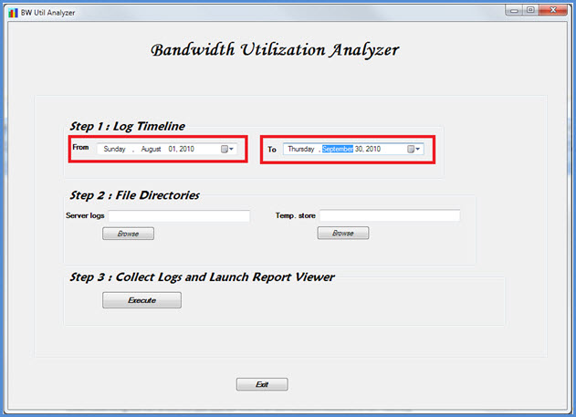

# <a name="skype-for-business-server-2015-resource-kit-tools-documentation"></a>Documentación de las herramientas del kit de recursos de Skype Empresarial Server 2015
 
En este tema se describe las herramientas en el Skype para el Kit de recursos de 2015 de servidor empresarial, incluida la finalidad de cada herramienta y ejemplos de su uso. El Skype para el Kit de recursos de Business Server 2015 ayuda a que las tareas rutinarias sea más fácil para los administradores de TI que implementan y administran Skype para Business Server 2015. Por ejemplo, la herramienta **Web Conf Data** se puede usar para controlar fácilmente los datos que suben los usuarios durante una reunión de Internet. La herramienta **SEFAUtil** se puede usar para delegar el desvío de llamadas y respuesta para los usuarios. Recomendamos a los administradores de TI para usar estas herramientas para administrar de forma más eficaz Skype para Business Server 2015.
  
## <a name="installation-of-the-resource-kit-tools"></a>Instalación de las herramientas del kit de recursos

Para instalar el Skype para el Kit de recursos de Business Server 2015, descargue [OCSReskit.msi](https://www.microsoft.com/en-us/download/details.aspx?id=52631) desde el centro de descarga.
  
Ejecute **OCSResKit.msi** para hacer una instalación sencilla. El archivo .msi instala todas las herramientas en la ruta de acceso siguiente: **%Archivos de programa%\Skype Empresarial Server 2015\ResKit**. Las herramientas que son ejecutables independientes se encuentran en esta carpeta. Las herramientas que tienen archivos auxiliares están en sus propias subcarpetas.
  
## <a name="supported-environments"></a>Entornos compatibles

El Skype para el Kit de recursos de Business Server 2015 debe instalarse en un servidor que cumpla con las especificaciones requeridas por Skype para Business Server 2015, normalmente uno que se usa para ejecutar Skype para Business Server 2015.
  
## <a name="resource-kit-tools-overview"></a>Información general sobre las herramientas del kit de recursos

La siguiente es una lista de las herramientas que se proporcionan en el Skype para el Kit de recursos de Business Server 2015. En las siguientes secciones se incluye una descripción de cada herramienta, además de los requisitos y ejemplos de uso.
  
- [ABSConfig](resource-kit-tools.md#ABSConfig)
    
- [Bandwidth Policy Service Monitor (Monitor del servicio de directiva de ancho de banda)](resource-kit-tools.md#bpsm)
    
- [Bandwidth Utilization Analyzer (Analizador de uso de ancho de banda)](resource-kit-tools.md#bua)
    
- [Call Parkometer (Estacionamiento de llamadas)](resource-kit-tools.md#callpark)
    
- [DBAnalyze](resource-kit-tools.md#dba)
    
- [Import Storage Service Data (Importación de datos del servicio de almacenamiento)](resource-kit-tools.md#Issd)
    
- [LCSSync](resource-kit-tools.md#LCSSync)
    
- [Lookup User Console (Consola de búsqueda de usuario)](resource-kit-tools.md#LUC)
    
- [MsTurnPing](resource-kit-tools.md#MsTurnPing)
    
- [Network Configuration Viewer (Visor de configuración de red)](resource-kit-tools.md#NCV)
    
- [Response Group Agent Live (Información en vivo del agente del grupo de respuesta)](resource-kit-tools.md#RGAL)
    
- [SEFAUtil](resource-kit-tools.md#SEFAUtil)
    
- [SYSPrep.ps1](resource-kit-tools.md#SYSPrep)
    
- [Unassigned Number Announcements Migration (Migración de anuncios de números sin asignar)](resource-kit-tools.md#UNAM)
    
- [Web Conf Data](resource-kit-tools.md#WebConfData)
    
## <a name="absconfig"></a>ABSConfig
<a name="ABSConfig"> </a>

La herramienta de configuración del servicio de libreta de direcciones (ABSConfig) es una herramienta administrativa que ayuda a los administradores a personalizar la configuración del servicio de libreta de direcciones en Skype para Business Server 2015. Esta herramienta también permite Skype para los administradores de Business Server 2015 restaurar la configuración del servicio de libreta de direcciones predeterminada.
  
### <a name="description"></a>Descripción

ABSConfig es una aplicación de interfaz gráfica de usuario que permite a los administradores configurar los atributos de los servicios de dominio de Active Directory que están relacionadas con el servicio de libreta de direcciones.
  
Los escenarios principales para la herramienta son los siguientes:
  
- Para permitir a los administradores asignan los atributos de los servicios de dominio de Active Directory a los atributos de Skype para Business Server 2015.
    
- Permitir a los administradores especificar el atributo de Active Directory Domain Services que se incluirá o excluirá en los archivos del Servicio de libreta de direcciones.
    
- Permitir a los administradores restaurar la configuración predeterminada del Servicio de libreta de direcciones.
    
La herramienta ABSConfig puede iniciarse mediante el archivo ABSConfig.exe. La herramienta se abrirá en la ficha **Configurar atributos** . Esta tabla tiene opciones para asignar los atributos de los servicios de dominio de Active Directory a los campos de atributos de Skype para Business Server 2015 y para especificar los usuarios que desea incluir o excluir en los archivos del servicio de libreta de direcciones basados en filtros de atributo específico. También tiene opciones para personalizar el valor del número de teléfono que se incluirá en el archivo de la libreta de direcciones. La opción **Restaurar valores predeterminados** permite a los administradores restaurar la configuración del Servicio de libreta de direcciones a los valores predeterminados.

> [!NOTE]
> Volver a la asignación de atributos de AD para diferentes nombres de campo de OC funcionará sólo para la descarga de archivos de la libreta de direcciones y no es compatible con consulta Web de libreta de direcciones.
  
### <a name="output"></a>Salida

ABSConfig guarda la configuración del Servicio de libreta de direcciones en la base de datos.
  
```
Path: %ProgramFiles%\Skype for Business Server 2015\Reskit
```

### <a name="purpose"></a>Finalidad

ABSConfig proporciona un modo rápido y fácil para personalizar Skype para el servicio de libreta de direcciones de Business Server 2015.
  
### <a name="requirements"></a>Requisitos

#### <a name="computer"></a>Equipo

ABSConfig se puede ejecutar sólo desde un equipo unido a un dominio que tenga Skype para Business Server 2015 instalado. En el caso de Skype para Business Server 2015, Enterprise Edition, se puede ejecutar esta herramienta en todos los servidores Front-End que tienen el servicio de libreta de direcciones habilitado durante el programa de instalación.
  
#### <a name="network"></a>Red

El equipo debe ser capaz de conectarse al grupo de servidores front-end y a la base de datos back-end.
  
#### <a name="software"></a>Software

Antes de ejecutar la herramienta ABSConfig es necesario instalar los siguientes componentes de software:
  
- Skype Empresarial Server 2015
    
#### <a name="users"></a>Usuarios

Administradores que tengan los permisos necesarios para actualizar el Skype para la implementación empresarial Server 2015.
  
### <a name="examples"></a>Ejemplos

Para iniciar ABSConfig, escriba **ABSConfig.exe** en un símbolo del sistema. A continuación se muestra la interfaz de usuario de la herramienta ABSConfig.
  

  
### <a name="summary"></a>Resumen

La herramienta de ABSConfig proporciona a los administradores una herramienta más rápida y fácil de usar para personalizar Skype para el servicio de libreta de direcciones de Business Server 2015.
  
## <a name="bandwidth-policy-service-monitor"></a>Bandwidth Policy Service Monitor (Monitor del servicio de directiva de ancho de banda)
<a name="bpsm"> </a>

La herramienta Bandwidth Policy Service Monitor permite a los administradores ver una lista de lo siguiente:
  
1. Todos los el Skype configurado para servicios de directiva de ancho de banda de Business Server 2015 (autenticación y núcleo) en la topología
    
2. Las conexiones que realiza cada servicio con otros servicios de directivas de ancho de banda y a los servidores perimetrales.
    
3. Todos los vínculos configurados en el documento de configuración de red y el uso de ancho de banda en tiempo real informado por los servicios de directiva de ancho de banda.
    
### <a name="description"></a>Descripción

La herramienta Bandwidth Policy Service Monitor se implementa como una aplicación basada en GUI. Los administradores pueden ejecutar la herramienta mediante PDPMonUI.exe.
  
Al iniciar la aplicación, esta intenta detectar la lista de servicios de directiva de ancho de banda en la topología. Después de completar la actualización inicial, en el panel de la izquierda de la ventana se muestra una lista de servicios agrupados por los clústeres a los que pertenecen.
  
Cuando los administradores seleccionan un servicio de directiva de ancho de banda concreto, en el panel de la derecha se muestra información sobre dicho servicio. Además, el panel también contiene dos pestañas principales con información.
  
#### <a name="machine-info-tab"></a>Pestaña Información de equipo

La pestaña **Información de equipo** contiene información detallada sobre el servicio de directiva de ancho de banda seleccionado, además de la lista y el estado de todas las conexiones realizadas por dicho servicio de directiva de ancho de banda seleccionado con otros servicios.
  
#### <a name="topology-info-tab"></a>Pestaña Información de topología

En la pestaña **Información de topología** se muestra una lista de todos los vínculos configurados en las opciones de red. Para cada vínculo se muestra la capacidad de ancho de banda de audio y de vídeo. Además, también se muestra el ancho de banda utilizado actualmente, tanto en kbps como en porcentaje de capacidad. La herramienta utiliza códigos de color para resaltar vínculos cuyo uso está próximo al límite de capacidad, lo que permite a los administradores aislarlos rápidamente.
  
> [!NOTE]
>  Si la herramienta Monitor de servicio de directivas de ancho de banda experimenta errores cuando se conecta a cualquiera de los servicios de la directiva de ancho de banda configurados, no se rellena la información de la **Información de equipo** y las fichas de **Información de topología** . Sin embargo, es posible que la herramienta pueda conectarse de forma inicial, pero que posteriormente pierda la conexión al servicio. En estos casos, los administradores podrían ver información desactualizada. En las pestañas hay una marca de tiempo **Última actualización** que permite a los administradores ver cuándo se actualizó por última vez un servicio de directiva de ancho de banda concreto.
  
### <a name="output"></a>Salida

No hay salida de línea de comandos; la salida del programa está contenida en la interfaz gráfica de usuario (GUI) principal.
  
### <a name="purpose"></a>Finalidad

El objetivo de la herramienta Bandwidth Policy Service Monitor es permitir a los administradores ver el estado de los servicios de directiva de ancho de banda definidos en la topología. Además, los administradores pueden ver el uso de ancho de banda en tiempo real de todos los vínculos definidos en el documento de configuración de red.
  
### <a name="requirements"></a>Requisitos

La herramienta Monitor de servicio de directivas de ancho de banda debe ejecutarse en un equipo que forma parte de la Skype de topología de servidores de negocio.
  
### <a name="summary"></a>Resumen

La herramienta Bandwidth Policy Service Monitor puede ser un recurso útil para los administradores, ya que permite inspeccionar el estado de todos los servicios de directiva de ancho de banda en la topología y, lo que es aún más importante, les permite conocer el uso de ancho de banda en tiempo real de los vínculos definidos en las opciones de configuración de red.
  
## <a name="bandwidth-utilization-analyzer"></a>Bandwidth Utilization Analyzer (Analizador de uso de ancho de banda)
<a name="bua"> </a>

Bandwidth Utilization Analyzer es una herramienta que genera informes sobre diferentes vistas de consumo de ancho de banda por los puntos de conexión de comunicaciones unificadas en vínculos WAN de la red empresarial. Estos informes pueden utilizarse para conocer el patrón de consumo de ancho de banda y ayudar a planificar la capacidad de ancho de banda.
  
### <a name="description"></a>Descripción

El analizador de uso de ancho de banda se implementa como una aplicación basada en GUI. Esta herramienta genera informes específicos para el uso de audio en la red y ayuda a planificar la capacidad. Además, también itera en la capacidad de ancho de banda asignada a diferentes vínculos.
  
### <a name="output"></a>Salida

El analizador de uso de ancho de banda proporciona representaciones gráficas de la capacidad de ancho de banda y el consumo de audio para todos los vínculos WAN configurados en el sistema.
  
### <a name="purpose"></a>Finalidad

En cualquier de voz y vídeo implementación, es fundamental para supervisar y comprender la tendencia de uso de ancho de banda del tráfico de medios a través de la red de la empresa. La herramienta Bandwidth Utilization Analyzer permite a los administradores conseguir justo eso. Esta herramienta hace lo siguiente:
  
- Genera informes específicos para el uso de audio en la red
    
- Mejora la eficacia de planificación de capacidad y la iteración en la capacidad de ancho de banda asignada a diferentes vínculos
    
El analizador de uso de ancho de banda puede generar las siguientes representaciones gráficas de capacidad de ancho de banda e informes de uso:
  
- Todos los vínculos WAN en la red empresarial
    
- Filtrados por los vínculos WAN seleccionados
    
- Filtrados por los vínculos WAN que han superado la capacidad de vínculos
    
- Filtrados por los vínculos WAN que no han utilizado toda la capacidad de ancho de banda proporcionada
    
- Filtrados por los vínculos WAN que han alcanzado niveles críticos (un uso de ancho de banda superior al 90 % de capacidad de ancho de banda del vínculo WAN)
    
- Filtrados por tipo de vínculo WAN: vínculos de sitios de red, vínculos interregionales y vínculos dentro de un sitio
    
- Filtrados por región de red
    
#### <a name="applications"></a>Aplicaciones

El analizador de uso de ancho de banda incluye las siguientes dos aplicaciones (herramientas):
  
- **WanLinkLogCollector.exe** esta herramienta permite su usuario introducir la información necesaria.
    
- **BandwidthUtilizationAnalyzer.xlsm** informe de software de hoja de cálculo A Microsoft Excel se inicia automáticamente por WanLinkLogCollector.exe. Esta aplicación permite al usuario aplicar filtros al informe, como se muestra posteriormente en este artículo.
    
#### <a name="phases-of-using-bandwidth-utilization-analyzer"></a>Fases de uso de Bandwidth Utilization Analyzer

Existen dos fases al usar el analizador de uso de ancho de banda:
  
- Recopilar registros, que se realiza automáticamente mediante WanLinkLogCollector.exe
    
- Personalizar informes, que se realiza mediante BandwidthUtilizationAnalyzer.xlsm
    
> [!IMPORTANT]
> No se recomienda que los usuarios finales inicien BandwidthUtilizationAnalyzer.xlsm de forma manual. 
  
#### <a name="starting-bandwidth-utilization-analyzer"></a>Inicio del analizador de uso de ancho de banda

Inicie WanLinkLogCollector.exe en el símbolo del sistema o mediante el Explorador de Windows.
  
 **Uso de WanLinkLogCollector.exe**
  
Hay tres pasos para usar WanLinkLogCollector.exe:
  
1. **Registro de la escala de tiempo** Proporcionar la escala de tiempo que necesita el informe que se generará para
    
2. **Especifique los directorios de archivo** Proporcionar información de ubicación de archivo
    
3. **Recopilar los registros e iniciar el Visor de informes** Ejecute el comando para generar el informe
    
#### <a name="step-1---log-the-timeline"></a>Paso 1: registrar la escala de tiempo

Al registrar la escala de tiempo, el usuario de la herramienta puede especificar lo siguiente como se muestra en la ilustración siguiente.  
  
1. **Fecha de inicio** Se trata de la fecha de inicio de la escala de tiempo que el informe es que se generará para; Por ejemplo, el 1 de agosto de 2010.
    
2. **Fecha de finalización** Se trata de la fecha de finalización de la escala de tiempo que el informe es que se generará para; Por ejemplo, 30 de septiembre de 2010.
    
     
  
#### <a name="step-2---specify-the-file-directories"></a>Paso 2: especificar los directorios de archivos

El usuario puede especificar los directorios de archivos siguientes, como se muestra.
  
- **Ubicación de los archivos de registro de servidor** La ubicación de la carpeta donde se almacenan los registros del servidor de directivas de ancho de banda. Este es normalmente en \<servidor de archivos\>\\< choice de FE\>\AppServerFiles\PDP.
    
- **Ubicación de almacenamiento temporal de archivos** La ubicación del archivo temporal donde se almacenan los archivos intermedios mientras se está generando el informe.
    

  
> [!NOTE]
> Compruebe que el usuario de la herramienta posee acceso a los archivos de los registros del servidor y a la carpeta donde se almacenan los archivos temporales. 
  
#### <a name="step-3---collect-the-logs-and-start-the-report-viewer"></a>Paso 3: recopilar los registros e iniciar el visor de informes

Para recopilar los registros e iniciar el visor de informes, haga clic en **Ejecutar** como se indica a continuación. Este paso recopila todos los datos necesarios.
  

  
Cuando la validación de entrada es correcta, se muestra el mensaje que aparece a continuación.
  

  
Haga clic en **Aceptar**. BandwidthUtilizationAnalyzer.xlsm se iniciará automáticamente. Siga las instrucciones del cuadro de mensaje. Para obtener más información, consulte **Uso de BandwidthUtilizationAnalyzer.xlsm** en la sección siguiente.
  

### <a name="using-bandwidthutilizationanalyzerxlsm"></a>Uso de BandwidthUtilizationAnalyzer.xlsm

1. Cuando BandwidthUtilizationAnalyzer.xlsm se inicie automáticamente, haga clic en **Actualizar** como se muestra a continuación.
    
     
  
2. Al abrir una carpeta de archivos, seleccione consolidated.csv de la ubicación especificada en el cuadro de mensaje, como se muestra a continuación. También se muestra la ubicación como **C:\Temp**.
    
     
  
3. Haga clic en **Importar**.
    
4. Se generará automáticamente la representación gráfica. Está disponible cuando desaparece el puntero que indica un proceso en segundo plano.
    
     
  
#### <a name="applying-filters-to-the-report-view"></a>Aplicar filtros a la vista de informes

Los filtros que se pueden aplicar a la vista de informes son los siguientes:
  

  
1. **Nombre** Filtra por vínculos WAN (el filtro se encuentra en la parte derecha del gráfico). El prefijo indica los siguientes tipos de vínculos; consulte el cuadro vertical (azul):
    
  - **Sitio S** El vínculo WAN de un sitio de red con una región de red
    
  - **ES entre sitios** El vínculo WAN entre dos sitios de red
    
  - **Interregional R** El vínculo WAN entre dos regiones de red
    
2. **Límite superado** Filtra por vínculos WAN cuyo uso de ancho de banda supera la capacidad de ancho de banda
    
3. **Niveles críticos** Filtra por vínculos WAN cuyo uso de ancho de banda ha alcanzado el 90 % o más de la capacidad de ancho de banda
    
4. **Infrautilizados** Filtra por vínculos WAN cuyo uso de ancho de banda ha sido inferior al 25 % de la capacidad de ancho de banda
    
5. **Tipo de vínculo** Filtra por los siguientes tipos de vínculos WAN:
    
  - 
            Tipo **sitio de red**
    
  - 
            Tipo **entre sitios**
    
  - 
            Tipo **vínculo entre regiones**
    
6. **Región** Filtra por región de red
    
En las ilustraciones siguientes se muestran los filtros descritos anteriormente.
  
Filtrar por **Nombre**. Seleccione la lista de vínculos que han de mostrarse en el gráfico.
  

  
Filtrar por **Límite superado**. Seleccione **True** para aplicar el filtro.
  

  
Filtrar por **Niveles críticos**. Seleccione **True** para aplicar el filtro.
  

  
Filtrar por **Infrautilizado**. Seleccione **True** para aplicar el filtro.
  

  
Filtrar por **Tipo de vínculo**. Seleccione el tipo o tipos que desee mostrar.
  

  
Filtrar por **Región**. Seleccione una lista de regiones cuyos vínculos desee mostrar.
  

  
### <a name="requirements"></a>Requisitos

- .NET Framework 3.5
    
- Microsoft Excel 2010 o Excel 2007
    
### <a name="summary"></a>Resumen

El analizador de uso de ancho de banda se utiliza para representar el uso de ancho de banda de audio para el tráfico de comunicaciones unificadas en la red. Esta herramienta también se puede utilizar para informar sobre el uso de ancho de banda de vídeo en la red.
  
## <a name="call-parkometer"></a>Call Parkometer (Estacionamiento de llamadas)
<a name="callpark"> </a>

Call Parkometer es una aplicación de línea de comandos que proporciona acceso rápido a la base de datos de órbitas de estacionamiento de llamadas.
  
### <a name="description"></a>Descripción

Call Parkometer es una herramienta que se utiliza para realizar un seguimiento de las llamadas estacionadas actualmente. También recopila estadísticas sobre el uso de órbitas y el servidor de estacionamiento de llamadas (CPS). Esta herramienta de línea de comandos proporciona acceso de lectura y escritura a la base de datos de SQL Server de órbita CPS desde un equipo local o conectado de forma remota.
  
Todas las opciones se excluyen mutuamente. La sintaxis de línea de comandos es la siguiente:
  
- parámetro **-o** : listas de todos los intervalos configurados para este grupo de servidores de Órbitas.
    
- parámetro **-n** : listas usadas actualmente todas las órbitas de este grupo. La información que se muestra es la siguiente:
    
  - Identificador uniforme de recursos (URI) de SIP del estacionado y el estacionador.
    
  - Nombre de host del CPS donde se ha estacionado la llamada.
    
  - Marca de tiempo correspondiente al momento en que se estacionó la llamada.
    
- parámetro **-f** : muestra el número de Órbitas libres actualmente en el grupo de servidores.
    
- **-r \<n\> ** parámetro: se enumeran los \<n\> por última vez estacionar llamadas. La información mostrada es la siguiente:
    
  - URI de SIP del estacionado.
    
  - URI de SIP del estacionador.
    
  - Nombre de host del CPS donde se estacionó la llamada.
    
  - Marca de tiempo correspondiente al momento en que se recuperó o finalizó la llamada.
    
- **-t\<n\> ** parámetro - comprueba la reserva de una órbita en la base de datos para mostrar la selección aleatoria de los números de órbita asignado.
    
### <a name="output"></a>Salida

Según los parámetros de entrada especificados en el símbolo del sistema, Call Parkometer muestra la salida siguiente:
  
- Todos los intervalos de órbitas configurados para este grupo de servidores
    
- Llamadas estacionadas actualmente
    
- Número de órbitas libres (disponibles)
    
- Llamadas estacionadas recientemente
    
- Órbitas reservadas para comprobar valores de órbitas uniformes y aleatorias
    
### <a name="purpose"></a>Finalidad

El objetivo de la herramienta CPS es proporcionar acceso mediante línea de comandos a la base de datos de CPS. El administrador puede ver el uso de CPS y determinar el número de órbitas asignadas a un grupo de servidores.
  
### <a name="requirements"></a>Requisitos

No existen requisitos si esta herramienta se ejecuta en el mismo equipo que ejecuta CPS. Si esta herramienta se ejecuta en un equipo remoto, la base de datos de SQL Server usado por Skype para Business Server 2015 debe configurarse para permitir el acceso remoto. Parkometer de llamada debe configurarse con una cadena de conexión de base de datos de SQL Server para conectarse a SQL Server del grupo de servidores. Esta cadena de conexión de base de datos de SQL Server se define en el archivo de configuración, **parkometer.exe.config**. Se debe colocar en el mismo directorio donde se encuentra parkometer.exe. El siguiente archivo XML es un ejemplo de un parkometer.exe.config. Los parámetros que deben configurarse son nombre de usuario (por ejemplo, mydomain\Administrator), la contraseña (por ejemplo, micontraseña) y el nombre de host (por ejemplo, miservidor).
  
```
<?xml version="1.0" encoding="utf-8" ?>
<configuration>
  <appSettings>
   <add key="SQL" value="server=myserver\RTC;
database=cpsdyn;
User Id=mydomain\Administrator;
Password=mypassword.;
Integrated Security=false;"/>
  </appSettings>
</configuration>
```

### <a name="examples"></a>Ejemplos

Intervalos de órbitas de implementada: el parámetro -o enumera todos los intervalos de órbita que están configurados para este grupo de servidores tal como se muestra
  

  
Actualmente estacionar llamadas: el parámetro - n enumera todas las órbitas actualmente usados en este grupo de servidores tal como se muestra
  

  
Número de Órbitas gratuitas: el parámetro -f muestra el número de Órbitas libres actualmente en el grupo de servidores tal como se muestra
  

  
Recientemente estacionar llamadas: - r \<n\> listas de parámetros de la \<n\> por última vez estacionar llamadas tal como se muestra
  

  
Reserva de órbita de prueba: -t \<n\> parámetro comprueba reservar una órbita en la base de datos, tal como se muestra
  

  
### <a name="summary"></a>Resumen

Call Parkometer es una herramienta de línea de comandos que proporciona información detallada sobre el servidor de estacionamiento de llamadas.
  
## <a name="dbanalyze"></a>DBAnalyze
<a name="dba"> </a>

### <a name="description"></a>Descripción

DBAnalyze es una herramienta de línea de comandos que ayuda a los administradores para recopilar informes de análisis sobre el Skype para bases de datos de negocio Server 2015. DBAnalyze tiene los modos siguientes: diagnóstico, datos de usuario, conferencia, MCU y fragmentación de disco:
  
- **Modo de diagnóstico** Crea un informe que incluye información acerca de las tablas (número de registros, la fragmentación, tamaño de los datos y el tamaño de índice), los tamaños de archivo de registro y datos, la última vez que realizar copias de seguridad, distribución de contactos entre los servidores que ejecutan Microsoft Office Communications Server, el número medio de permisos, contactos, contenedores, suscripciones, publicaciones, extremos por usuario, los usuarios ubicados incorrectamente, los usuarios que no se pueden enrutar, el número promedio de las conferencias organizadas por el usuario, las conferencias programadas, conferencias activas, y la versión de la base de datos.
    
    > [!NOTE]
    > La ejecución en modo de diagnóstico puede afectar al rendimiento del servidor. 
  
- **Modo de datos de usuario** Contacto de informes, contenedor, suscripción, publicación, permisos y datos del grupo de contactos para un usuario especificado o para los usuarios que tienen que el usuario en sus listas de contactos y permisos. Este modo también proporciona datos de resumen para conferencias que un usuario organice o a las que esté invitado.
    
- **Modo de conferencia** Datos detallados de informes para una conferencia específico, incluidos todos los detalles de programación de tiempo para la conferencia, la lista de invitado, la lista de tipos de medios permiten para la conferencia, active MCU (unidades de control multipunto), la lista de participantes activada y cada uno estado de señalización del participante.
    
- **Descodificar el identificador de la reunión** Descodifica una red telefónica conmutada (RTC) identificador que es especificado por el modificador **/pstnid** pero no se conecta a back-end para obtener información detallada de la reunión.
    
- **Resolver conferencia** Descodifica un identificador de la reunión de RTC que es especificado por el modificador **/pstnid** y muestra información sobre la conferencia indicada por el identificador.
    
- **Modo de MCU** Informes del identificador, tipo de medio, dirección URL, estado del latido, carga de conferencia y carga participante para cada MCU en el grupo de servidores.
    
- **Modo de la fragmentación de disco** Muestra el estado de la fragmentación de todos los discos.
    
Esta herramienta puede utilizarse para diagnosticar diferentes problemas o para ayudar a los administradores con la planificación de capacidad. Por ejemplo, si la mayoría de los usuarios alojados en el servidor A eligen a usuarios alojados en el servidor B como sus contactos, el administrador puede mover los usuarios del servidor A al servidor B para reducir el tráfico entre servidores.
  
### <a name="output"></a>Salida

Esta herramienta genera informes predefinidos sobre el Skype para la base de datos de negocio Server 2015. **Ruta de acceso**: %Archivos de programa%\Skype Empresarial Server 2015\Reskit
  
### <a name="purpose"></a>Finalidad

Para instalar Dbanalyze.exe, copie el archivo en una carpeta local y, a continuación, ejecute la herramienta. Para usar la herramienta, ejecute el comando siguiente desde la línea de comandos. `dbanalyze.exe [/v] [/report:value] [/sqlserver:value] [/user:user@domain.com] [/conf:value][/pstnid:Value] [/maxcontacts:value]`A continuación se muestran las descripciones de las opciones de línea de comandos.
  

  
### <a name="requirements"></a>Requisitos

 **Equipo** DBAnalyze se puede ejecutar sólo desde un equipo unido a un dominio que tenga Skype para Business Server 2015 instalado.
  
 **Red** El equipo debe ser capaz de conectarse a la base de datos back-end.
  
 **Software** Skype para los componentes de software empresarial Server 2015 debe instalarse antes de ejecutar DBAnalyze.
  
 **Usuarios** En la tabla siguiente muestra a los administradores que tienen los permisos necesarios para obtener acceso a Skype para bases de datos de negocio Server 2015.
  

  
> [!NOTE]
> Para el modo **/report:disk** se necesita una cuenta de administrador local.
  
### <a name="examples"></a>Ejemplos

A continuación se muestran varios ejemplos de comandos de Dbanalyze.exe válidos:
  
```
dbanalyze.exe /report:diag
dbanalyze.exe /report:user /user:usera@domainb.com
dbanalyze.exe /report:conf /user:bob@example.com /conf:1W9J71SKSX2X
dbanalyze.exe /report:resolve /pstnid:12345
dbanalyze.exe /report:mcus
dbanalyze.exe /report:disk
```

### <a name="summary"></a>Resumen

DBAnalyzer proporciona a los administradores un rápido y fácil de analizar Skype para bases de datos de negocio Server 2015.
  
## <a name="import-storage-service-data"></a>Import Storage Service Data (Importación de datos del servicio de almacenamiento)
<a name="Issd"> </a>

La herramienta de kit de recursos ImportStorageServiceData permite reimportar datos de colas y puntos de conexión que hayan sido vaciados del servicio de almacenamiento (LYSS) de nuevo en el servicio de almacenamiento.
  
### <a name="description"></a>Descripción

Los datos del servicio de almacenamiento pueden haber sido vaciados de forma automática (periódica) según el estado del elemento de cola o el tamaño de la base de datos. Puede haber ocurrido debido a la invocación manual del cmdlet de la conmutación por error del grupo de servidores o por el cmdlet StorageServiceFullFlush (invocado por el cmdlet de conmutación por error del grupo de servidores). Tenga en cuenta que datos lo ideal sería que no deben volver a importarse si cualquiera del tamaño de la base de datos de servicio de almacenamiento de información (LYSS) en los servidores front-end está por encima del nivel normal, porque si lo hace, es probable que acaba harán más datos que se exportan revertir. Además, los problemas que podrían han contribuido a errores que ha provocado la cola de servicio de almacenamiento de información aumentar su tamaño en primer lugar se deben resolver (para errores de extremo de Exchange de ejemplo, problemas de red u otros problemas).
  
 **Escenario 1:** durante la conmutación por error del grupo de servidores, los archivos pueden vaciarse del servicio de almacenamiento para cada front-end. Después de completar la conmutación por error, debe ejecutarse la herramienta para volver a importar los datos.
  
 **Escenario 2:** los datos se vacían automáticamente todos los días o cuando el tamaño de la base de datos del servicio de almacenamiento supera determinados umbrales (por ejemplo, 60 %, 80 %, 90 %). El administrador debe volver a importar de forma periódica los datos que hayan sido vaciados de forma automática. En la situación anterior, si no se ha implementado el paquete SCOM de supervisión, hay eventos de Skype para servicio de almacenamiento de información de servidor empresarial relacionada con los datos que se desea vaciar desde el servicio de almacenamiento. Los id. de evento son 32075 (se ha iniciado una operación de vaciado completo), 32076 (se ha completado el vaciado completo), 32082 (se ha iniciado el vaciado de nivel de mantenimiento), 32083 (se ha completado el vaciado de nivel de mantenimiento) y 32089 (se ha producido un vaciado porque se ha llenado la base de datos). Estos identificadores de evento se corresponden con la versión RTM. Cuando un administrador ve estos eventos, significa que no hay archivos que se han volcado out. Estos datos deben importarse rutinariamente mediante esta herramienta, por ejemplo una vez por semana.
  
Para la versión de servicio en línea, si se implementa el paquete SCOM de Skype para Business Server de supervisión de estado, hay nuevas alertas que es posible que se ha generado que pida al administrador que vuelva a importar los datos incluidos en el servicio de almacenamiento de información. Existirá un evento correspondiente en el registro de eventos del servidor front-end que haya activado la alerta. El evento ofrecerá una descripción de la ruta de acceso principal donde se encuentran los archivos de los datos vaciados, así como el número de archivos que cumplen con los criterios de alerta. Los criterios de alerta es que haya X o más archivos en la ruta de acceso primaria con un mínimo de Y días (donde X e Y están predefinidos en el servicio de almacenamiento, pero pueden reemplazarse si se cambia el archivo APPCONFIG). A continuación se muestran dos ejemplos de eventos que pueden activar la alerta de estado, cuya diferencia es la ruta de acceso primaria. Una posibilidad se encuentra en el recurso compartido de archivos del servicio web, mientras que la otra es el directorio de datos de aplicación local de cada front-end (por ejemplo, c:\ProgramData\Microsoft\Skype Empresarial Server 2015\StorageService ). A continuación, el administrador ejecutará esta herramienta de kit de recursos.
  
Esta herramienta aumentará la carga de CPU y de E/S en el front-end donde se ejecute, así como en otros front-end, si los datos no son propiedad del front-end donde se ejecuta la herramienta. Se recomienda ejecutar esta herramienta cuando los front-end no estén sometidos a cargas elevadas de CPU y de E/S (por ejemplo, en horas de poca actividad). En segundo lugar, esta herramienta puede tardar entre 2 y 3 minutos para importar un archivo de datos. Esto debe tenerse en cuenta al calcular el tiempo de ejecución de la aplicación. El archivo de registro detallado generado por la herramienta aparecerá de forma predeterminada en el almacén de archivos. Elimínelo si no se detectan errores, ya que el tamaño del archivo de registro puede ser de varias decenas de MB o más.
  

  
### <a name="requirements"></a>Requisitos

Instale el Skype para herramientas del Kit de recursos de Business Server 2015. La herramienta se ejecuta en equipos unidos a un dominio que tenga instalado Skype para Business Server y Skype para Shell de administración de servidor empresarial. La herramienta utiliza un cmdlet desde el shell de administración para identificar todos los servidores Front-End del grupo de servidores. En segundo lugar, se debe ejecutar la herramienta desde un equipo en el grupo de servidores que tiene instalada la base de datos **RtcLocal** . Esta base de datos se usa en la herramienta para recuperar la ubicación del servicio Web recurso compartido de archivos para el grupo de servidores. Además, antes de usar la herramienta, cada servidor Front-End en primer lugar debe habilitar mediante **Enable-PSRemoting** en cada servidor Front-End, así como el equipo que se ejecuta la herramienta de comunicación remota de PowerShell de Windows. De lo contrario, se producirá un error en los comandos de Windows PowerShell remotos de esta herramienta. Comunicación remota de Windows PowerShell se puede desactivar en todos los servidores Front-End del grupo de servidores después de que finalice. Por último, la cuenta o credenciales invocar la herramienta deben tener permiso de lectura y escritura para el recurso compartido de archivos webservice para el grupo de servidores se ejecutan en esta herramienta. En caso contrario, se producirá un error de la herramienta con errores de permiso de entrada y salida.
  
> [!NOTE]
> En Windows Server 2012, la comunicación remota de Windows PowerShell está habilitado de forma predeterminada, pero no en el sistema operativo Windows Server 2008. 
  
### <a name="examples"></a>Ejemplos

```
>  C:\StorageService>ImportStorageServiceData.exe
Description:
This tool will re-import Storage Service (LYSS) flushed queue data back in.  For a pool: you are required to run this tool on a machine inside the pool which has the Lync Server Management Shell installed.  Additionally, all front end machines need to have Windows Powershell Remoting enabled before executing this tool by executing Enable-PSRemoting.  Also, please ensure that all Storage Service instance DB Size are at the 'Normal' level (verify this by viewing Eventlog events). Otherwise re-importing may cause data to be flushed out again if any Storage Service instance DB size level goes above 'Normal'.
Usage: Default behavior is to Import data from web service file share as well as any files on all Front End machines in pool.
Additional Options:
-Verbose                    : Turn verbose output on.

-StorageServiceHostName     : Host Name of Storage Service WCF endpoint.  ( Default=localhost netnamedpipe binding. )
                                    
-FileSharePath              : Import only all data from just under the UNC path specified.

ActivityID: cc3b62ff-bb66-4e61-a6e2-96cb3626315c. <-- Use this to correlate with StorageService trace logs if troubleshooting.
Type Server name (TCP binding) or press <enter> for localhost (NamePipe binding):
Using NetNamedPipeBinding...
OnTopologyChanged Event received
Web Service File Share: \\dc.vdomain.com\OcsFileStore\co1-WebServices-1\StorageService

Front Ends:
server.vdomain.com
server2.vdomain.com
server1.vdomain.com
server3.vdomain.com
Looking under directory: \\dc.vdomain.com\OcsFileStore\co1-WebServices-1\StorageService for exported data.
# Files found: 8
Starting Import for file:\\dc.vdomain.com\OcsFileStore\co1-WebServices-1\StorageService\DataExport\2
0120910\SERVER.vdomain.com\944f5724c65c5f93900dc1c8c898b102__0.xml
Items deserialized: 20

All items in file were enqueued successfully, will try to delete file: \\dc.vdomain.com\OcsFileStore\co1-WebServices-1\StorageService\DataExport\20120910\SERVER.vdomain.com\944f5724c65c5f93900dc1c8c898b102__0.xml

All items in file failed to enqueue so file will not be deleted.  File path: \\dc.vdomain.com\OcsFileStore\co1-WebServices-1\StorageService\DataExport\20120910\SERVER.vdomain.com\944f5724c65c5f93900dc1c8c898b102__0.xml

Summary for file \\dc.vdomain.com\OcsFileStore\co1-WebServices-1\StorageService\DataExport\20120910\SERVER.vdomain.com\944f5724c65c5f93900dc1c8c898b102__0.xml: succeeded: 20, failed: 0

Starting Import for file:\\dc.vdomain.com\OcsFileStore\co1-WebServices-1\StorageService\DataExport\20120910\SERVER1.vdomain.com\17d5435ae40259f7bbdf1866776386e4__0.xml
Items deserialized: 20

[cc3b62ff-bb66-4e61-a6e2-96cb3626315c] Send EnqueueMessages to redirected, targetServer=server1.vdomain.com, queueItems=20

All items in file were enqueued successfully, will try to delete file: \\dc.vdomain.com\OcsFileStore\co1-WebServices-1\StorageService\DataExport\20120910\SERVER1.vdomain.com\17d5435ae40259f7bbdf1866776386e4__0.xml

All items in file failed to enqueue so file will not be deleted.  File path: \\dc.vdomain.com\OcsFileStore\co1-WebServices-1\StorageService\DataExport\20120910\SERVER1.vdomain.com\17d5435ae40259f7bbdf1866776386e4__0.xml

Summary for file \\dc.vdomain.com\OcsFileStore\co1-WebServices-1\StorageService\DataExport\20120910\
SERVER1.vdomain.com\17d5435ae40259f7bbdf1866776386e4__0.xml: succeeded: 20, failed: 0

Starting Import for file:\\dc.vdomain.com\OcsFileStore\co1-WebServices-1\StorageService\DataExport\20120910\SERVER1.vdomain.com\904f6c9b8ac951ae8b3c86684d3832e4__0.xml

Items deserialized: 20
[cc3b62ff-bb66-4e61-a6e2-96cb3626315c] Send EnqueueMessages to redirected, targetServer=server1.vdomain.com, queueItems=20

All items in file were enqueued successfully, will try to delete file: \\dc.vdomain.com\OcsFileStore
\co1-WebServices-1\StorageService\DataExport\20120910\SERVER1.vdomain.com\904f6c9b8ac951ae8b3c86684d
3832e4__0.xml

All items in file failed to enqueue so file will not be deleted.  File path: \\dc.vdomain.com\OcsFil
eStore\co1-WebServices-1\StorageService\DataExport\20120910\SERVER1.vdomain.com\904f6c9b8ac951ae8b3c
86684d3832e4__0.xml

Summary for file \\dc.vdomain.com\OcsFileStore\co1-WebServices-1\StorageService\DataExport\20120910\
SERVER1.vdomain.com\904f6c9b8ac951ae8b3c86684d3832e4__0.xml: succeeded: 20, failed: 0

Starting Import for file:\\dc.vdomain.com\OcsFileStore\co1-WebServices-1\StorageService\DataExport\2
0120910\SERVER2.vdomain.com\69844a271e6c5633a1f2b46a42287dd6__0.xml

Items deserialized: 20

[cc3b62ff-bb66-4e61-a6e2-96cb3626315c] Send EnqueueMessages to redirected, targetServer=server2.vdom
ain.com, queueItems=20

All items in file were enqueued successfully, will try to delete file: \\dc.vdomain.com\OcsFileStore
\co1-WebServices-1\StorageService\DataExport\20120910\SERVER2.vdomain.com\69844a271e6c5633a1f2b46a42
287dd6__0.xml

All items in file failed to enqueue so file will not be deleted.  File path: \\dc.vdomain.com\OcsFil
eStore\co1-WebServices-1\StorageService\DataExport\20120910\SERVER2.vdomain.com\69844a271e6c5633a1f2
b46a42287dd6__0.xml

Summary for file \\dc.vdomain.com\OcsFileStore\co1-WebServices-1\StorageService\DataExport\20120910\
SERVER2.vdomain.com\69844a271e6c5633a1f2b46a42287dd6__0.xml: succeeded: 20, failed: 0

Starting Import for file:\\dc.vdomain.com\OcsFileStore\co1-WebServices-1\StorageService\DataExport\2
0120910\SERVER3.vdomain.com\3313935458e35b9b9759e08a15d251e6__0.xml

Items deserialized: 20

[cc3b62ff-bb66-4e61-a6e2-96cb3626315c] Send EnqueueMessages to redirected, targetServer=server3.vdom
ain.com, queueItems=1

All items in file were enqueued successfully, will try to delete file: \\dc.vdomain.com\OcsFileStore
\co1-WebServices-1\StorageService\DataExport\20120910\SERVER3.vdomain.com\3313935458e35b9b9759e08a15
d251e6__0.xml

All items in file failed to enqueue so file will not be deleted.  File path: \\dc.vdomain.com\OcsFil
eStore\co1-WebServices-1\StorageService\DataExport\20120910\SERVER3.vdomain.com\3313935458e35b9b9759
e08a15d251e6__0.xml

Summary for file \\dc.vdomain.com\OcsFileStore\co1-WebServices-1\StorageService\DataExport\20120910\
SERVER3.vdomain.com\3313935458e35b9b9759e08a15d251e6__0.xml: succeeded: 20, failed: 0

Starting Import for file:\\dc.vdomain.com\OcsFileStore\co1-WebServices-1\StorageService\DataExport\2
0120910\SERVER3.vdomain.com\4501e04eae4856059346949ff817c220__0.xml
Items deserialized: 20
[cc3b62ff-bb66-4e61-a6e2-96cb3626315c] Send EnqueueMessages to redirected, targetServer=server3.vdom
ain.com, queueItems=1
All items in file were enqueued successfully, will try to delete file: \\dc.vdomain.com\OcsFileStore
\co1-WebServices-1\StorageService\DataExport\20120910\SERVER3.vdomain.com\4501e04eae4856059346949ff8
17c220__0.xml
All items in file failed to enqueue so file will not be deleted.  File path: \\dc.vdomain.com\OcsFil
eStore\co1-WebServices-1\StorageService\DataExport\20120910\SERVER3.vdomain.com\4501e04eae4856059346
949ff817c220__0.xml

Summary for file \\dc.vdomain.com\OcsFileStore\co1-WebServices-1\StorageService\DataExport\20120910\
SERVER3.vdomain.com\4501e04eae4856059346949ff817c220__0.xml: succeeded: 20, failed: 0
Starting Import for file:\\dc.vdomain.com\OcsFileStore\co1-WebServices-1\StorageService\DataExport\2
0120910\SERVER3.vdomain.com\5ad77443ad955a22a876749be66d5317__0.xml

Items deserialized: 20
[cc3b62ff-bb66-4e61-a6e2-96cb3626315c] Send EnqueueMessages to redirected, targetServer=server3.vdom
ain.com, queueItems=20
All items in file were enqueued successfully, will try to delete file: \\dc.vdomain.com\OcsFileStore
\co1-WebServices-1\StorageService\DataExport\20120910\SERVER3.vdomain.com\5ad77443ad955a22a876749be6
6d5317__0.xml
All items in file failed to enqueue so file will not be deleted.  File path: \\dc.vdomain.com\OcsFil
eStore\co1-WebServices-1\StorageService\DataExport\20120910\SERVER3.vdomain.com\5ad77443ad955a22a876
749be66d5317__0.xml
Summary for file \\dc.vdomain.com\OcsFileStore\co1-WebServices-1\StorageService\DataExport\20120910\
SERVER3.vdomain.com\5ad77443ad955a22a876749be66d5317__0.xml: succeeded: 20, failed: 0
Starting Import for file:\\dc.vdomain.com\OcsFileStore\co1-WebServices-1\StorageService\DataExport\2
0120910\SERVER3.vdomain.com\a11e27ae439a582288d4657eda86b565__0.xml
Items deserialized: 20
[cc3b62ff-bb66-4e61-a6e2-96cb3626315c] Send EnqueueMessages to redirected, targetServer=server3.vdom
ain.com, queueItems=20
All items in file were enqueued successfully, will try to delete file: \\dc.vdomain.com\OcsFileStore
\co1-WebServices-1\StorageService\DataExport\20120910\SERVER3.vdomain.com\a11e27ae439a582288d4657eda
86b565__0.xml
All items in file failed to enqueue so file will not be deleted.  File path: \\dc.vdomain.com\OcsFil
eStore\co1-WebServices-1\StorageService\DataExport\20120910\SERVER3.vdomain.com\a11e27ae439a582288d4
657eda86b565__0.xml
Summary for file \\dc.vdomain.com\OcsFileStore\co1-WebServices-1\StorageService\DataExport\20120910\
SERVER3.vdomain.com\a11e27ae439a582288d4657eda86b565__0.xml: succeeded: 20, failed: 0
All files have been imported into Storage Service for path: \\dc.vdomain.com\OcsFileStore\co1-WebSer
vices-1\StorageService
Importing files for: server.vdomain.com
No files founds.
Importing files for: server2.vdomain.com
No files founds.
Importing files for: server1.vdomain.com
No files founds.
Importing files for: server3.vdomain.com
No files founds.
Writing log: \\dc.vdomain.com\OcsFileStore\co1-WebServices-1\StorageService\ImportStorageServiceData
Log20120910_1609SS
Tool has finished execution.
>  C:\StorageService>
```

## <a name="lcssync"></a>LCSSync
<a name="LCSSync"> </a>

La herramienta LCSSync ayuda a implementar Skype para el software de comunicaciones empresariales Server 2015 en un entorno de varios bosque. Esta herramienta se utiliza para sincronizar los usuarios y grupos de bosques de usuario diferente como un los servicios de dominio de Active Directory, póngase en contacto con el objeto a un bosque central donde está instalado Skype para Business Server 2015.
  
### <a name="description"></a>Descripción

 LCSSync usa los servicios de dominio de Active Directory sincronizada póngase en contacto con objetos en el bosque central para habilitar a usuarios de Skype para Business Server. Para proporcionar un inicio de sesión único, la cuenta de usuario principal debe ser asignada para el objeto de contacto de los servicios de dominio de Active Directory en el bosque central para Skype para Business Server 2015. Esta herramienta ayuda a realizar esa asignación. Esta herramienta proporciona plantillas para crear agentes de administración de Microsoft Identity Integration Server.
  
### <a name="summary"></a>Resumen

La herramienta LCSSync ayuda a implementar Skype para Business Server 2015 en un entorno de varios bosque.
  
## <a name="lookup-user-console"></a>Lookup User Console (Consola de búsqueda de usuario)
<a name="LUC"> </a>

La herramienta LookupUserConsole muestra interno Skype para obtener información de enrutamiento de Business Server acerca de los usuarios específicos. Esta información puede ser útil para que el personal de soporte de Microsoft pueda diagnosticar problemas de implementación y enrutamiento.
  
### <a name="description"></a>Descripción

 Ejecución de LookupUserConsole.exe se abrirá un símbolo del sistema que acepta direcciones SIP e intenta mostrar interno Skype para obtener información de enrutamiento de Business Server relacionados con ellos. Escriba **exit** para salir de la herramienta LookupUserConsole.
  
### <a name="requirements"></a>Requisitos

Instale el Skype para el Kit de recursos de Business Server 2015. La herramienta se ejecuta en equipos unidos a un dominio donde está instalado Skype para Business Server.
  
### <a name="examples"></a>Ejemplos

C:\Program Files\Skype for Business Server 2015\ResKit\>LookupUserConsole.exe
  
```
> sip:john.doe@vdomain.com

  Execution time (ms):                            171.094
  Exeuction result:                               Success
  SIP URI:                                        sip:john.doe@vdomain.com
  User info:
    SID:                                          S-1-5-21-2831376166-29632525...    Display name:                                     John Doe
    Grouping ID:                                  00000000-0000-0000-0000-...
    Line URI:                                     <null>
    Policy assignment:                            TenantId={00000000--0000-000....
    SIP enabled:                                  True
    UC enabled:                                   False
    Tenant ID:                                    00000000-0000-0000-0000-...  Cluster info:
    Active cluster:                               pool0.vdomain.com
    Backup registrar cluster:                     <null>
    Deployment location:                          <null>
    Home Front-End FQDN:                          SERVER.vdomain.com
    Primary Registrar cluster:                    pool0.vdomain.com
    Remote Director external SIP FQDN:            <null>
    Remote Director internal SIP FQDN:            <null>
    Remote Director Web FQDN:                     <null>
    Routing group ID:                             4501e04e-ae48-5605-9346...
    Service tag ID:                               1266953005
    User Front-End resolved:                      True
    User in local forest:                         True
    User in remote forest:                        False
    User in split domain:                         False
    User-Services cluster:                        pool0.vdomain.com

> sip:nouser@vdomain.com

  Execution time (ms):                            948.7574
  Exeuction result:                               UserDoesNotExist

> exit
```

## <a name="msturnping"></a>MsTurnPing
<a name="MsTurnPing"> </a>

La herramienta de MSTurnPing permite a un administrador de Skype para el software de comunicaciones empresariales Server 2015 para comprobar el estado de los servidores que ejecutan los Servicios perimetrales de Audio y vídeo y autenticación de Audio y vídeo, así como los servidores que ejecutan la directiva de ancho de banda Servicios en la topología.
  
### <a name="description"></a>Descripción

La herramienta de MSTurnPing permite a un administrador de Skype para el software de comunicaciones empresariales Server 2015 para comprobar el estado de los servidores que ejecutan los Servicios perimetrales de Audio y vídeo y autenticación de Audio y vídeo, así como los servidores que ejecutan la directiva de ancho de banda Servicios en la topología.
  
La herramienta permite a los administradores realizar las pruebas siguientes:
  
1. Prueba de servidor perimetral de A/V: la herramienta realiza las siguientes pruebas contra todos los servidores perimetrales de A/V en la topología:
    
  - Comprobar que el Skype para servicio de autenticación de Audio y vídeo de servidor empresarial se inicia y puede emitir las credenciales adecuadas.
    
  - Comprobar que el Skype para servicio de negocio servidor perimetral de Audio y vídeo se inicia y puede asignar los recursos en el perímetro externo correctamente.
    
2. Prueba del servicio de directiva de ancho de banda: la herramienta realiza las pruebas siguientes contra todos los servidores que ejecutan los servicios de directiva de ancho de banda en la topología:
    
  - Comprobar que el Skype para el servicio de directiva de ancho de banda de Business Server (autenticación) se inicia y puede emitir las credenciales adecuadas.
    
  - Comprobar que el Skype para servicio de directiva de ancho de banda del servidor empresarial (núcleo) se inicia y puede realizar correctamente la comprobación de ancho de banda.
    
Esta herramienta debe ejecutarse en un equipo que forme parte de la topología y que tenga instalado el almacén local.  
  
### <a name="output"></a>Salida

La herramienta genera los resultados de todas las operaciones.
  
- Si se ejecuta la prueba **AudioVideoEdgeServer**, los resultados de la herramienta son los siguientes:
    
  - Los resultados de pruebas de los equipos que proporcionan la Skype para servicio de autenticación de servidor 2015 Audio y vídeo de negocio en la topología
    
  - Los resultados de pruebas de los equipos que proporcionan la Skype para el servicio perimetral de servidor 2015 Audio y vídeo de negocio en la topología
    
- Si se ejecuta la prueba **BandwidthPolicyServer**, los resultados de la herramienta son los siguientes:
    
  - Los resultados de pruebas de los equipos que proporcionan la Skype para Business Server 2015 ancho de banda de directiva de autenticación de servicio () en la topología
    
  - Los resultados de pruebas de los equipos que proporcionan la Skype para Business Server 2015 ancho de banda de directiva de servicio (núcleo) en la topología
    
### <a name="requirements"></a>Requisitos

- Esta herramienta debe ejecutarse en un equipo que se encuentre en la topología y que tenga el almacén local.
    
- La herramienta debe ejecutarse como un administrador con acceso al almacén local.
    
### <a name="examples"></a>Ejemplos

A continuación se muestra un ejemplo de la entrada de la herramienta.
  
```
MsTurnPing -ServerRole AudioVideoEdgeServer

MsTurnPing -ServerRole BandwidthPolicyServer
```

### <a name="summary"></a>Resumen

Esta herramienta puede ser un recurso valioso Skype para administradores de Business Server 2015 que desea comprobar el estado de los servidores que ejecutan audio y vídeo y servicios de la directiva de ancho de banda.
  
## <a name="network-configuration-viewer"></a>Network Configuration Viewer (Visor de configuración de red
<a name="NCV"> </a>

Visor de configuración de red se puede usar por Skype para los administradores de software de comunicaciones de Business Server 2015 para ver topología de red admisión de llamadas (CAC) del control para una empresa que está configurada para permitir que las sesiones de comunicación en tiempo real, como voz o las llamadas de vídeo en función de la capacidad de ancho de banda especificado. Skype para los administradores de Business Server 2015 definir las directivas del CAC, que se aplican por los servicios de la directiva de ancho de banda que se instalan con Skype para Business Server 2015.
  
### <a name="description"></a>Descripción

El visor de configuración de red (NetworkConfigurationViewer.exe) permite a los administradores realizar las tareas siguientes:
  
- Cargar y ver la topología de red de CAC desde un Skype para la implementación empresarial Server 2015 en un formato gráfico.
    
- Cargar y ver la topología de red de CAC de un archivo de registro de servidor de directiva de ancho de banda en un formato gráfico.
    
- Guardar y almacenar la topología de red de CAC en formato XML en el disco.
    
- Guardar y almacenar el diagrama de topología de red de CAC en formato JP o BMP.
    
- Ver los datos de configuración de la topología de red de CAC.
    
- Ver la topología de red de CAC en estilo de vista de árbol.
    
- Definir conectores personalizados para vínculos de topología de red de CAC (por ejemplo, vínculos de sitio a región, de región a región y de sitio a sitio).
    
- Ver información de sitio de topología de red de CAC, información de región y directivas de ancho de banda y vínculos de red proporcionados.
    
### <a name="purpose"></a>Finalidad

Ver vínculos de topología de red de CAC de empresa en una interfaz gráfica.
  
### <a name="examples"></a>Ejemplos

 **Carga y vista de topología de red CAC desde un Skype para la implementación empresarial Server 2015 en un formato gráfico**: puede cargar y ver la configuración de topología de red CAC en cualquier Skype para Business Server 2015 equipo por Skype para los administradores de Business Server 2015 uso de la opción de **Configuración de descarga de red** tal como se muestra en la figura siguiente. Se producirá un error en la herramienta descargar o ver configuración cuando se implementa en un equipo que no tiene conectividad con el Skype para almacén de configuración de Business Server 2015.
  

  
 **Topología de red de carga y vista CAC desde un archivo de registro del servidor de directivas de ancho de banda en un formato gráfico:** Skype para los servidores de la directiva de ancho de banda de Business Server 2015 guarde la topología de red CAC como una parte del mecanismo de registro bajo el Skype para la ubicación del recurso compartido de archivo de Business Server 2015. Skype para los administradores de Business Server 2015 puede ver este tipo de archivo en un formato gráfico mediante la opción de **Configuración de red abierta** tal y como se muestra a continuación.
  

  
Guardar y almacenar la topología de red de CAC en un formato XML en el disco: Skype para los administradores de Business Server 2015 puede guardar el archivo de configuración de topología de red CAC en un formato XML mediante la opción de **Guardar una copia de la configuración de red** , tal y como se muestra a continuación. El archivo de configuración guardado puede utilizarse para ver una representación gráfica en un entorno sin conexión.
  

  
Guardar y diagrama de topología de red de almacenamiento CAC en formato JPG o BMP: Skype para los administradores de Business Server 2015 puede guardar la configuración de topología de red CAC en un formato gráfico (formatos de archivo JPG y BMP) mediante el diagrama de **Guardar la configuración de red como imagen** opción tal y como se muestra a continuación.
  

  
 **Datos de configuración de topología de red de CAC vista:** Skype para los administradores de Business Server 2015 puede ver datos de configuración de red relacionados como regiones de red, sitios de red, los perfiles de ancho de banda y las direcciones IP de subred de sitio en formato de texto mediante la opción de datos de configuración de red de vista tal como se muestra a continuación. 
  

  
 **Topología de red de vista CAC en un estilo de vista de árbol:** Skype para los administradores de Business Server 2015 puede ver datos de configuración de red relacionados en un estilo de vista de árbol gráfico mediante el panel de control en el lado izquierdo de la ventana de herramienta tal y como se muestra a continuación.
  

  
 **Vínculos de topología (por ejemplo, vínculos de región del sitio, región a otra y sitio a sitio) de red de definir conectores personalizados para CAC:** Skype para los administradores de Business Server 2015 puede definir conectores gráficos personalizados para los vínculos WAN de configuración de red CAC mediante el uso de la opción de configuración tal y como se muestra a continuación. Esto ayuda a diferenciar entre diferentes tipos de vínculos de red proporcionados en la configuración de red.
  

  
 **Información de sitio de topología de red de CAC de vista, la información de la región y las directivas de ancho de banda aprovisionados:** Skype para los administradores de Business Server 2015 puede ver información de región de red CAC relacionado, información del sitio y ancho de banda CAC información de aprovisionamiento mediante el uso de las opciones que se muestra a continuación. (Por ejemplo, haga clic en **información** en una región de red o un objeto de sitio de red.)
  

  
### <a name="summary"></a>Resumen

Esta herramienta puede ser un recurso valioso Skype para administradores de Business Server 2015 que le gustaría ver la topología de red CAC para su implementación en un formato gráfico.
  
## <a name="response-group-agent-live"></a>Response Group Agent Live (Información en vivo del agente del grupo de respuesta)
<a name="RGAL"> </a>

La aplicación de grupo de respuesta permite a los agentes acceder en tiempo real a información útil mediante el servicio web integrado. Desafortunadamente, no hay disponible una vista gráfica de estos datos fuera de la aplicación. La herramienta del Kit de recursos de Live de respuesta grupo agente resuelve este problema al proporcionar una forma sencilla y gráfica para tener acceso a esta información, mejorada con Skype en tiempo real para información de software communications la empresa, como la presencia de otros agentes.
  
### <a name="description"></a>Descripción

Response Group Agent Live es una aplicación para Windows que proporciona funciones de inicio y cierre de sesión, así como determinada información en tiempo real (como pertenencia a grupo y número actual de llamadas) a los agentes del grupo de respuesta. Está diseñada para ser una versión mejorada de la página de grupos de agentes (accesible desde Skype para la empresa.
  
### <a name="purpose"></a>Finalidad

La aplicación de grupo de respuesta envía las llamadas entrantes a una cola y, a continuación, las redirige a grupos de agentes. Para poder tomar decisiones fundamentadas sobre las llamadas que deben atenderse, los agentes pueden acceder a información en tiempo real sobre sus grupos de agentes, como los agentes disponibles y el número de llamadas que espera en cada cola. Esta información, inicialmente accesible solo mediante el servicio de grupo de respuesta, es facilitada de forma intuitiva por la herramienta Response Group Agent Live.
  
#### <a name="features"></a>Características

La herramienta Live de agente de grupo de respuesta se basa en el servicio de grupo de respuesta y el Skype para Business Server 2015 SDK. Proporciona a los agentes de grupo de respuesta la información y las funciones disponibles del servicio de grupo de respuesta (como pertenencia a grupo, presencia de otros agentes y número de llamadas en espera).
  
En la ilustración siguiente se muestra la interfaz principal de la herramienta Response Group Agent Live.
  

  
Las tres características principales que aparecen a continuación están disponibles para los agentes en Response Group Agent Live:
  
- **Inicio de sesión de entrada/salida:** Contraria a la página grupos de agentes (accesible desde Skype para Business Server 2015), Live de agente de grupo de respuesta permite que los agentes sólo para el inicio de sesión o fuera del agente de todos los grupos a la vez. Esta aplicación proporciona tres maneras de rápido para los agentes iniciar sesión o desprotección:
    
  - Hacer clic en los botones de inicio y cierre de sesión (verde y rojo) en la aplicación.
    
  - Hacer clic en el icono de la bandeja del sistema y seleccionar iniciar sesión o cerrar sesión.
    
  - Usar los métodos abreviados de teclado configurables.
    
- **Pertenencia al grupo:** Cuando se selecciona un grupo de agentes, agente de grupo de respuesta Live muestra la lista de agentes de este grupo en el panel derecho. Si Skype para Business Server 2015 se ejecuta en el mismo equipo que esta aplicación, la información de presencia y la tarjeta de contacto se muestran en el grupo de respuesta, agente de Live Meeting. Los agentes pueden enviar un mensaje instantáneo o llamar a los demás agentes directamente desde allí.
    
- **Estadísticas en tiempo real:** Response Group Agent Live proporciona estadísticas en tiempo real para todos los grupos de agentes. La frecuencia de actualización es de un minuto. Cuando un grupo de respuesta responde a una llamada, se añade un indicador visual junto al nombre del grupo con el número actual de llamadas en cola. Al detener el puntero sobre un grupo, también se muestra el tiempo de espera más largo.
    
### <a name="requirements"></a>Requisitos

Response Group Agent Live requiere .NET Framework 4.0. Además, para aprovechar las características de tarjeta de contacto y presencia, Skype para la empresa debe estar instalado localmente (y estar en ejecución).
  
#### <a name="configuration"></a>Configuración

Response Group Agent Live puede personalizarse según preferencias individuales mediante el cuadro de diálogo de opciones de la aplicación. Además, el administrador puede definir la dirección de host predeterminada al editar directamente la propiedad defaultHostAddress del archivo RGAgentLive.exe.config.
  
En la ilustración siguiente se muestra el cuadro de diálogo de opciones que los agentes pueden usar para configurar la dirección de host y las teclas de método abreviado. Para acceder a este cuadro de diálogo, haga clic en el botón Opciones de la parte superior derecha de la interfaz principal.
  

  
Las tres opciones siguientes pueden personalizarse en la configuración de Response Group Agent Live:
  
- Dirección de host: suele ser el sitio web del grupo de servidores que pertenecen al grupo de servidores principales del agente FQDN. La dirección exacta del servicio de grupo de respuesta se obtiene automáticamente en segundo plano a partir de esta información (al añadir la ruta de acceso correcta después del host).
    
- Métodos abreviados de teclado: los métodos abreviados de teclado exactos para iniciar/cerrar sesión se pueden personalizar. La única limitación es que ambos métodos abreviados deben contener la clave "Logotipo de Windows" (además de al menos otra clave).
    
- Iniciar con Windows: la aplicación puede configurarse para iniciarse automáticamente con Windows.
    
### <a name="examples"></a>Ejemplos

En la ilustración siguiente se muestra cómo llamar o enviar un mensaje instantáneo a otro agente; para ello es necesario hacer clic con el botón derecho en el contacto del panel derecho.
  

  
En la ilustración siguiente aparece cómo Response Group Agent Live muestra el número de llamadas en la cola y el tiempo de espera más largo de todas las llamadas entrantes.
  

  
### <a name="summary"></a>Resumen

Inicio y cierre de sesión rápidos, pertenencia a grupos y estadísticas básicas en tiempo real son algunas de las características interesantes del agente del grupo de respuesta que solo están disponibles fuera de la aplicación del servicio de grupo de respuesta. Con la herramienta del Kit de recursos de Live de respuesta grupo agente, Skype para los administradores de Business Server 2015 puede proporcionar a sus agentes con una aplicación de Windows que les permite realizar las tareas de una manera más rápida y gráfica.
  
## <a name="sefautil"></a>SEFAUtil
<a name="SEFAUtil"> </a>

SEFAUtil (activación de la característica de extensión secundaria) es una herramienta de línea de comandos que permite Skype para los administradores de software de comunicaciones de Business Server 2015 y los agentes del departamento de soporte técnico configurar llamadas de delegado, transferencia de llamadas, simultáneas llamadas, configuración de la llamada de equipo y grupo de atención de llamadas en nombre de un Skype para usuario Business Server 2015. La herramienta también permite a los administradores consultar la configuración de enrutamiento de llamadas que se publica para un usuario determinado. La herramienta de SEFAUtil permite que al administrador puede habilitar o deshabilitar y modificar llamada de transferencia o llamar simultáneamente a en nombre del usuario. El administrador puede especificar el destino (con el formato de un URI de SIP) o usar un destino que ya se ha publicado por el usuario. Esta herramienta también permite a los administradores agregar o quitar a delegados o los miembros del grupo de llamada de equipo en nombre del usuario. Esta herramienta se basa en Microsoft Unified administrada de comunicaciones API (UCMA) 3.0 y requiere que los administradores crear una aplicación de confianza en el almacén de Administración Central para SEFAUtil.
  
SEFAUtil (activación de la característica de extensión secundario) permite Skype para los administradores de Business Server 2015 y los agentes del departamento de soporte técnico configurar llamadas de delegado, transferencia de llamadas, simultáneas llamadas, opciones de llamada de equipo y grupo de respuesta de llamadas en nombre de un Skype para el usuario empresarial Server 2015. Esta herramienta también permite a los administradores consultar la configuración de enrutamiento de llamadas que se haya publicado para un usuario concreto.
  
### <a name="description"></a>Descripción

La versión actual de SEFAUtil es tan solo una herramienta de línea de comandos; no dispone de una interfaz gráfica de usuario. Esta herramienta se basa en Microsoft Unified administrada de comunicaciones API (UCMA) 3.0. Las características de esta herramienta permiten a los administradores y agentes del departamento de soporte técnico realizar las acciones siguientes:
  
- Ver todas las opciones de configuración de enrutamiento de llamadas para un usuario (incluidos el desvío de llamadas, la delegación, llamadas simultáneas, llamadas de equipo y respuestas de llamada de grupo)
    
- Habilitar/deshabilitar/modificar la configuración del desvío de llamadas (incluidos el destino y el temporizador de llamadas sin respuesta)
    
- Habilitar/deshabilitar/modificar las configuraciones inmediatas de desvío de llamadas
    
- Habilitar/deshabilitar/modificar la configuración de delegación
    
- Habilitar/deshabilitar/modificar la configuración de grupo de llamada de equipo
    
    > [!NOTE]
    > Es una novedad de Skype para Business Server 2015 SEFAUtil herramienta 
  
- Habilitar/deshabilitar/modificar la configuración de llamadas simultáneas (incluido el destino)
    
    > [!NOTE]
    > Es una novedad de Skype para Business Server 2015 SEFAUtil herramienta 
  
- Habilitar/deshabilitar/modificar la configuración de respuesta a llamada grupal
    
    > [!CAUTION]
    > Es una novedad de Skype para Business Server 2015 SEFAUtil herramienta 
  
Esta herramienta tiene las limitaciones siguientes:
  
- Admite sólo para los usuarios alojados en un Skype para grupo de servidores de negocio
    
- No admite la edición en masa de las opciones de configuración de enrutamiento de llamadas para varios usuarios
    
### <a name="output"></a>Salida

La versión actual de esta herramienta solo ofrece resultados en la ventana del símbolo del sistema. Para obtener más información, consulte la sección Ejemplos más adelante en este documento.
  
### <a name="purpose"></a>Finalidad

A continuación se describen algunos de los escenarios donde puede utilizarse esta herramienta:
  
- Bob es un ejecutivo y se ha movido a Skype para telefonía Business Server. Ha configurado la delegación en su sistema PBX existente. Como parte del movimiento a Skype para Business Server 2015, el administrador es capaz de configurar el enrutamiento de Bob para reflejar su configuración existente de delegación.
    
- Alicia está de viaje y se da cuenta de que está esperando una llamada importante de uno de sus clientes. Sin embargo, está en un hotel y no tiene acceso a un PC. Entonces, llama al departamento de soporte técnico y solicita que se desvíen a su número de teléfono móvil todas las llamadas realizadas a su número de trabajo. El personal de soporte técnico puede realizar la configuración en su nombre.
    
- Las llamadas de Juan a su número del trabajo que va a su correo de voz móvil siempre que está en el trabajo; Sin embargo, las cosas parecen funciona correctamente en la mayoría de las otra ubicaciones. El técnico de departamento de soporte técnico pueda ver la configuración de enrutamiento de Juan y descubre que el usuario tiene configurado a su teléfono móvil las llamadas simultáneas. El técnico pregunta a Joe acerca de la cobertura móvil en su oficina y es capaz de determinar que la regla de llamadas simultánea es ¿qué es lo que provoca que las llamadas ir al correo de voz de Juan móvil cuando la cobertura de su red es deficiente.
    
- Mike es un nuevo empleado de Contoso y se va a unir un nuevo equipo en el que todos los miembros se configuran para llamada de equipo, cuando se habilita por Skype para Business Server 2015, el administrador puede establecer configuración de grupo para incluir todos los nuevos miembros de su equipo de su llamada de equipo , además, el administrador agrega Mike como un miembro del grupo de llamada de equipo para cada uno de los miembros de su equipo.
    
- Uno de los procedimientos de atención al cliente en el departamento de recursos humanos de Contoso es proporcionar personal de servicio para todos los autores de llamadas desde la primera llamada. Debido a que todos los miembros del departamento se sientan muy cerca unos de otros, tener todos los teléfonos sonando de forma simultánea con llamadas de equipo es muy molesto para el equipo. Para proporcionar el mejor servicio sin interrumpir a los miembros del equipo, la Skype para Business Server 2015 administrador aprovecha las ventajas de la capacidad de recogida de llamadas de grupo. El administrador agrega a todos los miembros del departamento al número de respuesta. Cuando Sandra no está en su escritorio, Jorge se da cuenta de que suena el teléfono de Sandra y responde a la llamada desde su escritorio.
    
### <a name="requirements"></a>Requisitos

La herramienta SEFAUtil solo puede ejecutarse desde un equipo que forme parte de un grupo de aplicaciones de confianza. UCMA 3.0 debe instalarse en dicho equipo. Para ejecutar la herramienta es necesario crear un id. de aplicación de SEFAUtil en el grupo.
  
### <a name="creating-a-new-trusted-application-for-the-sefautil-tool"></a>Crear una nueva aplicación de confianza para la herramienta SEFAUtil

1. La herramienta SEFAUTil solo puede ejecutarse en un equipo que pertenezca a un grupo de aplicaciones de confianza. Si es necesario, adición de un grupo de servidores como un nuevo grupo de aplicaciones de confianza se puede realizar mediante el Skype para Shell de administración de servidor empresarial con el siguiente cmdlet:
    
  ```
  New-CsTrustedApplicationPool -id <Pool FQDN> -Registrar <Pool Registrar FQDN> -site Site:<Pool Site>
  ```

    > [!NOTE]
    > UCMA 3.0 debe estar instalado en todos los equipos que se utilicen para ejecutar la herramienta SEFAUtil. 
  
2. Es necesario definir una aplicación de confianza en la topología para la herramienta SEFAUtil. Para definir SEFAUtil como una nueva aplicación de confianza, use el Skype para Business Server Management Shell y ejecute el siguiente cmdlet: 
    
  ```
  New-CsTrustedApplication -ApplicationId sefautil -TrustedApplicationPoolFqdn <Pool FQDN>  -Port 7489
  ```

    > [!NOTE]
    > Si fuera necesario, puede utilizarse un puerto distinto. 
  
3. Es necesario habilitar los cambios de topología. Habilitación de los cambios de topología se puede realizar mediante el Skype para Shell de administración de Business Server iniciando el siguiente cmdlet: 
    
  ```
  Enable-CsToplogy
  ```

4. Si es necesario, instale el Skype para herramientas del Kit de recursos de Business Server 2015 en el servidor que se usará para ejecutar la herramienta SEFAUtil (el servidor debe ser parte de un grupo de aplicaciones de confianza).
    
5. Compruebe si SEFAUtil se ejecuta correctamente. Para ello, ejecute la herramienta desde un símbolo del sistema de Windows con privilegios de administrador para mostrar la configuración de desvío de llamadas de un usuario en la implementación. De forma predeterminada, la herramienta se ubicará en: "...\Program Files\Skype para 2015\Reskit Business Server". Para mostrar la configuración de desvío de llamadas de un usuario, utilice el comando siguiente: 
    
  ```
  SEFAUtil.exe <user SIP address> /server:<Skype for Business Server/Pool FQDN>
  ```

    Se mostrará la configuración de desvío de llamadas del usuario.
    
#### <a name="group-call-pickup"></a>Respuesta de llamadas grupales

Recogida de llamadas de grupo requiere una configuración adicional en Skype para Business Server 2015 para la capacidad de ser totalmente habilitada. Antes de asignar grupos de respuesta a los usuarios, consulte los pasos de planificación e implementación de esta función en la documentación del producto de respuesta de llamadas grupales.
  
### <a name="examples"></a>Ejemplos

#### <a name="display-current-call-handling-settings"></a>Mostrar la configuración administración de llamadas actual

El comando siguiente muestra la administración de llamadas para el usuario.  `SEFAUtil.exe /server:SfBS2015server.contoso.com katarina@contoso.com`
  
> [!NOTE]
> En este ejemplo se usa el **modificador/Server** para especificar el Skype para Business Server para conectarse a.
  
 **Salida**
  
```
User Aor: sip:katarina@contoso.com
Display Name: Katarina Larsson
UM Enabled: True
Simulring enabled: False
User Ring time: 00:00:20
Call Forward No Answer to: voicemail
```

#### <a name="set-the-call-forwardno-answer-destination"></a>Establecer el desvío de llamadas/destino sin respuesta

En este ejemplo se establece el desvío de llamadas/destino sin respuesta y la demora de timbre. En este caso, no se proporciona el modificador /server; SEFAUtil intenta detección automática el Skype para Business Server 2015.
  
```
SEFAUtil.exe /server:SfBserver.contoso.com sip:katarina@contoso.com /enablefwdnoanswer /callanswerwaittime:30 /setfwddestination:+1425555 0126@contoso.com;user=phone
```

 **Salida**
  
```
User Aor: sip:katarina@contoso.com
Display Name: Katarina Larsson
UM Enabled: True
Simulring enabled: False
User Ring time: 00:00:30
Call Forward No Answer to: sip:+14255550126@contoso.com;user=phone
```

#### <a name="enable-call-forwarding-immediately"></a>Habilitar desvío de llamadas inmediatamente

En este ejemplo se habilita el desvío de llamadas inmediatamente a otro usuario.
  
```
SEFAUtil.exe sip:katarina@contoso.com /enablefwdimmediate /setfwddestination:anders@contoso.com
```

 **Salida**
  
```
User Aor: sip:katarina@contoso.com
Display Name: Katarina Larsson
UM Enabled: True
Simulring enabled: False
Forward immediate to: sip:anders@contoso.com
```

#### <a name="disable-call-forwarding-immediately"></a>Deshabilitar desvío de llamadas inmediatamente

En este ejemplo se deshabilita automáticamente el desvío de llamadas.
  
```
SEFAUtil.exe /server:SfBserver.contoso.com katarina@contoso.com  /disablefwdimmediate
```

 **Salida**
  
```
User Aor: sip:katarina@contoso.com
Display Name: Katarina Larsson
UM Enabled: True
Simulring enabled: False
User Ring time: 00:00:30
Call Forward No Answer to: voicemail
```

#### <a name="add-a-user-as-a-delegate-and-set-up-simultaneous-ringing-of-delegates"></a>Agregar un usuario como delegado y configurar las llamadas simultáneas de delegados

En este ejemplo se agrega un usuario como delegado y se configuran las llamadas simultáneas de delegados.
  
```
SEFAUtil.exe /server:SfBserver.contoso.com sip:katarina@contoso.com /adddelegate:joe@contoso.com /simulringdelegates
```

 **Salida**
  
```
User Aor: sip:katarina@contoso.com
Display Name: Katarina Larsson
UM Enabled: True
Simultaneously Ringing Delegates: sip:joe@contoso.com
```

#### <a name="change-simultaneous-ringing-rule-of-delegates"></a>Cambiar la regla de llamadas simultáneas de delegados

En este ejemplo se cambia la regla de llamadas simultáneas configurada en el ejemplo anterior a la regla de demora de timbre.
  
```
SEFAUtil.exe /server:SfBserver.contoso.com sip:katarina@contoso.com /delayringdelegates:10
```

 **Salida**
  
```
User Aor: sip:katarina@contoso.com
Display Name: Katarina Larsson
UM Enabled: True
Simulring enabled: False
Delay Ringing Delegates (delay:10 seconds): sip:joe@contoso.com
```

#### <a name="remove-the-delegate"></a>Quitar al delegado

En este ejemplo se quita el delegado.
  
> [!NOTE]
> Al quitar el último delegado, se deshabilita automáticamente la llamada a delegados. 
  
```
SEFAUtil.exe /server:SfBserver.contoso.com sip:katarina@contoso.com /removedelegate:joe@contoso.com
```

 **Salida**
  
```
User Aor: sip:katarina@contoso.com
Display Name: Katarina Larsson
UM Enabled: True
Simulring enabled: False
User Ring time: 00:00:30
Call Forward No Answer to: voicemail
```

#### <a name="add-a-delegate-and-set-up-the-call-forward-to-delegates-rule"></a>Agregar un delegado y configurar la regla de desvío de llamadas a delegados

En este ejemplo se agrega un delegado y se configura la regla de desvío de llamadas a delegados.
  
```
SEFAUtil.exe /server:SfBserver.contoso.com sip:katarina@contoso.com /adddelegate:anders@contoso.com /fwdtodelegates
```

 **Salida**
  
```
User Aor: sip:katarina@contoso.com
Display Name: Katarina Larsson
UM Enabled: True
Forwarding calls to Delegates: sip:anders@contoso.com
```

#### <a name="enable-simultaneous-ringing-and-set-a-destination-number"></a>Habilitar las llamadas simultáneas y establecer un número de destino

En este ejemplo se habilitan las llamadas simultáneas y se establece un número de destino de llamadas simultáneas.
  
```
SEFAUtil.exe /server:SfBserver.contoso.com sip:katarina@contoso.com /setsimulringdestination:+14255550126 /enablesimulring
```

> [!NOTE]
> Para cambiar el número de destino de las llamadas simultáneas de un usuario que ya tenga habilitadas las llamadas simultáneas, mantenga el comando con el modificador /enablesimulring, ya que en caso contrario no se cambiaría el número de destino. 
  
 **Salida**
  
```
User Aor: sip:katarina@contoso.com
Display Name: Katarina Larsson
UM Enabled: True
Simulring enabled: True
Simul_Ringing to: sip:+14255550126@contoso.com;user=phone
```

#### <a name="disable-simultaneous-ringing"></a>Deshabilitar llamadas simultáneas

En este ejemplo se deshabilitan las llamadas simultáneas.
  
```
SEFAUtil.exe /server:SfBserver.contoso.com sip:katarina@contoso.com /disablesimulring
```

 **Salida**
  
```
User Aor: sip:katarina@contoso.com
Display Name: Katarina Larsson
UM Enabled: True
Simulring enabled: False
User Ring time: 00:00:30
Call Forward No Answer to: voicemail
```

#### <a name="add-a-team-member-for-team-call-and-set-up-simultaneous-ringing-to-the-team-call-members-group"></a>Agregar un miembro para llamada de equipo y configurar las llamadas simultáneas en el grupo de miembros de llamada de equipo

En este ejemplo se agrega un miembro de equipo al grupo de llamada de equipo de un usuario y se habilitan las llamadas simultáneas al grupo de llamada de equipo.
  
```
SEFAUtil.exe /server:SfBserver.contoso.com sip:katarina@contoso.com /addteammember:anders@contoso.com /simulringteam
```

> [!NOTE]
> Al agregar a un miembro a un grupo de llamada de equipo de un usuario se cambiará automáticamente a la configuración de llamadas simultáneas de los usuarios para llamar simultáneamente a su grupo de llamada de equipo. 
  
 **Salida**
  
```
User Aor: sip:katarina@contoso.com
Display Name: Katarina Larsson
UM Enabled: True
Team ringing enabled. Team: sip:anders@contoso.com
```

#### <a name="remove-a-member-from-the-team-call-group"></a>Quitar a un miembro del grupo de llamada de equipo

En este ejemplo se quita a un miembro del equipo del grupo de llamada de equipo de un usuario.
  
```
SEFAUtil.exe /server:SfBserver.contoso.com sip:katarina@contoso.com /removeteammember:anders@contoso.com
```

> [!NOTE]
> Si el miembro que va a quitarse es el único miembro del grupo de llamada de equipo, se deshabilitarán automáticamente las llamadas simultáneas al grupo de llamada de equipo. 
  
 **Salida**
  
```
User Aor: sip:katarina@contoso.com
Display Name: Katarina Larsson
UM Enabled: True
User Ring time: 00:00:30
Call Forward No Answer to: voicemail
```

#### <a name="set-the-delayed-ring-to-the-team-call-group"></a>Establecer la demora de timbre al grupo de llamada de equipo

En este ejemplo se cambia la configuración de hora de demora de timbre al grupo de llamada de equipo.
  
```
SEFAUtil.exe /server:SfBserver.contoso.com sip:katarina@contoso.com /delayringteam:5
```

 **Salida**
  
```
User Aor: sip:katarina@contoso.com
Display Name: Katarina Larsson
UM Enabled: True
Delay Ringing Team (delay:5 seconds). Team: sip:anders@contoso.com
```

#### <a name="enable-team-call"></a>Habilitar llamada de equipo

En este ejemplo se habilita la llamada de equipo para un usuario concreto.
  
```
SEFAUtil.exe /server:SfBserver.contoso.com sip:katarina@contoso.com /simulringteam
```

> [!NOTE]
> Si el grupo de llamada de equipo del usuario no tiene ningún miembro, llamada de equipo no estará activada. 
  
 **Salida**
  
#### <a name="disable-team-call"></a>Deshabilitar la llamada de equipo

En este ejemplo se deshabilita la llamada de equipo para un usuario concreto.
  
```
SEFAUtil.exe /server:SfBserver.contoso.com sip:katarina@contoso.com /disableteamcall
```

 **Salida**
  
```
User Aor: sip:katarina@contoso.com
Display Name: Katarina Larsson
UM Enabled: True
User Ring time: 00:00:30
Call Forward No Answer to: voicemail
```

#### <a name="enable-group-call-pickup-and-assign-a-pickup-group-to-a-user"></a>Habilitar la respuesta de llamadas grupales y asignar un grupo de respuesta a un usuario

En este ejemplo se asigna un grupo de respuesta a un usuario y se habilita la respuesta de llamadas grupales.
  
```
SEFAUtil.exe /server:SfBserver.contoso.com sip:katarina@contoso.com /enablegrouppickup:199
```

 **Salida**
  
```
User Aor: sip:katarina@contoso.com
Display Name: Katarina Larsson
UM Enabled: True
Group Pickup Orbit: sip:199;phone-context=user-default@ contoso.com;user=phone
```

#### <a name="disable-group-call-pickup"></a>Deshabilitar la respuesta de llamadas grupales

En este ejemplo se deshabilita la respuesta de llamadas grupales para un usuario concreto.
  
```
SEFAUtil.exe /server:SfBserver.contoso.com sip:katarina@contoso.com /disablegrouppickup
```

> [!NOTE]
> Cuando se deshabilita la respuesta de llamadas grupales para un usuario, no se conserva el número de grupo que se asignó al usuario. Si posteriormente quiere volver a habilitar la respuesta de llamadas grupales para ese usuario, deberá volver a asignar el número de grupo con el modificador /enablegrouppickup. 
  
```
User Aor: sip:katarina@contoso.com
Display Name: Katarina Larsson
UM Enabled: True
```

## <a name="sysprepps1"></a>SYSPrep.ps1
<a name="SYSPrep"> </a>

### <a name="description"></a>Descripción

SYSPrep.ps1 es una secuencia de comandos de Windows PowerShell que se puede instalar la siguiente Skype para Business Server 2015 los requisitos previos en el equipo del sistema operativo Windows Server 2008.
  
- Microsoft .NET Framework 4.5
    
- Microsoft SQL Server Express
    
- Windows Powershell versión 3.0
    
- Paquete redistribuible de Visual C++ 2010
    
- Actualizaciones de Internet Information Server
    
- Windows Identity Foundation
    
- Skype para los archivos principales de Business Server 2015
    
 Aunque el nombre del script es parecido a la herramienta de preparación del sistema de los sistemas operativos Microsoft Windows, en realidad son distintos. Esta secuencia de comandos sólo instalará los requisitos previos necesarios para Skype para Business Server 2015. Después de instalar estos requisitos previos, puede utilizarse la herramienta SYSPrep de Windows para crear una imagen del servidor.
  
### <a name="requirements"></a>Requisitos

Antes de ejecutar el script SYSPrep.ps1, debe copiar los archivos de requisitos previos en una carpeta local en el equipo del sistema operativo Windows Server 2008 (por ejemplo **D:\Setup)**. Esta carpeta también debe incluir una copia de la Skype para los archivos de Business Server 2015, específicamente **Setup.exe.** Los archivos de requisitos previos pueden descargarse desde las ubicaciones siguientes:
  
|**Requisito previo**|**Ubicación**|
|:-----|:-----|
|Microsoft .NET Framework 4.5  <br/> |http://go.microsoft.com/?linkid=9816306  <br/> |
|Microsoft SQL Server Express 2008 R2  <br/> |http://www.microsoft.com/en-us/download/details.aspx?id=23650  <br/> |
|Windows Powershell versión 3.0  <br/> |http://www.microsoft.com/en-us/download/details.aspx?id=34595  <br/> |
|Paquete redistribuible de Visual C++ 2010  <br/> |http://www.microsoft.com/en-us/download/details.aspx?id=5555  <br/> |
|Actualizaciones de Internet Information Server  <br/> |http://www.microsoft.com/en-us/download/details.aspx?id=34869  <br/> |
|Windows Identity Foundation  <br/> |http://www.microsoft.com/en-us/download/details.aspx?id=17331  <br/> |
|Skype para Business Server 2015 Setup.exe  <br/> |Copiar de Skype para los medios de Business Server 2015  <br/> |
   
### <a name="parameter"></a>Parámetro

El parámetro **- SetupFolder** toma como argumento la ubicación del directorio de los archivos de requisitos previos
  
### <a name="examples"></a>Ejemplos

Para ejecutar el script SYSPrep.ps1 e instalar la Skype para los requisitos previos de Business Server 2015, ejecute el comando siguiente desde un símbolo del sistema con privilegios elevados:
  
```
./SysPrep.PS1 -SetupFolder D:\Setup
```

## <a name="unassigned-number-announcements-migration"></a>Unassigned Number Announcements Migration (Migración de anuncios de números sin asignar)
<a name="UNAM"> </a>

La herramienta de migración de anuncios de número sin asignar permite un Skype para Business Server 2015 administrador mover la configuración de números sin asignar que es atendida por la aplicación de anuncio de un origen de Skype para Business Server o grupo de servidores a un destino Skype para Business Server o grupo de servidores.
  
### <a name="description"></a>Descripción

La herramienta Unassigned Number Announcements Migration es un script de Windows PowerShell script que mueve la configuración de los números sin asignar de la aplicación del anuncio desde un servidor o grupo de origen a un servidor o grupo distinto.
  
Al ejecutar el script Unassigned Number Announcements Migration realizará las operaciones siguientes:
  
1. Mueve todos los archivos de audio utilizados en los anuncios de números sin asignar de la aplicación del anuncio hospedada en el servidor o grupo de origen al almacén de archivos del servidor o grupo de destino.
    
    > [!NOTE]
    > Una vez que se copiarán al grupo de servidores de destino, se quitan los archivos de audio desde el grupo de servidores de origen. 
  
2. Mueve todos los anuncios de números sin asignar configurados para la aplicación del anuncio hospedada en el servidor o grupo de origen al servidor o grupo de destino.
    
3. Reasigna todos los intervalos de números sin asignar de la aplicación del anuncio hospedada en el servidor o grupo de origen al servidor o grupo de destino.
    
Después de ejecutar correctamente el script, todos los intervalos de números sin asignar de la aplicación del anuncio hospedada en el servidor o grupo de origen serán atendidos por la misma configuración por el destino o grupo de destino.
  
### <a name="output"></a>Salida

Indica la secuencia de comandos de **Move-CsAnnouncementConfiguration** en el Skype para la ventana de Shell de administración de servidor empresarial desde donde ha ejecutado el éxito o el fracaso de la operación de migración.
  
Si la ejecución de la operación es interrumpida por algún error, los intervalos de números sin asignar que se hayan movido correctamente al destino permanecerán en este de forma operativa, mientras que el resto de intervalos de números sin asignar que aún no hayan sido migrados permanecerán en el origen también de forma operativa. Para completar la migración del resto de la configuración, vuelva a ejecutar el script después de corregir el error.
  
### <a name="purpose"></a>Finalidad

El script Unassigned Number Announcements Migration puede utilizarse en los tres casos siguientes:
  
- **Opciones de configuración de migración a una nueva versión de Skype para Business Server:** Contoso está migrando a Skype para Business Server 2015 y como parte del proceso de migración la Skype para Business Server administrador desea mover la configuración de números sin asignar atendida por la aplicación de anuncio de Lync Implementación de Server 2013 a la nueva Skype para la implementación empresarial Server 2015. Para mover las opciones de configuración, la Skype para el administrador del servidor de negocio usa la herramienta de migración de anuncios de número sin asignar.
    
- **Revertir una versión con una implementación de Skype para Business Server 2015 a Lync Server 2013:** Vencimiento factores inesperados, Contoso tiene que revertir la migración a la nueva Skype para la implementación empresarial Server 2015. Para minimizar las interrupciones para el servicio, el Skype para el administrador del servidor de negocio usa la herramienta de migración de anuncios de número sin asignar para revertir la configuración de la Skype para la implementación empresarial Server 2015 a la implementación de Lync Server 2013.
    
- **Mover datos entre las implementaciones:** Contoso es en el proceso de reemplazo de todos los servidores de un grupo de servidores con servidores más recientes. Su estrategia consiste en implementar un nuevo Skype para el grupo de Business Server 2015, mover todos los datos desde el antiguo al nuevo grupo y, a continuación, dejar de utilizar el grupo de servidores antigua. Después de implementar el nuevo grupo de servidores, la herramienta Unassigned Number Announcements Migration se utiliza para mover la configuración del grupo anterior al nuevo.
    
#### <a name="requirements"></a>Requisitos

Estos son los requisitos principales para ejecutar correctamente la herramienta:
  
1. La secuencia de comandos debe ejecutarse desde un equipo que tenga Skype para Shell de administración de Business Server instalado.
    
2. La aplicación de anuncio tiene que implementarse correctamente en el origen y destino Skype para el negocio o grupos de servidores.
    
#### <a name="move-csannouncementconfiguration-script"></a>Script Move-CsAnnouncementConfiguration

El script Move-CsAnnouncementConfiguration requiere los dos parámetros descritos en la tabla siguiente.  
  

  
### <a name="examples"></a>Ejemplos

#### <a name="moving-the-unassigned-number-announcements-configuration-from-a-lync-server-2013-pool-to-a-skype-for-business-server-2015-pool"></a>Mover la configuración de anuncios los números sin asignar de un grupo de Lync Server 2013 a un Skype para profesionales de servidores 2015

En este ejemplo se mueve los anuncios de números no asignados desde el grupo de servidores de origen (Lync Server 2013) para el grupo de servidores de destino (Skype para Business Server 2015).
  
```
Move-CsAnnouncementConfiguration.ps1 -Source LS2013Pool.contoso.com -Destination SfBS2015Pool.contoso.com

```

#### <a name="moving-the-unassigned-number-announcements-configuration-from-a-skype-for-business-server-2015-pool-to-a-lync-server-2013-pool"></a>Mover la configuración de anuncios los números sin asignar de un Skype para grupo de servidores 2015 de negocio a un grupo de Lync Server 2013

En este ejemplo se mueve los anuncios de números no asignados desde el grupo de servidores de origen (Skype para Business Server 2015) al grupo de servidores de destino (Lync Server 2013).
  
```
Move-CsAnnouncementConfiguration.ps1 -Source SfBS2015Pool.contoso.com -Destination LS2013Pool.contoso.com
```

## <a name="web-conf-data"></a>Web Conf Data
<a name="WebConfData"> </a>

La herramienta de datos de Web Conf permite a un administrador de Skype para el software de comunicaciones empresariales Server 2015 para tener más control sobre los datos asociados con las conferencias Web del organizador. Escenarios incluyen la capacidad para eliminar datos de un usuario específico de la reunión basados en un criterio de marca de tiempo.
  
### <a name="description"></a>Descripción

Esta herramienta permite al administrador realizar las tareas siguientes:
  
1. Buscar todos los datos de conferencias web asociados con un usuario concreto.
    
2. Eliminar todos los datos de conferencias web asociados con un usuario concreto.
    
3. Eliminar todos los datos de conferencias web asociados con un usuario concreto anteriores a una fecha concreta
    
4. Mover todos los datos de conferencias web asociados con un usuario concreto al mover a dicho usuario desde un grupo a otro.
    
> [!NOTE]
> Las herramientas del Kit de recursos de Lync Server 2010 admite mover todos los datos de conferencia Web asociados con un único usuario al que el usuario se mueve de un grupo de servidores a otro. Dicha funcionalidad ya no se utiliza en favor del parámetro **MoveConferenceData**. Para obtener información detallada sobre este parámetro, vea el cmdlet [Move-CsUser](https://docs.microsoft.com/powershell/module/skype/move-csuser.md?view=skype-ps) .
  
Esta herramienta elimina únicamente los datos de las reuniones inactivas. Las reuniones activas (o reuniones en sesiones) no se pueden eliminar.
  
Esta herramienta debe ejecutarse desde un equipo que se encuentre en el mismo grupo que el usuario de destino. El usuario cuyos datos de contenidos de reuniones vayan a ser administrados por esta herramienta ha de ser hospedado en el mismo grupo de usuarios.
  
### <a name="output"></a>Salida

Esta herramienta informa de los resultados de todas las operaciones:
  
- Si se realiza una consulta, la herramienta genera una lista de todas las carpetas de datos de reuniones inactivas que tengan al usuario como organizador.
    
- Si se eliminan datos, la herramienta genera una lista de todas las carpetas de datos de reuniones cuyos datos se eliminarán.
    
### <a name="requirements"></a>Requisitos

La herramienta ha de ejecutarse en el mismo grupo donde esté hospedado actualmente el organizador.
  
La herramienta debe ejecutarse con privilegios de administrador con acceso al almacén de archivos de contenido.
  
### <a name="examples"></a>Ejemplos

En la tabla siguiente se describen los parámetros, algunos de los cuales se han utilizado en los ejemplos.
  

  
```
WebConfDataTool.exe /User:user0@contoso.com /Action:query ""/ExpirationDate:08/09/2010 12:00:00""
```

En el ejemplo anterior se mostraba el funcionamiento de un comando de consulta. La salida de dicho comando sería una lista de todas las carpetas de contenido de reuniones que serían afectadas por esta herramienta.
  
```
WebConfDataTool.exe /User:user0@contoso.com /Action:delete
```

En el ejemplo anterior se muestra el comando delete. Este comando elimina todas las carpetas de reuniones inactivas de este usuario.
  
### <a name="summary"></a>Resumen

Esta herramienta puede ser un recurso útil para administradores que necesiten un control más preciso en los datos de reuniones de conferencias.
  

