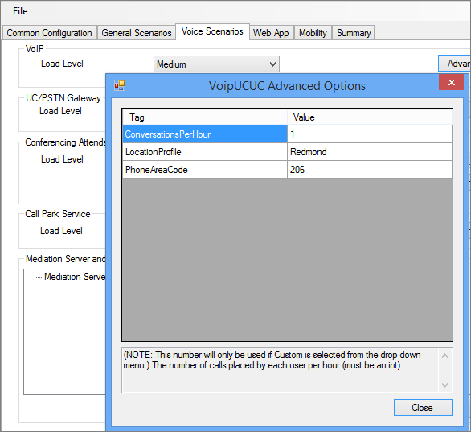

# Configuración de directivas para la Herramienta de esfuerzo y rendimiento de Skype Empresarial Server 2015
 
Configuración de directivas para la Herramienta de esfuerzo y rendimiento de Skype Empresarial Server 2015.
  
Hay varias directivas y otras áreas que puede configurar en Skype Empresarial Server 2015, antes de ejecutar la Herramienta de esfuerzo y rendimiento:
  
- [Directiva de archivado](configuring-policies.md#ArchivingPolicy)
    
- [Directiva de conferencia](configuring-policies.md#ConferencingPolicy)
    
- [Directiva de contactos](configuring-policies.md#ContactsPolicy)
    
- [Directiva de federación](configuring-policies.md#FederationPolicy)
    
- [Directiva de control de admisión de llamadas](configuring-policies.md#CACPolicy)
    
- [Reglas de enrutamiento de voz](configuring-policies.md#VoiceRoutingRules)
    
- [Aplicación Operador de conferencia](configuring-policies.md#ConfAttendantApp)
    
- [Servicio de estacionamiento de llamadas de servidor](configuring-policies.md#ServerCallParkServ)
    
- [Llamadas de emergencia](configuring-policies.md#EmergencyCalls)
    
- [Configuración de la aplicación grupo de respuesta](configuring-policies.md#ConfigResponseGroupApp)
    
## Directiva de archivado

Si tiene un servidor de archivado implementado en la topología de Skype Empresarial Server, puede ver el script ArchivingPolicy.ps1 cliente. Si necesita más ayuda, consulte los cmdlets de archivado y conferencia web.
  
## Directiva de conferencia

Para las conferencias, tenemos el script MeetingPolicy.ps1 conferencia. Si necesita más ayuda, consulte los cmdlets de conferencia web.
  
## Directiva de contactos

ContactsPolicy.ps1 script será el ejemplo que tendrás que revisar. Los cmdlets de mensajería instantánea y presencia le ayudarán si necesita más referencias.
  
## Directiva de federación

El script de ejemplo para federación es FederationPolicy.ps1. Los cmdlets que se revisarán, si necesita más información, serán el servidor perimetral, la federación y el acceso externo.
  
## Directiva de control de admisión de llamadas

Puede hacer referencia a BandwidthPolicy.ps1 para esta directiva. Los cmdlets de control de admisión de llamadas también tendrán más información.
  
## Reglas de enrutamiento de voz

Necesitará el script de ejemplo RoutingRules.ps1 para el enrutamiento de voz. Al configurar estas reglas, tome nota del contexto del teléfono (es decir, /Perfil de ubicación o /SimpleName) y códigos de área interno/externo, para que pueda especificarlas al crear usuarios. También los necesitará durante la configuración de LyncPerfTool (específicamente para RTC-UC y UC-RTC).
  
Por ejemplo, el parámetro SimpleName en la llamada al cmdlet **New-CsDialPlan** en el ejemplo RoutingRules.ps1 debe usarse para el valor LocationProfile en la siguiente figura de UserProfileGenerator.exe:
  

  
Para obtener más información, puede revisar los Telefonía IP empresarial cmdlets.
  
## Aplicación Operador de conferencia

En primer lugar, revise ConferenceAutoAttendantConfiguration.ps1 script. Necesitará tener en cuenta el número de teléfono ConferencingAutoAttendant (11211111111111 de forma predeterminada), de modo que pueda escribirlo en la herramienta de configuración LyncPerfTool para la generación de configuración, como se muestra a continuación:
  

  
Encontrará más detalles en los cmdlets de conferencia y conferencia de acceso telefónico local.
  
## Servicio de estacionamiento de llamadas de servidor

En realidad, está deshabilitado de forma predeterminada. Puede revisar el script CallParkConfiguration.ps1 ejemplo si necesita probarlo. Además, consulte los cmdlets de aplicación de estacionamiento de llamadas según sea necesario.
  
## Llamadas de emergencia

Deberá realizar los siguientes pasos para configurar las pruebas de esfuerzo y rendimiento para llamadas de emergencia:
  
1. Configurar una ruta de voz para llamadas de emergencia. Puede usar el script RoutingRules.ps1 y consultar el comentario **"Ruta E911** a RTC" para ver un ejemplo de cómo configurar esta ruta de voz.
    
    > [!CAUTION]
    > El comando de ejemplo RoutingRules.ps1 tiene un patrón de número que incluye el número 119 en lugar del 911. Debe evitar el uso del 911 (o su número de emergencia local real) para evitar llamadas accidentales a los operadores de emergencia locales durante las pruebas de carga. Recuerde que esta configuración es solo para fines de simulación. 
  
2. Configure las direcciones rellenando  los valores de la pestaña Configuración del servicio de información de ubicación en UserProvisioningTool, como se muestra en la ilustración siguiente:
    
     
  
3. Cuando haya escrito todo en UserProvisioningTool, haga clic en el botón Generar archivos **de configuración LIS.**
    
4. Ahora se generarán archivos CSV para puertos, subredes, conmutadores y puntos de acceso inalámbrico (WAP), así como un archivo XML para la herramienta Stress and Performance. Puede usar los archivos CSV para las entradas al configurar el servicio de información de ubicación (LIS) con el script LisConfiguration.ps1 ubicación. Para ello, tendrás que mover el archivo Locations0.xml a la misma carpeta que el ejecutable de la Herramienta de esfuerzo y rendimiento (LyncPerfTool.exe). Esto le permitirá ejecutar escenarios de perfil de ubicación (plan de marcado).
    
## Configuración de la aplicación grupo de respuesta

El script de ejemplo es ResponseGroupConfiguration.ps1. También hay cmdlets de aplicación de Grupo de respuesta para consultar más detalles de configuración. En el siguiente diagrama se mostrarán algunos de los detalles de configuración:
  

  

