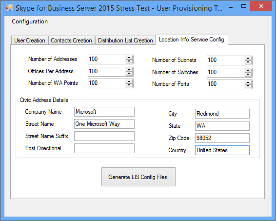

# Configuración de directivas para el Skype para Business Server 2015 herramienta de esfuerzo y rendimientoConfiguring policies for the Skype for Business Server 2015 Stress and Performance Tool
 
Configuración de directiva de Skype para Business Server 2015 herramienta de esfuerzo y rendimiento.Policy configuration for Skype for Business Server 2015 Stress and Performance Tool.
  
Existen varias directivas y otras áreas que puede configurar en Skype para Business Server 2015, antes de ejecutar la herramienta de rendimiento y esfuerzo:There are several policies and other areas that you can configure in Skype for Business Server 2015, prior to running the Stress and Performance Tool:
  
- [Directiva de archivadoArchiving policy](configuring-policies.md#ArchivingPolicy)
    
- [Directiva de conferenciaConferencing policy](configuring-policies.md#ConferencingPolicy)
    
- [Directiva de contactosContacts policy](configuring-policies.md#ContactsPolicy)
    
- [Directiva de federaciónFederation policy](configuring-policies.md#FederationPolicy)
    
- [Directiva de Control de admisión de llamadasCall Admission Control policy](configuring-policies.md#CACPolicy)
    
- [Reglas de enrutamiento de vozVoice Routing rules](configuring-policies.md#VoiceRoutingRules)
    
- [Aplicación de operador de conferenciaConference Attendant application](configuring-policies.md#ConfAttendantApp)
    
- [Servicio de estacionamiento de llamadas de servidorServer Call Park service](configuring-policies.md#ServerCallParkServ)
    
- [Llamadas de emergenciaEmergency calls](configuring-policies.md#EmergencyCalls)
    
- [Aplicación de configuración de grupo de respuestaConfiguring Response Group application](configuring-policies.md#ConfigResponseGroupApp)
    
## Directiva de archivadoArchiving policy

Si tiene un servidor de archivado implementado en su Skype para la topología de servidor empresarial, puede buscar en la secuencia de comandos ArchivingPolicy.ps1.If you have an Archiving server deployed in your Skype for Business Server topology, you can look at the ArchivingPolicy.ps1 script. Si necesita más ayuda, desproteger los cmdlets de archivado y conferencias Web.If you need further assistance, check out the Archiving and Web Conferencing cmdlets.
  
## Directiva de conferenciaConferencing policy

Para las conferencias, tenemos el script MeetingPolicy.ps1.For conferencing, we have the MeetingPolicy.ps1 script. Si necesita más ayuda, desproteger los cmdlets de conferencias Web.If you need further assistance, check out the Web Conferencing cmdlets.
  
## Directiva de contactosContacts policy

Secuencia de comandos de ContactsPolicy.ps1 será el ejemplo que necesitará para revisar.ContactsPolicy.ps1 script will be the sample you'll need to review. Los cmdlets de mensajería instantánea y presencia le ayudará a si necesita más referencias.The IM and Presence cmdlets will help if you need further references.
  
## Directiva de federaciónFederation policy

El script de ejemplo para la federación es FederationPolicy.ps1.The sample script for federation is FederationPolicy.ps1. Los cmdlets para revisar, si necesita más insight, será el servidor perimetral, la federación y el acceso externo.The cmdlets to review, if you need further insight, will be Edge Server, federation, and external access.
  
## Directiva de Control de admisión de llamadasCall Admission Control policy

Puede hacer referencia a BandwidthPolicy.ps1 para esta directiva.You can reference BandwidthPolicy.ps1 for this policy. Los cmdlets de Control de admisión de llamadas tendrá más información así como.The Call Admission Control cmdlets will have further information as well.
  
## Reglas de enrutamiento de vozVoice Routing rules

Necesitará el script de ejemplo RoutingRules.ps1 para el enrutamiento de voz.You'll need the RoutingRules.ps1 sample script for Voice Routing. Cuando está configurando estas reglas, tome nota del contexto de teléfono (es decir, /Location perfil o /SimpleName) y códigos de área internas y externas, por lo que puede especificar al crear usuarios.When you're configuring these rules, take note of the phone context (that is, /Location Profile or /SimpleName) and Internal/External Area Codes, so that you can specify them when creating users. También necesitará ellos durante la configuración de LyncPerfTool (específicamente para UC de RTC y UC-RTC).You'll also need them during LyncPerfTool configuration (specifically for PSTN-UC and UC-PSTN).
  
Por ejemplo, se debe usar el parámetro SimpleName en la llamada al cmdlet **New-CsDialPlan** en el ejemplo de RoutingRules.ps1 para el valor de LocationProfile en la siguiente ilustración de UserProfileGenerator.exe:For example, the SimpleName parameter in the call to the **New-CsDialPlan** cmdlet in the RoutingRules.ps1 example should be used for the LocationProfile value in the following figure of UserProfileGenerator.exe:
  

  
Para obtener información detallada, puede revisar los cmdlets de Enterprise Voice.For details, you can review the Enterprise Voice cmdlets.
  
## Aplicación de operador de conferenciaConference Attendant application

En primer lugar, revise la secuencia de comandos ConferenceAutoAttendantConfiguration.ps1.First review the ConferenceAutoAttendantConfiguration.ps1 script. Desea tome nota del número de teléfono de ConferencingAutoAttendant (1121111111 de forma predeterminada), para que pueda escribir en la herramienta de configuración de LyncPerfTool para la generación de la configuración, como sigue:You'll want to take note of the ConferencingAutoAttendant phone number (1121111111 by default), so that you can enter it into the LyncPerfTool configuration tool for configuration generation, as below:
  

  
Encontrará más detalles en la conferencia y conferencia de acceso telefónico cmdlets.You'll find more details in the Conferencing and Dial-in Conferencing cmdlets.
  
## Servicio de estacionamiento de llamadas de servidorServer Call Park service

Esto realmente está deshabilitada de forma predeterminada.This is actually disabled by default. Puede revisar el script de ejemplo CallParkConfiguration.ps1 si necesita probar esto.You can review the CallParkConfiguration.ps1 sample script if you need to test this. Además, desproteger los cmdlets de aplicación de estacionamiento de llamadas según sea necesario.Additionally, check out the Call Park Application cmdlets as needed.
  
## Llamadas de emergenciaEmergency calls

Debe realizar los siguientes pasos para configurar de esfuerzo y pruebas de rendimiento para las llamadas de emergencia:You'll need to perform the following steps to configure stress and performance testing for emergency calls:
  
1. Configurar una ruta de voz para llamadas de emergencia.Set up a voice route for emergency calls. Puede utilizar la secuencia de comandos RoutingRules.ps1 y comprobar bajo el comentario " **Ruta E911 a RTC** " para obtener un ejemplo de cómo configurar la ruta de voz.You can use the RoutingRules.ps1 script, and check under the comment " **Route E911 to PSTN** " for an example of how to set up this voice route.
    
    > [!CAUTION]
    > El comando de ejemplo en RoutingRules.ps1 tiene un patrón de número que incluye la cantidad 119 en lugar de 911.The example command in RoutingRules.ps1 has a number pattern that includes the number 119 rather than 911. Se debe evitar usar 911 (o su número de emergencia local real) para evitar que las llamadas accidentales a los operadores de emergencias locales durante las pruebas de carga.You should avoid using 911 (or your actual local emergency number) to prevent accidental calls to your local emergency operators during your load testing. Recuerde, esta configuración es únicamente con fines de simulación!Remember, this configuration is for simulation purposes only! 
  
2. Configure las direcciones rellenar los valores en la ficha **Configuración del servicio de información de ubicación** en la UserProvisioningTool, tal como se muestra en la ilustración siguiente:Configure addresses by filling in the values on the **Location Info Service Config** tab in the UserProvisioningTool, as shown in the following figure:
    
     
  
3. Cuando todo lo que ha especificado en el UserProvisioningTool, haga clic en el botón **Generar archivos de configuración de LIS** .When you've entered everything into the UserProvisioningTool, click the **Generate LIS Config Files** button.
    
4. Ahora se generará archivos CSV para puertos, subredes, conmutadores y puntos de acceso inalámbrico (WAP), así como un archivo XML para la herramienta de esfuerzo y rendimiento.Now CSV files for ports, subnets, switches, and wireless access points (WAPs), as well as an XML file for the Stress and Performance tool will be generated. Puede usar los archivos CSV para entradas al configurar el servicio de información de ubicación (LIS) con la secuencia de comandos LisConfiguration.ps1.You can use the CSV files for inputs when configuring the Location Information service (LIS) with the LisConfiguration.ps1 script. Para ello, debe mover el archivo Locations0.xml a la misma carpeta que la herramienta Stress and Performance ejecutable (LyncPerfTool.exe).To do this, you'll need to move the Locations0.xml file to the same folder as the Stress and Performance Tool executable (LyncPerfTool.exe). Esto le permitirá ejecutar escenarios (plan de marcado) de perfil de ubicación.This will let you run location profile (dial plan) scenarios.
    
## Aplicación de configuración de grupo de respuestaConfiguring Response Group application

El script de ejemplo es ResponseGroupConfiguration.ps1.The sample script is ResponseGroupConfiguration.ps1. También hay cmdlets de aplicación de grupo de respuesta para revisar para obtener más información de configuración.There are also Response Group application cmdlets to review for further configuration details. En el siguiente diagrama se muestra algunos de los detalles de configuración:The following diagram will show some of the configuration details:
  

  

