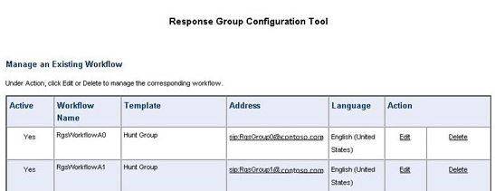

# Configuración de directivas para la Herramienta de esfuerzo y rendimiento de Skype Empresarial Server 2015Configuring policies for the Skype for Business Server 2015 Stress and Performance Tool
 
Configuración de directivas para la Herramienta de esfuerzo y rendimiento de Skype Empresarial Server 2015.Policy configuration for Skype for Business Server 2015 Stress and Performance Tool.
  
Hay varias directivas y otras áreas que puede configurar en Skype Empresarial Server 2015, antes de ejecutar la Herramienta de esfuerzo y rendimiento:There are several policies and other areas that you can configure in Skype for Business Server 2015, prior to running the Stress and Performance Tool:
  
- [Directiva de archivadoArchiving policy](configuring-policies.md#ArchivingPolicy)
    
- [Directiva de conferenciaConferencing policy](configuring-policies.md#ConferencingPolicy)
    
- [Directiva de contactosContacts policy](configuring-policies.md#ContactsPolicy)
    
- [Directiva de federaciónFederation policy](configuring-policies.md#FederationPolicy)
    
- [Directiva de control de admisión de llamadasCall Admission Control policy](configuring-policies.md#CACPolicy)
    
- [Reglas de enrutamiento de vozVoice Routing rules](configuring-policies.md#VoiceRoutingRules)
    
- [Aplicación Operador de conferenciaConference Attendant application](configuring-policies.md#ConfAttendantApp)
    
- [Servicio de estacionamiento de llamadas de servidorServer Call Park service](configuring-policies.md#ServerCallParkServ)
    
- [Llamadas de emergenciaEmergency calls](configuring-policies.md#EmergencyCalls)
    
- [Configuración de la aplicación grupo de respuestaConfiguring Response Group application](configuring-policies.md#ConfigResponseGroupApp)
    
## Directiva de archivadoArchiving policy

Si tiene un servidor de archivado implementado en la topología de Skype Empresarial Server, puede ver el script ArchivingPolicy.ps1 cliente.If you have an Archiving server deployed in your Skype for Business Server topology, you can look at the ArchivingPolicy.ps1 script. Si necesita más ayuda, consulte los cmdlets de archivado y conferencia web.If you need further assistance, check out the Archiving and Web Conferencing cmdlets.
  
## Directiva de conferenciaConferencing policy

Para las conferencias, tenemos el script MeetingPolicy.ps1 conferencia.For conferencing, we have the MeetingPolicy.ps1 script. Si necesita más ayuda, consulte los cmdlets de conferencia web.If you need further assistance, check out the Web Conferencing cmdlets.
  
## Directiva de contactosContacts policy

ContactsPolicy.ps1 script será el ejemplo que tendrás que revisar.ContactsPolicy.ps1 script will be the sample you'll need to review. Los cmdlets de mensajería instantánea y presencia le ayudarán si necesita más referencias.The IM and Presence cmdlets will help if you need further references.
  
## Directiva de federaciónFederation policy

El script de ejemplo para federación es FederationPolicy.ps1.The sample script for federation is FederationPolicy.ps1. Los cmdlets que se revisarán, si necesita más información, serán el servidor perimetral, la federación y el acceso externo.The cmdlets to review, if you need further insight, will be Edge Server, federation, and external access.
  
## Directiva de control de admisión de llamadasCall Admission Control policy

Puede hacer referencia a BandwidthPolicy.ps1 para esta directiva.You can reference BandwidthPolicy.ps1 for this policy. Los cmdlets de control de admisión de llamadas también tendrán más información.The Call Admission Control cmdlets will have further information as well.
  
## Reglas de enrutamiento de vozVoice Routing rules

Necesitará el script de ejemplo RoutingRules.ps1 para el enrutamiento de voz.You'll need the RoutingRules.ps1 sample script for Voice Routing. Al configurar estas reglas, tome nota del contexto del teléfono (es decir, /Perfil de ubicación o /SimpleName) y códigos de área interno/externo, para que pueda especificarlas al crear usuarios.When you're configuring these rules, take note of the phone context (that is, /Location Profile or /SimpleName) and Internal/External Area Codes, so that you can specify them when creating users. También los necesitará durante la configuración de LyncPerfTool (específicamente para RTC-UC y UC-RTC).You'll also need them during LyncPerfTool configuration (specifically for PSTN-UC and UC-PSTN).
  
Por ejemplo, el parámetro SimpleName en la llamada al cmdlet **New-CsDialPlan** en el ejemplo RoutingRules.ps1 debe usarse para el valor LocationProfile en la siguiente figura de UserProfileGenerator.exe:For example, the SimpleName parameter in the call to the **New-CsDialPlan** cmdlet in the RoutingRules.ps1 example should be used for the LocationProfile value in the following figure of UserProfileGenerator.exe:
  

  
Para obtener más información, puede revisar los Telefonía IP empresarial cmdlets.For details, you can review the Enterprise Voice cmdlets.
  
## Aplicación Operador de conferenciaConference Attendant application

En primer lugar, revise ConferenceAutoAttendantConfiguration.ps1 script.First review the ConferenceAutoAttendantConfiguration.ps1 script. Necesitará tener en cuenta el número de teléfono ConferencingAutoAttendant (11211111111111 de forma predeterminada), de modo que pueda escribirlo en la herramienta de configuración LyncPerfTool para la generación de configuración, como se muestra a continuación:You'll want to take note of the ConferencingAutoAttendant phone number (1121111111 by default), so that you can enter it into the LyncPerfTool configuration tool for configuration generation, as below:
  

  
Encontrará más detalles en los cmdlets de conferencia y conferencia de acceso telefónico local.You'll find more details in the Conferencing and Dial-in Conferencing cmdlets.
  
## Servicio de estacionamiento de llamadas de servidorServer Call Park service

En realidad, está deshabilitado de forma predeterminada.This is actually disabled by default. Puede revisar el script CallParkConfiguration.ps1 ejemplo si necesita probarlo.You can review the CallParkConfiguration.ps1 sample script if you need to test this. Además, consulte los cmdlets de aplicación de estacionamiento de llamadas según sea necesario.Additionally, check out the Call Park Application cmdlets as needed.
  
## Llamadas de emergenciaEmergency calls

Deberá realizar los siguientes pasos para configurar las pruebas de esfuerzo y rendimiento para llamadas de emergencia:You'll need to perform the following steps to configure stress and performance testing for emergency calls:
  
1. Configurar una ruta de voz para llamadas de emergencia.Set up a voice route for emergency calls. Puede usar el script RoutingRules.ps1 y consultar el comentario **"Ruta E911** a RTC" para ver un ejemplo de cómo configurar esta ruta de voz.You can use the RoutingRules.ps1 script, and check under the comment " **Route E911 to PSTN** " for an example of how to set up this voice route.
    
    > [!CAUTION]
    > El comando de ejemplo RoutingRules.ps1 tiene un patrón de número que incluye el número 119 en lugar del 911.The example command in RoutingRules.ps1 has a number pattern that includes the number 119 rather than 911. Debe evitar el uso del 911 (o su número de emergencia local real) para evitar llamadas accidentales a los operadores de emergencia locales durante las pruebas de carga.You should avoid using 911 (or your actual local emergency number) to prevent accidental calls to your local emergency operators during your load testing. Recuerde que esta configuración es solo para fines de simulación.Remember, this configuration is for simulation purposes only! 
  
2. Configure las direcciones rellenando  los valores de la pestaña Configuración del servicio de información de ubicación en UserProvisioningTool, como se muestra en la ilustración siguiente:Configure addresses by filling in the values on the **Location Info Service Config** tab in the UserProvisioningTool, as shown in the following figure:
    
     
  
3. Cuando haya escrito todo en UserProvisioningTool, haga clic en el botón Generar archivos **de configuración LIS.**When you've entered everything into the UserProvisioningTool, click the **Generate LIS Config Files** button.
    
4. Ahora se generarán archivos CSV para puertos, subredes, conmutadores y puntos de acceso inalámbrico (WAP), así como un archivo XML para la herramienta Stress and Performance.Now CSV files for ports, subnets, switches, and wireless access points (WAPs), as well as an XML file for the Stress and Performance tool will be generated. Puede usar los archivos CSV para las entradas al configurar el servicio de información de ubicación (LIS) con el script LisConfiguration.ps1 ubicación.You can use the CSV files for inputs when configuring the Location Information service (LIS) with the LisConfiguration.ps1 script. Para ello, tendrás que mover el archivo Locations0.xml a la misma carpeta que el ejecutable de la Herramienta de esfuerzo y rendimiento (LyncPerfTool.exe).To do this, you'll need to move the Locations0.xml file to the same folder as the Stress and Performance Tool executable (LyncPerfTool.exe). Esto le permitirá ejecutar escenarios de perfil de ubicación (plan de marcado).This will let you run location profile (dial plan) scenarios.
    
## Configuración de la aplicación grupo de respuestaConfiguring Response Group application

El script de ejemplo es ResponseGroupConfiguration.ps1.The sample script is ResponseGroupConfiguration.ps1. También hay cmdlets de aplicación de Grupo de respuesta para consultar más detalles de configuración.There are also Response Group application cmdlets to review for further configuration details. En el siguiente diagrama se mostrarán algunos de los detalles de configuración:The following diagram will show some of the configuration details:
  

  

