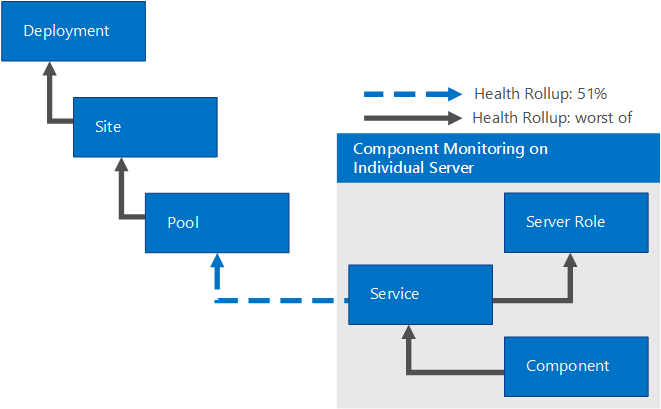

# Administrar Skype Empresarial Server 2015 con el módulo de administración SCOM
 
**Resumen:** Aprenda a configurar su Skype para la infraestructura de servidor de negocios 2015 para trabajar con System Center Operations Manager.
  
En un mundo ideal, nunca encontraría problemas con Skype para Business Server 2015. Sin embargo, Skype para Business Server puede verse afectada por factores externos, por ejemplo, bloqueos y fallos de hardware de red. Mediante Skype para Business Server 2015 Management Packs, puede identificar y enfrentar proactivamente posibles problemas. De esta forma, el Skype para Business Server 2015 Management Packs amplían las capacidades de System Center Operations Manager.
  
Esta información se escribió basándose en la versión 9319.0 del paquete de monitoreo para Skype para el software de comunicaciones de Business Server 2015.
  
## Descripción de la configuración

 Para configurar el Skype para la infraestructura de servidor de negocios 2015 para trabajar con System Center Operations Manager, debe hacer tres cosas:
  
Identificar y [Configurar el servidor de administración principal](configure-the-primary.md). Para ello, debe instalar System Center Operations Manager 2012 SP1 o R2. 
  
 Identificar y [Configurar el Skype para equipos Business Server que se va a supervisar](configure-computers-to-monitor.md). Para supervisar un Skype para equipo Business Server usando System Center Operations Manager, debe instalar los archivos del agente de System Center Operations Manager y configurar cada servidor para que actúe como un servidor proxy. 
  
 Identificar y [instalar y configurar los nodos de observador](watcher-nodes.md). Nodos de observador son equipos que ejecutan periódicamente Skype para transacciones sintéticas Business Server — cmdlets de Windows PowerShell que compruebe dicha clave Skype para los componentes de Business Server, como la capacidad de iniciar sesión en el sistema o la posibilidad de intercambiar instantánea mensajes, están trabajando como se esperaba. 
  
## Servidor de administración de System Center Operations Manager raíz y compatibilidad con el agente

Puede utilizar los módulos de administración con System Center Operations Manager 2007 R2 (64 bits) (compatible sólo con fines de migración) o SP1 de System Center Operations Manager 2012 &amp; R2 (64 bits). La siguiente tabla muestra las configuraciones admitidas para los paquetes de administración para Skype para Business Server 2015: 
  
|**Configuración**|**¿Soporta?**|
|:-----|:-----|
|Sistema operativo Windows Server 2008 R2    Sistema operativo Windows Server R2 de 2012    |Sí. Ambos en Skype para servidor Business Server 2015 y nodos de observador transacciones sintéticas.    |
|Servidores agrupados en clúster    |No admitido.    |
|Supervisión sin agente    |No admitido.    |
|Entorno virtual    |Sí.    |
|Roles de servidor unidos al dominio    |Todos Skype interno para funciones de servidor de Business Server 2015 debe estar unido al dominio.    |
|Roles de servidor independientes    |Skype para servidores de borde de Business Server 2015 no tienen que estar unidos a un dominio.    |
|Limitaciones de la topología    |Todos los roles de servidor de una implementación se deben controlar desde el mismo grupo de administración de Operations Manager.    |
|Nodo de monitor de transacciones sintéticas    |Se admite disponibilidad de escenario de supervisión con un nodo de monitor de transacciones sintéticas (configuración adicional necesaria). No es necesario que los nodos de monitor estén unidos al dominio.    |
   
La siguiente tabla muestra la capacidad y los requisitos del sistema operativo para un nodo de monitor de transacción sintética:
  
|**Componente de hardware**|**Requisito mínimo**|
|:-----|:-----|
|CPU    |Uno de los siguientes:    Procesador de 64 bits, cuatro núcleos, 2,33 GHz o superior    Procesador de 64 bits, dos canales, doble núcleo, 2,33 GHz o superior    |
|Memoria    |8 GB    |
|Sistema operativo    |Windows Server 2008 R2    Windows Server 2012 R2    |
|Red    |1 adaptador de red de 1 Gbps    |
   
## Requisitos previos

Para ejecutar un nodo de monitor de transacción sintética, en primer lugar debe instalar lo siguiente:
  
- Agente de System Center Operations Manager 
    
-  Microsoft .NET Framework 4.5
    
- Skype para archivos de instalación de Business Server core (OcsCore.msi) y la API administrada de comunicaciones unificadas (UCMA) (versiones deben coincidir con el Skype para Business Server WatcherNode.msi versión)
    
## Archivos de este módulo de monitor

El módulo de supervisión de Skype para el año 2015 de Business Server incluye los siguientes archivos:
  
- Microsoft.LS.2015.Monitoring.ActiveMonitoring.mp
    
- Microsoft.LS.2015.Monitoring.ComponentAndUser.mp
    
- WatcherNode.msi
    
## Novedades

Las siguientes características son nuevas en Skype para Business Server 2015 Management Packs.
  
- **Descubrimiento automático para el inicio de sesión de cliente** Aplicaciones de cliente que inicia sesión en Skype para Business Server 2015 a menudo automáticamente detectar el servidor al iniciar sesión en. Las transacciones sintéticas ahora son compatibles con la función para comprobar si la detección automática se ha configurado correctamente.
    
- **Transacciones sintéticas personalizado ejecute intervalos** Para simplificar el proceso de nodos de observador de configuración, transacciones sintéticas pueden compartir las cuentas de usuario. Esto reduce la frecuencia con la que se ejecutan las pruebas en serie para evitar conflictos. De forma predeterminada, las transacciones sintéticas se ejecutan cada 15 minutos para garantizar que todas las pruebas dispongan de tiempo para ejecutarse. Los administradores que elijan usar más usuarios o menos pruebas también pueden reducir el intervalo de ejecución.
    
- **Transacciones sintéticas servicios de interoperabilidad de vídeo** Los clientes que deseen migrar a Skype para el año 2015 servidor de negocios de soluciones de otros fabricantes a menudo desean seguir utilizando los dispositivos de teleconferencia por vídeo (VTCs) de estos otros proveedores. Servidor de vídeo interoperabilidad es un nuevo Skype para Business Server 2015 función de servidor que permite que los clientes continúen utilizando Cisco VTCs en sus salas de conferencias conectándose a CUCM de Cisco a través de un vídeo troncal SIP. Esta característica también agrega una transacción sintética para ayudar a comprobar que el Servidor de interoperabilidad de vídeo está activo y puede administrar las conexiones entrantes a través de un tronco SIP de vídeo.
    
- **Transacción sintética de conferencia de uso compartido de aplicaciones** Ya se admite validación de un escenario de un extremo a otro para las conferencias de uso compartido de aplicaciones.
    
## Escenarios de supervisión

El Skype para Business Server 2015 Management Pack aprovecha una gran variedad de características para ayudarle a detectar y diagnosticar problemas. Estas características proporcionan una visibilidad en tiempo real de la salud de un Skype para entorno Business Server 2015.
  
|**Escenario de supervisión**|**Descripción**|
|:-----|:-----|
|Transacciones sintéticas    | Cmdlets de Windows PowerShell para probar y ayudar a garantizar la alta disponibilidad de escenarios como signo de presencia, mensajería instantánea y conferencias para los usuarios.   Las transacciones sintéticas se pueden ejecutar desde cualquier ubicación geográfica, incluso desde la empresa, desde fuera de ésta y desde las sucursales.    Cuando se producen errores en una transacción sintética, se crean registros HTML para ayudar a determinar la naturaleza exacta del error. Esto incluye comprender qué acción ha dado lugar al error, la latencia de cada acción, la línea de comandos usada para ejecutar la prueba y el error específico que se han producido.    |
|Alertas de confiabilidad de llamadas    |Registros de detalle de llamadas (CDR) escrito por Skype para servidores de Business Server 2015 reflejar si los usuarios son capaces de conectarse a una llamada o por qué se ha finalizado una llamada. Las alertas de confiabilidad de las llamadas consultan la base de datos de CDR para generar alertas que indican si hay un número elevado de usuarios con problemas de conectividad con las llamadas punto a punto o con la funcionalidad de conferencia básica.    El escenario abarca llamadas de audio, mensajería instantánea (MI) de punto a punto y otras características de conferencia.    |
|Alertas de calidad de medios    |Consultas de base de datos que consultar informes de calidad de la experiencia (QoE) publicados por Skype para clientes Business Server 2015 al final de cada llamada. Estas consultas producen alertas que indicar situaciones donde los usuarios suelen experimentar calidad media en peligro durante llamadas y conferencias. Los datos se basa en métricas clave, como la latencia de paquetes y pérdida, que contribuyen directamente a la calidad de la experiencia del usuario.    |
|Alertas de estado de componente    |Los componentes de servidor generan alertas a través de registros de eventos y contadores de para indicar condiciones de error que pueden afectar significativamente escenarios de usuario. Estas alertas indican distintas condiciones, como servicios que no se ejecutan, porcentaje elevado de errores, latencia de mensajes elevada o problemas de conectividad.    |
|Seguimiento de estado de dependencia    |Skype para Business Server puede fallar por diversos motivos externos. El módulo de administración supervisa y recopila datos para dependencias externas críticas que pueden indicar problemas graves. Estas dependencias incluyen la disponibilidad de servicios de Internet Information Server (IIS) y CPU de servidores utilizados para Skype para Business Server.    |
   
### Prioridad de las alertas

Las alertas se clasifican en las siguientes categorías: 
  
 **Avisos de alta prioridad:** Estas alertas indican las condiciones que causan las interrupciones de servicio para grandes grupos de usuarios y requieren una acción inmediata. Interrupciones de transacciones sintéticas y servicios sin conexión (como Skype para Business Server Audio y videoconferencia) detectadas califican como alertas de prioridad alta. Por el contrario, el fallo de un componente en una única máquina no es una alerta de alta prioridad. Skype para Business Server 2015 tiene características integradas de alta disponibilidad para estas situaciones, por ejemplo, varios servidores frontales detrás de los equilibradores de carga.
  
 **Alertas de prioridad Media:** Estas alertas indican las condiciones que afectan a un subconjunto de usuarios o indican problemas en la calidad de las llamadas, por ejemplo, fallas de componentes, latencia de establecimiento de llamada o menor calidad de audio en las llamadas. Alertas de esta categoría son con estado (es decir, la naturaleza de los cambios de alerta basado en el estado de la conexión de red.) Por ejemplo, si tiempos de establecimiento de llamada indican la latencia pero vuelva a un umbral normal, esta alerta de prioridad Media sería resuelta automática en System Center Operations Manager y los administradores no necesitará tomar medidas. Los administradores suelen tratarse alertas que no se pueden resolver automáticamente en el mismo día laborable.
  
 **Otras alertas:** estas alertas se generan desde componentes que podrían afectar a un usuario o a un subconjunto de usuarios determinado. Por ejemplo, una alerta típica sería que el servicio de libreta de direcciones no analiza la entrada de Servicios de dominio de Active Directory® (AD DS) para el usuario: testuser@contoso.com. Los administradores pueden corregir estas alertas siempre que tengan tiempo disponible.
  
### Transacciones sintéticas

Skype para Business Server 2015 Management Packs proporcionan una mayor cobertura de alertas a través de transacciones sintéticas. Transacciones sintéticas son cmdlets de Windows PowerShell integrados en el paquete de administración de Operations Manager para probar los escenarios de usuario end-to-end. Al designar un servidor para ejecutar transacciones sintéticas, estos cmdlets se activan periódicamente por el módulo de administración. Los errores resultantes de una transacción sintética generan una alerta con estado. Aquí son compatibles transacciones sintéticas para Skype para Business Server 2015:
  
**Admite transacciones sintéticas para el registro, la presencia y contactos**

||||
|:-----|:-----|:-----|
|1    |Registro (inicio de sesión del usuario)    |Disponible de Lync Server 2010 y posteriores    |
|2    |Servicio de libreta de direcciones (descarga de archivos)    |Disponible de Lync Server 2010 y posteriores    |
|3    |Consulta web de la libreta de direcciones    |Disponible de Lync Server 2010 y posteriores    |
|4    |Presence    |Disponible de Lync Server 2010 y posteriores    |
|5    |Almacenamiento de contactos unificado    |Disponible de Lync Server 2013 y más allá    |
   
**Transacciones sintéticas compatibles para servicios punto a punto**

||||
|:-----|:-----|:-----|
|6    |Mensajes instantáneos de punto a punto    |Disponible en Lync Server 2010 y más allá    |
|7    |Audio y vídeo punto a punto    |Disponible en Lync Server 2010 y más allá    |
|8    |Mensajería instantánea punto a punto MCX (móvil)    |Disponible en la versión de septiembre de 2011 de Lync Server 2010 y más allá    |
   
**Transacciones sintéticas compatibles para conferencias y chat persistente**

||||
|:-----|:-----|:-----|
|9    |Conferencias de audio y vídeo    |Disponible en Lync Server 2010 y más allá    |
|10    |Conferencias de datos    |Disponible en Lync Server 2013 y más allá    |
|11    |Conferencia de mensajes instantáneos    |Disponible en Lync Server 2010 y más allá    |
|12    | Chat persistente   |Disponible en Lync Server 2013 y más allá    |
|13    |Iniciador de participación en reuniones (reuniones programadas)    |Disponible en Lync Server 2013 y más allá    |
|14    |Conferencia de acceso telefónico    |Nuevo en Skype para Business Server 2015    |
|15    |Conferencia de uso compartido de aplicaciones    |Nuevo en Skype para Business Server 2015    |
|16    |Conferencia USWA (participación en reunión web)    |Nuevo en Skype para Business Server 2015    |
   
**Transacciones sintéticas compatibles para dependencias de asociado y red**

||||
|:-----|:-----|:-----|
|17    |Conectividad del servidor perimetral de A/V    |Disponible en Lync Server 2013 y más allá    |
|18    |Conectividad de mensajería unificada de Exchange de conectividad de servidor perimetral AV (correo de voz)    |Disponible en Lync Server 2013 y más allá    |
|19    |Llamada punto a punto de RTC    |Disponible en Lync Server 2010 y más allá    |
|20    |Mensajería instantánea XMPP (federación)    |Disponible en Lync Server 2013 y más allá    |
|21    |Servidor de interoperabilidad de vídeo    |Nuevo en Skype para Business Server 2015    |
   
## Resumen del estado

En la tabla siguiente muestra los Estados de salud de objetos el Skype para Business Server pack de supervisión.
  
|**Objeto de paquete de administración**|**Descripción**|
|:-----|:-----|
|Skype para la implementación de servidor de la empresa    |Representa la implementación de Skype para el año 2015 de servidor empresarial de la organización.    |
|Skype para sitio Business Server    |Representa distintas ubicaciones geográficas donde se han implementado los servicios.    |
|Skype para el grupo de servidores empresariales    |Grupo de servidores (dentro de un sitio) que proporciona servicios de comunicaciones, como la mensajería instantánea y las conferencias, a los usuarios. Es aplicable a grupos de servidores front-end, grupos de servidores perimetrales y grupos de directores, incluso si solo hay una sola máquina de un determinado grupo.    |
|Skype for Business Server Role    |Un rol de servidor que aloja Skype para servicio Business Server.    |
|Skype para servicio Business Server    |Representa una función implementada en un equipo específico (por ejemplo, servicio de usuario en fp0.contoso.com).    |
|Skype para el componente de servidor empresarial    |Componente del servicio (por ejemplo, el componente de descarga de la libreta de direcciones es una parte del servicio web).    |
|Skype para Business Server grupo Watcher    |Instancia de transacciones sintéticas que se ejecutan en un grupo.    |
|Skype para Business Server Registrar Watcher    |Instancia de transacciones sintéticas que se ejecutan en un grupo de registradores.    |
|Skype para Business Server usuario servicios grupo Watcher    |Instancia de transacciones sintéticas que se ejecutan en un grupo de servicios de usuario.    |
|Skype para Business Server voz grupo Watcher    |Instancia de transacciones sintéticas que se ejecutan en un solo grupo de voz.    |
|Skype para monitor de puerto de servidor de negocios    |Instancia de comprobaciones de puerto que se ejecuta en un grupo.    |
|Monitor de URL simple    |Realiza el sondeo HTTPS de las direcciones URL simples configuradas en una implementación.    |
   

  
Un Skype para grupo Business Server puede contener varios Skype individual para sistemas de servidor empresarial (con más de un Skype para Business Server rol, Skype para servicio Business Server y Skype para el componente servidor de negocios). Por lo tanto, la falla de un servidor individual o componente es menos crítica en el estado general de la Skype para el grupo de servidores empresariales, ya que otros servidores en el mismo grupo pueden proporcionar el servicio de aplicación al cliente. El estado se resumirán en un nivel de porcentaje para el Skype para el grupo de servidores empresariales. 
  
El Skype para Business Server Pool Monitor realiza transacciones sintéticas contra un Skype para el grupo de servidores empresariales. Los errores consecutivos en una o más transacciones sintéticas (proceso conocido como intervalo de sondeo consecutivos) resumirán el mantenimiento en el nivel del grupo (el peor de cualquier transacción sintética), tal y como se muestra en el siguiente diagrama. 
  

  
## Práctica recomendada: Crear un módulo de administración para personalizaciones

De forma predeterminada, Operations Manager guarda todas las personalizaciones, como las invalidaciones del módulo de administración predeterminado. Como práctica recomendada, debe crear un módulo de administración independiente para cada módulo de administración sellado que desee personalizar. 
  
Cuando se crea un módulo de administración de para almacenar configuraciones personalizadas para un módulo de administración sellado, se recomienda asignar un nombre adecuado para el nuevo módulo de administración, como "Personalizaciones de Skype Empresarial Server 2015". 
  
La creación de un nuevo módulo de administración para almacenar las personalizaciones de cada módulo de administración sellado facilita la exportación de las personalizaciones de un entorno de prueba a un entorno de producción. Esto también hace que sea más fácil eliminar un módulo de administración, porque antes de eliminarlo deben eliminarse todas sus dependencias. Si las personalizaciones para todos los paquetes de administración se guardan en el módulo de administración predeterminado y es necesario eliminar un único módulo de administración, en primer lugar se debe eliminar el módulo de administración predeterminado, que elimina también las personalizaciones realizadas en otros módulos de administración. 
  
## Vínculos

Los siguientes vínculos permiten obtener acceso a información sobre tareas comunes asociadas con los módulos de supervisión de System Center 2012:
  
- [Ciclo de vida de Management Pack](https://technet.microsoft.com/en-us/library/hh212732.aspx)
    
- [Cómo importar un paquete de administración de Operations Manager 2012](https://technet.microsoft.com/en-us/library/hh212691.aspx)
    
- [Cómo reemplazar una regla o un Monitor](https://technet.microsoft.com/en-us/library/hh212869.aspx)
    
- [Cómo crear una ejecución como cuenta en Operations Manager 2012](https://technet.microsoft.com/en-us/library/hh321655.aspx)
    
- [Administrar la ejecución como cuentas y perfiles](https://technet.microsoft.com/en-us/library/hh212714.aspx)
    
- [Cómo exportar un paquete de administración de Operations Manager](https://technet.microsoft.com/en-us/library/hh320149.aspx)
    
- [Cómo quitar un paquete de administración de Operations Manager](https://technet.microsoft.com/en-us/library/hh230746.aspx)
    
Los siguientes vínculos permiten obtener acceso a información sobre tareas comunes asociadas con los módulos de supervisión de System Center 2007:
  
- [Administrar el ciclo de vida del paquete de administración](https://go.microsoft.com/fwlink/p/?LinkId=211463)
    
- [Cómo importar un paquete de administración de Operations Manager 2007](https://go.microsoft.com/fwlink/p/?LinkID=142351)
    
- [Cómo supervisar el uso reemplaza](https://go.microsoft.com/fwlink/p/?LinkID=117777)
    
- [Cómo crear una ejecución como cuenta en Operations Manager 2007](https://go.microsoft.com/fwlink/p/?LinkID=165410)
    
- [Cómo modificar una ejecución existente como perfil](https://go.microsoft.com/fwlink/p/?LinkID=165412)
    
- [Cómo exportar las personalizaciones del paquete de administración](https://go.microsoft.com/fwlink/p/?LinkId=209940)
    
- [Cómo quitar un paquete de administración](https://go.microsoft.com/fwlink/p/?LinkId=209941)
    
Si tiene preguntas acerca de Operations Manager y paquetes de supervisión, consulte el [foro de la Comunidad de System Center Operations Manager](https://go.microsoft.com/fwlink/p/?LinkID=179635).
  
Un recurso útil es el blog del [Sistema Center Operations Manager Unleashed](https://opsmgrunleashed.wordpress.com/) , que contiene los mensajes "Por ejemplo" para los paquetes de supervisión específicos.
  
Para obtener información adicional acerca de Operations Manager, consulte los blogs siguientes: 
  
- [Blog del equipo de Operations Manager](https://blogs.technet.com/momteam/default.aspx)
    
- [OpsMgr Blog de Kevin Holman](https://blogs.technet.com/kevinholman/default.aspx)
    
- [Opiniones de OpsMgr](https://thoughtsonopsmgr.blogspot.com/)
    
- [Blog de Raphael Burri](https://rburri.wordpress.com/)
    
- [Espacio de administración de BWren](https://blogs.technet.com/brianwren/default.aspx)
    
- [OpsMgr ++](https://blogs.msdn.com/boris_yanushpolsky/default.aspx)
    
> [!IMPORTANT]
> Toda la información y contenido de sitios que no sean de Microsoft la proporciona el propietario o los usuarios del sitio web correspondiente. Microsoft no ofrece ninguna garantía, explícita, implícita o legal, con respecto a la información de dichos sitios web. 
  
## Vea también

#### 

[Skype para herramientas de administración de Business Server 2015](../../management-tools/management-tools.md)

