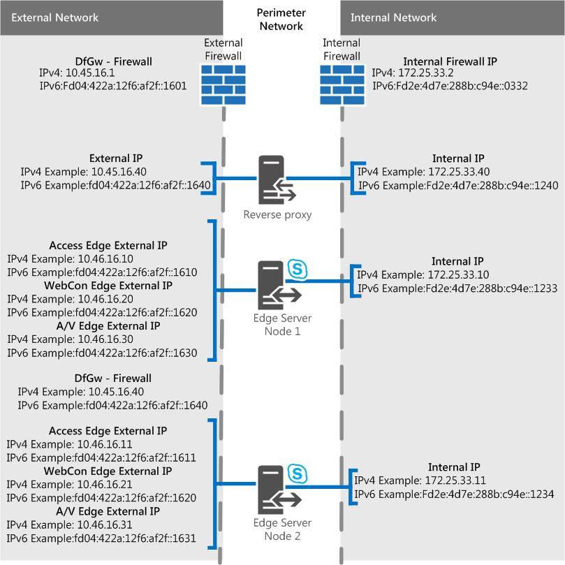

# Escenarios de servidor perimetral en Skype Empresarial ServerEdge Server scenarios in Skype for Business Server
 
**Resumen:** Revise estos escenarios para ayudarle a planear la topología del servidor perimetral en Skype Empresarial Server.**Summary:** Review these scenarios to help you plan your Edge Server topology in Skype for Business Server.
  
Tenemos algunos diagramas de escenarios para ayudar a visualizar y decidir qué topología de servidor perimetral de Skype Empresarial Server desea implementar.We have some scenarios diagrams to assist with visualizing and deciding on what Skype for Business Server Edge Server topology you want to implement. Una vez que haya elegido un buen candidato, puede leer los requisitos del entorno que deberá cumplir.Once you've picked a good candidate, you can go read up on the environmental requirements you'll need to address. Lo siguiente es aplicable a cualquiera de los escenarios, por lo que lo mencionamos primero.The following is applicable to any of the scenarios, so we're mentioning it first.
  
Estas cifras, que se muestran solo con fines de ejemplo (y como tal contienen datos de ejemplo IPv4 e IPv6), no representan el flujo de comunicación real, sino una vista de alto nivel del tráfico posible.These figures, which are shown for example purposes only (and as such contains sample IPv4 and IPv6 data), don't represent the actual communication flow, but rather a high-level view of your possible traffic. Los detalles del puerto también se pueden ver en los diagramas de puerto para cada escenario siguiente.Port details can also be seen in the Port diagrams for each scenario below.
  
Los diagramas muestran .com para la interfaz externa y .net para el interno, que también es material de ejemplo; Por supuesto, sus propias entradas pueden ser bastante diferentes cuando está reúnendo su propio plan perimetral final.The diagrams show .com for the external interface and .net for the internal, which is also sample material; of course your own entries may be quite different when you're putting together your own final Edge plan.
  
No se incluye el director (que es un componente opcional) en ninguno de los diagramas, pero puede leerlo por separado (se menciona en otros temas de planeación).We don't include the Director (which is an optional component) in any of the diagrams, but you can read about that separately (it's mentioned in other Planning topics).
  
Como se indicó anteriormente, hay datos IPv6 de ejemplo en los diagramas.As noted above, there is sample IPv6 data in the diagrams. La mayor parte de la documentación de [Plan for Edge Server deployments in Skype for Business Server](edge-server-deployments.md) hará referencia a IPv4, pero ciertamente es compatible si desea usar IPv6.Most of the documentation in [Plan for Edge Server deployments in Skype for Business Server](edge-server-deployments.md) will refer to IPv4, but you are certainly supported if you want to use IPv6. Ten en cuenta que necesitarás direcciones IPv6 en el espacio de direcciones asignado y direccionamientos internos y externos, como con las DIRECCIONES IP IPv4.Note that you'll need IPv6 addresses in your assigned address space, and they'll need to work with internal and external addressing, as with IPv4 IPs. Puedes, gracias a Windows, usar la característica de pila dual, que es una pila de red independiente y distinta para IPv4 e IPv6.You can, thanks to Windows, employ the dual stack feature, which is a separate and distinct network stack for IPv4 and IPv6. Esto le permitirá, si lo necesita, asignar direcciones IPv4 e IPv6 simultáneamente.This will, if you need, allow you to assign IPv4 and IPv6 addresses concurrently.
  
Hay dispositivos NAT que permiten NAT64 (IPv6 a IPv4) y NAT66 (IPv6 a IPv6)) y esto es válido para su uso con Skype Empresarial Server.There are NAT devices that allow for NAT64 (IPv6 to IPv4) and NAT66 (IPv6 to IPv6)), and this is valid for use with Skype for Business Server.
  
> [!IMPORTANT]
> Si usa el servicio de control de admisión de llamadas (CAC), debe usar IPv4 en la interfaz interna para que funcione.If you're using Call Admission Control (CAC) you do have to use IPv4 on the internal interface for it to work. 
  
## Servidor perimetral de Skype Empresarial Server consolidado único con direcciones IP privadas y NATSingle consolidated Skype for Business Server Edge Server with private IP addresses and NAT

Con este escenario, no hay ninguna opción para la alta disponibilidad.With this scenario, there is no option for high availability. Esto significa que gastará menos en hardware y tendrá una implementación más sencilla.This will mean you spend less on hardware and have a simpler deployment. Si la alta disponibilidad es imprescindible, consulte los siguientes escenarios consolidados escalados.If high availability is a must, check out the Scaled consolidated scenarios below.
  

  
### Diagrama de puertosPort diagram

También tenemos un diagrama de puertos para servidores perimetrales consolidados únicos.We also have a diagram for ports for single consolidated Edge Servers.
  

  
## Servidor perimetral de Skype Empresarial Server consolidado único con direcciones IP públicasSingle consolidated Skype for Business Server Edge Server with public IP addresses

Con este escenario, no hay ninguna opción para la alta disponibilidad.With this scenario, there is no option for high availability. Esto significa que gastará menos en hardware y tendrá una implementación más sencilla.This will mean you spend less on hardware and have a simpler deployment. Si la alta disponibilidad es imprescindible, consulte los siguientes escenarios consolidados escalados.If high availability is a must, check out the Scaled consolidated scenarios below.
  

  
### Diagrama de puertosPort diagram

También tenemos un diagrama de puertos para servidores perimetrales consolidados únicos.We also have a diagram for ports for single consolidated Edge Servers.
  

  
## Grupo perimetral consolidado de Skype Empresarial Server escalado, con equilibrio de carga DNS, direcciones IP privadas y NATScaled consolidated Skype for Business Server Edge pool, with DNS load balancing, and private IP addresses and NAT

Con este escenario, puede tener alta disponibilidad en la implementación perimetral, lo que le ofrece las ventajas de la escalabilidad y la compatibilidad con la conmutación por error.With this scenario, you are able to have high availability in your Edge deployment, which gives you the advantages of scalability and failover support.
  

  
### Diagrama de puertosPort diagram

También tenemos un diagrama para grupos de servidores perimetrales consolidados escalados con equilibrio de carga de DNS.We also have a diagram for scaled consolidated Edge pools with DNS load balancing.
  

  
## Grupo perimetral consolidado de Skype Empresarial Server escalado, con equilibrio de carga DNS y direcciones IP públicasScaled consolidated Skype for Business Server Edge pool, with DNS load balancing and public IP addresses

Con este escenario, puede tener alta disponibilidad en la implementación perimetral, lo que le ofrece las ventajas de la escalabilidad y la compatibilidad con la conmutación por error.With this scenario, you are able to have high availability in your Edge deployment, which gives you the advantages of scalability and failover support.
  

  
### Diagrama de puertosPort diagram

También tenemos un diagrama para grupos de servidores perimetrales consolidados escalados con equilibrio de carga de DNS.We also have a diagram for scaled consolidated Edge pools with DNS load balancing.
  

  
## Grupo perimetral consolidado escalado de Skype Empresarial Server, con equilibrio de carga de hardwareScaled consolidated Skype for Business Server Edge pool, with hardware load balancing

Con este escenario, puede tener alta disponibilidad en la implementación perimetral, lo que le ofrece las ventajas de la escalabilidad y la compatibilidad con la conmutación por error.With this scenario, you are able to have high availability in your Edge deployment, which gives you the advantages of scalability and failover support.
  

 
