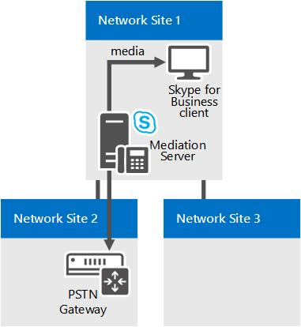

# Componentes y topologías para llamar al control de admisión de Skype para la empresa

Planear el servicio de control de admisión de llamadas (CAC) si tiene una red MPLS, un tronco SIP o una puerta de enlace RTC o PBX de terceros. Se aplica a Skype para Business Server Enterprise Voice.

Los temas de esta sección ofrecen información sobre las consideraciones especiales para implementar el servicio de control de admisión de llamadas (CAC) con diversos tipos de topologías de red.

## Servicio de control de admisión de llamadas en una red MPLS

En una red de conmutación de etiquetas multiprotocolo (MPLS), todos los sitios se conectan a través de una malla completa. Es decir, todos los sitios se conectan directamente a la red troncal del proveedor de servicios de Internet MPLS y se proporciona ancho de banda a todos los sitios para que lo usen a través de un vínculo WAN a la nube MPLS. No existe ningún concentrador de red ni ningún sitio central que controle el enrutamiento IP. En la siguiente figura se muestra una red sencilla basada en la tecnología MPLS.

**Red MPLS de ejemplo**

Para implementar el servicio de control de admisión de llamadas (CAC) en una red MPLS necesitas crear una región de red que represente la nube MPLS y un sitio de red que represente cada uno de los sitios satélite MPLS. En la siguiente figura se muestra cómo tendrán que configurarse la región de red y los sitios de red para representar la red MPLS de ejemplo de la figura anterior. Los límites de ancho de banda generales y los límites de sesión de ancho de banda se basan en la capacidad del vínculo WAN desde el sitio de red hasta la región de red que representa la nube MPLS.

**Región de red y sitios de red para una red MPLS**

## Servicio de control de admisión de llamadas en un tronco SIP

Para implementar el servicio de control de admisión de llamadas (CAC) en un tronco SIP necesitas crear un sitio de red para representar al proveedor de servicios de telefonía por Internet (ITSP). Para aplicar valores de directivas de ancho de banda al tronco SIP necesitas crear una directiva entre el sitio de red de tu empresa y el sitio de red que crees para representar al ITSP.

La siguiente figura muestra un ejemplo de implementación de CAC en un tronco SIP.

**Configuración de CAC en un tronco SIP**

Para configurar el CAC en un tronco SIP necesitarás realizar las siguientes tareas durante la implementación de CAC:

1. Crea un sitio de red para representar al ITSP. Asocia el sitio de red a una región de red adecuada y asigna un ancho de banda de cero para el audio y el vídeo para este sitio de red. Para obtener más información, mira [Configure Network Sites for CAC](https://technet.microsoft.com/library/afcea38f-5789-45ec-97af-c6e38364950c.aspx) en la documentación sobre implementación.

    > [!NOTE]
    > Para el ITSP, no funciona esta configuración de sitio de red. Los valores de la directiva de ancho de banda se aplican, en realidad, en el paso 2.

2. Crea un vínculo entre sitios para el tronco SIP, usando los valores de los parámetros correspondientes al sitio que creaste en el paso 1. Por ejemplo, usa el nombre del sitio de red de tu empresa como el valor del parámetro NetworkSiteID1 y el sitio de red de ITSP como el valor del parámetro NetworkSiteID2. Para obtener información detallada, vea [directivas entre sitios de red crear en Skype para Business Server](../../deploy/deploy-enterprise-voice/create-network-intersite-policies.md) en la documentación de implementación y [New-CsNetworkInterSitePolicy](https://docs.microsoft.com/powershell/module/skype/new-csnetworkintersitepolicy?view=skype-ps).

3. Obtener la dirección IP del controlador de borde de sesión (SCB) de punto de terminación de medios desde el protocolo. Agrega esa dirección IP con una máscara de subred de 32 al sitio de red que representa al ITSP. Para obtener más información, mira [Associate a Subnet with a Network Site](https://technet.microsoft.com/library/aa69e3ac-542a-4ba1-9582-2e6bee29f633.aspx).

## Servicio de control de admisión de llamadas con una PBX o una puerta de enlace RTC de terceros

En este tema se describe algunos ejemplos de cómo se puede implementar el control de admisión de llamadas (CAC) en el vínculo entre la interfaz de puerta de enlace del servidor de mediación y una puerta de enlace de terceros telefónica conmutada (RTC) de la red o una central de conmutación (PBX).

### Caso 1: servicio de control de admisión de llamadas entre el servidor de mediación y una puerta de enlace RTC

CAC se puede implementar en la WAN vínculo de la interfaz de puerta de enlace del servidor de mediación a una puerta de enlace de terceros PBX o RTC.

**Caso 1: servicio de control de admisión de llamadas entre el servidor de mediación y una puerta de enlace RTC**

En este ejemplo, se aplica el CAC entre el servidor de mediación y una puerta de enlace de RTC. Si un Skype para usuarios de cliente de empresa en el sitio de red 1 realiza una llamada de RTC a través de la puerta de enlace RTC en el sitio de red 2, la comunicación se transmite a través del vínculo WAN. Por tanto, se llevan a cabo dos comprobaciones de CAC para cada sesión de RTC:

- Entre la Skype para la aplicación empresarial de cliente y el servidor de mediación

- Entre el servidor de mediación y la puerta de enlace de RTC

Esto funciona tanto para las llamadas RTC entrantes a un cliente en el sitio de red 1 como para las llamadas RTC salientes desde una aplicación cliente en el sitio de red 1.

> [!NOTE]
> Asegúrate de que la subred IP a la que pertenece la puerta de enlace RTC esté configurada y asociada con el sitio de red 2.

> [!NOTE]
> Asegúrese de que la subred IP a la que pertenezcan ambas interfaces del servidor de mediación esté configurada y asociada con el sitio de red 1.

> [!NOTE]
> Para obtener más información, mira [Associate a Subnet with a Network Site](https://technet.microsoft.com/library/aa69e3ac-542a-4ba1-9582-2e6bee29f633.aspx).

### Caso 2: CAC entre el servidor de mediación y una PBX de terceros con punto de terminación de medios

Esta configuración es similar a la del caso 1. En ambos casos la, el servidor de mediación sabe en qué dispositivo termina medios en el extremo opuesto del vínculo WAN y la dirección IP de la puerta de enlace RTC o PBX con punto de terminación de medios (MTP) está configurada en el servidor de mediación como el próximo salto.

**Caso 2: servicio de control de admisión de llamadas entre el servidor de mediación y una PBX de terceros con MTP**

En este ejemplo, se aplica el CAC entre el servidor de mediación y la PBX o el MTP. Si un Skype para usuarios de cliente de empresa en el sitio de red 1 realiza una llamada de RTC a través de la PBX o el MTP que se encuentra en el sitio de red 2, la comunicación se transmite a través del vínculo WAN. Por tanto, se llevan a cabo dos comprobaciones de CAC para cada sesión de RTC:

- Entre la Skype para la aplicación empresarial de cliente y el servidor de mediación

- Entre el servidor de mediación y la PBX o el MTP

Esto funciona tanto para las llamadas RTC entrantes a un cliente en el sitio de red 1 como para las llamadas RTC salientes desde un cliente en el sitio de red 1.

> [!NOTE]
> Asegúrate de que la subred IP a la que pertenece el MTP esté configurada y asociada con el sitio de red 2.

> [!NOTE]
> Asegúrese de que la subred IP a la que pertenezcan ambas interfaces del servidor de mediación esté configurada y asociada con el sitio de red 1.

> [!NOTE]
> Para obtener más información, mira [Associate a Subnet with a Network Site](https://technet.microsoft.com/library/aa69e3ac-542a-4ba1-9582-2e6bee29f633.aspx).

### Caso 3: CAC entre el servidor de mediación y una PBX de terceros sin un punto de terminación de medios

El caso 3 es ligeramente diferente a los dos primeros casos. Si no hay ningún MTP en el sistema PBX de terceros, para una sesión saliente solicitud a la PBX de terceros el servidor de mediación no sabe donde medios finalizará en el límite de PBX. En este caso, la comunicación se transmite directamente entre el servidor de mediación y el dispositivo de extremo de otro fabricante.

**Caso 3: servicio de control de admisión de llamadas entre el servidor de mediación y una PBX de terceros sin MTP**

En este ejemplo, si un Skype para usuarios de cliente de empresa en el sitio de red 1 realiza una llamada a un usuario a través de la PBX, el servidor de mediación es capaz de llevar a cabo comprobaciones CAC sólo en el tramo de proxy entre (Skype para la aplicación empresarial de cliente) y servidor de mediación. Debido a que el servidor de mediación no tiene información sobre el dispositivo de extremo mientras se está solicitando la sesión, no se puede realizar comprobaciones CAC en la WAN vínculo (entre el servidor de mediación y el extremo de otro fabricante) antes de establecimiento de llamada. Sin embargo, una vez establecida la sesión, el servidor de mediación facilita en Contabilidad para el ancho de banda usado en el tronco.

Para las llamadas que se originan desde el punto final de otro fabricante, la información acerca de ese dispositivo de extremo está disponible en el momento de la solicitud de sesión y verificación CAC puede realizarse en ambos lados del servidor de mediación.

> [!NOTE]
> Asegúrate de que la subred IP a la que pertenecen los dispositivos de extremo esté configurada y asociada con el sitio de red 2.

> [!NOTE]
> Asegúrese de que la subred IP a la que pertenezcan ambas interfaces del servidor de mediación esté configurada y asociada con el sitio de red 1.

> [!NOTE]
> Para obtener más información, mira [Associate a Subnet with a Network Site](https://technet.microsoft.com/library/aa69e3ac-542a-4ba1-9582-2e6bee29f633.aspx).

