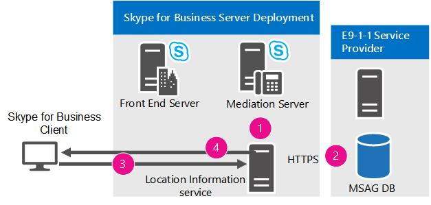

# Planear los servicios de emergencia en Skype Empresarial ServerPlan for emergency services in Skype for Business Server

Obtenga información sobre los servicios mejorados de 9-1-1 (E9-1-1) en Skype Empresarial Server Telefonía IP empresarial, incluida la adquisición de ubicación y el enrutamiento de llamadas.Learn about Enhanced 9-1-1 (E9-1-1) services in Skype for Business Server Enterprise Voice, including location acquiring and call routing.

Skype Empresarial Server admite servicios mejorados 9-1-1 (E9-1-1) en los Estados Unidos como parte de una Telefonía IP empresarial implementación.Skype for Business Server supports Enhanced 9-1-1 (E9-1-1) services within the United States as part of an Enterprise Voice deployment. E9-1-1 es una característica de envío de emergencia que asocia un llamada 9-1-1 con una ubicación de respuesta de emergencia (ERL) que consta de direcciones de la ciudad (es decir, calle) y otra información de ubicación más específica, como los números de planta, para las llamadas de edificios de oficinas y otras instalaciones multiempresa.E9-1-1 is an emergency dispatch feature that associates a 9-1-1 call with an Emergency Response Location (ERL) that consists of civic (that is, street) addresses and other more specific location information, such as floor numbers, for calls from office buildings and other multitenant facilities. Mediante el uso de la ERL proporcionada, un Punto de respuesta de seguridad pública (PSAP) puede enviar inmediatamente a los primeros usuarios que responden a la persona que realiza la llamada en apuros con un riesgo menor de dirigir inadvertidamente al interlocutor a una ubicación incorrecta o es ambigua.By using the provided ERL, a Public Safety Answering Point (PSAP) can immediately dispatch first responders to the caller in distress with reduced risk of inadvertently directing the responder to an incorrect or ambiguous location.

> [!NOTE]
> Skype Empresarial Server ahora admite la configuración de varios números de emergencia para un cliente.Skype for Business Server now supports the configuration of multiple emergency numbers for a client. Para obtener más información, vea [Plan for multiple emergency numbers in Skype for Business Server](multiple-emergency-numbers.md).For more information see [Plan for multiple emergency numbers in Skype for Business Server](multiple-emergency-numbers.md).

> [!NOTE]
> Skype Empresarial Server tiene tres características Telefonía IP empresarial avanzadas: control de admisión de llamadas, servicios de emergencia (E9-1-1) y desvío de medios.Skype for Business Server has three advanced Enterprise Voice features: call admission control, emergency services (E9-1-1), and media bypass. Para obtener información general sobre la planeación que es común a las tres características, vea Configuración de red para las características Telefonía IP empresarial avanzadas en [Skype Empresarial Server](network-settings-for-advanced-features.md).For an overview of planning information that is common to all three of these features, see [Network settings for the advanced Enterprise Voice features in Skype for Business Server](network-settings-for-advanced-features.md).

Skype Empresarial Server admite llamadas mejoradas 9-1-1 (E9-1-1) desde clientes de Skype Empresarial y dispositivos Lync Phone Edition.Skype for Business Server supports Enhanced 9-1-1 (E9-1-1) calling from Skype for Business clients and Lync Phone Edition devices. Al configurar Skype Empresarial Server para E9-1-1, las llamadas de emergencia realizadas desde Skype Empresarial o Lync Phone Edition incluyen información de ubicación de respuesta de emergencia (ERL) de la base de datos del servicio de información de ubicación.When you configure Skype for Business Server for E9-1-1, emergency calls placed from Skype for Business or Lync Phone Edition include Emergency Response Location (ERL) information from the Location Information service database. Las ERL se componen de direcciones civiles (es decir, postales) e información adicional que ayuda a identificar con mayor precisión una ubicación en edificios de oficinas y otras instalaciones con varios inquilinos.ERLs consist of civic (that is, street) addresses and other information that helps to identify a more precise location in office buildings and other multitenant facilities. Cuando un usuario realiza una llamada de emergencia, Skype Empresarial Server enruta el audio de la llamada, junto con la ubicación y la información de devolución de llamada, a través de un servidor de mediación a un proveedor de servicios E9-1-1.When a user makes an emergency call, Skype for Business Server routes the call audio, along with the location and callback information, through a Mediation Server to an E9-1-1 service provider. Desde aquí se facilita la ubicación del autor de la llamada junto con una clave de consulta de servicios de emergencia (ESQK) que permite al PSAP buscar la ERL de esta persona.The E9-1-1 service provider uses the civic address of the caller to route the call to the Public Safety Answering Point (PSAP) that serves the caller's location, and sends along an Emergency Service Query Key (ESQK) that the PSAP uses to look up the caller's ERL.

Skype Empresarial Server admite dos métodos para enrutar llamadas de emergencia a un proveedor de servicios E9-1-1:Skype for Business Server supports two methods for routing emergency calls to an E9-1-1 service provider:

- Una conexión de enlace troncal SIP (Protocolo de inicio de sesión) a un proveedor de servicios E9-1-1 cualificado.A Session Initiation Protocol (SIP) trunk connection to a qualified E9-1-1 service provider

- Una puerta de enlace de número de identificación de ubicación de emergencia (ELIN) a un proveedor de servicios E9-1-1 basado en una Red telefónica conmutada (RTC).An Emergency Location Identification Number (ELIN) gateway to a public switched telephone (PSTN)-based E9-1-1 service provider

Cuando se usa un proveedor de servicios E9-1-1 de tronco SIP, se agregan ERLs a la base de datos del servicio de información de ubicación y, a continuación, se validan las ubicaciones con una Guía maestra de direcciones de calle (MSAG) que mantiene el proveedor de servicios E9-1-1.When you use a SIP trunk E9-1-1 service provider, you add ERLs to the Location Information service database, and then validate the locations against a Master Street Address Guide (MSAG) that is maintained by the E9-1-1 service provider. Si un proveedor de servicios E9-1-1 recibe una llamada que no tiene información de ubicación o tiene una ubicación que no se ha validado en MSAG, el proveedor de servicios E9-1-1 enruta la llamada a un Centro de respuesta a llamadas de emergencia (ECRC) nacional o regional, que está formado por personal especialmente formado que obtiene verbalmente la ubicación del autor de la llamada, si es posible, y enruta manualmente la llamada al PSAP adecuado.If an E9-1-1 service provider receives a call that doesn't have location information or has a location that has not been validated against the MSAG, the E9-1-1 service provider routes the call to a national/regional Emergency Call Response Center (ECRC), which is staffed with specially trained personnel who verbally obtain the caller's location, if possible, and manually route the call to the appropriate PSAP. Algunos proveedores de servicios E9-1-1 de enlace troncal SIP también proporcionan a los clientes un número de marcado directo (DID) de RTC para el ECRC, que constituye un medio alternativo de enrutamiento de las llamadas al 9-1-1 si por algún motivo se produce un error en el enlace troncal SIP.(Some SIP trunk E9-1-1 service providers also provide customers with a PSTN direct inward dialing (DID) number to the ECRC, which provides an alternate means of routing 9-1-1 calls, if the SIP trunk fails for any reason.)

A diferencia de la multiplexación de división de tiempo (TDM) y los teléfonos de central de conmutación (PBX) basados en IP, que tienen ubicaciones fijas, un extremo de Skype Empresarial puede ser muy móvil.Unlike time division multiplexing (TDM) and IP-based private branch exchange (PBX) phones, which have fixed locations, a Skype for Business endpoint can be very mobile. Al implementar la característica E9-1-1, Skype Empresarial Server ayuda a garantizar que, independientemente de dónde se encuentra el autor de la llamada, la llamada de emergencia se puede enrutar al PSAP que sirve la ubicación del autor de la llamada.When you deploy the E9-1-1 feature, Skype for Business Server helps to ensure that no matter where a caller is located, the emergency call can be routed to the PSAP that serves the caller's location. Por ejemplo, si la oficina principal de un usuario se encuentra en Redmond, Washington, pero el usuario hace una llamada de emergencia desde un equipo de una sucursal en Wichita, Kansas, el tronco SIP o el proveedor de servicios E9-1-1 basado en RTC enrutarán la llamada al PSAP en Wichita, no al PSAP en Redmond.For example, if a user's main office is located in Redmond, Washington, but the user places an emergency call from a computer in a branch office in Wichita, Kansas, the SIP trunk or PSTN-based E9-1-1 service provider will route the call to the PSAP in Wichita, not to the PSAP in Redmond.

Cuando se usa una puerta de enlace ELIN, también se agregan LASR a la base de datos del servicio de información de ubicación, pero también se incluye un número ELIN para cada ubicación.When you use an ELIN gateway, you also add ERLs to the Location Information service database, but you include also an ELIN number for each location. El número ELIN pasa a ser el número de llamada SOS durante la llamada.The ELIN number becomes the emergency calling number during the emergency call. Debe comprobar que el proveedor de RTC carga los ELIN en una base de datos de identificación de ubicación automática (ALI).You must then make sure that your PSTN carrier uploads the ELINs to the Automatic Location Identification (ALI) database.

> [!NOTE]
> Los dispositivos analógicos conectados a Skype Empresarial no pueden recibir información de ubicación del servicio de información de ubicación ni transmitir la ubicación al proveedor de servicios E9-1-1.Skype for Business-connected analog devices cannot receive location information from the Location Information service or transmit location to the E9-1-1 service provider.

 Si usa la opción del proveedor de servicios E9-1-1 de enlace troncal SIP y tiene que admitir llamadas E9-1-1 desde teléfonos analógicos, tiene dos opciones:If you use the SIP trunk E9-1-1 service provider option and need to support E9-1-1 from analog phones, you have two options:

- **Opción PS-ALI tradicional** Si tienes puertas de enlace RTC locales en cada sitio donde se implementan teléfonos analógicos y cada teléfono analógico tiene un DID, puedes aprovisionar la ubicación del dispositivo analógico directamente con un proveedor de servicios de identificación de ubicación automática (PS-ALI).**Traditional PS-ALI option** If you have local PSTN gateways at each site where analog phones are deployed and each analog phone has a DID, you can provision the analog device's location directly with a Private Switch/Automatic Location Identification (PS-ALI) service provider. En este caso, se configuran directivas de voz de Skype Empresarial especialmente diseñadas y se asignan a los objetos de contacto de dispositivo analógico para que las llamadas E9-1-1 de esos teléfonos se enruten directamente a través de la puerta de enlace local al proveedor rtc que proporciona servicios al sitio (en lugar de enrutar la llamada a un tronco SIP del proveedor de servicios E9-1-1).In this case, you configure specially-crafted Skype for Business voice policies and assign them to the analog device contact objects so that E9-1-1 calls from those phones route directly through the local gateway to the PSTN provider that services the site (instead of routing the call to an E9-1-1 service provider SIP trunk). Cuando se realiza una llamada SOS, una base de datos de un proveedor de PS-ALI asociado con el enlace troncal de RTC asigna el DID de cada teléfono analógico a una ubicación física, y proporciona esta ubicación al PSAP.When an emergency call is placed, a database at a PS-ALI provider that is associated with the PSTN trunk maps the DID of each analog phone to a physical location and provides this location to the PSAP. Estos registros deben actualizarse con el proveedor de servicios de PS-ALI cada vez que los teléfonos se desplazan a ERL diferentes.These records must be updated with the PS-ALI service provider every time phones are moved to different ERLs.

- Opción de proveedor de servicios **E9-1-1** Puede registrar los DID de teléfono analógico y sus ERLs correspondientes con el proveedor de servicios E9-1-1, si es compatible con el proveedor de servicios E9-1-1.**E9-1-1 service provider option** You can register the analog phone DIDs and their corresponding ERLs with the E9-1-1 service provider, if this is supported by the E9-1-1 service provider. Si el proveedor recibe una llamada de Skype Empresarial Server que no incluye datos PIDF-LO, el proveedor puede ver si hay una coincidencia de base de datos en el número DID de la parte que realiza la llamada.If the provider receives a call from Skype for Business Server that doesn't include PIDF-LO data, the provider can see if there is a database match on the calling party's DID number. Mediante el ERL recuperado de su base de datos, el proveedor puede enrutar automáticamente la llamada de emergencia al PSAP correcto y el PSAP recibirá el DID del dispositivo analógico y un registro ESQK que permite al distribuidor buscar la ubicación del autor de la llamada.By using the ERL retrieved from its database, the provider can automatically route the emergency call to the correct PSAP, and the PSAP will receive the DID of the analog device and an ESQK record that allows the dispatcher to lookup the caller's location.

Si usa la opción de puerta de enlace de ELIN y necesita compatibilidad con las llamadas E9-1-1 desde teléfonos analógicos, puede dar la ubicación del dispositivo analógico directamente con el proveedor de servicios PS-ALI, como se describe en la primera opción mencionada anteriormente.If you use the ELIN gateway option and need to support E9-1-1 from analog phones, you can provision the analog device's location directly with the PS-ALI service provider, as described in the first option above.

Desde una perspectiva de Skype Empresarial Server, el proceso E9-1-1 se puede separar en dos fases:From a Skype for Business Server perspective, the E9-1-1 process can be separated into two stages:

- Fase 1: adquisición de una ubicaciónStage 1: Acquiring a location

- Fase 2: enrutamiento de la llamada SOS al proveedor de servicios E9-1-1Stage 2: Routing the emergency call to an E9-1-1 service provider

En esta sección se describe cómo funcionan estas fases.This section describes how these stages work.

Si va a configurar la infraestructura para detectar automáticamente la ubicación del cliente, primero debe decidir qué elementos de red usará para asignar los autores de las llamadas a las ubicaciones.If you plan to configure your infrastructure to automatically detect client location, first you need to decide which network elements you will use to map callers to locations. Para obtener más información sobre las opciones posibles, vea [Definir los elementos de red usados para determinar](network-location.md)la ubicación en Skype Empresarial Server .For details about the possible options, see [Define the network elements used to determine location in Skype for Business Server](network-location.md).

## Adquirir una ubicaciónAcquiring a location

En una implementación de Skype Empresarial Server E9-1-1, cada cliente de Skype Empresarial o Lync Phone Edition conectado internamente adquiere activamente su propia ubicación.In a Skype for Business Server E9-1-1 deployment, each internally-connected Skype for Business or Lync Phone Edition client actively acquires its own location. Después del registro SIP, el cliente proporciona toda la información de conectividad de red que conoce sobre ella en una solicitud de ubicación al servicio de información de ubicación, que es un servicio web con el respaldo de una base de datos SQL Server replicada.After SIP registration, the client furnishes all the network connectivity information that it knows about itself it in a location request to the Location Information service, which is a web service backed by a replicated SQL Server database. Cada grupo de sitios centrales tiene un servicio de información de ubicación, que usa la información de red para consultar sus registros en busca de una ubicación que coincida.Each central site pool has a Location Information service, which uses the network information to query its records for a matching location. Si hay una coincidencia, el servicio de información de ubicación devuelve una ubicación al cliente.If there is a match, the Location Information service returns a location to the client. Si no hay ninguna coincidencia, puede que se pida al usuario que escriba una ubicación manualmente (según la configuración de la directiva de ubicación).If there is not a match, the user may be prompted to enter a location manually (depending on location policy settings). Los datos de ubicación se devuelven al cliente en un formato XML estándar de grupo de trabajo de ingeniería de Internet (IETF) denominado PIDF-LO (Presence Information Data Format Location Object).The location data are transmitted back to the client in an Internet Engineering Task Force (IETF) standardized XML format called Presence Information Data Format Location Object (PIDF-LO).

El cliente de Skype Empresarial incluye los datos PIDF-LO como parte de una llamada de emergencia y el proveedor de servicios E9-1-1 usa estos datos para determinar el PSAP adecuado y enrutar la llamada a ese PSAP junto con el ESQK correcto, lo que permite al distribuidor de PSAP obtener la ubicación del autor de la llamada.The Skype for Business client includes the PIDF-LO data as part of an emergency call, and this data is used by the E9-1-1 service provider to determine the appropriate PSAP and route the call to that PSAP along with the correct ESQK, which allows the PSAP dispatcher to obtain the caller's location.

En el diagrama siguiente se muestra cómo un cliente de Skype Empresarial adquiere una ubicación (excepto para el método de ubicación basada en direcciones MAC del cliente de terceros):The following diagram shows how a Skype for Business client acquires a location (except for the third-party client MAC address-based location method):

Para que el cliente pueda adquirir la ubicación, deben llevarse a cabo los pasos siguientes:For a client to acquire a location, the following steps must take place:

1. El administrador rellena la base de datos del servicio de información de ubicación con el mapa de conexión de red (tablas que asignan varios tipos de direcciones de red a las ubicaciones de respuesta de emergencia (ERLs) correspondientes).The administrator populates the Location Information service database with the network wiremap (tables that map various types of network addresses to corresponding Emergency Response Locations (ERLs)).

2. Si usa un proveedor de servicios E9-1-1 mediante troncos SIP, el administrador valida la parte de la dirección postal de la ERL con una base de datos de guía de direcciones principal (MSAG) del proveedor de servicios E9-1-1. Si usa una puerta de enlace ELIN, el administrador se asegura de que el operador de RTC cargue los ELIN en la base de datos de identificación de ubicación automática (ALI).If you use a SIP trunk E9-1-1 service provider, the administrator validates the civic address portions of the ERLs against a Master Street Address Guide (MSAG) database maintained by the E9-1-1 service provider. If you use an ELIN gateway, the administrator ensures that the PSTN carrier uploads the ELINs to the Automatic Location Identification (ALI) database.

3. Durante el registro o cuando se produce un cambio de red, un cliente conectado internamente envía una solicitud de ubicación que contiene las direcciones de red detectadas del cliente al servicio de información de ubicación.During registration or whenever a network change occurs, an internally-connected client sends a location request that contains the client's discovered network addresses to the Location Information service.

4. El servicio de información de ubicación consulta sus registros publicados para una ubicación y, si se encuentra una coincidencia, devuelve el ERL al cliente en formato PIDF-LO.The Location Information service queries its published records for a location, and, if a match is found, returns the ERL to the client in PIDF-LO format.

## Enrutamiento de llamadas E9-1-1 con un tronco SIPRouting E9-1-1 calls using a SIP trunk

El uso de troncos SIP para establecer una conexión con un proveedor de servicios E9-1-1 es una de las formas de implementar servicios E9-1-1.Using a SIP trunk to connect to a qualified E9-1-1 service provider is one way that you can deploy E9-1-1. Para obtener detalles sobre el uso de una puerta de enlace ELIN para conectar con un proveedor de servicios E9-1-1 mediante la red pública conmutada (RTC), vea [Routing E9-1-1 Calls by Using an ELIN Gateway](/previous-versions/office/lync-server-2013/lync-server-2013-routing-e9-1-1-calls-by-using-an-elin-gateway).For details about using an ELIN gateway to connect to a public switched telephone network (PSTN)-based E9-1-1 service provider, see [Routing E9-1-1 Calls by Using an ELIN Gateway](/previous-versions/office/lync-server-2013/lync-server-2013-routing-e9-1-1-calls-by-using-an-elin-gateway).

En el siguiente diagrama se muestra cómo se enruta una llamada de emergencia de Skype Empresarial Server al Punto de respuesta de seguridad pública (PSAP) cuando se usa un tronco SIP y un proveedor de servicios E9-1-1 cualificado.The following diagram shows how an emergency call is routed from Skype for Business Server to the Public Safety Answering Point (PSAP) when you use a SIP trunk and qualified E9-1-1 service provider.

**Enrutamiento de llamadas E9-1-1 mediante troncos SIP****Routing E9-1-1 calls through a SIP trunk**

Cuando se hace una llamada de emergencia desde un cliente compatible de Skype Empresarial Server:When an emergency call is placed from a compatible Skype for Business Server client:

1. Una INVITACIÓN SIP que contiene la ubicación, el número de devolución de llamada del autor de la llamada y la dirección URL de notificación (opcional) y el número de devolución de llamada de conferencia se enruta a Skype Empresarial Server.A SIP INVITE that contains the location, the caller's callback number, and the (optional) Notification URL and conference callback number is routed to Skype for Business Server.

2. Skype Empresarial Server coincide con el número de emergencia  y enruta la llamada (en función del valor de uso rtc que se define en la directiva de ubicación aplicable) a un servidor de mediación y, desde allí, a través de un tronco SIP al proveedor de servicios E9-1-1.Skype for Business Server matches the emergency number and routes the call (based on the **PSTN Usage** value that is defined in the applicable location policy) to a Mediation Server, and from there, over a SIP trunk to the E9-1-1 service provider.

3. El proveedor de servicios E9-1-1 enruta la llamada de emergencia al PSAP adecuado según la ubicación proporcionada con la llamada. Cuando el cliente incluye una ubicación de respuesta de emergencia (ERL) validada en la llamada de emergencia, el proveedor dirige automáticamente la llamada al punto PSAP adecuado. Si el usuario especificó la ubicación manualmente, el centro de respuestas a llamadas de emergencia (ECRC) verifica verbalmente en primer lugar la exactitud de la ubicación con la persona que llama antes de enrutar la llamada de emergencia al PSAP.The E9-1-1 service provider routes the emergency call to the correct PSAP based on the location that is provided with the call. When the client includes a validated Emergency Response Location (ERL) with the emergency call, the provider automatically routes the call to the appropriate PSAP. If the location was manually entered by the user, the Emergency Call Response Center (ECRC) first verbally verifies the accuracy of the location with the caller before routing the emergency call to the PSAP.

4. Si configuró la directiva de ubicación para las notificaciones, uno o varios de los responsables de seguridad de su organización se envían un mensaje instantáneo de notificación de emergencia de Skype Empresarial especial.If you configured the location policy for notifications, one or more of your organization's security officers are sent a special Skype for Business emergency notification instant message. Este mensaje siempre aparece en la pantalla de los agentes de seguridad y contiene el nombre, el número de teléfono, la hora y la ubicación del autor de la llamada, lo que permite al personal de seguridad responder rápidamente al autor de la llamada de emergencia mediante un mensaje instantáneo o una voz.This message always pops up on the security officers' screen(s) and contains the caller's name, phone number, time, and location, enabling security personnel to quickly respond to the emergency caller by using an instant message or voice.

5. Si ha configurado la directiva de ubicación para las conferencias y el proveedor de servicios E9-1-1 lo admite, el departamento de seguridad se unirá a la llamada en conferencia con audio unidireccional o bidireccional.If you configured the location policy for conferencing and it is supported by the E9-1-1 service provider, an internal Security Desk is conferenced into the call with either one-way audio or two-way audio.

6. Si la llamada se interrumpe de forma prematura, el PSAP usa el número de devolución de llamada para contactar directamente con la persona que llama.If the call is broken prematurely, the PSAP uses the callback number to contact the caller directly.

## Enrutamiento de llamadas E9-1-1 mediante una puerta de enlace ELINRouting E9-1-1 calls by using an ELIN gateway

Algunos asociados del Programa de interoperabilidad abierto de comunicaciones unificadas proporcionan puertas de enlace de número de identificación de ubicación de emergencia (ELIN), que constituyen una alternativa a las conexiones troncales SIP con un proveedor de servicio E9-1-1 cualificado.Some partners in the Unified Communications Open Interoperability Program provide qualified Emergency Location Identification Number (ELIN)-capable gateways, which can serve as an alternative to a SIP trunk connection to a qualified E9-1-1 service provider. Las puertas de enlace ELIN admiten la conectividad ISDN o de contabilización de mensajes automática y centralizada (CAMA) con servicios E9-1-1 basados en la red telefónica conmutada (RTC).ELIN gateways support ISDN or Centralized Automatic Message Accounting (CAMA) connectivity to public switched telephone network (PSTN)-based E9-1-1 services. Para obtener más información acerca de los partners que proporcionan puertas de enlace de ELIN y vínculos a su documentación, vea [Infrastructure qualified for Microsoft Lync](../../../SfbPartnerCertification/lync-cert/qualified-ip-pbx-gateway.md) and [Telephony Infrastructure for Skype for Business](../../../SfbPartnerCertification/certification/infra-gateways.md).For details about partners who provide ELIN gateways and links to their documentation, see [Infrastructure qualified for Microsoft Lync](../../../SfbPartnerCertification/lync-cert/qualified-ip-pbx-gateway.md) and [Telephony Infrastructure for Skype for Business](../../../SfbPartnerCertification/certification/infra-gateways.md).

Al igual que las conexiones troncales SIP con proveedores de servicios E9-1-1, las puertas de enlace ELIN también proporcionan los medios para enrutar una llamada de emergencia al punto de respuesta de seguridad pública (PSAP) más adecuado del autor de la llamada, pero estas puertas de enlace usan un ELIN como identificador de ubicación.Like SIP trunk connections to E9-1-1 service providers, ELIN gateways also provide the means of routing an emergency call to the caller's most appropriate Public Safety Answering Point (PSAP), but these gateways use an ELIN as the location identifier. Defina ELIN para cada ubicación de respuesta de emergencia (ERL) de su organización (para obtener más información, vea Administrar ubicaciones para puertas de enlace [ELIN](elin-gateways.md)en Skype Empresarial Server ).You define ELINs for each Emergency Response Location (ERL) in your organization (for details, see [Manage locations for ELIN gateways in Skype for Business Server](elin-gateways.md)).

Cuando usa una puerta de enlace ELIN para llamadas de emergencia, usa la misma infraestructura de Skype Empresarial Server E9-1-1 que usaría para una conexión troncal SIP.When you use an ELIN gateway for emergency calls, you use the same Skype for Business Server E9-1-1 infrastructure that you would use for a SIP trunk connection. Es decir, la base de datos del servicio de información de ubicación proporciona la ubicación al cliente de Skype Empresarial y la directiva de ubicación habilita la característica y define el enrutamiento.That is, the Location Information service database provides the location to the Skype for Business client, and the location policy enables the feature and defines the routing. Sin embargo, con una puerta de enlace ELIN, debe agregar los ELIN a la base de datos del servicio de información de ubicación y hacer que el operador RTC los cargue en la base de datos de identificación automática de ubicación (ALI).With an ELIN gateway, however, you need to add the ELINs to the Location Information service database and have your PSTN carrier upload them to the Automatic Location Identification (ALI) database.

Cuando un cliente de Skype Empresarial obtiene su ubicación del servicio de información de ubicación, la ubicación incluye el ELIN.When a Skype for Business client obtains its location from the Location Information service, the location includes the ELIN. Durante las llamadas de emergencia, el ELIN se incluye con la información de ubicación que se envía a la puerta de enlace ELIN.During an emergency call, the ELIN is included with the location sent to the ELIN gateway. Esta puerta de enlace identifica la llamada como llamada de emergencia y cambia el número de la persona que llama por el ELIN.The ELIN gateway identifies the call as an emergency call and swaps the calling party's number with the ELIN. A continuación, la puerta de enlace ELIN enruta la llamada al RTC con el ELIN como número llamante.The ELIN gateway then routes the call to the PSTN with the ELIN as the calling number. El proveedor de servicios E9-1-1 de RTC busca el ELIN en la base de datos ALI, que actúa como una base de datos adicional a la base de datos de guía de direcciones principal (MSAG).The PSTN E9-1-1 provider looks up the ELIN in the ALI database, which is a companion database to the Master Street Address Guide (MSAG) database. Acto seguido el operador de RTC envía la llamada al PSAP más adecuado en función de la búsqueda realizada en la base de datos ALI y el PSAP envía el personal de emergencia disponible a la ubicación de la persona que realiza según los resultados de la búsqueda ALI.The PSTN then sends the call to the most appropriate PSAP based on the ALI lookup, and the PSAP sends first responders to the caller's location based on the ALI lookup. El número de llamada se almacena en la memoria caché de la puerta de enlace ELIN durante un tiempo predeterminado para las devoluciones de llamadas.The calling number is cached on the ELIN gateway for a predefined amount of time for callbacks. Durante la devolución de llamada, el PSAP contacta con la puerta de enlace ELIN que, a su vez, cambia el ELIN por el número de llamada directa a la extensión (DID) de la persona que realiza la llamada.During a callback, the PSAP reaches the ELIN gateway, which swaps the ELIN for the caller's direct inward dialing (DID) number.

Las puertas de enlace ELIN solo admiten las llamadas de emergencia desde la red de su organización.ELIN gateways support emergency calls only from within your organization's network. No admiten las llamadas de emergencia realizadas fuera de su red.They do not support emergency calls made from outside your network.

> [!NOTE]
> Para obtener información detallada sobre cómo usar una conexión troncal SIP en las llamadas de emergencia, consulte [Routing E9-1-1 Calls by Using a SIP Trunk](/previous-versions/office/lync-server-2013/lync-server-2013-routing-e9-1-1-calls-by-using-a-sip-trunk).For details about using a SIP trunk connection for emergency calls, see [Routing E9-1-1 Calls by Using a SIP Trunk](/previous-versions/office/lync-server-2013/lync-server-2013-routing-e9-1-1-calls-by-using-a-sip-trunk).

El diagrama siguiente muestra cómo se enruta una llamada de emergencia desde Skype Empresarial Server al PSAP cuando se usa una puerta de enlace ELIN.The following diagram shows how an emergency call is routed from Skype for Business Server to the PSAP when you use an ELIN gateway.

**Enrutamiento de llamadas E9-1-1 con una puerta de enlace ELIN****Routing E9-1-1 calls with an ELIN gateway**

1. Una INVITACIÓN SIP que contiene la ubicación, el número de devolución de llamada del autor de la llamada y la dirección URL de notificación (opcional) y el número de devolución de llamada de conferencia se enruta a Skype Empresarial Server.A SIP INVITE containing the location, the caller's callback number, and the (optional) Notification URL and conference callback number is routed to Skype for Business Server.

2. Skype Empresarial Server coincide con el número de emergencia  y, a continuación, enruta la llamada (en función del valor de uso RTC definido en la directiva de ubicación aplicable) a un servidor de mediación y desde allí a una puerta de enlace ELIN.Skype for Business Server matches the emergency number and then routes the call (based on the **PSTN Usage** value defined in the applicable location policy) to a Mediation Server, and from there to an ELIN gateway.

3. La puerta de enlace ELIN enruta la llamada a través de un tronco ISDN o CAMA a la RTC.The ELIN gateway routes the call over an ISDN or CAMA trunk to the PSTN.

4. La RTC identifica la llamada como una llamada de emergencia y la enruta a un enrutador selectivo de E9-1-1 de la red, que busca el número del autor de la llamada en la base de datos ALI para obtener la ubicación geográfica. Tras ello, el enrutador selectivo de E9-1-1 envía la llamada al PSAP más adecuado en función de la información de ubicación que haya suministrado la base de datos ALI.The PSTN identifies the call as an emergency call and routes it to an E9-1-1 selective router in the network. The E9-1-1 selective router looks up the caller's number in the ALI database to obtain the geographical location. The E9-1-1 selective router sends the call to the most appropriate PSAP based on the location information that was retrieved from the ALI database.

5. Si configuró la directiva de ubicación para las notificaciones, uno o varios de los responsables de seguridad de su organización se envían un mensaje instantáneo de notificación de emergencia de Skype Empresarial especial.If you configured the location policy for notifications, one or more of your organization's security officers are sent a special Skype for Business emergency notification instant message. Este mensaje siempre aparece en la pantalla de los agentes de seguridad y contiene el nombre, el número de teléfono, la hora y la ubicación del autor de la llamada, lo que permite al personal de seguridad responder rápidamente al autor de la llamada de emergencia mediante un mensaje instantáneo o una voz.This message always pops up on the security officers' screen(s) and contains the caller's name, phone number, time, and location, enabling security personnel to quickly respond to the emergency caller by using an instant message or voice.

6. En caso de que la llamada se interrumpa antes de tiempo, el PSAP usa el ELIN para ponerse en contacto directamente con el autor de la llamada. La puerta de enlace ELIN intercambia el ELIN por el DID del autor de la llamada.If the call is broken prematurely, the PSAP uses the ELIN to contact the caller directly. The ELIN gateway swaps the ELIN for the caller's DID.