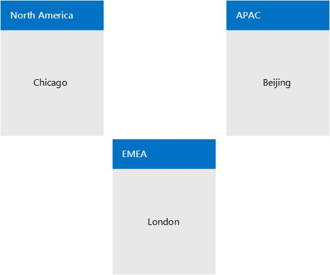

# Ejemplo: Requisitos de recopilación para llamar al control de admisión de Skype para Business ServerExample: Gathering requirements for call admission control in Skype for Business Server
 
Proporciona un ejemplo detallado de la planeación para el control de admisión de llamadas en Skype para Business Server Enterprise Voice, incluida la recopilación de información acerca de sitios, regiones y ancho de banda de la red.Provides a detailed example of planning for call admission control in Skype for Business Server Enterprise Voice, including gathering information about your network's sites, regions, and bandwidth.
  
Este ejemplo muestra cómo planificar e implementar el servicio de control de admisión de llamadas (CAC). De forma general, esto consta de las siguientes actividades:This example shows you how to plan for and implement call admission control (CAC). At a high level, this consists of the following activities:
  
1. Identifica todos los concentradores de red y redes troncales (llamados regiones de red).Identify all of your network hubs and backbones (known as network regions).
    
2. Identificar el Skype para sitio central Business Server que administrará el CAC para cada región de red.Identify the Skype for Business Server central site that will manage CAC for each network region.
    
3. Identifica y define los sitios de red que están conectados a cada región de red.Identify and define the network sites that are connected to each network region.
    
4. Para cada sitio de red cuya conexión a la red WAN está limitada por el ancho de banda, se describe la capacidad de ancho de banda de la conexión WAN y los límites de ancho de banda que al administrador de red ha establecido para Skype para el tráfico de medios Business Server, si procede.For each network site whose connection to the WAN is bandwidth-constrained, describe the bandwidth capacity of the WAN connection and the bandwidth limits that to the network administrator has set for Skype for Business Server media traffic, if applicable. No necesitas incluir sitios cuya conexión a la red WAN no tiene ancho de banda restringido.You do not need to include sites whose connection to the WAN is not bandwidth-constrained.
    
5. Asocia cada subred de la red a un sitio de red.Associate each subnet in your network with a network site.
    
6. Asigna los vínculos entre las regiones de red.Map the links between the network regions. Para cada vínculo, describir su capacidad de ancho de banda y los límites que el Administrador de red ha colocado en Skype para el tráfico de medios de Business Server.For each link, describe its bandwidth capacity and any limits that the network administrator has placed on Skype for Business Server media traffic.
    
7. Define una ruta entre cada par de regiones de red.Define a route between every pair of network regions.
    
## Recopilar la información necesariaGather the Required Information

Para preparar el servicio de control de admisión de llamadas, recopila la información descrita en los pasos siguientes:To prepare for call admission control, gather the information described in the following steps:
  
1. Identifica las regiones de red. Una región de red representa una red troncal de red o un concentrador de red.Identify your network regions. A network region represents a network backbone or a network hub. 
    
    Una red troncal de red o un concentrador de red forma parte de una infraestructura de red informática que interconecta diversas partes de red, que proporciona una ruta de acceso para el intercambio de información entre distintas redes LAN o subredes. Una red troncal puede asociar diversas redes, desde una ubicación pequeña a una amplia zona geográfica. La capacidad de la red troncal suele ser mayor que la de las redes conectadas a ella.A network backbone or a network hub is a part of computer network infrastructure that interconnects various pieces of network, providing a path for the exchange of information between different LANs or subnets. A backbone can tie together diverse networks, from a small location to a wide geographic area. The backbone's capacity is typically greater than that of the networks connected to it.
    
    Nuestra topología de ejemplo tiene tres regiones de red: Norteamérica, EMEA y APAC. Una región de red incluye una colección de sitios de red. Trabaja con el administrador de la red para definir las regiones de red de tu empresa.Our example topology has three network regions: North America, EMEA, and APAC. A network region contains a collection of network sites. Work with your network administrator to define the network regions for your enterprise.
    
2. Identificar el sitio central de cada región de red asociado.Identify each network region's associated central site. Un sitio central contiene al menos un servidor Front-End y el Skype para la implementación de Business Server que administrará el CAC para todo el tráfico de medios que pasa a través de la conexión WAN de la región de red.A central site contains at least one Front End Server and is the Skype for Business Server deployment that will manage CAC for all media traffic that passes through the network region's WAN connection.
    
   **Una red de empresa de ejemplo dividida en tres regiones de red****An example enterprise network divided into three network regions**

     
  
    > [!NOTE]
    > Una red de conmutación de etiquetas multiprotocolo (MPLS) necesita representarse como una región de red en la que cada ubicación geográfica tiene un sitio de red correspondiente.A Multiprotocol Label Switching (MPLS) network should be represented as a network region in which each geographic location has a corresponding network site. Para obtener información detallada, vea [componentes y topologías para llamar al control de admisión de Skype para la empresa](components-and-topologies.md).For details, see [Components and topologies for call admission control in Skype for Business](components-and-topologies.md). 
  
    En el anterior ejemplo de topología de red, hay tres regiones de red, cada uno con un Skype para sitio central Business Server que administra el CAC.In the preceding example network topology, there are three network regions, each with a Skype for Business Server central site that manages CAC. El sitio central adecuado para una región de red se elige por la proximidad geográfica.The appropriate central site for a network region is chosen by the geographic vicinity. Como el tráfico de medios será mayor dentro de las regiones de red, la propiedad por proximidad geográfica lo hace independiente y seguirá siendo funcional aunque otros sitios centrales dejen de estar disponibles.Because media traffic will be heaviest within network regions, the ownership by geographic vicinity makes it self-contained and will continue to be functional even if other central sites become unavailable. 
    
    En este ejemplo, un Skype para la implementación de empresa denominada a Chicago es el sitio central para la región de América del Norte.In this example, a Skype for Business deployment named Chicago is the central site for the North America region.
    
    Todos los Skype para los usuarios de negocio en Norteamérica están hospedados en servidores de la implementación de Chicago.All Skype for Business users in North America are homed on servers in the Chicago deployment. En la tabla siguiente se muestran los sitios centrales de las tres regiones de red.The following table shows central sites for all three network regions.
    
    **Regiones de red y sus sitios centrales asociados****Network Regions and their Associated Central Sites**

    |**Región de red****Network Region**|**Sitio central****Central Site**|
    |:-----|:-----|
    |NorteaméricaNorth America    |ChicagoChicago    |
    |EMEAEMEA    |LondresLondon    |
    |APACAPAC    |PekínBeijing    |
   
    > [!NOTE]
    > Según su Skype de topología de servidores de negocio, el mismo sitio central puede asignarse a varias regiones de red.Depending on your Skype for Business Server topology, the same central site can be assigned to multiple network regions. 
  
3. En cada región de red, identifica todos los sitios de red (oficinas o ubicaciones) cuyas conexiones WAN no tienen ancho de banda restringido. Como estos sitios no tienen ancho de banda restringido, no necesitas aplicarles directivas de ancho de banda de CAC.For each network region, identify all of the network sites (offices or locations) whose WAN connections are not bandwidth-constrained. Because these sites are not bandwidth constrained, you do not need to apply CAC bandwidth policies to them.
    
    En el ejemplo que se muestra en la siguiente tabla, tres sitios de red no tienen vínculos WAN de ancho de banda restringido: Nueva York, Chicago y Detroit.In the example shown in the following table, three network sites do not have bandwidth-constrained WAN links: New York, Chicago, and Detroit.
    
   **Sitios de red no restringidos por el ancho de banda de WAN****Network Sites not Constrained by WAN Bandwidth**

   |**Sitio de red****Network Site**|**Región de red****Network Region**|
   |:-----|:-----|
   |Nueva YorkNew York    |NorteaméricaNorth America    |
   |ChicagoChicago    |NorteaméricaNorth America    |
   |DetroitDetroit    |NorteaméricaNorth America    |
   
4. En cada región de red, identifica todos los sitios de red que se conectan a la región de red a través de vínculos WAN de ancho de banda restringido.For each network region, identify all of the network sites that connect to the network region through bandwidth-constrained WAN links.
    
    Para asegurar la calidad de audio y vídeo, recomendamos que estos sitios de red de ancho de banda restringido tengan las redes WAN supervisadas y directivas de ancho de banda del CAC que limiten el flujo del tráfico de medios (voz o vídeo) hacia la región de red y desde ella.To help ensure audio and video quality, we recommend that these bandwidth-constrained network sites have their WANs monitored and CAC bandwidth policies that limit media (voice or video) traffic flow to and from the network region.
    
    En el ejemplo que se muestra en la siguiente tabla, hay tres sitios de red que están restringidos por el ancho de banda de WAN: Portland, Reno y Albuquerque.In the example shown in the following table, there are three network sites that are constrained by WAN bandwidth: Portland, Reno and Albuquerque.
    
   **Sitios de red restringidos por el ancho de banda de WAN****Network Sites Constrained by WAN Bandwidth**

   |**Sitio de red****Network Site**|**Región de red****Network Region**|
   |:-----|:-----|
   |AlbuquerqueAlbuquerque    |NorteaméricaNorth America    |
   |RenoReno    |NorteaméricaNorth America    |
   |PortlandPortland    |NorteaméricaNorth America    |
   
   **Región de red para CAC Norteamérica con tres sitios de red que no están restringidos por el ancho de banda (Chicago, Nueva York y Detroit) y tres sitios de red que están restringidos por el ancho de banda de WAN (Portland, Reno y Albuquerque)****CAC network region North America with three network sites that are unconstrained by bandwidth (Chicago, New York, and Detroit) and three network sites that are constrained by WAN bandwidth (Portland, Reno, and Albuquerque)**

     
  
5. Para cada vínculo WAN de ancho de banda restringido, determina lo siguiente:For each bandwidth-constrained WAN link, determine the following:
    
  - Límite general de ancho de banda que deseas establecer para todas las sesiones simultáneas de audio.Overall bandwidth limit that you want to set for all concurrent audio sessions. Si una nueva sesión de audio hará que este límite que se supere, Skype para Business Server no permite la sesión iniciar.If a new audio session will cause this limit to be exceeded, Skype for Business Server does not allow the session to start.
    
  - Límite de ancho de banda que deseas establecer para cada sesión individual de audio. El límite predeterminado de ancho de banda para CAC es de 175 kbps, pero el administrador puede modificarlo.Bandwidth limit that you want to set for each individual audio session. The default CAC bandwidth limit is 175 kbps, but it can be modified by the administrator.
    
  - Límite general de ancho de banda que deseas establecer para todas las sesiones simultáneas de vídeo.Overall bandwidth limit that you want to set for all concurrent video sessions. Si una nueva sesión de vídeo hará que este límite que se supere, Skype para Business Server no permite la sesión iniciar.If a new video session will cause this limit to be exceeded, Skype for Business Server does not allow the session to start.
    
  - Límite de ancho de banda que deseas establecer para cada sesión individual de vídeo. El límite predeterminado de ancho de banda para CAC es de 700 kbps, pero el administrador puede modificarlo.Bandwidth limit that you want to set for each individual video session. The default CAC bandwidth limit is 700 kbps, but it can be modified by the administrator.
    
    **Sitios de red con información de restricción de ancho de banda de WAN (ancho de banda en kbps)****Network Sites with WAN Bandwidth Constraint Information (Bandwidth in kbps)**

    |**Sitio de red****Network Site**|**Región de red****Network Region**|**Límite de ancho de banda****BW Limit**|**Límite de audio****Audio Limit**|**Límite de sesión de audio****Audio Session Limit**|**Límite de vídeo****Video Limit**|**Límite de sesión de vídeo****Video Session Limit**|
    |:-----|:-----|:-----|:-----|:-----|:-----|:-----|
    |AlbuquerqueAlbuquerque    |NorteaméricaNorth America    |5.0005,000    |2.0002,000    |175175    |1.4001,400    |700700    |
    |RenoReno    |NorteaméricaNorth America    |10.00010,000    |4.0004,000    |175175    |2.8002,800    |700700    |
    |PortlandPortland    |NorteaméricaNorth America    |5.0005,000    |4.0004,000    |175175    |2.8002,800    |700700    |
    |Nueva YorkNew York    |NorteaméricaNorth America    |(sin límite)(no limit)    |(sin límite)(no limit)    |(sin límite)(no limit)    |(sin límite)(no limit)    |(sin límite)(no limit)    |
    |ChicagoChicago    |NorteaméricaNorth America    |(sin límite)(no limit)    |(sin límite)(no limit)    |(sin límite)(no limit)    |(sin límite)(no limit)    |(sin límite)(no limit)    |
    |DetroitDetroit    |NorteaméricaNorth America    |(sin límite)(no limit)    |(sin límite)(no limit)    |(sin límite)(no limit)    |(sin límite)(no limit)    |(sin límite)(no limit)    |
   
6. Para cada subred de la red, especifica el sitio de red asociado.For every subnet in your network, specify its associated network site.
    
    > [!IMPORTANT]
    > Cada subred de la red necesita estar asociada a un sitio de red, aunque el sitio de red no esté restringido por el ancho de banda. Esto es porque el servicio de control de admisión de llamadas usa la información de la subred para determinar el sitio de red en que está situado un extremo. Cuando se determinan las ubicaciones de ambas partes de la sesión, el servicio de control de admisión de llamadas puede determinar si existe suficiente ancho de banda para establecer una llamada. Cuando se establece una sesión a través de un vínculo que no tiene límites de ancho de banda, se genera una alerta.Every subnet in your network must be associated with a network site, even if the network site is not bandwidth constrained. This is because call admission control uses subnet information to determine at which network site an endpoint is located. When the locations of both parties in the session are determined, call admission control can determine if there is sufficient bandwidth to establish a call. When a session is established over a link that has no bandwidth limits, an alert is generated. 
  
    > [!IMPORTANT]
    > Si implementas servidores perimetrales de audio o vídeo, las direcciones IP públicas de cada servidor perimetral necesitan estar asociadas al sitio de red en el que se implementa el servidor perimetral.If you deploy Audio/Video Edge Servers, the public IP addresses of each Edge Server must be associated with the network site where the Edge Server is deployed. Cada dirección IP pública del servidor perimetral A/V necesita agregarse a las opciones de configuración de la red como subred con una máscara de subred de 32.Each public IP address of the A/V Edge Server must be added to your network configuration settings as a subnet with a subnet mask of 32. Por ejemplo, si implementas servidores perimetrales A/V en Chicago, para cada dirección IP externa de los servidores, crea una subred con una máscara de subred de 32 y asocia el sitio de red Chicago a dichas subredes.For example, if you deploy A/V Edge Servers in Chicago, then for each external IP address of those servers create a subnet with a subnet mask of 32 and associate network site Chicago with those subnets. Para obtener información detallada acerca de las direcciones IP públicas, vea [Planear los requisitos de red de Skype para la empresa](../../plan-your-deployment/network-requirements/network-requirements.md).For details about public IP addresses, see [Plan network requirements for Skype for Business](../../plan-your-deployment/network-requirements/network-requirements.md). 
  
    Aparecerá una alerta de indicador de estado clave (KHI), que especifica una lista de direcciones IP que están incluidas en la red, pero que no están asociadas a una subred; o bien, la subred que incluye las direcciones IP no está asociada a un sitio de red. Esta alerta no aparecerá más que una vez en un período de 8 horas. A continuación se ofrece la información sobre las alertas relevante y un ejemplo:A Key Health Indicator (KHI) alert is raised, specifying a list of IP addresses that are present in your network but are either not associated with a subnet, or the subnet that includes the IP addresses is not associated with a network site. This alert will not be raised more than once within an 8 hour period. The relevant alert information and an example are as follows:
    
    **Origen**: servicio de directivas de ancho de banda CS (principal)**Source**: CS Bandwidth Policy Service (Core) 
    
    **Número de evento**: 36034**Event number**: 36034
    
    **Nivel**: 2**Level**: 2
    
    **Descripción**: las subredes de las siguientes direcciones IP: \<lista de direcciones IP\> no son está configurada o las subredes no están asociadas a un sitio de red.**Description**: The subnets for the following IP Addresses: \<List of IP Addresses\> are either not configured or the subnets are not associated to a network site. 
    
    **Causa**: las subredes de las correspondientes direcciones IP faltan en las opciones de configuración de la red o las subredes no están asociadas a un sitio de red.**Cause**: The subnets for the corresponding IP addresses are missing from the network configuration settings or the subnets are not associated to a network site. 
    
    **Solución**: agregue las subredes correspondientes a la lista anterior de direcciones IP a las opciones de configuración de red y asocie cada subred a un sitio de red.**Resolution**: Add subnets corresponding to the preceding list of IP addresses into the network configuration settings and associate every subnet to a network site.
    
    Por ejemplo, si la lista de direcciones IP de la alerta especifica 10.121.248.226 y 10.121.249.20, estas direcciones IP no están asociadas a una subred o la subred a la que están asociadas no pertenece a un sitio de red. Si 10.121.248.0/24 y 10.121.249.0/24 son las subredes correspondientes a estas direcciones, este problema se puede resolver de la siguiente manera:For example, if the IP address list in the alert specifies 10.121.248.226 and 10.121.249.20, either these IP addresses are not associated with a subnet, or the subnet that they are associated with does not belong to a network site. If 10.121.248.0/24 and 10.121.249.0/24 are the corresponding subnets for these addresses, you can resolve this issue as follows:
    
    a.a. Asegúrese de que la dirección IP 10.121.248.226 esté asociada a la subred 10.121.248.0/24 y la dirección IP 10.121.249.20 esté asociada a la subred 10.121.249.0/24.Be sure that IP address 10.121.248.226 is associated with the 10.121.248.0/24 subnet and IP address 10.121.249.20 is associated with the 10.121.249.0/24 subnet.
    
    b.b. Asegúrese de que cada una de las subredes 10.121.248.0/24 y 10.121.249.0/24 esté asociada a un sitio de red.Be sure that the 10.121.248.0/24 and 10.121.249.0/24 subnets are each associated with a network site.
    
   **Sitios de red y subredes asociadas (ancho de banda en kbps)****Network Sites and Associated Subnets (Bandwidth in kbps)**

   |**Sitio de red****Network Site**|**Región de red****Network Region**|**Límite de ancho de banda****BW Limit**|**Límite de audio****Audio Limit**|**Límite de sesión de audio****Audio Session Limit**|**Límite de vídeo****Video Limit**|**Límite de sesión de vídeo****Video Session Limit**|**Subredes****Subnets**|
   |:-----|:-----|:-----|:-----|:-----|:-----|:-----|:-----|
   |AlbuquerqueAlbuquerque    |NorteaméricaNorth America    |5.0005,000    |2.0002,000    |175175    |1.4001,400    |700700    |172.29.79.0/23, 157.57.215.0/25, 172.29.90.0/23, 172.29.80.0/24172.29.79.0/23, 157.57.215.0/25, 172.29.90.0/23, 172.29.80.0/24    |
   |RenoReno    |NorteaméricaNorth America    |10.00010,000    |4.0004,000    |175175    |2.8002,800    |700700    |157.57.210.0/23, 172.28.151.128/25157.57.210.0/23, 172.28.151.128/25    |
   |PortlandPortland    |NorteaméricaNorth America    |5.0005,000    |4.0004,000    |175175    |2.8002,800    |700700    |172.29.77.0/24 10.71.108.0/24, 157.57.208.0/23172.29.77.0/24 10.71.108.0/24, 157.57.208.0/23    |
   |Nueva YorkNew York    |NorteaméricaNorth America    |(sin límite)(no limit)    |(sin límite)(no limit)    |(sin límite)(no limit)    |(sin límite)(no limit)    |(sin límite)(no limit)    |172.29.80.0/23, 157.57.216.0/25, 172.29.91.0/23, 172.29.81.0/24172.29.80.0/23, 157.57.216.0/25, 172.29.91.0/23, 172.29.81.0/24    |
   |ChicagoChicago    |NorteaméricaNorth America    |(sin límite)(no limit)    |(sin límite)(no limit)    |(sin límite)(no limit)    |(sin límite)(no limit)    |(sin límite)(no limit)    |157.57.211.0/23, 172.28.152.128/25157.57.211.0/23, 172.28.152.128/25    |
   |DetroitDetroit    |NorteaméricaNorth America    |(sin límite)(no limit)    |(sin límite)(no limit)    |(sin límite)(no limit)    |(sin límite)(no limit)    |(sin límite)(no limit)    |172.29.78.0/24 10.71.109.0/24, 157.57.209.0/23172.29.78.0/24 10.71.109.0/24, 157.57.209.0/23    |
   
7. En Skype para el control de admisión de llamadas de Business Server, las conexiones entre regiones de red se denominan vínculos de región.In Skype for Business Server call admission control, the connections between network regions are called region links. Para cada vínculo de región, determina lo siguiente, tal como has hecho para los sitios de red:For each region link, determine the following, just as you did for the network sites:
    
   - Límite general de ancho de banda que deseas establecer para todas las sesiones simultáneas de audio.Overall bandwidth limit that you want to set for all concurrent audio sessions. Si una nueva sesión de audio hará que este límite que se supere, Skype para Business Server no permite la sesión iniciar.If a new audio session will cause this limit to be exceeded, Skype for Business Server does not allow the session to start.
    
   - Límite de ancho de banda que deseas establecer para cada sesión individual de audio. El límite predeterminado de ancho de banda para CAC es de 175 kbps, pero el administrador puede modificarlo.Bandwidth limit that you want to set for each individual audio session. The default CAC bandwidth limit is 175 kbps, but it can be modified by the administrator.
    
   - Límite general de ancho de banda que deseas establecer para todas las sesiones simultáneas de vídeo.Overall bandwidth limit that you want to set for all concurrent video sessions. Si una nueva sesión de vídeo hará que este límite que se supere, Skype para Business Server no permite la sesión iniciar.If a new video session will cause this limit to be exceeded, Skype for Business Server does not allow the session to start.
    
   - Límite de ancho de banda que deseas establecer para cada sesión individual de vídeo. El límite predeterminado de ancho de banda para CAC es de 700 kbps, pero el administrador puede modificarlo.Bandwidth limit that you want to set for each individual video session. The default CAC bandwidth limit is 700 kbps, but it can be modified by the administrator.
    
   **Vínculos de región de red con límites de ancho de banda asociados****Network Region links with associated bandwidth limits**

     
  
   **Información de ancho de banda de vínculos de región (ancho de banda en kbps)****Region Link Bandwidth Information (Bandwidth in kbps)**

   |**Nombre del vínculo de región****Region Link Name**|**First Region****First Region**|**Second Region****Second Region**|**Límite de ancho de banda****BW Limit**|**Límite de audio****Audio Limit**|**Límite de sesión de audio****Audio Session Limit**|**Límite de vídeo****Video Limit**|**Límite de sesión de vídeo****Video Session Limit**|
   |:-----|:-----|:-----|:-----|:-----|:-----|:-----|:-----|
   |NA-EMEA-LINKNA-EMEA-LINK    |NorteaméricaNorth America    |EMEAEMEA    |50.00050,000    |20.00020,000    |175175    |14.00014,000    |700700    |
   |EMEA-APAC-LINKEMEA-APAC-LINK    |EMEAEMEA    |APACAPAC    |25.00025,000    |10.00010,000    |175175    |7.0007,000    |700700    |
   
8. Define una ruta entre cada par de regiones de red.Define a route between every pair of network regions.
    
    > [!NOTE]
    > Se requieren dos vínculos para la ruta entre las regiones Norteamérica y APAC porque no existe ningún vínculo de región que las conecte directamente.Two links are required for the route between the North America and APAC regions because there is no region link that directly connects them. 
  
   **Rutas de región****Region Routes**

   |**Nombre de la ruta de región****Region Route Name**|**First Region****First Region**|**Second Region****Second Region**|**Vínculos de región****Region Links**|
   |:-----|:-----|:-----|:-----|
   |NA-EMEA-ROUTENA-EMEA-ROUTE    |NorteaméricaNorth America    |EMEAEMEA    |NA-EMEA-LINKNA-EMEA-LINK    |
   |EMEA-APAC-ROUTEEMEA-APAC-ROUTE    |EMEAEMEA    |APACAPAC    |EMEA-APAC-LINKEMEA-APAC-LINK    |
   |NA-APAC-ROUTENA-APAC-ROUTE    |NorteaméricaNorth America    |APACAPAC    |NA-EMEA-LINK, EMEA-APAC-LINKNA-EMEA-LINK, EMEA-APAC-LINK    |
   
9. Para cada par de sitios de red que estén conectados directamente por un solo vínculo (denominado vínculo entre sitios), determina lo siguiente:For every pair of network sites that are directly connected by a single link (called an inter-site link), determine the following:
    
     - Límite general de ancho de banda que deseas establecer para todas las sesiones simultáneas de audio.Overall bandwidth limit that you want to set for all concurrent audio sessions. Si una nueva sesión de audio hará que este límite que se supere, Skype para Business Server no permite la sesión iniciar.If a new audio session will cause this limit to be exceeded, Skype for Business Server does not allow the session to start.
    
     - Límite de ancho de banda que deseas establecer para cada sesión individual de audio. El límite predeterminado de ancho de banda para CAC es de 175 kbps, pero el administrador puede modificarlo.Bandwidth limit that you want to set for each individual audio session. The default CAC bandwidth limit is 175 kbps, but it can be modified by the administrator.
    
     - Límite general de ancho de banda que deseas establecer para todas las sesiones simultáneas de vídeo.Overall bandwidth limit that you want to set for all concurrent video sessions. Si una nueva sesión de vídeo hará que este límite que se supere, Skype para Business Server no permite la sesión iniciar.If a new video session will cause this limit to be exceeded, Skype for Business Server does not allow the session to start.
    
     - Límite de ancho de banda que deseas establecer para cada sesión individual de vídeo. El límite predeterminado de ancho de banda para CAC es de 700 kbps, pero el administrador puede modificarlo.Bandwidth limit that you want to set for each individual video session. The default CAC bandwidth limit is 700 kbps, but it can be modified by the administrator.
    
   **Región de red para CAC Norteamérica con indicación de las capacidades de ancho de banda y los límites de ancho de banda del vínculo entre sitios entre Reno y Albuquerque****CAC network region North America showing the bandwidth capacities and bandwidth limits for the inter-site link between Reno and Albuquerque**

     
  
   **Información de ancho de banda de un vínculo entre sitios entre dos sitios de red (ancho de banda en kbps)****Bandwidth Information for an Inter-Site Link between Two Network Sites (Bandwidth in kbps)**

   |**Nombre del vínculo entre sitios****Inter-Site Link Name**|**Primer sitio****First Site**|**Segundo sitio****Second Site**|**Límite de ancho de banda****BW Limit**|**Límite de audio****Audio Limit**|**Límite de sesión de audio****Audio Session Limit**|**Límite de vídeo****Video Limit**|**Límite de sesión de vídeo****Video Session Limit**|
   |:-----|:-----|:-----|:-----|:-----|:-----|:-----|:-----|
   |Reno-Albu-Intersite-LinkReno-Albu-Intersite-Link    |RenoReno    |AlbuquerqueAlbuquerque    |20.00020,000    |12.00012,000    |175175    |5.0005,000    |700700    |
   
### Pasos siguientesNext Steps

Una vez recopilada la información necesaria, puede realizar la implementación de CAC mediante el Skype para Shell de administración de servidor empresarial o Skype para el Panel de Control de servidor empresarial.After you have gathered the required information, you can perform CAC deployment either by using the Skype for Business Server Management Shell or Skype for Business Server Control Panel.
  
> [!NOTE]
> Si bien puede realizar la mayoría de las tareas de configuración de red mediante el uso de Skype para el Panel de Control de servidor empresarial, para crear subredes y vínculos entre sitios, debe usar Skype para Shell de administración de servidor empresarial.Although you can perform most network configuration tasks by using Skype for Business Server Control Panel, to create subnets and intersite links, you must use Skype for Business Server Management Shell. Para obtener información detallada, vea [New-CsNetworkSubnet](https://docs.microsoft.com/powershell/module/skype/new-csnetworksubnet?view=skype-ps) y [New-CsNetworkInterSitePolicy](https://docs.microsoft.com/powershell/module/skype/new-csnetworkintersitepolicy?view=skype-ps).For details, see [New-CsNetworkSubnet](https://docs.microsoft.com/powershell/module/skype/new-csnetworksubnet?view=skype-ps) and [New-CsNetworkInterSitePolicy](https://docs.microsoft.com/powershell/module/skype/new-csnetworkintersitepolicy?view=skype-ps). 
  

