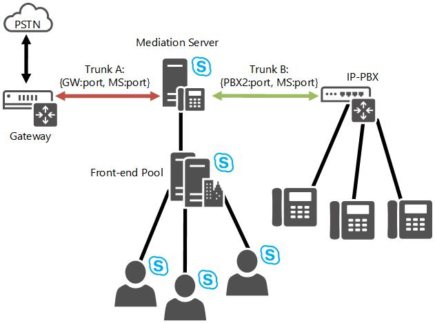

# Enrutamiento entre troncales en Skype empresarial Server
 
Obtenga información sobre cómo Skype empresarial Server Enterprise Voice admite el enrutamiento entre troncales.
  
Skype empresarial Server proporciona administración de sesiones básica mediante la compatibilidad con el enrutamiento de intertroncalización. Esto permite que Skype empresarial Server ofrezca funcionalidades de control de llamadas a sistemas de telefonía indirectos. El enrutamiento entre troncos puede interconectar una IP-PBX con una puerta de enlace de la red telefónica conmutada (RTC) para que las llamadas realizadas desde un teléfono de una central de conmutación (PBX) se puedan redirigir a la RTC y las llamadas RTC entrantes se puedan redirigir a un teléfono PBX. De forma similar, Skype empresarial Server puede interconectar dos o más sistemas IP-PBX para que las llamadas se puedan realizar y recibir entre los teléfonos PBX de los diferentes sistemas IP-PBX. 
  
En la ilustración siguiente se muestra cómo Skype empresarial Server proporciona interconectividad entre una puerta de enlace PSTN y una IP-PBX.
  

  
En la siguiente ilustración se muestra cómo Skype empresarial Server conecta dos sistemas IP-PBX.
  

  

