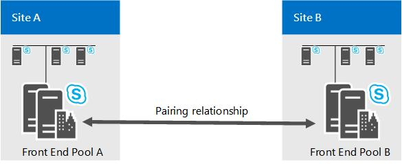

# Recuperación ante desastres del grupo de servidores front-end en Skype empresarial Server
 
Para la recuperación ante desastres, Skype empresarial Server ofrece el emparejamiento de grupo con failover en caso de que se produzca un regrupo.
  
Para obtener las opciones de recuperación ante desastres más eficaces de Skype empresarial Server, implemente pares de grupos de servidores front-end en dos sitios dispersos geográficamente. Cada sitio tiene un grupo de servidores front-end que se empareja con un grupo de servidores front-end correspondiente en otro sitio. Ambos sitios se encuentran activos, y el servicio de copia de seguridad proporciona la replicación de datos en tiempo real a fin de mantener los grupos sincronizados. Consulte [implementar grupos front-end emparejados para la recuperación ante desastres en Skype empresarial Server](../../deploy/deploy-high-availability-and-disaster-recovery/front-end-pools-for-disaster-recovery.md) si desea implementar el emparejamiento de la agrupación frontal.
  

  
Si el grupo de un sitio falla, puedes realizar la conmutación por error de los usuarios de dicho grupo al grupo del otro sitio, que proporcionará servicios a todos usuarios de ambos grupos. Para la planificación de la capacidad, necesitas diseñar cada grupo para que pueda gestionar la carga de trabajo de todos los usuarios de ambos grupos en caso de que ocurra un desastre.
  
Dos centros de datos que incluyan grupos de servidores front-end emparejados entre sí pueden encontrarse a cualquier distancia. Recomendamos que emparejes dos centros de datos en la misma región del mundo y con vínculos de alta velocidad entre sí. 
  
Tener dos centros de datos en regiones del mundo distintas es posible, pero podría provocar una pérdida de datos mayor debido a la latencia de la replicación de datos si ocurre un desastre.
  
Al planificar qué grupos de servidores vas a emparejar, necesitas tener en cuenta que solo se admiten los emparejamientos siguientes:
  
- Los grupos de servidores de Enterprise Edition se pueden emparejar solo con otros grupos de servidores de Enterprise Edition. De manera similar, los grupos de servidores de Standard Edition solo se pueden emparejar con otros grupos de servidores de Standard Edition.
    
- Los grupos de servidores físicos se pueden emparejar solo con otros grupos de servidores físicos. De manera similar, los grupos de servidores virtuales solo se pueden emparejar con otros grupos de servidores virtuales.
    
- Los grupos que estén emparejados juntos necesitan ejecutarse en el mismo sistema operativo base.
    
Ni el generador de topologías ni la validación de topología prohibirán el emparejamiento de dos grupos de servidores de un modo que no siga estas recomendaciones. Por ejemplo, el generador de topologías permite emparejar un grupo de servidores Enterprise Edition con un grupo de servidores Standard Edition. En realidad, estos tipos de emparejamientos no se admiten.
  
## Relaciones del registrador de copia de seguridad y equipos de sucursales

Además de proporcionar la capacidad de recuperación ante desastres, dos grupos de servidores emparejados sirven como registradores de copia de seguridad entre sí. Cada grupo puede ser la copia de seguridad solo de un grupo de servidores front-end.
  
Aunque las relaciones de copia de seguridad entre dos grupos de servidores front-end necesitan ser 1:1 y simétricas, cada grupo de servidores front-end puede continuar siendo el registrador de copia de seguridad para cualquier cantidad de aplicaciones de sucursal con funciones de supervivencia.
  
Ten en cuenta que Skype Empresarial no amplía el soporte de la recuperación ante desastres a usuarios alojados en una aplicación de sucursal con funciones de supervivencia. Si un grupo de servidores front-end que sirve como copia de seguridad de una aplicación de sucursal con funciones de supervivencia deja de estar disponible, los usuarios que hayan iniciado sesión en dicha aplicación de sucursal con funciones de supervivencia entrarán al modo de resistencia, incluso después de que los usuarios alojados en el grupo de servidores front-end hayan conmutado por error al grupo de servidores front-end de copia de seguridad.
  
## Tiempo de recuperación para la conmutación por error y por recuperación del grupo de servidores

Para la conmutación por error y por recuperación del grupo de servidores, el objetivo de ingeniería para el objetivo de tiempo de recuperación (RTO) es de 15 a 20 minutos. Este es el tiempo necesario para que tenga lugar la conmutación por error, una vez que los administradores hayan determinado que se ha producido un desastre e inicien los procedimientos de conmutación por error. No incluye el tiempo necesario para que los administradores evalúen la situación y tomen una decisión, como tampoco el tiempo necesario para que los usuarios vuelvan a iniciar sesión una vez que finalice la conmutación por error.
  
Para la conmutación por error de grupo y la conmutación por recuperación de grupos, el objetivo de ingeniería para objetivo de punto de recuperación (RPO) es de 5 minutos. Esto representa la medida de tiempo de los datos que se podrían perder debido al desastre, debido a la latencia de replicación del servicio de copia de seguridad. Por ejemplo, si un grupo se baja a las 10:00 A.M. y el RPO es de 5 minutos, los datos se escriben en el grupo entre 9:55 A.M. y 10:00 a. M es posible que no se haya replicado en el grupo de copia de seguridad y se perdería.
  
Para todas las cantidades de RTO y RPO de este documento se asume que los dos centros de datos se encuentran en la misma región del mundo con un transporte de alta velocidad y baja latencia entre los dos sitios. Estos números se miden en un grupo con 40.000 usuarios activos de forma simultánea y 200.000 usuarios habilitados para Skype empresarial con respecto a un modelo de usuario predefinido en el que no hay ningún trabajo pendiente en la replicación de datos. Están sujetas a cambios a partir de las pruebas de rendimiento y validación.
  
## Conmutación por error del almacén de administración central

El almacén de administración central contiene datos de configuración sobre los servidores y los servicios de tu implementación. Cada implementación de Skype empresarial Server incluye un almacén de administración central, que se hospeda en el servidor back-end de un grupo de servidores front-end.
  
Si emparejas el grupo que hospeda al almacén de administración central, se configura una base de datos del almacén de administración central en el grupo de copia de seguridad. En todo momento, una de las dos bases de datos del almacén de administración central está activa y la otra en modo de espera. El servicio de copia de seguridad replica el contenido desde la base de datos activa a la que se encuentra en modo de espera.
  

  
Durante la conmutación por error de un grupo que incluye el grupo que hospeda el almacén de administración central, necesitas llevar a cabo la conmutación por error del almacén de administración central antes de hacerlo para el grupo de servidores front-end.
  
Después de que se repara el desastre, no es necesario llevar a cabo la conmutación por recuperación del almacén de administración central. El almacén de administración central puede permanecer en el grupo en el que se lo colocó en la conmutación por error.
  
Los objetivos de ingeniería para la conmutación por error del almacén de administración central son 5 minutos para el de tiempo de recuperación (RTO) y 5 minutos para el de punto de recuperación (RPO).
  
## Seguridad de datos en el emparejamiento de grupos de servidores front-end

De forma continua, los servicios de copia de seguridad transfieren datos de usuario y contenido de conferencias entre dos grupos de servidores front-end emparejados. Los datos de usuario incluyen URI de SIP, así como también programas de conferencias, configuraciones y listas de contactos. El contenido de conferencias incluye cargas de Microsoft PowerPoint, además de pizarras utilizadas en conferencias.
  
Desde el grupo de origen, estos datos se exportan desde el almacenamiento local, en archivos comprimidos y, luego, se transfieren al grupo de destino, donde se descomprimen e importan al almacenamiento local. El servicio de copia de seguridad supone que el vínculo de comunicación entre los dos centros de datos se encuentra dentro de la red corporativa y que se protege de Internet. No cifra los datos transferidos entre los dos centros de datos, ni encapsula los datos de forma nativa en un protocolo de seguridad (como HTTPS). Por lo tanto, es posible que haya un ataque entre el personal interno dentro de la red corporativa.
  
Cualquier empresa que implemente Skype empresarial Server en varios centros de datos y use la característica de recuperación de desastres debe garantizar que el tráfico entre los centros de datos esté protegido por su intranet corporativa. Las empresas que tienen en cuenta la protección frente a ataques internos necesitan proteger los vínculos de comunicación entre los centros de datos. Este es un requisito estándar que también ayuda a proteger muchos más tipos de datos confidenciales corporativos que se transfieren entre los centros de datos.
  
Si bien el riesgo de ataques de tipo "Man in the middle" dentro de la red corporativa es real, es relativamente limitado en comparación con la exposición del tráfico en Internet. Concretamente, los datos de usuario que expone el servicio de copia de seguridad (como los URI de SIP) suelen estar disponibles para todos los empleados de la compañía a través de otros medios, como la libreta de direcciones global de Exchange u otro software de directorio. Por ello, necesitas centrarte en proteger la WAN entre los dos centros de datos cuando se usa el servicio de copia de seguridad para copiar datos entre los dos grupos de servidores emparejados.
  
### Reducir los riesgos de seguridad

Posiblemente cuentes con varias maneras de mejorar la protección de seguridad para el tráfico del servicio de copia de seguridad. Estas maneras varían desde restringir el acceso a los centros de datos hasta proteger el transporte de WAN entre los dos centros de datos. En la mayoría de los casos, es posible que las empresas que implementan Skype empresarial Server ya dispongan de la infraestructura de seguridad necesaria. Para aquellas empresas que necesitan una guía, Microsoft brinda una solución como un ejemplo de cómo desarrollar una infraestructura de TI segura. Para obtener más información [https://go.microsoft.com/fwlink/p/?LinkId=268544](https://go.microsoft.com/fwlink/p/?LinkId=268544), consulte. 
  
No implicamos que sea la única solución, ni que sea la solución preferida para Skype empresarial Server. Recomendamos que los clientes empresariales elijan la solución que se ajuste a sus necesidades específicas, de acuerdo con los requisitos y la infraestructura de TI que posean. El ejemplo de Microsoft emplea IPSec y directivas de grupo para el servidor y el aislamiento de dominios.
  
Otra posible solución consiste en usar IPsec solamente para que proteger los datos enviados por el propio servicio de copia de seguridad sea más fácil. Si eliges este método, necesitarás configurar las reglas IPsec del protocolo SMB para los siguientes servidores, donde los grupos A y B son dos grupos de servidores front-end emparejados.
  
- El servicio SMB (TCP/445) de cada servidor front-end del grupo A al almacén de archivos que usa el grupo B.
    
- El servicio SMB (TCP/445) de cada servidor front-end del grupo B al almacén de archivos que usa el grupo A.
    
> [!CAUTION]
>  IPsec no está pensado para reemplazar la seguridad de la aplicación, como SSL/TLS. Una ventaja de utilizar IPsec es que puede ofrecer seguridad de tráfico de red para las aplicaciones existentes sin necesidad de cambiarlas. Las empresas que deseen simplemente proteger el transporte entre los dos centros de datos deben consultar a sus respectivos proveedores de hardware de redes acerca de las formas de configurar conexiones WAN seguras con el equipo del proveedor.
  
## Vea también

[Implementar grupos front-end emparejados para recuperación ante desastres en Skype empresarial Server](../../deploy/deploy-high-availability-and-disaster-recovery/front-end-pools-for-disaster-recovery.md)
