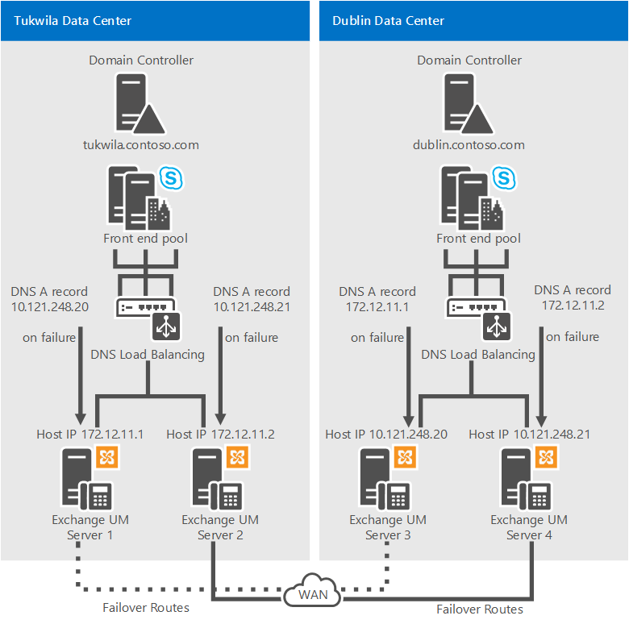
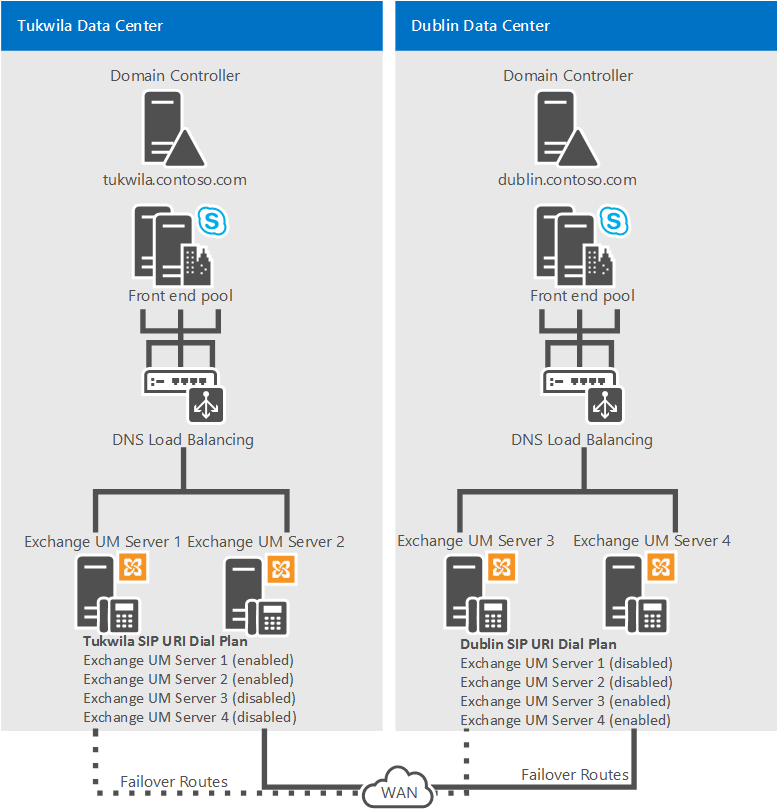

# Planear la integración de la mensajería unificada de Exchange en Skype EmpresarialPlan for Exchange Unified Messaging integration in Skype for Business
 
**Resumen:** Revise este tema cuando planee integrar Skype para Business Server 2015 con Exchange 2013.**Summary:** Review this topic while planning to integrate Skype for Business Server 2015 with Exchange 2013.
  
Skype para Business Server 2015 admite la integración con Exchange mensajería unificada (UM) de la combinación de mensajería de voz y mensajería de correo electrónico en una sola infraestructura de mensajería.Skype for Business Server 2015 supports integration with Exchange Unified Messaging (UM) for combining voice messaging and email messaging into a single messaging infrastructure. En Exchange, la mensajería unificada de Exchange (UM) es uno de varios roles de servidor de Exchange que se pueden instalar y configurar.In Exchange, Exchange Unified Messaging (UM) is one of several Exchange server roles that you can install and configure. 
  
En Microsoft Exchange Server 2013, mensajería unificada de Exchange se ejecuta como un servicio en un servidor de buzones de Exchange.In Microsoft Exchange Server 2013, Exchange UM runs as a service on an Exchange Mailbox server. Skype para las implementaciones empresariales Server 2015 Enterprise Voice, mensajería unificada combina mensajería de voz y correo electrónico de mensajería en un único almacén que pueden tener acceso los usuarios de un equipo o un teléfono (Outlook Voice Access).For Skype for Business Server 2015 Enterprise Voice deployments, Unified Messaging combines voice messaging and email messaging into a single store that users can access from a telephone (Outlook Voice Access) or a computer. Mensajería unificada y Skype para Business Server 2015 funcionan conjuntamente para proporcionar el contestador automático, Outlook Voice Access y servicios de operador automático para los usuarios de Enterprise Voice.Unified Messaging and Skype for Business Server 2015 work together to provide call answering, Outlook Voice Access, and auto-attendant services to users of Enterprise Voice.
  
Para obtener más información acerca de los cambios de arquitectura en Microsoft Exchange Server 2013, vea [Cambios de arquitectura de voz](https://go.microsoft.com/fwlink/p/?LinkId=266730) en la documentación de Microsoft Exchange Server 2013.For more information about the architecture changes in Microsoft Exchange Server 2013, see [Voice Architecture Changes](https://go.microsoft.com/fwlink/p/?LinkId=266730) in the Microsoft Exchange Server 2013 documentation.
  
Para que estas características sean compatibles con una implementación local de mensajería unificada de Exchange, debe ejecutar uno de estos procedimientos:For these features to be supported in an on-premises Exchange UM deployment, you must be running one of the following:
  
- Microsoft Exchange Server 2010 o el último service packMicrosoft Exchange Server 2010 or latest service pack
    
- Microsoft Exchange Server 2013Microsoft Exchange Server 2013
    
-  Microsoft Exchange Server 2016Microsoft Exchange Server 2016
    
## Características de la mensajería unificada integrada y Skype Empresarial Server 2015Features of integrated Unified Messaging and Skype for Business Server 2015

Skype para Business Server 2015, Enterprise Voice usa la infraestructura de mensajería unificada de Exchange (UM) para proporcionar el contestador automático, notificación de llamada, acceso de voz (incluido el correo de voz) y servicios de operador automático.Skype for Business Server 2015, Enterprise Voice uses the Exchange Unified Messaging (UM) infrastructure to provide call answering, call notification, voice access (including voice mail), and auto-attendant services.
  
- **Contestador automático**: el contestador automático recibe mensajes de voz en nombre de los usuarios que no están disponibles o cuyas llamadas no se responden. Permite reproducir un saludo personal, grabar un mensaje y enviar el mensaje a la cola para su entrega en el buzón del usuario, que se almacena en el servidor de buzones de correo de Exchange.**Call Answering** Call answering is the receiving of voice messages on behalf of users whose calls are not answered or are busy. It includes playing a personal greeting, recording a message, and submitting the message to be queued for delivery to the user's mailbox, which is stored on the Exchange mailbox server.
    
    Si el autor de la llamada deja un mensaje, el mensaje se trasfiere a la bandeja de entrada del usuario. Si decide no dejar un mensaje, se almacena una notificación de llamada perdida en el buzón del usuario. Los usuarios pueden acceder a sus bandejas de entrada mediante el cliente de mensajería y colaboración de Microsoft Outlook, Outlook Web Access, la tecnología Exchange ActiveSync o Outlook Voice Access. Se pueden mostrar el asunto y la prioridad de las llamadas de manera similar al correo electrónico.If a caller leaves a message, the message is routed to the user's Inbox. If a caller chooses not to leave a message, a missed call notification is stored in the user's mailbox. Users can then access their Inbox by using the Microsoft Outlook messaging and collaboration client, Outlook Web Access, the Exchange ActiveSync technology, or Outlook Voice Access. The subject and priority of calls can be displayed in a way similar to that of email.
    
- **Outlook Voice Access** Outlook Voice Access permite a un usuario de Enterprise Voice tener acceso a correo de voz no sólo, sino también la Bandeja de entrada de Exchange, incluido el correo electrónico, calendario y contactos desde una interfaz de telefonía.**Outlook Voice Access** Outlook Voice Access enables an Enterprise Voice user to access not just voice mail, but also the Exchange inbox, including email, calendar, and contacts from a telephony interface. Se asigna el número de acceso de suscriptor por un administrador de mensajería unificada de Exchange.The subscriber access number is assigned by an Exchange UM administrator.
    
- **Operador automático** Operador automático es una característica de mensajería unificada de Exchange que se puede usar para configurar un número de teléfono que los usuarios externos puede marcar para llegar a los representantes de la empresa.**Auto attendant** Auto attendant is an Exchange UM feature that can be used to configure a phone number that outside users can dial to reach company representatives. En concreto, proporciona una serie de mensajes de voz que ayudan a un autor de la llamada externa a navegar por un sistema de menús.In particular, it provides a series of voice prompts that assist an external caller in navigating a menu system. Se configura la lista de opciones disponibles en el servidor de mensajería unificada de Exchange por el Administrador de la mensajería unificada de Exchange.The list of available options is configured on the Exchange UM server by the Exchange UM administrator.
    
- **Servicios de fax** Mensajería unificada de Exchange incluye características de fax, que permiten a los usuarios recibir faxes entrantes en sus buzones de Exchange.**Fax Services** Exchange UM includes fax features, which enable users to receive incoming faxes in their Exchange mailboxes. Para obtener información detallada, vea [Mensajería unificada](https://go.microsoft.com/fwlink/p/?linkId=135652) en la documentación de Microsoft Exchange Server.For details, see [Unified Messaging](https://go.microsoft.com/fwlink/p/?linkId=135652) in the Microsoft Exchange Server documentation.
    
    > [!NOTE]
    > Los servicios de fax proporcionados por el servidor de mensajería unificada de Exchange no están disponibles en Skype para las implementaciones de Business Server que se integran con Microsoft Exchange Server 2010, Exchange 2010 con el último service pack o Exchange 2013.Fax services provided by the Exchange UM server are not available in Skype for Business Server deployments that are integrated with Microsoft Exchange Server 2010, Exchange 2010 with the latest service pack, or Exchange 2013. 
  
## Componentes y topologías para mensajería unificada local en Skype Empresarial Server 2015Components and topologies for on-premises Unified Messaging in Skype for Business Server 2015

### Componentes de Exchange ServerExchange Server Components

Para proporcionar las características de mensajería unificada de Exchange y servicios que se describen en [las características de integrado de mensajería unificada y Lync Server 2013](http://technet.microsoft.com/library/094f549d-fccc-43ab-9f39-6ddd18130915.aspx) a los usuarios de Enterprise Voice en su organización, debe implementar un servidor de buzones de Microsoft Exchange y el servidor de acceso de cliente, que hospeda los buzones de usuario y proporciona una única ubicación de almacenamiento para correo electrónico y correo de voz.To provide the Exchange UM features and services described in [Features of Integrated Unified Messaging and Lync Server 2013](http://technet.microsoft.com/library/094f549d-fccc-43ab-9f39-6ddd18130915.aspx) to Enterprise Voice users in your organization, you must deploy an Microsoft Exchange Mailbox server and Client Access server, which hosts user mailboxes and provides a single storage location for email and voice mail. Mensajería unificada de Exchange se ejecuta como un servicio en servidores de buzón de Exchange y de acceso de cliente.Exchange UM runs as a service on Exchange Mailbox and Client Access servers.
  
Para obtener información detallada acerca de los componentes de mensajería unificada de Exchange en Microsoft Exchange Server 2010, vea [Implementación local mensajería unificada de Exchange para proporcionar correo de voz de vista previa de Lync Server 2013](http://technet.microsoft.com/library/9673bd73-a3a3-425d-870f-04d801c6d0d5.aspx) en la documentación de implementación.For details about Exchange UM components in Microsoft Exchange Server 2010, see [Deploying On-Premises Exchange UM to Provide Lync Server 2013 Preview Voice Mail](http://technet.microsoft.com/library/9673bd73-a3a3-425d-870f-04d801c6d0d5.aspx) in the Deployment documentation.
  
### Topologías admitidasSupported Topologies

Puede implementar Skype para Business Server 2015 y Exchange mensajería unificada (UM) en el mismo bosque o varios bosques.You can deploy Skype for Business Server 2015 and Exchange Unified Messaging (UM) in the same forest or multiple forests. Si la implementación abarca varios bosques, debe realizar los pasos de integración de Exchange para cada bosque de mensajería unificada de Exchange.If the deployment spans multiple forests, you must perform the Exchange integration steps for each Exchange UM forest. Además, debe configurar cada bosque de Microsoft Exchange para que confíe en el Skype para Business Server 2015 bosque y el Skype para Business Server 2015 bosque para que confíe en cada bosque de mensajería unificada de Exchange.Furthermore, you must configure each Microsoft Exchange forest to trust the Skype for Business Server 2015 forest and the Skype for Business Server 2015 forest to trust each Exchange UM forest. Además de esta relación de confianza de bosque, la configuración de mensajería unificada de Exchange para todos los usuarios debe establecerse en los objetos de usuario en el Skype para Business Server 2015 bosque.In addition to this forest trust, the Exchange UM settings for all users must be set on the user objects in the Skype for Business Server 2015 forest. 
  
Skype para Business Server 2015 admite las siguientes topologías para la integración de mensajería unificada de Exchange:Skype for Business Server 2015 supports the following topologies for Exchange UM integration:
  
- Bosque únicoSingle forest
    
- Dominio único (es decir, un único bosque con un único dominio).Single domain (that is, a single forest with a single domain). Skype para Business Server 2015, Microsoft Exchange y los usuarios residen en el mismo dominio.Skype for Business Server 2015, Microsoft Exchange, and users all reside in the same domain.
    
- Varios dominios (es decir, un dominio raíz con uno o más dominios secundarios).Multiple domain (that is, a root domain with one or more child domains). Skype para Business Server 2015 y los servidores de Microsoft Exchange se implementan en diferentes dominios desde el dominio donde se crean los usuarios.Skype for Business Server 2015, and Microsoft Exchange servers are deployed in different domains from the domain where you create users. Servidores de mensajería unificada de Exchange pueden implementarse en diferentes dominios desde el Skype para grupo de negocio Server 2015 apoyan.Exchange UM servers can be deployed in different domains from the Skype for Business Server 2015 pool they support.
    
- Varios bosques (es decir, un bosque de recursos).Multiple forest (that is, resource forest). Skype para Business Server 2015 se implementa en un solo bosque y, a continuación, se distribuyen a los usuarios en varios bosques.Skype for Business Server 2015 is deployed in a single forest, and then users are distributed across multiple forests. Atributos de los usuarios para mensajería unificada de Exchange deben replicarse a través de a la Skype para Business Server 2015 bosque.The users' Exchange UM attributes must be replicated over to the Skype for Business Server 2015 forest.
    
    > [!NOTE]
    > Exchange se puede implementar en varios bosques.Exchange can be deployed in multiple forests. Cada organización de Exchange puede proporcionar mensajería unificada de Exchange a sus usuarios, o mensajería unificada de Exchange puede implementarse en el mismo bosque que Skype para Business Server 2015.Each Exchange organization can provide Exchange UM to its users, or Exchange UM can be deployed in the same forest as Skype for Business Server 2015. 
  
## Instrucciones para la integración de Mensajería unificada local y Skype Empresarial Server 2015Guidelines for integrating on-premises Unified Messaging and Skype for Business Server 2015

Los siguientes procedimientos recomendados e instrucciones debe tenerse en cuenta cuando implemente Telefonía IP empresarial:The following are guidelines and best practices to consider when you deploy Enterprise Voice:
  
> [!IMPORTANT]
> Mensajería unificada de Exchange (UM) es compatible con IPv6 sólo si también está usando UCMA 4.Exchange Unified Messaging (UM) supports IPv6 only if you are also using UCMA 4. 
  
- Implementar un Skype para Business Server 2015 Standard Edition o un grupo de servidores Front-End.Deploy a Skype for Business Server 2015 Standard Edition server or a Front End pool. Para obtener información detallada acerca de la instalación, vea [Implementar Skype para Business Server 2015](../../deploy/deploy.md) en la documentación de implementación.For details about installation, see [Deploy Skype for Business Server 2015](../../deploy/deploy.md) in the Deployment documentation.
    
- Colabore con los administradores de Exchange para confirmar las tareas que realizará cada uno y así garantizar una integración correcta y homogénea.Work with Exchange administrators to confirm which tasks each of you will perform to assure a smooth and successful integration.
    
- Implementar las funciones de servidor de buzón de Exchange en cada bosque de mensajería unificada de Exchange (UM) donde desea permitir a que los usuarios de mensajería unificada de Exchange.Deploy the Exchange Mailbox server roles in each Exchange Unified Messaging (UM) forest where you want to enable users for Exchange UM. Para obtener información detallada acerca de cómo instalar roles de servidor de Exchange, consulte la documentación de Microsoft Exchange Server 2013.For details about installing Exchange server roles, see the Microsoft Exchange Server 2013 documentation.
    
    > [!IMPORTANT]
    > Cuando se instala mensajería unificada de Exchange (UM), está configurado para usar un certificado autofirmado.When Exchange Unified Messaging (UM) is installed, it is configured to use a self-signed certificate. El certificado autofirmado no habilita Skype para Business Server 2015 y mensajería unificada de Exchange confíen entre sí, que es la razón por la que es necesario solicitar un certificado independiente de una entidad de certificación que ambos servidores de confianza.The self-signed certificate does not enable Skype for Business Server 2015 and Exchange UM to trust each other, which is why it is necessary to request a separate certificate from a certification authority that both servers trust. 
  
- Si Skype para Business Server 2015 y mensajería unificada de Exchange se instala en bosques diferentes, configure cada bosque de Exchange para que confíe en el Skype para Business Server 2015 bosque y el Skype para Business Server 2015 bosque para que confíe en cada bosque de Exchange.If Skype for Business Server 2015 and Exchange UM are installed in different forests, configure each Exchange forest to trust the Skype for Business Server 2015 forest and the Skype for Business Server 2015 forest to trust each Exchange forest. También, establecer la configuración mensajería unificada de Exchange de los usuarios en los objetos de usuario en el Skype para el bosque de Business Server 2015, normalmente mediante una secuencia de comandos o una herramienta de entre bosques, como Identity Lifecycle Manager (ILM).Also, set the users' Exchange UM settings on the user objects in the Skype for Business Server 2015 forest, typically by using a script or a cross-forest tool, such as Identity Lifecycle Manager (ILM).
    
- Si es necesario, instale la Consola de administración de Exchange de modo que administre los servidores de mensajería unificada.If necessary, install the Exchange Management Console to manage your Unified Messaging servers.
    
- Obtenga números de teléfono válidos para Outlook Voice Access y el operador automático.Obtain valid phone numbers for Outlook Voice Access and auto attendant.
    
- Si está utilizando una versión de mensajería unificada de Exchange anterior a Microsoft Exchange Server 2010 Service Pack 1 (SP1), los nombres de coordenadas para Exchange UM URI del SIP planes de marcado y los planes de marcado de Enterprise Voice.If you are using a version of Exchange UM earlier than Microsoft Exchange Server 2010 Service Pack 1 (SP1), coordinate names for Exchange UM SIP URI dial plans and Enterprise Voice dial plans. 
    
### Implementación de servidores redundantes de mensajería unificada de ExchangeDeploying Redundant Exchange UM Servers

> [!IMPORTANT]
> Se recomienda que implemente un mínimo de dos servidores en la mensajería unificada de Exchange services se está ejecutando para cada plan de marcado de Exchange UM URI del SIP que configura para la organización.We recommend that you deploy a minimum of two servers on which Exchange UM services is running for each Exchange UM SIP URI dial plan that you configure for your organization. Además de ofrecer más capacidad, implementar servidores redundantes también proporciona una alta disponibilidad.In addition to providing expanded capacity, deploying redundant servers provides high availability. En el caso de un error del servidor, se puede configurar Skype para Business Server 2015 para conmutar por error a otro servidor.In the event of an server failure, Skype for Business Server 2015 can be configured to fail over to another server. 
  
Los siguientes ejemplos de configuraciones ofrecen resistencia a la mensajería unificada de Exchange.The following example configurations provide Exchange UM resiliency.
  
**Ejemplo 1: Resistencia de mensajería unificada de Exchange****Example 1: Exchange UM Resiliency**

  
En el Ejemplo 1, los servidores de mensajería unificada de Exchange 1 y 2 están habilitados en el centro de datos de Tukwila, y los servidores de mensajería unificada de Exchange 3 y 4 están habilitados en el centro de datos de Dublín. En el caso de que se produzca una interrupción de la mensajería unificada de Exchange en Tukwila, los registros de sistemas de nombre de dominio (DNS) A de los servidores 1 y 2 deben estar configurados para apuntar, respectivamente, a los servidores 3 y 4. En el caso de que se produzca una interrupción de la mensajería unificada de Exchange en Dublín, los registros DNS A de los servidores 3 y 4 deben estar configurados para apuntar, respectivamente, a los servidores 1 y 2.In Example 1, Exchange UM servers 1 and 2 are enabled in the Tukwila data center, and Exchange UM servers 3 and 4 are enabled in the Dublin data center. In the event of an Exchange UM outage in Tukwila, the Domain Name System (DNS) A records for servers 1 and 2 should be configured to point to servers 3 and 4, respectively. In the event of an Exchange UM outage in Dublin, the DNS A records for servers 3 and 4 should be configured to point to servers 1 and 2, respectively.
  
> [!NOTE]
> Por ejemplo 1, debe asignar también uno de los siguientes certificados en cada servidor de mensajería unificada de Exchange: usar un certificado con un carácter comodín en el nombre alternativo de sujeto (SAN) o coloque el nombre de dominio completo (FQDN) de cada uno de los cuatro servidores mensajería unificada de Exchange en el SAN.For Example 1, you should also assign one of following certificates on each Exchange UM server: either use a certificate with a wildcard in the Subject Alternative Name (SAN) or Put the fully qualified domain name (FQDN) of each of the four Exchange UM servers in the SAN. 
  
**Ejemplo 2: Resistencia de mensajería unificada de Exchange****Example 2: Exchange UM Resiliency**

  
En el Ejemplo 2, en condiciones normales de funcionamiento, los servidores de mensajería unificada de Exchange 1 y 2 están habilitados en el centro de datos de Tukwila, y los servidores de mensajería unificada de Exchange 3 y 4 están habilitados en el centro de datos de Dublín. Los cuatro servidores están incluidos en el plan de marcado URI del SIP de los usuarios de Tukwila; sin embargo, los servidores 3 y 4 están deshabilitados. En el caso de que se produzca una interrupción de la mensajería unificada de Exchange en Tukwila, por ejemplo, los servidores 1 y 2 de mensajería unificada de Exchange deben deshabilitarse y los servidores 3 y 4 de mensajería unificada de Exchange deben habilitarse para que el tráfico de mensajería unificada de Exchange de Tukwila se enrute a los servidores de Dublín.In Example 2, under ordinary operating conditions Exchange UM servers 1 and 2 are enabled in the Tukwila data center, and Exchange UM servers 3 and 4 are enabled in the Dublin data center. All four servers are included in the Tukwila users' SIP URI dial plan; however, servers 3 and 4 are disabled. In the event of an Exchange UM outage in Tukwila, for example, Exchange UM servers 1 and 2 should be disabled and Exchange UM servers 3 and 4 should be enabled so the Tukwila Exchange UM traffic will be routed to the servers in Dublin.
  
Para obtener información detallada acerca de cómo habilitar o deshabilitar la mensajería unificada en Exchange 2013, consulte [Integrate Exchange 2013 UM con Lync Server](https://go.microsoft.com/fwlink/p/?LinkId=265372).For details about how to enable or disable Unified Messaging on Exchange 2013, see [Integrate Exchange 2013 UM with Lync Server](https://go.microsoft.com/fwlink/p/?LinkId=265372). La información proporcionada se aplica igualmente a Skype para Business Server 2015.The information provided applies equally to Skype for Business Server 2015.
  
Para obtener información detallada acerca de cómo habilitar o deshabilitar la mensajería unificada en Microsoft Exchange Server 2010, consulte:For details about how to enable or disable Unified Messaging on Microsoft Exchange Server 2010, see:
  
- [Habilitar mensajería unificada en Exchange 2010Enable Unified Messaging on Exchange 2010](https://go.microsoft.com/fwlink/p/?LinkId=204418)
    
- [Deshabilitar la mensajería unificada en Exchange 2010Disable Unified Messaging on Exchange 2010](https://go.microsoft.com/fwlink/p/?LinkId=204416)
    
## Vea tambiénSee also

[Introducción al proceso de implementación para la integración de mensajería unificada y locales Skype para la empresaDeployment process overview for integrating on-premises Unified Messaging and Skype for Business](deployment-overview.md)