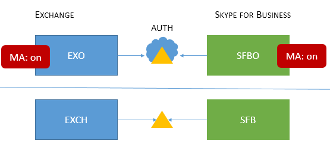

# Topologías de Skype Empresarial compatibles con la autenticación moderna

En este artículo se enumeran las topologías locales y en línea que se admiten con la autenticación moderna en Skype Empresarial, así como las características de seguridad que se aplican a cada topología.

## Autenticación moderna en Skype Empresarial

Skype Empresarial aprovechar las ventajas de seguridad de la autenticación moderna. Dado que Skype Empresarial funciona estrechamente con Exchange, el comportamiento de inicio de sesión Skype Empresarial los usuarios cliente también se verán afectados por el estado de MA de Exchange. Esto también se aplicará si tiene un Skype Empresarial híbrido de dominio dividido. Eso es una gran cantidad de partes móviles, pero el objetivo aquí es una lista fácil de visualizar de topologías admitidas.

Dado Skype Empresarial, Skype Empresarial en línea, Exchange Server y Exchange en línea, ¿qué topologías se admiten con MA?

<!--  > [!TIP] > Not sure what Modern Authentication even is? No worries.  This Skype for Business article  4e6a99cd-7859-4062-8a30-5ac79ba36b52  explains it in the first paragraphs. -->

### Topologías de MA admitidas en Skype Empresarial

Existen potencialmente dos aplicaciones de servidor y dos Microsoft 365 o Office 365 de trabajo, implicadas con Skype Empresarial topologías usadas por MA.

- Skype Empresarial servidor local (CU 5)

- Skype Empresarial online (SFBO)

- Exchange servidor local

- Exchange en línea (EXO)

Otra parte importante de MA es saber dónde tendrán lugar la autenticación (authN) y la autorización (authZ) de los usuarios. Las dos opciones son:

- Azure AD, en línea en Microsoft Cloud

- Servidor de federación de Active Directory (ADFS) local

Por lo tanto, se ve un poco así, con EXO y SFBO en la nube con Azure AD, y Exchange Server (EXCH) y Skype Empresarial server (SFB) de forma local.

Estas son las topologías admitidas. Tenga en cuenta la clave de los gráficos:

- Si el icono está atenuado o gris, no se usa en el escenario.

- EXO es Exchange Online.

- SFBO es Skype Empresarial Online.

- EXCH es Exchange local.

- SFB es Skype Empresarial local.

- La autorización de servidores se representa mediante triángulos, por ejemplo, el Azure AD es un triángulo con una nube detrás.

- Las flechas apuntan al servidor de autorización que se usará cuando los clientes intenten llegar al recurso de servidor especificado.

En primer lugar, vamos a cubrir MA con Skype Empresarial en topologías solo locales o solo en la nube.

> [!IMPORTANT]
> ¿Está listo para configurar la autenticación moderna en Skype Empresarial Online? Los pasos para habilitar esta característica están [aquí](https://social.technet.microsoft.com/wiki/contents/articles/34339.skype-for-business-online-enable-your-tenant-for-modern-authentication.aspx).

|Nombre de topología    |Ejemplo    |Descripción    |Compatible    |
|:-----|:-----|:-----|:-----|
|Solo nube    |Usuarios ubicados/buzones ubicados: En línea    |MA está en exo y SFBO.    Por lo tanto, el servidor de autorización Azure AD.    |Autenticación multifactor (MFA), autenticación basada en certificados de cliente (CBA), acceso condicional (CA)/Administración de aplicaciones móviles (MAM) con Intune. \*    |
|Solo de forma previa    |Usuarios homed/mailboxes ubicados: Local    |MA está en sfb local.    Por lo tanto, el servidor de autorización es ADFS.    Para obtener más información sobre la configuración, consulte [este artículo.](/microsoft-365/enterprise/hybrid-modern-auth-overview)   |MFA (solo Windows escritorio: no se admiten clientes móviles). Sin Exchange de integración.   
 **No se recomienda este enfoque. Vea aquí:** [https://aka.ms/ModernAuthOverview](/microsoft-365/enterprise/hybrid-modern-auth-overview)
 |

> [!IMPORTANT]
> Se recomienda que el estado de MA sea el mismo en Skype Empresarial y Exchange (y sus equivalentes en línea) para reducir el número de mensajes.

Las topologías mixtas implican combinaciones de híbridos de dominio dividido sfb. Estas son las topologías mixtas que se admiten actualmente:

|Nombre de topología    |Ejemplo    |Descripción    |Compatible    |
|:-----|:-----|:-----|:-----|
|Mixto 1    |             Usuarios homed/mailboxes ubicados: EXO y SFB    |MA no está habilitado para SFB; no hay características de SFB MA disponibles en esta topología.    |No hay características de MA para SFB.    |
|Mixto 2    |             Usuarios homed/mailboxes ubicados: EXCH y SFBO    |MA solo está en SFBO. El servidor de autorización Azure AD usuarios que se alojen en SFBO, pero AD para EXCH local.    |MFA, CBA, CA/MAM con Intune.\*    |
|Mixto 3    |             Usuarios homed/mailboxes ubicados: EXO + SFB, o EXCH + SFB    |No hay características de SFB MA disponibles en esta topología    |No hay características de MA para SFB.    |
|Mixto 4    |             Usuarios homed/mailboxes ubicados: EXCH +SFBO o EXCH + SFB    |MA está en SFBO, por lo tanto, el servidor de autorización Azure AD para los usuarios que se aloban en SFBO. Los usuarios activos en SFB y EXO usan AD.    |MFA, CBA, CA/MAM con Intune solo para usuarios en línea.\*    |
|Mixto 5    |             Usuarios ubicados/buzones ubicados: EXO + SFBO, EXO + SFB, EXCH + SFBO, o EXCH + SFB    |MA está en EXO y SFBO, por lo tanto, el servidor de autorización es Azure AD para los usuarios que se alojen en SFBO; los usuarios de forma local en EXCH y SFB usan AD.    |MFA, CBA, CA/MAM con Intune solo para usuarios en línea.\*    |
|Mixto 6    |             Usuarios ubicados/buzones ubicados: EXO + SFBO, EXO + SFB, EXCH + SFBO, o EXCH + SFB    |MA está en todas partes, por lo tanto, el servidor de autorización Azure AD para todos los usuarios. (en línea y local)     Consulte los pasos [https://aka.ms/ModernAuthOverview](/microsoft-365/enterprise/hybrid-modern-auth-overview) de implementación.   |MFA, CBA y CA/MAM (a través de Intune) para todos los usuarios.    |

\*- MFA incluye Windows escritorio, MAC, iOS, dispositivos Android y Windows teléfonos móviles; CBA incluye Windows dispositivos De escritorio, iOS y Android; CA/MAM con Intune, incluye dispositivos Android e iOS.

> [!IMPORTANT]
> Es muy importante tener en cuenta que los usuarios pueden ver varios **avisos en algunos casos** , especialmente cuando el estado de MA no es el mismo en todos los recursos de servidor que los clientes pueden necesitar y solicitar, como sucede con todas las versiones de las topologías mixtas.

> [!IMPORTANT]
> Tenga en cuenta también que en algunos casos (mixtos 1, 3 y 5 específicamente) se debe establecer una clave del Registro [AllowADALForNonLyncIndependentOfLync](https://support.microsoft.com/help/3082803/info-about-the-allowadalfornonlyncindependentoflync-setting-in-skype-for-business,-lync-2013,-and-exchange-online) para una configuración adecuada para los clientes de escritorio de Windows.