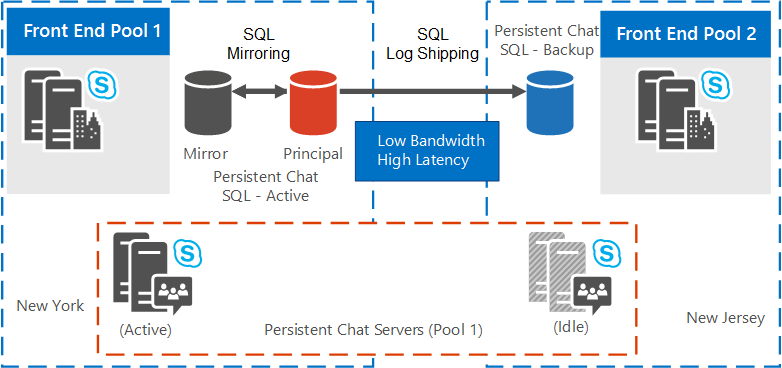

# Planeación de alta disponibilidad y recuperación ante desastres para servidor de Chat persistente en Skype para Business Server 2015Plan for high availability and disaster recovery for Persistent Chat Server in Skype for Business Server 2015
 
**Resumen:** Lea este tema para obtener información sobre cómo planear una alta disponibilidad y recuperación ante desastres para servidor de Chat persistente en Skype para Business Server 2015.**Summary:** Read this topic to learn how to plan for high availability and disaster recovery for Persistent Chat Server in Skype for Business Server 2015.
  
Alta disponibilidad y recuperación ante desastres para servidor de Chat persistente requieran recursos adicionales más allá de lo que normalmente es necesaria para la operación completa.High availability and disaster recovery for Persistent Chat Server require additional resources beyond what is typically needed for full operation. 
  
> [!NOTE]
> El uso de Grupos de disponibilidad AlwaysOn de SQL no es compatible con las bases de datos del servidor de chat persistente.Using SQL AlwaysOn Availability Groups is not supported with Persistent Chat Server databases. 

> [!NOTE] 
> Chat persistente está disponible en Skype para Business Server 2015, pero ya no se admite en Skype para Business Server 2019.Persistent chat is available in Skype for Business Server 2015 but is no longer supported in Skype for Business Server 2019. La misma funcionalidad está disponible en los equipos.The same functionality is available in Teams. Para obtener más información, vea [viaje de Skype para la empresa a los equipos de Microsoft](/microsoftteams/journey-skypeforbusiness-teams).For more information, see [Journey from Skype for Business to Microsoft Teams](/microsoftteams/journey-skypeforbusiness-teams). Si necesita usar chat en grupo, las opciones son para migrar los usuarios que requieren esta funcionalidad a los equipos, o para continuar usando Skype para Business Server 2015.If you need to use Persistent chat, your choices are to either migrate users requiring this functionality to Teams, or to continue using Skype for Business Server 2015. 
  
## Requisitos de recursosResource requirements

Antes de configurar el servidor de Chat persistente de alta disponibilidad y recuperación ante desastres, asegúrese de que tiene los siguientes recursos adicionales.Before configuring Persistent Chat Server for high availability and disaster recovery, ensure that you have the following additional resources. 
  
- Una instancia de base de datos dedicada que se encuentra en el mismo centro de datos físico en el que se encuentra el cliente principal del servicio de servidor de Chat persistente de.One dedicated database instance located in the same physical data center in which the home front end of the Persistent Chat Server service is located. Esta base de datos servirá como el reflejo de SQL Server para la base de datos principal de Chat persistente.This database will serve as the SQL Server mirror for the primary Persistent Chat database. De forma opcional, designar un servidor de SQL adicional que sirva como el testigo de reflejo, si desea que una conmutación por error automática a la base de datos reflejada.Optionally, designate an additional SQL Server to serve as the mirroring witness if you want an automated failover to the mirror database.
    
- Una instancia de base de datos dedicada ubicada en el otro centro de datos físico.One dedicated database instance located in the other physical data center. Esta base de datos servirá como la base de datos secundaria trasvase de registros de SQL Server para la base de datos en el centro de datos principal.This database will serve as the SQL Server Log Shipping secondary database for the database in the primary data center.
    
- Una instancia de base de datos dedicada para que sirva como el reflejo de SQL Server para la base de datos secundaria.One dedicated database instance to serve as the SQL Server mirror for the secondary database. De forma opcional, designar un servidor de SQL adicional al servidor como el testigo de reflejo.Optionally, designate an additional SQL Server to server as the mirroring witness. Es preciso que ambos estén ubicados en el mismo centro de datos físico que la base de datos secundaria.Both of these must be located in the same physical data center as the secondary database.
    
- Si está habilitado el cumplimiento del servidor de Chat persistente, se requieren un tres instancias adicionales de base de datos dedicada.If Persistent Chat Server compliance is enabled, an additional three dedicated database instances are required. Su distribución es la misma que los descritos anteriormente para la base de datos de Chat persistente.Their distribution is the same as those previously outlined for the Persistent Chat database. Aunque es posible para la base de datos de cumplimiento compartir la misma instancia de SQL Server como la base de datos de Chat persistente, se recomiendan instancias independientes para alta disponibilidad y recuperación ante desastres.While it is possible for the compliance database to share the same SQL Server instance as the Persistent Chat database, standalone instances for high availability and disaster recovery are recommended.
    
- Un recurso compartido de archivos debe ser creado y designado para los registros de transacciones de trasvase de registros de SQL Server.A file share must be created and designated for the SQL Server Log Shipping transaction logs. Todos los servidores de SQL Server en ambos centros de datos que se ejecutan las bases de datos de Chat persistente deben tener acceso de lectura y escritura para este recurso compartido de archivos.All SQL Servers in both data centers that run Persistent Chat databases must have read/write access to this file share. Este recurso compartido no está designado como parte del rol FileStore.This share is not defined as part of a FileStore role.
    
- Un recurso compartido de archivos en el servidor de base de datos secundaria para que sirva como carpeta de destino para los registros de transacciones de SQL Server que se copian desde el recurso compartido del servidor principal.A file share on the secondary database server to serve as the destination folder for the SQL Server transaction logs that are copied from the primary server file share.
    
## Soluciones de alta disponibilidad y recuperación ante desastresDisaster recovery and high availability solutions

Skype para Business Server admite varios modos de alta disponibilidad para los servidores Back-End, incluidas la creación de reflejo de base de datos.Skype for Business Server supports multiple modes of high availability for your Back End Servers, including database mirroring. Para más información, vea [Plan for high availability and disaster recovery in Skype for Business Server 2015](../../plan-your-deployment/high-availability-and-disaster-recovery/high-availability-and-disaster-recovery.md).For more information, see [Plan for high availability and disaster recovery in Skype for Business Server 2015](../../plan-your-deployment/high-availability-and-disaster-recovery/high-availability-and-disaster-recovery.md). 
  
La solución de recuperación ante desastres para servidor de Chat persistente que se describen en este tema se basa en un grupo de servidores de Chat persistente.The disaster recovery solution for Persistent Chat Server described in this topic is built on a stretched Persistent Chat Server pool. No hay ningún requisito para una red de área local virtual (VLAN) extendida.There is no requirement for a stretched virtual local area network (VLAN). Mediante la expansión de un grupo de servidores de Chat persistente, configurar un grupo de servidores en la topología de forma lógica, pero físicamente colocar los servidores en el grupo de servidores en centros de datos diferentes dos.By stretching a Persistent Chat Server pool, you configure one pool in the topology logically, but you physically place the servers in the pool in two different data centers. Configure la creación de reflejos de SQL Server en la base de datos de la misma forma e implemente la base de datos y el reflejo en el mismo centro de datos.You configure SQL Server mirroring for the database in the same way, and deploy the database and the mirror in the same data center. Tiene que configurar una base de datos de copia de seguridad en el centro de datos secundario (con un reflejo opcional para proporcionar alta disponibilidad durante la recuperación ante desastres).You need to configure a backup database in the secondary data center (with an optional mirror to provide high availability during disaster recovery). Esta es la base de datos de copia de seguridad que se usa para la conmutación por error durante la recuperación ante desastres.This is the backup database used for failover during disaster recovery. 
  
Para obtener información detallada acerca de cómo configurar la alta disponibilidad y recuperación ante desastres para servidor de Chat persistente, vea [Configure una alta disponibilidad y recuperación ante desastres para servidor de Chat persistente en Skype para Business Server 2015](../../deploy/deploy-persistent-chat-server/configure-hadr-for-persistent-chat.md).For details about how to configure high availability and disaster recovery for Persistent Chat Server, see [Configure high availability and disaster recovery for Persistent Chat Server in Skype for Business Server 2015](../../deploy/deploy-persistent-chat-server/configure-hadr-for-persistent-chat.md). 
  
Las ilustraciones siguientes muestran cómo se puede configurar el grupo de servidores de Chat persistente en dos topologías de grupo de servidores estirados:The following figures show how the Persistent Chat Server pool can be configured in two different stretched pool topologies:
  
- Conversaciones en grupo de servidores persistente cuando los centros de datos se ubican geográficamente con ancho de banda alto y baja latencia.Stretched Persistent Chat Server pool when data centers are geo-located with high bandwidth/low latency.
    
- Conversaciones en grupo de servidores persistente cuando los centros de datos se ubican geográficamente con bajo ancho de banda y latencia alta.Stretched Persistent Chat Server pool when data centers are geo-located with low bandwidth/high latency.
    
La figura 1 muestra una topología de grupo de servidores de servidor de Chat persistente expandida donde los centros de datos son ubican geográficamente con ancho de banda alto y baja latencia.Figure 1 shows a stretched Persistent Chat Server pool topology where data centers are geo-located with high bandwidth/low latency. Se supone lo siguiente para las topologías de lógicas y físicas:Assume the following for the logical and physical topologies:
  
- La topología lógica incluye lo siguiente:The logical topology consists of the following:
    
  - Un grupo de servidores de chat persistente en los sitios 1 y 2 que contiene los servidores de 1 a 8.A Persistent Chat pool across Sites 1 and 2 containing servers 1 through 8.
    
  - Un grupo de servidores de servidor Front-End, una base de datos de Chat persistente, una base de datos reflejada, y, opcionalmente, una base de datos testigo (no se muestra en el diagrama) que se encuentran físicamente en sitio 1.A Front End Server pool, a Persistent Chat database, a mirrored database, and, optionally, a witness database (not shown in diagram) residing physically on Site 1. 
    
  - Un segundo grupo de servidores front-end y una base de datos de copia de seguridad que reside físicamente en el sitio 2.A second Front End Server pool and a backup database residing physically on Site 2.
    
- La topología física consta de sitios 1 y 2 de la siguiente manera:The physical topology consists of Sites 1 and 2 as follows:
    
  - Un grupo de servidores de chat persistente, que incluye los servidores del 1 al 4, dos activos y dos inactivos en el sitio 1.A Persistent Chat pool, containing servers 1 through 4, two active, two idle on Site 1.
    
  - Un grupo de servidores de chat persistente, que incluye los servidores del 5 al 8, dos activos y dos inactivos en el sitio 2.A Persistent Chat pool, containing servers 5 through 8, two active, two idle on Site 2.
    
  - Un grupo de servidores de servidor Front-End, una base de datos de Chat persistente, una base de datos reflejada y, opcionalmente, un testigo base de datos (no se muestra en el diagrama) en el sitio 1.A Front End Server pool, a Persistent Chat database, a mirrored database, and, optionally, a witness database (not shown in diagram) on Site 1.
    
  - Un grupo de servidores front-end, una base de datos de copia de seguridad, que es el destino del trasvase de registros de SQL en el sitio 2.A Front End Server Pool, and a backup database, which is the SQL log shipping target, on Site 2.
    
**Grupo de servidores de chat persistente extendido donde los centros de datos se ubican geográficamente con ancho de banda alto/latencia baja****Stretched Persistent Chat Server pool when data centers are geo-located with high bandwidth/low latency**

  
La figura 2 muestra una topología de grupo de servidores de servidor de Chat persistente expandida donde los centros de datos son ubican geográficamente con bajo ancho de banda y latencia alta.Figure 2 shows a stretched Persistent Chat Server pool topology where data centers are geo-located with low bandwidth/high latency.
  
- La topología lógica incluye lo siguiente:The logical topology consists of the following:
    
  - Un grupo de servidores de chat persistente en los sitios 1 y 2 que contiene los servidores de 1 a 8.A Persistent Chat pool across Sites 1 and 2 containing servers 1 through 8.
    
  - Un grupo de servidores de servidor Front-End, una base de datos de Chat persistente, una base de datos reflejada, y, opcionalmente, una base de datos testigo (no se muestra en el diagrama) que se encuentran físicamente en sitio 1.A Front End Server pool, a Persistent Chat database, a mirrored database, and, optionally, a witness database (not shown in diagram) residing physically on Site 1. 
    
  - Un segundo grupo de servidores front-end y una base de datos de copia de seguridad que reside físicamente en el sitio 2.A second Front End Server pool and a backup database residing physically on Site 2.
    
- La topología física consta de sitios 1 y 2 de la siguiente manera:The physical topology consists of Sites 1 and 2 as follows:
    
  - Un grupo de servidores de chat persistente, que incluye los servidores del 1 al 4, todos activos en el sitio 1.A Persistent Chat pool, containing servers 1 through 4, all active, on Site 1.
    
  - Un grupo de servidores de chat persistente, que incluye los servidores del 5 al 8, todos inactivos en el sitio 2.A Persistent Chat pool, containing servers 5 through 8, all idle, on Site 2.
    
  - Un grupo de servidores de servidor Front-End, una base de datos de Chat persistente, una base de datos reflejada y, opcionalmente, un testigo base de datos (no se muestra en el diagrama) en el sitio 1.A Front End Server pool, a Persistent Chat database, a mirrored database, and, optionally, a witness database (not shown in diagram) on Site 1.
    
  - Un grupo de servidores front-end, una base de datos de copia de seguridad, que es el destino del trasvase de registros de SQL en el sitio 2.A Front End Server pool, and a backup database, which is the SQL log shipping target, on Site 2.
    
**Grupo de servidores de chat persistente extendidos donde los centros de datos se ubican geográficamente con ancho de banda bajo/latencia alta****Stretched Persistent Chat Server pool when data centers are geo-located with low bandwidth/high latency**

  

